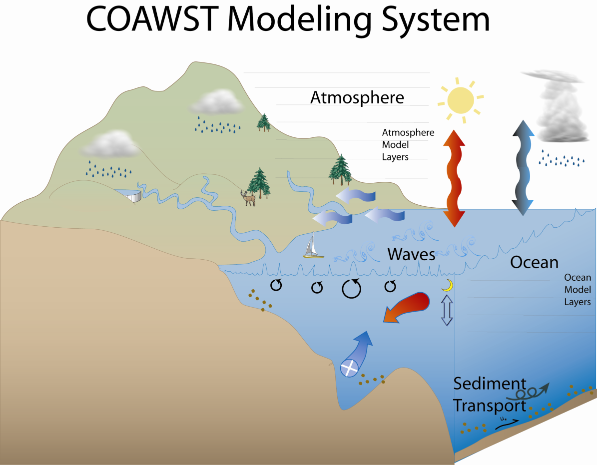

# COAWST模拟系统学习

## COAWST模拟系统简介

http://woodshole.er.usgs.gov/operations/modeling/COAWST/index.html

The **C**oupled-**O**cean-**A**tmosphere-**W**ave-**S**ediment
**T**ransport (**COAWST**) Modeling System is an agglomeration of
open-source modeling components that has been tailored to investigate
coupled processes of the atmosphere, ocean, and waves in the coastal
ocean. The modeling system currently contains:

Coupler: - Model Coupling Toolkit (MCT) v 2.6.0

Ocean: - Regional Ocean Modeling System (ROMS) svn 885

Atmosphere: - Weather Research and Forecasting Model (WRF) v 3.9.1.1

Wave(s): - Simulating Waves Nearshore (SWAN) v 41.20

\- WAVEWATCH III (WW3) v 5.16

> \- Infragravity wave model (InWave) v 1.0

Sediment Transport: - Community Sediment Transport Modeling Systems
(CSTMS)

Sea Ice: - Sea Ice model

Here are some model specific user forums that can provide useful
information:

MCT

http://www.mcs.anl.gov/research/projects/mct/

ROMS

https://www.myroms.org/forum/index.php

WRF

http://forum.wrfforum.com/

SWAN

http://swanmodel.sourceforge.net/

WAVEWATCH III

http://polar.ncep.noaa.gov/waves/wavewatch/

COAWST模拟系统的参考文献：

[Warner, J.C., Armstrong, B., He, R., Zambon, J.B., 2010, Development of
a Coupled Ocean-Atmosphere-Wave-Sediment Transport (COAWST) modeling
system: Ocean Modeling, v. 35, no. 3, p. 230-244.]{.mark}

The main website is:

<http://woodshole.er.usgs.gov/operations/modeling/COAWST/index.html>

For bug reports and Discussion, we are currently using the Trac site:

<https://coawstmodel-trac.sourcerepo.com/coawstmodel_COAWST/>

Please log onto that site to post questions or submit a bug report.

## 需要的第三方库

MPI (MPICH2, Intel MPI, openMPI\...)

netCDF

MCT (Model coupling toolkit)

SCRIP

## 模式耦合

As of COAWST v3.2, the system can run any set of model choices:

[WRF only, ROMS only, SWAN only, WW3 only,]{.mark}

[WRF+ROMS, WRF+SWAN, ROMS+SWAN, WRF+ROMS+SWAN]{.mark}

[WRF+WW3, ROMS+WW3, WRF+ROMS+WW3]{.mark}

We can also run:

-   SWAN only with or without grid refinement,

-   ROMS only with or without grid refinement,

-   WRF only with or without grid refinement (static + moving nest)

-   ROMS+SWAN+WRF with grid refinement in all 3 (WRF with static or
    moving nest). To run with a WRF moving nest, that moving nest needs
    to be the last child grid of the WRF system. We currently only
    support coupling to 1 moving WRF nest.

-   ROMS+WW3+WRF: For WW3, we currnently only allow one wave grid.
    However that WW3 grid can be a different size than any other grids.
    Also ROMS and WRF can have multiple grids, but only 1 WAVCEWATCHIII
    grid (for now). You then need to use SCRIP to compute interpolation
    weights (just as you would for SWAN or any other model).

### (1) To activate model coupling: {#to-activate-model-coupling .标题3}

**#define MCT_LIB** /\* if you have more than one model selected and you
want to couple them.\*/

The following cpp options are activated internally. The user should NOT
list these in their project.h file.

ROMS_COUPLING -- roms is being used and is coupled to another model.

SWAN_COUPLING -- swan is being used and is coupled to another model.

WW3_COUPLING -- wavewatch3 is being used and is coupled to another
model.

WRF_COUPLING -- wrf is being used and is coupled to another model.

AIR_OCEAN -- wrf and roms are active (other models could also be
active).

WAVES_OCEAN -- swan-or-wavewatch3 and roms are active (other models
could also be active).

AIR_WAVES -- swan-or-wavewatch3 and wrf are active (other models could
also be active).

### (2) Some wave-current cpp options that are available for the coupling include

\#**define UV_KIRBY** /\* compute \"surface-average\" current based on
Hwave that will be sent from the ocn to the wav model for coupling\*/

\#**define UV_CONST** /\* send vel = 0 from the ocn to wave model \*/

\#**define ZETA_CONST** /\* send zeta = 0 from the ocn to wave model \*/

\#**define SST_CONST** /\* do not send sst data from roms to wrf \*/

### (3) Atmosphere coupling cpp option

**#define ATM2OCN_FLUXES**

This option specifies that the heat and momentum fluxes as computed by
the atmosphere model will be used in the ocean model. This will allow
both models to be using the identically same fluxes at the interface.
When using this option, you should also use

**#undef BULK_FLUXES**

because the fluxes will be computed by wrf depending on the surface
scheme you select.

### (4) Methods for grid interpolation

**#define MCT_INTERP_WV2AT** /\* this allows grid interpolation between
the wave and atmosphere models \*/

**#define MCT_INTERP_OC2AT** /\* this allows grid interpolation between
the ocean and atmosphere models \*/

**#define MCT_INTERP_OC2WV** /\* this allows grid interpolation between
the ocean and wave models \*/

-   If you use different grids for the ocean, atmosphere, or wave
    > models, then you need to activate the appropriate option above so
    > that the data fields are interpolated between grids.

-   If you have a coupled application with NESTING in ROMS or SWAN or
    > refinement in WRF, then you need to use the appropriate
    > interpolation flag because all the grids talk to all the other
    > grids (for example all WRF grids would communicate to all the
    > ocean grids).

-   If you need any of these \_INTERP\_ cpp options, then you need to
    > create interpolation weights using SCRIP_COAWST. This is described
    > in Section 5 below.

### (5) Methods for grid refinement

**#define NESTING** /\* this activates grid refinement in both roms and
in swan.\*/

### (6) SWAN --or- WAVEWATCH III wave interactions to ROMS or to WRF

[波浪与ROMS或WRF的耦合]{.mark}

The following 3 options are available to allow exchange of wave data to
ROMS for use in bulk_fluxes for computation of ocean surface stress, and
to allow exchange of wave data to WRF for use in MYJSFC and MYNN surface
layer schemes to allow increased bottom roughness of the atmosphere over
the ocean:

**#define COARE_TAYLOR_YELLAND**

Taylor, P. K., and M. A. Yelland, 2001: The dependence of sea surface
roughness on the height and steepness of the waves. J. Phys. Oceanogr.,
31, 572-590.

**#define COARE_OOST**

Oost, W. A., G. J. Komen, C. M. J. Jacobs, and C. van Oort, 2002:New
evidence for a relation between wind stress and wave age from
measurements during ASGAMAGE. Bound.-Layer Meteor., 103, 409-438.

**#define DRENNAN**

Drennan, W.M., P.K. Taylor and M.J. Yelland, 2005: Parameterizing the
sea surface roughness. J. Phys. Oceanogr. 35, 835-848.

### (7) Implementation of wave-current interaction formulation

We added a new method based on the vortex force approach. The method is
described in detail Kumar et al (2012). The new cpp options for this
are:

**#define WEC_MELLOR** radiation stress terms from Mellor 08

**#define WEC_VF** wave-current stresses from Uchiyama et al.

**#define WDISS_THORGUZA** wave dissipation from Thorton/Guza

**#define WDISS_CHURTHOR** wave dissipation from Church/Thorton

**#define** **WDISS_WAVEMOD** wave dissipation from a wave model

**#define** **WDISS_INWAVE** wave dissipation from a InWave model

**#define** **ROLLER_SVENDSEN** wave roller based on Svendsen

**#define** **ROLLER_MONO** wave roller for monchromatic waves

**#define** **ROLLER_RENIERS** wave roller based on Reniers

**#define** **BOTTOM_STREAMING** wave enhanced bottom streaming

**#define** **SURFACE_STREAMING** wave enhanced surface streaming

Additional information is to be added soon. Interested users should read
the [Kumar et al. (2012) paper.]{.mark}

### (8) Drag limiter option

**#define** **DRAGLIM_DAVIS** is a feature added to WRF and SWAN to
limit the ocean roughness drag to be a maximum of 2.85E-3, as detailed
in:

Davis et al, Prediction of Landfall Hurricanes with the Advanced
Hurricane WRF Model, Monthly Weather Review, 136, pp 1990-2005.

In SWAN, this can be activated when using the Komen wind input. For WRF,
it can be activated when using myjsfc or mynn surface layer options.

### (9) Vegetation options

Vegetation module was added to get the 3-D effect of vegetation on wave
and current fields. Details of the implementation are in this paper:

[Beudin, A., Ganju, N., K., Warner, J.C., and Kalra, T. S.,]{.mark}
*"Development of a Coupled Wave-Current-Vegetation Interaction",*
Computers and Geosciences Journal -- Elsevier (In preparation)

The following flags can be used to work with the vegetation module.

**\# define** **VEGETATION** Switch on vegetation module

**\# define** **VEG_DRAG** Drag terms Luhar M. et.al (2011)

**\# define VEG_FLEX** Flexible vegetation terms

**\# define VEG_TURB** Turbulence terms, Uittenbogaard R. (2003)

**\# define VEG_SWAN_COUPLING** Exchange of VEG data btwn. ROMS and SWAN

**\# define VEG_STREAMING** Wave streaming effects

In addition of calculating the effect of vegetation, the vegetation
module can compute wave thrust on the marshes.
海滩沼泽上的波浪运动（植被模块）

**\# define MARSH_WAVE_THRUST** Wave thrust on marshes, Tonelli, M. et
al. (2010)

[This code is based on this reference:]{.mark}

"Tonelli, M., Fagherazzi, Sergio., and Petti., M., 2010: Modeling wave
impact on salt marsh boundaries, Journal of Geophysical Research, 115,
0148-0227"

### (10) InWave options

The following cpp options are available to run the InWave model:

\# **define INWAVE_MODEL** activate InWave model

\# **define INWAVE_SWAN_COUPLING** activate reading of a SWAN 2D spec
file

\# **define DOPPLER** use to turn ON or OFF the effect of currents on
the dispersion relation

\# **define ACX_ADVECTION** use to turn ON or OFF advection of Ac in the
xi direction

\# **define ACY_ADVECTION** use to turn ON or OFF advection of Ac in the
etai direction

\# **define ACT_ADVECTION** use to turn ON or OFF advection of Ac in the
directional direction

\# **define WDISS_ROELVINK** use to turn ON or OFF Roelvink energy
dissipation

\# **define WDISS_GAMMA** use to turn ON or OFF gamma based energy
dissipation

The InWave model is described more in Section 11. For now you can run
InWave forced with a SWAN 2d spec file, or you can impose the wave
action density along an open boundary. [InWave runs coupled to ROMS for
wave-current feedbacks.]{.mark} It can also be run with the WEC options,
wetting drying, sediment, and morphology.

**InWave简介**

InWave is wave model that allows for simulating the infragravity
frequency band with periods between 30 s and 5 minutes. The generation
mechanism is the wind and the restoring force the gravity. These waves
are driven at the boundary by SWAN, computed by the InWave component,
and resolved on the ROMS ocean model grid and interact with the ocean
currents on the infragravity time scale.

## 模式耦合控制文件

### 1 运行COAWST

To Run COAWST, your run script points to an input file. For example, in
the run script above it pointed to coupling_joe_tc.in. The details of
this file are:

Step1) Set the nodes to allocate for each model. This will depend on the
application, number of processors you have access to, etc.

! Number of parallel nodes assigned to each model in the coupled system.

! Their sum must be equal to the total number of processors.

NnodesATM = 1 ! atmospheric model

NnodesWAV = 1 ! wave model

NnodesOCN = 1 ! ocean model

Step 2) Set the coupling interval in seconds.

! Time interval (seconds) between coupling of models.

TI_ATM2WAV = 600.0d0 ! atmosphere to wave coupling interval

TI_ATM2OCN = 600.0d0 ! atmosphere to ocean coupling interval

TI_WAV2ATM = 600.0d0 ! wave to atmosphere coupling interval

TI_WAV2OCN = 600.0d0 ! wave to ocean coupling interval

TI_OCN2WAV = 600.0d0 ! ocean to wave coupling interval

TI_OCN2ATM = 600.0d0 ! ocean to atmosphere coupling interval

Step 3) Enter names of the input files for ROMS, WRF, and SWAN --or-
WW3.

! Enter names of Atm, Wav, and Ocn input files.

! The Wav program needs multiple input files, one for each grid.

ATM_name= namelist.input ! atmospheric model

WAV_name = Projects/JOE_TC/Coupled/INPUT_JOE_TC ! wave model

OCN_name = Projects/JOE_TC/Coupled/ocean_joe_tc.in ! ocean model

Step 4) This is evolving, and we now suggest users to use the
SCRIP_COAWST Fortran code to create a single weights file. We still
allow the older approach of multiple files, but this will go away in
future releases.

! Sparse matrix interpolation weights files. You have 2 options:

! Enter \"1\" for option 1, or \"2\" for option 2, and then list the

! weight file(s) for that option.

SCRIP_WEIGHT_OPTION = 1

!

! Option 1: IF you set \"SCRIP_WEIGHT_OPTION = 1\", then enter name

! of the single netcdf file containing all the exchange

! weights. This file is created using the code in

! Lib/SCRIP_COAWST/scrip_coawst\[.exe\]

SCRIP_COAWST_NAME = Projects/JOE_TC/Coupled/scrip_weights_joe_tc.nc

! Option 2: THIS OPTION WILL BE REMOVED IN FUTURE VERSIONS.

! IF you set \"SCRIP_WEIGHT_OPTION = 2\", then enter

! the names of the separate files. The file names

! must be provided in a specific order. For example:

! W2ONAME == wav1 to ocn1

! wav1 to ocn2

! wav1 to ocn3 \....for all the ocean models.

! wav2 to ocn1

! wav2 to ocn2

! wav2 to ocn3 \....for all the ocean models.

W2ONAME == wav2ocn_weights.nc

W2ANAME == wav2atm_weights.nc

A2ONAME == atm2ocn_weights.nc

A2WNAME == atm2wav_weights.nc

O2ANAME == ocn2atm_weights.nc

O2WNAME == ocn2wav_weights.nc

That completes the coupling.in file. You point to that file to run a
coupled application.

### 2 运行SCRIP_COAWST

SCRIP_COAWST is required to create a netcdf file that contains
interpolation weights. These weights are only needed if you have a
coupled application (more than 1 model) and the models are on different
grids. Then you need to compile and run the SCRIP_COAWST and create the
weights netcdf file. The SCRIP_COAWST needs to be built first, as
described in Section 3. To run the program, you need to edit one of the
scrip_coawst\*.in files. Lets use

COAWST/Lib/SCRIP_COAWST/scrip_coawst_sandy.in as an example.

This Example uses 2 roms grids, 2 swan grids, and 2 wrf grids with the
last wrf grid as a moving grid.

Step 1) Enter name of output netcdf4 file

OUTPUT_NCFILE=\'scrip_sandy_moving.nc\'

!OUTPUT_NCFILE=\'scrip_sandy_static.nc\' ( this line is a comment)

Step 2) Enter total number of ROMS, SWAN, and WRF (max_dom) grids:

NGRIDS_ROMS=2,

NGRIDS_SWAN=2,

NGRIDS_WRF=2,

NGRIDS_WW3=0,

Step 3) Enter name of the ROMS grid file(s):

ROMS_GRIDS(1)=\'../../Projects/Sandy/Sandy_roms_grid.nc\',

ROMS_GRIDS(2)=\'../../Projects/Sandy/Sandy_roms_grid_ref3.nc\',

Step 4) Enter SWAN information:

! -the name(s) of the SWAN grid file(s) for coords and bathy.

! -the size of the SWAN grids, and

! -if the swan grids are Spherical(set cartesian=0) or

! Cartesian(set cartesian=1).

SWAN_COORD(1)=\'../../Projects/Sandy/Sandy_swan_coord.grd\',

SWAN_COORD(2)=\'../../Projects/Sandy/Sandy_swan_coord_ref3.grd\',

SWAN_BATH(1)=\'../../Projects/Sandy/Sandy_swan_bathy.bot\',

SWAN_BATH(2)=\'../../Projects/Sandy/Sandy_swan_bathy_ref3.bot\',

SWAN_NUMX(1)=84,

SWAN_NUMX(2)=116,

SWAN_NUMY(1)=64,

SWAN_NUMY(2)=86,

CARTESIAN(1)=0,

CARTESIAN(2)=0,

! 5) Enter WW3 information

! -the name(s) of the WW3 grid file(s) for x- y- coords and bathy.

! -the size of the WW3 grids (full number of grid center points).

!

WW3_XCOORD(1)=\'../../Projects/Sandy/ww3_sandy_xcoord.dat\',

WW3_YCOORD(1)=\'../../Projects/Sandy/ww3_sandy_ycoord.dat\',

WW3_BATH(1)=\'../../Projects/Sandy/ww3_sandy_bathy.bot\',

WW3_NUMX(1)=84,

WW3_NUMY(1)=64,

Step 6) Enter the name of the WRF input grid(s). If the grid is a

! moving child nest then enter that grid name as \'moving\'.

! Also provide the grid ratio, this is used for a moving nest.

WRF_GRIDS(1)=\'../../Projects/Sandy/wrfinput_d01\',

!WRF_GRIDS(2)=\'../../Projects/Sandy/wrfinput_d02\',

WRF_GRIDS(2)=\'moving\',

PARENT_GRID_RATIO(1)=1,

PARENT_GRID_RATIO(2)=3,

PARENT_ID(1)=0

PARENT_ID(2)=1

Step 7): at the command prompt, run the program as:

./scrip_coawst\[.exe\] scrip_coawst_sandy.in

This should run and write out information about the weights as it
creates the file.

### 3 运行COAWST的建议及功能

\(1\) For WRF, you can have a 2-way nest in WRF, and have this coupled
to roms and /or swan. As of COAWST v3.2, we can now couple ROMS and SWAN
to a moving WRF nest. There can only be 1 moving WRF nest, and it needs
to be the last WRF child grid.

\(2\) For WRF-ROMS coupling, you really should set

**sst_update = 1**

in namelist.input and use the appropriate io_form_auxinput4 settings.
This is correct in svn 876. The sst_update computes the correct TSK in
WRF and should be activated for ocn-atm coupling.

\(3\) Some information about heat fluxes for WRF-ROMS.

If WRF_MODEL is defined:

-   you still have to define EMINUSP to activate exchange of rain and
    evap.

-   SOLAR_SOURCE is needed, otherwise all the heat goes into the surface
    layer only.

-   longwave outgoing component is estimated in Master/mct_roms_wrf.f so
    there is no need to define LONGWAVE_OUT in ROMS

If WRF_MODEL is not defined or you are going to use BULK FLUXES:

BULK_FLUXES (in bulk_flux.F) computes turbulent heat fluxes (latent and
sensible heat), momentum stress and evaporation (used in the fresh water
flux if EMINUPS is also defined -used as salinity surface boundary
condition-). Radiative fluxes (i.e., shortwave and longwave radiation
flux) are not calculated, nor is the rain component of the EMINUSP
calculation. The surface scheme (COARE) implemented in bulk_flux.F
requires:

\- air temperature (usually at 2m)

\- relative humidity (usually at 2m)

\- mean sea level pressure

\- u-wind component (positive east), usually at 10m v-wind component
(positive north), usually at 10m.

With these parameters bulk_flux will estimate latent heat, sensible
heat, u-momentum stress, v-momentum stress and evaporation. Note that in
the ocean.in, you have to specify:

BLK_ZQ (usually 2m)

BLK_ZT (usually 2m)

BLK_ZW (usually 10m)

these numbers should be consistent with the height of the levels of the
surface variables (as said usually wind is at 10m, air temp at 2m,
humidity at 2m, but this might be different depending on your surface
forcing dataset).

Net shortwave should be provided by you meteo forcing. This is not
calculated in bulk_flux.f, but is necessary to compute the full heat
flux term.

Net longwave: you have several choices:

\- provide net longwave in the forcing file

-provide INCOMING longwave in the forcing file and define LONGWAVE_OUT
(ROMS then will estimate the outgoing component based on its SST)

\- do not provide the longwave but instead total cloud cover (in the
forcing file) and ROMS will estimate the net longwave. You do not need
to define CLOUD, as it is defined internally by ROMS if def LONGWAVE

If you want the E-P flux, define EMINUSP and provide in the forcing file
the variable rain, while, as said, evaporation is estimated in
bulk_flux.F.

So, in the end:

#define BULK_FLUXES

#define LONGWAVE or #define LONGWAVE_OUT or provide the net longwave in
the forcing file

#define EMINUSP is needed, otherwise set to zero the surface salinity
fux (#define ANA_SSFLUX and set zero stflx(itrc==isalt) in stflux.h)

#define ATM_PRESS if you want the inverted barometric effect (mean sea
level pressure must be in the forcing file)

## 算例

+-------------------+--------------------------------------------------+
| ***Application*** |                                                  |
+===================+==================================================+
| 6.1 Ducknc        | ROMS only. Wave-current interaction (essentially |
|                   | x-z) for cross-shore flows at Duck, NC.          |
+-------------------+--------------------------------------------------+
| 6.2 Estuary_test2 | ROMS only to test estuarine dynamics, prismatic  |
|                   | channel.                                         |
+-------------------+--------------------------------------------------+
| 6.3               | Idealized inlet with wave and tidal driven       |
| I                 | flows. ROMS+SWAN same grids.                     |
| nlet_test/Coupled |                                                  |
+-------------------+--------------------------------------------------+
| 6.4               | Idealized inlet with wave and tidal driven       |
| In                | flows. ROMS+SWAN different grids.                |
| let_test/DiffGrid |                                                  |
+-------------------+--------------------------------------------------+
| 6.5               | Idealized inlet with wave and tidal driven       |
| Inlet_test/InWave | flows. ROMS+InWave same grids, inlet             |
|                   | configuration with infragravity waves.           |
+-------------------+--------------------------------------------------+
| 6.6               | Idealized inlet with wave and tidal driven       |
| I                 | flows. ROMS+SWAN have the same parent grids for  |
| nlet_test/Refined | roms and swan and the same child grids for roms  |
|                   | and swan.                                        |
+-------------------+--------------------------------------------------+
| 6.7               | Idealized inlet with waves only. SWAN only one   |
| In                | grid, or with grid refinement.                   |
| let_test/Swanonly |                                                  |
+-------------------+--------------------------------------------------+
| 6.8               | ROMS+InWave same grid, sloping beach.            |
| InWave_Shoreface  |                                                  |
+-------------------+--------------------------------------------------+
| [6.9              | Idealized tropical cyclone that travels west     |
| JOE_T             | from a deep ocean basin onto a shelf that slopes |
| C/Coupled]{.mark} | landward to the west. WRF+ROMS+SWAN all 3 on     |
|                   | same grid. Also can be used for WRF-ROMS,        |
|                   | WRF-SWAN, or WRF only.                           |
+-------------------+--------------------------------------------------+
| [6.10             | Idealized tropical cyclone that travels west     |
| JOE_TC            | from a deep ocean basin onto a shelf that slopes |
| /DiffGrid]{.mark} | landward to the west. WRF+ROMS+SWAN with ROMS    |
|                   | and SWAN on same grid, WRF on different grid.    |
+-------------------+--------------------------------------------------+
| 6.11 Rip_current  | ROMS+SWAN same grid, idealized rip current.      |
+-------------------+--------------------------------------------------+
| 6.12 Sandy        | WRF + ROMS + SWAN each with 2 grids, WRF can be  |
|                   | static or moving nest, coarse resolution of      |
|                   | realistic Hurricane Sandy simulation.            |
|                   |                                                  |
|                   | Also distributed as WRF + ROMS + WW3 each with   |
|                   | one grid.                                        |
+-------------------+--------------------------------------------------+
| 6.13 Sed_floc_toy | ROMS only, tests sediment module with            |
|                   | flocculation.                                    |
+-------------------+--------------------------------------------------+
| 6.14 Sedbed_toy   | ROMS only, tests sediment module.                |
+-------------------+--------------------------------------------------+
| 6.15 Trench       | ROMS only, test sediment morphology.             |
+-------------------+--------------------------------------------------+
| 6.16 Veg_test     | ROMS+SWAN, test vegetation module.               |
+-------------------+--------------------------------------------------+
| 6.17 Wetdry       | ROMS only, test wetting/drying algorithms.       |
+-------------------+--------------------------------------------------+
