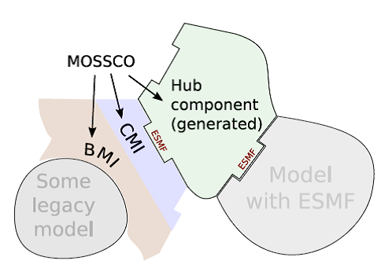
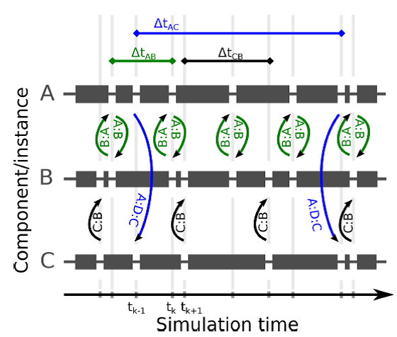
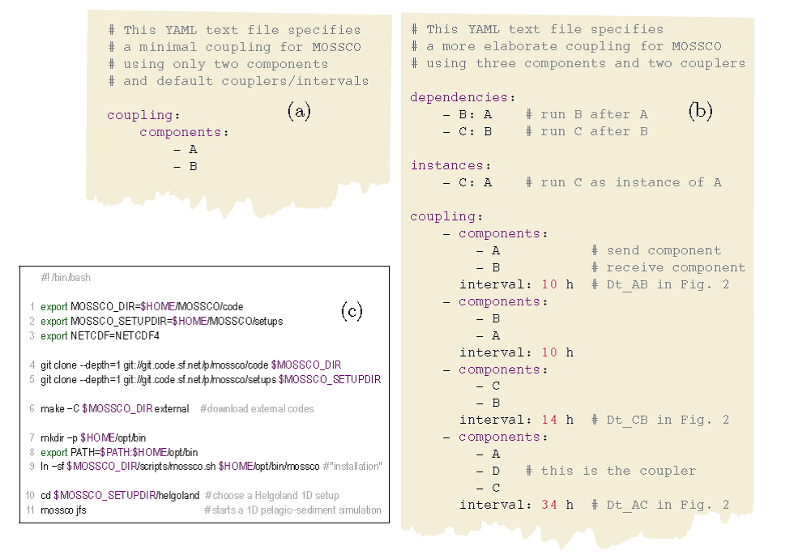
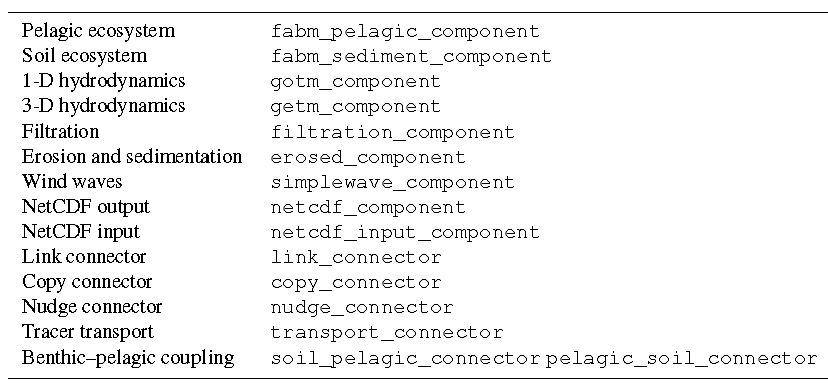
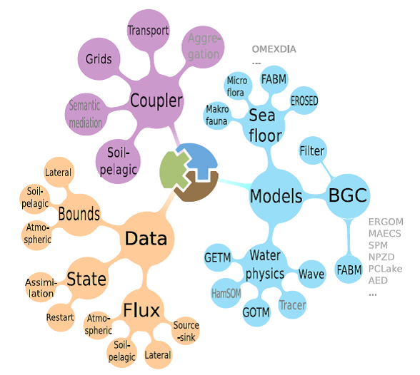

# MOSSCO耦合模拟系统学习

## 1 前言

Modular System for Shelves and Coasts (MOSSCO; <http://www.mossco.de>),
目前MOSSCO尚未有大气模型、波浪模型，包含的模型主要有：水动力模型（GOTM，GETM），生态模型（FABM）和地球生化模型等。

目前近海岸的生态系统模型一般都是经验性的，通常生态和生物地球化学模型都是以模块化的形式，与水动力模型紧密耦合。例如，Pelagic(深海的)
Interactions Scheme for Carbon and Ecosystem Studies (PISCES; Aumont et
al., 2015) has been integrated into the Nucleus for European Modelling
of the Ocean (NEMO; Van Pham et al., 2014) and the Regional Ocean
Modeling System (ROMS; Jaffrés, 2011). The Biogeochemical Flux Model
(BFM) has been integrated into the Massachusetts Institute of Technology
Global Circulation Model (MITgcm) (Cossarini et al., 2017) and ROMS.
这些紧密耦合不仅没有考虑海洋边缘或深海区域的重要过程，他们也缺乏交换的灵活性或测试不同过程的描述。

Bruggeman and Bolding (2014)建立的Framework for Aquatic Biogeochemical
Models (FABM),
可作为0维的生物地球化学过程模型与3D地球物理模型的中间层。FABM已与Modular
Ocean Model (MOM), NEMO, FVCOM (Cazenave et al., 2016), General
Estuarine Transport Model (GETM; Kerimoglu et al., 2017)耦合实施。
FABM包含了超过20种生物地球化学和生态模型，可用于海洋生态系统研究，描述很多水环境过程。

区域耦合模型有：COAWST (Warner et al.,
2010)，区域耦合中的每个模型都以某种特殊的"耦合模式"运行。各模块(component)间通过耦合基础架构链接，诸如Flexible
Modeling System (FMS; Dunne et al., 2012), the Model Coupling Toolkit
(MCT; Warner et al., 2008) and/or the Ocean Atmosphere Sea Ice Soil
(OASIS) coupler (Craig et al., 2017), or the Earth System Modeling
Framework (ESMF; Theurich et al., 2016). 耦合器的比较综述见(Jagers,
2010).

Pelupessy et al. (2017) introduced the Oceanographic Multipurpose
Software Environment (OMUSE) and demonstrated nested ocean and
ocean--wave domain couplings. Their intention is to provide a high-level
user interface and infrastructure for coupling existing and new
oceanographic models whose spatial representations differ greatly, in
particular between Lagrangian- and Eulerian-type representations. The
Community Surface Dynamics Modeling System (CSDMS; Peckham et al., 2013)
even allows for the coupling of models implemented in many different
languages, as long as all of these describe their capabilities in basic
model interface (BMI; Peckham et al., 2013) descriptions. Typically,
however, only three to five domain components are coupled through one of
the above technologies (Alexander and Easterbrook, 2015).

ESMF不仅能实施求解域耦合，还能实施过程耦合。Modeling Analysis and
Prediction Layer (MAPL; Suarez et al., 2007), the Goddard Earth
Observing System version 5
(GEOS-5)包含39个过程模型，通过ESMF实现层级式耦合。Modular Earth Submodel
System (MESSy; Jöckel et al.,
2005)初步实施了大部分的大气过程的链接，并通用化允许用户选择粒度的链接，不用考虑过程与求解域的矛盾(Kerkweg
and Jöckel, 2012)。

MOSSCO系统首次实施近海岸环境模拟的耦合系统，可实施模块化(modular)和灵活性过程（模型）整合与同时间的跨域耦合，主要针对地球系统尺度中的局地过程尺度。MOSSCO系统是基于FABM的灵活性和ESMF基础构架的跨域和多子模型层级式能力而建设的。

## 2 MOSSCO的设计理念

MOSSCO的设计主要是针对实施和改善区域性的近海岸模拟。目标是构建支持局部政策实施的决策支持耦合系统，该耦合系统的特点是：

（1）灵活性：一方面，系统本身可以处理多种小型或大型的耦合模式组件的整合。另一方面，以不同顺序的时空分辨率大小，平等描述0D，1D，2D和3D近海岸系统。灵活性意味着封装现有的模型，创建一个或多个不同的"模型生态系统"，实现单个模型组件的无缝链接，这也是集成系统的持续研发中的重要过程。可灵活地替换组件，对比研究或测试不同模型。

（2）平等性：耦合框架中的所有模型都平等重要地对待，没有哪儿模型比其他的模型更重要。该准则避免水动力模型或大气模型在耦合系统中作为核心枢纽的地位。另外，数据组件与过程组件或模型输出同等重要。关于模型重要性的任何差别都以研究问题来论证，而不只是在技术层面上。随着耦合系统复杂度的增大，平等性要求某一特殊模型的专家能利用系统中其他模型组件的功能，而并不需要也是这些模型的专家。

图1 MOSSCO对模式代码的修改根据BMI-CMI双层策略(Basic model
interface-component model interface)

MOSSCO包装模型的步骤：

**P** repare the user code by splitting it into three phases that
initialise, run, and finalise a model.

**A** dapt the model data structures by wrapping them in ESMF
infrastructure like states and fields.

**R** egister the user's initialise, run, and finalise routines through
ESMF.

**S** chedule data exchange between components.

**E** xecute a user application by calling it from an ESMF driver.

Preparation（准备）：将模型编写为初始化、运行和结束的形式，实施BMI。运行阶段，需要是独立的模型时间步，而不是整个时间循环。

Adaption（修改）：到ESMF的模型内部结构，将数据包装入ESMF通信对象，提供足够的通信元数据。元数据格式有：CF,
CSDMS, GSN。

Registration（注册）：加入用户模型，使用ESMF提供的模板代码。

Scheduling（计划）：MOSSCO以顺序模式、并发模式和混合模式执行耦合模拟。Balaji
et al.
(2016)研究了如何使用混合耦合模式和细粒度，提高包含高并行度和低并行度的耦合系统的计算效率。在Balaji的系统中，一个海洋模式和一个大气模式并发模式运行，在大气组件中，辐射代码与包含有顺序耦合的非辐射大气过程的复合组件执行并发运行。2种执行模式的MOSSCO的组件间的耦合都是显式的，即：scheduler运行connectors和mediator组件，在组件运行之前交换数据。对于顺序执行模式，耦合配置还允许实施内存高效格式，其中在共享数据（总是反映由之前组件得到的最新计算数据）上执行连续的组件（见图2），这样的基于共享数据的顺序耦合可能会引入质量不平衡。

图2 三个耦合组件A, B, C的调度，以及根据成对的耦合配置（图3b）的数据交换

MOSSCO用户使用YAML标记，以文本格式定义耦合。coupling包含components列表\-\--自身包含耦合组件的列表。

图3 耦合设置(YAML)

Execute（执行）：MOSSCO提供基于Python生成器以行星拓扑形式，动态创建ESMF
driver
componnet的功能，作用是耦合系统的scheduler。生成器读取成对的耦合定义（图3），然后生成一个FORTRAN源码文件表示scheduler
component。MOSSCO用户命令提供友好地接口，生成scheduler，编译所有代码，生成一个可执行程序，在多处理器系统上执行。通过设计命令行工具和自动调度组件（基于YAML文本耦合设置），MOSSCO提供重新配置、重新安排、拓展或简化的耦合模拟的快速实施（相比图形化耦合工具CUPID,
Eclipse接口, Dunlap, 2013，仅针对NUOPC）。

MOSSCO耦合层采用FORTRAN语言编写，而大部分的支持结构采用Python语言编写，部分采用bash语法。系统需要：FORTRAN
2003, CMAKE, Git, YAML-Python(\>v2.6)，NetCDF，ESMF(\>v7.0),
MPI。MOSSCO提供半自动安装ESMF。

## 3 MOSSCO组件和工具

由用户需求驱动，目前MOSSCO包含I/O工具、广泛的模型库、耦合功能（见图4和表1）。MOSSCO还拓展了ESNF的API，提供方便处理时间、元数据（属性）、设置和统一化配置文件和耦合框架间科学数据转移的方法。该工具层不是强制使用的，任何基于ESMF的组件都可以无需使用这个工具层与MOSSCO提供的组件耦合。

表1 MOSSCO中耦合的组件，尚有部分组件在开发

图4 MOSSCO的模块化组件：蓝色分支表示新建立的子模型和包装legacy
code的组件；紫色分支表示耦合功能模块；桔色表示输入输出工具。

MOSSCO设计的主要特点是：从0维到3维的空间表征，而保持最大可能范围的耦合设置。该设计原则构建在FABM的维度独立的理念（过程的局部描述，可视为box模型），其中，由水动力模型定义的变量与FABM耦合。MOSCCO推广此理念，是新的生态或化学模型的开发者能从Box模型（0维），升尺度化到水柱（1维）、泥沙平面或垂向断面（2维）以及完全的大气或海洋模式（3维）。

MOSSCO中耦合的模型库有：

正在包装的水动力模型：Hamburg Shelf Ocean Model (HamSOM; Harms, 1997)
and a Lagrangian particle tracer model

深海生态系统组件：fabm_pelagic_component

泥沙和土壤组件：fabm_sediment_component

垂向1D水动力组件（GOTM）：gotm_fabm_component

3D近海岸水动力组件（GETM）：getm_component

粘性沙组件（Delft3D-EROSED）和生物对粘性沙的干扰：erosed_component，benthos_component

生物过滤模型：filtration_component

简化的风浪模型：还需要施加SWAN, WW3和WAM的实际风浪模型

输入和输出工具：netCDF输出（netcdf_component）和netCDF输入（netcdf_input_component）

MOSSCO connector and mediators：以ESMF
state形式的信息包含了每个组件的输出fields，与ESMF
driver通信，每个组件需要的数据也与ESMF driver通信。MOSSCO
connectors是独立的组件，与成对耦合组件间的输出和需要的field连接。MOSSCO区分完全步操作（或操作很少的）field数据的connectors
components和提取及计算输入数据的新的数据输出的mediator组件。

Link, Copy and nudge
connectors：组件间最简单和默认的连接行为是共享与驻留在内存内的单独field的引用（即连接），可被各组件操作。相反，copy_connector在耦合时间复制一个field。nudge_component用来通过加权平均连接的field融合来自2个组件的输出，这个简单地用作数据同化工具，驱动模型的state朝观测state变化或施加边界。

以上connectors仅能用于运行于相同网格的组件之间，但可以用于不同的子分解区域。link_connector仅能用于具有相同子分解区域的组件之间，因此组件访问相同的内存。位于不同网格上的Components需要regridding，在MOSSCO尚在开发中。

## 4 应用案例

## 5 讨论和展望

当legacy code组装到耦合框架界面上时，遇到了4个困难：

（1）变量命名的不一致。解决：GSN

（2）当前模型的子程序深度层级，使得独立相关的功能模块较为困难。例如，某函数模块独立出当前的第3方耦合系统的上下文，模块与很多分散在第3方系统中的很多子程序相关。

（3）组件基于独立运行的模型在开发中，使用自己的IO基础架构测试，仅部分提供他们的state和输入数据场的BMI实施。

（4）在耦合组件交换时需要保证质量和能量守恒。
