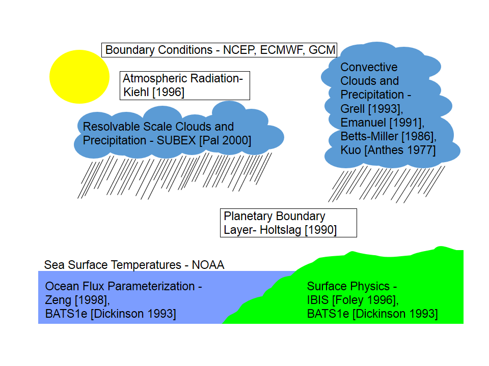
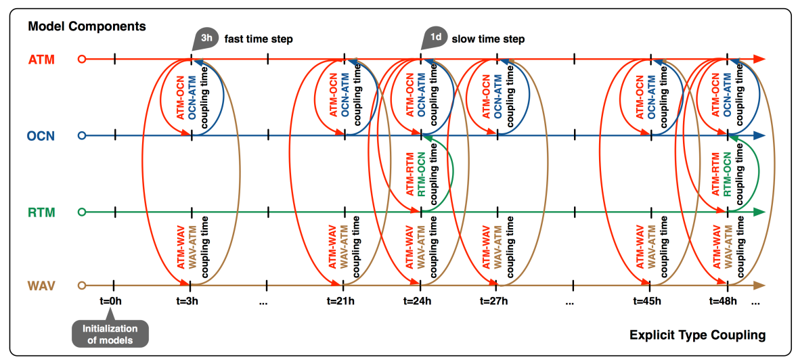
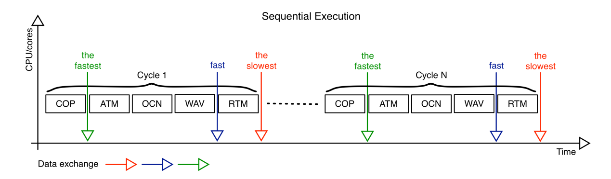
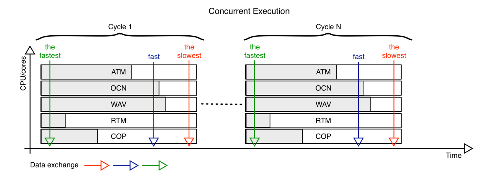
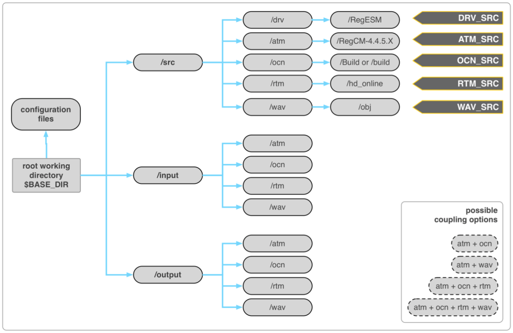

# RegESM: Regional Earth System Model

## 1支持的组件

### 气象(ATM):  {#气象atm .标题3}

RegCM (\>v_4.5), 使用co-processing时，需要补丁代码

WRF_v3.8.1

### 海洋(OCN): {#海洋ocn .标题3}

ROMS_r809

MITgcm_ver_c63s

### 河流(RTM): {#河流rtm .标题3}

HD_v1.0.2

### 波浪(WAV): {#波浪wav .标题3}

WAM (version: Cycle_4.5.3_MPI)

### [co-processing (COP):]{.mark} {#co-processing-cop .标题3}

Paraview_v5.4.1: 需要Catalyst模块以及带图形模型的GPU

## Prerequisites

-   RegESM (驱动程序)

-   ESMF_v7.1.0

-   模型组件(patched以及支持耦合的安装程序)

## 技术文档

## 1、模型设计

RegESM将多个模型组件和在线可视化工具耦合起来，也支持使用简化的接口程序组合其他新的模型组件，这为不同学科的研究人员耦合各中地球系统模型（如波浪、海冰、陆地表面模型,
...）提供了便利。

RegESM目前支持4个模型组件和1个在线可视化组件。

使用ESMF库标准化耦合接口，提供各模型组件之间的高效交互。RegESM的关键逐渐是\"driver\"
(or
\"coupler\")，负责同步各模型组件和定义组件之间的交换（通过交换场变量）。RegESM创建配置文件(exfirld.tbl)建立交换场信息，可修改。模型组件之间交换场的信息定义见"[安装]{.mark}"一节。

ESMF耦合器连接各独立的地球系统模型。各组件分配为网格组件(gridded
component)，之间的交互使用connector定义，National Unified Operational
Prediction Capability
([NUOPC](https://www.earthsystemcog.org/projects/nuopc/))接口定义这些connector。

主要模型组件的交互见图1.

{width="5.076388888888889in"
height="3.329861111111111in"}

图1 RegESM模拟系统的设计：a, 组件；b 目前支持的耦合方向

**多核耦合时间步**

模型组件可以使用不同的耦合时间间隔（时间步），因为模型组件的响应时间和物理过程，这很重要，可以以不同的时间尺度运行。

如图2，

注意：目前的耦合模型，不允许在ATM-OCN, OCN-ATM, ATM-WAV,
WAV-ATM耦合方向上设置不同的耦合时间步。WAV组件必须使用与ATM和OCN组件相同的耦合时间间隔。

{width="5.35625in"
height="2.4444444444444446in"}

图2 四个模型组件串行运行方式的耦合

**模型执行类型**

模型组件的启动或关闭，使用驱动程序的顶层配置文件(namelist.rc)来控制。配置文件还负责为模型组件分配计算资源（CPUs）。此时，模型组件可以以不同的处理器数或核数以并行(concurrent)方式执行。目前，RegESM支持sequential和concurrent两种执行方式（图3和图4）。

串行执行方式中，所有模型组件和驱动程序都可访问计算资源中的变量，除了RTM组件，RTM组件与OCN组件共享最后一个核（除非在驱动程序namelist文件中定义了其他的核），因为RTM模型没有MPI并行化，仅使用1个核（计算量很小）。这种模式下，模型依次运行，其中的一个模型组件要等待其他所有模型组件都运行完毕，才能继续运行。在串行运行完模型组件后，模型之间交换数据，然后再依次继续开始运行，直到数据交换时刻。如图3所示。

{width="5.768055555555556in"
height="1.7006944444444445in"}

图3 串行执行模式

如图4，并行执行模式下，各模型组件使用自己的计算资源(CPU/核心)和驱动程序，而[RTM模型组件]{.mark}可配置使用或不使用自己的资源，见"[使用"一节]{.mark}的namelist.rc。驱动程序使用所有可获得的核心资源交换各模型组件之间的数据、实施插值或重新分配计算资源。驱动器使用[配置文件(namelist.rc)]{.mark}为各模型组件分配不同数目的CPUs/核心。

{width="5.385416666666667in"
height="1.9583333333333333in"}

图4 并行执行模式

## 2、算例

2015年2月\~4月执行的测试算例。

### 2.1三个模型组件：ATM-OCN-RTM {#三个模型组件atm-ocn-rtm .标题3}

大气模式RegCM模拟设置2种分辨率网格：15km,
50km；海洋模式ROMS使用1/12°(\~1
km)分辨率的网格。模拟5天的过程。测试大气模拟区域大小对结果的影响。

### 2.2 耦合模拟系统算例 {#耦合模拟系统算例 .标题3}

耦合时间间隔

并行执行

串行执行

### 2.3 Co-processing Component: ATM-OCN-COP {#co-processing-component-atm-ocn-cop .标题3}

## 3、安装

RegESM的安装主要分3个部分：

[（1）]{.mark}准备工作环境：安装NetCDF, ESMF等第三方库。

[（2）]{.mark}安装支持耦合的模型组件：各模型组件（即RegCM, ROMS, MITgcm,
HD,
WAM），这些模型必须支持耦合。由于独立运行的模型组件的不同设计，通过不同方式实现耦合支持：

2.1
RegCM\_[v4.6]{.mark}，无需额外修改或应用补丁（使用[---enable-cpl]{.mark}编译）。使用COP组件时，用户需要对RegCM模型应用补丁。

2.2
ROMS_r809，用户需要使用轻量级patch启用耦合功能。使用patch重写从文件读取输入驱动数据到内容的部分代码。

2.3 MITgcm有相关模块支持耦合，已经有RegESM下的MITgcm版本代码。

2.4 HD和WAM已做了大量修改，需要用户自己索要代码。

2.5
无需任何patch和其他文件来启用在线可视化支持，但大气模型组件需要打补丁。

[（3）]{.mark}安装RegESM：最后一步，所有模型组件都要使用驱动器编译合并为一个单独的可执行程序。驱动程序主要控制模型组件及其相互之间的交互。

## 3.1准备安装环境

有一个sh程序安装RegESM的基本依赖库：[install-deps.sh]{.mark}

### 安装Hierarchical Data Format (HDF5) {#安装hierarchical-data-format-hdf5 .标题3}

To install zlib:

cd \$PROGS

wget http://zlib.net/zlib-1.2.8.tar.gz

tar -zxvf zlib-1.2.8.tar.gz

cd zlib-1.2.8

export CC=icc

export FC=ifort

./configure \--prefix=\`pwd\`

make

make install

### 安装HDF5 {#安装hdf5 .标题3}

cd \$PROGS

wget
https://support.hdfgroup.org/ftp/HDF5/releases/hdf5-1.8.11/src/hdf5-1.8.11.tar.gz

tar -zxvf hdf5-1.8.11.tar.gz

./configure \--prefix=\`pwd\` \--with-zlib=\$PROGS/zlib-1.2.8
\--enable-fortran \--enable-cxx CC=icc FC=ifort CXX=icpc

make

make install

### 安装NetCDF {#安装netcdf .标题3}

[安装netCDF-C:]{.mark}

cd \$PROGS

wget ftp://ftp.unidata.ucar.edu/pub/netcdf/old/netcdf-4.3.0.tar.gz

tar -zxvf netcdf-4.3.0.tar.gz

cd netcdf-4.3.0

mkdir src

mv \* src/.

cd src

./configure \--prefix=\$PROGS/netcdf-4.3.0 CC=icc FC=ifort
LDFLAGS=\"-L\$PROGS/zlib-1.2.8/lib - L\$PROGS//hdf5-1.8.11/lib\"
CPPFLAGS=\"-I\$PROGS/zlib-1.2.8/include -I/\$PROGS/hdf5-
1.8.11/include\"

make

make install

export LD_LIBRARY_PATH=\$PROGS/netcdf-4.3.0/lib:\$LD_LIBRARY_PATH

[安装netCDF-C++:]{.mark}

cd \$PROGS

wget ftp://ftp.unidata.ucar.edu/pub/netcdf/netcdf-cxx-4.2.tar.gz

cd netcdf-cxx-4.2

mkdir src

mv \* src/.

cd src

./configure \--prefix=\$PROGS/netcdf-cxx-4.2 CC=icc CXX=icpc
LDFLAGS=\"-L\$PROGS/zlib-1.2.8/lib - L\$PROGS/hdf5-1.8.11/lib
-L\$PROGS/netcdf-4.3.0/lib\" CPPFLAGS=\"-I\$PROGS/zlib-1.2.8/include -
I/\$PROGS/hdf5-1.8.11/include -I\$PROGS/netcdf-4.3.0/include\"

make

make install

[安装netCDF-FORTRAN:]{.mark}

cd \$PROGS

wget ftp://ftp.unidata.ucar.edu/pub/netcdf/netcdf-fortran-4.2.tar.gz

cd netcdf-fortran-4.2

mkdir src

mv \* src/.

cd src

./configure \--prefix=\$PROGS/netcdf-fortran-4.2 CC=icc FC=ifort
LDFLAGS=\"-L\$PROGS/zlib-1.2.8/lib - L\$PROGS/hdf5-1.8.11/lib
-L\$PROGS/netcdf-4.3.0/lib\" CPPFLAGS=\"-I\$PROGS/zlib-1.2.8/include -
I/\$PROGS/hdf5-1.8.11/include -I\$PROGS/netcdf-4.3.0/include\"

make

make install

连接C, C++,
FORTRAN路径下的include和Lib到一个单独的路径（NETCDF环境变量）：

cd \$PROGS/netcdf-4.3.0/lib

ln -s ../../netcdf-cxx-4.2/lib/\* .

ln -s ../../netcdf-fortran-4.2/lib/\* .

ln -s ../../netcdf-cxx-4.2/include/\* .

ln -s ../../netcdf-fortran-4.2/include/\* .

export NETCDF=\$PROGS/netcdf-4.3.0

export PATH=\$NETCDF/bin:\$PATH

### 安装并行化NetCFD(可选) {#安装并行化netcfd可选 .标题3}

该选项可选的，如果要使用ESMF NetCDF
IO功能输出交换场，需要使用[parallel-netcdf (1.3.1):]{.mark}

cd \$PROGS

wget
http://ftp.mcs.anl.gov/pub/parallel-netcdf/parallel-netcdf-1.3.1.tar.gz

tar -zxvf parallel-netcdf-1.3.1.tar.gz

cd parallel-netcdf-1.3.1

./configure \--prefix=\`pwd\`
\--with-mpi=/opt/openmpi/1.6.5/intel/2013psm FC=mpif90 F77=mpif90
CXX=mpiccpc

make

make install

export PNETCDF=\$PROGS/parallel-netcdf-1.3.1

如果MPI的安装路径和执行路径改变了，编译时需要给出正确的路径：[\--with-mpi]{.mark}配置参数。

### 安装Apache Xerces C++ {#安装apache-xerces-c .标题3}

该程序库主要用于安装ESMF，作用是：以[XML格式]{.mark}读写网格定义和属性（场、组件和状态层）。

cd \$PROGS

wget
http://apache.bilkent.edu.tr//xerces/c/3/sources/xerces-c-3.1.1.tar.gz
tar -zxvf xerces-c-3.1.1.tar.gz

cd xerces-c-3.1.1

./configure \--prefix=\$PROGS/xerces-c-3.1.1 CC=icc CXX=icpc

make

make install

### 安装Earth System Modeling Framework (ESMF) {#安装earth-system-modeling-framework-esmf .标题3}

ESMF的安装步骤信息见：....

安装前，需注意：

（1）ESMF版本\>7.1.0b20

（2）如果使用调试功能(debug_level\>2)，检查交换场，建议安装并行IO的netCDF支持（安装ESMF时，设置相关的NETCDF和PNETCDF的环境变量）。

（3）从NETCDF_v4.3.0开始，C++接口修改了，ESMF与之不兼容。因此，最好NetCDF版本\<=4.3.0

[安装ESMF的环境变量]{.mark}定义为：

export ESMF_OS=Linux

export ESMF_TESTMPMD=OFF

export ESMF_TESTHARNESS_ARRAY=RUN_ESMF_TestHarnessArray_default

export ESMF_TESTHARNESS_FIELD=RUN_ESMF_TestHarnessField_default

export ESMF_DIR=/okyanus/users/uturuncoglu/progs/esmf-7.1.0b20

export ESMF_TESTWITHTHREADS=OFF

export ESMF_INSTALL_PREFIX=\$PROGS/esmf-7.1.0b20/install_dir

export ESMF_COMM=intelmpi

export ESMF_TESTEXHAUSTIVE=ON

export ESMF_BOPT=O

export ESMF_OPENMP=OFF

export ESMF_SITE=default

export ESMF_ABI=64

export ESMF_COMPILER=intel

export ESMF_PIO=internal

export ESMF_NETCDF=split

export ESMF_NETCDF_INCLUDE=\$PROGS/netcdf-4.4.0/include

export ESMF_NETCDF_LIBPATH=\$PROGS/netcdf-4.4.0/lib

export ESMF_XERCES=standard

export ESMF_XERCES_INCLUDE=\$PROGS/xerces-c-3.1.4/include

export ESMF_XERCES_LIBPATH=\$PROGS/xerces-c-3.1.4/lib

使用其他编译环境或集群时，需要修改环境变量，使用不同版本的MPI或操作系统。

使用如下命令编译和安装ESMF：

cd \$ESMF_DIR

make \>&make.log

make install

安装完毕ESMF后，创建新的环境变量如[ESMF_INC,
ESMF_LIB和]{.mark}ESMFMKFILE，帮助RegESM配置脚本找到ESMF库需要的文件位置。

export ESMF_INC=\$ESMF_INSTALL_PREFIX/include

export
ESMF_LIB=\$ESMF_INSTALL_PREFIX/lib/libO/Linux.intel.64.intelmpi.default

export
ESMFMKFILE=\$ESMF_INSTALL_PREFIX/lib/libO/Linux.intel.64.intelmpi.default/esmf.mk

自此，最好安装调试版本的ESMF（修改ESMF_BOPT环境变量为g,
优化版本为O），执行make
clean后重新编译安装，安装优化的和调试的ESMF库，有助于发现耦合模型造成的错误来源。最终运行RegESM是使用优化版的ESMF。

## 3.2安装模型组件

接下来是安装模型组件。用户可安装到文件系统中的设定位置，输出在耦合模型配置阶段的安装路径。安装方法严格按照下面的介绍，可防止安装阶段的问题并及时解决。

模型组件和驱动程序的安装采用层级路径，有助于简化安装步骤。[下图]{.mark}显示了安装RegESM的示例路径结构。

{width="5.511111111111111in"
height="3.5833333333333335in"}

图1安装RegESM的建议路径结构

可见，各模型组件的源码、输入和输出，都有自己的路径（如驱动程序在/drv）。除了安装路径结构，[配置文件、运行脚本（OpenPBS,
LSF等）、输入输出文件]{.mark}可以放在[主工作路径(BASE_DIR)]{.mark}。RegESM可执行程序(DRV_SRC)使用软连接放置在工作路径，使用如下命令：

cd \$BASE_DIR

ln -s \$DRV_SRC/regesm.x

### 安装区域性大气模式RegCM {#安装区域性大气模式regcm .标题3}

mkdir \$ATM_SRC

cd \$ATM_SRC

wget
https://gforge.ictp.it/gf/download/frsrelease/252/1580/RegCM-4.5.0.tar.gz

tar -zxvf RegCM-4.5.0.tar.gz

cd RegCM-4.5.0

./bootstrap.sh #不同的操作系统和环境，生成合适的config文件。

./configure \--prefix=\`pwd\` \--enable-cpl CC=gcc FC=gfortran
\--no-create \--no-recursion

make

make install

ATM_SRC环境变量指向大气模式的安装路径，可以替换为任何合理的位置，可以修改编译器。目前的设计是，各模型组件没有任何ESMF相关代码，用于无需使用安装的ESMF库来安装各模型组件。所有ESMF相关代码都放在driver
（RegESM）下。模型安装几乎与standalone版本的RegCM模型安装一样，除了打开\--enable-cpl配置选项来支持耦合功能。

RegCM的其他配置参数见Doc/README.namelist，当以耦合模式运行模型时，需要激活这些配置参数，使其与其他模型组件（如海洋、波浪或两者）交互。耦合模拟时，需要在RegCM配置文件中打开耦合相关参数。

**Physics parameters:**

&physicsparam

\...

iocncpl = 1,

iwavcpl = 1,

\...

此时，iocncpl激活与海洋模式的耦合(ROMS或MITgcm)，iwavcpl激活与波浪模式耦合(WAM)。当与海洋和波浪两种模式都耦合时，两个参数都要启用。

**Coupling parameters:**

&cplparam

cpldt = 10800.,

zomax = 0.005,

ustarmax = 1.2,

/

cpldt是耦合时间间隔，必须与驱动程序namelist文件(namelist.rc)中设置的耦合时间间隔抑制。zomax是表面糙率阈值，ustarmax是摩阻速度阈值，这两参数仅在波浪耦合模式下有效。使用[zomax和ustarmax]{.mark}保持大气模式稳定，用户需要调试这2个参数，确定[尽可能大]{.mark}的合理取值。

\<4.7.1版本的RegCM从github不能下载了！[RegCM_v4.6]{.mark}代码在[GTC2018-demo]{.mark}中src下。

### 安装区域性大气模式(WRF) {#安装区域性大气模式wrf .标题3}

开发者计划用WRF模式代替RegCM模式，原因是RegCM模式的非静水压力核心的稳定性问题（现在解决了吗？）。

希望能在高分辨率（\<3
km）下实施耦合模拟系统中的稳定计算，计划应用WRF的在线嵌套(online
nested)网格功能。

已经有WRF_3.8.1_cpl可下载！

### 安装区域性海洋模型(ROMS) {#安装区域性海洋模型roms .标题3}

为启用ROMS的耦合功能，需要使用补丁程序，补丁对ROMS代码做小的修改。因为ROMS有很多版本（Rutergers
University\'s ROMS, CROCCO (or ROMS_AGRIF)，UCLA ROMS, ROMS with
sea-ice），没有所有版本ROMS都适用的补丁程序。

目前的RegESM使用ROMS-r809的补丁程序创建耦合版本的ROMS。另外，海冰branch有与CICE模型耦合的功能，但这一版本未在RegESM中测试。所有的补丁程序在[[tools](https://github.com/uturuncoglu/RegESM/tree/master/tools)/ocn/]{.mark}。将来可以修改补丁程序，使其适用于新版本的ROMS。

ROMS-r809在[GTC2018-demo]{.mark}中src下；或者用SVN下载r809

下载ROMS和打补丁的命令：

svn checkout -r 809 \--username [Lijian1984]{.mark}
https://www.myroms.org/svn/src/trunk roms-r809

cd roms-r809

wget
https://raw.githubusercontent.com/uturuncoglu/RegESM/master/tools/ocn/roms-r809.patch

patch -p 3 \< roms-r809.patch

激活ROMS的耦合功能，用户需要在头文件(\*.h)中添加如下的CPP标记来创建特定应用：

  -----------------------------------------------------------------------
  CPP Flag               Description
  ---------------------- ------------------------------------------------
  REGCM_COUPLING         Activates coupling with atmospheric model
                         component

  MODIFIED_CALDATE       Fix bug in ROMS caldate subroutine

  HD_COUPLING            Activates coupling with river routing model
                         component

  PERFECT_RESTART        It requires to restart the coupled modeling
                         system (do not forgot to set the LcycleRST == F
                         and NRST for daily restart output)
  -----------------------------------------------------------------------

注意：实际应用计算，建议使用[ATM_PRESS和SHORTWAVE]{.mark}的CPP命令。

安装ROMS和实际建模，请参考ROMS的使用手册。

### 安装MITgcm {#安装mitgcm .标题3}

安装耦合支持的[MITgcm_c63s]{.mark}，首先要激活ESMF功能。已经有RegESM系统下的[MITgcm的代码]{.mark}。可以使用[官方的MITgcm文档]{.mark}安装和创建实际算例。

### 安装HD {#安装hd .标题3}

需要联系开发者获取修改版本的HD模型代码。用户也可以改写[自己的RTM]{.mark}组件到耦合模拟系统，修改方法与RegESM源码中的mod_esmf_rtm.F90一样。

安装修改版的HD模型来支持耦合，用户需要修改Makefile，增加-DCPL预处理标识即可，输入命令：

mkdir \$RT\<\_SRC

tar --zxvf hd_online.tar.gz

cd hd_online

make

make install

### 安装第3代海洋波浪模型(WAM) {#安装第3代海洋波浪模型wam .标题3}

ECMWF的WAM版本是耦合模型Cycle_4.5.3_MPI，修改了原始的WAM模型代码使其称为耦合模拟系统中的一个组件。另外，由于license限制，用户需要联系RegESM开发者获取修改版本的WAM模型。

mkdir \$WAM_SRC

tar -zxvf wav.tar.gz

cd mk

./create_binaries

Note that user need to edit hidden .dirset file to change the
installation path (PRODADMDIR) and FCFLAGS. In this case, the FCFLAGS
must include -DCPL to activate coupling support. You might also need to
modify the make_netcdf and pnetcdf.mk to point correct path for NetCDF
library installation.

## 3.3安装RegESM

安装完毕RegCM, ROMS or
MITgcm后，需要安装RegESM的驱动程序。RegESM使用各模型组件的目标文件(.o)、模块文件(.mod)和头文件(\*.h)来创建静态链接库文件，如大气模式的libatm.a、海洋模式的libocn.a，河流模式的librtm.a，波浪模式的libwav.a，在线可视化的libcop.a。使用静态链接库文件创建单独的RegESM可执行程序来运行各模型组件。

需要ESMF库编译在driver一侧的ESMF相关组件。[配置文件]{.mark}通过[环境变量ESMF_LIB]{.mark}找到安装ESMF库的路径。如果ESMF_LIB环境变量指向ESMF共享库(libesmf.so)和配置文件(esmf.mk)的路径，则RegESM使用它们。如果没有定义ESMF_LIB，用户需要使用\--with-esmf指定EMSF库的路径。

RegESM的文档位于docs/路径下。

[安装使用4个模型组件]{.mark}(ATM, OCN, RTM 和 WAV)的RegESM命令如下：

cd \$ESM_SRC

git clone https://github.com/uturuncoglu/RegESM.git

cd RegESM

./bootstrap.sh

./configure \--prefix=\$ESM_SRC/RegESM \--with-atm=\$ATM_SRC
\--with-ocn=\$OCN_SRC/Build \--with-rtm=\$RTM_SRC
--with-wav=\$WAV_SRC/obj CC=icc FC=ifort

make

make install

如果RegESM使用少一些模型组件，在配置脚本中可以修改参数，可选模型组件有：ATM-OCN,
ATM-OCN-RTM, ATM-WAV。配置参数\--with-atm, \--with-ocn,
\--with-rtm和\--with-wav分别指向模型组件的安装路径。例如ROMS，\--with-ocn必须指向\"Build\"路径（包含ROMS安装的编译源码文件），或者MITgcm的\"build\"路径。对于波浪组件(WAV)，\--with-wav必须指向\"obj\"路径。

配置脚本可以检查开关文件，能找到正确海洋模型组件(ROMS or
MITgcm)，编译选择的模型组件需要的文件。另外，配置脚本还能检查ROMS安装路径，来启用在driver中的数据交换子程序的海冰相关部分。用户无需设置使用海冰功能版本的ROMS任何其他选项。

注意：**\$ESM_SRC**是RegESM安装的主路径。

## 4、使用

运行RegESM模型，用户需要修改2个驱动程序配置文件，以及各模型组件的配置文件。

-   [交换场信息表(exfield.tbl)]{.mark}

-   [驱动程序配置文件(namelist.rc)]{.mark}

然后，用户就可运行RegESM了。上面2个配置文件必须放在与RegESM可执行程序相同路径下。

### 4.1exfield.tbl {#exfield.tbl .标题3}

定义交换场及其属性（描述、单位、网格位置等）。例子：

**ATM-OCN:**

6 atm2ocn T

taux:eastward_10m_wind_stress:2d:bilinear:cross:u:N/m2:m2/s2:cf3:0.0:F

tauy:northward_10m_wind_stress:2d:bilinear:cross:v:N/m2:m2/s2:cf3:0.0:F

psfc:surface_air_pressure:2d:bilinear:cross:cross:mb:mb:1.0:0.0:F

swrd:shortwave_radiation:2d:bilinear:cross:cross:W/m\^2:Cm/s:cf2:0.0:T

sflx:water_flux_into_sea_water:2d:bilinear:cross:cross:kg/m\^2s:m/s:0.001:0.0:T

nflx:surface_heat_flux:2d:bilinear:cross:cross:W/m\^2:Cm/s:cf2:0.0:T

1 ocn2atm T

sst:sea_surface_temperature:2d:bilinear:cross:cross:C:K:1.0:273.16:F

从例子可以看出，文件有对各耦合方向的[头分段]{.mark}(header
section)。此时，头分段中定义的交换场数目必须与头分段后面的场数目一致。目前RegESM支持的耦合分段有：

-   **atm2ocn** - sending fields from ATM to OCN (i.e. heat, momentum
    and fresh water fluxes)

-   **atm2rtm** - sending fields from ATM to RTM (surface and
    sub-surface runoff)

-   **atm2wav** - sending fields from ATM to WAV (i.e. surface wind
    components)

-   **atm2cop** - sending fields from ATM to COP (all available 2d/3d
    fields)

-   **ocn2atm** - sending fields from OCN to ATM (sea surface
    temperature, ice thickness, dynamic masking)

-   **ocn2cop** - sending fields from OCN to COP (all available 2d
    fields)

-   **rtm2ocn** - sending fields from RTM to OCN (river discharge)

-   **rtm2cop** - sending fields from RTM to COP (all available fields)

-   **wav2atm** - sending fields from WAV to ATM (surface roughness
    etc.)

-   **wav2cop** - sending fields from WAV to COP (all available fields)

头分段中接下来的参数是启用(T)或不启用(F)对unmapped网格点的插值支持(2步插值:bilear +
nearest
neighbour)。此时，建议启用插值支持。ESMF库将来的计划是支持通过海岸线或unmapped网格点out-of-the-box的插值。

头分段中场定义的详细信息如下表：

  ----------------------------------------------------------------------------
  \#   Column Name     Description
  ---- --------------- -------------------------------------------------------
  1    Short Name      The short name for exchange field. See the available
                       exchange field names from following table.

  2    Standard Name   The standard name for exchange field

  3    Dimension of    2d for two-dimensional and 3d for three-dimensional
       Variable        fields

  4    Interpolation   The type of interpolation that is used to transfer data
       Type            form source to destination grid. It can be defined
                       as bilinear, conserv, nearstod, neardtos and none. When
                       transferring data from RTM component to the ocean model
                       the interpolation type must be selected as nearstod.
                       The bilinear type interpolation type must be use to
                       apply conservation correction to the field (bilinear +
                       conservation)

  5    Source Grid     This field basically used to define the location of the
       Point           source field in the computational grid definition (i.e.
                       Arakawa types). It can be defined
                       as cross, dot, u and v.

  6    Destination     Same with previous but for destination grid
       Grid Point      

  7    Source Field    It is just for information. The model does not use this
       Unit            field. The space character is not allowed!

  8    Destination     Same with previous but for output field.
       Field Unit      

  9    Scale Factor    Used for the unit conversion of the exchange field. The
                       source field is multiplied by this scale factor after
                       interpolation. The user can define scale factor as a
                       numerical value or can use following predefined
                       values: cf1 - rho0\*cp (rho0 = 1025.0 kg/m\^3 is water
                       density, and cp = 3985.0 J/kg/K is heat capacity
                       ), cf2 - 1/cf1, cf3 - 1/rho0. It is also possible to
                       use negative symbol (-) along with the shortcuts such
                       as --cf1.

  10   Add Offset      It is used for unit conversion of the exchange filed.
                       The value is added to the source field after applying
                       scale factor. The combination of the scale
                       factor and add offset can be used to convert the units.

  11   Conservation    It can be T or F. If it is defined as True (T), then
                       driver applies the difference of source and destination
                       field integral to the destination field. It can be
                       applied in field basis. In general, it can be activated
                       for heat and mass fluxes. Also note that the custom
                       conservation code is uses global conservation.
  ----------------------------------------------------------------------------

  -----------------------------------------------------------------------------------------------------------------------------------
  ATM    ATM                    OCN                       RTM                       WAV                      COP
  ------ ---------------------- ------------------------- ------------------------- ------------------------ ------------------------
  ATM    \-                     psfc (Surface Pressure,   rnof (Surface Runoff,     wndu (Zonal Wind         [ALL]{.mark}
                                mb), tsfc (Air            m/s), snof (Sub-surface   Component at 10 meter,   + topo (Topography,
                                Temperature at 2 meter,   Runoff, m/s)              m/s), wndv (Meridional   m), mask (Lan-sea mask,
                                K), qsfc (Specific                                  Wind Component at 10     unitless), tlev (Air
                                Humidity at 2 meter,                                meter,                   Temperature in Height
                                kg/kg), lwrd (Net                                   m/s), wspd (Surface Wind Levels,
                                Longwave Radiation,                                 Speed at 10 meter,       K), qlev (Relative
                                W/m\^2), dlwr (Downward                             m/s), wdir (Surface Wind Humidity in Height
                                Longwave Radiation,                                 Direction at 10 meter,   Levels,
                                W/m\^2), lhfx (Latent                               Radian), ustr (Surface   0-1), ulev (Zonal Wind
                                Heat Flux,                                          Frictional Velocity at   Component in Height
                                W/m\^2), shfx (Sensible                             10 meter, m/s)           Levels,
                                Heat Flux,                                                                   m/s), vlev (Meridional
                                W/m\^2), prec (Total                                                         Wind Component in Height
                                Precipitation,                                                               Levels,
                                m/s), wndu (Zonal Wind                                                       m/s), wlev (Vertical
                                Component at 10 meter,                                                       Wind Component in Height
                                m/s), wndv (Meridional                                                       Levels,
                                Wind Component at 10                                                         m/s), cldfrc (Cloud
                                meter, m/s), swrd (Net                                                       Fraction,
                                Shortwave Radiation,                                                         0-1), cldlwc (Cloud
                                W/m\^2), dswr (Downward                                                      Liquid Water Content,
                                Shortwave Radiation,                                                         kg/kg)
                                W/m\^2), taux (Zonal                                                         
                                Surface Wind Stress                                                          
                                Component at 10 meter,                                                       
                                N/m\^2 or                                                                    
                                Pa), tauy (Meridional                                                        
                                Surface Wind Stress                                                          
                                Component at 10 meter,                                                       
                                N/m\^2 or                                                                    
                                Pa), wspd (Surface Wind                                                      
                                Speed at 10 meter,                                                           
                                m/s), wdir (Surface Wind                                                     
                                Direction at 10 meter,                                                       
                                Radian), ustr (Surface                                                       
                                Frictional Velocity at 10                                                    
                                meter, m/s), nflx (Net                                                       
                                Surface Heat Flux,                                                           
                                W/m\^2), sflx (Net                                                           
                                Surface Freshwater Flux                                                      
                                E-P, m/s), snow (Liquid                                                      
                                Water Equivalent of Snow                                                     
                                Thickness, kg/m\^2)                                                          

   OCN   sst (Sea Surface       \-                        \-                        \-                       ALL + depth (Bathymetry,
         Temperature,                                                                                        m), mask, (Land-Sea
         degC), sit (Sea Ice                                                                                 Mask, 0-1), ssh (Sea
         Thickness,                                                                                          Surface Height,
         m), msk (Dynamic                                                                                    m), usfc (Zonal
         Land-Sea Mask, 0-1)                                                                                 Component of Surface
                                                                                                             Current,
                                                                                                             m/s), vsfc (Meridional
                                                                                                             Component of Surface
                                                                                                             Current, m/s)

   RTM   \-                     rdis (River Discharge,    \-                        \-                       ALL
                                m\^3/s or m/s as surface                                                     
                                boundary condition)                                                          

   WAV   zo(Surface Roughness   \-                        \-                        \-                       ALL
         Length, m),                                                                                         
         ustar (Surface                                                                                      
         Frictional Velocity at                                                                              
         10 meter,                                                                                           
         m/s), tauw (Unknown)                                                                                

   COP   \-                     \-                        \-                        \-                       \-
  -----------------------------------------------------------------------------------------------------------------------------------

### 4.2 namelist.rc {#namelist.rc .标题3}

### 4.3运行RegESM {#运行regesm .标题3}

运行耦合模型的方式与运行独立的模型组件是一样的。耦合模拟时，[所有模型组件的配置文件必须与可执行程序放在同一个路径下]{.mark}。

PBS作业脚本(2个模型组件，RegCM-ROMS):

mpirun -v ./regesm.x regcm.in_MED50km \>& regesmout.txt

mpirun -8 ./regesm.x regcm.in

LSF作业脚本(2个模型组件，RegCM-ROMS):

mpirun.lsf ./regesm.x regcm.in_MED50km med12.in \> regesmout.txt

SLURM作业脚本(3个模型组件，RegCM+ROMS+COP)

ulimit -s unlimited

mpirun time ./regesm.x regcm.in_d2 ocean_gom03_N60.in
\>&regesmout_r2\_\${SLURM_NTASKS}.txt

## 5、安装和使用在线可视化(co-processing)

在RegESM_v1.1中使用Co-processing
([COP]{.mark})组件，用户需要安装第三方库和与工作环境有关的工具。此时，支持2种类型的工作环境：

1、单个服务器访问X窗口和图形硬件；

2、HPC集群环境，不访问X窗口：

（1）集群节点没有图形硬件（仅CPU）-见5.1节；

（2）集群节点有图形硬件（配置了CPU和GPU的混合系统）-见5.2节。

第（1）种情况，安装Paraview及其COP模块，称为[Catalyst]{.mark}，安装Paraview时激活Catalyst模块即可。

第（2）种情况，一般用于高分辨率模拟应用，安装Paraview时需要特别注意。Paraview主要利用加速器，如NVIDIA
GPU和Intel
XeonPhi卡，使用很多核处理和渲染数据。当缺少需要的图形硬件(GPU)时，也可以使用MESA库支持在CPU上渲染数据，[模仿]{.mark}GPU。

下面介绍在不用工作环境下安装Paraview，以及使用COP支持的RegESM安装。

### 5.1使用MESA的Paraview安装（没有图形硬件） {#使用mesa的paraview安装没有图形硬件 .标题3}

主要根据下面网站，安装没有GPU支持的Paraview工作环境：

http://www.paraview.org/Wiki/ParaView/ParaView_And_Mesa_3D#Configuring_ParaView_for_use_with_OSMesa

[安装LLVM]{.mark}：

wget http://releases.llvm.org/3.9.1/llvm-3.9.1.src.tar.xz

tar -xvf llvm-3.9.1.src.tar.xz

mv llvm-3.9.1.src llvm-3.9.1

cd llvm-3.9.1

mkdir build

cd build

cmake -DCMAKE_BUILD_TYPE=Release
-DCMAKE_INSTALL_PREFIX=\$PROGS/llvm-3.9.1 -DLLVM_BUILD_LLVM_DYLIB=ON
-DLLVM_ENABLE_RTTI=ON -DLLVM_INSTALL_UTILS=ON
-DLLVM_TARGETS_TO_BUILD:STRING=X86 -DCMAKE_CXX_FLAGS=\"-std=c++11\"
-DBUILD_SHARED_LIBS=ON ../

make

make install

注意：需要CMake
3.4.3以上来安装LLVM。如果使用新版本(17.04)的Intel编译器，还需要添加DCMAKE_SHARED_LINKER_FLAGS=\"-shared-intel\"参数。

[安装Mesa]{.mark}:

wget https://mesa.freedesktop.org/archive/mesa-17.0.0.tar.gz

tar -zxvf mesa-17.0.0.tar.gz

cd mesa-17.0.0/

mkdir build

mv \* build/.

mv build src

cd src

./configure \--prefix=\$PROGS/mesa-17.0.0 \--enable-opengl
\--disable-gles1 \--disable-gles2 \--disable-va \--disable-xvmc
\--disable-vdpau \--enable-shared-glapi \--disable-texture-float
\--enable-gallium-llvm \--enable-llvm-shared-libs
\--with-gallium-drivers=swrast,swr \--disable-dri \--with-dri-drivers=
\--disable-egl \--with-egl-platforms= \--disable-gbm \--disable-glx
\--disable-osmesa \--enable-gallium-osmesa
\--with-llvm-prefix=\$PROGS/llvm-3.9.1/build

make

make install

[安装Paraview]{.mark}：

wget -O ParaView-v5.3.0.tar.gz
\"http://www.paraview.org/paraview-downloads/download.php?submit=Download&version=v5.3&type=source&os=all&downloadFile=ParaView-v5.3.0.tar.gz\"

tar -zxvf ParaView-v5.3.0.tar.gz

mv ParaView-v5.3.0 paraview-5.3.0

cd paraview-5.3.0

mkdir src

mv \* src/.

mkdir build

cd build

cmake \\

-DCMAKE_BUILD_TYPE=Release \\

-DPARAVIEW_ENABLE_PYTHON=ON \\

-DPARAVIEW_USE_MPI=ON \\

-DPARAVIEW_BUILD_QT_GUI=OFF \\

-DVTK_USE_X=OFF \\

-DOPENGL_INCLUDE_DIR=IGNORE \\

-DOPENGL_xmesa_INCLUDE_DIR=IGNORE \\

-DOPENGL_gl_LIBRARY=IGNORE \\

-DOSMESA_INCLUDE_DIR=\${MESA_INSTALL_PREFIX}/include \\

-DOSMESA_LIBRARY=\${MESA_INSTALL_PREFIX}/lib/libOSMesa.so \\

[-DVTK_OPENGL_HAS_OSMESA=ON]{.mark} \\

-DVTK_USE_OFFSCREEN=OFF ../src

make

选项-DOSMESA_LIBRARY还可以设为：

\${MESA_INSTALL_PREFIX}/lib/libOSMesa.a，使用静态链接库，而不使用动态链接库。

注意：COP组件的渲染效率在使用模拟软件的情况会受影响。初步测试表明：OSMesa的渲染效率比EGL配置的慢10倍。

### 5.2使用NVIDIA EGL offscreen渲染的Paraview安装 {#使用nvidia-egl-offscreen渲染的paraview安装 .标题3}

使用NVIDIA GPU offscreen渲染时，Paraview可以使用带[EGL
(https://www.khronos.org/egl)
支持]{.mark}的安装来处理和渲染数据，无需X窗口。此时，用户需要如下组件：

（1）支持通过EGL的OpenGL渲染的图形卡；

（2）EGL头文件（不包括在NVIDIA驱动程序中），下载网址：

https://www.khronos.org/registry/EGL/

（3）在Paraview配置段中设置好定义。

配置Paraview, EGL_INCLUDE_DIR, EGL_LIBRARY,
EGL_gldispatch_LIBRARY和EGL_opengl_LIBRARY必须指向正确的文件和路径。

关于[Paraview EGL]{.mark}的更多信息，可访问：

https://blog.kitware.com/off-screen-rendering-through-the-native-platform-interface-egl/

还有[Nvidia的博客]{.mark}：

https://devblogs.nvidia.com/parallelforall/egl-eye-opengl-visualization-without-x-server/

### 5.3模型组件和COP支持 {#模型组件和cop支持 .标题3}

已测试了COP与[2个组件（ATM和OCN）]{.mark}的模型配置，计划与更多组件耦合，包括RTM和WAV，这样能在高时间分辨率下分析多个组件的模拟。[（现在的耦合情况???）]{.mark}

运行COP组件和耦合模拟系统，用户需要对ATM模型组件应用[补丁]{.mark}，补丁程序为COP提供需要的3D场变量，在[标准的耦合模拟系统中没有使用]{.mark}。需要[注意：]{.mark}在发送给COP组件之前，3D场变量是从sigma坐标垂向插值到高度层的。此时，使用在配置文件namelist.rc中定义的垂向高度层做插值。

COP组件与RegCM的开发版做了测试，无需修改COP耦合。执行如下命令下载代码并做补丁：

svn checkout -r6146 \--username user_name
[[https://gforge.ictp.it/svn/regcm/branches/regcm-core
r6146]{.underline}](https://gforge.ictp.it/svn/regcm/branches/regcm-core r6146)
[#此版本代码已不提供，新版本还支持该补丁程序吗?]{.mark}
GTC_2018的算例中有！

[cd r6146]{.mark}

wget
https://github.com/uturuncoglu/RegESM/raw/master/tools/cop/regcm_r6146_COP.patch

patch -p 1 \< regcm_r6146_COP.patch

安装支持COP的RegESM使用如下命令：

./configure \--prefix=\`pwd\` \--with-atm=../../atm/r6146
\--with-ocn=../../ocn/Build CC=icc FC=ifort MPIFC=mpiifort CXX=icpc

安装RegESM的细节见第3节。当前版本的COP组件，仅能处理2D海洋模型场。该限制计划在将来解决：修改海洋模型组件(OCN)，允许交换沿垂向插值后的3D场变量（对于ROMS，从S坐标插值到深度层）。

参考：<http://www.paraview.org/catalyst-adaptors/>

## 6、限制

### 6.1 交换场的守恒性插值 {#交换场的守恒性插值 .标题3}

守恒性差之算法保证源与目标场的全局积分守恒（在匹配计算域上），但不保证交换场的局部守恒。

实施守恒算法的步骤：

......

将来在ESMF中[可能]{.mark}会实施高阶守恒插值来保证局部守恒特征。

[注意：]{.mark}

（1）目前ESMF支持[1阶守恒插值]{.mark}技术，当源与目标网格分辨率比值很高时（例如ATM使用50
km而OCN使用5\~7
km），可能会发生假性的插值场-artifacts（例如在目标场中产生方块形分布）。

（2）目前的[守恒算法仅支持双线性插值]{.mark}（在交换场信息表exfield.tbl中分别为各变量单独定义）；使用[外插算法]{.mark}时，仅支持大气与海洋模型组件之间的数据交换(ATM-OCN与OCN-ATM)。

## 7、已知的问题

### 7.1两层插值 {#两层插值 .标题3}

旧版的ESMF (6.3.0r)中如果一个计算进程上的源网格全部都Masked
out，最临近插值会出错，该错误与网格大小、land-sea
masking还有区域分解时各方向上(x和y)的tiles数目有关。该问题已经在[\>6.3.0r]{.mark}版本的ESMF中解决了。

### 7.2三个模型组件耦合情况的问题 {#三个模型组件耦合情况的问题 .标题3}

ESMF
(ver\<7.0.0b38)运行3个模型组件(ATM+OCN+RTM)不能正常运行。该问题是出在ESMF的NUOPC层，已经在7.0.0b38版本中解决了。

### 7.3不平行或不匹配的组件网格 {#不平行或不匹配的组件网格 .标题3}

RegESM系统中，OCN, RTM,
WAV的网格要[完全被]{.mark}ATM网格覆盖，所有组件应使用相同约定的纬度(-90\~+90)和经度(-180\~+180)极限范围定义。由于这个限制。如果组件网格使用了不同的约定，可能会引起ESMF库在创建插值权重矩阵时的错误(ESMF术语中称为routehandle)。

下面就是由于违反经纬度约定引起的错误信息。其中，大气模式使用-90\~+90的纬度和-180\~+180的经度，但海洋模式使用-90\~+90的纬度和0\~+360的经度的约定定义数值网格。

为确保大气模式网格完全覆盖其他模型组件，用户可以在耦合器配置文件中(namelist.rc)将debug_level调整为2或更高，再运行模型。此时，系统会创建一系列vtk文件，这些文件存储所有模型组件和网格格子(cross,
dot, u, v)的网格信息，用Paraview或VisIT可视化。下图显示引起错误的原因。

如图1，2个网格使用不同的经度约定。此例中，海洋模型网格（蓝色）与大气模型网格（红色）不匹配，用其他可视化工具（如NCL）可能看起来是重叠的。

{width="4.8493055555555555in"
height="1.0993055555555555in"}

图1
模型组件的网格示意图（红色是大气模式，蓝色是海洋模式），使用不同的经度约定。相同颜色的矩形显示模型组件的区域分解单元。

### 7.4 Bit-to-bit Reproducibility {#bit-to-bit-reproducibility .标题3}

[Bit-to-bit
Reproducibility]{.mark}是地球科学模拟研究中的重要课题，数值模拟结果的可重复性（使用不同的操作系统或编译器等）。但是浮点运算和计算机中的字节保存都会引起结果的变化。[问题是由很多原因]{.mark}造成的：算法、堆栈中数据的排列、OpenMP和MPI并行中任务与线程的调度。[数值操作的顺序]{.mark}也会影响计算结果（例如MPI模式中的规约操作）。

为保证Bit-to-bit Reproducibility，例如使用Intel 编译器，使用-fp-model
precise和-fp-model source编译参数，但会降低整体计算效率（约5\~10%）。

1、修改ESMF：

安装Bit-to-bit
Reproducibility的ESMF，用户需要修改build_rules.mk配置文件(在build_config/路径下)。

[原本的]{.mark}build_config/Linux.intel.default/build_rules.mk文件：

[修改的]{.mark}build_config/Linux.intel.default/build_rules.mk文件：

然后，安装ESMF。**注意**：新的安装会改变[ESMF_DIR、ESMF_LIB和ESMF_INC]{.mark}环境变量。使用-fp-model
precise的ESMF安装支持Reproducibility。

2、修改模式代码

安装完毕ESMF库后，必须安装带-fp-model
precise编译参数(Intel)的模型组件。RegCM ver. \<4.4.5默认使用-fp-model
fast=2来优化，但这样很危险。如果要使用Reproducibility，用户编辑configure.ac，[修改]{.mark}-fp-model
fast=2[为]{.mark}-fp-model
precise。然后，运行bootstrap.sh脚本创建新的configure脚本。

### 7.5 RegCM耦合时SST更新计算的问题 {#regcm耦合时sst更新计算的问题 .标题3}

[diurnal]{.mark}循环SST格式
(idcsst)，在于海洋模式耦合时，必须关闭（=0）。因为开启时会[重写来自海洋组件的SST数据]{.mark}，会产生奇怪结果。这个问题在RegCM_4.4.\*版本中一直存在。在[RegCM4.5]{.mark}中新增了控制，当启用**耦合模拟**时(**iocncpl=1**)，自动关闭半日循环SST格式。

## Tutorial(2个)

（1）2个模型组件的耦合(RegCM +
ROMS)，研究背景：[地中海MED50km]{.mark}；First Regional Earth Sistem
Modeling Summer School 2016 held in ITU, Turkey.

（2）2018-GTC

## Talks

2018 GTC

2017 [Fourth Workshop on Coupling Technologies for Earth System
Models](https://www.earthsystemcog.org/projects/cw2017/)

## 在线可视化动画

[[https://vimeo.com/user63897523]{.underline}](https://vimeo.com/user63897523)

## 参考文献

Turuncoglu, U.U., Onol, B., and Ilicak, M., 2019. A new approach for in
situ analysis in fully coupled earth system models. In Proceedings of
the Workshop on In Situ Infrastructures for Enabling Extreme-Scale
Analysis and Visualization (ISAV \'19). ACM, New York, NY, USA, 6-11.

Turuncoglu, U.U., 2019. Toward modular in situ visualization in Earth
system models: the regional modeling system RegESM 1.1, Geosci. Model
Dev., 12, 233-259.

Turuncoglu, U.U., 2017. Integration of ParaView Catalyst with Regional
Earth System Model, Kitware Source (Software Developer\'s Quarterly),
42, 7-10.

Turuncoglu, U.U., Sannino, G., 2016. Validation of newly designed
regional earth system model (RegESM) for Mediterranean Basin, Climate
Dynamics, 48(9), 2919--2947, doi:10.1007/s00382-016-3241-1

Turuncoglu, U. U., Giuliani, G., Elguindi, N., and Giorgi, F., 2013.
Modelling the Caspian Sea and its catchment area using a coupled
regional atmosphere-ocean model (RegCM4-ROMS): model design and
preliminary results, Geosci. Model Dev., 6, 283-299,
doi:10.5194/gmd-6-283-2013

## 版本更新信息

### New in Version 1.2 {#new-in-version-1.2 .标题3}

-   The COP component is optimized for very-high resolution applications

### New in Version 1.1 {#new-in-version-1.1 .标题3}

-   New co-processing component is introduced to allow in situ
    visualization applications for multi-component earth system model
    configurations

-   Updated and revisited model documentation (under doc/ directory)

编译GTC2018_demo错误的解决

编译环境：Ubuntu_18.04, gcc, gfortran, g++, mpich2-3.3, esmf_8.0.1,
paraview_5.4.1

编译ROMS_cpl时，用csh

编译RegESM_1.1时，出现错误：

./bootstrap.sh

./configure \--prefix=\`pwd\` \--with-atm=../../atm/r6146
\--with-paraview=/home/lijian/paraview-5.4.1/build CC=gcc FC=gfortran
MPIFC=mpif90 CXX=g++

make clean install

编译出现错误：

/usr/bin/ld: cop/libcop.a(adaptor.o): undefined reference to symbol
\'\_ZNSt8ios_base4InitD1Ev@@GLIBCXX_3.4\'

/usr/lib/gcc/x86_64-linux-gnu/7//libstdc++.so: error adding symbols: DSO
missing from command line

解决方法：

修改automake生产的Makefile文件的第110行，添加：-lstdc++

[修改后，第110行为：]{.mark}

am\_\_append_17 = -L\$(COPLIBPTH) -lcop -lstdc++ -L\$(PVDIR)/lib
\`\$(PVDIR)/bin/paraview-config \--libs \\

编译RegESM_1.2.0时，发生错误：

Error: No such module: vtkVTKm

打开ParaView_Use_VTKM=ON
