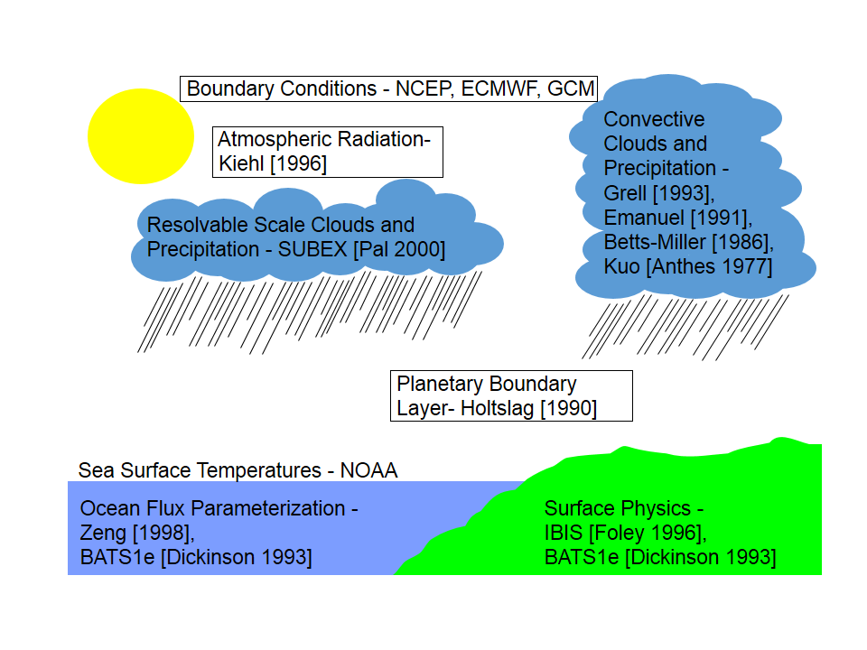

COAWST系统是基于MCT耦合的，包含：WRF + ROMS + WWM(SWAN) + Infragravity +
CSDMS（泥沙模型）

现在，SCRIPPS-KAUST耦合系统实现了与大气模式WRF的耦合，而RegESM中耦合的是RegCM模式（RegCM模式在模拟非静水压力模式时存在不稳定问题，作者希望用WRF代替RegCM模式，但WRF尚未实现耦合）。

SCHISM-ESMF是基于ESMF的将SCHISM模型与其他模式（如WRF）的耦合接口。

表1 比较3各耦合模式系统中的程序

+-------------+------------------+-----------------+-----------------+
| 功能        | RegESM           | SCRIPPS-KAUST   | SCHISM-ESMF     |
+=============+==================+=================+=================+
| 海洋        | mod_esmf_ocn\_   | m               | schism_bmi.F90  |
| 模式-nuopc  | [mit]{.mark}.F90 | od_esmf_ocn.F90 |                 |
|             |                  |                 | schi            |
|             |                  |                 | sm_cmi_esmf.F90 |
|             |                  |                 |                 |
|             |                  |                 | schis           |
|             |                  |                 | m_cmi_nuopc.F90 |
|             |                  |                 |                 |
|             |                  |                 | schis           |
|             |                  |                 | m_esmf_util.F90 |
+-------------+------------------+-----------------+-----------------+
| 大气        | mod_             | m               | [待开发]{.mark} |
| 模式-nuopc  | esmf_atm_rcm.F90 | od_esmf_atm.F90 |                 |
+-------------+------------------+-----------------+-----------------+
| 河流        | mod_esmf_rtm.F90 | 没              | 无需河流模式    |
| 模式-nuopc  |                  | 有耦合河流模式  |                 |
+-------------+------------------+-----------------+-----------------+
| 风浪        | mod_esmf_wav.F90 | 没              | 已              |
| 模式-nuopc  |                  | 有耦合风浪模式  | 经耦合了WWMIII  |
+-------------+------------------+-----------------+-----------------+
| Driver      | regesm.F90       | mitgcm_wrf.F90  | 模仿开发        |
+-------------+------------------+-----------------+-----------------+
|             |                  |                 |                 |
+-------------+------------------+-----------------+-----------------+

## RegESM

mod_esmf_cpl.F90: 各个component间的耦合器，包括：CPL_ComputeRH,
CPL_ExecuteRH,
CPL_ReleaseRH（SCHISM-ESMF中都包括在triple_schism.f90等测试主程序中。）
RH: RouteHandle

SCRIPPS-KAUST貌似参考了RegESM的编程风格。（见scripps: mod_esmf_cpl.F90）

## SCRIPPS-KAUST

MITgcm与WRF耦合系统的程序，可以参考:

L2.C1.mitgcm_case_CA2009: MITgcm与dummy大气模式的耦合（没有使用MPI并行）

L2.C2 使用MPI并行，其他同上

L3.C1.coupled_RS2012_ring/ coupledCode：使用红海的WRF\--MITgcm耦合

L3.C2.coupled_CA2018_ring：使用东太平洋的WRF\--MITgcm耦合

## SCHISM-ESMF

concurrent_esmf_test, triple_schism, multi_schism
测试SCHISM与大气模式耦合的，并发模式。其中：运行3个或多个SCHISM
component（进程数）与大气耦合，这是为了实现数据同化的过程(schism_pdaf.F90)。与大气模式做[双向耦合]{.mark}，运行1个SCHISM就可以了concurrent_esmf_test。

## WRF与RegCM的比较

Jyotismita Goswami, Alok Choudhury. A Comparative Study of high
Resolution Weather Model WRF & RegCM Weather Model. International
Journal of Engineering Research and General Science, 2014, 2(3): 366-374

表1 关于WRF模式的优缺点

  -------------------------------------------------------------------------------------------------
  优点                                                      缺点
  --------------------------------------------------------- ---------------------------------------
  1、优秀的数值格式，数值扩散低，可使用更长的计算时间步长   1、对于物理学家来说，软件设计并不直观

  2、使用前处理程序，方便地处理地形数据，嵌套网格           2、编译时间较长

  3、使用FORTRAN90, NetcDF, GRADS, MPI                      
  -------------------------------------------------------------------------------------------------

表2 关于RegCM模式的优缺点

  ---------------------------------------------------------------------------------------
  优点                            缺点
  ------------------------------- -------------------------------------------------------
  1、基于降尺度的气候模拟系统     1、仅有单向耦合嵌套，没有局部到全局的反馈（双向耦合）

  2、多层嵌套，高分辨率模拟       2、大尺度驱动场的施加有问题
  ---------------------------------------------------------------------------------------

图 RegCM的模块框架示意图(Goswami, 2014)

表3 全球气候模拟（GCM）与局部气候模拟（RCM）

  --------------------------------------------------------------------------------------------------
  优点                                                 缺点
  ---------------------------------------------------- ---------------------------------------------
  1、由于相对低分辨率网格，GCM无法考虑局部区域的特征   1、使用相对高分辨率网格，用于较小的局部区域

  2、GCM使用至少200km的网格间距                        2、RCM使用至少20\~60km的网格间距

  3、GCM用于模拟全球气候系统                           3、RCM用于模拟局部气候系统
  --------------------------------------------------------------------------------------------------
