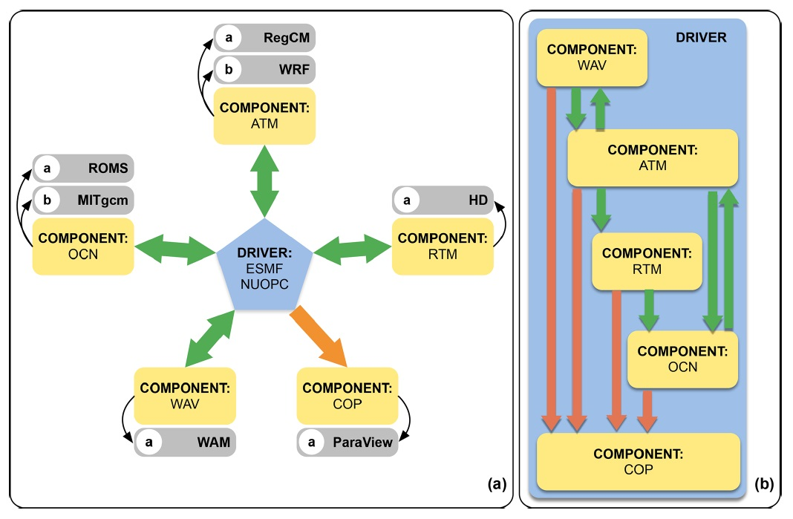
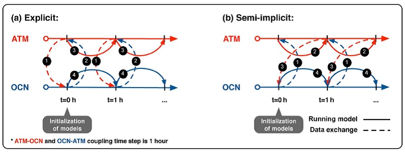
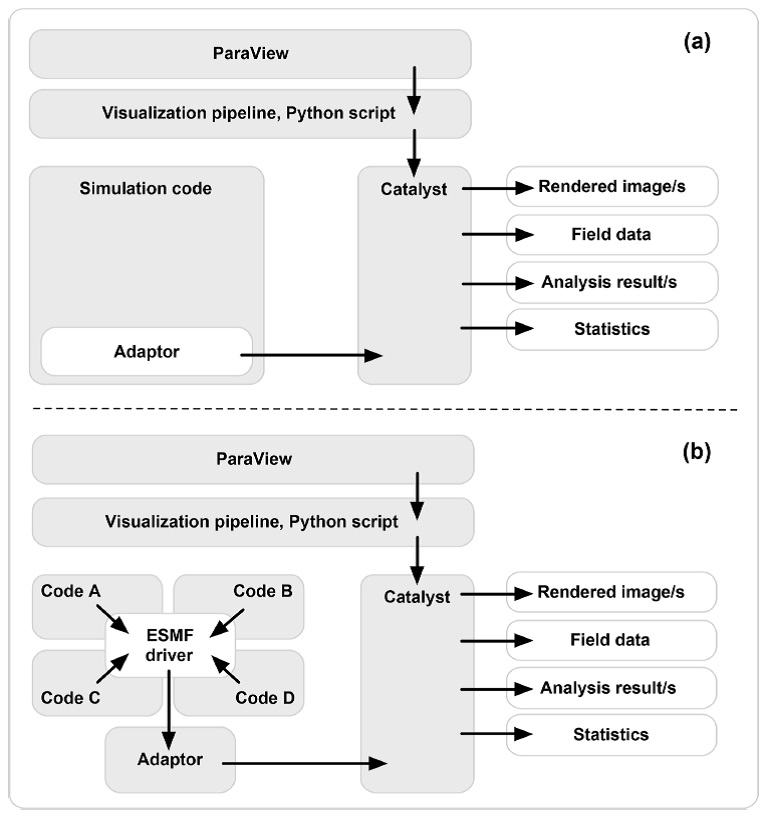
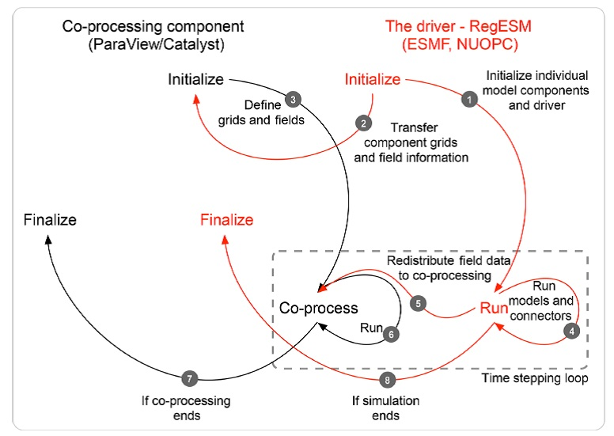
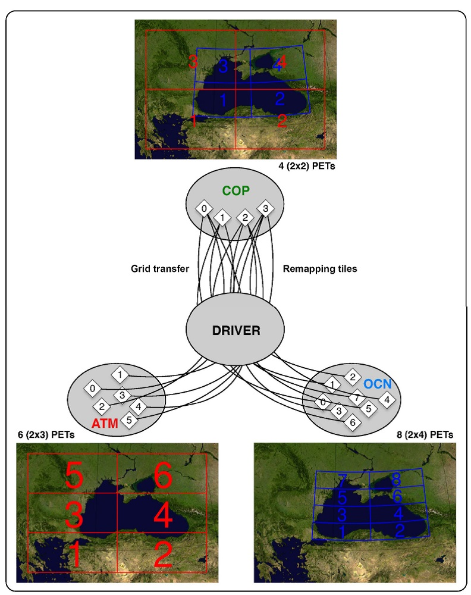

# RegESM原理(Turuncoglu et al., 2019)

Toward modular in situ visualization in Earth system models: the
regional modeling system RegESM 1.1

# 1 引言

## 常见的耦合器

Ocean Atmosphere Sea Ice Soil (OASIS3) (Valcke,
2013)使用多个可执行方法耦合模型组件，但执行的是内部的串行算法，如模型网格插值用到的稀疏矩阵相乘，当网格分辨率增大时，成为计算瓶颈；OASIS4实施了内部并行化算法(Redler
et al., 2010)；OASIS3-MCT(Craig et al., 2017)是与MCT(Model Coupling
Toolkit; Larson et al., 2005)的接口，提供插值和数据交换的并行化执行。

domain-specific耦合器，如OMUSE (Pelupessy et al.,
2017)提供耦合不同代码的海洋模拟、数值方法和Community Surface Dynamics
Modeling System (CSDMS)的统一环境，来模拟地球表面过程。

Earth System Modeling Framework (ESMF) (Theurich et al., 2016)

Modular System for Shelves and Coasts (MOSSCO, Lemmen et al.,
2018)利用ESFM和Framework for Aquatic Biogeochemical Models
(FABM)实施近海岸带地球系统模型。

大部分的地球耦合模型都使用中央耦合器来支持数据交换、空间插值和模型组件同步。模型组件和模块之间不直接发生作用，而是采用特殊的耦合器组件管理数据交换，称为[hub-and-spoke]{.mark}方法。

## 在线可视化

analyze the fast-moving processes such as extreme precipitation evets,
convection turbulences and non-linear interactions among the model
components on a high temporal and spatial scale.

in-situ visualization and co-processing approach

ocean component of Model for Prediction Across Scales (MPAS) has been
integrated with an image-based in-situ visualization (Ahrens et al.,
2014; O'Leary et al., 2016); perform eddy analysis at higher spatial and
temporal resolutions than available with traditional postprocessing
facing storage and I/O bandwidth constraints (Woodring et al., 2016).

Weather Research and Forcasting (WRF) has been integrated with an
in-situ visualization tool to track cyclone based on an adaptive
algorithm (Malakar et al., 2012).

# 2 模拟系统设计

采用[hub-and-spoke]{.mark}架构。驱动程序([Driver]{.mark})负责整体模拟系统的中央耦合，以及翻译模型组件（大气、海洋、波浪、河流径流和co-processing）的信息。各模型组件引入NUOPC
cap，插入模拟系统。

该耦合系统已在很多区域得到验证，包括：[Caspian Sea (Turuncoglu et al.,
2013), Mediterranean Basin (Surenkok and Turuncoglu, 2015; Turuncoglu
and Sannino, 2017) and Black Sea Basin (???).]{.mark}

图1耦合模拟系统设计：(a)模型组件，包括co-processing组件；(b)组件间的交互（桔色代表重分布；绿色代表插值）

## 大气模式

RegCM4 (version
4.6)，海气界面耦合，Zeng模型。大气模型可以与2D和3D场的模型组件交换信息，如海洋，波浪和河道径流组件，以及in-situ
Visualization组件。

WRF (version 3.8.1) + ESMF (version 7.1.0) [（under
development）]{.mark}

## 海洋模式

ROMS，使用垂向地形跟踪坐标（s坐标），很好地表征近海岸地形。

MITgcm，使用垂向z分层坐标，适用于开阔海域和海洋。

目前的RegESM系统中，海洋模式与波浪模式之间没有交互，但对于某些应用很关键，比如海面洋流-波浪相互作用。

大气与海洋模式间的耦合场，与研究的具体问题相关。

目前的耦合系统，驱动器允许从预定义的场列表中，选择需要交换的场。

## 波浪模式

表面波在大气模式的PBL和海洋模式的洋流动力过程中起到关键作用。

WAM Cycle 4 (4.5.3-MPI)，第3代模型，没有谱形状假设(Monbalieu et al.,
2000)，考虑了深水区波浪场的演化，即风生浪、非线性相互作用及white
capping。

目前，WAM不能与WRF耦合，因为WRF侧缺少代码修改。

RegCM4中，接收表面粗糙高度，计算海气转换系数和通量(Zeng参数化方案)。RegCM4中可定义最大粗糙长度阈值(0.02
m)和摩阻流速阈值(0.02 m)。

## 河道径流模式

[Hydrological Discharge (HD, version 1.0.2), developed by Max Planck
Institute]{.mark}

目前的驱动器设计中，河流有2种方式表征：

（1）点源，垂向分布于海洋模型各分层；

（2）施加为淡水表层边界条件，如降雨(P)或蒸腾减去降雨(E-P)。

这样，需要在驱动器配置文件中，为每条河道选择河道表征类型（1或2）。

在海洋模式（ROMS和MITgcm）的NUOPC
cap中实施特殊算法，基于驱动器配置文件中设置的有效半径（km），搜索受影响的海洋模型网格。

## 驱动器(Driver)：RegESM

使用ESMF (version
7.1.0)，由于其独特的在线regridding能力，允许用户实施不同的插值方法（双线性、动量守恒等），基于交换场（如海面温度、热量和动量通量）和NUOPC层。

ESMF在组件内存中转换计算网格，这对co-processing环境的模拟系统整合有关键作用。

4个组件的耦合模拟系统的配置见如2。

图2 显式耦合情况下组件的运行顺序

模型组件的交互可以是：

\(1\) 双向的，如ATM-OCN；

\(2\) 单向的，如ATM-Co-processing

RegESM在大气与海洋组件之间，使用2种不同的时间积分耦合格式：

（1）显式；

（2）半隐式。

图3 示意图：(a)显式；(b)半隐式

[执行模式：]{.mark}

\(1\) Sequential mode;

\(2\) Concurrent
mode（不支持co-processing；需要benchmark测试各模型组件的最优分配进程数，可使用LUCIA
(Load-balancing Utility and Coupling Implementation Appraisal)）。

由于模型组件之间使用不同的网格，引起模型组件之间陆地-海洋mask不匹配的问题。此种情况下，不对齐的land-sea
masks，在海岸线、狭窄港湾、海峡或海面处，会产生虚假的或不真实的表面热量和动量通量。解决办法：

（1）手动修正各模型组件的land-sea mask（工作量大）；

（2）使用内插和外插的方法解决不匹配的mask问题，算法分3个阶段：

a 找到目标网格点上land-sea mask类型完全与源网格不匹配的点（unmapped grid
points）；

b 使用双线性插值，将源网格上的场数据转换到目标网格上；

c 在源网格上实施外插，在第1步找到的unmapped grid points上填充数据。

确定unmapped grid points的算法是（见图4）：。。。。。。

最邻近插值的场可能是不真实的数值，或者在复杂的land-sea
mask结构（如河道或海峡）附近有大梯度值。海岸线附近的虚假值可以在插值后实施轻微光滑或使用更复杂的[外插]{.mark}方法，例如sea-over-land方法(Kara
et al., 2007; Dominicis et al., 2014)，RegESM系统中尚未考虑。

当源和目标水平网格分辨率之比较大时，使用2阶守恒插值方法时，联合使用mosaic
grid，能克服不对齐land-sea mask的问题。

[ESMF 8.0版]{.mark}的[creep fill Strategy]{.mark}可填充unmapped grid
points。

# 3 在RegESM中整合co-processing组件

Catalyst + ESMF

[传统的in-situ visualization:]{.mark} Catalyst is used to integrate the
Paraview visualization pipline with the simulation code (Malakar et al.,
2012; Ahrens et al., 2014; O'Leary et al., 2016; Woodring et al., 2016).

[创新的in-situ visualization:]{.mark}：the adaptor code interacts with
the driver through use of the NUOPC cap and provides an abstraction
;ayer for the co-processing component.

The adaptor layer maps the field (i.e., ESMF_Field) and grid (ESMF_Grid)
objects to their VTK equivalents through the use of VTK and
co-processing APIs.

这样模型代码与Catalyst间的交互性通过ESMF得到增强和标准化。

{width="5.063406605424322in"
height="5.419990157480315in"}

图5 传统的(a)和ESMF-integrated (b)的in-situ Visualization的比较

适配器组件（代码）主要包含一套函数：初始化（定义计算网格和相关的输入端口）、运行和结束Co-processing环境。

ESMF也采用类似的方法（ESMF组件）将新的模型组件插入到耦合系统中。在ESMF中，模型代码分为3个组件（初始化、运行和结束），通过激活驱动器调用接口，控制模型代码（如大气和海洋模式）。此时：

（1）初始化阶段（图6中的第1步）包括：定义和初始化交换变量、读取输入（初始条件和边界条件）及设置文件、定义计算网格。

（2）运行阶段（图6中的第4步）包括1个时间迭代步，以定义的周期运行模型组件，直到模拟结束。模型与Co-processing组件之间[交换数据的时间间隔]{.mark}可以使用[耦合时间步长]{.mark}定义，与其他模型组件间的相互作用周期设置一样。根据ESMF约定，模型和Co-processing组件都定义为[网格组件]{.mark}(Gridded
component)，而驱动器定义为[耦合器组件]{.mark}(Coupler
component)。在每个耦合循环计算步中，耦合器组件根据应用regridding（除了与Co-processing组件间的耦合）的组件间的交互作用，准备交换场，实施单位转换和对场变量的一般操作（如旋转风场）。

图6 ESMF/NUOPC定义的驱动器与Co-processing组件(Catalyst)间的相互作用

驱动器重新分布来自物理模型的2D和3D场，使其与co-processing组件交互。

在[初始阶段]{.mark}：ESMF组件的数值网格使用适配器代码转换为VTK格式（图6的第3步）。此时，使用ESMF_Grid对象创建vtkStructuredGrid以及他们的并行2D区域分解设置，ESMF/NOUPC网格转换功能支持这些设置（图7）。根据系统设计，每个模型组件在模拟开始时将各自的数值网格表征转移到Co-processing组件（图6的第1步），而分配一个独立的2D分解比值来定义分区网格。ATM计算区域必须覆盖OCN计算区域，ATM为OCN提供边界条件。

Co-processing组件可以使用GPU资源实施渲染（如等值面提取、体渲染和纹理映射）和优化高效处理大体积数据。[初始化阶段]{.mark}还负责定义模型组件之间转移的交换场，将ESMF_Field表征映射为Co-processing组件的vtkMultiPieceSet对象（图6的第2\~3步）。

由于修改的模型数值网格的2D区域分解结构，适配器代码也修改ghost区域的定义，此时，ghost区域（或ESMF约定中的halo区域）使用特殊调用更新，之后，传递模拟数据（作为vtkMultiPieceDataSet）到Co-processing组件。

[运行阶段]{.mark}：Co-processing组件与模型代码（并行通信的）同步(Synchronize)，保存更新数据（图6的第5步）以及处理和分析结果（图6的第6步）。驱动器与适配器之间的交互，直到模拟结束（图6的第4,
5, 6步），驱动器使用ESMF_FieldRedist，继续重新分配交换场。

模型组件的NUOPC
cap还支持，在传递信息给Co-processing组件之前，实施3D交换场的垂向插值，到一定高度（RegCM大气模式的地形跟踪坐标）或深度坐标（从ROMS海洋模式的*s*坐标）。在此设计中，垂向插值需保证垂向尺度和来自大气和海洋模式组件的数据单位的一致性。

[结束阶段]{.mark}：结束模式和Co-processing组件的子程序，停止模式运行和数据分析管线，销毁定义的数据结构，释放内存（图6的第7\~8步）。

图7 ESMF/NOUPC接口的[网格转换和remapping]{.mark}特征的2模型组件情况

# 4 测试算例和计算效率评价

Katrina飓风，2005年八月

模拟3天过程：27-30 August, 2005，是飓风的最强阶段。

## 4.1 工作环境

CentOS7.2+Intel Xeon CPU (2.4GHz) +128G RAM + 349 TB

Infiniband FDR (56 Gbps)

Paraview is installed with Mesa support, if there's no GPU in the
cluster

## 4.2 计算域和模型设置(GTC-demo-2018)

RegESM_1.1耦合RegCM和ROMS以及Catalyst_5.4.1，分析Hurricane Katrina。

生成[2个大气模拟计算域]{.mark}，RegCM模拟使用离线的nesting方法，如图8。

外区域，低分辨率LR，中心位于25.0N, 77.5W,
分辨率27km，几乎覆盖整个美国。外区域尽可能大，降低侧向边界对[内区域]{.mark}大气模拟的影响。

内区域，高分辨率HR，分辨率3km，覆盖整个墨西哥湾，为海洋模式提供高分辨率的大气驱动力。内区域使用非静水压力核心(RegCM_4.6)，可更好地考虑局部尺度的垂向加速和压力特征。

外区域的侧向边界条件从ECMWF获得最近的全球大气再分析数据，时间间隔6h，水平分辨率0.75°x0.75°，垂向37个压力分层。

内区域的侧向边界条件有外区域计算结果定义。

使用MIT-EMAN对流参数化方案，表征积云

压格子显式湿度SUBEX方案，表征大尺度降雨，用于低分辨率外区域

ROMS模式的设置覆盖整个墨西哥湾。水平分辨率1/36°，对应非均匀分辨率网格约3km（655x489网格节点），sigma分层60层(theta_s=10.0,
theta_b=2.0)，详细表征环流模式和垂向标量梯度。海床地形采用ETOPO1，最小水深hc=400
m。

Mellor-Yamada level 2.5 紊流封闭模型。

侧向边界条件采用Naval Oceanographic Office Global Navy Coastal Ocean
Model (NCOM) (27\~30 August, 2005)。

大气与海洋模式的而耦合时间步长设置为[1
h]{.mark}，与co-processing组件的单向耦合时间步长使用[6
min]{.mark}，以很高的时间分辨率观察Katrina飓风。耦合模拟中，海洋模式为大气模式提供SST数据，其他区域上大气模式使用ERA-Interim数据集（预设SST）。

图8 RegESM模拟的区域、水上地形和水下地形

## 4.3 计算效率评价

研究co-processing组件引入的overhead，首先在Paraview中创建Visualization
Pipelines（见表1）。计算效率评价包括分析物理模型之间的耦合间隔、使用不同渲染负荷的co-processingzujian(不同的可视化管线，见表1).

CPL: 2个模式耦合（ATM-OCN）

COP：3个组件（ATM-OCN-Co-processing）

COP仅能在[顺序模式]{.mark}下执行 RegESM_1.\*

# 5 展示应用

新设计的模拟系统可以使用in-situ
(live)和co-processing两种模式分析模拟结果。Python脚本定义可视化管线，主要控制操作模式选择，使用Paraview
Co-processing插件生成脚本。用户可以设置coprocessor.EnableLiveVisualization为True就可启用Live
visualization模式。下面比较2种不同方法。

## 5.1 实时可视化模式

该模式允许实时连接Paraview，中间可以暂停，修改可视化管线，然后继续在线可视化。

Co-processing模式可使用Catalyst的多通道输入端口，处理多个模型组件的数据。此时，基于交换场的rank，各模型有2个输入通道。例如，大气模式组件有[*atm_input2D*和*atm_input3D*]{.mark}输入通道，可处理2D和3D交换场数据。

适配器代码位于Co-processing组件的NUOPC
cap与Catalyst之间，并为各模型组件的之后分析提供2个网格定义（2D和3D）。

在这种设计方法中，使用Paraview co-processing插件生成Python
co-processing脚本，用户需要使用预定义的名称[*atm_input2D*和*atm_input3D*]{.mark}，将数据源映射到输入通道。然后，适配器通过各通道，提供需要的数据到co-processing组件，来实施实时的渲染和数据分析。co-processing组件中使用的场由统一的ASCII格式的而驱动器设置文件([exfield.tbl]{.mark})定义，设置文件也用于定义其他模型组件（如大气和海洋模式）之间的交换场。图11显示了LR大气模式提供的3D相对湿度场的live
visualization，地形信息和海洋表面涡度由模型组件提供。

图11
大气相对湿度场(atm_input3d)的体渲染以及使用Catalyst在live模式下来自COP_LR海洋表面涡量场(ocn_input2d)

## 5.2 Co-processing模式

除了live visualization
mode，Catalyst还可以使用预定义的co-processing管线（Python脚本）渲染和存储数据，用于进一步分析。co-processing模式可用于3个目的：

（1）模拟输出可直接传递给co-processing组件，以批处理模式渲染数据并输出图片文件到磁盘；

（2）可计算添加的数值信息（即由风场得到涡量、由海洋环流得到涡动能），并存储于磁盘用于进一步分析；

（3）以更高的时间分辨率存储模拟输出，之后处理（后处理）或创建表征数据集，可用于设计co-processing或live
visualization的可视化管线。

新设计的模拟系统，可在每个耦合时间步，向模拟结果应用多个可视化和数据处理管线，对相同的数值模拟结果实施不同的分析方法，提高数据分析效率。模拟系统还方便地实施多个输入端口，处理来自多个ESM组件的数据流。输入端口基于启用的模型组件（ATM，OCN等），由co-processing组件自动定义，各模型组件都有[2个端口]{.mark}来独立地处理2D和3D网格（场），诸如atm_input2D,
atm_input_3D, ocn_input2D和ocn_input3D.

以Katrina飓风为例研究co-processing组件的功能，分为2个分辨率（COP_LR和COP_HR）。海洋模式使用相同设置，但大气模式使用2种分辨率（27km和3km）

图12显示了模拟的云的3h快照，云通过处理3D相对湿度场生成，使用LR版本的耦合模型（COP_LR），使用NVIDIA
IndeX体渲染插件，Katrina飓风的流线由3D风场生成。可视化管线包裹：海洋模式计算的海面高度和表面环流

图12a-b显示了使用Paraview
*[Threshold]{.mark}*过滤器提取的飓风流线，提取区域用作seed来计算流线。

设计可视化管线考察飓风的垂向上升气流(updraft)、轨迹、降雨模式和海洋状态。设置20
m/s风速阈值，[孤立展示飓风：使用ProgrammableFilter作为圆形平面（半径1.2°，绕隔离区域的质心分布0.2°间隔的点），动态定义Paraview的StreamTracerWithCustomSource过滤器的seed（即由vtkPoints定义的点集）]{.mark}。

图12
使用Paraview的全耦合多组件（ATM-OCN-COP）的渲染。处理数据的时间间隔是6
min

图13和图14基于2种分辨率的耦合模拟，可能清楚地区别飓风的垂向及水平结构。

新的in-situ
visualization技术可能观察耦合模拟系统表征的破坏性飓风的机构，特别是在高分辨情况下（COP_HR）。耦合模拟系统中的单个组件（大气和海洋模式），还能调试到与观测值最佳吻合的状态。另外，飓风分析时，可以使用现有的更精确的[飓风追踪算法legacy
FORTRAN
code]{.mark}，使用Paraview的[ProgrammableFilter]{.mark}实施更好的[飓风追踪]{.mark}算法（[李健：]{.mark}例如Stride
Search飓风追踪算法程序(Bosler et al.,
2016)），用于Live和Co-processing模式。

# 6 交互性、可移植性和可重复性相关概念

## 6.1 交互性

目前，RegESM模拟系统使用co-processing组件的NUOPC
cap与区域模拟程序共同工作，模型组件使用特殊的水平网格类型，如矩形或曲线结构网格。新引入的Co-processing接口（NUOPC
cap和适配器代码），需要与其他通过ESMF和NUOPC层的区域或全球模拟系统相兼容。（ESMF与OASIS目前还不能交互）

需要改善目前耦合模拟系统中模型组件的交互性：

（1）重新设计Co-processing组件的NUOPC
cap，来支持多种网格类型，如非结构Voronoi网格；

（2）拓展适配器代码，使用VTK和Catalyst
APIs，表征由NUOPC提供的网格和交换场；

（3）增加对使用在线嵌套功能的模型的co-processing接口；

（4）增加对在co-processing组件和其他组件中的统一水平网格定义的支持，来实时由多种模式生成数据的集成分析（如海气温度差和相关分析）。

另外，Co-processing接口可与NUOPC层紧密整合，提供一个简化的API，以更有效和标准化的方式，设计新的在线可视化集成模拟系统。除了本研究使用的设置外，RegESM设置还使用了RegCM,
MITgcm和Co-processing组件，来研究黑海盆地的海气耦合。Co-processing组件可处理来自RegESM支持的不同模型设置的数据流。

## 6.2 可移植性

当高性能计算系统的特性不同时，得考虑硬件架构（如网络和存储系统）和软件层（如操作系统、编译器、桥连通信的库及不同版本等），实现ESM的可移植性对科学研究至关重要。

对于RegESM来说，单个可执行方法（把所有模式组件编译成一个可执行程序），当可视化和模拟以concurrent模式运行时造成移植性的问题。在[同构计算环境]{.mark}下（所有节点具备或都不具备GPU支持），启用in-situ
visualization的耦合模拟没有问题，因为各MPI进程访问相同的软件和硬件资源。相反，集群系统使用不同的硬件和软件的[异构环境]{.mark}下（即混合的有或没有GPU支持的服务器），由于GPU服务器上没有共享库，导致in-situ
visualization耦合模拟失败。对于此种情况，可使用2种方法来解决：

（1）在整个系统，包括不支持GPU的服务器上，安装所有需要的库；

（2）重组模拟系统，可支持2个可执行程序，一个是Co-processing组件，一个是物理模型组件。

第2种方法是更好的一般性和灵活性的解决方法，提高了模拟系统的可移植性。这允许实施松散耦合的在线可视化，可使用特殊的硬件（GPU具有更大显存）来渲染(Rivi
et al.,
2012)。松散耦合的在线可视化的缺点是：需要通过网络转移数据。因此，
网络带宽将成为瓶颈，特别是在高分辨率多组件的模拟应用。

## 6.3 可重复性

开发一个完全可重复和可移植的模拟系统是一项具有挑战的任务，需要大量的交互来跟踪细节的元数据和关于模型、模拟和计算环境（包括软件和硬件）的信息。使用地球系统科学的工作流程表现出优势，以自动化和标准化的方式处理元数据、错误处理和可重复性(Turuncoglu
et al., 2011, 2012; Turuncoglu, 2012)。

软件集装箱技术的快速发展，有助于设计灵活的和可移植的计算环境。因此，实施[Docker
container]{.mark}增强模拟系统的可移植性。

但是，尽管Docker
container具有灵活性和易用性，但使用特殊的硬件，例[如NVIDIA
GPU时，]{.mark}需要操作[kernel
modules]{.mark}和用户层的[库]{.mark}，目前尚不支持。因此，Docker
container不能访问GPU资源，实施可视化和数据分析的硬件层次的渲染。

为实施基于GPU的集装箱，NVIDIA开发了特殊的集装箱，当启用集装箱时，可加载GPU驱动。[RegESM使用Docker
(通过使用Mesa库，实施软件渲染)和NVIDIA Docker(基于硬件的渲染)。]{.mark}

采用集装箱技术增强了RegESM的可移植性和可重复性，计算效率的损失很小（\~5%-10%）。使用NVIDIA
Docker可使用GPU资源进行硬件渲染（例如，使用直接的体渲染方法表征云）。[见github中的Docker.txt]{.mark}。

# 7 结论

Co-processing组件需要[增加支持不同的网格类型，如非结构网格]{.mark}。

另外[，还需要探索：]{.mark}

（1）优化网格特征和映射交换场的传输，提高高分辨率模拟情况的计算效率；

（2）自动探索GPU加速器，自动分配GPU资源给co-processing组件用于渲染计算；

（3）改进模拟系统和Co-processing组件，允许nested计算（大气和海洋模式）；

（4）开发更多的应用到耦合模拟系统中（其他的海洋和大气模式组件，如WRF、MITgcm等），来研究不同的物理过程，如upwelling区域在极端大气驱动条件下的海气相互作用。

# 参考文献

O'Leary, P., Ahrens, J., Jourdain, S., Wittenburg, S., Rogers, D. H.,
and Petersen, M.: Cinema image-based in situ analysis and visualization
of MPAS-ocean simulations, Lect. Notes Comput. Sc., 55, 43-48, 2016.

Woodring, J., Petersen, M., Schmeisser, A., Patch-Ett, J., Ahrens, J.,
Hagen H.: In situ eddy analysis in a high-resolution ocean climate
model, IEEE T. Vis. Comput. Gr., 22, 857-866, 2016.

Valcke, S.: The OASIS3 coupler: a European climate modelling community
software, Geosci. Model Dev., 6, 373-388,
https://doi.org/10.5194/gmd-6-373-2013, 2013.

Theurich, G., DeLuca, C., Campbell, T., Liu, F., Saint, K., Vertenstein,
M., Chen, J., Oehmke, R., Doyle, J., Whitcomb, T., Wallcraft, A.,
Iredell, M., Black, T., Da Silva, A. M., Clune, T., Ferraro, R., Li, P.,
Kelley, M., Aleinov, I., Balaji, V., Zadeh, N., Jacob, R., Kirtman, B.,
Giraldo, F., McCarren, D., Sandgathe, S., Peckham, S., and Dunlap, R.:
The Earth System Prediction Suite: Toward a Coordinated U.S. Modeling
Capability, B. Am. Meteorol. Soc., 97, 1229--1247, 2016

台风跟踪算法：

Bosler et al. 2016. [Stride Search]{.mark}: a general algorithm for
storm detection in high-resolution climate data. Geosci. Model Dev., 9,
1383-1398.

[Turuncoglu的论文：]{.mark}

Turuncoglu, U. U., Murphy, S., DeLuca, C., and Dalfes, N.: A scientific
workflow environment for earth system related studies, Comput. Geosci.,
37, 943-952, 2011.

Turuncoglu, U. U., Dalfes, N., Murphy, S., and DeLuca, C.: Towards
self-describing and workflow integrated Earth system models: a coupled
atmosphere-ocean modeling system application, Environ. Modell. Softw.,
39, 247-262, 2012.

Turuncoglu, U. U.: Tools for Configuring, Building and Running Models
(Vol. 5) -- Applying ScientificWorkflow to ESM (Sec. 2), Earth System
Modeling, SpringerBriefs, in: Earth System Sciences, edited by: Ford,
R., 70 pp., 2012.

Turuncoglu, U. U., Giuliani, G., Elguindi, N., and Giorgi, F.: Modelling
the Caspian Sea and its catchment area using a coupled regional
atmosphere-ocean model (RegCM4-ROMS): model design and preliminary
results, Geosci. Model Dev., 6, 283-299,
https://doi.org/10.5194/gmd-6-283-2013, 2013.

Turuncoglu, U. U. and Sannino, G.: Validation of newly designed regional
earth system model (RegESM) for Mediterranean Basin, Clim. Dynam., 48,
2919-2947, 2017.

Turuncoglu, U. U. 2019. Toward modular [in situ visualization]{.mark} in
Earth system models: the regional modeling system RegESM 1.1, Geosci.
Model Dev., 12, 233-259
