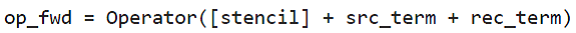
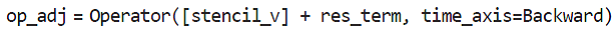

# 基于Devito与JUDI的FWI操作

Pratt(1999)重新介绍了FWI，引起地球物理勘探的广泛关注，因为FWI可以在复杂地质环境下，实现自动化、构建高分辨率的速度模型。

FWI方法就是迭代最小化计算，地震勘探获取数据与应用一个地下评估速度模型初始化地震波模拟的合成数据之间的差异。因此，本质上FWI框架组成包括：一个正演模拟预测数据的地震波模拟器(wave
simulator)，和一个由misfit数据更新计算速度模型的伴随模拟器（adjoint
simulator）。

FWI的综述可参考Virieux and Operto,
2009。下面结合devito这个特定域语言库，分别介绍FWI的3个基本步骤（参考The
Leading Edge））。

## （1）Full-waveform inversion, Part 1: Forward modeling

Devito使用传统的全波形层析成像的adjoint-state公式，实现Virieux and
Operto,
2009介绍的FWI的大部分方法，当然还有其他方法改善质量较差的初始速度模型下FWI的表现。下面仅介绍联合forward/adjoint
pair of
propagators和一个基于相关性的梯度的标准计算式；讨论如何设置反演的地震波模拟，包括如何在Devito中符号表述地震波方程，以及如何处理计算域的几何。

### 反演用的地震波模拟

声波波动方程，m(x,y)=c^-2^(x,y)，其中c(x,y)是未知的空间上变化的波速，计算式为：

其中，*L*为拉普拉斯算子，*q* (t, x, y x~s~,
y~s~)是位于(xs,ys)上的地震源，η(x,y)是空间相关的吸收边界条件中的衰减参数。如图1，物理模型在各维度上离散为nbpml个网格节点，模拟无限域。ηdu/dt在抑制层吸收地震波，防止地震波在边界上反射。在Devito中，m和η的离散表征包含在model对象中，model对象包含所有相关信息的grid对象，诸如坐标系统原点、网格间距、模型尺寸和time,
x,y维度。

上述波动方程在devito中表述如下：

### 波动传播算子的符号定义

为模拟地震数据，求解声波方程，第一步就是离散偏微分方程（PDE），包括离散标准速度模型和波动场，以及使用有限差分空间和时间导数的近似。有限差分离散的底层手工编码是很容易出错的。Devito的主要涉及目标是允许用户基于高级的符号定义，定义复杂的无矩阵的有限差分近似，同时使用自动生成代码，创建高度优化的底层C代码。使用符号代数软件包SymPy，方便自动创建导数计算式，Devito生成高效的地震波传播模拟代码。

为展示Devito的符号计算能力，下面考虑时间相关函数u(t,x,y)表示离散的正演波动场：

其中，model提供的grid对象，定义了分配内存大小，time_order和space_order定义了导数表达式的离散阶数。

现在使用这个波场的符号描述生成简单的离散的有限差分导数近似的表达式，如u.dt和u.dt2分别表示du/dt,
d^2^u/dt^2^：

### 计算域几何的设置

为描述时间步推进，上一节推导的式子不包含地震源函数，因此在新的时间步更新波动场仅根据之前定义的2个波场。但是，在式（1）中，地震实验的波动场通常是被一个激活的（脉冲的）的源*q*
(t, x, y x~s~,
y~s~)激发的，*q*是时间和空间的函数（与波动场**u**一样）。为计算格式中包含这样的一个源项，将源在式（3）中实施为附加项：

RickerSource:

Src.inject函数将Ricker小波的当前时间采样（在式4中使用dt^2^/m加权），在指定的坐标位置，注入到更新的波动场u.forward：

### 正演

现在可以通过增加源和接收项到格子对象，定义正演传播(forward propagator)：

波动场正演模拟：

完成计算后，得到的波动场存储在u.data，炮记录(shot
record)存储在rec.data。可以将2D数组作图为图像，如图2。

正演的波动场的snapshot做动画，如图3。

## （2）Full-waveform inversion - Part 2: adjoint modeling

下面演示如何使用Devito设置和求解伴随波动方程，基于此，计算梯度和FWI目标函数的函数值。

通常，通过伴随状态法(adjoint-state
method)-交叉相关正演和伴随波动场，并对所有时间步的贡献求和-计算FWI的梯度。计算一个震源位置处的梯度由3步组成：

1、求解正演波动方程，创建一个炮记录。必须存储随时间变化的波动场，供第3步使用。这里可使用如subsampling技术降低内存要求。

2、计算预测数据和观测数之间的据残差（或misfit）

3、使用数据残差作为源，求解对应的离散伴随模型。在伴随（逆）时间循环内，交叉相关伴随波场的2阶时间导数与正演的波动场。求和这些交叉相关形成梯度。

### 一个简单的实验

小型地震传播实验：一个中心具有环形高波速的恒定速度模型，如图1

在模型的左手边放置21个地震源，在右手边放置101个接收器。

### 伴随波动方程

使用正演部分定义的变量和位于处的数据残差作为伴随源，给出连续的伴随波动方程：

该展示没有实际地震数据，我们通过使用真实的模型model的正演模拟，生成"观测"数据。从初始模型model0生成合成数据。得到的数据及差异，如图2。

最终，通过增加残差源表达式到之前定义的格子以及设置标识time_axis=Backward，创建了完全的传播算子(propagator)，来定义传播算子在时间上向后运行：

### 计算FWI梯度 {#计算fwi梯度 .标题3}

## （3）Full-waveform inversion - Part 3: inversion

在正演波场模拟和使用伴随状态方法计算FWI目标函数梯度的基础上，下面构建反演框架，可用来最小化FWI最小二乘目标函数。

FWI在计算上和数学原理上都是有挑战的问题。计算复杂度源于需要重复求解计算量很大的波动方程，重复次数是优化算法各次迭代中源位置数目。数学原理复杂性源于FWI目标有多个局部最小值（由于循环跳跃）。

下面展示如何设置一个基本的FWI框架，可选择使用2种基于梯度的最优化算法：随机梯度下降和Gauss-Newton法。

使用JUDI (JUDI.jl)实施反演框架。

### 优化FWI目标函数

### 在JUDI中实施FWI

读取数据集(SEG-Y)，由16个炮记录，从SEG/EAGE
Overthrust模型生成。存储在judiVector:

### 通过梯度下降的FWI

使用盒子约束，10次迭代以后得结果，如图2

实际上，通常起始模型比示例的精度要低，通常从低频到高频执行FWI，因为对于较低频，目标函数有更低的局部最小值。在多尺度FWI方法中，首先使用low-pass-filtered的数据反演低分辨率的速度模型，然后添加更高频数据做后面的迭代优化。

### 通过高斯-牛顿的FWI

### 参考文献

J. Virieux and S. Operto. An overview of full-waveform inversion in
exploration geophysics. GEOPHYSICS, VOL. 74, NO. 6 2009. WCC127--WCC152

Mathias Louboutin, Philipp A. Witte, Michael Lange, Navjot Kukreja,
Fabio Luporini, Gerard Gorman, and Felix J. Herrmann. Full-waveform
inversion - Part 1: forward modeling. The Leading Edge, Volume 36, Issue
12 (December 2017).
\[https://github.com/seg/tutorials-2017/tree/master/1712_FWI_forward_modeling\]
\[https://library.seg.org/doi/abs/10.1190/tle36121033.1\]

Mathias Louboutin, Philipp A. Witte, Michael Lange, Navjot Kukreja,
Fabio Luporini, Gerard Gorman, and Felix J. Herrmann. Full-waveform
inversion - Part 2: adjoint modeling. The Leading Edge, Volume 37, Issue
1 (January 2018)
\[https://github.com/seg/tutorials-2018/tree/master/1801_FWI_Adjoint_modeling\]
\[https://library.seg.org/doi/abs/10.1190/tle37010069.1\]

Philipp A. Witte, Mathias Louboutin, Michael Lange, Navjot Kukreja,
Fabio Luporini, Gerard Gorman, and Felix J. Herrmann. Full-waveform
inversion - Part 3: inversion. The Leading Edge, Volume 37, Issue 2
(January 2018)

\[https://github.com/seg/tutorials-2018/tree/master/1802_FWI_Inversion\]

\[https://library.seg.org/doi/abs/10.1190/tle37020142.1\]
