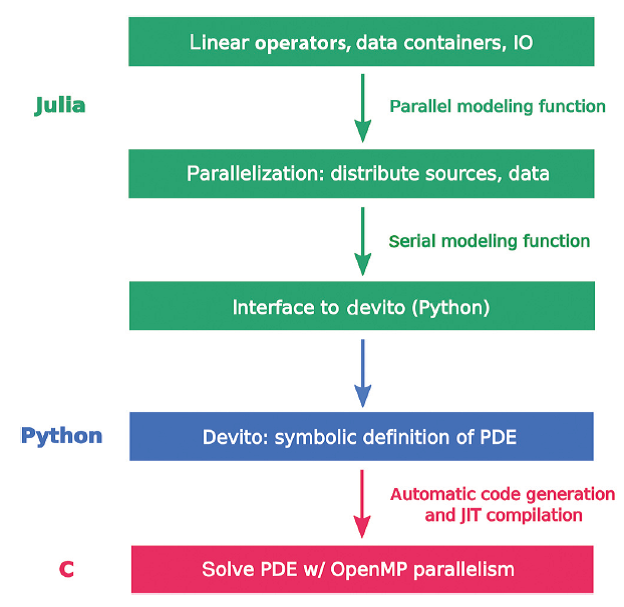
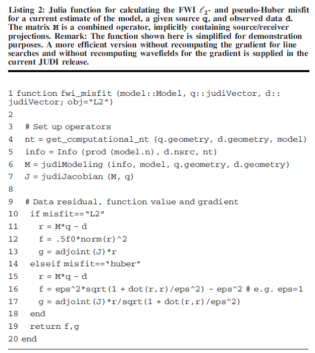
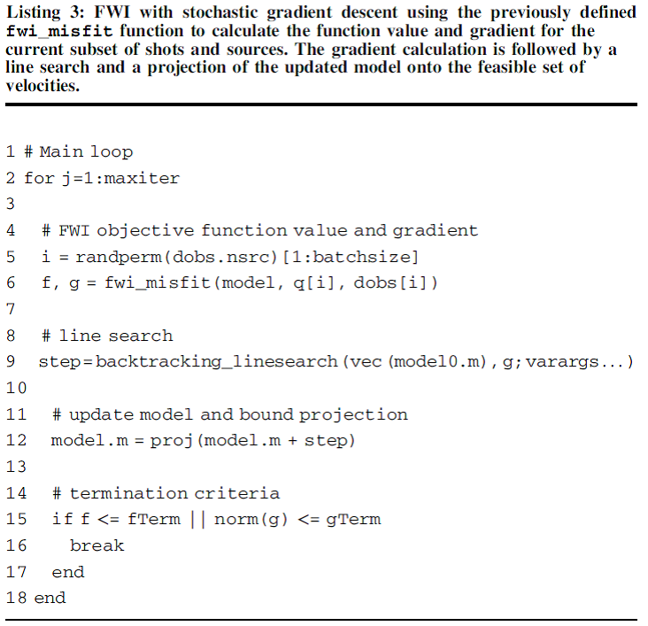
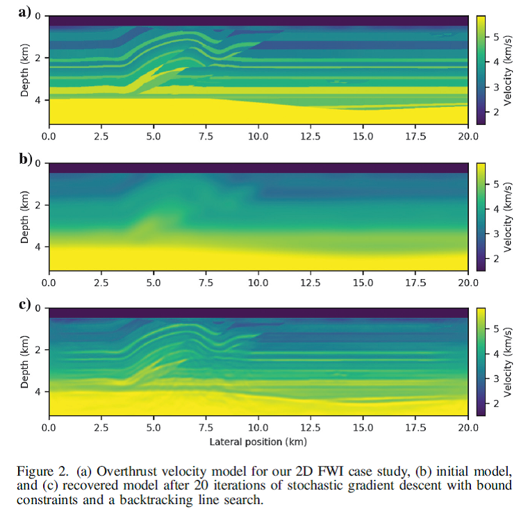
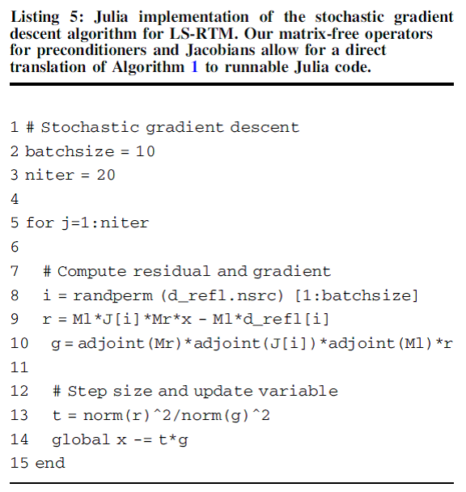
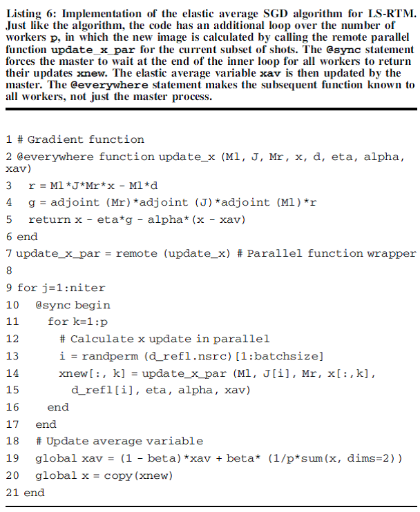

# JUDI框架的介绍

JUDI是由Georgia Institute of Technology开发的，快速实施Fullwaveform
inversion (FWI) (Virieux and Operto, 2009)
或最小二乘逆时偏移成像(LS-RTM)的模型。

## JUDI软件架构与实施

JUDI构建于多个抽象层，在问题相关的抽象、并行化和波动方程求解器之间有清晰的分离，如图1。设计各抽象层处理某些方面的复杂度：

图1 JUDI的软件层级和与波动方程求解器Devito的接口

JUDI框架的创新是：使用面向问题（FWI和LS-RTM）的抽象化，完全垂向集成了现代编译器技术和自动代码生成技术到地球物理反演框架；使用高层级编程语言，研究人员可使用这些工具在开发阶段交互式，以及以批处理模式解决大规模3D问题。

### 地震模拟和反演的抽象

JUDI第一层是无矩阵线性算子和向量地震数据容器。

### 并行化

Devito内部实施了MPI并行。Julia具有内建的并行机制。

### 与波动方程求解器Devito的接口

图1中软件框架的最后一层是time_modeling函数的串行实例化，包含Julia与Devito的接口(Lange
et al., 2016)。Devito是符号表征PDE的Python
DSL库，基于优化的有限差分模板，运行时自动生成代码，从Python直接调用。

使用Devito求解波动方程，而不是使用Julia直接求解波动方程，Devito在计算效率和内存使用上具有显著优势，以及高效的代码开发。Devito参考文献(Louboutin
et al., 2018a; Luporini et al., 2018)。

JUDI通过PyCall软件包与Python模块接口。JUDI接口收集从无矩阵线性算子来的所有必须的数据和模拟信息，插值震源函数和shot记录到计算时间轴。参数以地址指针传递给Python，避免数据拷贝波动场，因此几乎不会引起内存过载。然后，Devito从符号表述生成优化的C代码，编译和运行它。

## 数值算例

详细实施FWI的Devito和JUDI手册参考Louboutin et al. (2017b) 和Witte et al.
(2018)。

### 全波形反演

展示如何实施随机梯度下降和对速度模型实施简单的边界约束。Listing
2显示目标函数的示例，使用标准的*l*~2~-misfit。

有了目标函数，现在可以在Julia中实施简单的随机梯度下降算法，见Listing
3。第1步：选择最小化循环，选择震源和shot的随机子集，计算其梯度和目标函数值。对2D
Overthrust模型实施优化算法，小的数据集有97 shot记录，6Km
offset和3s记录时间。然后，执行20步迭代的随机梯度下降，见Listing 3。

迭代计算后的结果：

### 最小二乘逆时偏移成像(LS-RTM)

展示如何使用梯度下降实施基本的LS-RTM，然后展示如何实施更先进的算法，如弹性平均SGD或带on-the-fly傅里叶转换的LS-RTM。

## 参考文献

Philipp A. Witte, et al. 2019. A large-scale framework for symbolic
implementations of seismic inversion algorithms in Julia. GEOPHYSICS,
84(3): F57--F71.
