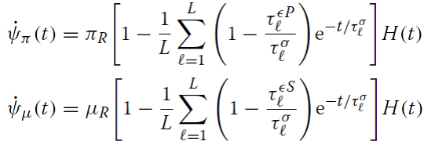
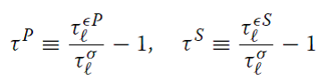
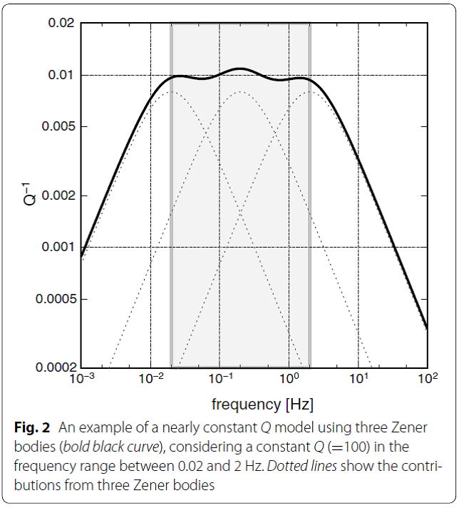
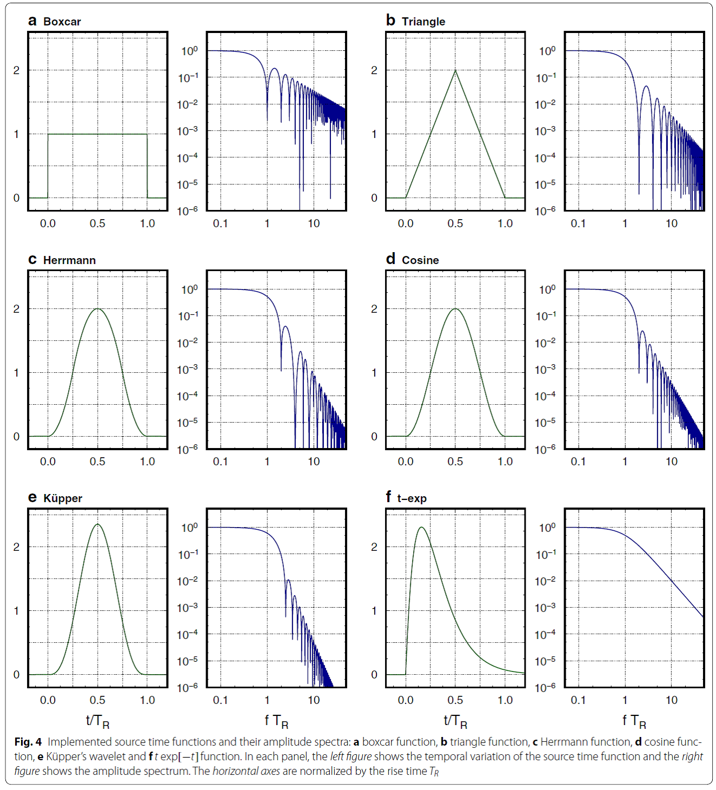

# OpenSWPC模型介绍

## OpenSWPC代码简介

基于交错网格有限差分法，在2D和3D粘弹性介质中，以局部到区域尺度模拟地震波传播。改进了代码的可用性后，称为Open-source
Seismic Wave Propagation Code (OpenSWPC)

速度结构输入模型以NetCDF格式提供，模拟结果输出以NetCDF格式和Seismic
Analysis Code (SAC) 格式 (Goldstein et al. 2003; Helffrich et al.
2013)。

OpenSWPC代码分为3部分：

-   swpc_psv： 2维面波P-SV和SH

-   swpc_sh

-   spwc_3d

其中：

m_debug:用于串行程序的debug信息；m_pdebug:用于并行程序的debug

注意：

网格维数必须是2的幂数。

数值离散需要高阶（\>2阶）精度的差分格式，如TVD，ADER-FV（参考Toro的文章）。

## 模型原理

粘弹性体的地震波模型。Cartesian坐标系下的连续介质力学运动方程包含速度和应力分量：

$\rho\frac{\partial v_{i}}{\partial t} = \sum_{j = 1}^{N_{D}}\mspace{2mu}\frac{\partial\sigma_{ij}}{\partial x_{j}} + f_{i}$
(1)

式中，*N~D~*为模型维度(2,3)，*v~i~*为第*i*个分量的弹性运动速度，*ρ*为介质密度，为剪切应力张量，*f~i~*为体积力。

地震波速与剪切应力之间存在本构关系，采用粘弹性体GZB (Generalized Zener
Body) (JafarGandomi and Takenaka 2007; Maeda et al.
2013)，表述为数个Zener体的并行连接，各Zener体具有不同的物理参数。GZB模型等同于Maxwell
体，常应用于地震波模拟。

粘弹性体的本构方程为：

  (2)

式中，为张力张量，和分别为2个独立松弛模量和的松弛函数的时间导数。对于GZB，它们使用*L*个不同松弛时间（*l*=1,\...,*L*）和P波及S波的传播时间()来描述：

  (3)

在粘弹性模型中，由于物理扩散效应，体波的相速度变成频率的函数(Aki and
Richads,
2002)。因此，在某一参考频率*f~R~*下，体波相速度遵循一定的速度结构。

在实际地球介质中，在低于1*Hz*的很大的一个频率范围内，*Q~P~*和*Q~S~*与频率的关系并不明显。为了生成一定频率范围内近似为常数值*Q*，我们引入Blanch
et al.(1995)的τ方法和Robertsson et al.
(1994)的临时变量。τ方法假设松弛时间和传播时间的比值在所有Zener体(*l*=1,\...,*L*)中为恒定值：

   (4)

给定一组松弛时间，τ方法采用最小二乘法给出参数和的最优值，由此在一定频率范围内，衰减常数*Q~P~*和*Q~S~*近似为常数。基于τ方法的本构方程可写作：

  (5)

式中，为(*i,j*)分量的剪切力张量和第*l*个Zener体的临时变量，满足下列附加方程：

τ方法中，选择合适的松弛时间非常重要。SWPC模型采用一定频率范围内，空间对数分布的松弛时间，如图2。模型使用3个Zener体(*L*=3)，可以生成2*Hz*以下2个量级频率范围的近似常数*Q*。生成近似常数*Q*的频率范围可由控制参数调节。

## 数值离散

交错网格有限差分模型，空间4阶精度，时间2阶精度离散运动方程式(1)
(Levander 1988)。Cartesian坐标系统，水平方向*x,y*,
垂向*z*向下为正，平均海平面msl处*z*=0。图3显示交错网格及变量布置。

使用1阶Crank--Nicolson格式计算本构方程式(5)和内存变量附加方程式(6)
的时间项。离散公式见Maeda et al. (2013)。

计算定义与交错网格上的介质属性需要对相邻网格上的介质参数做合适的平均计算。OpenSWPC模型中，所有的介质属性（松弛介质参数和，密度和衰减参数和）定义在与法向应力分量相同的网格节点上（图3）。当计算速度时需要平均相邻网格节点上的密度（式1），当计算剪切应力分量以及伴随的临时变量（式5和式6）时需要平均相邻网格节点上的松弛刚度模量。SWPC模型分别对密度和松弛刚度模量采用算术和调和平均计算。不用对做平均计算，因为仅当更新计算法向应力分量时才使用。

## 边界条件

采用各向异性-海洋-地形(HOT)有限差分模型 (Nakamura et al.
2012)实施自由表面和大洋底部边界条件。HOT模型最初是为了考虑火山的地形变化而开发的2阶FDM
(Ohminato and Chouet
1997)，后来该边界条件被证明也可以有效应用于流体-固体界面条件 (Okamoto
and Takenaka
2005)。现在，HOT-FDM被广泛应用于区域尺度的近海区域的地震波模拟(Maeda and
Furumura 2013; Maeda et al. 2013, 2014; Nakamura et al. 2012, 2015;
Noguchi et al. 2016; Todoriki et al.
2017)，复杂地形下的高频地震波分散模拟 (Takemura et al.
2015)，以及尺度10cm的圆柱状材料中的人工合成的弹性波传播模拟 (Yoshimitsu
et al. 2016)，均表明HOT-FDM模型可解决不规则地形和曲面表层的问题。

在HOT-FDM方法中，将空气柱视为密度很小的介质，P波和S波的波速为0，即(km/s)，空气层由于零波速，因此地震波无法传播，被视为真空。将海洋水体层视为弹性介质层，密度(g/cm^3^)，(km/s)，(km/s)。

在自由表面和海床，FDM精度减小为2阶，为实施降阶的边界FDM，边界位置通过搜索网格位置（和从0变为固定值）来自动判断。

除非模拟整个地球的地震波传播，其他情况都要使用一个合适的吸收边界条件，消除计算边界处虚假反射对模拟区域的影响。SWPC模型使用Perfectly
Matched Layer (PML) 边界条件 (Chew and Liu 2011)
来最小化虚假反射。目前已有很多种PML方法 (Kristek et al. 2009),
考虑有效应和适用性，SWPC模型实施Zhang and Shen (2010)建议的PML方法。

在运动方程和连续方程外，PML方法需要再求解附加微分方程组，吸收区域方程具有复杂的随频率迁移的吸收函数。通常，在环绕模拟区域的PML区需要使用10\~20个网格。当求解PML附加方程时，为避免较大计算量，假设在PML区介质为完全弹性体，不计算表述粘滞弹性的临时变量(式6)。

即使PML能有效吸收模拟区的向外传播的波，但计算中还会造成严重的不稳定性，特别是当地震波在高度各向异性介质中传播且具有非常大的速度梯度时
(Maeda et al. 2013)。因此，SWPC模型实施了稳定海绵边界条件 (Cerjan et al.
1985)，可通过每一时间步内在吸收层中对应力和速度分量乘以一个小数值来衰减地震波，用户可以选择合适的边界条件。海绵边界条件是完全稳定的，当吸收外传地震波时会导致低计算效率。

## 震源表征

在有限差分模型中，可耦合数个体积力(Grave, 1996)或基于应力不连续表述
(Coutant et al. 1995; Pitarka 1999)
来实施动量张量形式的震源。SWPC模型采用应力不连续表述来实施动量张量震源。

SWPC模型实施单个点源的震源。一个固定断层震源可使用多个点源来表述 (Graves
and Wald, 2001; Takenaka and Fujii
2008)。SWPC模型不限制点源个数，自动识别震源数和分配需要的内存。SWPC模型还实施了单力震源，被广泛用于模拟火山环境下的地震信号激发模拟
(Ohminato et al.
1998)。将动量张量和单个力震源置于法向应力分量的最邻近网格节点。当更新计算剪切应力和速度分量时，该网格节点的震源需要与邻近网格节点震源做平均计算
(Coutant et al. 1995)。

震源时间函数由各种形状的钟形函数（图4）描述，诸如boxcar、三角形、余弦函数、Herrmann二次函数
(Herrmann 1979)和单次循环Kupper小波函数(Mavroeidis and Papageorgiou
2003)。他们都用于一个共同的截断频率，为震源持续时间的倒数，但在截断频率以上拥有不同的向上转移频率(roll-offs)。

平面P波和S波的接近垂直角度的入射角实施。

有时模拟当中，需要交换震源和测站位置的信息 (Aki and Richards
2002)，因为**互易原理**指出一定条件下两个模拟结果的等价性。当存在较少的测站而有很大数量的震源网格节点时，比如需要以较低计算量来计算Green函数。使用互易原理可有效获取大量的合成地震图，SWPC模型具有此功能。模型中，单力震源置于某指定的测站网格点，在多个震源网格处输出位移波形和位移的空间导数。使用一个相比模拟目标的主要周期，具有很短震源时间函数的震源，可以将模拟结果作为Green函数使用。

## 软件实施

FORTRAN2003语言编程。

使用MPI和NetCDF库做并行计算和数据I/O。

SWPC模型中，所有定义，诸如并行策略、网格数、离散和输出文件名等，都在输入参数文件中定义。

使用区域分区，将3D和2D模型分解为2D和1D模型（图5a）。

然后，SWPC模型在各CPU上的分区区域设置速度结构模型，在每时间步内使用MPI数据通信计算模拟区域内的地震波传播。

每时间步内，需要交换最外层节点上的速度和应力分量信息（图5b）。

模型混合使用单精度和双精度变量。静态参数，如介质速度或密度等，用单精度；而震源处的FDM计算和应力不连续性计算使用双精度。我们发现使用单精度会导致长时间计算后的数值不稳定，如图6所示。图6a显示的是2D
P-SV模拟结果，使用单精度时，由于震源位置辐射的随机震荡噪声导致数值不稳定，而单精度不能准确处理这些不稳定的动态且广泛分布的噪声。使用双精度可避免此问题（图6b），但增加了内存使用空间和计算耗时。SWPC模型可选择评估使用单精度算法的计算精度，可减少计算量。

## 模型输入

对于3D地震波传播模拟，采用分层结构模型，该模型由一组随深度变化的速度层组成。通过定义介质参数，如密度、P波和S波速度和分层下的衰减(*Q~P~*,
*Q~S~*)，可描述各层介质的不连续性。最浅分层的深度对应地形，在足够小FDM网格下，将地形作为阶梯边界处理。假设在深度方向轴上*z*=0对应于平均海平面，深度大于0的地形视为海床，在海床和z=0之间为海水水体。

SWPC模型使用NetCD的输入数据格式，可在Generic Mapping Tools
(GMT)中使用。一组NetCDF文件和一个与介质参数相关的上述文件列表作为SWPC模型的输入文件。每个NetCDF文件在经纬度坐标中定义，并包含每个坐标位置上的深度信息。

即使NetCDF输入文件描述了经纬度坐标上定义的深度边界位置，FDM模拟还需要Cartesian坐标系统下的深度边界网格节点位置信息。因此，在Cartesian坐标系统中模拟地震波传播需要坐标转换。为此，SPWC模型中存在一个幂级数形式的Gauss-Kruger坐标转换子程序
(Kawase
2011)。用户需要输入模型中心的经纬度坐标用于坐标转换，SPWC模型会自动生成Cartesian坐标系统下的速度结构模型。因为Cartesian坐标系统中的网格节点位置通常与NetCDF输入文件中的网格节点位置不同，需要应用双三次插值以获取深度边界信息。

分层速度结构模型可通过生成一个随机速度波动来施加，该随机速度波动可由诸如Gaussian或Von
Karman能量谱密度函数的统计特征来描述 (Sato et al.
2012)，用来模拟在各向异性结构中高频地震波的散射 (Furumura and Kennett
2005; Takemura et al. 2015,
2016)。基于随机介质的统计特征，在波数空间中计算随机速度扰动 (Klimeš
2002; Sato et al.
2012)。应用程序生成NetCDF格式的随机速度波动数据供SWPC模型使用，也同样容易实施其他类型的速度模型。

## 模型输出

模拟结果输出格式为2种：指定站点处的波形和2D水平/垂直剖面上的2D地震波场分布快照。

对于波形，指定站点处的波速和位置（Cardesian或经纬度坐标）可以SAC数据格式导出。因为FDM的计算时间步长很小，需要按一定频率输出减小输出数据量，输出采样频率在输入文件中定义。与时间有关的速度波形需要在采样之间做积分。

对于存储为NetCDF格式的波场分布快照，断面取水平或垂直，或沿着地形或深度方向，快照文件包含与P波和S波有关的3D速度分量或位移运动或速度的散度和旋转。

## 算例

### 3D速度结构的模拟和可视化

3D各向异性速度结构模型使用Japan Integrated Velocity Model (JIVSM,
Koketsu et al. 2012)，JISVM由一组沉积层,
Conrad和Moho不连续层、Pacific和Philoippine海板块及海洋Moho和地形界面的数据组成。

实施3D FDM模拟2005年日本福冈县 (M~W~=6.6)
地震中地震波传播过程。震源位置和断层机理从F-net动量张量目录中获取
(Fukuyama et al. 1998)。模型空间网格数2000 2560
500，尺寸间距0.5km，计算时间步长0.025
s，最浅沉积层的最低波速为1.5
km/s。估计长时间段的地震波传播中震源时间函数上升时间为20s。

垂向分量速度跟踪记录位于High Sensitivity Seismograph Network Japan
(Hi-net)的测站，Hi-net由National Research Institute for Earth Science
and Disaster Resilience (Okada et al.
2004)管理，图11显示了各向异性介质中地震波的传播。在距震中500km范围内，扩散表面波到达后形成明显的波群，与周围测站不连贯。

图12的地震波场使用SWPC程序包中的工具生成，该程序读取SWPC输出的NetCDF格式文件中的波场和地形，地形图之上的波场时空演变依次绘制。

### 有限断层破裂和同震变形

OpenSWPC模型中，固定源的断层破裂由多个震源表述。为演示该功能，设置一个如图13所示的各向同性介质半空间中的固定断层模型。假设S波速=3500
m/s和泊松介质(=)，密度=2700
kg/m^3^。模拟中不考虑衰减。假设发生俯角45°滑动，断层尺寸100km\*50km。滑动幅度7.5m，对应动量幅度*M~W~*=8.0。

模拟设置中，固定大小断层由分别沿带状和俯角方向分布得100\*50
(=5000)个点源表述。动量释放均匀分布于点源（假设断层发生各向同性滑动）。断层破裂发展从断层的一个角开始，假设以恒定的破裂速度2.5
km/s在断层上扩展开来。破裂源作为各点源的初始时间延迟来表述。FDM模拟采用3D模型，网格节点600\*600\*400，网格空间尺寸0.25
km，计算时间步长0.01 s。

破裂发生后200s的模拟结果与解析解对比 (Okada, 1985)。

比较了PML和Spongy
layer两种方法的误差。表明PML可以尽可能地消除边界波反射的影响。

### 面波入射

### 互易原理算例

## 参考文献

地震波的有限差分模拟：

Moczo P, Kristek J, Galis M (2014) The finite-difference modelling of
earthquake motions. Cambridge University Press, Cambridge.

FDM:

Levander AR (1988) Fourth-order finite-difference P-SV seismograms.
Geophysics, 53:1425-1436.

交错结构网格下的4阶有限差分格式

### GZB模型

Jafar Gandomi A, Takenaka H (2007) Efficient FDTD algorithm for
plane-wave simulation for vertically heterogeneous attenuative media.
Geophysics 72: H43-H53.

### PML 吸收边界条件

Zhang W, Shen Y (2010) Unsplit complex frequency-shifted PML
implementation using auxiliary differential equations for seismic wave
modeling. Geophysics 75:T141-T154.

### HOT模型

Nakamura T, Takenaka H, Okamoto T, Kaneda Y (2012) FDM simulation of
seismic-wave propagation for an aftershock of the 2009 Suruga bay
earthquake: effects of ocean-bottom topography and seawater layer. Bull
Seismol Soc Am 102:2420-2435.

### 海洋地震-海啸耦合模型：

Maeda T, Furumura T (2011) FDM Simulation of seismic waves, ocean
acoustic waves, and tsunamis based on tsunami-coupled equations of
motion. Pure Appl Geophys 170:109-127.

Maeda T, Furumura T, Noguchi S, Takemura S, Sakai S, Shinohara M, Iwai
K, Lee S-J (2013) Seismic- and tsunami-wave propagation of the 2011 Off
the Pacific Coast of Tohoku Earthquake as inferred from the
tsunami-coupled finite-difference simulation. Bull Seismol Soc Am
103:1456-1472.
