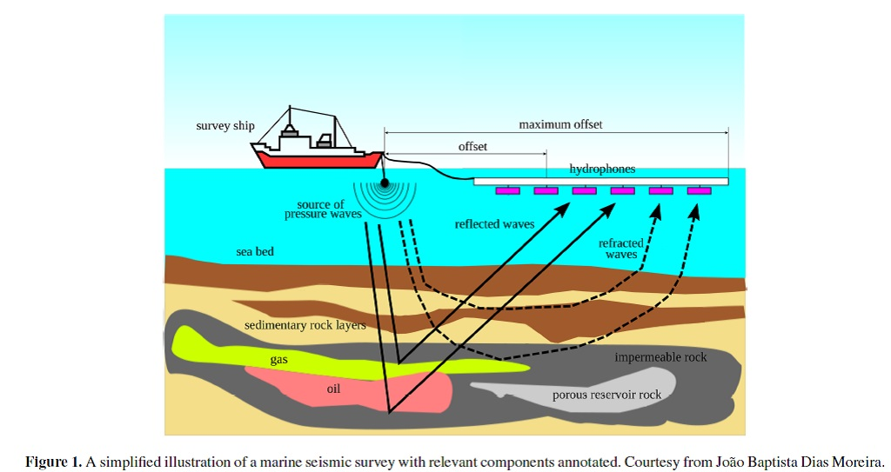
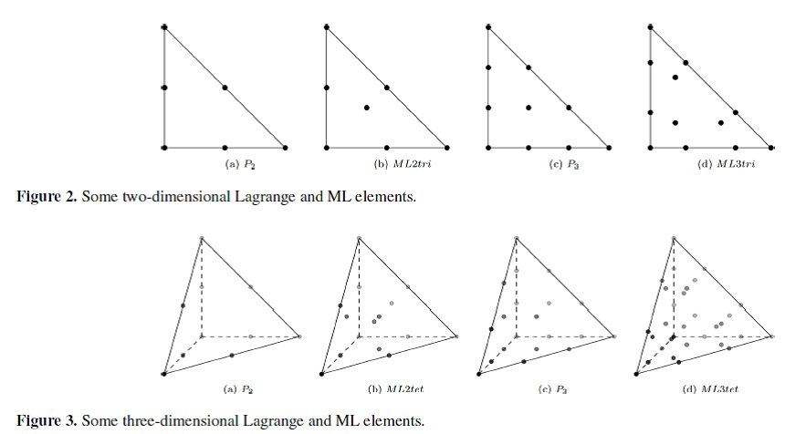
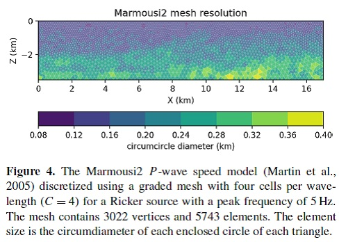
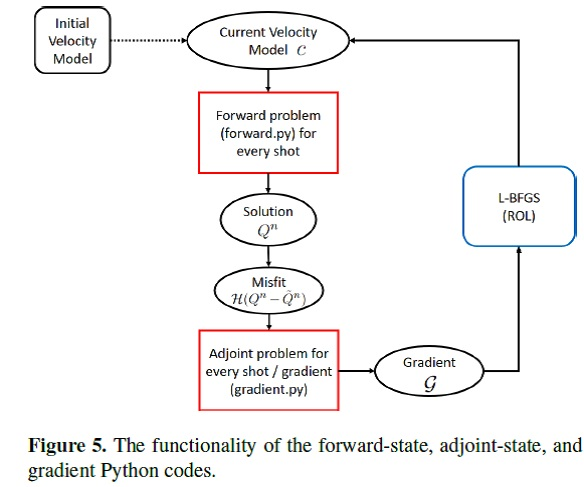

# Spyro介绍

## 摘要

Spyro，在各向异性域上求解波传播方程，实施全波形反演，基于Firedrake库的有限单元框架，高层级的Python脚本使用有限单元法自动化求解PDE。使用连续Galerkin法实施地震速度模型的FWI。时间域FWI使用变尺度三角形网格离散求解域。为求解向前和伴随状态方程，以及计算与网格无关的梯度，使用全隐格式、高阶（2D达到k=5,
3D达到k=3）的质量集中方法。研究表明：采用三角形网格，适应于期望的震源峰值频率和波动场属性（如局部P波波速）以及利用高阶基函数，可减小离散域所需的自由度数目。

## 介绍

全波形反演一般都是基于结构网格的有限差分法求解波动方程，如Devito，不能充分表征不规则几何。基于非结构网格的有限单元法，可使用变尺寸的四边形、三角形、四面体等网格，网格大小可适应于地震波长空间变化的情况，如局部最短波长的变化；或者适应于震源位置，减少自由度数目。另外，显格式时间推进格式的稳定性限制条件，与波速与网格尺寸的最大比值有关，局部网格的自适应可降低与波传播有关的整体计算荷载。

尽管非结构网格为FWI有吸引力，但存在3个主要问题：

1.  使用有限单元法离散后，会形成稀疏系数方程组，求解的计算量很大

2.  变分辨率非结构网格的生成和分布

3.  代码复杂，有限单元编程有关的优化

Spyro给出的对应的解决方法：

（1）三角形有限单元空间，采用对角近似的质量矩阵，这些空间包含k阶多项式集合，具有丰富的bubble函数。积分点数目，对于三角形可达到k=9，对于四面体k=4，可用于全显示数值波动模拟。有限单元法与有限差分法相比，FEM在使用非结构四面体网格时，对于存在复杂内部构造和地形时，可获得更佳的结果(Zhebel,
et al., 2014)。但是目前尚未有FEM用于FWI。

（2）波形自适应的非结构网格生成(SeismicMesh)，使用变分辨率非结构网格求解正演问题，基于震源的峰值频率和地震波波速介质（如波形自适应网格）。

（3）基于有限单元的特定域语言库Firedrake实施高层级的FWI。

## 全波形反演

图1展示了海洋环境中FWI的实验设置。FWI用来模拟地球物理勘探，评估模型参数（如地震波速），以解释观测的波形，最小化误差（即misfit）。该过程称为反演。

层析成像法，比FWI计算量较小，仅利用记录信号的相信息。而FWI利用记录数据的振幅和相信息，因此可以更高分辨率成像，可达到震源频率空间波场的一半。

## 数值方法

### 空间离散

使用连续Galerkin (CG)法离散修正的声波方程和格子的离散伴随方程。

### 高阶质量集中

使用高阶Bubble函数实现有限单元求解，在2D和3D空间使用标准的Lagrange单元，如图2和图3。这些单元称为质量集中单元(mass-lumped
(ML) elements)。

### 波形自适应的三角网格

使用特定域网格生成工具SeismicMesh (Roberts et al.,
2021)，生成变分辨率的三角形网格，生成近似等边和与局部地震波波速相关大小的三角形单元。如图4，是根据Marmousi2速度模型生成的三角形网格。

### 时间离散

2阶精度全显格式有限差分格式，离散所有的时间导数项。也可以使用更高阶的时间推进格式，如Dablain格式或Lax-Wendroff格式。使用低阶时间离散格式时，需要使用更小的时间步长(dt\<1ms)来保证时间离散的误差足够小，用来研究FWI过程中空间离散对正演波动传播的求解。

### 伴随状态和梯度问题离散

数值离散伴随方程的强形式（方程13\~15，方程16-17）。

### 梯度重采样

平衡内存需求与梯度计算精度。

## 计算实施

安装Firedrake, spyro, 试验的数据集。

目前，还是直接在spyro中插入求解伴随方程的代码，应该使用Firedrake的自动微分(AD)
(即dolfin-adjoint, Mitusch et al., 2019)计算梯度。

使用Rapid Optimization Library (ROL; Cyr et al.,
2017)求解给定，梯度、一个cost函数和更新速度模型的方法，下的反演问题。ROL库提供各种算法的接口，实施基于梯度、无约束和有约束的优化算法，与线性搜索条件耦合，满足强Wolfe条件，这提高了FWI代码的健壮性。通过pyROL与Firedrake接口实现调用。

使用2阶优化算法L-BFGS，优化过程（式10）考虑了misfit函数的曲率信息。

### 实施高阶质量集中单元

使用Finite element Automator Tabulator package (FIAT, Kirby, 2004)。

### 接收器和震源

### 反演过程

正演、伴随状态方程、反演和梯度的Python求解过程如图5。

### 双层并行策略

Shot-level和Domain
Decomposition-level并行化。同时使用2层并行化，会显著加速计算，特别是3D情况。

### 网格和文件IO

Firedrake串行读取网格文件，然后并行化分配网格。在执行时以H5文件格式从磁盘读取外部的地震波速度模型。

网格化的速度数据，在运行时，双线性插值到网格单元的节点DoF上。这样单元内部的地震波速度，可使用更高阶单元来更新计算。使用SeismicMesh准备网格化的地震波速度文件。

## 计算结果

验证离散的梯度

设计波形自使用的三角形网格：各向同性的2D P波波速、各向异性的2D
P波波速、各向同性的3D P波波速

计算效率

Marmousi2模型实验

Overthrust 3D剖面数值实验

## 参考文献

Roberts, K., Gioria, R., and Pringle, W.: SeismicMesh: Triangular
meshing for seismology, JOSS, 6, 2687,
https://doi.org/10.21105/joss.02687, 2021.

Keith J. Roberts, et al. spyro: a Firedrake-based wave propagation and
full-waveform-inversion finite-element solver. Geosci. Model Dev., 15,
8639-8667, 2022.
