# Stride框架介绍

Stride是第一款用于医学USCT数据的全波形反演成像的开源软件，Python语言，基于特定域语言库Devito，使用有限差分法求解声波方程（正演）。

<https://github.com/trustimaging/stride>

<https://stridecodes.readthedocs.io>

已有不少用于地球物理和地震勘探的开源库，例如：

（1）Madagascar, SimPEG,
PySIT：灵活性和高层级抽象方面有优势，但忽视计算性能

（2）SAVA, JavaSeis：关注高性能计算，但扩展性较差。

（3）为填补两个极端的沟壑，有SeisFlows, Pyatoa, jInv,
Waveform等，提供与高度抽象语言(Python, Julia,
MATLAB)的高性能求解器的接口。LASIF和Inversionson采用相似的模块化地震工作流管理，封装了高性能的层析求解器。

近期项目，如JUDI，Julia语言编程，更进一步提供高层级抽象，接口高性能求解器（使用DSL
Devito自动生成代码），可使用多种处理器，如CPU (OpenMP), GPU (CUDA,
OpenCL),
FPGA。DSL通过简化实施不同类型的物理和离散化，提高了软件的实用性。

## 方法

### 软件架构

Stride的高层级接口着眼关于高性能超声层析(USCT)的5个基本方面：

1.  首先，提供求解优化问题的抽象和工具，这是大多数层析成像算法的基础；

2.  基于优化算法，一系列的类，封装待求解的层析问题的定义，即：布置的传感器或使用的信号并激发信号；

3.  相关的物理过程，诸如声波或弹性波的传播，然后使用合适的求解器，通过DSL（如Devito）执行高性能计算代码，来模拟传播过程；

4.  上述算法的尺度化，从工作站到HPC集群，使用集成的并行库Mosaic来实现；

5.  最后，使用标准化文件格式（如HDF5），保存和加载问题的不同模块。

### 优化问题求解的抽象

诸如USCT、optoacoustic层析(Arridge et al.,
2016)、超声校正技术（如空间响应识别）(C. Cueto et al., 2021;
2022)等技术，通常都表述为数学优化问题，使用局部方法，如梯度下降法，数值求解。

Stride提供数值优化算法，所有的数学函数都是stride.Operator对象，其输入和输出是stride.Variable对象(Listing
1)。

当调用各stride.Operator时，立即应用到输入，生成一些输出。同时，这些输出保有调用链的记录，都导入DAG
(Directed Acyclic
Graphy)。当调用w.adjoint()时，从根*w*到叶*x*遍历该图，在进程中计算梯度。

考虑PDE约束的优化问题：

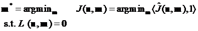

给定标量目标函数或损失函数***J***(**u, m**)以及一些PDE ***L***(**u,
m**)=0；状态变量**u**向量和设计变量**m**向量。

**w(m)**是伴随PDE的解：

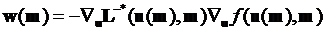

在这个优化问题中，***L***(**u, m**)和***J***(**u,
m**)都是stride.Operator对象。向Stride添加新的函数，需要重新定义新的实施两个方法的stride.Operator子类，forward和adjoint
(Listing 2)。

Stride提供类型stride.LocalOptimiser的局部优化算子，确定给定导数后，如何更新参数。根据Listing
3实施计算导数方向的梯度下降步骤。

### 定义待求解的问题

Stride有系列工具让用户可以定义待求解问题的特性，诸如：介质的物理属性或使用的传感器序列。

Stride中，首先在时空网格上定义问题，确定问题的空间和时间边界及其离散化(Listing
5)。目前仅支持在矩形网格上离散。网格上的矢量和标量变量，是stride.Variable的子类。

基于此，定义一种介质，即一个stride-Medium对象，场确定计算域的物理属性。例如，使用2个stride.ScalarField对象定义介质，包含纵向声速和密度的空间分布，见Listing
6。

接着，定义传感器，使用的用来发射和接收声音的物理设备的计算描述，通过他们的几何和脉冲响应来表述。然后，通过在stride.Geometry定义一系列位置，将这些传感器布置于空间网格中。在Listing
7中，初始化一些stride.Transducer对象，然后将他们添加到对应的stride.Geometry中。

最后，可以在stride.Acquisitions对象中定义一个采样序列（Listing
8）.采样序列由shots
(stride.Shot对象)组成，其中各炮点在采样过程中，确定哪个传感器在何处，在某时刻，起到Source
and/or
Receivers的作用。炮点还包含使用的子波的信息，用来激发Sources以及对应的Receivers观测数据（如果该信息可获取）。

定义问题的所有模块都存储在stride.Problem对象中，都组织为单个的公共实体。

### 模拟物理过程

Stride使用stride.Operator对象定义物理模拟，表征具体实施数值求解PDE。Stride不预设具体的求解器或数值方法，可集成不同的代码和实施，只要它们符合stride.Operator接口。

默认Stride与Devito库集成，DSL从高层级符号微分方程，生成高度优化的有限差分代码。Devito使用OpenMP和OpenACC在CPU和GPU上执行。

Stride中声波模拟控制方程：

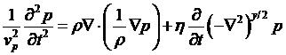

其中，*p*(t,
x)为压强，*v*~p~(x)为纵向声速，ρ(x)是物质密度，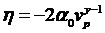和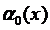为吸收系数。

声波方程离散，时间上4节精度，空间上10阶精度。导致CFL数对于2D限制在0.80，3D上限制在0.66，以及要求各波长上至少有3个网格点(PPW:
points per
wavelength)最小化数值扩散。求解器可选择使用恒定和变化的密度及吸收。吸收服从幂函数律，频率依赖由方程中的参数*y*控制，取值0和2。

边界条件，Stride可选择使用海绵吸收边界或PML边界。信号源和接收可定义在不在网格上的位置，使用bi-/tri-linear插值和高阶sinc函数插值。PDE求解器的伴随实施可考虑无约束边界，这是超声成像最常见的情况。但是，用户PDE算子的用户级扩展可考虑使用边界条件。

尽管Stride目前使用有限差分法，将来会考虑与DSL的拟谱单元法的Dedalus库和有限单元法的Firedrake库集成。

### 并行化

优化问题的导数不是在某一时刻计算一个数据点，而是分批计算，平均结果，获得本迭代步的梯度值。

CPU和GPU集群，可以局部地、远程或云上运行。

Stride中，使用Mosaic便于直观表述并行化。Mosaic是基于actor的并行库，通过ZeroMQ套接字实现异步、零拷贝消息传递。

如何使用Mosaic见Listing 9。

Mosaic确保远程对象以正确顺序执行，见Listing 10。

Mosaic运行时架构见图2，是由一系列处理单元组成，可位于单节点、当地工作站或分布在远程网络上。处理单元包括：monitor进程、warehouse进程和head进程。

Mosaic可以在Jupyter
notebook中交互式运行，或使用mrun命令在终端窗口中运行。使用Mosaic运行时，无需修改任何代码。

Devito也可以使用线程级并行化，多CPU核心并行求解波动方程。

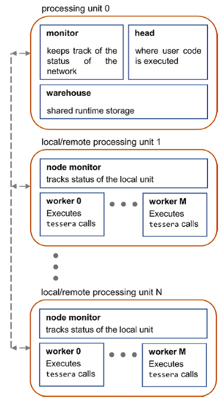

图2 Mosaic运行时框架示意图

### 输入文件和输出文件

设置USCT工作流时，通常会有多个中间文件，描述：介质属性、传感器脉冲响应或实验中记录数据。Stride使用HDF5保存或加载数据集，有很多工具可以与之交互。

图3显示了Stride提供的标准层析工作流不同模块的基本文件定义。

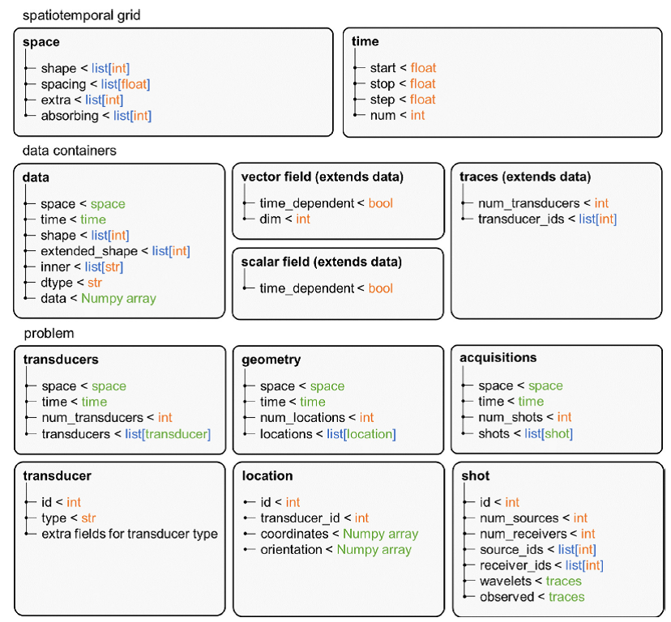

图3 Stride文件格式定义

## 结果

### 模拟精度

验证声学求解精度，与各向同性介质的波动方程的解析解对比。

对比计算是2D和3D，在位于中心的3周期爆音(500 kHz)，以恒定声速1500
m/s发生向恒定密度的介质，没有吸收。使用网格在空间上是0.250mm，时间步长0.060
us (最大CFL数是0.36)。

计算的声波在51等间距点处记录，从发射位置开始，增加步长到最大距离处300
mm。

图4显示对比结果，2D（图4A），3D（图4B）。

还使用Stride计算更复杂介质的声波，使用各向异性的声速、密度和0阶吸收，没有解析解，因此与k-Wave
(拟谱元法)计算对比。使用人类头骨剖面，见图5A，在0.125 mm处采样。

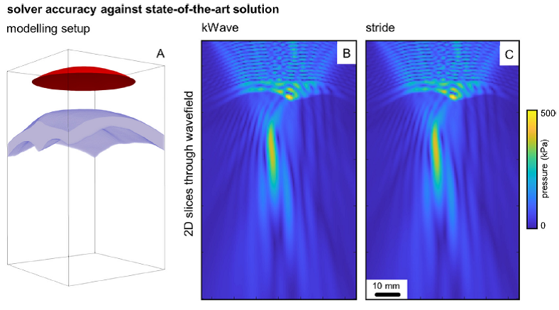

图5声波模拟精度验证以及与k-Wave的对比

### 2D成像 {#d成像 .标题3}

从一个数值乳腺模型提取2D切片，见图6A，执行成像实验。得到的2D模型见图7A。模型从开放数据库(Lou
et al.,
2017)获取，使用生物组织的声学特性修正，添加了一个肿瘤。所有运行使用恒定密度，没有吸收。

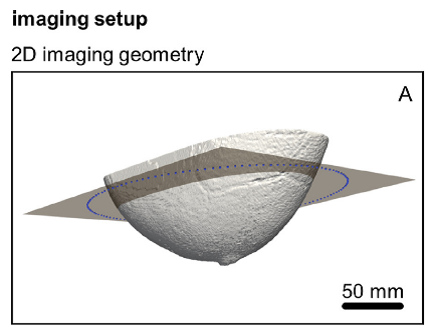

图6

模型以0.500
mm采样，网格456×485。模型围绕128个传感器点，见图6A中的蓝点，作为sources和receivers。使用中心处3周期爆音（500
kHz），时间步长0.080 us(最大CFL为0.26)，模拟200
us的物理过程。在正演和反演节点，以恒定的时间和空间采样，后面的例子也一样。但这不是必须的，用户可以采用不同的扩散和稳定条件，修改不同成像块的离散。

利用Stide的梯度计算功能，使用needs_grad=True初始化声速场，设置起始模型为恒定的声速1500
m/s（图7B）。初始化梯度下降优化算子更新变量(Listing 11)。

然后，远程初始化算子，为每个可获取的worker创建一个复制(Listing
12)。对PDE使用一个算子，对目标函数使用另一个算子，还为源子波和输出时间道创建预处理算子。

实施逐步引入频率的反演，从300 kHZ到600 kHz。

对Listing 14中的重构循环的各次迭代，在Listing 13中运行函数。在Jupyter
notebook中的多处理核心环境下运行反演，通过在notebook开头处增加命令mosaic.interactiver("on")，使用3个Mosiac
worker和每个worker使用OpenMP线程级并行（使用2个线程）。各mosaic
workers一次对一个shot计算其梯度，接着声波求解器运行一次正演和一次伴随传播，这在各次迭代中合并所有shots的梯度之前执行。

所有频段的优化循环运行完成后，获得了最终的重构（图7C）。计算了最终重构和原始模型的绝对误差的平均值，见图7。

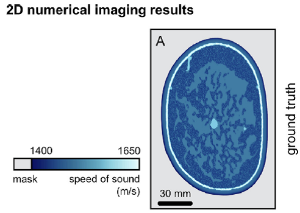

图7

对有2层不同SoS值的PVA
Phantom（头骨与大脑）实施相同成像脚本。Phantom的横断面照片见图8A。

实施反演120us，时间步长0.048 us (最大CFL数0.37)，使用空间采样0.200
mm（最低4.67 PPW），网格尺寸890×890。

使用含有各向同性水体的起始模型（图8B），获得高分辨率重构（图8C）。

使用3个Mosaic worker，各shot梯度计算花费28.32±4.46
s。对调用PDE增加一个参数：pde(...,
platform="nvidia-acc")，即在GPU上运行反演，使用1个Mosaic
worker，各shot梯度计算花费5.63±0.07s。

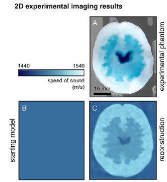

图8

### 3D成像

2D成像的功能有限，例如乳腺的真实层析重构，需要3D正演和反演，考虑人体中完整的声波传播物理过程。同时，3D
FWI的计算量显著增大，需要层析代码尺度化并行。

显示Stride的并行效率，使用一个成年人头（图6B）的3D数值模型，模型基于MIDA模型，根据Guasch
et
al.(2020)分配声学特性参数。图9A\~图9C可看到数值模型的3个切片。模型以0.750
mm空间采样，生成网格367×411×340，超过51
Million个未知参数。围绕人头布置1024个传感器，见图6B，所有传感器起到Sources和Receivers的作用。使用中心处3周期爆音（500
kHz）。模拟超过300 us的过程，时间不长0.150 us (最大CFL数为0.60)。

重构的频率范围是100kHz\~600kHz，起始模型仅包含头骨（图9D-F）。重构中各频率迭代8次，随机选择128
shots。

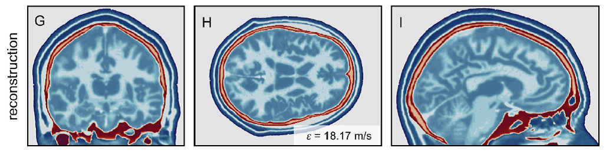

图9 Stride 3D重构

3D重构计算量较大，可在HPC集群环境中运行。删掉mosaic.interactiver("on")，不用修改其他代码。Mosaic分配计算到各计算节点。各shot梯度计算花费5.82±0.36
min，包括工作分配的耗时。

使用Stride得到的最终重构的高精度见图9G\~I。3D重构的定量误差见图9的符号ε。

Strong
scaling测试结果见图10。直到使用128个计算节点，Mosaic实现接近理想加速。后期的2%的性能损失，可归因于Python编程的单线程特性。

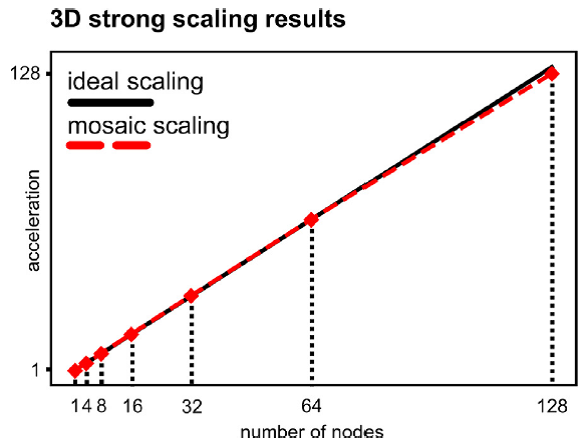

图10 针对3D头模型的 Mosaic的强尺度化分析

## 讨论

反演问题，使用伴随方法计算梯度，类似机器学习PyTorch库；与机器学习工具集成。

以微分形式处理PDE或损失函数，但可以通过内部数学运算实施无微分。

目前Stride仅在矩形网格上使用有限差分法，将来可以与不同方法集成，例如DSL的有限单元法Firedrake库或拟谱方法的Dedalus库。

Stride的直接应用有2部分：声波传播模拟和层析成像。模拟声波传播的开源库，如k-Wave,
Field II,
Bempp-cl等，需要根据应用场景选择使用。例如，... Stride与k-Wave对复杂组织几何体获取相似精度的重构，而Stride的有限差分求解器计算效率更高，而k-Wave在相似离散网格上的数值扩散更小，这得益于逆谱法。[注]{.mark}：k-Wave的官网提到：相比有限差分法，k-Wave的计算效率更高，相比高阶有限差分法，k-Wave使用的网格模板更小，因此需要的内存更小。因此，需要在Stride中集成不同数值方法的求解器进行对比，然后选择。

HPC荷载分布，通常使用MPI库，

Python的Dask, PyCOMPS, Ray, ...

使用Mosaic，直接从多核心环境切换到HPC集群，无需修改代码。

在UNIX, Windows WSL和Docker容器中部署

## 参考文献

S. Fomel, P. Sava, I. Vlad, Y. Liu, V. Bashkardin, 2013. Madagascar:
open-source software project for multidimensional data analysis and
reproducible computational experiments, J. Open Res. Softw. 1 (1) : e8.

R. Cockett, S. Kang, L.J. Heagy, A. Pidlisecky, D.W. Oldenburg, 2015.
SimPEG: an open-source framework for simulation and gradient based
parameter estimation in geophysical applications, Computers and
Geosciences 85: 142-154.

R. Hewett, L. Demanet, PySIT: Python seismic imaging toolbox
https://github. com/pysit/pysit

S.R. Arridge, M.M. Betcke, B.T. Cox, F. Lucka, B.E. Treeby, On the
adjoint operator in photoacoustic tomography, Inverse. Probl. 32 (11)
(2016) 115012, doi: 10.1088/0266-5611/32/11/115012

C. Cueto, J. Cudeiro, O.C. Agudo, L. Guasch, M.X. Tang, Spatial response
identi-fication for flexible and accurate ultrasound transducer
calibration and its ap-plication to brain imaging, IEEE Trans. Ultrason.
Ferroelectr. Freq. Control 68 (1) (2021) 143-153, doi:
10.1109/TUFFC.2020.3015583

C. Cueto, L. Guasch, J. Cudeiro, O.C. Agudo, T. Robins, O. Bates, G.
Strong, M.X. Tang, Spatial response identification enables robust
experimental ultrasound computed tomography, IEEE Trans. Ultrason.
Ferroelectr. Freq. Control 69 (1) (2022) 27-37, doi:
10.1109/TUFFC.2021.3104342

Y. Lou, W. Zhou, T.P. Matthews, C.M. Appleton, M.A. Anastasio,
Generation of anatomically realistic numerical phantoms for
photoacoustic and ultrasonic breast imaging, J. Biomed. Opt. 22 (4)
(2017) 041015, doi: 10.1117/1.JBO.22.4. 041015
