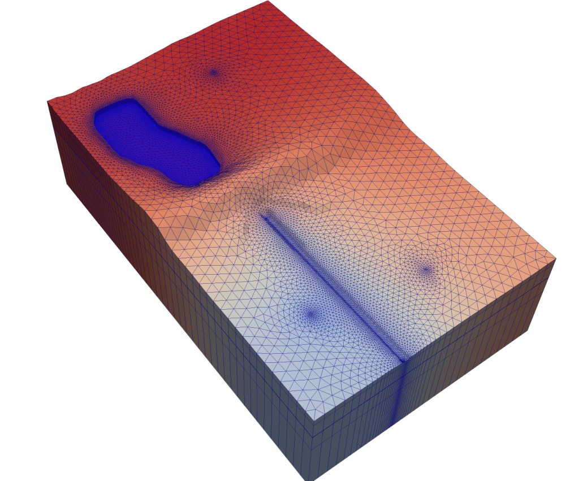

# MODFLOW 6概览

MODFLOW6是模拟地下水模型及地下水溶质输移的国际权威软件，已经MPI并行化。

## 简介

MODFLOW现在常用的是MODFLOW-2005
(结构网格)、MODFLOW-USG(非结构网格)与MODFLOW6 (统一模型框架，最新)。

MODFLOW-USG可使用嵌套网格(nested
grid)、四叉树网格(quadtree)；而MODFLOW6可使用结构网格、MODFLOW-USG的网格以及DISV三角形网格。

### 并行化情况 {#并行化情况 .标题3}

MODFLOW-2005已有OpenMP与CUDA并行化的线性方程组求解器。

MODFLOW-USG只有串行版本。

MODFLOW6已实现MPI并行化。

### 前后处理 {#前后处理 .标题3}

-   Gridgen（不是Pointwise
    Gridgen）可作为MODFLOW-USG的quadtree网格生成程序，导出ASCII格式的MODFLOW-USG的网格输入文件。

-   flopy是MODFLOW系列软件的后处理程序，方便地实施MODFLOW的网格离散、编译运行和可视化等；

-   Model Viewer，目前仅支持Visual Studio
    2019编译，可用来可视化MODFLOW6的计算结果，包括结构网格与非结构网格。

{width="4.719476159230096in"
height="3.8663549868766403in"}

MODFLOW-USG

## modflow6概述

MODFLOW is a popular open-source groundwater flow model distributed by
the U.S. Geological Survey. For 30 years, the MODFLOW program has been
widely used by academic researchers, private consultants, and government
scientists to accurately, reliably, and efficiently simulate groundwater
flow. With time, [growing interest in]{.mark} surface and groundwater
interactions, local refinement with nested and unstructured grids, karst
groundwater flow, solute transport, and saltwater intrusion, has led to
the development of numerous MODFLOW versions. Although these MODFLOW
versions are often based on the core version (presently MODFLOW-2005),
there are often incompatibilities that restrict their use with one
another. In many cases, development of these alternative versions has
been challenging due to the underlying MODFLOW structure, which was
designed for the simulation with a single groundwater flow model using a
rectilinear grid.

MODFLOW 6 is the latest core version of MODFLOW. It synthesizes many of
the capabilities available in MODFLOW-2005, MODFLOW-NWT, and
MODFLOW-LGR. MODFLOW 6 was built on a new object-oriented framework that
allows new packages and models to be added, and allows any number of
models to be tightly coupled at the matrix level. The Groundwater Flow
(GWF) Model is the first model to be released in MODFLOW 6. It supports
regular MODFLOW grids consisting o[f layers, rows, and columns]{.mark},
but it also supports [more flexible grids]{.mark} that may conform to
irregular boundaries or have increased resolution in areas of interest.
The GWF Model consists of the original MODFLOW stress packages (CHD,
WEL, DRN, RIV, GHB, RCH, and EVT) and four advanced stress packages
(MAW, SFR, LAK, and UZF), which have been distilled from their
predecessors to contain the most commonly used capabilities. MODFLOW 6
contains a new Water Mover (MVR) Package that can transfer water from
provider packages to receiver packages. Providers can be many of the
stress and advanced stress packages; receivers can be any of the
advanced stress packages. This new capability makes it possible to route
water between lakes and streams, route rejected infiltration into a
nearby stream, or augment lakes using groundwater pumped from wells, for
example. To modernize user interaction with the program, the MODFLOW 6
input structure was redesigned. Within package input files, information
is divided into blocks, and informative keywords are used to label
numeric data and activate options. This new input structure was designed
to make it easier for users to adjust simulation options in an intuitive
manner, reduce user input errors, and allow new capabilities to be added
without causing problems with backward compatibility.

（1）统一个几个不同版本的modflow的功能，推进modflow继续迭代开发；

（2）可使用规则网格，也可使用不规则网格（局部加密功能）；

（3）保持原有的6个功能模块，又新开发了4个功能模块；

（4）新的Water Mover (MVR)软件包，方便水流在与不同区域的耦合；

（5）新的input结构，输入信息分块，有提示性关键词，降低错误发生。

modflow6是modflow的第6个版本（之前的是1984, 1988, 1996, 2000,
2005）。新的设计中，任意数目的模型都包含在模拟中，这些模型相互独立，没有交互，也可以交互信息或通过把他们添加到相同的数值求解中，在矩阵层面上实现紧密耦合。相互之间的信息交换与交换对象隔离，这方便模型开发且相互之间独立使用。在新的框架下，区域地下水模型可与多个局部尺度的地下水模型耦合，或者地表水模型与多个地下水模型耦合。自然地，框架也可扩展至包括溶质输移模拟。

## Groundwater Flow (GWF) and Groundwater Transport (GWT) Models

modflow6目前包含2类水文模型：Groundwater Flow (GWF)与Groundwater
Transport (GWT)

MODFLOW 6基于统一的控制体有限差分法，单元与周围单元水力连接。

用户可以定义计算网格有：

（1）规则网格，包含层、行和列；

（2）层网格：定义(x,y)节点对；

（3）非结构网格：MODFLOW-USG

对于设计水面线的复杂问题，选用Newton-Raphson公式，基于MODFLOW-NWT和MODFLOW-USG。

GWF模型分为很多包\"package\"。

•those related to internal calculations of groundwater 􀀂flow
(discretization, initial conditions, hydraulic conductance, and storage)

•stress packages (constant heads, wells, recharge, rivers, general head
boundaries, drains, and evapotranspiration)

•advanced stress packages (stream􀀂ow routing, lakes, multi-aquifer
wells, and unsaturated zone flow)

GWT模型，溶质输移模拟

XT3D水流模拟：[全3D，]{.mark}各向异性的水力传导张量。可改进地下水模拟的精度，例如模型网格违反了某种几何要求的情况。因此，XT3D选项是Ghost
Node Correction (GNC) Package的替代选项，是为MODFLOW-USG开发的。

## 输入文件结构

MODFLOW6的输入结构重新设计。输入文件中，信息分成块和信息关键词（用来标记数值数据和激活选项）。

## Automated Testing

This repository contains an ./autotest folder with python scripts for
building and testing the MODFLOW 6 program and other workflow tasks. The
testing workflow relies heavily on several related repositories
including:

[[modflowpy/pymake]{.underline}](https://github.com/modflowpy/pymake)

[[modflowpy/flopy]{.underline}](https://github.com/modflowpy/flopy)

[[MODFLOW-USGS/modflow6-testmodels]{.underline}](https://github.com/MODFLOW-USGS/modflow6-testmodels)

[[MODFLOW-USGS/modflow6-largetestmodels]{.underline}](https://github.com/MODFLOW-USGS/modflow6-largetestmodels)

[[MODFLOW-USGS/executables]{.underline}](https://github.com/MODFLOW-USGS/executables)

[[Deltares/xmipy]{.underline}](https://github.com/Deltares/xmipy)

## 编译

参考DEVELOPER.md

下载的源码包默认是使用ifort编译器（包括mpiifort）。使用gnu编译器，需要修改一下。

# MODFLOW6的面向对象编程

## 主要的框架组件

一个组件可能是module, object,
subroutine或以上的集合用于处理函数的一部分。

组件如图1，虚线表示不是对象实例，而是定义组件的module, object, class

TimingModule与之前版本的modflow一致，将模拟期分为时间步和stress periods

一次求解包含一个或多个模型，模型之间产生交换。所有其他求解类型都必须继承超类BaseSolutionType，NumericalSolutionType是一类求解。BaseSolutionType和NumericalSolutionType之间的向下箭头用来表示umericalSolutionType是BaseSolutionType的亚类。NumericalSolutionType专门用来求解一个或多个模型，如GWF模型。

## Simulation

### 主程序 {#主程序 .标题3}

主程序以一定的顺序调用组件的过程。过程调用顺序的流程图如图2。

{width="5.124654418197725in"
height="3.0188331146106737in"}

### Simulation Name File {#simulation-name-file .标题3}

## Timing Module

模拟时段分为stress
periods，期间的输入数据（外部驱动）是常数的，在分解为若干时间步（如图5）。时间步长是有限差分GWF模型的基本计算单位，而stress
periods是为了方便用户输入。时间离散信息从TDIS输入文件读取。

用于定义stress period长度PERLEN

时间步长数分为NSTP份：

## Solutions

主程序求解1个或多个模型，通过Exchange连接它们。所有求解都是BaseSolutionType的亚类。数值求解在NumericalSolutionType类中实施。

调用BaseSolutionType的过程如图6。主要过程在主程序调用，使用对应的过程名称。图6中显示的过程是BaseSolutionType的方法。

### 数值解(Numerical Solution) {#数值解numerical-solution .标题3}

数值求解从NumericalModelType类继承。使用exchanges连接数值模型。

数值模型如GWF模型，形成一个非线性方程组：Ax=b

如图7，显示了A系数矩阵的结构（一个数值求解3个模型）。

数值解中的方法处理非线性方程组，包括：backtracking,
欠松弛等。。。（如图8）。

### 逆向跟踪 {#逆向跟踪 .标题3}

### 拟过渡性持续计算 {#拟过渡性持续计算 .标题3}

### 欠松弛方法 {#欠松弛方法 .标题3}

### 牛顿欠松弛 {#牛顿欠松弛 .标题3}

### 求解线性化矩阵方程组 {#求解线性化矩阵方程组 .标题3}

求解非线性方程组，需要重复求解线性方程组。使用预处理迭代方法求解线性方程组（非结构系数矩阵）。

MODFLOW6产生的系数矩阵存储为非结构格式，即使求解问题是结构网格的。

UPCG求解器(Hughes and White (2013))扩展至：

（1）使用CG和BiCGSTAB线性加速求解，由承压流和非承压流（水力传导）形成的对称系数矩阵，以及Newton-Raphson公式、ghost
nodes形成的不对称方程组。

（2）预处理步使用ILU分解的各级填充，增加求解效率。

（3）矩阵重排序。

图10显示线性方程组求解流程。

Hughes, J.D., and White, J.T., 2013, Use of general purpose graphics
processing units with MODFLOW: Groundwater, v. 51, no. 6, p. 833-846,
accessed June 27, 2017, https://doi.org/10.1111/gwat.12004.

## Models（模型）

模型是modflow6框架的主要组件。一个模型就是描述水文过程，如：地下水流、conduit中的紊流或层流、溶质或热输移或陆地表面水文过程等。所有模型应该都是BaseModelType的亚类，如图1。

图11显示了主程序调用过程到BaseModelType方法。向框架增加新模型无需修改主程序代码。

### 数值模型 {#数值模型 .标题3}

NumericalModelType定义的数值模型，是模型的特殊类，与数值方法一起工作。

图12显示了调用NumericalModelType的方法。

{width="5.33654636920385in"
height="3.9866283902012247in"}

{width="5.3942454068241465in"
height="1.9472014435695537in"}

### 软件包(Packages) {#软件包packages .标题3}

数值模型又分为"软件包"。

一个package处理模拟的某个功能。

通过向系数矩阵对角位置增加一个数学模型，可以对RHS实施一些边界条件。对于此类边界条件，BaseNumericalPakageType可分解为创建的边界软件包类的亚类。根据此实施，模型存储了包含的一系列边界软件包。然后，作为数值模型方法，模型对边界软件系列做迭代循环，调用单个的软件包方法。在正确时间自动调用软件包方法，这样就实施了新类型的边界软件包。

## Exchange

交换对象是为了连接或传递2个模型间的信息，交换的概念实施保证模型的独立。使用交换的概念后，需要连接某模型到另外一个模型时，无需每次更新模型，仅需要编写一个exchange类。

### 数值交换 {#数值交换 .标题3}

NumericalExchangeType定义数值交换，是一种特殊的交换类，与数值求解联合工作。使用数值交换向A矩阵增加斜对角项，如图7的紫色方块。如图13，显示了调用NumericalExchangeType类。主程序调用这些方法，也从NumericalSolutionType类的Define和Calculate过程调用这些方法。

下面是数值交换的过程介绍，从主程序和数值求解调用。

{width="5.397799650043744in"
height="0.5047145669291339in"}

{width="5.306187664041995in"
height="4.517998687664042in"}

## Utilities

MODFLOW6有很多工具类和子程序，这些工具负责打开文件、读写数组、存储链接列表信息等，还有几个更大的工具函数，用于时间序列、观测和内存管理有关。

### 时间序列 {#时间序列 .标题3}

时间有关的软件输入，各时间步之间变化，输入可能是边界驱动(stress)以及井流量或河流水位。或者，输入也可能是如drain
conductance的边界驱动。使用时间序列提供软件变量的时间变化值，时间-数组序列（随时间变化的2D数组）。时间-数组序列可认为是2D数组，该数组元素是时间序列。

。。。。。。

图14显示了3种插值方法和时间离散的效果。

### 观测值 {#观测值 .标题3}

MODFLOW6的OBS工具使用户可以为输出指定选择的模型之，便于后处理。很多情况下，模型值就是模型计算的变量值，如水头或流量。一些情况下模型值是模拟特征的属性（如传导度）。与之前版本的MODFLOW不同，MODFLOW6的OBS工具不支持指定观测值。为与之前版本保持一致，"观测"是指待提取的识别变量值。

观测输出可保存到ASCII文本或二进制格式文件。头记录包含观测名称，保存到各观测文件的开始位置。接着是各时间步的一次记录。各记录包含模拟时间和头文件中列出的观测的提取值。数值作为模拟过程保存到输出文件。如果输出文件是文本，模拟期间可监测数值。

### 内存管理 {#内存管理 .标题3}

MODFLOW6的大多数标量和数组变量都声明为FORTRAN指针。使用指针之前，必须分配空间（或指向其他变量）。

管理内存的子程序位于MemoryManagerModule类。
