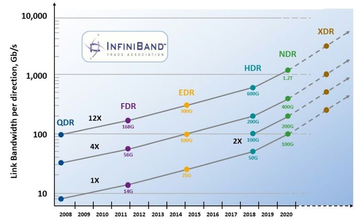
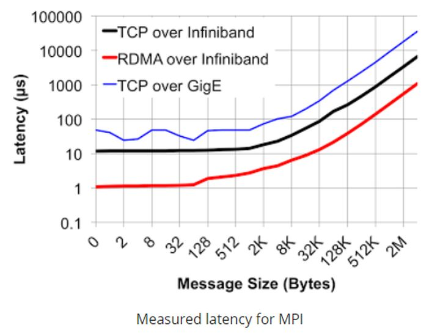
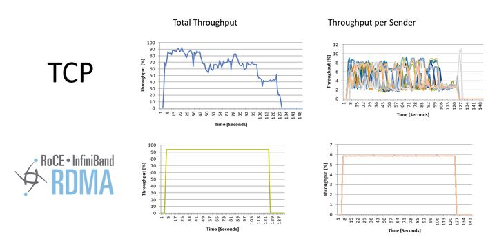
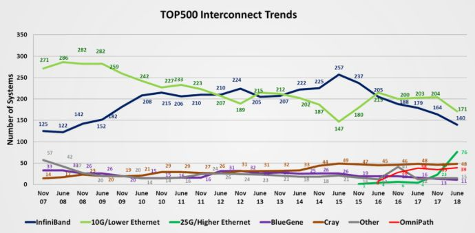
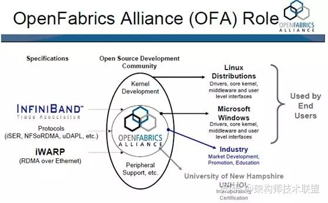
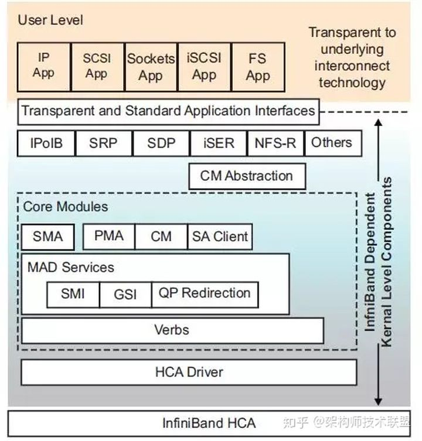

# 谈谈InfiniBand和Ethernet网络的差异

[IB与Ethernet的比较](./media/Ethernet%20vs.%20Infiniband.jpg)

InfiniBand是一种开放标准的高带宽，低时延，高可靠的网络互联技术。该技术由IBTA（InfiniBand
Trade
Alliance）定义推动在超级计算机集群领域广泛应用，同时，随着人工智能的兴起，也是GPU服务器首选的网络互联技术。目前，最新的InfiniBand产品为Mellanox生产的HDR，可以为网络提供端到端高达200Gbps的带宽，为高性能计算，人工智能等领域带来无与伦比的网络体验，最大程度释放集群内计算潜能。

以太网(Ethernet)指的是由Xerox公司创建并由Xerox、Intel和DEC公司联合开发的基带局域网规范标准，通用的以太网标准于1980年9月30日出台，是当今现有局域网采用的最通用的通信协议标准[\[1\]](https://zhuanlan.zhihu.com/p/163104439/edit#_ftn1)目前由IEEE组织的IEEE802.3标准组织制定其技术标准，目前已经发布了100GE，200GE，400GE的以太网接口，是目前速率最高的传输技术。

作为互连技术的InfiniBand和Ethernet可以说各有其特点和差异，不能一概而论孰优孰劣，在各自不同的适用领域不断发展演进，成为我们网络世界中不可或缺的两种互连技术。

对于Ethernet毋庸多言，和IP技术构成了目前世界上整个互联网络大厦的基石，所有人与智能设备皆依靠Ethernet实现万物互联，这与其设计初衷就是为了能够实现更好的兼容有关，能让不同的系统可以更好的互连互通，这样使得Ethernet自诞生之初就具有非常强的适应性，经过数十年的发展成为互联网中事实上的标准。

而InfiniBand，作为标准制定的初衷是为了解决高性能计算场景中突破集群中数据传输瓶颈痛点应运而生的一种互连标准，从制定之初就定位为高端应用，互连互通不是主要矛盾，高性能通信才是主要切入点，所以，相对于Ethernet技术而言，由于定位的差异导致InfiniBand与生俱来就有很多和Ethernet的不同，主要表现在带宽、时延、网络可靠性、和组网方式上。

## 带宽

自InfiniBand诞生以来，很长一段时间InfiniBand网络速率的发展都是快于Ethernet的，主要原因就是因为InfiniBand应用于高性能计算中服务器之间的互连，Ethernet面向更多的是终端的设备互连，带宽上没有太高的需求，所以，这就导致Ethernet的标准组织设计标准时仅仅考虑如何实现互通，而没有像InfiniBand那样不仅考虑互通，还要考虑网络在高速传输时如何降低对CPU的负载，在高速通信时不仅带宽可以高效利用同时占用尽量少的CPU资源。对于10G以上的高速网络流量，如果所有报文都由CPU处理封包解封包将会占用非常多的资源，这样相当于用昂贵CPU的大量资源，资源仅仅是处理网络传输的简单任务，在资源配置的角度上看是一种浪费，所以，由于第一代InfiniBand的SDR的速率就是10Gbps，这种现象是不得不考虑进来的，因而借鉴DMA[\[2\]](https://zhuanlan.zhihu.com/p/163104439/edit#_ftn2)技术的思路，旁路CPU，不仅提高了的数据传输带宽而且减轻的CPU的负担，定义了[RDMA[\[3\]](https://zhuanlan.zhihu.com/p/163104439/edit#_ftn3)技术]{.mark}，从而解决了这一问题，使得在高速网络传输中对CPU实现了卸载，同时提高了网络的利用率。这使得InfiniBand网络可以快速迭代，从SDR
的10Gbps DDR 20Gbps QDR 40Gps FDR56Gbps EDR
100Gbps发展到今天的200Gbps，受益于RDMA技术，CPU没有因为速率的大幅提升而牺牲更多的资源用于网络处理而拖慢整个HPC性能的发展，未来将会推出**400Gbps**的NDR和**800Gbps**的XDR。

{width="4.720270122484689in"
height="2.8882502187226597in"}

## 时延

此处主要分为两部分进行对比，一部分在交换机上，作为网络传输模型中的二层技术，Ethernet交换机普遍采用了[MAC查表寻址和存储转发的方式]{.mark}（有部分产品借鉴了InfiniBand的Cut-though技术）由于需要考虑诸如IP、MPLS、QinQ等复杂业务的处理，导致Ethernet交换机处理流程较长，一般会在若干us（支持cut-though的会在200ns以上），而InfiniBand交换机二层处理非常简单，仅需要根据16bit的LID就可以查到转发路径信息，同时采用了Cut-Through[\[4\]](https://zhuanlan.zhihu.com/p/163104439/edit#_ftn4)技术大大缩短了转发时延至100ns以下，远远快于Ethernet交换机；网卡层面如前所述，采用RDMA技术，网卡转发报文不需要经过CPU，大大加快了报文在封装解封装处理的时延，一般InfiniBand的网卡收发时延（write，send）在600ns，而基于Ethernet上的TCP
UDP应用的收发时延会在10us左右，相差十几倍之多。

{width="3.3646161417322835in"
height="2.5398972003499565in"}

## 可靠

在高性能计算领域，丢包重传对整体性能的影响非常大，所以需要一个高可靠的网络协议从机制层面来保证网络的无损特性，从而实现其高可靠特性。InfiniBand是一个完整的网络协议有自己定义的一至四层格式，报文在网络上的收发是基于端到端的流控来实现的，也就是说报文从发送端是否可以发送是受接收端调度控制的，这样就可以保证报文从发送到接受都不会出现拥塞，这样不仅实现了真正意义上的无损网络，同时由于网络上没有拥塞而使得业务流在InfiniBand的网络上传输不会出现缓存积累，这样时延抖动也就控制到了最小，从而构造了一个理想纯净的网络；而Ethernet构造的网络没有基于调度的流控机制，导致报文在发出的时候是不能保证对端是否会出现拥塞的，因此，为了能够吸收网络内瞬时流量的突然增大，需要在交换内开辟多大数十MB的缓存空间用于暂时存储这些报文，而缓存的实现是非常占用芯片面积的，这使得同等规格的Ethernet的交换机芯片面积明显大于InfiniBand芯片，不仅成本高而且功耗也会更大，除此之外，由于没有端到端的流控机制，导致网络在略极端情况下，会出现缓存拥塞而导致的丢包，使得数据转发性能大幅波动。

{width="5.067240813648294in"
height="2.489134951881015in"}

## 组网方式

Ethernet的组网方式需要IP配合ARP协议来自动生成MAC表项的，需要网络内的每个服务器来定时发送报文保证表项的实时更新，众所周知，网络内节点的增加删除都要通知到网络中的每一个节点，当网络内的节点数量增加到一定程度的情况下，这样网络会产生广播风暴从而使得网络带宽被严重浪费，因此需要引入Vlan机制划分虚拟网络，限制网络规模，而由于Ethnernet网络本身表项学习机制的不足会导致环路网络，又必须引入STP等协议保证网络转发路径不会出现环路，增加了网络的配置的复杂度。同时，随着SDN技术兴起，由于Ethernet网络设定之初的理念是以兼容为基础的缘故，基因中就不具备SDN的特质，导致SDN部署在ethernet网络上需要重新改变报文格式（VXLAN[\[5\]](https://zhuanlan.zhihu.com/p/163104439/edit#_ftn5)）或者改变交换机的转发机制（openflow[\[6\]](https://zhuanlan.zhihu.com/p/163104439/edit#_ftn6)）这样的方式对Ethernet进行改造来满足SDN的要求；这一点对于InfiniBand来说是天生具备了SDN理念的，每个InfiniBand的二层网络内有会有一个子网管理器来配置网络内节点的ID（LocalID），然后通过控制面统一计算转发路径信息，下发至InfiniBand交换上，这样组成一个InfiniBand的二层组网需要做任何配置既可以完成网络配置，同时没有泛洪的问题，也省去了Vlan和环网破环的操作，可以轻松部署一个规模几万台服务器的超大二层网络。这是Ethernet所不能具备的。

虽然，以上几个角度是从InfiniBand的优势来说明的，但是，不可否认的事，Ethnernet本身有更加宽泛的速率支持从10Mbps到400Gbps，有更多低成本的设备支持，使其在时延、带宽、可靠性要求不高的场景中，得到更加广泛的应用。由于其兼容性扩展了RDMA技术（RoCE），使得不仅具备了高带宽，同时也可以初步具备无损网络的特质，因此，近些年来在高性能计算领域中也出现Ethernet网络的身影，这也从一个侧面看出Ethernet网络超强的适应性[\[7\]](https://zhuanlan.zhihu.com/p/163104439/edit#_ftn7)。

{width="5.3634186351706035in"
height="2.6337521872265968in"}

总结一下：Ethernet和InfiniBand是特点鲜明的两种不同的互连技术，各有所长，都有自己独到看家本领，在各自的应用领域中不断发展，增强互联网的性能优化互连的体验。

## References

[\[1\]](https://zhuanlan.zhihu.com/p/163104439/edit#_ftnref1) 百度百科
以太网技术

[\[2\]](https://zhuanlan.zhihu.com/p/163104439/edit#_ftnref2) 百度百科
DMA（直接存储器访问）

[\[3\]](https://zhuanlan.zhihu.com/p/163104439/edit#_ftnref3) 百度百科RDMA

[\[4\]](https://zhuanlan.zhihu.com/p/163104439/edit#_ftnref4) Comparison
Between Store-and-Forward Switching and Cut-Through Switching

[\[5\]](https://zhuanlan.zhihu.com/p/163104439/edit#_ftnref5) Virtual
eXtensible Local Area Network (VXLAN): A Framework for Overlaying
Virtualized Layer 2 Networks over Layer 3 Networks

[\[6\]](https://zhuanlan.zhihu.com/p/163104439/edit#_ftnref6) OpenFlow
Switch Specification

[\[7\]](https://zhuanlan.zhihu.com/p/163104439/edit#_ftnref7) InfiniBand
Still Tops in Supercomputing

# 关于InfiniBand架构和知识点漫谈

OpenFabrics Enterprise Distribution
(OFED)是一组开源软件驱动、核心内核代码、中间件和支持InfiniBand
Fabric的用户级接口程序。\
2005年由OpenFabrics Alliance (OFA)发布第一个版本。Mellanox
OFED用于Linux，Windows
(WinOF)，包括各种诊断和性能工具，用于监视InfiniBand网络的运行情况，包括监视传输带宽和监视Fabric内部的拥塞情况。\
OpenFabrics Alliance
(OFA)是一个基于开源的组织，它开发、测试、支持OpenFabrics企业发行版。该联盟的任务是开发并推广软件，通过将高效消息、低延迟和最大带宽技术架构直接应用到最小CPU开销的应用程序中，从而实现最大应用效率。

{width="4.714653324584427in"
height="2.911545275590551in"}

该联盟成立于2004年6月，最初是OpenIB联盟，致力于开发独立于供应商、基于Linux的InfiniBand软件栈。2005，联盟致力于支持Windows，此举将使软件栈真正跨平台。\
2006年，该组织再次扩展其章程，包括对iWARP的支持，在2010年增加了对RoCE
(RDMA over
Converged)支持通过以太网交付高性能RDMA和内核旁路解决方案。2014年，随着OpenFabrics
Interfaces工作组的建立，联盟再次扩大，实现对其他高性能网络的支持。\
[Mellanox
OFED]{.mark}是一个单一的软件堆栈，包括驱动、中间件、用户接口，以及一系列的标准协议IPoIB、SDP、SRP、iSER、RDS、DAPL(Direct
Access Programming Library)，支持MPI、Lustre/NFS over
RDMA等协议，并提供[Verbs]{.mark}编程接口；[Mellanox
OFED由开源OpenFabrics组织维护。]{.mark}\
如果前面的软件堆栈逻辑图过于复杂，可以参考上面的简明介绍图。[MLNX_OFED_LINUX
(Mellanox OFED for Linux)]{.mark}
作为ISO映像提供，每个Linux发行版，包括源代码和二进制RPM包、固件、实用程序、安装脚本和文档。\
InfiniBand串行链路可以在不同的信令速率下运行，然后可以捆绑在一起实现更高的吞吐量。原始信令速率与编码方案耦合，产生有效的传输速率。编码将通过铜线或光纤发送的数据的错误率降至最低，但也增加了一些开销(例如，每8位数据传输10位)。\
典型的实现是聚合四个链接单元(4X)。目前，InfiniBand系统提供以下吞吐量速率:\
下面我们站在应用开发架构师或开发者的角度，分析、解读下
InfiniBand的架构和服务能力(简化的InfiniBand架构)。\
**InfiniBand的软件架构**\
InfiniBand软件栈的设计是为了简化应用部署。IP和TCP套接字应用程序可以利用InfiniBand性能，而无需对运行在以太网上的现有应用程序进行任何更改。这同样适用于SCSI、iSCSI和文件系统应用程序。位于低层InfiniBand适配器设备驱动程序和设备独立API(也称为verbs)之上的上层协议提供了行业标准接口，可以无缝部署现成的应用程序。\
LinuxInfiniBand软件架构。该软件由一组内核模块和协议组成。还有一些关联的用户模式共享库，这些库在图中没有显示。在用户级操作的应用程序对底层互连技术保持透明。本文的重点是讨论应用程序开发人员需要知道什么，才能使他们的IP、SCSI、iSCSI、套接字或基于文件系统的应用程序在InfiniBand上运行。

{width="3.994867672790901in"
height="4.168266622922134in"}

对协议的操作、底层核心和HCA驱动程序的详细讨论超出了本文的范围。但是，为了完整起见，下面是内核级别的简要概述，下面将介绍InfiniBand特定模块和协议。\
内核代码逻辑上分为三层: **HCA驱动程序、核心InfiniBand模块**和**上层协议**。用户级访问模块实现了必要的机制，允许从用户模式应用程序访问InfiniBand硬件。核心InfiniBand模块包括InfiniBand设备的内核级中间层，中间层允许访问多个HCA
NICs并提供一组公共共享服务，包括:\
**中间层主要功能**

-   **通信经理(CM)** \--CM提供了允许客户建立连接所需的服务。

-   **SA客户端**------SA(子网管理员)客户端提供了允许客户端与子网管理员通信的功能。SA包含建立连接所需的重要信息，如路径记录。

-   **SMA**-子网管理器代理响应子网管理包，允许子网管理器在每个主机上查询和配置设备。

-   **PMA** -性能管理代理响应允许检索硬件性能计数器的管理包。

-   **MAD服务**------管理数据报(MAD)服务提供一组接口，允许客户端访问特殊的InfiniBand队列对(QP)，
    0和1。

-   **GSI** -通用服务接口(GSI)允许客户端在特殊QP1上发送和接收管理包。

-   **队列对(QP)**------重定向高层管理协议，通常将共享对特殊QP1的访问重定向到专用QP。这是为带宽密集型的高级管理协议所需要的。

-   **SMI** -子网管理接口(SMI)允许客户端在特殊QP0上发送和接收数据包。这通常由子网管理器使用。

-   **Verbs**-对中间层提供由HCA驱动程序提供的Verbs访问。InfiniBand体系结构规范定义了Vbers。Vbers是必须提供的函数的语义描述。中间层将这些语义描述转换为一组Linux内核应用程序编程接口(API)。

-   **中间层**还负责在异常程序终止或客户端关闭后，对没有释放的已分配资源的资源跟踪、引用计数和资源清理。

InfiniBand堆栈的最低层由HCA驱动程序组成。每个HCA设备都需要一个特定于HCA的驱动程序，该驱动程序注册在中间层，并提供InfiniBand
Verbs。\
如IPoIB，SRP，SDP，iSER等高级协议，采用标准数据网络，存储和文件系统应用在InfiniBand上操作。除了IPoIB提供了InfiniBand上TCP/IP数据流的简单封装外，其他更高级别的协议透明地支持更高的带宽、更低的延迟、更低的CPU利用率和端到端服务，使用经过现场验证的RDMA(远程DMA)和InfiniBand硬件的传输技术。下面将讨论这些高级协议，以及如何快速启用现有的应用程序对InfiniBand进行操作。\
**IB对基于IP的应用支持**\
在InfiniBand上评估任何基于IP的应用程序的最简单方法是使用上层协议IP over
IB
(IPoIB)。在高带宽的InfiniBand适配器上运行的IPoIB可以为任何基于ip的应用程序提供即时的性能提升。IPoIB支持在InfiniBand硬件上的(IP)隧道数据包。\
如下图，在Linux中，协议是作为标准的Linux网络驱动程序实现的，这允许任何使用标准Linux网络服务的应用程序或内核驱动程序在不修改的情况下使用InfiniBand传输。Linux内核2.6.11及以上版本支持IPoIB协议，并对InfiniBand核心层和基于Mellanox技术公司HCA的HCA驱动程序的支持。\
这种在InfiniBand上启用IP应用程序的方法对于带宽和延迟不重要的管理、配置、设置或控制平面相关数据是有效的。由于应用程序继续在标准TCP/IP网络栈上运行，应用程序完全不知道底层I/O硬件。然而，为了获得充分的性能并利用InfiniBand体系结构的一些高级特性，应用程序开发人员也可以使用套接字直接协议(SDP)和相关的基于套接字的API。\
InfiniBand不仅对基于IP的应用提供了支持，同时对基于**Socket、SCSI和iSCSI，以及对NFS**的应用程序提供了支持。\
例如，在iSER协议中，采用了SCSI中间层的方法插入到Linux，iSER在额外的抽象层(CMA，Connection
Manager Abstraction
layer)上工作，实现对基于InfiniBand和iWARP的RDMA技术的透明操作。\
这样使得采用LibC接口的用户应用程序和内核级采用Linux文件系统接口的应用程序的透明化，不会感知底层使用的是什么互连技术。具体技术细节，请参考梳理成文的"**InfiniBand架构和技术实战总结**"电子书，目录如下所示，点击**原文链接**获取详情。

***第一章 InfiniBand关键技术和概念解析*** ***1***

-   *1.1什么是InfiniBand (IB)?2*

-   *1.2 InfiniBand与传统的网络协议有何不同?5*

-   *1.3 InfiniBand与TCP有什么不同?5*

-   *1.4 InfiniBand严格意义上是I/O Fabric吗?5*

-   *1.5 InfiniBand是分层协议吗?5*

-   *1.6 InfiniBand的优势是什么?6*

-   *1.7 可用的InfiniBand数据速率是多少?6*

-   *1.8 什么是RDMA ?它的优点是什么?7*

-   *1.9 InfiniBand架构的主要元素是什么?9*

-   *1.10 什么是主机通道适配器(HCA)?10*

-   *1.11 什么是交换机?在InfiniBand中如何工作?10*

-   *1.12 什么是子网管理器(SM)?11*

-   *1.13 在InfiniBand网络中路由器是必需的吗?11*

-   *1.14 什么是网关?它如何在InfiniBand网络中工作?11*

-   *1.15 VPI与InfiniBand有什么关系 ?11*

-   *1.16 什么是LID, GID 和 GUID?12*

-   *1.17 InfiniBand支持IP流量吗?IPoIB是什么?12*

-   *1.18 什么是可靠和不可靠的传输方式?13*

-   *1.19 IPoIB支持绑定吗?13*

-   *1.20 InfiniBand支持多播吗?13*

-   *1.21 InfiniBand支持服务质量吗?13*

-   *1.22 InfiniBand是无损网络吗?14*

-   *1.23 InfiniBand如何处理安全问题?14*

-   *1.24 基于信用的流量控制如何工作?15*

-   *1.25 Infiniband有生成树吗?15*

-   *1.26 InfiniBand中Verbs是什么?15*

-   *1.27 如何监控InfiniBand网络的带宽、拥塞和健康状况?15*

-   *1.28 InfiniBand和Mellanox更多学习资源17*

***第二章InfiniBand背景和技术发展*** ***17***

-   *2.1 InfiniBand技术的发展18*

-   *2.2 InfiniBand技术的优势19*

-   *2.3 InfiniBand组网方式和相关概念21*

-   *2.4 InfiniBand协议简介21*

-   *2.4.1物理层协议22*

-   *2.4.2 链路层协议23*

-   *2.4.3 网络层协议23*

-   *2.4.4 传输层协议23*

-   *2.4.5 上层网络协议23*

-   *2.5 InfiniBand应用场景24*

***第三章InfiniBand架构解析*** ***25***

-   *3.1 软件协议栈OFED介绍25*

-   *3.2 InfiniBand的软件架构26*

-   *3.2.1 IB对基于IP的应用支持28*

-   *3.2.2 IB对基于Socket的应用的支持29*

-   *3.2.3 IB对基于SCSI和iSCSI应用的支持30*

-   *3.2.4 IB对NFS应用的支持32*

-   *3.3 InfiniBand网络和拓扑组成33*

-   *3.4 InfiniBand网络管理36*

-   *3.5 InfiniBand并行计算集群37*

-   *3.6 InfiniBand的存储支持能力38*

-   *3.7 InfiniBand对RDMA技术支持39*

***第四章 InfiniBand主要产品和特性*** ***39***

-   *4.1 Mellanox主要产品介绍39*

-   *4.1.1 Infiniband交换机41*

-   *4.1.2 InfiniBand适配卡HCA43*

-   *4.1.3 Infiniband路由器和网关设备43*

-   *4.1.4 Infiniband线缆和收发器48*

目前，InfiniBand软件和协议堆栈在主流的Linux、Windows版本和虚拟机监控程序(Hypervisor)平台上都得到了支持和支持。这包括Red
Hat Enterprise Linux、SUSE Linux Enterprise Server、Microsoft Windows
Server和Windows CCS (计算集群服务器)以及VMware虚拟基础设施平台。
