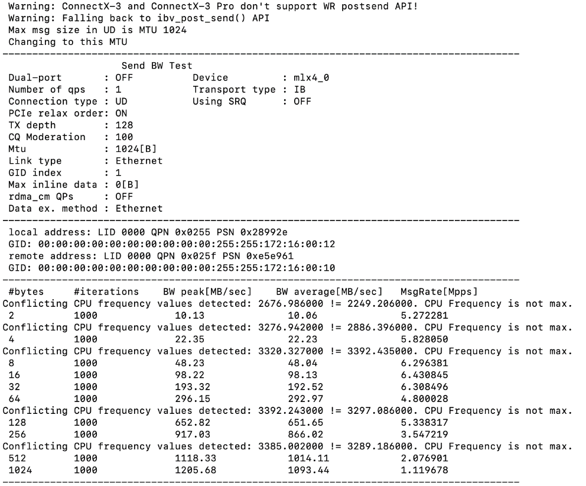
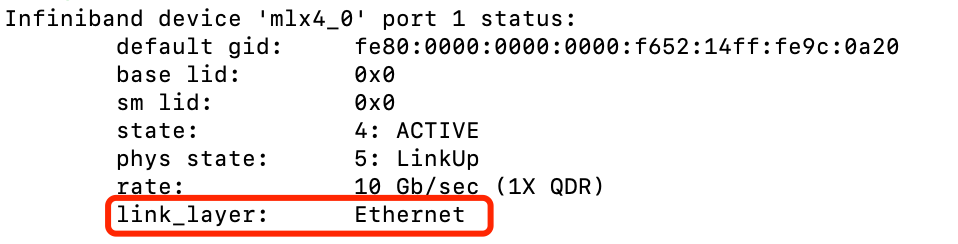
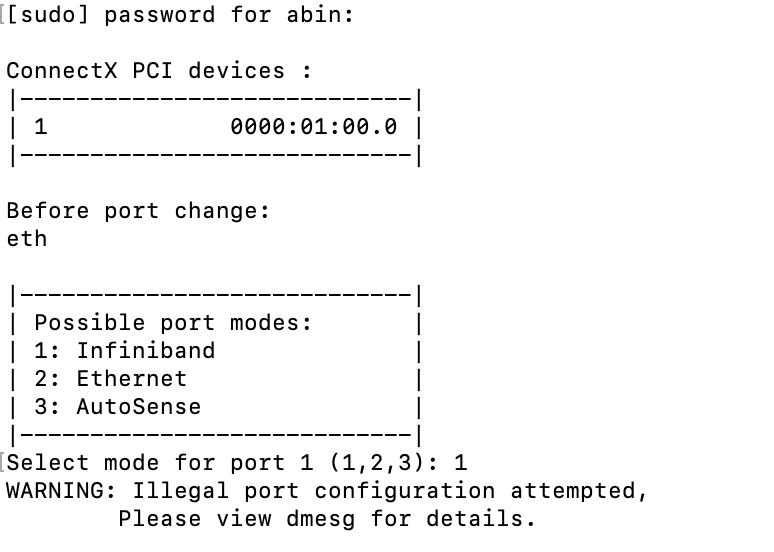

# Mellanox RDMA网卡驱动安装和查看状态

<https://blog.csdn.net/bandaoyu/article/details/115906185>

## 驱动安装

下载驱动，进入网站选择相应系统和软件版本，archive
versions这里可以下载旧版本驱动

NVIDIA Mellanox InfiniBand and VPI Software \| NVIDIA

<https://developer.nvidia.com/networking/infiniband-software>

下载完成后传到需要安装驱动的环境上。

挂载或解压，如果下载的iso则挂载，若是tgz就解压，下面是挂载命令：

mount -o ro,loop MLNX_OFED_LINUX-5.0-2.1.8.0-ubuntu16.04-x86_64.iso /mnt

安装

cd /mnt sudo ./mlnxofedinstall

可能会提示你安装一堆东西，复制，安装就可以了。

## 定制系统的安装

如果是非社区的定制系统（可能同不过脚本的判断，报错系统为不支持的系统，则需要加一些参数），例如公司的定制系统是基于centos9/redahat9，则可以加\--distro
rhel9.0

./mlnxofedinstall \--distro rhel9.0

非匹配内核的安装

非标准内核的，则可以加\--add-kernel-support参数让其根据当前的内核重新编译安装

执行下面命令查看包支持的内核版本和查看本机的内核版本：

cat .supported_kernels 列出包支持的内核版本

uname -r 显示本机内核版本

如果本机内核版本不在支持的内核列表里面，则加\--add-kernel-support
参数让它重新根据当前的内核编译出包并安装

./mlnxofedinstall \--add-kernel-support

还可以根据系统增加加其他参数：

./mlnxofedinstall \--add-kernel-support \--distro rhel9.0 \--with-nvmf
\--with-nfsrdma

不检查OS的发布版本进行编译/不更新固件

\--skip-distro-check 让执行脚本不去检查当前OS的发布版本号（如redhat7.5）

\--without-fw-update 参数是不更新FW

更多的参数可以./mlnxofedinstall -h 查看。

（mlnx_add_kernel_support.sh脚本也有同样的功能：

./mlnx_add_kernel_support.sh -m
/opt/mellanox/MLNX_OFED_LINUX-5.0-2.1.8.0-rhel7.7-x86_64 \--make-tgz -t
/tmp/

生成对应此OS内核的包，生成目录默认在/tmp下，安装过程中可能会有提示需要安装相关OS的依赖包，配置yum源进行安装即可：

mlnx_add_kernel_support.sh脚本文件用于在当前系统内核下进行重新编译打包

其中-m后参数为原始驱动包文件夹路径，-t后参数为存放重新编译打包后的文件夹，\--make-tgz表示已tgz压缩包方式打包，\--skip-repo
不检查OS的发布版本进行编译）

安装成功截图：

执行以下命令：

sudo /etc/init.d/openibd restart sudo /etc/init.d/opensmd restart

查看网卡状态：

sudo hca_self_test.ofed

没有 failed 就对了。

一些其它查看网卡信息的命令：

ibstat ibstatus ibv_devinfo ibv_devices #查看本主机的infiniband设备
ibnodes #查看网络中的infiniband设备

## 配置IP

见：《linux配置网口IP\|RDMA配置IP\|ens、eno、enp网口的区别》https://blog.csdn.net/bandaoyu/article/details/116308950

## 性能测试

服务端运行：

ib_send_bw -a -c UD -d mlx4_0 -i 1

注意，参数 -i
指定端口，在一个网卡有多个网口的时候，需要指定测试的端口，具体哪个端口，通过
ibstatus 可以看到。

客户端运行：

ib_send_bw -a -c UD -d mlx4_0 -i 1 172.16.0.102

最后面的ip地址是服务端infiniband网卡的ip地址。

{width="4.480518372703412in"
height="3.7142858705161856in"}

## 其他测试项

https://blog.csdn.net/bandaoyu/article/details/115798045

其他测试工具说明：Mellanox Interconnect Community

测试工具源码：https://github.com/linux-rdma/perftest

## 其他问题

更换网卡工作模式：

有些网卡，当你安装好驱动后，通过 ibstatus 命令，会出现下面的情况：

{width="5.2583398950131235in"
height="1.3392858705161854in"}

可以看到，该网卡现在处于 Ethernet
的工作模式，如果想要切换成infiniband模式，参考如下链接：

Mellanox Interconnect Community

查看当前工作模式：

sudo /sbin/connectx_port_config -s

输入以下命令切换工作模式：

sudo /sbin/connectx_port_config

{width="5.250702099737532in"
height="3.7446872265966755in"}

如果提示如图，说明不支持infiniband模式，否则，就切换成功了，再次使用一下命令可以验证：

sudo /sbin/connectx_port_config -s

不能切换到infiniband工作模式，并不代表不支持RDMA，处于Ethernet模式的网卡使用
RoCE 协议工作。

RDMA 协议：底层可以是以太网（ RoCE 或者 iWARP ）或者 Infiniband

有些网卡只支持Ethernet（RoCE），不支持Infiniband模式，也就是想从Ethernet切换到Infiniband模式时不能成功，这个要提前了解好。我目前了解到的，Connectx-3只支持Ethernet模式。

RDMA 、InfiniBand、IB卡、IB驱动的关系

1、RDMA 是一种技术（远程直接内存访问技术），如何实现这种技术呢？

2、实现这种技术你可以选择用 Infiniband
协议。（当然你也可以使用其他协议，eg：roce、iwarp）

3、如果你使用 Infiniband
协议，这个协议作为一个新一代网络协议。它必须依靠专门的硬件才能实现。eg：专用INC（网卡）------
IB卡，或者专用交换机。

4、当你在服务器上安装了IB卡之后，你还得安装 IB驱动，才能使用 infiniband
。

原文链接：https://blog.csdn.net/ljlfather/article/details/102930714

其他文章《Infiniband的驱动安装与配置》：Infiniband的驱动安装与配置：https://blog.csdn.net/oPrinceme/article/details/51001849

##  验证RDMA内核模块是否已加载

在centos7中，可以用以下命令查看RDMA内核模块的状态：

\[root@power27 docs\]# /etc/init.d/openibd status

HCA driver loaded

Configured IPoIB devices:

ib0

Currently active IPoIB devices:

ib0

Configured Mellanox EN devices:

Currently active Mellanox devices:

ib0

The following OFED modules are loaded:

rdma_ucm

rdma_cm

ib_ipoib

mlx4_core

mlx4_ib

mlx4_en

mlx5_core

mlx5_ib

ib_uverbs

ib_umad

ib_ucm

ib_cm

ib_core

mlxfw

mlx5_fpga_tools

HCA即支持RDMA的网卡，driver loaded表示驱动已加载。

## LINUX 查看安装的网卡

lspci \| grep -i eth

### 检查主机上是否有可用的RDMA网卡 {#检查主机上是否有可用的rdma网卡 .标题3}

libibverbs-utils工具：ibv_devices、ibv_devinfo

ibv_devinfo 和 ibstat 命令输出信息稍有不同（比如端口 MTU 信息是在
ibv_devinfo 而不是 ibstat 输出中显示，而端口 PUID 信息是在 ibstat 而不是
ibv_devinfo 输出中显示。同时有些信息的命名方式也不同，例如：ibstat
输出中的基础本地标识符（LID）与 ibv_devinfo 输出中的 port_lid
是相同的信息。

ibv_devices

ibv_devices是一个包含在libibverbs-utils.rpm包里的工具，用于显示本机上的RDMA设备：

\[root@power27 docs\]# ibv_devices

device node GUID

\-\-\-\-\-- \-\-\-\-\-\-\-\-\-\-\-\-\-\-\--

mlx4_0 e41d2d030050e830

ibv_devinfo

ibv_devinfo 输出主要信息

ibv_devinfo -v 输出详细信息

ibv_devinfo -d mlx4_0 输出指定设备的主要信息

ibv_devinfo -d mlx4_0 -v 输出指定设备的详细信息

Options:

-d, \--ib-dev=\<dev\> use IB device \<dev\> (default first device found)

-i, \--ib-port=\<port\> use port \<port\> of IB device (default all
ports)

-l, \--list print only the IB devices names

-v, \--verbose print all the attributes of the IB device(s)

ibv_devinfo也是libibverbs-utils.rpm包中的一个工具，它会打开一个设备查询设备的属性，通过它可以验证用户空间和内核空间的RMDA栈是否能够一起正常运作：

\[root@power27 docs\]# ibv_devinfo -d mlx4_0

hca_id: mlx4_0

transport: InfiniBand (0)

fw_ver: 2.42.5000

node_guid: e41d:2d03:0050:e830

sys_image_guid: e41d:2d03:0050:e833

vendor_id: 0x02c9

vendor_part_id: 4099

hw_ver: 0x1

board_id: MT_1100120019

phys_port_cnt: 1

Device ports:

port: 1

state: PORT_ACTIVE (4)

max_mtu: 4096 (5)

active_mtu: 4096 (5)

sm_lid: 1

port_lid: 12

port_lmc: 0x00

link_layer: InfiniBand

至少要有一个端口的状态是PORT_ACTIVE，才能说明RDMA相关组件已经正常运行起来。

###  查看加载了哪些模块 lsmod {#查看加载了哪些模块-lsmod .标题3}

ibstat

使用ibstat命令显示InfiniBand的具体信息：

\[root@node24 \~\]# ibstatCA \'mlx4_0\' CA type: MT4099

Number of ports: 1

Firmware version: 2.30.3000

Hardware version: 0

Node GUID: 0x46d2c92000004820

System image GUID: 0x46d2c92000004823

Port 1:

State: Active

Physical state: LinkUp

Rate: 56

Base lid: 72

LMC: 0

SM lid: 49

Capability mask: 0x02514868

Port GUID: 0x46d2c92000004821

Link layer: InfiniBand

\[root@node25 \~\]# ibstatCA \'mlx4_0\' CA type: MT4099

Number of ports: 1

Firmware version: 2.30.3000

Hardware version: 0

Node GUID: 0x46d2c92000003500

System image GUID: 0x46d2c92000003503

Port 1:

State: Active

Physical state: LinkUp

Rate: 56

Base lid: 53

LMC: 0

SM lid: 49

Capability mask: 0x0251486a

Port GUID: 0x46d2c92000003501

Link layer: InfiniBand

查看加载了哪些模块

lsmod
