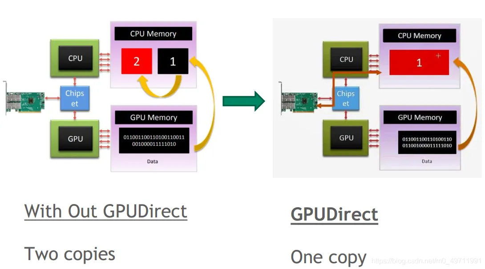
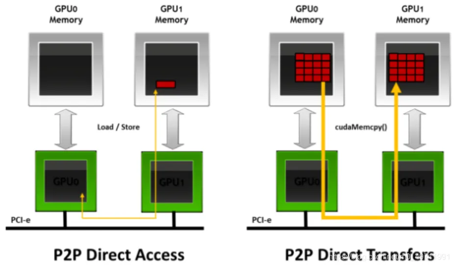

# GPUDirect Storage O_DIRECT的要求

<https://docs.nvidia.com/gpudirect-storage/o-direct-guide/index.html#summ-basic-req>

The NVIDIA® GPUDirect Storage® O_DIRECT Requirements Guide helps you
understand how GDS can provide significant benefits when it can leverage
the O_DIRECT fcntl.h file mode for a direct data path between GPU memory
and storage.

## [[1. Introduction]{.underline}](https://docs.nvidia.com/gpudirect-storage/o-direct-guide/index.html#intro)

This section provides an introduction to the O_DIRECT requirements for
GDS.

NVIDIA® GPUDirect® Storage (GDS) is the newest addition to the GPUDirect
family. GDS enables a direct data path for direct memory access (DMA)
transfers between GPU memory and storage, which avoids a bounce buffer
through the CPU. This direct path increases system bandwidth and
decreases the latency and utilization load on the CPU.

GDS can provide significant benefit when it can leverage the O_DIRECT
([[fcntl.h]{.underline}](https://github.com/torvalds/linux/blob/master/include/uapi/asm-generic/fcntl.h))
file mode for a direct data path between GPU memory and storage. There
are many conditions that must be met to achieve the performance benefits
of the O_DIRECT mode, and these conditions are not always met by all
file systems. The conditions might depend on the transfer size, whether
it's a read or write, whether the write is to new data (past the end of
the file or to a hole in the file), and based on many other conditions
such as whether checksums are required. This document describes the
conditions where O_DIRECT, on which GDS relies, can be used.

The target audience for this guide includes:

-   End users and administrators who:

    -   Understand filesystems, so they can carefully consider the
        implications of features they enable.

    -   Compare support from different filesystems to determine the
        appropriate models and how to use them.

    -   Evaluate the weighted fraction of cases that do or don't use
        O_DIRECT effectively.

-   Middleware developers who:

    -   Consider the design trade-offs that increase the likelihood that
        the vendor layer can effectively use O_DIRECT.

-   Filesystems vendors and implementers who:

    -   Accelerate their assessment of the various cases to be handled
        with O_DIRECT as they enable GDS in new or customized
        filesystems.

## [[2. GPUDirect Storage Requirements]{.underline}](https://docs.nvidia.com/gpudirect-storage/o-direct-guide/index.html#gds-req)

This section provides some basic background on where GDS can be most
effectively used.

This information enables readers with varying degrees of technical
accuity to get a general sense of whether, and to what degree, GDS can
benefit filesystems that make different design choices.

### [[2.1. Summary of Basic Requirements]{.underline}](https://docs.nvidia.com/gpudirect-storage/o-direct-guide/index.html#summ-basic-req) {#summary-of-basic-requirements .标题3}

Here is some information about the O_DIRECT requirements

The GDS architecture has the following key requirements:

-   The kernel storage driver can perform a DMA of user data to or from
    > GPU memory by using addresses that were obtained from callbacks to
    > the GDS kernel module, nvidia-fs.ko.

-   The device near the storage has a DMA engine that can reach the GPU
    > memory buffer via PCIe.

    -   For local storage, an NVMe device performs DMA.

    -   For remote storage, a NIC device performs RDMA.

-   The filesystem stack that operates at the user-level, or the
    > kernel-level, or both, and never needs to access the data in CPU
    > system memory.

Instead, data is transferred directly between storage and GPU memory,
which is achieved by filesystems that exclusively use the O_DIRECT mode
for a given file.

Figure 1 illustratres a way to visualize conditions for O_DIRECT. It
covers cases where there is, or is not, an operator
({width="0.14318569553805774in"
height="0.17587270341207348in"}) in the data path to storage, and
whether that operator is in the CPU or GPU. If the operator is in the
CPU, you cannot use O_DIRECT.

Figure 1. Summary of Basic Requirements

{width="5.0908727034120735in"
height="2.110196850393701in"}

The data coming from (or going to) storage cannot use O_DIRECT if it
must be processed in the CPU, as symbolized by cross operator. It can
use O_DIRECT if it only goes through the GPU whether there's a
transformational operator there as symbolized by a cross operator like
checksum on the GPU or there's no operation at all, as symbolized by a
clean arrow.

Lack of support for RDMA in network filesystems, or network block
devices, implies the need to copy data to socket buffers in system
memory. This need is incompatible with the basic requirements listed
above.

If the conditions for using GDS do not hold, for example, because the
mount for the file is not GDS enabled, or the nvidia-fs.ko driver is not
available, compatibility mode, a cuFile feature that falls back to
copying through a CPU bounce buffer, can be used. You can enable
compatibility mode in the cufile.json file. Users can override the
system's version of the cufile.json file by creating their own copy and
pointing the appropriate environment variable to that user's copy.
Outside of compatibility mode, the APIs will fail if O_DIRECT is not
possible.

## [[2.2. Client and Server]{.underline}](https://docs.nvidia.com/gpudirect-storage/o-direct-guide/index.html#client-server)

Here is some information about how the client and server work with
O_DIRECT.

In a local file or block systems, a software stack performs all IO. In a
distributed file or block system, at least two agents are involved. the
client makes a read or write request, and a server services it. There
are two types of filesystems:

-   Block-based

-   Network-attached

A block-based system can be serviced locally or remotely, while
network-attached filesystems are always remote.

Consider the following interaction between a client and server:

-   The direct data path between the NIC and GPU memory happens on the
    > client.

To enable this direct path, client-side drivers must first be enabled
with GDS.

-   RDMA is a protocol to access remote data over a network and uses the
    > NIC to DMA directly into client-side memory.

Without RDMA, there is no direct path, and GDS for distributed file and
block systems relies on GPUDirect RDMA for the direct path between the
NIC and GPU memory.

-   Using RDMA also relies on server-side support.

Filesystem implementations that do not support RDMA on the server side
will not support GDS. For example, NFS only works with server-side NFS
instead of RDMA support, which is not yet available from all NFS
vendors.

## [[2.3. Cases Where O_DIRECT is Not a Fit]{.underline}](https://docs.nvidia.com/gpudirect-storage/o-direct-guide/index.html#odirect-not-a-fit)

Here is some information about features that are used by specific
filesystems, which might inhibit the use of full GDS benefits.

In POSIX, the mode in which files are opened is controlled by a set of
flags. One of these flags, O_DIRECT, indicates a user's intent to not
buffer transfers in CPU system memory but to rather make transfers be
more direct. O_DIRECT, for example, generally disables the use of a page
cache. Although this flag is an expression of user intention, the
implementation can still make its own trade-offs.

For example, the implementation might decide to treat small transfers
differently from larger transfers that take a more direct path. In
another example, a filesystem might offer an option for the user to
enable read ahead for the page cache. This option, however, might
conflict with the request from the user to use O_DIRECT for a file. In
this case, how the implementation treats the competing requests depends
on the implementation policy. Therefore, O_DIRECT can be considered a
hint.

(大的数据转移时，可考虑使用O_DIRECT；必须使用页缓存的文件系统，不能使用O_DIRECT)

Several cases are listed below where a user's request to use O_DIRECT is
not currently supported in filesystems, is not used in specific cases,
or is fundamentally not feasible. The cases are delineated according to
the agent that makes choices or trade-offs which impact that option.

Here is some additional information:

-   Possibly relevant for users

    -   User-buffered IO: Transfers might be buffered in the user space
        > before being transferred to the kernel.

This case might be used when many small transactions have good spatial
and temporal locality.

-   Possibly relevant for middleware

    -   Metadata management: There might be metadata with the data
        > payload.

Metadata might take many forms, including checksums for the data
payload, file sizes that must be updated when lengthening files, and
maps of file layout when filling holes.

-   Hierarchical storage model: Some implementations used a tiered
    > scheme where some data resides in CPU system memory, and where
    > shorter latency and high bandwidth is possible.

There are outer tiers of progressively slower, but higher-capacity
storage. An example of this tiered scheme is flash and then spinning
disks.

-   Read ahead: An optimization that is sometimes used, especially for
    > buffered IO and many small consecutive transfers, is to anticipate
    > what will be used next and to buffer it in CPU system memory.

-   Examining or transforming data: When the CPU examines or transforms
    > data before (or after) IO transactions, this process interferes
    > with direct transfers between the storage and GPU memory.

```{=html}
<!-- -->
```
-   Filesystem only

    -   Kernel-buffered IO: If there is good temporal and spatial
        > locality, and the bandwidth and latency to copy from kernel
        > memory is significantly better than copying from storage, a
        > mechanism such as fscache might be used to maintain a copy in
        > system memory.

    -   Inline data: Small files are stored and managed differently than
        > larger files.

    -   Block allocation: Various policies are available to allocate
        > space in files, and there might be implications for client-
        > and server-side activities.

There are cases where middleware performs some of the same functions as
a filesystem. Middleware might have more contextual information
available to it than low-level calls to the file system, and it might
take steps to increase the likelihood that the filesystem can use
O_DIRECT. Consider the case of computing a checksum. A user might be
able to control whether checksums are even used. If checksums are
enabled, middleware might intervene in the following ways:

-   It could invoke a GPU kernel to compute the checksum and juxtapose
    > the checksum data with the payload so that one cuFileWrite can be
    > used to write back the data to storage.

-   It could again invoke a GPU kernel to compute the checksum to a
    > different buffer and use two cuFileWrites to write each of the
    > checksum and payload.

In these cases, the requests to the filesystem can use O_DIRECT.

### [[2.3.1. Buffered IO]{.underline}](https://docs.nvidia.com/gpudirect-storage/o-direct-guide/index.html#buffered-io) {#buffered-io .标题3}

Here is some information about buffered IO in GDS.

The Linux virtual file system (VFS) uses a buffered IO when O_DIRECT is
not specified, and there are potentially multiple layers of caching.
Examples of caching might include the following:

-   Page caching, which is backed by fscache.

-   File-system-specific page pools, such as ZFS adaptive replay cache
    > (ARC) and Spectrum Storage (GPFS) page pools.

### [[2.3.2. Inline Files]{.underline}](https://docs.nvidia.com/gpudirect-storage/o-direct-guide/index.html#inline-files) {#inline-files .标题3}

Here is some information about inline files in GDS.

Filesystems that are based on Linux are implemented by using the common
VFS interface to open, close, read, and write files. User data is
organized in files, which are represented in the following ways:

-   Inodes, whose primary purpose is to store metadata.

-   Fixed blocks, which are generally referred to as pages that hold
    user content.

A typical block size is 4096 bytes.

Inline files have data that is smaller than a page size and small enough
to fit in the inode. Generally, filesystems provide flags to detect
whether the inode is inline. Inodes are normally read into system
memory, so inline user data is copied into system memory with the
metadata.

In RDMA-based network-attached filesystems, files that are smaller than
the specified size threshold are sent inline in the remote procedure
calls (RPCs). This process involves buffering in system memory, which
requires an additional copy of user data rather than a direct data
transfer. For some filesystems, such as ext4 and Lustre, the inline
files modes can be disabled at the filesystem level or on a per-inode
basis.

### [[2.3.3. Block Allocation For Writes]{.underline}](https://docs.nvidia.com/gpudirect-storage/o-direct-guide/index.html#block-alloc-writes) {#block-allocation-for-writes .标题3}

Here is some information about block allocation for writes in GDS.

Before data can be written to a file, a data block must be allocated.
See Inline Files for more information. For filesystems to support the
O_DIRECT mode for writing files, free data blocks in storage must be
available and ready to be used by the filesystem. Otherwise, as in the
following cases, user data can be buffered into the system page cache,
which makes direct data transfers impossible. Here is a list of cases
where some filesystems need to fall back to buffered mode because of
block allocations:

**Note:** These limitations do not apply to distributed filesystems if
the features are implemented on the storage server, and the client does
not perform buffering.

-   Extending writes: writes that are happening to increase the file
    size.

-   Allocating writes: writes to a block that has not yet been
    allocated.

-   Writes to preallocated blocks: the block was already allocated in
    storage, but the metadata needs to be updated before the data is
    written.

-   Hole filling: writes to a hole in the middle of the file, which was
    a sparse block.

-   Copy on write (COW) filesystems: copy operations that are triggered
    when a write to a data buffer involves caching in the CPU system
    memory.

-   Delayed allocation or allocate on flush: allocation is reactive (not
    proactive) to reduce disk fragmentation on slow random writes or to
    large sequential writes for spinning disks.

For network-attached storage or distributed filesystems, the filesystem
architecture determines whether the allocation decision is made locally,
on each client, or on the remote server. If the block allocation
handling is done on the server side, there is no CPU buffering
impediment to direct transfers. If block allocation was handled on the
client side, there might be some impediments.

### [[2.3.4. Examining or Transforming User Data]{.underline}](https://docs.nvidia.com/gpudirect-storage/o-direct-guide/index.html#examine-transform-data) {#examining-or-transforming-user-data .标题3}

Here is some information about how to examine or transform user data.

Here is a list of some cases where the user data needs to be copied into
system memory, so that it can be examined or transformed by the
filesystems as part of a read or write transfer:

-   Data journaling is used to track changes that are not yet committed
    > to persistent storage.

Data journaling typically disables O_DIRECT. In general, the journaling
of data is not required with the O_DIRECT use case, unless there is a
high-speed journaling media. Metadata journaling does not require access
to user data.

-   Checksums can be computed during writes and checked upon reads.

For network filesystems with checksum support, the checksums are
typically performed on the client to detect network corruptions, in
addition to checksum computation on the server.

-   Client-side compression and deduplication can be provided on network
    > clients to achieve bandwidth improvements in addition to
    > compression on the server side for data storage.

Inline deduplication requires looking at user content to determine the
fingerprint by using MD5 or SHA1 algorithms. Similarly, client-side
encryption can provide more secure communication from the client to
server.

-   Erasure encoding can be performed by the filesystem or the block
    > device.

In such cases, the data is copied to CPU system memory before performing
the DMA to the disk pool or network servers. For distributed block
devices, the erasure coding decision is performed on the client side.

Synchronous replication involves a data copy into system memory before
the DMA operation to a remote block device or server, depending on the
recovery time objective.

### [[2.3.5. Summary]{.underline}](https://docs.nvidia.com/gpudirect-storage/o-direct-guide/index.html#summary) {#summary .标题3}

This section contains some final information to consider about O_DIRECT.

There are many cases in which the O_DIRECT mode, in which CPU system
memory is entirely unused, is not a fit. The relevance of these cases
depends on the local or distributed filesystem implementation, and in
some cases, on the set of features that were selected by the user.
Vendors can provide their own assessments of the relevance of these
issues.
