<https://blog.csdn.net/AAAA202012/article/details/123478570>

# 跨GPU集群扩展应用程序

与同构系统相比，GPU加速集群被公认为极大地提升了性能效果和节省了计算密集型应用程序的功耗。当处理超大数据集时，通常需要多个计算节点来有效地解决问题。MPI(消息传递接口)是一个标准化和便携式地用于数据通信的API，它通过分布式进程之间的消息进行数据通信。在大多数MPI实现中，库例程是直接从C或其他语言中调用的。

MPI与CUDA是完全兼容的。支持GPU之间不同节点上移动数据的MPI有两种实现方式：传统的MPI与CUDA-aware
API。在传统的MPI中，只有主机内存的内容可以直接通过MPI函数来传输。在MPI把数据传递到另一个节点之前，GPU内存中的内容必须首先使用CUDA
API复制回主机内存。在CUDA-aware
MPI中，可以把GPU内存中的内容直接传递到MPI函数上，而不用通过主机内存中转数据。

如下所示，是几个商业化且开源的CUDA-aware MPI实现：

-   MVAPICH2 2.0rc2

-   MVAPICH2-GDR 2.0b

-   OpenMPI 1.7

-   CRAY MPI

-   IBM Platform MPI

MVAPICH2是一个开源的MPI实现，用来探索InfiniBand网络特点，对基于MPI的应用程序提供高性能和高扩展性。当前存在两个版本：MVAPICH2是一个CUDA-aware
MPI实现，而MVAPICH2-GDR是一个扩展版本，增加了对GPUDirect RDMA的支持.

对InfiniBand集群而言，MVAPICH2是一个被广泛使用的开源MPI库，并且支持从一个GPU设备内存到另一个GPU的设备内存间直接进行MPI通信。接下来将使用MVAPICH平台来测试以下情况：

-   用MVAPICH2 和 InfiniBand进行CPU到CPU间的数据传输；

-   用传统的 MPI 和 InfiniBand进行GPU到GPU间的数据传输；

-   用CUDA-aware MPI 和 InfiniBand 进行GPU到GPU间的数据传输；

-   用MVAPICH2-GDR和GPUDirect
    RDMA以及InfiniBand进行GPU到GPU间的数据传输。

## CPU到CPU的数据传输

为了建立一个便于比较的基准，可以使用MVAPICH2在集群中测试两个CPU间互相连接的节点，以了解数据传输的带宽和延迟。一般来说，MPI程序包括4个步骤：

1.  初始化MPI环境；

2.  使用阻塞或非阻塞MPI函数在不同节点间的进程传递消息；

3.  跨节点同步；

4.  清理MPI环境。

### 实现节点间的MPI通信 {#实现节点间的mpi通信 .标题3}

下面的代码展示了一个简单的MPI程序框架，该程序在跨节点同步和提出前发送和接收单个消息：

int main(int argc, char\* argv\[\]){

//初始化MPI环境

int rank, nprocs;

MPI_Init(&argc, &argv);

MPI_Comm_size(MPI_COMM_WORLD, &nprocs);

MPI_Comm_rank(MPI_COMM_WORLD, &rank);

//传递消息

MPI_Send(sbuf, size, MPI_CHAR, 1, 100, MPI_COMM_WORLD);

MPI_Recv(rbuf, size, MPI_CHAR, 0, 100, MPI_COMM_WORLD, &reqstat);

//跨节点同步

MPI_Barrier(MPI_COMM_WORLD);

//清理MPI环境

MPI_Finalize();

return EXIT_SUCCESS;

}

想要测试两节点间的带宽和延迟，首先需要分配MYBUFSIZE大小的数组，作为发送/接收缓冲区，代码如下所示：

char \*s_buf, \*r_buf;

s_buf = (char \*)malloc(MYBUFSIZE);

r_buf = (char \*)malloc(MYBUFSIZE);

然后，两个计算节点间的双向数据传输可以使用非阻塞MPI的发送和接收函数来完成：

if(rank == 0){

for(int i = 0; i \< nRepeat; i++){

MPI_Irecv(rbuf, size, MPI_CHAR, other_proc, 10, MPI_COMM_WORLD,
&recv_request);

MPI_Isend(sbuf, size, MPI_CHAR, other_proc, 100, MPI_COMM_WORLD,
&send_requst);

MPI_Waitall(1, &send_request, &reqstat);

MPI_Waitall(1, &recv_request, &reqstat);

}

}

else if(rank == 1){

for(int i = 0; i \< nRepeat; i++){

MPI_Irecv(rbuf, size, MPI_CHAR, other_proc, 100, MPI_COMM_WORLD,
&recv_request);

MPI_Isend(sbuf, size, MPI_CHAR, other_proc, 10, MPI_COMM_WORLD,
&send_requst);

MPI_Waitall(1, &send_request, &reqstat);

MPI_Waitall(1, &recv_request, &reqstat);

}

}

为了获得准确的性能指标，发送和接收操作需要重复nRepeat次，然后取这些结果的平均值。从Wrox.com
(Professional cuda c
programming)中下载simpleC2C.c，文件中包含全部的示例代码。用以下命令编译它：

\$ mpicc -std=c99 -O3 simpleC2C.c -o simplec2c

如果启用了MPI的集群，则可以在两个节点上运行MPI程序。指定两节点的主机名，如node01和node02(取决于集群的配置)，并运行下面的例子：

\$ mpirun_rsh -np 2 node01 node02 ./simplec2c

一个输出例子如下所示：

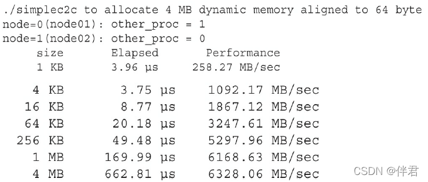{width="5.107794181977253in"
height="2.176061898512686in"}

mpirun_rsh是一个由MVAPICH2提供的作业启动命令，也可以使用Mpirun运行作业。

### CPU亲和性 {#cpu亲和性 .标题3}

在多核系统中(例如，在MPI程序中)，当多个进程或线程同时需要CPU时间时，操作系统将为线程和进程分配可用的CPU核心。这意味着在操作系统的控制下，一个进程或线程将被暂停或移动到一个新核心内。这种行为将造成较差的数据局部性，从而对性能有负面影响。如果进程被移动到一个新CPU核心内，那么该进程中的任何数据都不会局部存储在新核的缓冲区内。这个进程需要重新从系统内存中获取所有数据。因此，将一个进程或线程绑定到一个单CPU核(或一组相邻的CPU)可以帮助提高主机性能。

限制进程或线程在特定的CPU核上执行，被称为CPU亲和性。有几个方法可以将进程和线程绑定到处理器上。一旦设置了亲和性，操作系统的调度程序必须服从设置约束，并且只能在指定的处理上运行进程。

CPI亲和性直接影响MPI程序性能。MVAPICH2提供了一种方法，使其在运行时使用MV2_ENABLE_AFFINITY环境变量来设置CPU亲和性。在调用MPI程序期间可以按照以下命令来启用CPU亲合性：\$
mpirun_rsh -np 2 node01 node02 MV2_ENABLE_AFFINITY=1
./simplec2c，使用如下命令禁用CPU亲和性：\$ mpirun_rsh -np 2 node01
node02 MV2_ENABLE_AFFINITY=0
.simplec2c，对于单线程或单进程的应用程序而言，启用CPU亲和性可以避免操作系统在处理器之间移动进程或线程，从而提供同等或更好的性能。另一方面，当禁用CPU亲和性时，多线程和多进程应用程序的性能可能会得到提升。

## 使用传统MPI在GPU和GPU间传输数据

考虑一个多节点计算集群，每个节点有多个GPU。节点内GPU之间的数据交换可以使用点对点访问或传输来实现。另一方面，在不同节点的GPU之间的数据交换需要一个节点间的通信库，如MPI。为了简化GPU之间的数据交换和提高性能，应该在每个节点的每个GPU上绑定MPI进程。

### MPI-CUDA程序内的亲和性 {#mpi-cuda程序内的亲和性 .标题3}

在CPU核心中绑定MPI进程被称为CPU亲和性，于此类似，在特定的GPU中绑定MPI进程被称为GPU亲和性。在GPU中绑定MPI进程，通常是在使用MPI_Init函数初始化MPI环境之前进行的。为了在一个节点中跨GPU均匀地分配进程，必须首先使用由MPI库提供的环境变量，确定节点内部进程的本地ID。例如，MAPICH2保证会为每个MPI进程设置环境变量MV2_COMM_WORLD_LOCAL_RANK。

MV2_COMM_WORLD_LOCAL_RANK是在同一节点的每个MPI进程中唯一标识的整数。其他的MPI实现提供类似的支持。这个本地ID，也可称为本地秩，可以将一个MPI进程绑定到一个CUDA设备上：

int n_devices;

int local_rank = atoi(getenv(\"MV2_COMM_WORLD_LOCAL_RANK\"));

cudaGetDeviceCount(&n_devices);

int device = local_rank % n_devices;

cudaSetDevice(device);

\...

MPI_Init(argc,argv);

然而，如果首次使用环境变量MV2_ENABLE_AFFINITY设置MPI进程的CPU亲和性，然后用MV2_COMM_WORLD_LOCAL_RANK设置GPU亲和性，那么无法保证正在运行MPI进程的CPU与分配的GPU是最佳组合。如果它们不是最佳组合，那么主机应用程序和设备内存之间的延迟和带宽可能会变得不理想。因此，可以使用便携的Hardware
Locality包(hwloc)来分析节点的硬件拓扑结构，并且让MPI进程所在的CPU核与分配给该MPI进程的GPU是最佳组合。

下面的示例代码，使用了进程的MPI局部秩来选择一个GPU。然后，对于选定的GPU，用hwloc确定最佳CPU核心来绑定这个进程。

rank = atoi(getenv(\"MV2_COMM_WORLD_RANK\"));

local_rank = atoi(getenv(\"MV2_COMM_WORLD_LOCAL_RANK\"));

//加载此节点中所有 PCI 设备的完整硬件拓扑

hwloc_topology_init(&topology);

hwloc_topology_set_flags(topology,HWLOC_TOPOLOGY_FLAG_WHOLE_IO);

hwloc_topology(topology);

//根据MPI局部秩选择GPU

cudaSetDevice(local_rank);

cudaSetDevice(&device);

//遍历物理上靠近所选 GPU 的所有 CPU 内核

cpuset = hwloc_bitmap_alloc();

hwloc_cudart_get_device_cpuset(topology,device,cpuset);

match = 0;

hwloc_bitmap_foreach_begin(i,cpuset)

if(match == local_rank){

cpu = i;

break;

}

++match;

hwloc_bitmap_foreach_end();

//将此进程绑定到选定的cpu

onecpu = hwloc_bitmap_alloc();

hwloc_bitmap_set(onecpu,cpu);

hwloc_set_cpubind(topology,onecpu,0);

//清理

hwloc_bitmap_free(onecpu);

hwloc_bitmap_free(cpuset);

hwloc_topology_destroy(topology);

gethostname(hostname,sizeof(hostname));

cpu = sched_getcpu();

printf(\"MPI rank %d using GPU %d and CPU %d on host
%s\\n\",rank,device,cpu,hostname);

MPI_Init(&argc,&argv);

MPI_Comm_rank(MPI_COMM_WORLD,&rank);

if(MPI_SUCCESS != MPI_Get_processor_name(procname,&length)){

strcpy(procname,\"unknown\");

}

### 使用MPI执行GPU间的通信 {#使用mpi执行gpu间的通信 .标题3}

一旦MPI进程通过cudaSetDevice函数被调度到一个GPU中，那么设备内存核主机固定内存可以被分配给当前设备：

char \*h_src, \*h_rcv;

cudaMallocHost((void\*\*)&h_src, MYBUFSIZE);

cudaMallocHost((void\*\*)&h_rcv, MYBUFSIZE);

char \*d_src, \*d_rcv;

cudaMalloc((void\*\*)&d_src, MYBUFSIZE);

cudaMalloc((void\*\*)&d_rcv, MYBUFSIZE);

使用传统MPI的两个GPU间的双向数据传输可以分两步执行：首先，将数据从设备内存复制到主机内存；其次，使用MPI通信库在MPI进程之间交换主机内存里的数据：

if(rank == 0){

for(int i = 0; i \< loop; i++){

cudaMemcpy(h_src, d_src, size, cudaMemcpyDeviceToHost);

//双向带宽

MPI_Irecv(h_rcv, size, MPI_CHAR, other_proc, 10, MPI_COMM_WORLD,
&recv_request);

MPI_Isend(h_src, size, MPI_CHAR, other_proc, 100, MPI_COMM_WORLD,
&send_request);

MPI_Waitall(1, &rev_request, &request);

MPI_Waitall(1, &send_request, &request);

cudaMemcpy(d_rcv, h_rcv, size, cudaMemcpyHostToDevice);

}

else {

for(int i = 0; i \< loop; i++){

cudaMemcpy(h_src, d_src, size, cudaMemcpyDeviceToHost);

//双向带宽

MPI_Irecv(h_rcv, size, MPI_CHAR, other_proc, 100, MPI_COMM_WORLD,
&recv_request);

MPI_Isend(h_src, size, MPI_CHAR, other_proc, 10, MPI_COMM_WORLD,
&send_request);

MPI_Waitall(1, &rev_request, &request);

MPI_Waitall(1, &send_request, &request);

cudaMemcpy(d_rcv, h_rcv, size, cudaMemcpyHostToDevice);

}

}

从Wrox.com中可以下载含有这个示例完整代码的simpleP2P.c文件。用以下命令进行编译：

\$ mpicc -std=C99 -O3 simpleP2P.c -o simplep2p

用mpirun_rsh启动MPI程序，如下所示：

\$ mpirun_rsh -np 2 node01 node02 ./simplep2p

有两个Fermi M2090
GPU的系统，示例报告如下所示。要注意到，与CPU-to-CPU示例进行比较可知，此处带宽大幅减少，延迟显著增加了。这种性能损耗源于在使用MPI传输之前从GPU传输数据的额外开销。

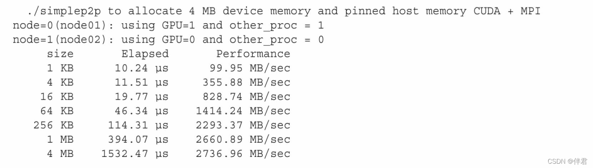{width="5.119056211723534in"
height="1.452108486439195in"}

## 使 用 CUDA-aware MPI 进 行 GPU 到 GPU 的 数 据 传 输

MVAPICH2也是一个CUDA-aware MPI实现，它通过标准MPI
API支持GPU到GPU的通信。可以直接把设备内存指针传给MPI函数(并且避免传统MPI所需的额外的cudaMemcpy调用)：

if(rank == 0){

for(int i = 0; i \< loop; i++){

MPI_Irecv(d_rcv, size, MPI_CHAR, other_proc, 10, MPI_COMM_WORLD,
&recv_request);

MPI_Isend(d_src, size, MPI_CHAR, other_proc, 100, MPI_COMM_WORLD,
&send_request);

MPI_Waitall(1, &rev_request, &request);

MPI_Waitall(1, &send_request, &request);

}

else {

for(int i = 0; i \< loop; i++){

MPI_Irecv(h_rcv, size, MPI_CHAR, other_proc, 100, MPI_COMM_WORLD,
&recv_request);

MPI_Isend(h_src, size, MPI_CHAR, other_proc, 10, MPI_COMM_WORLD,
&send_request);

MPI_Waitall(1, &rev_request, &request);

MPI_Waitall(1, &send_request, &request);

}

}

从Wrox.com中可以下载含有这个示例完整代码的simpleP2P_CUDA_Aware.c文件。用以下命令编译它：\$
mpicc -std=c99 -O3 simpleP2P_CUDA_Aware.c -o
simplep2p.aware，启动MPI程序之前，需要通过设置下列环境变量来确保在MVAPICH2上启用了CUDA支持：\$
export MV2_USE_CUDA=1,也可以在MPI程序调用时设置环境变量：

\$ mpirun_rsh -np 2 node01 node02 MV2_USE_CUDA=1 ./simplep2p.aware

带有两个Fermi M2090
GPU系统的示例报告如下。请注意，相比于在CUDA上使用传统MPI，使用CUDA-aware
MPI,在用4MB消息的情况下，可以获得17%的性能提升。此外，该代码已被大大简化，没有与设备之间显式传输数据的步骤。

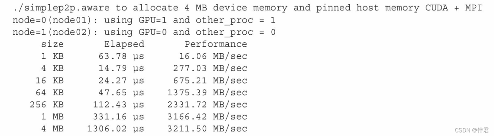{width="5.181262029746282in"
height="1.426674321959755in"}

## 使用CUDA-aware MPI进行[节点内]{.mark}GPU到GPU的数据传输

在同一节点的两个GPU间，也可以使用CUDA-aware
MPI库执行数据传输。如果两个GPU连接在同一个PCIe总线上，会自动使用点对点传输。我们此处还使用前面用过的例子，在同一节点进行两GPU之间的数据传输，假定node01至少有两个GPU:

\$ mpirun_rsh -np 2 node01 node01 MV2_USE_CUDA=1 ./simplep2p.aware

在有两个Fermi
M2090的GPU上，结果如下。与预想的一致，在同一节点的GPU之间通过PCIe总线传输数据比跨节点互连的传输会有更好的带宽和延迟。

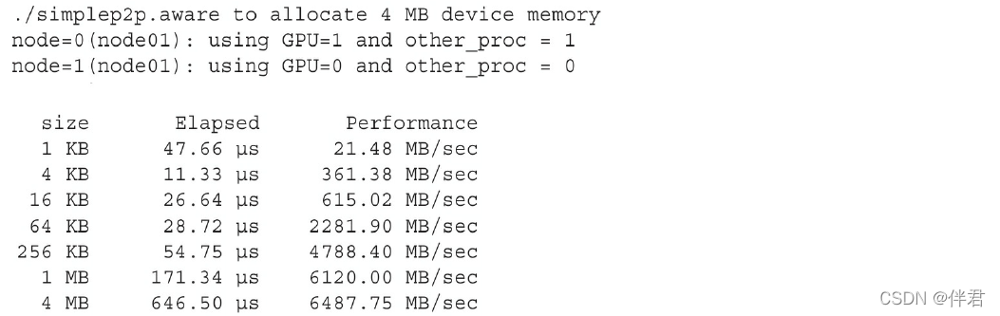{width="5.768055555555556in"
height="1.8242979002624673in"}

之前的4个示例的性能表现绘制在下图中。这些结果表明，当传输的数据大于1MB时，可从CUDA-aware
MPI获得更好的性能。

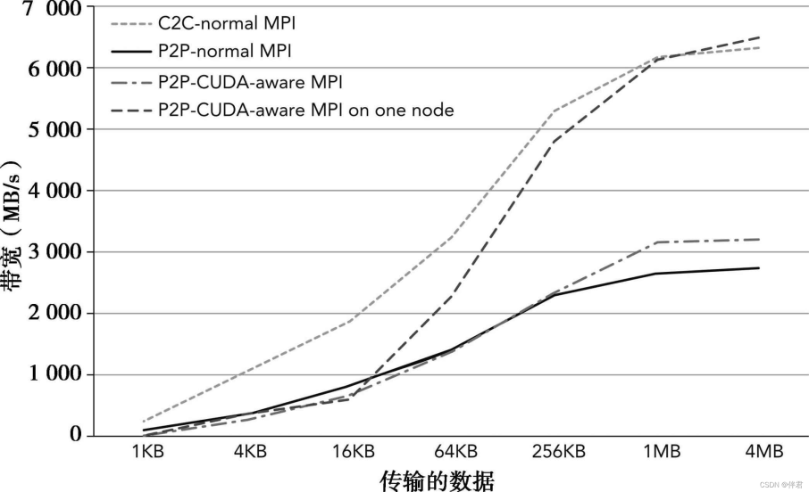{width="4.118122265966754in"
height="2.5092924321959753in"}

### 调整消息块大小 {#调整消息块大小 .标题3}

通过重叠主机与设备和节点间通信来最小化通信开销，MVAPICH2将来自GPU内存的大量信息自动划分为块。块的大小可以用MV2_CUDA_BLOCK_SIZE环境变量调整。默认的块大小是256KB。它可以被设置为512KB，命令如下所示：

\$ mpirun_rsh -np 2 node01 node02 MV2_USE_CUDA=1
\\MV2_CUDA_BLOCK_SIZE=524288 ./simplep2p.aware

在两个不同的节点上，当在两个Fermi M2090
GPU上运行时，改变块的大小会带来以下影响：

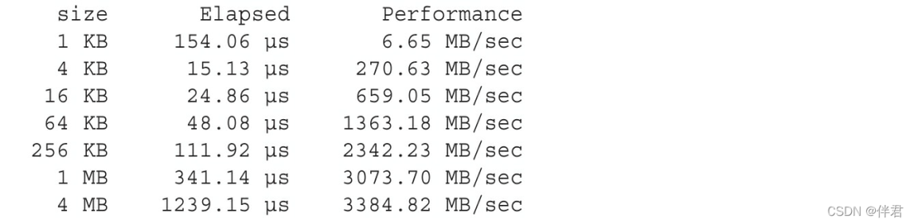{width="5.219755030621172in"
height="1.2838713910761155in"}

以上结果显式块大小为4MB信息时性能最好，这表明较大尺寸的块性能更佳。最优的块大小值取决于多个因素，包括互连带宽/延迟、GPU适配器的特点、平台的特点，以及MPI函数允许使用的内存大小。因此，最好使用不同大小的块来实验，从而判定哪一个性能更佳。

## 使 用 GPUDirect RDMA 进 行 GPU 到 GPU 的 数 据 传 输

NVIDIA的GPUDirect实现了在PCIe总线上的GPU和其他设备之间的低延迟通信。使用GPUDirect，第三方网络适配器和其他设备可以直接通过基于主机的固定内存区域交换数据，从而消除了不必要的主机内存复制，使得运行在多个设备上的应用程序的数据传输性能得到了显著提升。多年来，NVIDIA逐步更新GPUDirect技术，每一次发布都在不断地提升其可编程性和降低延迟。GPUDirect的第一个版本，与CUDA
3.1一同发布，允许InfiniBand设备和GPU设备共享CPU内存中的相同的锁页缓冲区。数据从一个节点中的GPU发送到另一个节点的GPU中，该数据是从源GPU复制到系统内存中固定的、共享的数据缓冲区，然后通过Infiniband互连直接从共享缓冲区复制到其他GPU可以访问的与目的节点相匹配的缓冲区(如下图所示)。

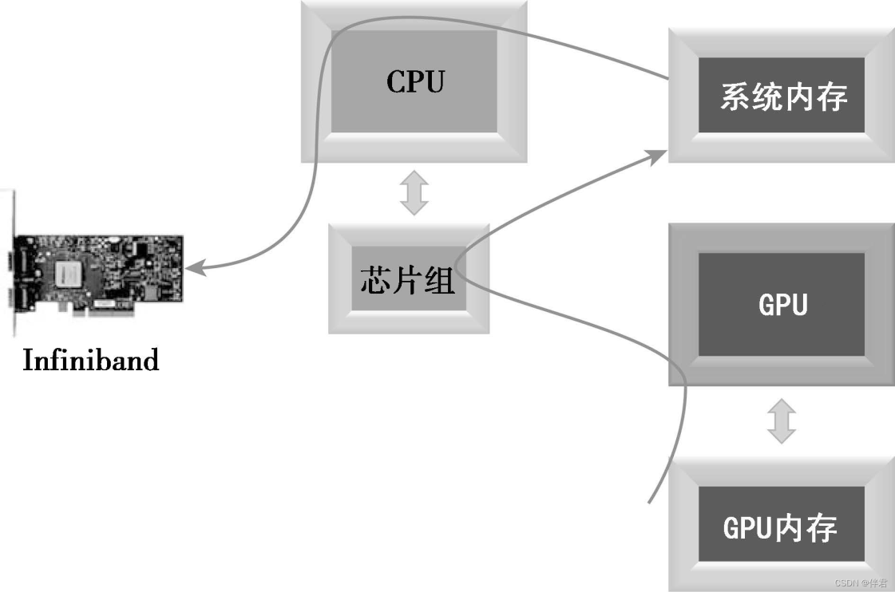{width="5.0945603674540685in"
height="3.374330708661417in"}

GPUDirect的第二个版本，与CUDA4.0一同发布，加入了点对点API和前面介绍的统一虚拟寻址支持。这些改进提高了单节点内多GPU的性能，并通过消除不同地地址空间中管理多个指标的需要提高了程序员的效率。

GPUDirect的第三个版本，与CUDA5.0一同发布，添加了远程直接内存访问(RDMA)支持。RDMA允许通过Infiniband使用直接通信路径，它在不同集群节的GPU间使用标准的PCIe适配器。下图展示了两GPU在网络上的直接连接。使用GPUDirect
RDMA,在两个节点的GPU通信可以在没有主机处理器参与的情况下执行。这减少了处理器的消耗和通信延迟。

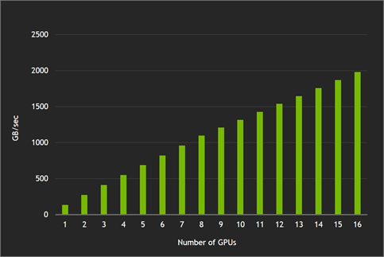{width="5.099375546806649in"
height="2.612392825896763in"}

因为GPUDirect
RDMA对应用程序代码而言是透明的，所以可以使用相同的simpleP2P_CUDA_Aware.cu例子来比较MVAPICH2库和MVAPICH2-GDR库之间的性能，其中MVAPIPICH2-GDR库包括GPUDirect
RDMA支持。需要按正确的路径更新环境，使用MVAPICH2-GDR装置编译程序。

首先，通过使用了mpicc编译器和mpirun_rsh命令，获取CUDA-aware
MVAPICH2性能基准：

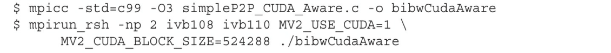{width="5.1350207786526685in"
height="0.4559076990376203in"}

两个包含Kepler K40 GPU的节点产生的结果报告如下，它们由一个单轨道Mellanox
Connect-IB网络连接，并使用MVAPICH2 v2.0b:

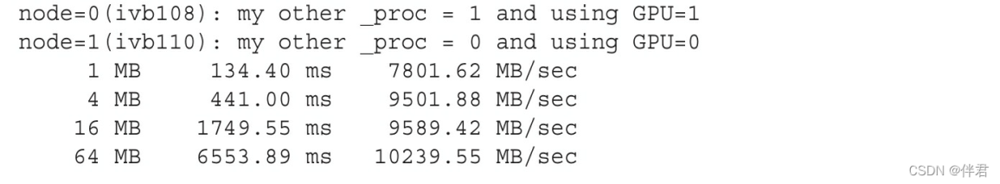{width="5.253384733158355in"
height="0.9702187226596676in"}

相比之下，可以使用CUDA-aware
MVAPICHA2-GDR版本中的mpicc编译相同的程序。确保设置MV2_USE_GPUDIRECT环境变量作为mpirun_rsh命令的一部分。代码如下所示：

{width="5.366069553805774in"
height="0.49143482064741906in"}

在同一个集群上显示以下结果：

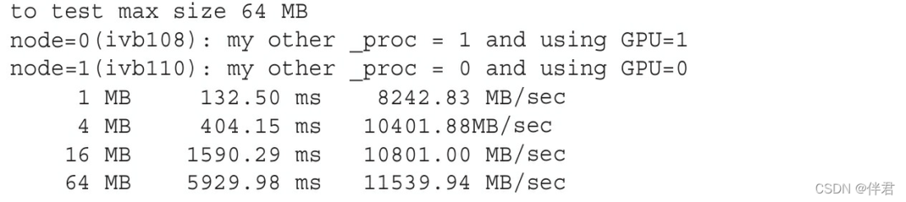{width="5.003193350831146in"
height="1.1195866141732282in"}

下图直观的比较了以下两个测试示例中的双向带宽：

-   CUDA-aware MPI

-   具有GPUDirect RDMA的CUDA-aware MPI

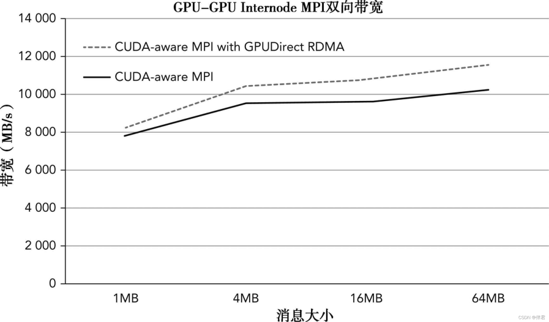{width="4.077262685914261in"
height="2.388791557305337in"}
