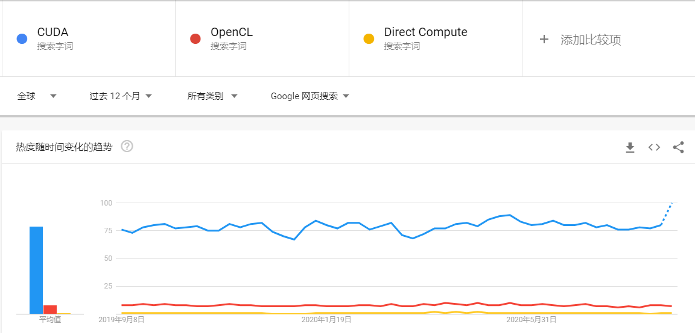

# 几种GPGPU技术的介绍与比较

## 0 前言

T. Sorman
(2016)比较了不同的GPGPU编程技术：CUDA、OpenCL和OpenGL、DirectX。应用程序测试表明：CUDA是最快的技术，比最慢的OpenCL技术要快2倍。最老的技术OpenGL和DirectX在浮点计算效率方面与CUDA和OpenCL有竞争力。**测试算例**有：傅里叶转换、图像处理、图像压缩和线性代数。**比较的技术（API）有**：CUDA,
Compute Shaders in OpenGL, Direct Compute in DirectX, OpenCL,
与CPU的OpenMP比较。

T. Sorman (2016)主要是比较了不同GPGPU框架的计算效率。

A.
Soderstrom.(2018)主要比较了不同GPGPU框架的可移植性、代码的复杂性以及不同框架的特征。

K. Karimi et al. (2010)比较了CUDA和OpenCL的计算效率，与T. Sorman
(2016)的结论类似，两者的计算效率差别不大，CUDA比OpenCL要快。

Fang J.
(2011)使用很多测试算法比较了CUDA与OpenCL的效率，两种框架的效率差别很小，有时OpenCL计算是最快的。

R.S. Oliveria et al.
(2011)指出相比并行化CPU求解非线性常微分方程组(ODEs)，OpenGL方法的计算最快。CUDA求解偏微分方程组(PDEs)是最快的，加速比达8；OpenCL求解PDE是最慢的，而求解ODE是最快的。

由Google
Trends上发布的GPGPU框架的流行度来看，如图1，依然是CUDA最流行，OpenCL次之，Direct
Compute使用很小。

{width="5.768055555555556in"
height="2.7725382764654416in"}

图1 GPGPU框架的流行度

## 1 CUDA

CUDA由NVIDIA公司开发，在2006年发布。CUDA是C/C+的扩展，有自己的编译器（NVCC）。CUDA支持执行核函数、修改显卡RAM内存和使用优化函数库（如cuBLAS和cuFFT等）的功能。

在GPU上执行的程序称为核函数(kernel)。GPU称为设备(device)，CPU称为主机(host)。为运行CUDA核函数，要做的工作是声明函数类型\_\_global\_\_，从主机代码中调用，代入形参，其他的指示类型见表4.1。核函数调用包括：定义线程组织。线程以线程块(block)的形式组织，再定义为线程网格(Grid)。线程块和线程网格可用于定义1D，2D和3D的寻址计算。在核函数中，通过blockDim和gridDim访问线程块和线程网格，分别由threadIdx和blockIdex指示。

表4.1 CUDA中的函数类型

{width="3.7644225721784776in"
height="0.9411056430446194in"}

{width="5.082872922134733in"
height="4.5522703412073495in"}

图4.1 CUDA全局核函数

## 2 OpenCL

OpenCL是一个框架和开放标准，用于编写在多核计算平台，诸如CPU,
GPU和FPGA以及其他处理器和加速器上的程序。OpenCL使用与CUDA类似的结构：编写设备函数是基于C99语言。由Khronos
Groups提供标准，由具体的硬件厂商具体实施，如AMD，INTEL和NVIDIA。

OpenCL将计算资源（CPU或其他加速器）视为依附于主机（CPU）的数个[compute
devices]{.mark}。在计算设备上执行的程序称为核函数(kernel)。OpenCL程序在[运行时编译]{.mark}，保持在不同主机设备间执行的可移植性。

主机编译OpenCL核函数，然后在计算单元上排队。排队的由主机访问的核函数用\_\_kernel定义。在全局内存中的数据在参数列表中使用\_\_global定义，局部内存用\_\_local定义。在OpenCL术语中，对应CUDA线程，称为Work-items，组织为Work-groups。

类似CUDA，主机代码可激活设备的计算能力，调用一些快速计算的数据函数。对应表4.1中CUDA核函数，以OpenCL实施的核函数见图4.2，显示出一些很小的差别。

{width="5.018876859142607in"
height="4.8513210848643915in"}

图4.2 OpenCL全局核函数

## 3 Direct Compute

微软的DirectCompute是支持在Windows操作系统上执行的GPGPU
API。DirectCompute是DirectX APIs的一部分，于2009年在Direct3D
11中引入。Direct11
API与CUDA和OpenCL都具有相似性。使用[HLSL]{.mark}设计和实施DirectCompute。对等地，称核函数为compute
shader。compute
shader，与其他用于图形处理管线中的着色语言（如vertex或pixel着色语言）不同。

与CUDA和OpenCL的核函数不同，实施compute
shader时，缺少类似C的参数：使用[constant
buffer]{.mark}，其中每个数值存储于只读数据结构中。设置与OpenCL类似，程序在运行时编译。在compute
shader中，线程维数定义为常数值，线程块维数在shader
dispatch/execution中定义。

示例代码见图4.3，着色体与CUDA和OpenCL类似。

{width="5.098872484689414in"
height="4.51045384951881in"}

图4.3 DirectCompute全局核函数

## 4 OpenGL

OpenGL的Compute Shaders在2012年年中，于OpenGL V4.3中发布。

OpenGL很大程度上继承了DirectCompute的特性，但也提供了图形处理管线以外的一些compute
shader。Khronos
Groups管理OpenGL，于1992年发布。类似于HLSL，OpenGL程序使用[GLSL]{.mark}执行。两者的区别很小，区别在于形参的传递方式和类型定义。

图4.4显示了OpenGL版本的全局核函数。

{width="5.009772528433945in"
height="3.8791447944007in"}

图4.4 OpenGL的全局核函数

## 5 OpenMP

OpenMP (Open
Multi-Processing)是共享内存多处理程序的API。使用编译器的directives和库函数实施多线程计算。使用fork-join结构。

图4.5显示了for循环的并行。与GPU并行的重要区别是twiddle因子是提前计算并存储于内存。另一个区别是线程数目，是固定的，各线程计算迭代的butterfly操作的连续段。

{width="4.547306430446194in"
height="2.353108048993876in"}

图4.5 完成一个阶段的OpenMP过程

## 参考文献

1.  T. Sörman. Comparison of Technologies for General-Purpose Computing
    > on Graphics Processing Units. Master of Science Thesis in
    > Information Coding, Department of Electrical Engineering,
    > Linköping University, 2016

2.  Soderstrom. A Qualitative Comparison Study Between Common GPGPU
    > Frameworks. Master of Science Thesis in Information Coding,
    > Department of Electrical Engineering, Linköping University, 2018

3.  Fang Jianbin, Ana Lucia Varbanescu, and Henk Sips. A comprehensive
    > performance comparison of cuda and opencl. In Parallel Processing
    > (ICPP), 2011 International Conference on, pages 216-225. IEEE,
    > 2011.

4.  Rafael Sachetto Oliveira, Bernardo Martins Rocha, Ronan Mendonca
    > Amorim, Fernando Otaviano Campos, Wagner Meira, Elson Magalhaes
    > Toledo, and Rodrigo Weber dos Santos. Comparing cuda, opencl and
    > opengl implementations of the cardiac monodomain equations. In
    > International Conference on Parallel Processing and Applied
    > Mathematics, pages 111-120. Springer, 2011.

5.  Kamran Karimi, Neil G Dickson, and Firas Hamze. A performance
    > comparison of cuda and opencl. arXiv preprint arXiv:1005.2581,
    > 2010.
