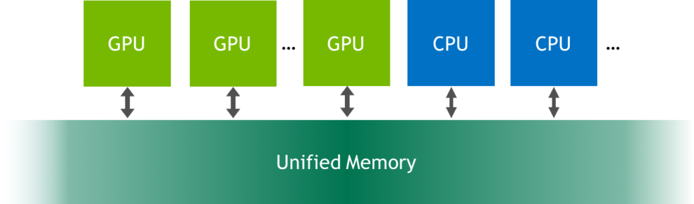

# How to Overlap Data Transfers in CUDA C/C++

In our [last CUDA C/C++
post](https://developer.nvidia.com/blog/parallelforall/how-optimize-data-transfers-cuda-cc/) we
discussed how to transfer data efficiently between the host and device. 
In this post, we discuss how to overlap data transfers with computation
on the host, computation on the device, and in some cases other data
transfers between the host and device. Achieving overlap between data
transfers and other operations requires the use of CUDA streams, so
first let's learn about streams.

## CUDA Streams

A *stream* in CUDA is a sequence of operations that execute on the
device in the order in which they are issued by the host code. While
operations within a stream are guaranteed to execute in the prescribed
order, operations in different streams can be interleaved and, when
possible, they can even run concurrently.

## The default stream

All device operations (kernels and data transfers) in CUDA run in a
stream. When no stream is specified, the default stream (also called the
"null stream") is used. The default stream is different from other
streams because it is a synchronizing stream with respect to operations
on the device: no operation in the default stream will begin until all
previously issued operations *in any stream on the device* have
completed, and an operation in the default stream must complete before
any other operation (in any stream on the device) will begin.

Please note that CUDA 7, released in 2015, introduced a new option to
use a separate default stream per host thread, and to treat per-thread
default streams as regular streams (i.e. they don't synchronize with
operations in other streams). Read more about this new behavior in the
post [[GPU Pro Tip: CUDA 7 Streams Simplify
Concurrency]{.underline}](https://developer.nvidia.com/blog/parallelforall/gpu-pro-tip-cuda-7-streams-simplify-concurrency/).

Let's look at some simple code examples that use the default stream, and
discuss how operations progress from the perspective of the host as well
as the device.

cudaMemcpy(d_a, a, numBytes, cudaMemcpyHostToDevice);

increment\<\<\<1,N\>\>\>(d_a)

cudaMemcpy(a, d_a, numBytes, cudaMemcpyDeviceToHost);

In the code above, from the perspective of the device, all three
operations are issued to the same (default) stream and will execute in
the order that they were issued.

From the perspective of the host, the implicit data transfers are
blocking or synchronous transfers, while the kernel launch is
asynchronous. Since the host-to-device data transfer on the first line
is synchronous, the CPU thread will not reach the kernel call on the
second line until the host-to-device transfer is complete. Once the
kernel is issued, the CPU thread moves to the third line, but the
transfer on that line cannot begin due to the device-side order of
execution.

The asynchronous behavior of kernel launches from the host's perspective
makes overlapping device and host computation very simple. We can modify
the code to add some independent CPU computation as follows.

cudaMemcpy(d_a, a, numBytes, cudaMemcpyHostToDevice);

increment\<\<\<1,N\>\>\>(d_a)

myCpuFunction(b)

cudaMemcpy(a, d_a, numBytes, cudaMemcpyDeviceToHost);

In the above code, as soon as the increment() kernel is launched on the
device the CPU thread executes myCpuFunction(), overlapping its
execution on the CPU with the kernel execution on the GPU. Whether the
host function or device kernel completes first doesn't affect the
subsequent device-to-host transfer, which will begin only after the
kernel completes.  From the perspective of the device, nothing has
changed from the previous example; the device is completely unaware
of myCpuFunction().

## Non-default streams

Non-default streams in CUDA C/C++ are declared, created, and destroyed
in host code as follows.

cudaStream_t stream1;

cudaError_t result;

result = cudaStreamCreate(&stream1)

result = cudaStreamDestroy(stream1)

To issue a data transfer to a non-default stream we use
the [[cudaMemcpyAsync]{.underline}](http://docs.nvidia.com/cuda/cuda-runtime-api/index.html#group__CUDART__MEMORY_1gf2810a94ec08fe3c7ff9d93a33af7255)() function,
which is similar to the cudaMemcpy() function discussed in the previous
post, but takes a stream identifier as a fifth argument.

result = cudaMemcpyAsync(d_a, a, N, cudaMemcpyHostToDevice, stream1)

cudaMemcpyAsync() is non-blocking on the host, so control returns to the
host thread immediately after the transfer is issued. There
are [[cudaMemcpy2DAsync]{.underline}](http://docs.nvidia.com/cuda/cuda-runtime-api/index.html#group__CUDART__MEMORY_1g7f182f1a8b8750c7fa9e18aeb280d31c)() and [[cudaMemcpy3DAsync]{.underline}](http://docs.nvidia.com/cuda/cuda-runtime-api/index.html#group__CUDART__MEMORY_1gb5854dd48800fe861864ae8784762a46)() variants
of this routine which can transfer 2D and 3D array sections
asynchronously in the specified streams.

To issue a kernel to a non-default stream we specify the stream
identifier as a fourth execution configuration parameter (the third
execution configuration parameter allocates shared device memory, which
we'll talk about later; use 0 for now).

increment\<\<\<1,N,0,stream1\>\>\>(d_a)

## Synchronization with streams

Since all operations in non-default streams are non-blocking with
respect to the host code, you will run across situations where you need
to synchronize the host code with operations in a stream.  There are
several ways to do this. The "heavy hammer" way is to
use [[cudaDeviceSynchronize]{.underline}](http://docs.nvidia.com/cuda/cuda-runtime-api/index.html#group__CUDART__DEVICE_1g32bdc6229081137acd3cba5da2897779)(),
which blocks the host code until all previously issued operations on the
device have completed. In most cases this is overkill, and can really
hurt performance due to stalling the entire device and host thread.

The CUDA stream API has multiple less severe methods of synchronizing
the host with a stream.  The
function [[cudaStreamSynchronize]{.underline}](http://docs.nvidia.com/cuda/cuda-runtime-api/index.html#group__CUDART__STREAM_1geb3b2f88b7c1cff8b67a998a3a41c179)(stream) can
be used to block the host thread until all previously issued operations
in the specified stream have completed. The
function [[cudaStreamQuery]{.underline}](http://docs.nvidia.com/cuda/cuda-runtime-api/index.html#group__CUDART__STREAM_1ge78feba9080b59fe0fff536a42c13e6d)(stream) tests
whether all operations issued to the specified stream have completed,
without blocking host execution. The
functions [[cudaEventSynchronize]{.underline}](http://docs.nvidia.com/cuda/cuda-runtime-api/index.html#group__CUDART__EVENT_1g08241bcf5c5cb686b1882a8492f1e2d9)(event) and [[cudaEventQuery]{.underline}](http://docs.nvidia.com/cuda/cuda-runtime-api/index.html#group__CUDART__EVENT_1gf8e4ddb569b1da032c060f0c54da698f)(event) act
similar to their stream counterparts, except that their result is based
on whether a specified event has been recorded rather than whether a
specified stream is idle. You can also synchronize operations within a
single stream on a specific event
using [[cudaStreamWaitEvent]{.underline}](http://docs.nvidia.com/cuda/cuda-runtime-api/index.html#group__CUDART__STREAM_1g80c62c379f0c3ed8afe31fd0a31ad8a2)(event)
(even if the event is recorded in a different stream, or on a different
device!).

## Overlapping Kernel Execution and Data Transfers

Earlier we demonstrated how to overlap kernel execution in the default
stream with execution of code on the host. But our main goal in this
post is to show you how to overlap kernel execution with data transfers.
There are several requirements for this to happen.

-   The device must be capable of "concurrent copy and execution".  This
    > can be queried from the deviceOverlap field of
    > a cudaDeviceProp struct, or from the output of
    > the deviceQuery sample included with the CUDA SDK/Toolkit. Nearly
    > all devices with compute capability 1.1 and higher have this
    > capability.

-   The kernel execution and the data transfer to be overlapped must
    > both occur in *different*, *non-default* streams.

-   The host memory involved in the data transfer must
    > be [[pinned]{.underline}](https://developer.nvidia.com/blog/parallelforall/how-optimize-data-transfers-cuda-cc/) memory.

So let's modify our simple host code from above to use multiple streams
and see if we can achieve any overlap. The full code for this example
is [[available on
Github]{.underline}](https://github.com/parallel-forall/code-samples/blob/master/series/cuda-cpp/overlap-data-transfers/async.cu).
In the modified code, we break up the array of size N into chunks
of streamSize elements. Since the kernel operates independently on all
elements, each of the chunks can be processed independently. The number
of (non-default) streams used is nStreams=N/streamSize. There are
multiple ways to implement the domain decomposition of the data and
processing; one is to loop over all the operations for each chunk of the
array as in this example code.

for (int i = 0; i \< nStreams; ++i) {

int offset = i \* streamSize;

cudaMemcpyAsync(&d_a\[offset\], &a\[offset\], streamBytes,
cudaMemcpyHostToDevice, stream\[i\]);

kernel\<\<\<streamSize/blockSize, blockSize, 0, stream\[i\]\>\>\>(d_a,
offset);

cudaMemcpyAsync(&a\[offset\], &d_a\[offset\], streamBytes,
cudaMemcpyDeviceToHost, stream\[i\]);

}

Another approach is to batch similar operations together, issuing all
the host-to-device transfers first, followed by all kernel launches, and
then all device-to-host transfers, as in the following code.

for (int i = 0; i \< nStreams; ++i) {

int offset = i \* streamSize;

cudaMemcpyAsync(&d_a\[offset\], &a\[offset\],

streamBytes, cudaMemcpyHostToDevice, cudaMemcpyHostToDevice,
stream\[i\]);

}

for (int i = 0; i \< nStreams; ++i) {

int offset = i \* streamSize;

kernel\<\<\<streamSize/blockSize, blockSize, 0, stream\[i\]\>\>\>(d_a,
offset);

}

for (int i = 0; i \< nStreams; ++i) {

int offset = i \* streamSize;

cudaMemcpyAsync(&a\[offset\], &d_a\[offset\],

streamBytes, cudaMemcpyDeviceToHost, cudaMemcpyDeviceToHost,
stream\[i\]);

}

Both asynchronous methods shown above yield correct results, and in both
cases dependent operations are issued to the same stream in the order in
which they need to be executed. But the two approaches perform very
differently depending on the specific generation of GPU used.  On a
Tesla C1060 (compute capability 1.3) running the test code (from Github)
gives the following results.

Device : Tesla C1060

Time for sequential transfer and execute (ms ): 12.92381

max error : 2.3841858E -07

Time for asynchronous V1 transfer and execute (ms ): 13.63690

max error : 2.3841858E -07

Time for asynchronous V2 transfer and execute (ms ): 8.84588

max error : 2.3841858E -07

On a Tesla C2050 (compute capability 2.0) we get the following results.

Device : Tesla C2050

Time for sequential transfer and execute (ms ): 9.984512

max error : 1.1920929e -07

Time for asynchronous V1 transfer and execute (ms ): 5.735584

max error : 1.1920929e -07

Time for asynchronous V2 transfer and execute (ms ): 7.597984

max error : 1.1920929e -07

Here the first time reported is the sequential transfer and kernel
execution using blocking transfers, which we use as a baseline for
asynchronous speedup comparison. Why do the two asynchronous strategies
perform differently on different architectures? To decipher these
results we need to understand a bit more about how CUDA devices schedule
and execute tasks. CUDA devices contain engines for various tasks, which
queue up operations as they are issued. Dependencies between tasks in
different engines are maintained, but within any engine all external
dependencies are lost; tasks in each engine's queue are executed in the
order they are issued. The C1060 has a single copy engine and a
single kernel engine. A time line for the execution of our example code
on a C1060 is shown in the following diagram.

{width="5.179307742782152in"
height="3.4347298775153106in"}

In the schematic we assume that the time required for the host-to-device
transfer, kernel execution, and device-to-host transfer are
approximately the same (the kernel code was chosen in order to achieve
this). As expected for the sequential kernel, there is no overlap in any
of the operations. For the first asynchronous version of our code the
order of execution in the copy engine is: H2D stream(1), D2H stream(1),
H2D stream(2), D2H stream(2), and so forth. This is why we do not see
any speed-up when using the first asynchronous version on the C1060:
tasks were issued to the copy engine in an order that precludes any
overlap of kernel execution and data transfer. For version two, however,
where all the host-to-device transfers are issued before any of the
device-to-host transfers, overlap is possible as indicated by the lower
execution time. From our schematic, we expect the execution of
asynchronous version 2 to be 8/12 of the sequential version, or 8.7 ms
which is confirmed in the timing results given previously.

On the C2050, two features interact to cause a behavior difference from
the C1060. The C2050 has two copy engines, one for host-to-device
transfers and another for device-to-host transfers, as well as a single
kernel engine. The following diagram illustrates execution of our
example on the C2050.

{width="5.458981846019247in"
height="3.5628357392825896in"}

Having two copy engines explains why asynchronous version 1 achieves
good speed-up on the C2050: the device-to-host transfer of data
in stream\[i\] does not block the host-to-device transfer of data in
stream\[i+1\] as it did on the C1060 because there is a separate engine
for each copy direction on the C2050. The schematic predicts the
execution time to be cut in half relative to the sequential version, and
this is roughly what our timing results showed.

But what about the performance degradation observed in asynchronous
version 2 on the C2050? This is related to the C2050's ability to
concurrently run multiple kernels. When multiple kernels are issued
back-to-back in different (non-default) streams, the scheduler tries to
enable concurrent execution of these kernels and as a result delays a
signal that normally occurs after each kernel completion (which is
responsible for kicking off the device-to-host transfer) until all
kernels complete. So, while there is overlap between host-to-device
transfers and kernel execution in the second version of our asynchronous
code, there is no overlap between kernel execution and device-to-host
transfers. The schematic predicts an overall time for the asynchronous
version 2 to be 9/12 of the time for the sequential version, or 7.5 ms,
and this is confirmed by our timing results.

A more detailed description of the example used in this post is
available in [[CUDA Fortran Asynchronous Data
Transfers]{.underline}](http://www.pgroup.com/lit/articles/insider/v3n1a4.htm). The
good news is that for devices with compute capability 3.5 (the K20
series), the Hyper-Q feature eliminates the need to tailor the launch
order, so either approach above will work. We will discuss using Kepler
features in a future post, but for now, here are the results of running
the sample code on a Tesla K20c GPU. As you can see, both asynchronous
methods achieve the same speedup over the synchronous code.

Device : Tesla K20c

Time for sequential transfer and execute (ms): 7.101760

max error : 1.1920929e -07

Time for asynchronous V1 transfer and execute (ms): 3.974144

max error : 1.1920929e -07

Time for asynchronous V2 transfer and execute (ms): 3.967616

max error : 1.1920929e -07

## Summary

This post and [[the previous
one]{.underline}](https://developer.nvidia.com/blog/parallelforall/how-optimize-data-transfers-cuda-cc/) discussed
how to optimize data transfers between the host and device. The previous
post focused on how to minimize the time for executing such transfers,
and this post introduced streams and how to use them to mask data
transfer time by concurrently executing copies and kernels.

In a post dealing with streams I should mention that while using the
default stream is convenient for developing code---synchronous code is
simpler---eventually your code should use non-default streams or the
CUDA 7 support for per-thread default streams (read [[GPU Pro Tip: CUDA
7 Streams Simplify
Concurrency]{.underline}](https://developer.nvidia.com/blog/parallelforall/gpu-pro-tip-cuda-7-streams-simplify-concurrency/)).
This is especially important when writing libraries. If code in a
library uses the default stream, there is no chance for the end user to
overlap data transfers with library kernel execution.

Now you know how to move data efficiently between the host and device,
so we'll look at how to access data efficiently from within kernels in
the [[next
post]{.underline}](https://developer.nvidia.com/blog/parallelforall/how-access-global-memory-efficiently-cuda-c-kernels/).
