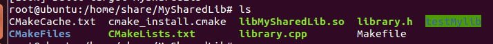
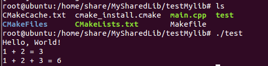
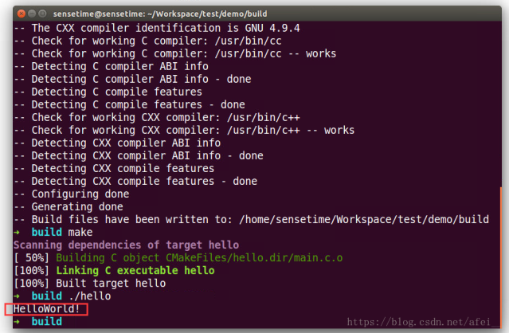
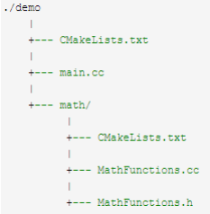

# 一、Cmake简介

cmake是一个跨平台、开源的构建系统。它是一个集软件构建、测试、打包于一身的软件。它使用与平台和编译器独立的配置文件来对软件编译过程进行控制。

# 二、常用命令

## 1. 指定cmake的最小版本

cmake_minimum_required(VERSION 3.4.1)

这行命令是可选的，我们可以不写这句话，但在有些情况下，如果
CMakeLists.txt
文件中使用了一些高版本cmake特有的一些命令的时候，就需要加上这样一行，提醒用户升级到该版本之后再执行cmake。

## 2. 设置项目名称

project(demo)

这个命令不是强制性的，但最好都加上。它会引入两个变量demo_BINARY_DIR 和
demo_SOURCE_DIR，同时，cmake自动定义了两个等价的变量 PROJECT_BINARY_DIR
和 PROJECT_SOURCE_DIR。

## 3. 设置编译类型

add_executable(demo demo.cpp) \# 生成可执行文件

add_library(common STATIC util.cpp) \# 生成静态库

add_library(common SHARED util.cpp) \# 生成动态库或共享库

add_library 默认生成是静态库，通过以上命令生成文件名字，

在Linux下是：

demo

libcommon.a

libcommon.so

在Windows下是：

demo.exe

common.lib

common.dll

## 4. 指定编译包含的源文件

### 4.1 明确指定包含哪些源文件

add_library(demo demo.cpp test.cpp util.cpp)

### 4.2 搜索所有的cpp文件

aux_source_directory(dir VAR)
发现一个目录下所有的源代码文件并将列表存储在一个变量中。

aux_source_directory(. SRC_LIST) \# 搜索当前目录下的所有.cpp文件

add_library(demo \${SRC_LIST})

### 4.3 自定义搜索规则

file(GLOB SRC_LIST \"\*.cpp\" \"protocol/\*.cpp\")

add_library(demo \${SRC_LIST})

\# 或者

file(GLOB SRC_LIST \"\*.cpp\")

file(GLOB SRC_PROTOCOL_LIST \"protocol/\*.cpp\")

add_library(demo \${SRC_LIST} \${SRC_PROTOCOL_LIST})

\# 或者

aux_source_directory(. SRC_LIST)

aux_source_directory(protocol SRC_PROTOCOL_LIST)

add_library(demo \${SRC_LIST} \${SRC_PROTOCOL_LIST})

## 5. 查找指定的库文件

find_library(VAR name
path)查找到指定的预编译库，并将它的路径存储在变量中。

默认的搜索路径为cmake包含的系统库，因此如果是 NDK 的公共库只需要指定库的
name 即可。

find_library( \# Sets the name of the path variable.

log-lib

\# Specifies the name of the NDK library that

\# you want CMake to locate.

log )

类似的命令还有find_file()、find_path()、find_program()、find_package()。

## 6. 设置包含的目录

include_directories(

\${CMAKE_CURRENT_SOURCE_DIR}

\${CMAKE_CURRENT_BINARY_DIR}

\${CMAKE_CURRENT_SOURCE_DIR}/include

)

Linux下还可以通过如下方式设置包含的目录

set(CMAKE_CXX_FLAGS \"\${CMAKE_CXX_FLAGS}
-I\${CMAKE_CURRENT_SOURCE_DIR}\")

## 7. 设置链接库搜索目录

link_directories(

\${CMAKE_CURRENT_SOURCE_DIR}/libs

)

Linux 下还可以通过如下方式设置包含的目录

set(CMAKE_CXX_FLAGS \"\${CMAKE_CXX_FLAGS}
-L\${CMAKE_CURRENT_SOURCE_DIR}/libs\")

## 8. 设置 target 需要链接的库

target_link_libraries( \# 目标库

demo

\# 目标库需要链接的库

\# log-lib 是上面 find_library 指定的变量名

\${log-lib} )

在 Windows 下，系统会根据链接库目录，搜索xxx.lib 文件，Linux 下会搜索
xxx.so 或者 xxx.a 文件，如果都存在会优先链接动态库（so 后缀）。

### 8.1 指定链接动态库或静态库

target_link_libraries(demo libface.a) \# 链接libface.a

target_link_libraries(demo libface.so) \# 链接libface.so

### 8.2 指定全路径 {#指定全路径 .标题3}

target_link_libraries(demo \${CMAKE_CURRENT_SOURCE_DIR}/libs/libface.a)

target_link_libraries(demo \${CMAKE_CURRENT_SOURCE_DIR}/libs/libface.so)

### 8.3 指定链接多个库

target_link_libraries(demo

\${CMAKE_CURRENT_SOURCE_DIR}/libs/libface.a

boost_system.a

boost_thread

pthread)

## 9. 设置变量

### 9.1 set 直接设置变量的值

set(SRC_LIST main.cpp test.cpp)

add_executable(demo \${SRC_LIST})

## 9.2 set追加设置变量的值

set(SRC_LIST main.cpp)

set(SRC_LIST \${SRC_LIST} test.cpp)

add_executable(demo \${SRC_LIST})

## 9.3 list追加或者删除变量的值

set(SRC_LIST main.cpp)

list(APPEND SRC_LIST test.cpp)

list(REMOVE_ITEM SRC_LIST main.cpp)

add_executable(demo \${SRC_LIST})

## 10. 条件控制

### 10.1 if...elseif...else...endif

逻辑判断和比较：

if (expression)：expression 不为空（0,N,NO,OFF,FALSE,NOTFOUND）时为真

if (not exp)：与上面相反

if (var1 AND var2)

if (var1 OR var2)

if (COMMAND cmd)：如果 cmd 确实是命令并可调用为真

if (EXISTS dir) if (EXISTS file)：如果目录或文件存在为真

if (file1 IS_NEWER_THAN file2)：当 file1 比 file2 新，或 file1/file2
中有一个不存在时为真，文件名需使用全路径

if (IS_DIRECTORY dir)：当 dir 是目录时为真

if (DEFINED var)：如果变量被定义为真

if (var MATCHES regex)：给定的变量或者字符串能够匹配正则表达式 regex
时为真，此处 var 可以用 var 名，也可以用 \${var}

if (string MATCHES regex)

数字比较：

if (variable LESS number)：LESS 小于

if (string LESS number)

if (variable GREATER number)：GREATER 大于

if (string GREATER number)

if (variable EQUAL number)：EQUAL 等于

if (string EQUAL number)

字母表顺序比较：

if (variable STRLESS string)

if (string STRLESS string)

if (variable STRGREATER string)

if (string STRGREATER string)

if (variable STREQUAL string)

if (string STREQUAL string)

示例：

if(MSVC)

set(LINK_LIBS common)

else()

set(boost_thread boost_log.a boost_system.a)

endif()

target_link_libraries(demo \${LINK_LIBS})

\# 或者

if(UNIX)

set(CMAKE_CXX_FLAGS \"\${CMAKE_CXX_FLAGS} -std=c++11 -fpermissive -g\")

else()

add_definitions(-D_SCL_SECURE_NO_WARNINGS

D_CRT_SECURE_NO_WARNINGS

-D_WIN32_WINNT=0x601

-D_WINSOCK_DEPRECATED_NO_WARNINGS)

endif()

if(\${CMAKE_BUILD_TYPE} MATCHES \"debug\")

\...

else()

\...

endif()

### 10.2 while...endwhile

while(condition)

\...

endwhile()

### 10.3 foreach...endforeach

foreach(loop_var RANGE start stop \[step\])

\...

endforeach(loop_var)

start 表示起始数，stop 表示终止数，step 表示步长，示例：

foreach(i RANGE 1 9 2)

message(\${i})

endforeach(i)

\# 输出：13579

## 11. 打印信息

message(\${PROJECT_SOURCE_DIR})

message(\"build with debug mode\")

message(WARNING \"this is warnning message\")

message(FATAL_ERROR \"this build has many error\") \# FATAL_ERROR
会导致编译失败

## 12. 包含其它cmake文件

include(./common.cmake) \# 指定包含文件的全路径

include(def) \# 在搜索路径中搜索def.cmake文件

set(CMAKE_MODULE_PATH \${CMAKE_CURRENT_SOURCE_DIR}/cmake) \#
设置include的搜索路径

# 三、常用变量

## 1. 预定义变量

PROJECT_SOURCE_DIR：工程的根目录

PROJECT_BINARY_DIR：运行 cmake 命令的目录，通常是
\${PROJECT_SOURCE_DIR}/build

PROJECT_NAME：返回通过 project 命令定义的项目名称

CMAKE_CURRENT_SOURCE_DIR：当前处理的 CMakeLists.txt 所在的路径

CMAKE_CURRENT_BINARY_DIR：target 编译目录

CMAKE_CURRENT_LIST_DIR：CMakeLists.txt 的完整路径

CMAKE_CURRENT_LIST_LINE：当前所在的行

CMAKE_MODULE_PATH：定义自己的 cmake
模块所在的路径，SET(CMAKE_MODULE_PATH
\${PROJECT_SOURCE_DIR}/cmake)，然后可以用INCLUDE命令来调用自己的模块

EXECUTABLE_OUTPUT_PATH：重新定义目标二进制可执行文件的存放位置

LIBRARY_OUTPUT_PATH：重新定义目标链接库文件的存放位置

## 2. 环境变量

使用环境变量

\$ENV{Name}

写入环境变量

set(ENV{Name} value) \# 这里没有"\$"符号

## 3. 系统信息

CMAKE_MAJOR_VERSION：cmake 主版本号，比如 3.4.1 中的 3

CMAKE_MINOR_VERSION：cmake 次版本号，比如 3.4.1 中的 4

CMAKE_PATCH_VERSION：cmake 补丁等级，比如 3.4.1 中的 1

CMAKE_SYSTEM：系统名称，比如 Linux-­2.6.22

CMAKE_SYSTEM_NAME：不包含版本的系统名，比如 Linux

CMAKE_SYSTEM_VERSION：系统版本，比如 2.6.22

CMAKE_SYSTEM_PROCESSOR：处理器名称，比如 i686

UNIX：在所有的类 UNIX 平台下该值为 TRUE，包括 OS X 和 cygwin

WIN32：在所有的 win32 平台下该值为 TRUE，包括 cygwin

## 4. 主要开关选项

BUILD_SHARED_LIBS：这个开关用来控制默认的库编译方式，如果不进行设置，使用
add_library 又没有指定库类型的情况下，默认编译生成的库都是静态库。如果
set(BUILD_SHARED_LIBS ON) 后，默认生成的为动态库

CMAKE_C_FLAGS：设置 C 编译选项，也可以通过指令 add_definitions() 添加

CMAKE_CXX_FLAGS：设置 C++ 编译选项，也可以通过指令 add_definitions()
添加

add_definitions(-DENABLE_DEBUG -DABC) \# 参数之间用空格分隔

# 四、项目示例

## 1. 简单项目（单个源文件）

一个经典的C程序，如何通过cmake来编译呢？

### 1.1 新建文件 main.c

#include \<stdio.h\>

int main() {

printf(\"Hello World!\\n\");

return 0;

}

### 1.2 新建文件 CMakeLists.txt（命名必须是 CMakeLists.txt，注意大小写和不要漏字母） {#新建文件-cmakelists.txt命名必须是-cmakelists.txt注意大小写和不要漏字母 .标题3}

project(HELLO)

add_executable(hello main.c)

### 1.3 编译和运行

新建一个build文件夹，目录情况如下：

为什么要新建一个build文件夹？

一般我们采用cmake的out-of-source方式来构建（即生成的中间产物和源代码分离），这样做可以让生成的文件和源文件不会弄混，且目录结构看起来也会清晰明了。所以推荐使用这种方式，至于这个文件夹的命名并无限制，我们习惯命名为build。

依次执行以下命令：

cd build

cmake ..

首先进入到 build 目录，然后就是 cmake ..
命令，另外要注意将cmake配置到环境变量中去才可直接使用，否则需要使用绝对路径，..表示上一级目录，cmake会在上一级目录下找到CMakeLists.txt文件并编译，并生成如下图所示的一些中间文件：

直接执行make命令，生成可执行程序，如下图：

运行程序，如下所示：运行程序，如下所示：

## 2. 复杂项目（多个目录，多个源文件，多个项目）

目录结构如下：

demo根目录下的CMakeLists.txt文件如下：

cmake_minimum_required (VERSION 2.8)

project(demo)

aux_source_directory(. DIR_SRCS)

\# 添加math子目录

add_subdirectory(math)

\# 指定生成目标

add_executable(demo \${DIR_SRCS})

\# 添加链接库

target_link_libraries(demo MathFunctions)

math 目录下的CMakeLists.txt文件如下：

aux_source_directory(. DIR_LIB_SRCS)

\# 生成链接库

add_library(MathFunctions \${DIR_LIB_SRCS})

## 3. 自定义编译选项

cmake
允许为项目增加编译选项，从而可以根据用户的环境和需求选择最合适的编译方案。

例如，可以将 MathFunctions 库设为一个可选的库，如果该选项为 ON
，就使用该库定义的数学函数来进行运算，否则就调用标准库中的数学函数库。

修改根目录下的 CMakeLists.txt 文件如下：

\# CMake 最低版本号要求

cmake_minimum_required (VERSION 2.8)

\# 项目信息

project (Demo)

\# 加入一个配置头文件，用于处理 CMake 对源码的设置

configure_file (

\"\${PROJECT_SOURCE_DIR}/config.h.in\"

\"\${PROJECT_BINARY_DIR}/config.h\"

)

\# 是否使用自己的 MathFunctions 库

option (USE_MYMATH

\"Use provided math implementation\" ON)

\# 是否加入 MathFunctions 库

if (USE_MYMATH)

include_directories (\"\${PROJECT_SOURCE_DIR}/math\")

add_subdirectory (math)

set (EXTRA_LIBS \${EXTRA_LIBS} MathFunctions)

endif (USE_MYMATH)

\# 查找当前目录下的所有源文件

\# 并将名称保存到 DIR_SRCS 变量

aux_source_directory(. DIR_SRCS)

\# 指定生成目标

add_executable(Demo \${DIR_SRCS})

target_link_libraries (Demo \${EXTRA_LIBS})

configure_file
命令用于加入一个配置头文件config.h，这个文件由cmake从config.h.in
生成，通过这样的机制，将可以通过预定义一些参数和变量来控制代码的生成。

option命令添加了一个USE_MYMATH选项，并且默认值为ON。根据USE_MYMATH变量的值来决定是否使用我们自己编写的MathFunctions库。

修改main.cc文件，让其根据USE_MYMATH的预定义值来决定是否调用标准库还是MathFunctions
库：

#include \"config.h\"

#ifdef USE_MYMATH

#include \"math/MathFunctions.h\"

#else

#include \<math.h\>

#endif

int main(int argc, char \*argv\[\])

{

if (argc \< 3){

printf(\"Usage: %s base exponent \\n\", argv\[0\]);

return 1;

}

double base = atof(argv\[1\]);

int exponent = atoi(argv\[2\]);

#ifdef USE_MYMATH

printf(\"Now we use our own Math library. \\n\");

double result = power(base, exponent);

#else

printf(\"Now we use the standard library. \\n\");

double result = pow(base, exponent);

#endif

printf(\"%g \^ %d is %g\\n\", base, exponent, result);

return 0;

}

编写config.h.in文件.

注意main.cc的第一行，这里引用了一个config.h文件，这个文件预定义了
USE_MYMATH的值。但我们并不直接编写这个文件，为了方便从 CMakeLists.txt
中导入配置，我们编写一个config.h.in文件，内容如下：

#cmakedefine USE_MYMATH

这样cmake会自动根据CMakeLists.txt配置文件中的设置自动生成config.h文件。

# CMake如何编译CUDA(.cu)源文件

现在的项目，如果需要用到计算加速，**Nvidia**的**CUDA**往往是首选。那么如何在**CMake**中编译写好的**CUDA**源代码，可以参考如下。

首先使用**FIND_PACKAGE**找到已经安装的**CUDA**，此时需要配置的环境变量等，应该已经自动配置完成了

SET(CUDA_VERSION 8.0)

FIND_PACKAGE(CUDA \${CUDA_VERSION} REQUIRED)

STRING (TOLOWER \${CMAKE_SYSTEM_NAME} LOWER_SYSTEM_NAME)

SET(CUDA_TARGET_INCLUDE\${CUDA_TOOLKIT_ROOT_DIR}-\${CUDA_VERSION}/targets/\${CMAKE_HOST_SYSTEM_PROCESSOR}-\${LOWER_SYSTEM_NAME}/include)

接下来，使用**CUDA_ADD_LIBRARY**取代原来的**ADD_LIBRARY**，如下：

CUDA_ADD_LIBRARY(mylib SHARED

file1.cpp

file2.cu

file3.cpp

OPTIONS -arch sm_20

)

TARGET_LINK_LIBRARIES(mylib \${CUDA_LIBRARIES})

如果是可执行程序，请使用**CUDA_ADD_EXECUTABLE**取代**ADD_EXECUTABLE**。
