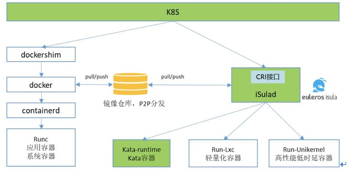
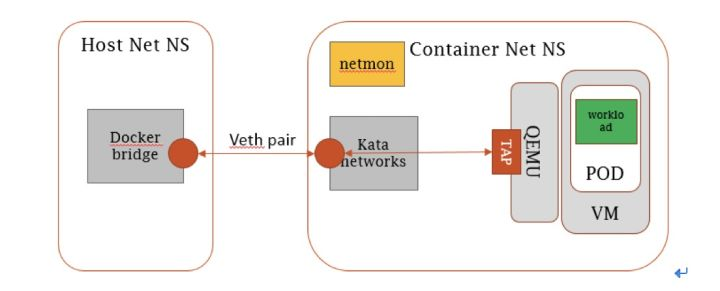
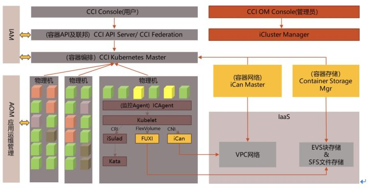

# iSulad轻量化容器实践解析

## 容器应用带来的困扰

容器应用[在2019年迎来新的一轮浪潮，]{.mark}全球整体容器市场规模以高达30%的速度高歌猛进，大多数企业开始全面拥抱容器化，容器的规模、密度愈加扩大。

根据Sysdig
2019年容器使用报告统计，在企业内部容器规模方面，9%的企业用户容器规模已经达到5000以上；在容器密度方面，与2018年相比，每台主机中的容器密度提高了100%，从15个增加到了30个，其中最大节点密度已经达到[250个。]{.mark}

{width="5.261894138232721in"
height="2.5548108048993874in"}

本统计数据来自sysdig-2019-container-usage-report

在这样的应用规模下，也许大家有类似的经历：

当部署高密度容器节点或资源敏感环境时，容器的基础设施资源占用超乎了想象；

当大规模应用拉起或突发流量时，原本觉得够用的并发速度却成为了瓶颈；

面对这两个问题，是否有什么解决方案么？本文将和大家一起探讨一下解决这两个问题的一些"心路历程"。

## 重新造个"轮子"？！

上述两个问题在大规模容器化应用的过程中不断出现，并且随着IoT、边缘计算产业的兴起变得愈发紧迫：边缘节点资源敏感，留给容器基础设施的资源屈指可数，一个更轻量、更快速的容器引擎呼之欲出。

接下来我们想分享一下应用过程中的一些尝试：

首先考虑"能否对开源容器引擎软件进行轻量化改造"，沿着这个思路，我们尝试过对Docker容器引擎进行了裁剪和精简化，例如去除不需要的功能、组件结构优化等，甚至对Golang本身编译进行优化，但是效果不甚理想。因为我们的使用范围并不只是服务器等通用场景，我们的容器甚至会运行在端侧的嵌入式设备上，单单裁剪容器引擎其实也并不能完全满足我们的要求。

另外，由于覆盖云、IoT、边缘计算等多个场景，我们的裁剪和轻量化并不能通用适配所有场景，因此需要维护多个容器引擎版本，这对我们的升级和维护造成了不少麻烦。

这时候，一个大胆的想法涌入了我们的脑海，是不是可以[重新造个"轮子"！]{.mark}对于软件工程师来说，没有什么是比重新造个"轮子"更棒了！

对, 那我们就重新造一个"大一统"的容器引擎！

## 千呼万唤，iSulad来了

2017年，iSula容器团队开始了重新开发一个容器引擎的计划，并在2018年开始在华为内部分产品进行替代。

2019年，我们针对CRI接口进行了一次大范围的重构和补全，并最终决定将它与openEuler操作系统一并开源出来。

现在的iSulad项目的目标是成为通用的端、边、云平台一体的容器引擎，可提供统一的架构设计来满足云、IoT、边缘计算等多个场景的应用。

最后，我们的小蚂蚁iSulad终于出生了！

{width="3.424711286089239in"
height="1.6320975503062116in"}

看到这里，同学们可能会有点疑惑，iSulad到底是啥呢？

iSula
在居住中南美洲亚马逊丛林的巴西原住民眼里，它是一种非常强大的蚂蚁，学术上称为"子弹蚁"，因为被它咬一口，犹如被子弹打到那般疼痛，它是世界上最强大的昆虫之一。

iSula为全量的容器软件栈，包括引擎、网络、存储、工具集与容器OS；iSulad
作为其中轻量化的容器引擎，可以为多种场景提供最灵活、最稳定、最安全的底层支撑，与子弹蚂蚁\"小个头、大能量\"的形象不谋而合。

{width="5.1734864391951in"
height="3.8254341644794403in"}

## iSulad的特点

[轻]{.mark}

iSulad的第一个使用场景是在端侧设备上，你很难想象在一个智能摄像头上会使用容器来达到快速、简单切换算法应用部署的功能，在那样严苛的资源要求环境下，iSulad
(Light
Mode)本身占用资源极低(\<15M),并结合特殊的轻量化镜像，达成极致的资源占用的效果。

当然，在通用场景下，iSulad也有着不错的轻量化表现。iSulad将端侧的优秀实践继承到通用服务器场景，利用轻量化的lxc运行时以及极其轻量的monitor进程，简化了整个调用链路

[快]{.mark}

随着Serverless的快速兴起，Serverless
Container也成为云计算的一个重要的基础设施。为了满足Serverless
Container的诉求，iSulad进行了一系列的尝试和努力：

）iSulad采用C/C++语言实现，具备运行速度快、底噪低等特性，且LXC运行时优秀的并发设计也为iSulad并发性能提供了基石；

）架构设计上，除了启动容器部分需要通过fork/exec的方式，其他部分均使用调用函数库的方式加快执行速度；通过将镜像和rootfs部分独立为服务，以及优化镜像模块元数据的隔离性，实现了不同镜像和rootfs之间的操作完全隔离。

[易]{.mark}

根据Sysdig的统计，当前79%的用户仍在使用Docker作为其主力容器引擎

sysdig-2019-container-usage-report

应用的迁移一直是一个很令人头疼的问题，iSulad为了使开发者迁移方便，正在筹备开发一系列迁移工具，帮助开发者将自己的应用平滑迁移到iSulad上来。

更激动的是，iSulad很快就会支持热迁移啦，那时候就能更便捷的迁移开发者的应用了。

[灵]{.mark}

iSulad针对不同的使用场景提供不同的模式供大家组合切换，开发者可以根据自己的使用需要灵活配置切换注重性能的performance模式和注重资源占用的light模式。

iSulad支持多种不同的容器形态，iSulad内置支持系统容器、安全容器和普通容器以及轻量化容器支持。

## iSulad应用实测

经过上文的介绍，是不是想看看iSulad的实际效果呢?

在内存资源占用方面，100容器启动情况下，iSulad比Docker所占用的内存资源消耗下降68%。

{width="3.9371445756780403in"
height="3.0645680227471566in"}

在并发启动速度方面，100容器并发情况下，iSulad比Docker要快上35%：

{width="3.900787401574803in"
height="3.036268591426072in"}

更多信息

想要进一步了解iSulad项目并参与iSulad项目吗？

欢迎来我们的社区玩儿哦\~

openEuler开源社区：https://openeuler.org

iSulad项目源码：https://gitee.com/openeuler/iSulad

# 基于Kata Containers与iSulad的[云容器]{.mark}实践解析

在4月9号结束的OpenStack基金会董事会议上，董事们投票批准了 Kata
Containers 成为基金会旗下第一个新的顶级开放基础设施（Open
Infrastructure）项目，这是该项目的一个重要里程碑。

作为 Kata Containers 的初创成员之一，华为拥有 Kata Containers
架构委员会五席位之一和三位 maintainer，贡献了支持 CNI 网络接口、Host
Cgroups 等特性，参与核心代码重构，并已提交上百个 patch，代码贡献量超过 3
万行，全球排名稳定保持在前四。

2017 年，华为 EulerOS iSula 技术团队成功将 Kata Containers 集成到 iSula
容器平台，并于 18 年初应用于华为云容器服务，推出基于 iSulad 容器引擎 +
Kata Containers 的商用容器服务------[华为云容器实例 CCI（Cloud Container
Instance），]{.mark}也是[业界首个 Serverless
架构的云容器服务]{.mark}，正是得益于 Kata
Containers，使之前一直困扰用户的容器安全问题迎刃而解。

本文将重点介绍基于 iSulad 容器引擎和 Kata Containers
如何打造安全、高性能的云容器实例服务。

首先了解华为 iSula
容器平台，这是华为自研的容器平台，支持双容器引擎和五种不同的容器模式。

{width="5.066900699912511in"
height="2.5400174978127734in"}

双引擎为：

-   docker 引擎：目前流行的 docker 容器引擎，在 Linux 上基于 namespace
    及 cgroups 实现应用之间的隔离，使用 Go 语言编写而成。

-   iSulad 容器引擎：使用 C 语言编写而成的华为纯自研容器引擎，相比
    docker
    引擎突出的优点是性能高，资源占用小，在边缘计算等资源受控场景下有着非常耀眼的表现。

五种容器形态为：

-   应用容器：即大家熟知的 docker containers。

-   系统容器：在容器大浪潮中，各种不同类型的业务纷纷进行容器化，期望利用容器"build,
    ship and run"的能力最大化生产效率。相比微服务应用，传统的基于
    systemd 的重型业务更加难以容器化，系统容器应运而生。系统容器内置
    systemd 作为 init 进程，可帮助传统业务更轻松完成容器化改造和使用。

-   轻量化容器：基于 LXC 打造的轻量化容器占用内存资源极少，主要用于 CT
    或边缘计算等资源受控场景。

-   高性能低时延容器：使用 unikernel
    技术将应用与定制化内核打包，一方面可以大大减小攻击面增强安全性，同时大幅度提高了应用的运行性能。高性能低延时容器可以为定制化场景提供最佳方案。

-   Kata
    容器：融合传统虚拟化技术与容器技术创造的高安全性容器，一方面兼容了繁荣的容器生态，一方面解决了传统容器隔离性不足的安全隐患，这也是华为云容器实例这种
    Serverless 架构下，用户最为关心的问题。

iSula 在集成 Kata Container
优秀特性的同时，还会针对业务场景进行定制化改造。性能问题一直是大多数开源项目被诟病的地方，尤其是在超大型商业应用环境下尤为明显。Kata
Containers 也不例外，虽然 Kata 社区提供的技术方案已经可以很好地兼容
docker、containerd 及 crio 等容器运行时，但出于性能等方面的考虑，iSula
并未直接使用社区方案，而是采用了性能更高的自研发方案。使用 iSula
自研方案，可以极大缩短软件栈的深度，减少 RPC
调用开销，更好配合华为云自有高性能网络及存储资源，使得华为云容器服务能为用户提供更高性能的网络及存储方案。

以网络为例，社区开源网络方案如下所示：

{width="5.358442694663167in"
height="2.1666961942257217in"}

Calico、Canal 等开源网络软件会将创建的 veth 网口插入容器的 namespace
中，在 Kata 的场景下，容器的 Network Namespace
中还有一层虚拟化层，需要使用 Linux tap 设备而无法直接使用 veth
网卡。因而，Kata
提供了几种网络模型用于兼容容器生态中的多种网络方案，包括：

-   Bridge 模式：使用 Linux bridge 将 veth 与 VM 的 tap 设备桥接起来。

-   Macvtap 模式：创建母设备为 veth 的 macvtap 供 VM 使用。

-   TC 模式：使用 Linux TC 在 veth 和 tap 设备之间做流量的双向转发。

Kata 默认的几种网络模型可以保证开源容器 CNI
网络方案无需修改开箱即用，这种方式足够智能，但灵活性稍显不足，因而华为向社区贡献了一种新的模式：

-   None 模式：Kata 不做任何猜测，不智能创建网卡，网络需要用户使用新增的
    kata-network 命令手动创建。

使用 none 模式给予了用户最大选择权和灵活性，但需要用户自行改造 CNI
网络插件，相比其他模式有一定使用门槛。好处在于由 CNI
插件可以直接为容器增删网卡 / 路由，绕过了 veth
网卡，缩短了网络拓扑路径长度，为网络性能的提升提供了更大空间。

None
模式配合华为自研的容器网络方案，可以保证为容器应用提供最佳网络性能。

了解过 iSula，再来看看华为云容器实例（CCI）服务，CCI 是基于 Serverless
架构的 Kubernetes 容器服务。

{width="5.393077427821522in"
height="2.8014041994750656in"}

真正的 Serverless
容器服务中，集群管理由云服务提供商承担，客户只需要关注每个应用的容器实例即可。在这种情况下，云服务提供商需要考虑如何在统一管理面下保证每个用户的安全。

CCI 服务所属的 Kubernetes
集群直接部署在[裸金属服务器]{.mark}之上，底层是 Kata Containers，中间靠
iSula 容器平台连接。依靠 Kata Containers
的强隔离特性，多个租户之间的容器运行环境强隔离，不同租户之间的容器不感知、不可见，可以在同一台裸金属服务器上混合部署而安全无虞，若使用
docker 容器通常认为是存在安全风险的。

同时，CCI 这种将 Kubernetes 直接部署在裸金属服务器上的混合多租模式，配合
Kata Containers
技术可以最大化资源利用率，降低性能开销，使得用户的内存开销小于
64MB，容器实例启动时间小于
600ms，从而可以为用户提供高性能低价位的容器服务。借助 iSula
优化过的网络和存储能力，CCI 可以在网络和存储基础资源之上，提供更优性能。

除此以外，基于 iSula 提供的 GPU 直通功能，CCI 通过该技术提供的 GPU
容器，用户可直接在容器中使用 nvidia 的各型号 GPU 进行 AI 计算，使得 CCI
也成为市面上第一个提供 GPU 算力的 Serverless Kubernetes
容器服务，并且做到 32 块 GPU 线性加速比超过 0.95,128 块 GPU
线性加速比超过 0.8，在图像识别、自然语言处理、语音识别等领域被广泛使用。

发布于 2019-04-19
