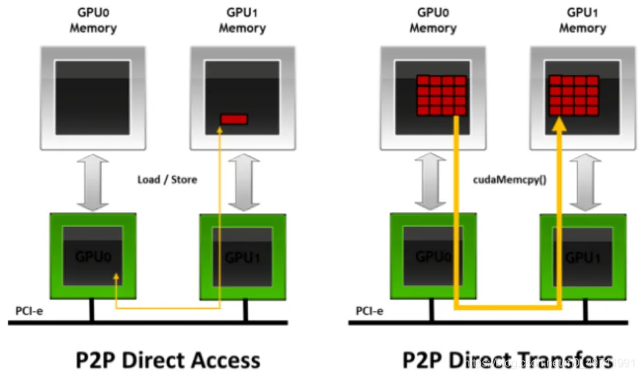

# GPUDirect Storage设计指南

## 1前言

NVIDIA GPUDirect Storage (GDS)，是GPUDirect系列技术中的一员。还有：

GPUDiret P2P，在2个GPU见实施内存的DMA访问路径；

GPUDiret RDMA，通过NIC，实施直接的DMA访问路径。

[GPUDiret Async？？？]{.mark}

GDS实施GPU内存与存储器之间的直接DMA数据转移，因此避免了通过CPU的bounce
buffer。直接路径增加系统带宽，减小延迟，CPU与GPU利用率，见图1。有人声称超级计算机就是将计算约束的问题转换为IO约束的问题。GDS帮助缓解IO瓶颈，创建更平衡的系统。

通过cuFile
API实施GDS特性，已添加到CUDA中。单独的软件包，初步分为：[用户层程序库---libcufile.so，和一个内核驱动nvidia-fs.so]{.mark}。用户层程序库将合并入CUDA用户层运行时。内核驱动需要单独安装，随同NVIDIA驱动程序一次性整合安装。

{width="5.378885608048994in"
height="2.689443350831146in"}

图1 比较GPUDirect Storage的路径

## 2 GPU的数据转移问题和存储

GPU内存与存储之间的数据转移，使用系统软件驱动设置和管理，在CPU上执行，称之为[控制路径]{.mark}(controller
path)。数据移动可用下面3个agents之一来管理：

（1）GPU及其DMA引擎。

（2）CPU实施加载和存储。

（3）存储器附近的DMA引擎，例如在NVMe驱动，NIC或存储控制器，如RAID卡。GPU
PCIe BAR 可暴露给其他DMA引擎。例如，GPUDiret
RDMA通过NIC驱动，将BAR暴露给NIC中的DMA引擎，Mellanox的NIC驱动支持这个操作。但是，当终点在文件系统存储，操作系统要参与其中。不幸的是，当前的OS不支持将GPU
PCIe BAR传递给文件存储系统。

## 3 GPUDirect Storage技术的益处

使用GDS功能可避免在CPU系统内存中使用"bounce buffer"，其中bounce
buffer定义为实施2个设备（如GPU与存储器）之间数据转移的系统内存中的临时缓存。

使用GDS可实现如下效率的提高：

（1）带宽：

（2）延迟：

（3）CPU利用率

（4）新的PCIe路径

（5）PCIe ATS：PCIe Address Translation Service (ATS)

（6）Capacity and Cost

（7）内存分配

（8）异步(Asynchrony)：当cuFile
API初始化不是异步时，可增加一个Stream参数，启用异步执行，提高效率。见图2，DGX-2系统有2个CPU
Sockets，每个有4个PCIe，各PCIe有2层switch。Each second level switch has
a connection to the first level switch, a PCIe slot that can be
populated with an NIC or RAID card, and two GPUs.

{width="5.107857611548557in"
height="2.553928258967629in"}

图2 系统拓扑结构示意图

## 4 GDS的适用情况

以下几种情况适合使用GDS技术：

（1）数据转移或IO转移直接读写GPU，不通过CPU；

（2）IO必须是显著的效率瓶颈；

（3）数据转移或IO转移必须是显式的；

（4）缓冲区必须锁定到GPU内存；

（5）必须连同可使用GPUDirect的NVIDIA
GPU（仅Quadro和Tesla），使用CUDA和cuFile API。

### 4.1 读写GPU的数据转移 {#读写gpu的数据转移 .标题3}

必须数据是在GPU与存储器之间的转移，如果是CPU与存储器之间的数据转移则GDS没有益处。

### 4.2 IO瓶颈 {#io瓶颈 .标题3}

如果计算时间远大于IO时间，则GDS无益处。如果IO时间完全与计算重叠，即使用异步IO，则IO不是瓶颈。流处理大量数据的工作负荷以及在各数据单元上执行少量计算的情况，则倾向于IO约束。

### 4.3显式的 {#显式的 .标题3}

GDS提供的API是显式的，如Linux的pread和pwrite。这需要修改一些应用程序的代码，例如模型从mmap内存切换到直接访问GPU需要的内存。直接访问模型的效率更高。

### 4.4锁定内存 {#锁定内存 .标题3}

为了启动DMA转移，GPU内存必须是锁定的。这要求GPU内存是cudaMalloc分配的，而不是cudaMallocManaged或malloc。显然，各转移数据的大小必须符合分配的缓冲量。

### 4.5 cuFile APIs {#cufile-apis .标题3}

用户直接使用cuFile的安装程序，直接使用cuFileRead和cuFIleWrite
APIs，这些API启动读写，类似与POSIX的pread和pwrite（带O_DIRECT），驱动初始化和终止，缓冲寄存等。cuFileRead和cuFIleWrite转移是显式和直接的，因此效率最高。

使用mmap的程序是间接地，更慢，因为数据是从存储器加载到CPU内存，然后从CPU内存到GPU内存。为使用cuFileRead和cuFileWrite，GPU内存必须用cudaMalloc分配，因此是锁定的，而不是用cudaMallocManaged。当应用程序精确知道什么数据要转移，转移到哪，使用这些API则简单且直接。

## 5系统要求

### 5.1软件要求 {#软件要求 .标题3}

-   OS：GDS仅在Linux上得到支持，当前是Ubuntu；

-   文件系统：必须是GDS适用的分布式文件系统或分块系统，这要求安装一个内核层驱动，是具有特权的操作。

-   没有CPU上的IO：直接涉及CPU的文件操作不能与GDS连同使用，包括RAID 5 or
    6, checksum或压缩（ZFS，BTRFS）

-   可视化：不支持

-   SBIOS：在一些桌面和工作站主板上，SBIOS限制了GPU PCIe
    BAR1资源的大小，例如任何时间暴露给其他DMA引擎的地址窗口大小。必须使用64位窗口。

### 5.2 MOFED和文件系统要求 {#mofed和文件系统要求 .标题3}

-   Ubuntu 18.04或20.04

-   MOFED 5.1-0.6.6.0 and later，支持在Linux
    内核[4.15.x和5.4.x]{.mark}上的NVMe, NVMeoF, NFSoRDMA

-   需要以下3种分布式文件系统中的1种：

1.  WekaFS 3.8.0

2.  DDN Exascaler 5.2

3.  VAST 3.4

### 5.3 硬件要求 {#硬件要求 .标题3}

-   CPU：Intel或AMD

-   GPU：NVIDIA Volta
    V100和Ampere架构的GDS效率最佳。但支持GDS的还包括Tesla和Quadro显卡。很多Quadro和一些较小profile的Tesla卡的BAR1大小较小，效率将不比V100
    GPU。

-   PCIe P2P：GDS需要PCIe P2P.

查看PCI拓扑：[lspci -t]{.mark}

## 6 平台效率适应性

### 6.1 读取存储器的带宽 {#读取存储器的带宽 .标题3}

For remote storage, there is benefit to a higher ratio of NICs or RAID
cards to GPUs for remote storage, up to the limits of IO demand.

For local storage, a larger number of drives is needed to approach PCIe
saturation. The number of drives is of first order importance. It takes
at least 4x4 PCIe drives to saturate a x16 PCIe link. The IO storage
bandwidth of a system is proportional to the number of drives. Many
systems such as an NVIDIA DGX-2 can take at most 16 drives which are
attached via the Level-1 PCIe switches. The peak bandwidth per drive is
of secondary importance. NVMe drives tend to offer higher bandwidth and
lower latency than SAS drives. Some file systems and block systems
vendors support only NVMe drives and non SAS drives.

### 6.2 从存储器到GPU的路径 {#从存储器到gpu的路径 .标题3}

[PCIe switches]{.mark} aren't required to achieve some of the
performance benefits, since a direct path between PCIe endpoints may
pass through the CPU without using a bounce buffer.

The use of [PCIe switches]{.mark} can increase the peak bandwidth
between NICs or RAID cards or local drives and GPUs.

### 6.3 GPU BAR1大小 {#gpu-bar1大小 .标题3}

GPUDirect Storage enables DMA engines to move data through the GPU BAR1
aperture into or out of GPU memory. The transfer size might exceed the
GPU BAR1 size. In such cases, the GPUDirect Storage software recognizes
that and uses an intermediate buffer in GPU memory for the DMA engine to
copy into and the GPU to copy out of into the target buffer. This is
handled transparently but adds some overhead. Increasing the GPU BAR1
size can reduce or eliminate such copy overheads.

## 7 采取行动

-   Choose to be part of the GPU storage platform of the future.

-   Enable your app by fully porting it to the GPU, so that the IO is
    directly between GPU memory and storage.

-   Use interfaces that make explicit transfers: use cuFile APIs
    directly or via a framework layer that is already enabled to use
    cuFile APIs.

-   Choose and use distributed file systems or distributed block systems
    that are enabled with GPUDirect Storage.

-   Send feedback and questions to gpudirect-storage@nvidia.com and a
    team member will respond with the next steps.

# 安装GDS之前的系统设置

<https://docs.nvidia.com/gpudirect-storage/best-practices-guide/index.html#pi-usage>

需要执行的系统设置：

## 1、PCIe Access Control Services (ACS)

ACS强制P2P PCIe事务通过PCIe Root
Complex，不能使GDS绕过CPU（位于网卡或NVMe和GPU显卡的路径上）。优化GDS效率，必须[关闭ACS]{.mark}：

lspci \| grep -i plx

lspci -s 83:08.0 -vvvv \| grep -i acs

setpci -s 83:08.0 f2a.w=0000

注意：列出所有启用ACS的PCI switch，使用：gdschecker -p

## 2、IOMMU

当启用IOMMU设置时，PCIe交通必须通过CPU根端口。该设置限制了GPU与NIC位于相同PCIe
switch下可获取的最大输出配置。在安装GDS之前，关闭IOMMU。

注意：查看IOMMU设置是否启用，查看cat /proc/cmdline的输出信息。

## 3、NIC亲和性

为P2P DMA有效，提供[至少一个NIC与GPU在相同的PCIe switch中]{.mark}。

应避免NIC与GPU交通穿过CPU端口或使用QPI的CPU socket。

[NIC版本：]{.mark}

当使用[Mellanox Connectx-5和Connectx-6]{.mark}的VPI
HCA时，必须设置为[Infiniband模式]{.mark}。见：[How-to: Change port type
of Mellanox ConnectX VPI adapter on VMware ESXi
6.x.](https://docs.mellanox.com/pages/viewpage.action?pageId=15051769)。使用[MFT]{.mark}实用工具。

https://docs.mellanox.com/pages/releaseview.action?pageId=15051769

为GDS支持，需要使用MOFED 4.6或之后的版本。

# 配置cuFile

GDS中cuFile配置的设置是在/etc/cufile.json文件中。

为显示配置的设置，执行命令：cat /etc/cufile.json

下面是输出的部分信息：

\"properties\": {

// max IO size issued by cuFile to nvidia-fs driver (in KB)

\"max_direct_io_size_kb\" : 16384, [// 1MB]{.mark}

\...

}

更大的max_direct_io_size_kb值将减少对IO栈的调用次数，可能提高输出量。max_direct_io_size_kb值是64kb的倍数。

GDS可处理的最大直接IO大小是16MB，可减小至1MB，减少用于各缓存的系统内存大小。总的可获取的系统内存大小可见nvidia-fs的统计。

该例子中，256线程的每个线程为GDS寄存1MB缓存。

1、运行命令：

cat /proc/driver/nvidia-fs/stats

2、查看输出：

NVFS statistics(ver:1.0)

Active Shadow-Buffer (MB): 256\...

# 支持GDS的文件系统设置

GDS涉及分布式文件系统，像DDN
EXAScaler（基于Lustre文件系统）和WekaFS，VAST。

## 1、DDN EXAScaler文件系统

可用的EXAScaler文件系统的客户端的参数：

lctl set_param osc.\*.max_pages_per_rpc=16M

lctl set_param osc.\*.max_rpcs_in_flight=32

lctl set_param osc.\*.max_dirty_mb=512

lctl set_param llite.\*.max_read_ahead_mb=2048

lctl set_param osc.\*.checksums=0

lctl set_param osc.\*.idle_timeout=0

lctl - Low level Lustre filesystem configuration utility

## 2、WekaFS文件系统

RDMA接口必须在[cufile.json配置]{.mark}文件中定义，使用以下参数：

rdma_dev_addr_list\": \[

\"172.16.8.25\", \"172.16.8.26\"

\"172.16.8.27\",\"172.16.8.28\",

\"172.16.8.29\", \"172.16.8.30\",

\"172.16.8.31\", \"172.16.8.32\"

\]

GDS输出到WekaFS文件系统，内部通过POSIX层。为增加POSIX输出，吞吐量可用来改善输出效率。GDS要求文件以[O_DIRECT模式]{.mark}打开，这确保数据[在当地节点上不是缓存在页缓存]{.mark}上的。

对支持GDS读取的WekaFS的集群，所有的后端主机都以COMPUTE模式运行，应满足以下系统要求：

**注意：**For a WekaFS cluster that has N backend hosts to support GDS
read throughput of X (GBps), each backend host should support a network
bandwidth of at least 2X/N. For example, to support 80GBps of storage
backend to client throughput, each storage backend host should support a
network bandwidth of at least 20 GBps.

When using more than one network port on the backend hosts, to avoid
congestion because of PCIe bandwidth limits, you should use ports of
different physical HCAs.

各WekaFS文件系统可以下列中与[页缓存]{.mark}相关的一种模式挂载：

-   读取缓存，其中文件跨主机是数据一致的。

在极端情况，可能会存在元数据的不一致。

-   相干的(Coherent)，即数据与元数据可确保是严格一致的，代价是效率降低。

**注意：**The file content is still cached locally in the system page
cache.

-   [输出缓存(默认)]{.mark},
    此时不能确保数据一致性，但该模式提供最佳效率。

当使用GDS读取文件时，不使用WekaFS文件系统读取当地节点的缓存。

## 3、VAST文件系统

<https://docs.nvidia.com/gpudirect-storage/troubleshooting-guide/index.html#troubleshoot-set-up-vast-data>

# GDS部署

This section provides information about how GDS is deployed, its
dependencies, and its limitations and constraints.

## 1、部署需要的软件组件

Here is some information about the software components that are required
to deploy GDS.

cuFile APIs are a supplement to the CUDA® driver and runtime APIs and
might eventually be distributed and installed with the CUDA driver.

Applications access cuFile functionality by [including cuFile.h and
linking against the]{.mark} libcufile.so [library]{.mark}. The
forthcoming stream subset of the cuFile APIs, a CUDA stream parameter is
needed, which takes different forms for runtime and driver APIs. The
cudaFile and cuFile prefixes are used for those two cases, respectively.
The conversion from runtime to drive APIs can be done in header files.

Beyond libcufile.so, there are no linker dependencies that are required
to use the cuFile API, but a runtime dynamic dependency on libcuda.so
exists. No link dependency on other CUDA Toolkit libraries, CUDA Runtime
libraries, or any other components of the display driver currently
exist. However, an eventual runtime dependency on the CUDA Runtime
library should be anticipated for applications that are using the
cudaFile\* APIs after they are added to CUDA Runtime. This is step is
consistent with the application using any other cuda\* API and use of
the CUDA Runtime in deployment is covered in the CUDA deployment
documentation at NVIDIA Developer Documentation.

In addition to libcuda.so, cuFile has dependencies on external
third-party libraries.

The following table provides information about the third-party libraries
and CUDA library levels:

+--------+-----------+---------------------+-------------------------+
| Ta     |           |                     |                         |
| ble 1. |           |                     |                         |
| Third  |           |                     |                         |
| -Party |           |                     |                         |
| Lib    |           |                     |                         |
| raries |           |                     |                         |
| and    |           |                     |                         |
| CUDA   |           |                     |                         |
| L      |           |                     |                         |
| ibrary |           |                     |                         |
| Levels |           |                     |                         |
+========+===========+=====================+=========================+
| Level  | APIs,     | Dependencies        | Packaged Together       |
|        | Types,    |                     |                         |
|        | and Enum  |                     |                         |
|        | Style     |                     |                         |
+--------+-----------+---------------------+-------------------------+
| cuFile | Matches   | Here are the        | Shipped separately      |
| user   | the       | dependencies:       | from libcufile.so.      |
| l      | following |                     |                         |
| ibrary | CUDA      | Provides            |                         |
|        | driver    | libcufile.so until  |                         |
|        | con       | perhaps it gets     |                         |
|        | ventions: | merged              |                         |
|        |           | intolibcuda.so.     |                         |
|        | cuFile    |                     |                         |
|        | APIs      | Provides cuFile.h   |                         |
|        |           | until perhaps it    |                         |
|        | cuFile\_  | gets merged into    |                         |
|        | enum vals | cuda.h.             |                         |
|        | and       |                     |                         |
|        | defines   | External library    |                         |
|        |           | dependencies:       |                         |
|        | CU_FILE\_ | libudev-dev         |                         |
|        | errors    | liburcu-dev         |                         |
|        |           | libmount-dev        |                         |
|        |           | libnuma-dev         |                         |
|        |           | libJSONcpp-dev      |                         |
+--------+-----------+---------------------+-------------------------+
| CUDA   | Comp      | None                | cufile.h remains        |
| run    | atibility |                     | distinct                |
| time + | in        |                     | from cu                 |
| t      | cufile.h  |                     | da.h andcuda_runtime.h. |
| oolkit | for       |                     |                         |
|        | streams   |                     |                         |
|        | APIs'     |                     |                         |
|        | usage of  |                     |                         |
|        | cuda      |                     |                         |
|        | Stream_t. |                     |                         |
+--------+-----------+---------------------+-------------------------+
| nvi    | nvfs\_    | Provid              | Separately shippable    |
| dia-fs | prefix    | es nvidia-fs.ko GPL | with respect to the     |
| kernel |           |                     | NVIDIA driver (until    |
| driver |           |                     | perhaps it gets         |
|        |           |                     | merged), but it might   |
|        |           |                     | become co-installed.    |
+--------+-----------+---------------------+-------------------------+

Until there is a complete integration with CUDA and its installer, a
separate installer is used to deploy libcufile.so[,]{.mark} cuFile.h[,
and nvidia-fs.ko]{.mark}. Depending on the filesystem enabling, the
installer utilities and scripts may install the software as a
stand-alone deployment, or the software may be integrated into a
third-party vendor's installation framework.

## 2、GDS的依赖

GDS has no internal dependencies on other libraries, but it does have
the following external dependencies:

-   内部依赖：无

    -   cuFile libraries and drivers do not modify CUDA.

    -   The streams subset of the cuFile APIs use the CUDA user driver
        (libcuda.so) and CUDA runtime (libcudart.so).

The only APIs used by those drivers are public APIs

-   外部依赖

    -   cuFile uses kernel facilities that are in Linux kernel version
        4.15.0.x and later.

    -   cuFile has a dependency on MOFED versions (4.6 and later) for
        support for RDMA-based filesystems.

    -   GPUDirect partners may have dependencies on host-channel
        adapters that are [Mellanox Connect X-5]{.mark} or
        later.（必须的吗？基于RoCE协议的X4不行吗？）

## 3、软件下载

[https://developer.nvidia.com/gpudirect-storage]{.mark}

Key Features of [Open Beta Release v0.9]{.mark}

1.  Support for solutions with DDN, WekaIO, and VAST

2.  Support is available through MOFED 5.1 for local NVMe with ext4,
    NVMeoF with ext4, NFSoRDMA

3.  Compatibility mode - cuFile APIs will fall back to traditional IO
    paths if GDS is not enabled

# 安装GPUDirect Storage 

<https://docs.nvidia.com/gpudirect-storage/release-notes/index.html#mofed-fs-req>

## 1 MOFED和文件系统要求

1.  Ubuntu 18.04 and 20.04

2.  MOFED 5.1-2.5.8.0 or later

3.  文件系统:

-   WekaFS 3.8.0 （如何部署？）

-   DDN Exascaler 5.2

-   VAST 3.4

## 2改进

从0.7版本依赖的改进：

-   Performance improvements for Compatible Mode and non-registered GDS
    IO path.

-   Buffer pool for non-GDS path in compatibility mode.

-   Improvements to gdsio tool v1.1 for testing random IO buffer,
    offsets and sizes

## 3安装GDS准备

GDS安装包有3个Debian包：

-   gds_0.9.0_amd64.deb

-   gds-tools_0.9.0_amd64.deb

-   nvidia-fs_2.3_amd64.deb

每部分都有一个Readme文件。例如，对于gds-tools的README文件在/usr/local/CUDA-X.y/tools/

为安装GDS，完成以下步骤：

1、检查当前IOMMU的状态：

\$ dmesg \| grep -i iommu

如果IOMMU没启动，验证显示了IOMMU disabled，前进到第3步安装MOFED；

如果IOMMU启动了，完成第2步关闭它。

2、关闭IOMMU

a、运行下面的命令：

\$ sudo vi /etc/default/grub

b、添加如下选项到GRUB_CMDLINE_LINUX_DEFAULT

（1）如果是AMD CPU，添加amd_iommu=off

（2）如果是Intel CPU，添加intel_iommu=off

例如：GRUB_CMDLINE_LINUX_DEFAULT=\" amd_iommu=off \"

c、运行下面的命令：

\$ sudo update-grub

\$ sudo reboot

d、完成重启后，验证改变生效，运行：

cat /proc/cmdline

3、安装MOFED 5.1

注意：NVMe, NVMeOF和 NFS需要MOFED

a、安装支持GDS的MOFED 5.1程序，运行：

\$ sudo ./mlnxofedinstall \--with-nfsrdma \--with-nvmf \--enable-gds
\--add-kernel-support

b、运行：

\$ sudo update-initramfs -u -k 'uname -r'

c、重启系统

注意：必须在安装GDS之前安装MOFED。

## 4安装GDS

### 4.1安装GDS之前 {#安装gds之前 .标题3}

Linux内核版本在4.15.0-xx-generic到5.4.0-xx-generic，在x86_64平台上。

安装NVIDIA驱动：NVIDIA-Linux-x86_64.\<version\>.run

GDS依赖[MOFED 4.6或之后]{.mark}的版本，EXAScaler和WekaIO文件系统。

#MOFED 4.7 installation

\$ sudo ./mlnxofedinstall \--upstream-libs \--force

\$ ofed_info -s

MLNX_OFED_LINUX-4.7-3.2.9.0:

\# MOFED 4.6 installation

sudo ./mlnxofedinstall \--dpdk \--upstream-libs \--force

\$ofed_info -s

MLNX_OFED_LINUX-4.6-1.0.1.1:

[\# MOFED 5.1 installation]{.mark}

sudo ./mlnxofedinstall \--with-nvmf \--with-nfsrdma \--enable-gds
\--add-kernel-support

\$ofed_info -s

MLNX_OFED_LINUX-5.1-2.3.7.1:

\# NVIDIA driver version:

\$ nvidia-smi

\-\-\-\-\-\-\-\-\-\-\-\-\-\-\-\-\-\-\-\-\-\-\-\-\-\-\-\-\-\-\-\-\-\-\-\-\-\-\-\-\-\-\-\-\-\-\-\-\-\-\-\-\-\-\-\-\-\-\-\-\-\-\-\--

NVIDIA-SMI 418.100 Driver Version: 418.100 CUDA Version: 10.1

### 4.2安装GDS库和工具 {#安装gds库和工具 .标题3}

GPUDirect Storage软件包安装在：/usr/local/cuda-X.Y/gds

GDS用户空间库安装路径：/usr/local/cuda-X.Y/targets/x86_64-linux/lib/

ls -1 /usr/local/cuda-X.Y/targets/x86_64-linux/lib/\*cufile\*

GDS工具和示例位于：/usr/local/cuda-X.Y/gds

### 4.3检验GDS是够安装成功 {#检验gds是够安装成功 .标题3}

运行gdscheck:

/usr/local/cuda-x.y/gds/tools/gdscheck

输出结果将显示是否有支持的文件系统或设备来支持GDS。

为实现最佳效果的GDS，关闭[PCIe ACS。]{.mark}

运行：

\$ /usr/local/CUDA-x.y/tools/gdscheck [-p]{.mark}

或者

\$ /usr/local/cuda-x.y/gds/tools/gdscheck.py -p

输出显示：

GDS release version (beta): 0.9.0.16

nvidia_fs version: 2.3 libcufile version: 2.3

[cuFile CONFIGURATION:]{.mark}

NVMe : Supported [（最基本的）]{.mark}

NVMeOF : Supported

SCSI : Unsupported

SCALEFLUX CSD : Unsupported

[LUSTRE : Supported]{.mark}

[NFS : Supported]{.mark}

[WEKAFS : Supported]{.mark}

USERSPACE RDMA : Supported

\--MOFED peer direct : enabled

\--rdma library : Loaded (libcufile_rdma.so)

\--rdma devices : Configured

\--rdma_device_status : Up: 8 Down: 0

properties.use_compat_mode : 0

properties.use_poll_mode : 0

properties.poll_mode_max_size_kb : 4

properties.max_batch_io_timeout_msecs : 5

properties.max_direct_io_size_kb : 16384

properties.max_device_cache_size_kb : 131072

properties.max_device_pinned_mem_size_kb : 33554432

properties.posix_pool_slab_size_kb : 4096 1048576 16777216

properties.posix_pool_slab_count : 128 64 32

properties.rdma_peer_affinity_policy : RoundRobin

fs.generic.posix_unaligned_writes : 0

fs.lustre.posix_gds_min_kb: 0

fs.weka.rdma_write_support: 0

profile.nvtx : 0

profile.cufile_stats : 3

miscellaneous.api_check_aggressive : 0

GPU INFO:

GPU index 0 A100-SXM4-40GB bar:1 bar size (MiB):65536 supports GDS

GPU index 1 A100-SXM4-40GB bar:1 bar size (MiB):65536 supports GDS

GPU index 2 A100-SXM4-40GB bar:1 bar size (MiB):65536 supports GDS

GPU index 3 A100-SXM4-40GB bar:1 bar size (MiB):65536 supports GDS

GPU index 4 A100-SXM4-40GB bar:1 bar size (MiB):65536 supports GDS

GPU index 5 A100-SXM4-40GB bar:1 bar size (MiB):65536 supports GDS

GPU index 6 A100-SXM4-40GB bar:1 bar size (MiB):65536 supports GDS

GPU index 7 A100-SXM4-40GB bar:1 bar size (MiB):65536 supports GDS

[IOMMU: disabled]{.mark}

Platform verification succeeded.

### 4.4检查安装的GDS的版本 {#检查安装的gds的版本 .标题3}

gdscheck -v

显示：

GDS release version (beta): 0.9.0.16

nvidia_fs version: 2.3 libcufile version: 2.3

### 4.5安装和卸载debian程序包 {#安装和卸载debian程序包 .标题3}

安装：

sudo dpkg -i gds-local-repo-ubuntu1804-cuda-x.y-0.9.0_1.0-1_amd64.deb

1、更新下载的debian安装包到当地client

\$ sudo apt-key add /var/gpudirect-storage-local-repo-\*/7fa2af80.pub

\$ sudo apt-get update

2、安装GDS相关程序包

\$ sudo dpkg \--purge nvidia-fs

\$ sudo dpkg \--purge gds-tools

\$ sudo dpkg \--purge gds

3、获取当前NVIDIA驱动程序版本

\$ NVIDIA_DRV_VERSION=\$(cat /proc/driver/nvidia/version \| grep Module
\| awk \'{print \$8}\' \| cut -d \'.\' -f 1)

4、对于安装有[nvidia-dkms-\${N]{.mark}VIDIA_DRV_VERSION}程序包的系统，执行命令：

\$ sudo apt install nvidia-gds

\$ sudo modprobe nvidia_fs

5、验证安装

\$ dpkg -s nvidia-gds

\$ /usr/local/cuda-x.y/gds/tools/gdscheck.py -p

6、如果有带NVMe的[RAID]{.mark}阵列，运行如下命令：

\$ sudo umount -l /dev/md1

\$ sudo mount -o data=ordered /dev/md1 /raid

7、更新/etc/fstab：

/dev/md1 /raid ext4 defaults,nofail,discard,**data=ordered** 0 0

完成安装GDS后，验证文件系统支持，运行命令：

/usr/local/CUDA-X.y/tools/gdscheck -p

## 5卸载GDS

\$ dpkg \--purge gds-tools

\$ dpkg \--purge gds

\$ dpkg \--purge nvidia-fs
