# Multi-GPU or GPU Cluster?

[april 12,
2017](https://blogonparallelcomputing.wordpress.com/2017/04/12/multi-gpu-or-gpu-cluster/) by [sahanays](https://blogonparallelcomputing.wordpress.com/author/sahanays/)

Ok, now having known what a GPU is, next question is what is a cluster?
A **computer cluster** consists of a set of loosely or tightly connected
computers that work together so that, in many respects, they can be
viewed as a single system.Computer clusters have each node set to
perform the same task, controlled and scheduled by software.

So, combining the above thoughts, A **GPU cluster** can be thought of a
computer cluster in which each node is equipped with a Graphics
Processing Unit (GPU). By harnessing the computational power of modern
GPUs very fast calculations can be performed with a GPU cluster. A GPU
cluster can be **homogenous** or **heterogenous.** [In case of a
homogenous GPU cluster, every single GPU is of the same hardware class,
make, and model.]{.mark} In case of a heterogeneous GPU cluster,
Hardware from both of the major Independent hardware vendor can be used
(AMD and nVidia). Even if different models of the same GPU are used
(e.g. 8800GT mixed with 8800GTX) the gpu cluster is considered
heterogeneous.

**MULTIple-Graphics Processing Units** is using two or more graphics
cards in the same PC to support faster animation in video games.
[NVIDIA's Scalable Link Interface (SLI)]{.mark} and [ATI's
CrossFire]{.mark} are examples.

For a multi-GPU PC you can easily use CUDA library itself and if you
connect GPUs with a SLI **bridge**, you will see improvements in
performance.

If you want to use a cluster with GPUs, you may use [**CUDA-Aware
MPI**.]{.mark} It is combined solution of MPI standard and CUDA library.

# GPU通信常识

## 引言

AI应用所涉及的技术能力包括语音、图像、视频、NLP、知识图谱等，所有的这些AI技术都需要强大的计算资源来支撑。现在，很多企业内部都拥有一定规模的GPU计算能力，构成AI的算力基础。

AI技术对算力的需求是无止境的，我们需要用各种各样的方法来增强算力。首先是单体GPU卡的算力增强，从K系列、P系列、V系列再到最新的A系列，随着NVIDIA
GPU卡的迭代，单个GPU卡的计算能力在持续提升。不过，单个GPU的能力再强也是有极限的。

因此，算力的持续增强需要多GPU卡组合。**这就需要GPU之间有超强的通信支持**。

## 一、单机内部GPU的通信

### 1、GPUDirect {#gpudirect .标题3}

实现单机内部GPU之间高速通信最大的挑战是**数据经过主机CPU的开销和内存拷贝的延迟**。为了解决这个问题，NVIDIA从2010年6月开始推广并使用GPU
Direct技术，并持续演进。NVIDIA GPUDirect
是一系列技术集合，旨在优化GPU之间(P2P)或GPU与第三方设备(RDMA)之间的数据传输。

**①** 2010年，**GPUDirect Shared Memory**，支持GPU与第三方PCI
Express设备（网卡、存储等）通过共享pin住的host
memory实现共享内存访问从而加速通信。

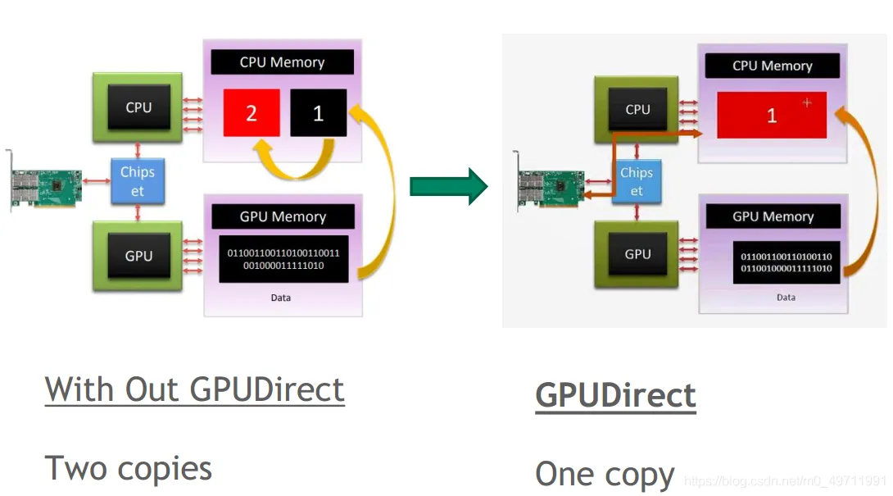{width="5.280856299212599in"
height="2.931117672790901in"}

​从上图对比可以看到，在没有使用GPUDirect情况下，GPU需要将数据从显存复制到GPU驱动在系统内存中pin住的Memory
1，再从Memory 1复制到Memory 2，之后才能再做进一步传输。

使用了GPUDirect Shared
Memory之后，内存空间实现了共享，减少了一次数据复制，降低了数据交换延迟。

**②** 2011年，**GPUDirect P2P（Peer-to-Peer）**，增加了同一PCI
Express总线上的GPU之间的Peer to Peer(P2P) Direct Access和Direct
Transers的支持。

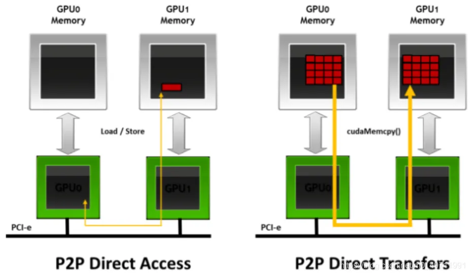{width="5.3933792650918635in"
height="3.162639982502187in"}

​如图所示，在同一PCI
Express总线上，P2P支持GPU之间直接互访显存，不需要将数据复制到系统内存进行中转，进一步降低了数据交换的延迟。

### 2、NVLink {#nvlink .标题3}

虽然PCI
Express总线是单机内部标准化很高的通信协议，但毕竟带宽有限，在多GPU的系统内部，容易成为瓶颈。

NVLink是NVIDIA 2016年推出的一种高速、直接的 GPU 到 GPU
互联技术，避免了数据通过PCI
Express总线传输带来的瓶颈问题。目前已经发展到第三代。

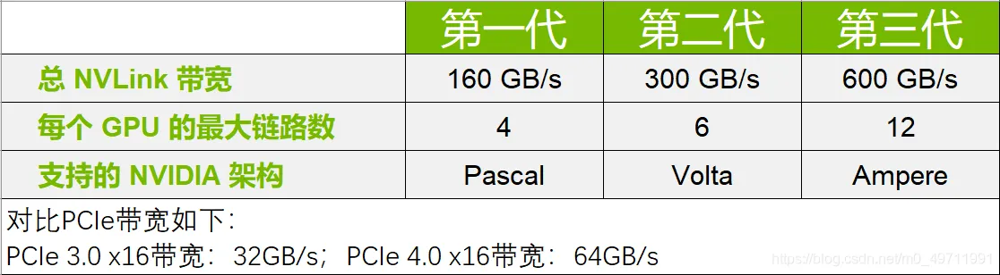{width="5.00453302712161in"
height="1.3811811023622047in"}

结构如下：

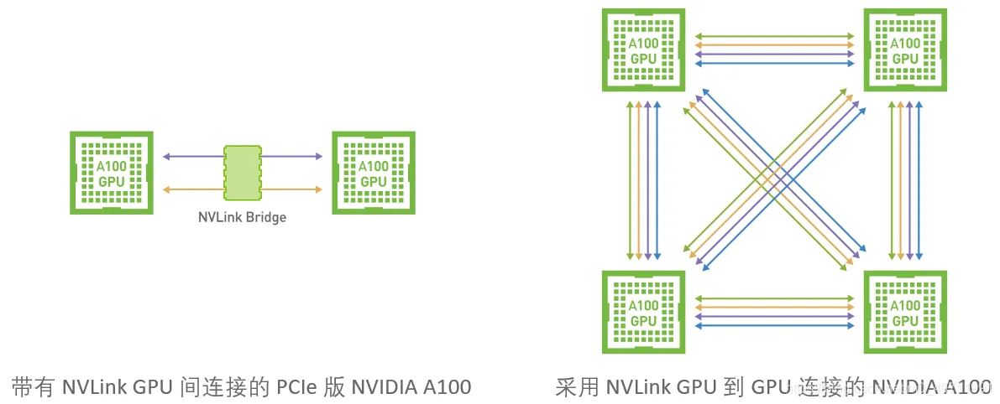{width="5.256675415573054in"
height="2.1273873578302713in"}

### 3、NVSwitch {#nvswitch .标题3}

单服务器中8个GPU卡可以依靠NVLink实现全连接。超过8个之后，就要依靠NVSwitch来实现了。

NVIDIA NVSwitch将多个NVLink整合，在单个节点（如NVIDIA HGX™ A100）内以
NVLink 的较高速度实现多对多的 GPU 通信，从而进一步提高互联性能。NVLink
和 NVSwitch 的结合使 NVIDIA 得以高效地将 AI 性能扩展到多个 GPU，每个 GPU
都有 12 个连接 NVSwitch 的 NVLink 链路，可实现高速的多对多通信。

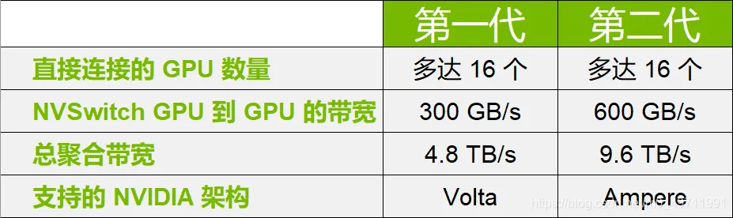{width="4.975694444444445in"
height="1.4814370078740158in"}

结构如下：

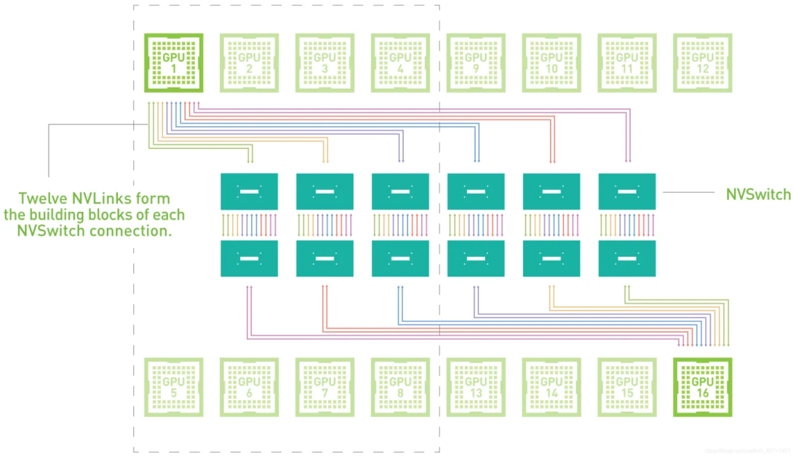{width="4.955600393700787in"
height="2.8529122922134733in"}

为简便起见，该 NVSwitch 拓扑图显示的是两个GPU的连接。8 个或 16 个 GPU
以相同方式通过 NVSwitch 进行多对多连接。

## 二、多机之间GPU的通信

### 1、RDMA网络 {#rdma网络 .标题3}

RDMA网络目前应用比较广泛的是InfiniBand 和RoCE (RDMA over Converged
Ethernet)。

RDMA网络由于采用了硬件网卡直接读取内存数据，无需经过系统内核，因此可以极大降低网络延时、降低CPU开销、提高传输速率。

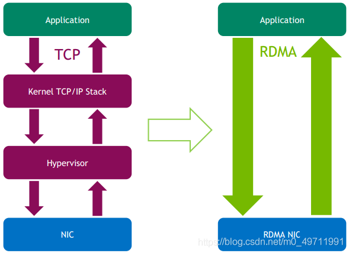{width="3.8583333333333334in"
height="2.8020516185476816in"}

由于RDMA具有的明显优势，在人工智能、高性能计算、大数据分析等高I/O低延迟场景下具有广泛应用。我们来看看它的传输原理：

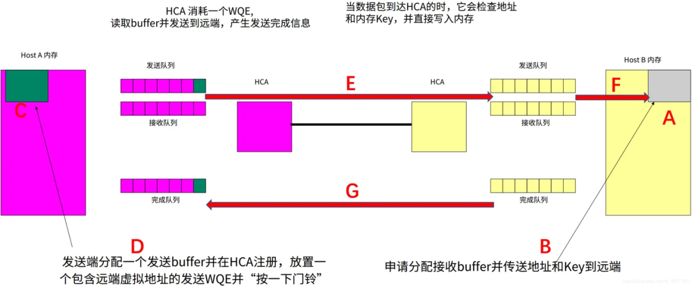{width="5.54180883639545in"
height="2.2936931321084866in"}

A、接收端先准备内存空间（buffer），用来存放将要接收的数据。

B、准备好之后，将空间的地址与生存的密钥Key发送到远端（即发送端）。

C、发送端收到信息后，开始准备要发送的数据，把数据放在内存里，然后把这块内存地址写到HCA卡（RDMA网卡）。

D、发送端HCA卡（RDMA网卡）会生成一个数据结构（WQE），里面包含各种地址、属性等信息。然后把这个WQE放置到发送队列，并按一下门铃（ring
doorbell），代表发送任务下达，

E、发送端HCA卡（RDMA网卡）收到门铃后，主动把WQE里面的地址信息翻译，并启动DMA过程，从C的内存空间获取数据，封装成RDMA协议报文并发送出去。

F、接收端HCA卡（RDMA网卡）收到数据后，在网卡内部进行RDMA协议处理，剥离报头，进行数据完整性校验等。然后启动DMA过程，把数据直接写入A准备好的内存空间中。

G、返回完成信息，结束传输过程。

### 2、GPUDirect {#gpudirect-1 .标题3}

承接上文GPUDirect部分，未讲完。

**③、**2013年，在硬件RDMA支持的基础上，nvidia发布**GPUDirect
RDMA**，增加了RDMA直接访问GPU显存的支持，使得第三方PCI
Express设备（网卡、存储等）可以bypass CPU host
memory直接访问GPU，完美的解决了服务器之间GPU卡通信问题。

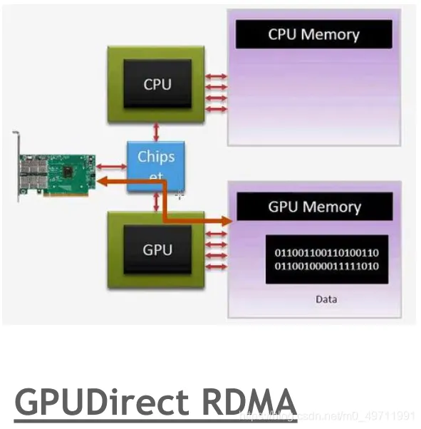{width="3.4808213035870517in"
height="3.5456080489938757in"}

在这个过程中，CPU参与控制路径、传输队列准备、传输前后的控制机制。数据直接从GPU显存向RDMA网卡发送，对端RDMA网卡接收后直接传输到GPU显存。减少了CPU的参与，也减少了数据要搬运/复制的动作，跨机通信延迟大幅降低。

**④、**2017年，**GPUDirect RDMA
Async**，允许GPU和第三方设备之间直接同步，而CPU不参与GPU应用程序的关键通信路径。该技术从CPU层面卸载了控制平面操作，进一步加速GPU网络通信。

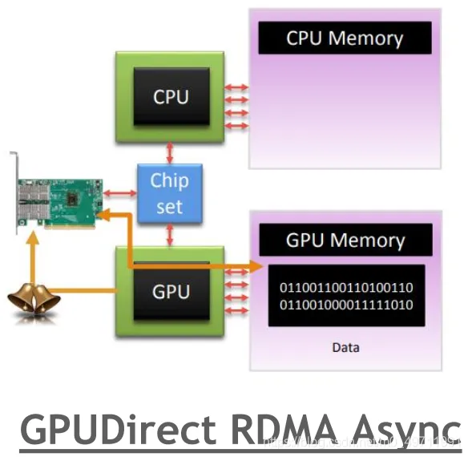{width="3.585310586176728in"
height="3.4993602362204723in"}

比GPUDirect RDMA更进一步，Async方式允许GPU直接触发和轮询以完成排队到
RDMA网卡的通信操作。该方式中CPU仅参与传输队列准备与传输完成后的控制。路径的控制、传输控制流程全部由GPU完成。

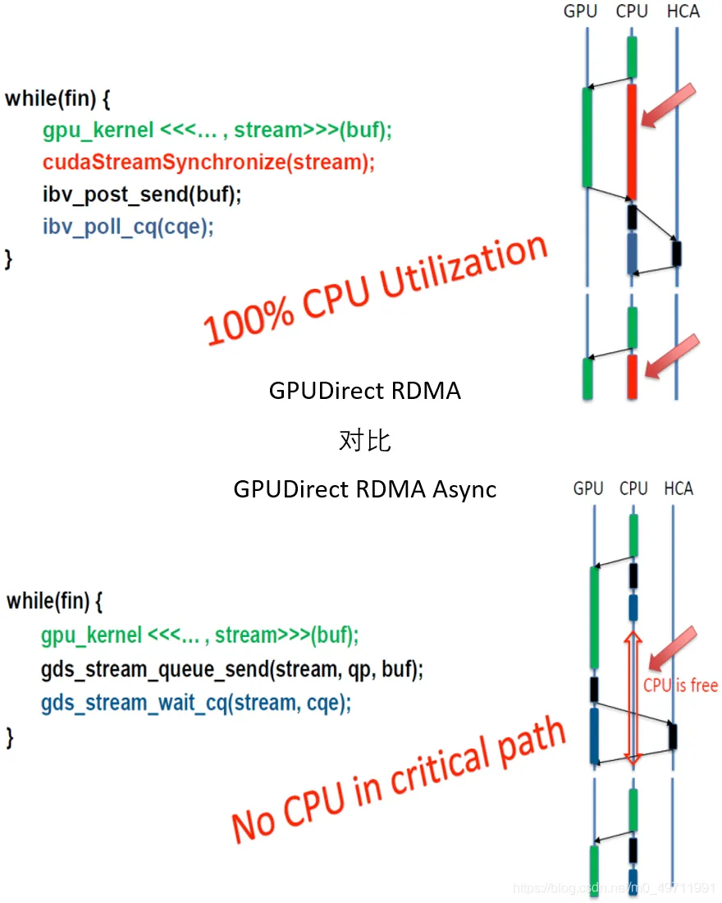{width="4.888888888888889in"
height="5.361111111111111in"}

## 三、GPU与存储系统的通信

### 1、GPUDirect Storage {#gpudirect-storage .标题3}

**⑤、**2019年，**GPUDirect
Storage**，跟上面一系列GPUDirect做法类似，bypass
掉CPU与系统memory，让GPU与存储系统直接通信，节省I/O路径，降低延迟。

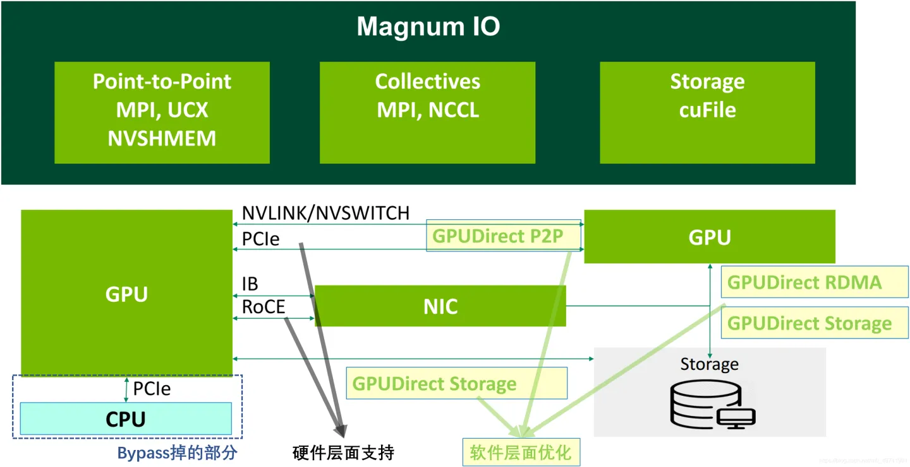{width="5.43329615048119in"
height="2.7958847331583554in"}

为什么连存储的路径也要优化？因为AI的数据集规模在不断扩大，AI应用程序载入数据花费的的时间越来越长，进而影响了应用程序的性能，而且特别是端到端架构，会因为缓慢的I/O使得运算速度日益提升的GPU无用武之地。所以NVIDIA将原本的数据从存储系统传输到系统內存中的Bounce
Buffer（也就是额外的数据拷贝）进行优化，以减少额外的数据副本，降低传输开销。

## 四、总结

上面我们提到的所有关键技术点可以用下面这个图来做个汇总。

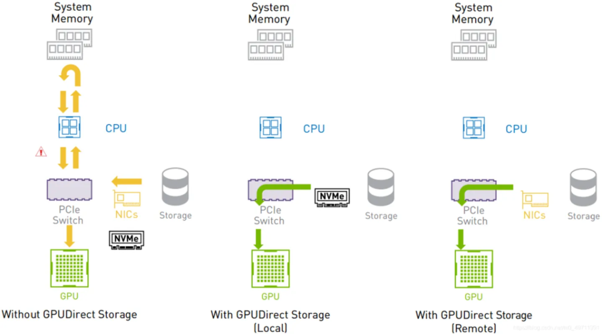{width="5.2053619860017495in"
height="2.8918678915135607in"}

首先，要实现高速通信，需要有**硬件层面的支持**，包括：单机内部的PCIe、NVlink、NVSwitch；多机之间的RDMA网络（IB或RoCE）。

其次，要有**软件堆栈的优化**，包括GPUDirect的一系列技术：P2P（Peer-to-Peer）、RDMA、Async、Storage等。

所有这些软件，都集成在**NVIDIA Magnum IO**中。Magnum
IO是专门面向多GPU、多节点网络和存储性能优化的一个软件堆栈，它包括了点对点通信、集合通信、存储通信等经过优化的通信库。Magnum
IO基本覆盖了GPU通信的方方面面，可以充分应用各类NVIDIA支持的GPU和网络硬件来实现最优吞吐量和低延迟。

优势体现：

①、优化IO：绕过CPU，在GPU 显存、网络和存储中直接实现 IO。

②、优化系统：减少CPU使用率，使CPU与GPU各司其职，构建更平衡的异构计算加速系统。

③、无缝整合：全面优化包括延迟敏感型、带宽敏感型、混合型通信在内的各种网络通信需求。
