# DGX-1

DGX 工作站是唯一一款配备四块 NVIDIA® Tesla® V100 Tensor Core GPU
的工作站，它集成全连接的四路 NVLink™ 架构，可提供 500 teraFLOPS 的 AI
性能（与数百台服务器的性能相当），能够提高您整个团队的实验速度、迭代次数，轻松获得工作成果。

# DGX-2为什么被称为全球最大GPU

2018年，NVIDIA首席执行官黄仁勋发布了NVIDIA®
DGX-2™服务器，并称其为"全球最大GPU"。DGX-2在单一系统中包含了16个NVIDIA
Tesla™ V100 32 GB GPU和其他顶级组件（两个24核Xeon CPU、1.5 TB DDR4
DRAM内存和30 TB NVMe存储），通过基于NVSwitch的NVLink结构连接，可提供2
petaFLOPS的性能，堪称最强大的超级计算机之一。

{width="4.092644356955381in"
height="2.3201213910761154in"}

NVSwitch使DGX-2成为了最大的GPU，这意味着其总体并非各部分的简单加成。事实证明，让DGX-2服务器能够称得上"全球最大GPU"的，正是其中看似最不起眼的部分。让我们来看看创新NVIDIA
NVSwitch™芯片及其他工程特性如何使DGX-2成为了全球最大的GPU。

注：本文中的信息来自于Alex Ishii 和 Denis Foley 在Hot Chip
2018大会上的专题演示"NVSwitch and DGX‑2 -- NVIDIA NVLink-Switching Chip
and Scale-Up GPU-Compute Server"。

## 单一GPU

让我们先看看单一多核GPU如何与CPU交互，如图1所示。程序员通过NVIDIA
CUDA®技术明确地展现了并行工作。工作流经PCIe I /
O端口进入GPU，其中数据由GPU驱动程序分发到可用的图形处理群集（GPC）和流式多处理器（SM）内核。XBAR的采用让GPU
/ SM内核能够在L2高速缓存和高带宽GPU内存（HBM2）上交换数据。

GPC和GPU内存之间的高带宽可实现大规模计算能力和快速同步，但规模受限，因其要求数据必须适合本地GPU内存，才能有效使用XBAR提供的高带宽。

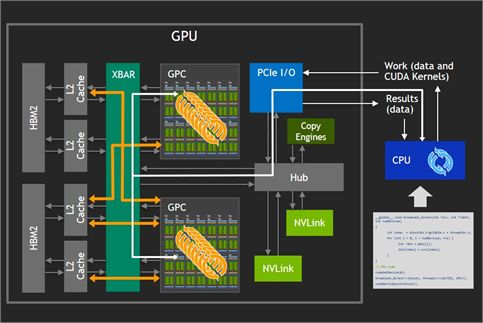{width="4.228765310586176in"
height="2.830459317585302in"}

图1. 连接到CPU的单一GPU

## 双GPU（PCIe和NVLink）

图2显示了添加另一个GPU是如何增加可用GPU内存量的。在所示配置中，GPU只能以PCIe提供的32
GBps的最大双向带宽，访问其他GPU上的内存。此外，这些交互会与总线上的CPU操作竞争，甚至进一步占用可用带宽。

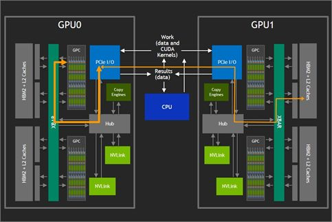{width="4.183326771653543in"
height="2.8000459317585302in"}

图2. 通过PCIe总线连接的双GPU

NVIDIA
NVLink™技术使GPC无需通过PCIe总线即可访问远程GPU内存，如图3所示。NVLinks实现了XBAR之间的有效桥接。V100
GPU上最多可采用六个NVLink，GPU之间的双向带宽可达300
GBps。但是，在具有两个以上GPU的系统中，六个可用的NVLink必须先分成较小的链接组，每个组专用于访问不同的特定单一GPU。这就限制了可使用直接连接来构建的机器规模，并降低了每对GPU之间的带宽。

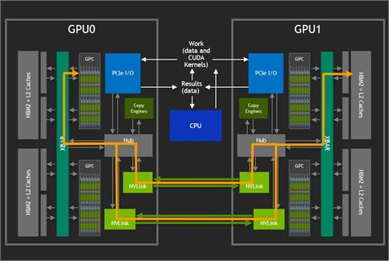{width="5.031944444444444in"
height="3.3756944444444446in"}

图3. 通过NVLink技术连接的双GPU

Super Crossbar将GPU连接在一起

理想的情况是提供某种交叉，让更多GPU能够访问所有GPU内存，所有GPU都可能在单一GPU驱动程序实例的控制下，如图4所示。有了这样的交叉，可在没有其他进程干预的情况对GPU内存进行访问，且可用带宽将足够高，可提供类似于上文所述的双GPU情况下的性能扩展。

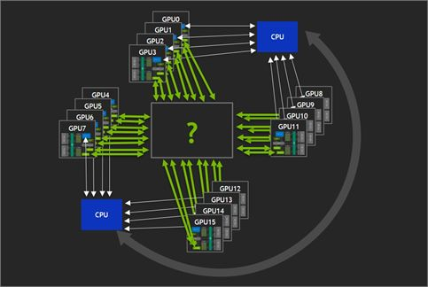{width="4.176562773403324in"
height="2.8018602362204725in"}

图4. 寻找交叉开关设备

最终目标是提供以下所有内容：

更大的问题规模容量。大小受整个GPU集合的GPU内存容量限制，而非单一GPU容量。

强大的可扩展性。与现有解决方案相比，NUMA效应将大大降低。总内存带宽实际上会随GPU数量而增长。

使用便利。针对较少数量的GPU编写的应用程序将更易于移植。此外，丰富的资源可助力快速开展实验。

以上16-GPU配置（假设有32GB V100
GPU）产生的总容量使其能够前所未有地运行"一个超强GPU"的计算。

## NVIDIA NVSwitch介绍

NVSwitch（图5）是一款GPU桥接设备，可提供所需的NVLink交叉网络。端口逻辑模块中的数据包转换使得进出多GPU的流量看似是通过单一GPU的。

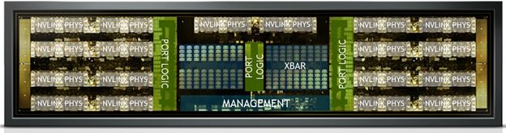{width="5.6117147856517935in"
height="1.470333552055993in"}

图5. 带有标注的NVSwitch芯片裸片

NVSwitch芯片并行运行，以支持数量日益增加的GPU之间的互连。可使用三个NVSwitch芯片构建一个8
GPU封闭系统。两条NVLink路径将每个GPU连接至每台交换机，流量在所有NVLink和NVSwitch之间交叉。GPU使用任意对之间的300
GBps双向带宽成对通信，因为NVSwitch芯片提供了从任何源到任何目的地的唯一路径。

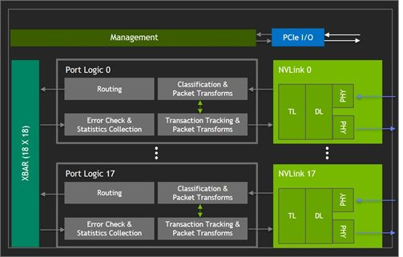{width="4.725009842519685in"
height="3.0149639107611548in"}

图6. NVSwitch框图

## 实现了对分带宽

让每个GPU从另一个GPU读取数据，而不会有两个GPU从同一远程GPU读取数据，就实现了无干扰的成对通信能力。使用16个GPU实现的1.98
TBps读取带宽与128B传输在理论上80％的双向NVLink效率相匹配。

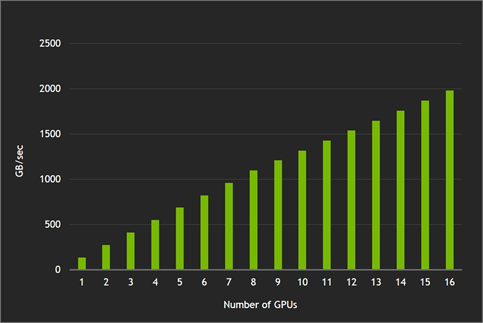{width="4.140975503062117in"
height="2.771699475065617in"}

图7. 实现的对分带宽结果

## 使用cuFFT（16K X 16K）

实现更强大的可扩展性

通过在越来越多的GPU上（更高的GFLOPS，相应的总运行时间却更短）、以及搭载V100
GPU的NVIDIA DGX-1服务器上运行"iso-problem
instance"计算进行对比，即能证明其强大的可扩展性能，如图8所示。如果没有NVSwitch网络提供的NVLink交叉，由于问题分散在更多GPU上，传输数据所需的时间要长于在本地对相同数据进行简单计算所需的时间。

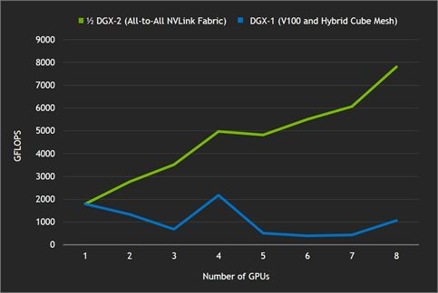{width="4.5168241469816275in"
height="3.0301246719160106in"}

图8. 使用NVLink与Hybrid Cube Mesh的cuFFT结果

## 全归约基准测试

图9也体现了NVLink交叉的优势。全归约基准测试是对机器学习应用程序中采用的重要通信原语进行的测量。与两台配备八个GPU的服务器（通过InfiniBand连接）相比，NVLink交叉让16
GPU DGX-2服务器能够提供更高带宽和更低延迟。
针对较小的信息，NVLink网络的效率明显优于InfiniBand。

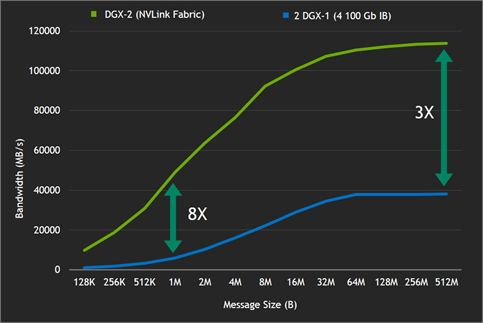{width="4.540768810148731in"
height="3.0392946194225723in"}

图9. 全归约基准测试结果显示NVLink与InfiniBand带宽效率的显著差异

## HPC和AI训练基准测试的加速

图10所示，与总GPU数相同的两台DGX-1（采用V100）服务器相比，HPC和AI训练基准测试性能得以提升，速度达到了其2到2.7倍。对比所用的DGX-1服务器各采用了8个Tesla
V100 32 GB GPU和双槽Xeon E5 2698v4处理器。服务器通过四个EDR IB /
GbE端口连接。

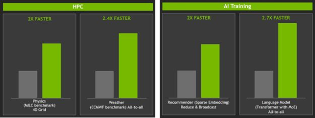{width="5.676543088363955in"
height="2.127265966754156in"}

图10. HPC和AI训练基准测试的加速

## 总结

正因有了NVSwitch芯片，DGX-2才可谓全球最大GPU。NVSwitch是一种畅通无阻的设备，具有18个NVLink端口，每端口51.5
GBps，聚合双向带宽达928 GBps。采用了NVSwitch芯片的DGX-2可提供512
GB的总容量，针对特定应用的性能表现超过InfiniBand连接的一对DGX-1服务器的两倍。

# DGX-A100

2020年发布

IT之家5月14日消息
根据外媒TechPowerUp的报道，英伟达推出了DGX-A100超级计算机，内置两个AMD
64核霄龙处理器和八个刚刚发布的A100
计算卡，售价19.9万美元，约合人民币140万元。

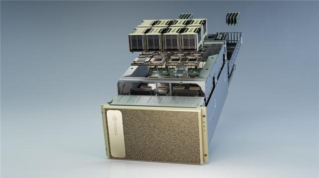{width="4.8631583552055995in"
height="2.720450568678915in"}

IT之家了解到，英伟达DGX-A100超级计算机搭载了AMD第二代EPYC"Rome"企业级处理器，两个AMD
EPYC 7742加起来总计128核/256线程，最高可达3.40 GHz boost。

2个霄龙处理器通过PCIe gen 4.0连接到8个英伟达A100 GPU和8端口Mellanox
ConnectX 200 Gbps NIC上，六个nvswitch提供NVLink连接。该系统搭载了1
TB的十六通道DDR4内存，两个1.92 TB NVMe gen 4.0 SSD，以及15 TB U.2 NVMe
SSD 。8个A100计算卡的GPU显存加起来有320 GB，搭载Ubuntu Linux系统。
