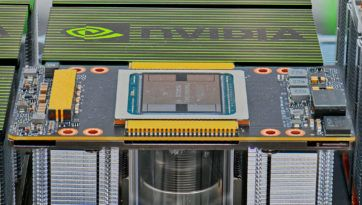

<https://catalog.ngc.nvidia.com/orgs/nvidia/teams/magnum-io/containers/magnum-io>

<https://developer.nvidia.cn/zh-cn/magnum-io>

# NVIDIA Magnum IO Developer Environment

NVIDIA Magnum IO is the collection of I/O technologies from NVIDIA and
Mellanox that make up the I/O subsystem of the modern data center, and
enable applications at scale. Making use of GPUS, or scaling an
application up to multiple GPUs, or scaling it out across multiple
nodes, will probably make use of the libraries in Magnum IO.

The Magnum IO Developer Environment container contains a comprehensive
set of tools to scale I/O. It serves two primary purposes 1) Allow
developers to begin scaling applications on a laptop, desktop,
workstation, or in the cloud. 2) Serve as the basis for a build
container locally or in a CI/CD system.

## Quick Links:

1.  [[Magnum IO Container on
    NGC]{.underline}](https://ngc.nvidia.com/catalog/containers/nvidia:magnum-io:magnum-io)

2.  [[Magnum IO Code
    repo]{.underline}](https://github.com/NVIDIA/MagnumIO)

3.  [[Report
    issues]{.underline}](https://github.com/NVIDIA/MagnumIO/issues)

## Quick Start

There are two ways to get the container and run it. With either option
the system must be setup to run GPU enabled containers, which
the installer.sh script can do.

Recommended is to pull the NVIDIA NGC Catalog (option 1). If you plan to
customize the container further, it can be used as the FROM to build a
new container. Also supported is building the container locally (option
2).

For usage and command documentation: ./installer.sh help

OPTION 1: PULL CONTAINER FROM NVIDIA NGC CATALOG:

1.  Setup system

\# Clone repo

git clone https://github.com/NVIDIA/MagnumIO.git

cd magnumio/dev-env

\# Setup system (driver, CUDA, Docker)

./installer.sh setup-system

2.  Visit [[https://ngc.nvidia.com/catalog/containers/nvidia:magnum-io:magnum-io]{.underline}](https://ngc.nvidia.com/catalog/containers/nvidia:magnum-io:magnum-io) and
    find the latest version.

3.  Pull

docker pull nvcr.io/nvidia/magnum-io/magnum-io:TAG

4.  Run

docker run \--gpus all \--rm -it \\

\--user \"\$(id -u):\$(id -g)\" \\

\--volume \$HOME:\$HOME \\

\--volume /run/udev:/run/udev:ro \\

\--workdir \$HOME \\

magnum-io:TAG

OPTION 2: BUILD THE CONTAINER LOCALLY:

\# Clone repo

git clone https://github.com/NVIDIA/MagnumIO.git

cd magnumio/dev-env

\# Setup system (driver, CUDA, Docker)

./installer.sh setup-system

\# Build the container

./installer.sh build-container

#Run the container with HOME directory mounted

./installer.sh run-container

UPGRADING

The installer.sh script is designed to detect old versions of
dependencies and upgrade them as needed. Simply git pull a new version,
and run the system-setup again.

git pull

./installer.sh setup-system

**Minimum Hardware and Software**

The container should run and build code on any system with a GPU and
minimal drivers enforced by the installer.sh script. This allows
developers to integrate Magnum IO APIs easily, and get started on almost
any system.

However some components of Magnum IO require specific hardware or
configurations to run applications with the APIs fully enabled.

For example GDS requires the latest Tesla, Volta or Ampere GPUs, ext4
mounting options, and GDS enabled storage systems (an NVMe drive at
minimum). More on GDS setup in the [[NVIDIA GPUDirect Storage
Installation and Troubleshooting
Guide]{.underline}](https://docs.nvidia.com/gpudirect-storage/troubleshooting-guide/index.html)

In practice, this means almost all development can be done on a local
system, many tests can be run locally, but tests at scale are done in a
cluster or cloud environment.

**Magnum IO Components**

**NCCL**

The [[NVIDIA Collective Communications
Library]{.underline}](https://developer.nvidia.com/nccl) (NCCL,
pronounced "nickel") is a library providing inter-GPU communication
primitives that are topology-aware and can be easily integrated into
applications.

NCCL is smart about I/O on systems with complex topology: systems with
multiple CPUs, GPUs, PCI busses, and network interfaces. It can
selectively use NVLink, Ethernet, and InfiniBand, using multiple links
when possible. Consider using NCCL APIs whenever you plan your
application or library to run on a mix of multi-GPU multi-node systems
in a data center, cloud, or hybrid system. At runtime, NCCL determines
the topology and optimizes layout and communication methods.

**NVSHMEM**

[[NVSHMEM]{.underline}](https://developer.nvidia.com/nvshmem) creates a
global address space for data that spans the memory of multiple GPUs and
can be accessed with fine-grained GPU-initiated operations,
CPU-initiated operations, and operations on CUDA streams.

In many HPC workflows, models and simulations are run that far exceed
the size of a single GPU or node. NVSHMEM allows for a simpler
asynchronous communication model in a shared address space that spans
GPUs within or across nodes, with lower overheads, possibly resulting in
stronger scaling compared to a traditional Message Passing Interface
(MPI).

**UCX**

[[Unified Communication
X]{.underline}](https://www.openucx.org/documentation/) (UCX) uses
high-speed networks, including InfiniBand, for inter-node communication
and shared memory mechanisms for efficient intra-node communication. If
you need a standard CPU-driven MPI, PGAS OpenSHMEM libraries, and RPC,
GPU-aware communication is layered on top of UCX.

UCX is appropriate when driving I/O from the CPU, or when system memory
is being shared. UCX enables offloading the I/O operations to both host
adapter (HCA) and switch, which reduces CPU load. UCX simplifies the
portability of many peer-to-peer operations in MPI systems.

**GDS**

[[NVIDIA GPUDirect
Storage]{.underline}](https://developer.nvidia.com/gpudirect-storage) (GDS)
enables a direct data path for Remote Direct Memory Access (RDMA)
transfers between GPU memory and storage, which avoids a bounce buffer
and management by the CPU. This direct path increases system bandwidth
and decreases the latency and utilization load on the CPU.

GDS and the cuFile APIs should be used whenever data needs to move
directly between storage and the GPU. With storage systems that support
GDS, significant increases in performance on clients are observed when
I/O is a bottleneck. In cases where the storage system does not support
GDS, I/O transparently falls back to normal file reads and writes.

Moving the I/O decode/encode from the CPU to GPU creates new
opportunities for direct data transfers between storage and GPU memory
which can benefit from GDS performance. An increasing number of data
formats are supported in CUDA.

**NSIGHT**

[[NVIDIA Nsight
Systems]{.underline}](https://developer.nvidia.com/nsight-systems) lets
you see what's happening in the system and [[NVIDIA Cumulus
NetQ]{.underline}](https://cumulusnetworks.com/products/netq/) allows
you to analyze what's happening on the NICs and switches. Both are
critical to finding some causes of bottlenecks in multi-node
applications.

Nsight Systems is a low-overhead performance analysis tool designed to
provide insights that you need to optimize your software. It provides
everything that you would expect from a profiler for a GPU. Nsight
Systems has a tight integration with many core CUDA libraries, giving
you detailed information on what is happening.

Nsight Systems allows you to see exactly what's happening on the system,
what code is taking a long time, and when algorithms are waiting on
GPU/CPU compute, or device I/O. Nsight Systems is relevant to Magnum IO
and included in the Magnum IO container for convenience, but its scope
spans well outside of Magnum IO to monitoring compute that's unrelated
to I/O.

**NETQ (NOT IN CONTAINER)**

NetQ is a highly scalable, modern, network operations tool set that
provides visibility, troubleshooting and lifecycle management of your
open networks in real time. It enables network profiling functionality
that can be used along with Nsight Systems or application logs to
observe the network's behavior while the application is running.

NetQ is part of Magnum IO given its integral involvement in managing IO
in addition to profiling it, but is not inside the container as it runs
on the nodes and switches of the network.

**Operating System Setup**

Disable \"Secure Boot\" in the system BIOS/UEFI before installing Linux.

**UBUNTU**

The Data Science stacks are supported on Ubuntu LTS 18.04.1+ or 20.04
with the 4.15+ kernel. Ubuntu can be downloaded
from [[https://www.ubuntu.com/download/desktop]{.underline}](https://www.ubuntu.com/download/desktop)

Support for Red Hat is planned in later releases.

**Installing the NVIDIA GPU Driver**

It is important that updated NVIDIA drivers are installed on the system.
The minimum version of the NVIDIA driver supported is 460.39. More
recent drivers may be available, and should work correctly.

**UBUNTU OR RHEL V8.X DRIVER INSTALL**

Driver install for Ubuntu is handled by ./installer.sh setup-system so
no manual install should be required.

If the driver if too old or the script is having problems, the driver
can be removed (this may have side effects, read the warnings) and
reinstalled:

./installer.sh purge-driver

\# reboot

./installer.sh setup-system

\# reboot

**License**

The NVIDIA Magnum IO Developer Environment is licensed under [[Apache
2.0]{.underline}](https://www.apache.org/licenses/LICENSE-2.0) and
contributions are accepted with a DCO. See
the [[CONTRIBUTING.md]{.underline}](https://github.com/NVIDIA/MagnumIO/blob/main/CONTRIBUTING.md) for
more information on how to contribute and the release artifacts.

Since the underlying images may include components licensed under
open-source licenses such as GPL, the sources for these components are
archived on the CUDA open
source [[index]{.underline}](https://developer.download.nvidia.com/compute/cuda/opensource/).
Source and licenses details are also available on the component
websites.

**More Information**

-   [NVIDIA Magnum IO](https://developer.nvidia.com/magnum-io)

-   [Blog: Optimizing Data Movement in GPU Applications with the NVIDIA
    Magnum IO Developer
    Environment](https://developer.nvidia.com/blog/optimizing-data-movement-in-gpu-apps-with-magnum-io-developer-environment/)

# NVIDIA MAGNUM IO SDK

## 适用于现代 GPU 加速型数据中心的 IO 子系统

借助 NVIDIA MAGNUM IO™ 软件开发套件 (SDK)，开发者能够消除 AI、高性能计算
(HPC)、数据科学和可视化应用中的输入/输出 (IO)
瓶颈，从而缩短工作流中的端到端时间。Magnum IO
涵盖虚拟化、容器化和裸机环境中 CPU、GPU、DPU
和存储子系统之间的数据搬运的各个方面。

## Magnum IO 近期动态

### 云原生超级计算 Magnum IO 架构 {#云原生超级计算-magnum-io-架构 .标题3}

Magnum IO 是数据中心的 IO
子系统，它引入了新的增强功能来加速多租户数据中心的 IO
和通信，称为云原生超级计算 Magnum IO 技术。

[**[了解详情 ]{.underline}**](https://developer.nvidia.cn/blog/accelerating-cloud-native-supercomputing-with-magnum-io/)

{width="4.130903324584427in"
height="2.3240430883639545in"}

### 立体视频有赖于 Magnum IO 和 Verizon 5G 技术 {#立体视频有赖于-magnum-io-和-verizon-5g-技术 .标题3}

运行在 InfiniBand 网络上的 Magnum IO GPUDirect 助力实现 Verizon
的突破性分布式立体视频架构。通过将其技术应用到位于美国各地的体育中心和
Verizon 设施的边缘计算中心，他们能够为媒体带来 3D
体验，可将您置身其中，为您提供全新的体验方式。

[**[观看视频 ]{.underline}**](https://www.youtube.com/watch?v=YF1dsFjMkdw)

## Magnum IO 生态系统

Magnum IO 栈包含开发者在整个栈中创建和优化应用 IO 所需的库：跨 NVIDIA®
NVLink®、以太网和 InfiniBand 的网络建设。本地和远程直接存储
API，执行网络计算以加速多节点运算，以及对网络硬件进行 IO 管理。

## 灵活抽象

Magnum IO 使 AI、数据分析、可视化和 HPC
开发者能够革新和加速使用常见的高级抽象和 API 构建的应用。

## 通过架构设计实现规模化

Magnum IO 技术支持通过 NVLink 和 PCIe 将计算纵向扩展到多个
GPU，以及在数据中心规模的 InfiniBand
和以太网上的多个节点中纵向扩展计算。

## 高级 IO 管理

通过 NVIDIA NetQ™ 和 NVIDIA UFM®
构建的高级遥测和监控功能可帮助用户配置和调优互连基础设施并进行故障排除，以实现峰值性能。

# Magnum IO 组件

## 网络 IO

-   [**[GPUDirect®
    > RDMA]{.underline}**](https://developer.nvidia.cn/gpudirect)

-   [**[MOFED]{.underline}**](https://www.mellanox.com/products/infiniband-drivers/linux/mlnx_ofed)

-   [**[NCCL]{.underline}**](https://developer.nvidia.cn/nccl)

-   [**[NVIDIA ASAP^2^ --
    > 加速交换和数据包处理®]{.underline}**](https://www.nvidia.cn/networking/products/ethernet/)

-   [**[NVIDIA
    > HPC-X®]{.underline}**](https://developer.nvidia.cn/networking/hpc-x)

-   [**[NVSHMEM]{.underline}**](https://developer.nvidia.cn/nvshmem)

## **存储 IO**

-   [**[GPUDirect
    > Storage]{.underline}**](https://developer.nvidia.cn/gpudirect-storage)

-   SNAP

## 网络计算

-   硬件标签匹配

-   [**[NVIDIA SHARP™
    > 技术]{.underline}**](https://docs.mellanox.com/display/SHARPv200/Introduction)

## IO 管理

-   [**[NVIDIA
    > NetQ]{.underline}**](https://developer.nvidia.cn/zh-cn/nvidia.com/en-us/networking/ethernet-switching/netq/)、[**[WJH（故障快照）]{.underline}**](https://www.mellanox.com/products/what-just-happened)

-   [**[NVIDIA
    > UFM]{.underline}**](https://www.nvidia.cn/networking/infiniband/ufm/)

# 加速各种应用中的 IO

## 深度学习

Magnum IO 网络可提供类似于发送和接收的点对点功能以及类似于 AllReduce
的集合，用于大规模深度学习训练。集合 API
隐藏了拓扑检测、对等复制和多线程等低级别优化，以简化深度学习训练。通过发送/接收，用户可以加速一个
GPU 的显存无法容纳的大型深度学习模型。GPUDirect Storage 还可以绕过 CPU
主机上的反弹缓冲区，帮助缓解本地或远程存储的 IO 瓶颈。

## 高性能计算

为点燃新一代发现的火花，科学家们希望通过模拟，更好地理解复杂分子结构以支持药物发现，理解物理现象以寻找新能源，理解大气数据以更好地预测极端天气状况。Magnum
IO 提供硬件级加速引擎和智能卸载（例如 RDMA、GPUDirect 和 NVIDIA
SHARP），同时支持 400Gb/s 高带宽和 NVIDIA Quantum 2 InfiniBand
网络超低延迟。

使用多租户时，各用户应用可能并不知晓相邻应用流量不加选择的干扰。Magnum
IO 基于新一代的 NVIDIA Quantum-2 InfiniBand
平台，带来新的改进功能，可以减轻流量干扰对用户性能的负面影响。这样可以达到理想结果，并在各种规模下实现更高效的高性能计算
(HPC) 和机器学习部署。

## 数据分析

数据科学和机器学习是计算能力需求巨大的领域。预测性机器学习模型的准确性即便提升微小，也能带来数十亿美元的价值。为提升准确性，适用于
Apache Spark 库的 RAPIDS™ 加速器基于 NVIDIA UCX®
构建了内置的置乱，可利用 GPU 对 GPU 的通信和 RDMA 功能。通过与 NVIDIA
网络、Magnum IO、GPU 加速的 Spark 3.0 和 RAPIDS 相结合，NVIDIA
数据中心平台能够以超凡的性能和效率水平加速这些大型工作负载。

# 相关资源

-   [**[Magnum IO
    > 开发者环境文档]{.underline}**](https://github.com/NVIDIA/MagnumIO/blob/main/dev-env/README.md)

-   [**[GPUDirect Storage：存储和 GPU
    > 显存之间的直接路径]{.underline}**](https://developer.nvidia.cn/blog/gpudirect-storage/)

-   [**[加速现代数据中心内的 IO：网络
    > IO]{.underline}**](https://developer.nvidia.cn/blog/accelerating-io-in-the-modern-data-center-network-io/)

-   [**[使用 NCCL 加速 NVSHMEM 2.0 基于 Team
    > 的集合通信]{.underline}**](https://developer.nvidia.cn/blog/accelerating-nvshmem-2-0-team-based-collectives-using-nccl/)

-   [**[使用 NVIDIA Magnum IO 开发者环境优化 GPU
    > 应用中的数据搬运]{.underline}**](https://developer.nvidia.cn/blog/optimizing-data-movement-in-gpu-apps-with-magnum-io-developer-environment/)

-   [访问
    > MOFED](https://www.mellanox.com/products/infiniband-drivers/linux/mlnx_ofed)
