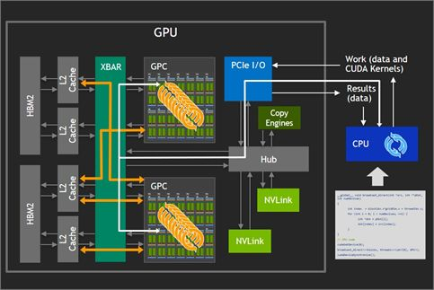

# Wilkes集群

90个节点，每个节点安装4个Tesla P100显卡，12核Intel CPU（主频2.2 Ghz）

[Wilkes2](https://www.hpc.cam.ac.uk/systems/wilkes-2) is the largest
graphics processing unit (GPU) enabled supercomputer for academic
research in the UK. It is comprised of [90 nodes each with 4 Nvidia P100
GPUs.]{.mark} It supports the University\'s research community with
GPU-accelerated high performance computing. Users with applications that
require GPU computing are welcome to apply for accounts.

## System Features

-   Nationally available infrastructure for GPU compute via EPSRC and
    Industry.

-   90 nodes based on the Dell PowerEdge C4130.

## Each node contains

-   1 x Intel Xeon E5-2650 v4 2.2GHz 12-core processor

-   96GB Random Access Memory(内存)

-   Single Rail Mellanox EDR Switch (100GB/s)

-   4 x Nvidia Tesla P100 GPU 16GB. US\$2,799.00

-   Theoretical node peak (CPU+GPU): 19.61 TFlops/s

-   Connects to the 5PB/s LustreFS shared with
    [Peta4](https://www.hpc.cam.ac.uk/systems/peta-4).

## Additional Information

The Wilkes2 platform has been co-designed with [DELL
EMC](https://www.delltechnologies.com/en-gb/index.htm),
[Intel](https://www.intel.co.uk/content/www/uk/en/homepage.html), and
[NVIDIA](https://www.nvidia.com/en-gb/).

A non-exhaustive list of research areas expected to particularly benefit
from Wilkes2 includes:

-   Turbulence simulations (relevant to the aeronautical industry).

-   Combustion simulations (relevant to the automotive industry).

-   Analysis of large data sets from the Internet of Things (relevant to
    smart cities research).

-   Materials modeling research.

-   [Medical applications, in]{.mark}cluding:

1.  Analysis of large medical image data sets. 大规模医学图像数据分析

2.  Population-scale gene variant analysis. 基因编译分析

3.  Real-time medical analytics for use in hospital decision support
    systems.

# 济南超算中心硬件资源

{width="4.562863079615048in"
height="3.4740179352580927in"}

{width="3.4814162292213475in"
height="3.5118580489938758in"}

# 神威·太湖之光超级计算机

**神威·太湖之光**超级计算机（Sunway
TaihuLight）是由[国家并行计算机工程技术研究中心](https://baike.baidu.com/item/%E5%9B%BD%E5%AE%B6%E5%B9%B6%E8%A1%8C%E8%AE%A1%E7%AE%97%E6%9C%BA%E5%B7%A5%E7%A8%8B%E6%8A%80%E6%9C%AF%E7%A0%94%E7%A9%B6%E4%B8%AD%E5%BF%83/2957684)研制、安装在国家超级计算无锡中心的[超级计算机](https://baike.baidu.com/item/%E8%B6%85%E7%BA%A7%E8%AE%A1%E7%AE%97%E6%9C%BA/5373711)。

**神威·太湖之光**超级计算机安装了40960个[中国](https://baike.baidu.com/item/%E4%B8%AD%E5%9B%BD/22516505)自主研发的"[申威26010](https://baike.baidu.com/item/%E7%94%B3%E5%A8%8126010/19756733)"众核处理器，该众核处理器采用64位自主申威[指令系统](https://baike.baidu.com/item/%E6%8C%87%E4%BB%A4%E7%B3%BB%E7%BB%9F/3220297)，[峰值](https://baike.baidu.com/item/%E5%B3%B0%E5%80%BC/11008657)性能为12.54京次/秒，持续性能为9.3京次/秒。（1京为1亿亿）

2020年7月，中国科大在"神威·太湖之光"上首次实现千万核心并行第一性原理计算模拟。

## 性能

理论浮点数运算性能为125,435.9[TFlops](https://zh.wikipedia.org/wiki/FLOPS)，而LINPACK测试中的实际性能为93,014.6
[TFlops](https://zh.wikipedia.org/wiki/FLOPS)，有74%的效率，相比天河二号（62%）以及排名第三的泰坦（65.8%）都要高。本机组的图形性能也较为突出，在Graph500排名中位列亚军。[^\[15\]^](https://zh.wikipedia.org/wiki/%E7%A5%9E%E5%A8%81%C2%B7%E5%A4%AA%E6%B9%96%E4%B9%8B%E5%85%89#cite_note-expreview2-15)不过遇上存储器访问较为频繁的运算处理操作、整数数值较多的运算，存储器访问的樽颈效应就开始显现了。

相较[天河二号](https://zh.wikipedia.org/wiki/%E5%A4%A9%E6%B2%B3%E4%BA%8C%E5%8F%B7)系统功耗达17.8百万瓦（开启散热系统全速运转时则高达24百万瓦），神威·太湖之光仅使用15.3百万瓦，且每瓦性能达到
6 GFLOPS/W，截至2017年11月为止，在Green 500能效比排名中排名第20位。

## 应用

[[清华大学地球系统科学研究中心]{.underline}](https://zh.wikipedia.org/wiki/%E6%B8%85%E5%8D%8E%E5%A4%A7%E5%AD%A6%E5%9C%B0%E7%90%83%E7%B3%BB%E7%BB%9F%E7%A7%91%E5%AD%A6%E7%A0%94%E7%A9%B6%E4%B8%AD%E5%BF%83)与[计算机系](https://zh.wikipedia.org/wiki/%E6%B8%85%E5%8D%8E%E5%A4%A7%E5%AD%A6%E8%AE%A1%E7%AE%97%E6%9C%BA%E7%B3%BB)合作，利用"神威·太湖之光"首次实现了百万核规模、高[分辨率](https://zh.wikipedia.org/wiki/%E5%88%86%E8%BE%A8%E7%8E%87)的地球系统数值模拟。此前，[中国大陆](https://zh.wikipedia.org/wiki/%E4%B8%AD%E5%9C%8B%E5%A4%A7%E9%99%B8)的地球模拟系统模式只能达到200公里网格规模的分辨率，但现在已可开展25公里网格分辨率的地球系统模拟工作，在[海洋](https://zh.wikipedia.org/wiki/%E6%B5%B7%E6%B4%8B)上可达到10公里分辨率。

目前，三十多家用户单位在[天气气候](https://zh.wikipedia.org/wiki/%E6%B0%A3%E8%B1%A1%E5%AD%B8)、[航空航天](https://zh.wikipedia.org/wiki/%E8%88%AA%E7%A9%BA%E8%88%AA%E5%A4%A9)、[海洋科学](https://zh.wikipedia.org/wiki/%E6%B5%B7%E6%B4%8B%E7%A7%91%E5%AD%A6)、新药创制、先进[制造](https://zh.wikipedia.org/wiki/%E8%A3%BD%E9%80%A0)、新[材料](https://zh.wikipedia.org/wiki/%E6%9D%90%E6%96%99%E5%AD%B8)等领域与国家超算无锡中心开展了合作。2016年神威·太湖之光超级电脑上的"全球大气非静力云分辨模拟"应用软件得[戈登贝尔奖](https://zh.wikipedia.org/wiki/%E6%88%88%E7%99%BB%E8%B2%9D%E7%88%BE%E7%8D%8E)，该奖项是颁发给超级电脑上的应用软件设计奖，因为硬件性能的有效发挥最终还是取决于软件设计，此前30年该奖都由美日两国获得，首次有第三国打破此规则。

# AMAX（苏州超集信息科技有限公司）

早在2009年，AMAX
就面向教育科研单位推出了自研的GPU并行计算静音超级计算机AMAX ServMax
PSC-2n；并与[同济大学海洋学院]{.mark}联合打造了稳定可靠的高质量GPU并行计算HPC集群。
