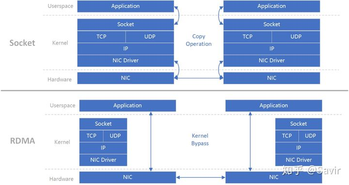
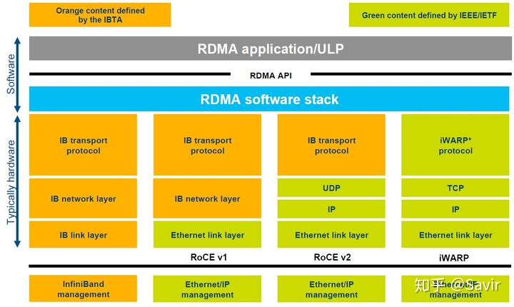
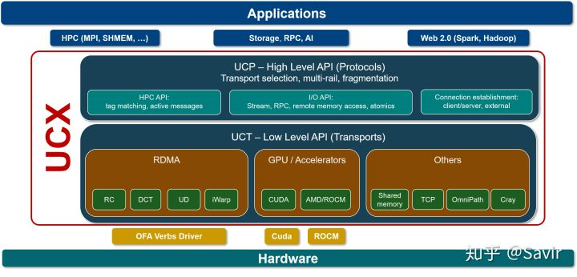

# RDMA概述

## 1. DMA和RDMA概念

### 1.1 DMA

DMA(直接内存访问)是一种能力，允许在计算机主板上的设备直接把数据发送到内存中去，数据搬运不需要CPU的参与。

传统内存访问需要通过CPU进行数据copy来移动数据，通过CPU将内存中的Buffer1移动到Buffer2中。DMA模式：可以同DMA
Engine之间通过硬件将数据从Buffer1移动到Buffer2,而不需要操作系统CPU的参与，大大降低了CPU
Copy的开销。

### 1.2 RDMA

RDMA是一种概念，在两个或者多个计算机进行通讯的时候使用DMA，
从一个主机的内存直接访问另一个主机的内存。

RDMA是一种host-offload,
host-bypass技术，允许应用程序(包括存储)在它们的内存空间之间直接做数据传输。具有RDMA引擎的以太网卡(RNIC)\--而不是host\--负责管理源和目标之间的可靠连接。使用RNIC的应用程序之间使用专注的QP和CQ进行通讯：

1.  每一个应用程序可以有很多QP和CQ

2.  每一个QP包括一个SQ和RQ

3.  每一个CQ可以跟多个SQ或者RQ相关联

## 2. RDMA的优势

传统的TCP/IP技术在数据包处理过程中，要经过操作系统及其他软件层，需要占用大量的服务器资源和内存总线带宽，数据在系统内存、处理器缓存和网络控制器缓存之间来回进行复制移动，给服务器的CPU和内存造成了沉重负担。尤其是网络带宽、处理器速度与内存带宽三者的严重\"不匹配性\"，更加剧了网络延迟效应。

RDMA是一种新的直接内存访问技术，RDMA让计算机可以直接存取其他计算机的内存，而不需要经过处理器的处理。RDMA将数据从一个系统快速移动到远程系统的内存中，而不对操作系统造成任何影响。

在实现上，RDMA实际上是一种[智能网卡与软件架构]{.mark}充分优化的远端内存直接高速访问技术，通过将RDMA协议固化于硬件(即网卡)上，以及支持[Zero-copy和Kernel
bypass]{.mark}这两种途径来达到其高性能的远程直接数据存取的目标。

使用RDMA的优势如下：

-   零拷贝(Zero-copy) -
    应用程序能够直接执行数据传输，在不涉及到网络软件栈的情况下。数据能够被直接发送到缓冲区或者能够直接从缓冲区里接收，而不需要被复制到网络层。

-   内核旁路(Kernel bypass) -
    应用程序可以直接在用户态执行数据传输，不需要在内核态与用户态之间做上下文切换。

-   不需要CPU干预(No CPU involvement) -
    应用程序可以访问远程主机内存而不消耗远程主机中的任何CPU。远程主机内存能够被读取而不需要远程主机上的进程（或CPU)参与。远程主机的CPU的缓存(cache)不会被访问的内存内容所填充。

-   消息基于事务(Message based transactions) -
    数据被处理为离散消息而不是流，消除了应用程序将流切割为不同消息/事务的需求。

-   支持分散/聚合条目(Scatter/gather entries support) -
    RDMA原生态支持分散/聚合。也就是说，读取多个内存缓冲区然后作为一个流发出去或者接收一个流然后写入到多个内存缓冲区里去。

在具体的远程内存读写中，RDMA操作用于读写操作的远程虚拟内存地址包含在RDMA消息中传送，远程应用程序要做的只是在其本地网卡中注册相应的内存缓冲区。远程节点的CPU除在连接建立、注册调用等之外，在整个RDMA数据传输过程中并不提供服务，因此没有带来任何负载。

## 3. RDMA 三种不同的硬件实现

RDMA作为一种[host-offload,
host-bypass]{.mark}技术，使[低延迟、高带宽]{.mark}的直接的内存到内存的数据通信成为了可能。目前支持RDMA的网络协议有：

1.  InfiniBand(IB):
    从一开始就支持RDMA的新一代网络协议。由于这是一种新的网络技术，因此需要支持该技术的网卡和交换机。

2.  RDMA融合以太网(RoCE): 即RDMA over Ethernet,
    允许通过以太网执行RDMA的网络协议。这允许在标准以太网基础架构(交换机)上使用RDMA，只不过网卡必须是支持RoCE的特殊的NIC。

3.  互联网广域RDMA协议(iWARP): 即RDMA over TCP,
    允许通过TCP执行RDMA的网络协议。这允许在标准以太网基础架构(交换机)上使用RDMA，只不过网卡要求是支持iWARP(如果使用CPU
    offload的话)的NIC。否则，所有iWARP栈都可以在软件中实现，但是失去了大部分的RDMA性能优势。

在三种主流的RDMA技术中，可以划分为两大阵营。一个[是IB技术,]{.mark}
另一个是支[持RDMA的以太网技术]{.mark}(RoCE和iWARP)。其中,
IBTA力挺的技术自然是IB和RoCE,
Mellanox公司（一个以色列人搞的小公司）是这方面的急先锋。而iWARP则是IEEE/IETF力挺的技术，主要是Chelsio公司在推进。RoCE和iWARP的争论，请参考Mellanox和Chelsio这两家公司发布的白皮书。

在存储领域，支持RDMA的技术早就存在，比如SRP(SCSI RDMA
Protocol)和iSER(iSCSI Extensions for RDMA)。如今兴起的NVMe over
Fabrics如果使用的不是FC网络的话，本质上就是NVMe over RDMA。
换句话说，NVMe over InfiniBand, NVMe over RoCE和NVMe over iWARP都是NVMe
over RDMA。

## 4. RDMA基本术语

### 4.1 Fabric

A local-area RDMA network is usually referred to as a fabric.

所谓Fabric，就是支持RDMA的局域网(LAN)。

### 4.2 CA(Channel Adapter)

A channel adapter is the hardware component that connects a system to
the fabric.

CA是Channel
Adapter(通道适配器)的缩写。那么，CA就是将系统连接到Fabric的硬件组件。在IBTA中，一个CA就是IB子网中的一个终端结点(End
Node)。分为两种类型，一种是HCA, 另一种叫做TCA,它们合称为xCA。其中，
HCA(Host Channel Adapter)是支持\"verbs\"接口的CA, TCA(Target Channel
Adapter)可以理解为\"weak CA\", 不需要像HCA一样支持很多功能。
而在IEEE/IETF中，CA的概念被实体化为[RNIC]{.mark}（RDMA Network Interface
Card）, iWARP就把一个CA称之为一个RNIC。

简言之，在IBTA阵营中，CA即HCA或TCA；而在iWARP阵营中，CA就是RNIC。总之，无论是HCA、TCA还是RNIC，它们都是CA,
它们的基本功能本质上都是生产或消费数据包(packet)

### 4.3 Verbs

在RDMA的持续演进中，有一个组织叫做OpenFabric
Alliance所做的贡献可谓功不可没。
Verbs这个词不好翻译，大致可以理解为访问RDMA硬件的"一组标准动作"。[每一个Verb可以理解为一个Function。]{.mark}

## 5. 核心概念

### 5.1 Memory Registration(MR) \| 内存注册

RDMA
就是用来对内存进行数据传输。那么怎样才能对内存进行传输，很简单，注册。
因为RDMA硬件对用来做数据传输的内存是有特殊要求的。

-   在数据传输过程中，应用程序不能修改数据所在的内存。

-   操作系统不能对数据所在的内存进行page out操作 \--
    物理地址和虚拟地址的映射必须是固定不变的。

-   注意无论是DMA或者RDMA都要求物理地址连续，这是由DMA引擎所决定的。那么怎么进行内存注册呢？

-   创建两个key (local和remote)指向需要操作的内存区域

-   注册的keys是数据传输请求的一部分

注册一个Memory Region之后，这个时候这个Memory
Region也就有了它自己的属性：

-   context : RDMA操作上下文

-   addr : MR被注册的Buffer地址

-   length : MR被注册的Buffer长度

-   lkey：MR被注册的本地key

-   rkey：MR被注册的远程key

对Memrory Registration：Memory
Registration只是RDMA中对内存保护的一种措施，只有将要操作的内存注册到RDMA
Memory Region中，这快操作的内存就交给RDMA
保护域来操作了。这个时候我们就可以对这快内存进行操作，至于操作的起始地址、操作Buffer的长度，可以根据程序的具体需求进行操作。我们只要保证接受方的Buffer
接受的长度大于等于发送的Buffer长度。

### 5.2 Queues \| 队列

RDMA一共支持三种队列，发送队列(SQ)和接收队列(RQ)，完成队列(CQ)。其中，SQ和RQ通常成对创建，被称为Queue
Pairs(QP)。

RDMA是基于消息的传输协议，数据传输都是异步操作。
RDMA操作其实很简单，可以理解为：

1.  Host提交工作请求(WR)到工作队列(WQ):
    工作队列包括发送队列(SQ)和接收队列(RQ)。工作队列的每一个元素叫做WQE,
    也就是WR。

2.  Host从完成队列(CQ）中获取工作完成(WC): 完成队列里的每一个叫做CQE,
    也就是WC。

3.  具有RDMA引擎的硬件(hardware)就是一个队列元素处理器。
    RDMA硬件不断地从工作队列(WQ)中去取工作请求(WR)来执行，执行完了就给完成队列(CQ)中放置工作完成(WC)。从生产者-消费者的角度理解就是：

-   Host生产WR, 把WR放到WQ中去

-   RDMA硬件消费WR

-   RDMA硬件生产WC, 把WC放到CQ中去

-   Host消费WC

## 6. RDMA数据传输

### 6.1 RDMA Send \| RDMA发送(/接收)操作 （Send/Recv）

跟TCP/IP的send/recv是类似的，不同的是RDMA是基于消息的数据传输协议（而不是基于字节流的传输协议），所有数据包的组装都在RDMA硬件上完成的，也就是说OSI模型中的下面4层(传输层，网络层，数据链路层，物理层)都在[RDMA硬件]{.mark}上完成。

### 6.2 RDMA Read \| RDMA读操作 (Pull)

RDMA读操作本质上就是Pull操作,
把远程系统内存里的数据拉回到本地系统的内存里。

### 6.3 RDMA Write \| RDMA写操作 (Push)

RDMA写操作本质上就是Push操作，把本地系统内存里的数据推送到远程系统的内存里。

### 6.4 RDMA Write with Immediate Data \| 支持立即数的RDMA写操作

支持立即数的RDMA写操作本质上就是给远程系统Push(推送)带外(OOB)数据，这跟TCP里的带外数据是类似的。

可选地，immediate
4字节值可以与数据缓冲器一起发送。该值作为接收通知的一部分呈现给接收者，并且不包含在数据缓冲器中。
