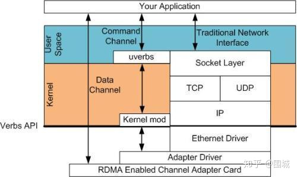
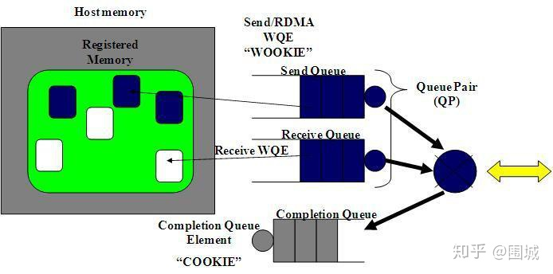
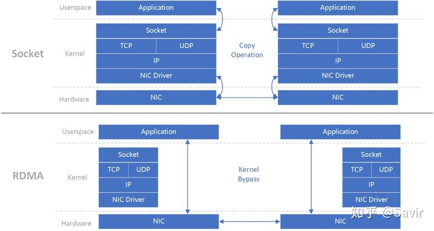
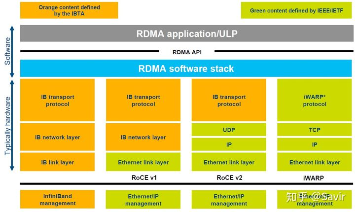
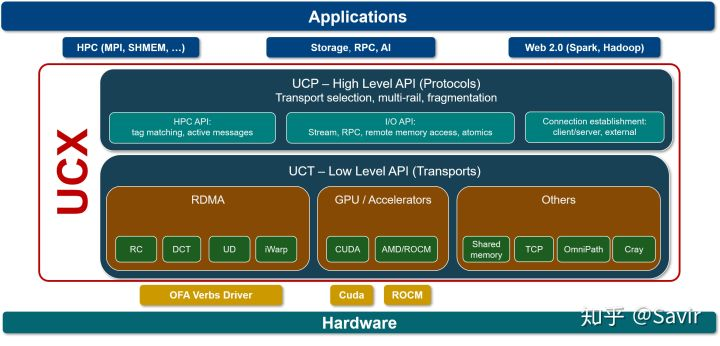

# RDMA技术详解（二）：RDMA Send Receive操作

## 1. 前言

RDMA指的是远程直接内存访问，这是一种通过网络在两个应用程序之间搬运缓冲区里的数据的方法。RDMA与传统的网络接口不同，因为它绕过了操作系统。这允许实现了RDMA的程序具有如下特点：

-   绝对的最低时延

-   最高的吞吐量

-   最小的CPU足迹 （也就是说，需要CPU参与的地方被最小化）

## 2. RDMA Verbs操作

使用RDMA,
我们需要有一张实现了RDMA引擎的网卡。我们把这种卡称之为HCA(主机通道适配器)。
适配器创建一个贯穿PCIe总线的从RDMA引擎到应用程序内存的通道。一个好的HCA将在导线上执行的RDMA协议所需要的全部逻辑都在硬件上予以实现。这包括分组，重组以及流量控制和可靠性保证。因此，从应用程序的角度看，只负责处理所有缓冲区即可。

在RDMA中我们使用内核态驱动建立一个数据通道。我们称之为命令通道（Command
Channel）。使用命令通道，我们能够建立一个数据通道（Data
Channel），该通道允许我们在搬运数据的时候完全绕过内核。一旦建立了这种数据通道，我们就能直接读写数据缓冲区。

建立数据通道的API是一种称之为\"verbs\"的API。\"verbs\"
API是由一个叫做OFED的Linux开源项目维护的。在站点[http://www.openfabrics.org](https://link.zhihu.com/?target=http%3A//www.openfabrics.org)上，为Windows
WinOF提供了一个等价的项目。\"verbs\"
API跟你用过的socket编程API是不一样的。但是，一旦你掌握了一些概念后，就会变得非常容易，而且在设计你的程序的时候更简单。

## 2. Queue Pairs

RDMA操作开始于"搞"内存。当你在对内存进行操作的时候，就是告诉内核这段内存名花有主了，主人就是你的应用程序。于是，你告诉HCA，就在这段内存上寻址，**赶紧准备开辟一条从HCA卡到这段内存的通道**。我们将这一动作称之为注册一个内存区域(MR)。一旦MR注册完毕，我们就可以使用这段内存来做任何RDMA操作。在下面的图中，我们可以看到注册的内存区域(MR)和被通信队列所使用的位于内存区域之内的缓冲区(buffer)。

RDMA Memory Registration

**struct** **ibv_mr** {

**struct** **ibv_context** **\***context;

**struct** **ibv_pd** **\***pd;

**void** **\***addr;

size_t length;

**uint32_t** handle;

**uint32_t** lkey;

**uint32_t** rkey;

};

RDMA硬件不断地从工作队列(WQ)中去取工作请求(WR)来执行，执行完了就给完成队列(CQ)中放置工作完成通知(WC)。这个WC意思就是Work
Completion。表示这个WR RDMA请求已经被处理完成，可以从这个Completion
Queue从取出来，表示这个RDMA请求已经被处理完毕。

RDMA通信基于三条队列(SQ, RQ和CQ)组成的集合。 其中，
发送队列(SQ)和接收队列(RQ)负责调度工作，他们总是成对被创建，称之为队列对(QP)。当放置在工作队列上的指令被完成的时候，完成队列(CQ)用来发送通知。

当用户把指令放置到工作队列的时候，就意味着告诉HCA那些缓冲区需要被发送或者用来接受数据。这些指令是一些小的结构体，称之为工作请求(WR)或者工作队列元素(WQE)。
WQE的发音为\"WOOKIE\"，就像星球大战里的猛兽。一个WQE主要包含一个指向某个缓冲区的指针。一个放置在发送队列（SQ）里的WQE中包含一个指向待发送的消息的指针。一个放置在接受队列里的WQE里的指针指向一段缓冲区，该缓冲区用来存放待接受的消息。

下面我们来看一下RDMA中的Work Request（SendWR和ReceWR）

RDMA Send Work Request请求

**struct** **ibv_send_wr** {

**uint64_t** wr_id;

**struct** **ibv_send_wr** **\***next;

**struct** **ibv_sge** **\***sg_list;

**int** num_sge;

**enum** **ibv_wr_opcode** opcode;

**int** send_flags;

**uint32_t** imm_data; */\* in network byte order \*/*

**union** {

**struct** {

**uint64_t** remote_addr;

**uint32_t** rkey;

} rdma;

**struct** {

**uint64_t** remote_addr;

**uint64_t** compare_add;

**uint64_t** swap;

**uint32_t** rkey;

} atomic;

**struct** {

**struct** **ibv_ah** **\***ah;

**uint32_t** remote_qpn;

**uint32_t** remote_qkey;

} ud;

} wr;

};

RDMA Receive Work Request请求

**struct** **ibv_recv_wr** {

**uint64_t** wr_id;

**struct** **ibv_recv_wr** **\***next;

**struct** **ibv_sge** **\***sg_list;

**int** num_sge;

};

RDMA是一种异步传输机制。因此我们可以一次性在工作队列里放置好多个发送或接收WQE。HCA将尽可能快地按顺序处理这些WQE。当一个WQE被处理了，那么数据就被搬运了。
一旦传输完成，HCA就创建一个完成队列元素(CQE)并放置到完成队列(CQ)中去。
相应地，CQE的发音为\"COOKIE\"。

RDMA Complete Queue Element

c++ struct ibv_wc { uint64_t wr_id; enum ibv_wc_status status; enum
ibv_wc_opcode opcode; uint32_t vendor_err; uint32_t byte_len; uint32_t
imm_data; /\* in network byte order \*/ uint32_t qp_num; uint32_t
src_qp; int wc_flags; uint16_t pkey_index; uint16_t slid; uint8_t sl;
uint8_t dlid_path_bits; };

## 3. RDMA Send/Receive

让我们看个简单的例子。在这个例子中，我们将把一个缓冲区里的数据从系统A的内存中搬到系统B的内存中去。这就是我们所说的消息传递语义学。接下来我们要讲的一种操作为SEND，是RDMA中最基础的操作类型。

**3.1 第一步**

第1步：系统A和B都创建了他们各自的QP的完成队列(CQ),
并为即将进行的RDMA传输注册了相应的内存区域(MR)。
系统A识别了一段缓冲区，该缓冲区的数据将被搬运到系统B上。系统B分配了一段空的缓冲区，用来存放来自系统A发送的数据。

**3.2 第二步**

第二步：系统B创建一个WQE并放置到它的接收队列(RQ)中。这个WQE包含了一个指针，该指针指向的内存缓冲区用来存放接收到的数据。系统A也创建一个WQE并放置到它的发送队列(SQ)中去，该WQE中的指针执行一段内存缓冲区，该缓冲区的数据将要被传送。

**3.3 第三步**

第三步：系统A上的HCA总是在硬件上干活，看看发送队列里有没有WQE。HCA将消费掉来自系统A的WQE,
然后将内存区域里的数据变成数据流发送给系统B。当数据流开始到达系统B的时候，系统B上的HCA就消费来自系统B的WQE，然后将数据放到该放的缓冲区上去。在高速通道上传输的数据流完全绕过了操作系统内核。

**3.4 第四步**

第四步：当数据搬运完成的时候，HCA会创建一个CQE。
这个CQE被放置到完成队列(CQ)中，表明数据传输已经完成。HCA每消费掉一个WQE,
都会生成一个CQE。因此，在系统A的完成队列中放置一个CQE,意味着对应的WQE的发送操作已经完成。同理，在系统B的完成队列中也会放置一个CQE，表明对应的WQE的接收操作已经完成。如果发生错误，HCA依然会创建一个CQE。在CQE中，包含了一个用来记录传输状态的字段。

我们刚刚举例说明的是一个RDMA
Send操作。在IB或RoCE中，传送一个小缓冲区里的数据耗费的总时间大约在1.3µs。通过同时创建很多WQE,
就能在1秒内传输存放在数百万个缓冲区里的数据。

## 4. 总结

在这博客中，我们学习了如何使用RDMA verbs API。同时也介绍了队列的概念，而队列概念是RDMA编程的基础。最后，我们演示了RDMA send操作，展现了缓冲区的数据是如何在从一个系统搬运到另一个系统上去的。
