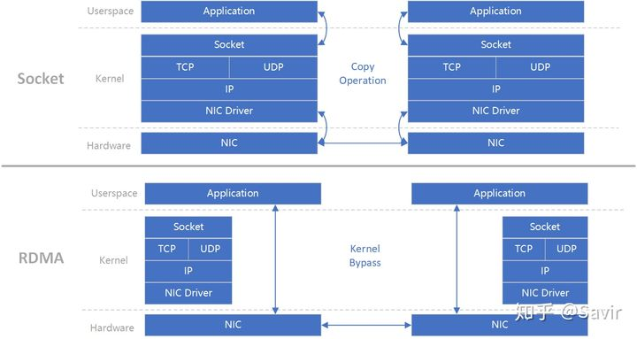
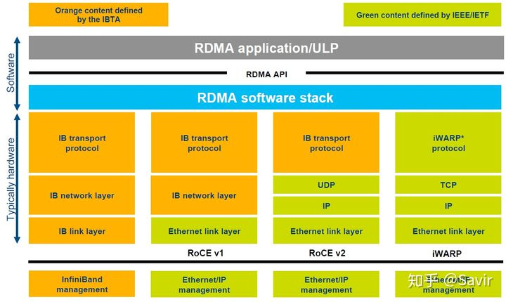
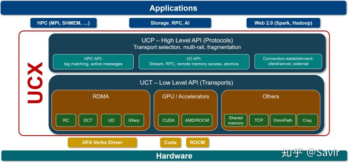

# RDMA概述

本想完全靠自己的语言完成这篇概述，然而开篇并没有想象当中的好写，看样子从宏观上概括一个技术比从微观上探究细枝末节要困难不少。本文是以前人们对RDMA技术的介绍为主，加入了一些自己的理解。随着本专栏内容的增加，本篇概述也会更新和逐渐完善。

## 什么是RDMA？

RDMA（ Remote Direct Memory Access
）意为远程直接地址访问，通过RDMA，本端节点可以"直接"访问远端节点的内存。所谓直接，指的是可以像访问本地内存一样，绕过传统以太网复杂的TCP/IP网络协议栈读写远端内存，而这个过程对端是不感知的，而且这个读写过程的大部分工作是由硬件而不是软件完成的。

为了能够直观的理解这一过程，请看下面两个图（图中箭头仅做示意，不表示实际逻辑或物理关系）：

{width="5.539681758530183in"
height="0.7275371828521435in"}

传统网络中，"节点A给节点B发消息"实际上做的是"把节点A内存中的一段数据，通过网络链路搬移到节点B的内存中"，而这一过程无论是发端还是收段，都需要CPU的指挥和控制，包括网卡的控制，中断的处理，报文的封装和解析等等。

而RDMA技术除了支持上面的传统收-发操作之外，还支持直接的远程读/写操作。这一过程可以简单的表示成下面的示意图，可以看到，节点B的CPU没有参与这一过程。也就是说节点A可以在节点B的CPU"不知情"的情况下，直接读写它的内存。

{width="5.065310586176728in"
height="0.6699496937882765in"}

RDMA主要应用在高性能计算（HPC）领域和大型数据中心当中，并且设备相对普通以太网卡要昂贵不少（比如Mellanox公司的Connext-X
5 100Gb
PCIe网卡市价在4000元以上）。由于使用场景和价格的原因，RDMA与普通开发者和消费者的距离较远，目前主要是一些大型互联网企业在部署和使用。

RDMA技术为什么可以应用在上述场景中呢？这就涉及到它的以下几个特点：

-   0拷贝：指的是[不需要在用户空间和内核空间]{.mark}中来回复制数据。

由于Linux等操作系统将内存划分为用户空间和内核空间，在传统的Socket通信流程中CPU需要多次把数据在内存中来回拷贝。而通过RDMA技术，我们可以直接访问远端已经注册的内存区域。

关于0拷贝可以参考这篇文章：[https://www.jianshu.com/p/e76e3580e356](https://link.zhihu.com/?target=https%3A//www.jianshu.com/p/e76e3580e356)

-   内核Bypass：指的是IO（数据）流程可以绕过内核，即在用户层就可以把数据准备好并通知硬件准备发送和接收。避免了系统调用和上下文切换的开销。

{width="5.331938976377953in"
height="2.835255905511811in"}

上图（原图[[\[1\]]{.underline}](https://link.zhihu.com/?target=https%3A//pc.nanog.org/static/published/meetings/NANOG76/1999/20190612_Cardona_Towards_Hyperscale_High_v1.pdf)中Socket有三次拷贝，我认为应该是两次）可以很好的解释"0拷贝"和"内核Bypass"的含义。上下两部分分别是基于Socket的和基于RDMA的一次收-发流程，左右分别为两个节点。可以明显的看到Socket流程中在软件中多了一次拷贝动作。而RDMA绕过了内核同时也减少了内存拷贝，数据可以直接在用户层和硬件间传递。

-   CPU卸载：指的是在读/写操作时（区别于传统的收-发模型），可以在远端节点CPU不参与通信的情况下（当然要持有访问远端某段内存的"钥匙"才行）对内存进行读写，这实际上是**把报文封装和解析放到硬件中做了**。而传统的以太网通信，双方CPU都必须参与各层报文的解析，如果数据量大且交互频繁，对CPU来讲将是一笔不小的开销，而这些被占用的CPU计算资源本可以做一些更有价值的工作。

通信领域两大出场率最高的性能指标就是"带宽"和"时延"。简单的说，所谓带宽指的是指单位时间内能够传输的数据量，而时延指的是数据从本端发出到被对端接收所耗费的时间。因为上述几个特点，相比于传统以太网，RDMA技术同时做到了更高带宽和更低时延，所以其在带宽敏感的场景------比如海量数据的交互，时延敏感------比如多个计算节点间的数据同步的场景下得以发挥其作用。

## 协议

RDMA本身指的是一种技术，具体协议层面，包含Infiniband（IB），RDMA over
Converged Ethernet（RoCE）和internet Wide Area RDMA
Protocol（iWARP）。三种协议都符合RDMA标准，使用相同的上层接口，在不同层次上有一些差别。

{width="5.014619422572179in"
height="2.9939785651793525in"}

上图[[\[2\]]{.underline}](https://link.zhihu.com/?target=https%3A//www.snia.org/sites/default/files/ESF/RoCE-vs.-iWARP-Final.pdf)对于几种常见的RDMA技术的协议层次做了非常清晰的对比，

## Infiniband

2000年由IBTA（InfiniBand Trade
Association）提出的IB协议是当之无愧的核心，其规定了一整套完整的链路层到传输层（非传统OSI七层模型的传输层，而是位于其之上）规范，但是其无法兼容现有以太网，除了需要支持IB的网卡之外，企业如果想部署的话还要重新购买配套的交换设备。

## RoCE

RoCE从英文全称就可以看出它是基于以太网链路层的协议，v1版本网络层仍然使用了IB规范，而v2使用了UDP+IP作为网络层，使得数据包也可以被路由。RoCE可以被认为是IB的"低成本解决方案"，将IB的报文封装成以太网包进行收发。由于RoCE
v2可以使用以太网的交换设备，所以现在在企业中应用也比较多，但是相同场景下相比IB性能要有一些损失。

## iWARP

iWARP协议是IETF基于TCP提出的，但是因为TCP是面向连接的协议，而大量的TCP连接会耗费很多的内存资源，另外TCP复杂的流控等机制会导致性能问题，所以iWARP相比基于UDP的RoCE
v2来说并没有优势（IB的传输层也可以像TCP一样保证可靠性），所以iWARP相比其他两种协议的应用不是很多。

需要注意的是，上述几种协议都需要专门的硬件（网卡）支持。

由于笔者在工作中只接触过IB和RoCE，所以本专栏着重介绍IB和RoCE，不涉及iWARP的内容。

## 玩家

### 标准/生态组织 {#标准生态组织 .标题3}

提到IB协议，就不得不提到两大组织------IBTA和OFA。

### IBTA[[\[3\]]{.underline}](https://link.zhihu.com/?target=https%3A//www.infinibandta.org/) {#ibta3 .标题3}

成立于1999年，负责制定和维护Infiniband协议标准。IBTA独立于各个厂商，通过赞助技术活动和推动资源共享来将整个行业整合在一起，并且通过线上交流、营销和线下活动等方式积极推广IB和RoCE。

IBTA会对商用的IB和RoCE设备进行协议标准符合性和互操作性测试及认证，由很多大型的IT厂商组成的委员会领导，其主要成员包括博通，HPE，IBM，英特尔，Mellanox和微软等，华为也是IBTA的会员。

### OFA[[\[4\]]{.underline}](https://link.zhihu.com/?target=https%3A//www.openfabrics.org/) {#ofa4 .标题3}

成立于2004年的非盈利组织，负责开发、测试、认证、支持和分发独立于厂商的开源跨平台infiniband协议栈，2010年开始支持RoCE。其对用于支撑RDMA/Kernel
bypass应用的OFED（OpenFabrics Enterprise
Distribution）软件栈负责，保证其与主流软硬件的兼容性和易用性。OFED软件栈包括驱动、内核、中间件和API。

上述两个组织是配合关系，IBTA主要负责开发、维护和增强Infiniband协议标准；OFA负责开发和维护Infiniband协议和上层应用API。

## 开发社区

### Linux社区 {#linux社区 .标题3}

Linux内核的RDMA子系统还算比较活跃，经常会讨论一些协议细节，对框架的修改比较频繁，另外包括[华为和Mellanox]{.mark}在内的一些厂商也会经常对驱动代码进行修改。

邮件订阅：[http://vger.kernel.org/vger-lists.html#linux-rdma](https://link.zhihu.com/?target=http%3A//vger.kernel.org/vger-lists.html%23linux-rdma)

代码位于内核drivers/infiniband/目录下，包括框架核心代码和各厂商的驱动代码。

代码仓：[https://git.kernel.org/pub/scm/linux/kernel/git/rdma/rdma.git/](https://link.zhihu.com/?target=https%3A//git.kernel.org/pub/scm/linux/kernel/git/rdma/rdma.git/)

### RDMA社区 {#rdma社区 .标题3}

对于上层用户，IB提供了一套与Socket套接字类似的接口---[libibverbs，]{.mark}前文所述三种协议都可以使用。参考着协议、API文档和示例程序很容易就可以写一个Demo出来。本专栏中的RDMA社区专指其用户态社区，在github上其仓库的名字为[linux-rdma]{.mark}。

主要包含两个子仓库：

-   rdma-core

用户态核心代码，API，文档以及各个厂商的用户态驱动。

-   perftest

一个功能强大的用于测试RDMA性能的工具。

代码仓：[https://github.com/linux-rdma/](https://link.zhihu.com/?target=https%3A//github.com/linux-rdma/)

### UCX[[\[5\]]{.underline}](https://link.zhihu.com/?target=https%3A//www.openucx.org/) {#ucx5 .标题3}

UCX是一个建立在RDMA等技术之上的用于数据处理和高性能计算的通信框架，RDMA是其底层核心之一。我们可以将其理解为[是位于应用和RDMA
API之间的中间件]{.mark}，向上层用户又封装了一层更易开发的接口。

{width="5.123526902887139in"
height="2.4605194663167103in"}

笔者对其并不了解太多，只知道业界有一些企业在基于UCX开发应用。

代码仓：[https://github.com/openucx/ucx](https://link.zhihu.com/?target=https%3A//github.com/openucx/ucx)

## 硬件厂商

设计和生产IB相关硬件的厂商有不少，包括Mellanox、华为、收购了Qlogic的IB技术的Intel，博通、Marvell，富士通等等，这里就不逐个展开了，仅简单提一下[Mellanox和华为。]{.mark}

-   Mellanox

IB领域的领头羊，协议标准制定、软硬件开发和生态建设都能看到Mellanox的身影，其在社区和标准制定上上拥有最大的话语权。目前最新一代的网卡是支持[200Gb/s的ConnextX-6系列]{.mark}。

-   华为

去年初推出的鲲鹏920芯片已经支持100Gb/s的[RoCE协议]{.mark}，技术上在国内处于领先地位。但是软硬件和影响力方面距离Mellanox还有比较长的路要走，相信华为能够早日赶上老大哥的步伐。

## 用户

微软、IBM和国内的阿里、京东都正在使用RDMA，另外还有很多大型IT公司在做初步的开发和测试。在[数据中心和高性能计算场景下]{.mark}，RDMA代替传统网络是大势所趋。笔者对于市场接触不多，所以并不能提供更详细的应用情况。
