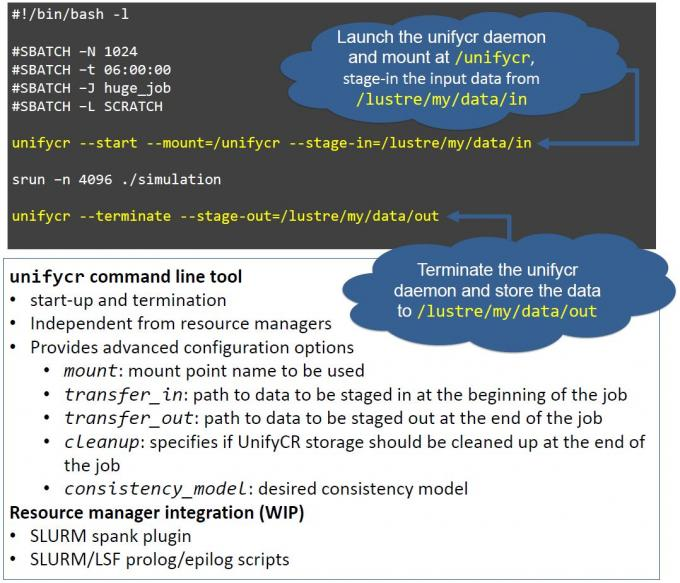

# HDF5的两个新概念VOL和VFD

介绍HDF5的两个新概念VOL和VFD，基于此，新开发了异步IO和GDS (GPUDirect
Storage）的功能，对HPC I/O将有推动作用。

## VOL (Virtual Object Layer)

<https://portal.hdfgroup.org/display/HDF5/Virtual+Object+Layer>

下面介绍HDF5-1.12的VOL新特性。

### 介绍

The Virtual Object Layer (VOL) is an abstraction layer within the HDF5
library that enables different methods for accessing data and objects
that conform to the HDF5 data model.

The VOL intercepts all HDF5 API calls that potentially modify data on
disk and forwards those calls to a plugin \"object driver\". The data on
disk can be a different format than the HDF5 format:

The plugins can actually store the objects in variety of ways. A plugin
could, for example, have objects be distributed remotely over different
platforms, provide a raw mapping of the model to the file system, or
even store the data in other file formats (like native netCDF or HDF4
format). The user still gets the same data model where access is done to
a single HDF5 "container"; however the plugin object driver translates
from what the user sees to how the data is actually stored. Having this
abstraction layer maintains the object model of HDF5 and allows better
usage of new object storage file systems that are targeted for Exascale
systems.

### 文档

-   [HDF5 VOL User\'s
    Guide](https://portal.hdfgroup.org/display/HDF5/HDF5+VOL+User%27s+Guide)

-   [HDF5 VOL Connector Author\'s
    Guide](https://portal.hdfgroup.org/display/HDF5/HDF5+VOL+Connector+Authors+Guide)

-   [Virtual Object Layer
    (RFC)](https://portal.hdfgroup.org/display/HDF5/Virtual+Object+Layer+RFC)

-   [VOL Feature flag/layers
    RFC](https://bitbucket.hdfgroup.org/projects/HDFFV/repos/hdf5doc/browse/RFCs/HDF5/VOL/2019-09-23-RFC_VOL_feature_flags.docx)

-   [Berkeley DB VOL
    Connector](https://bitbucket.hdfgroup.org/projects/HDF5VOL/repos/berkeley-db/browse)

### HDF5 Library APIs

Virtual Object Layer (H5VL) and VOL Property List APIs

New Virtual Object Layer (H5VL) APIs have been introduced for working
with the VOL, as well as Property List APIs for working with the VOL:

  ----------------------------------------------------------------------------------------------------------------------------------------------------
  Function                                                                                                                Description
  ----------------------------------------------------------------------------------------------------------------------- ----------------------------
  [H5P_GET_VOL_ID](https://portal.hdfgroup.org/display/HDF5/H5P_GET_VOL_ID)                                               Returns the identifier of
                                                                                                                          the current VOL connector

  [H5P_GET_VOL_INFO](https://portal.hdfgroup.org/display/HDF5/H5P_GET_VOL_INFO)                                           Returns a copy of the VOL
                                                                                                                          information for a connector

  [H5P_SET_VOL](https://portal.hdfgroup.org/display/HDF5/H5P_SET_VOL)                                                     Set the file VOL connector
                                                                                                                          for a file access property
                                                                                                                          list

  [H5VL_GET_CONNECTOR_NAME](https://portal.hdfgroup.org/display/HDF5/H5VL_GET_CONNECTOR_NAME)                             Retrieves the connector name
                                                                                                                          for the VOL associated with
                                                                                                                          the object or file
                                                                                                                          identifier

  [H5VL_IS_CONNECTOR_REGISTERED_BY_NAME](https://portal.hdfgroup.org/display/HDF5/H5VL_IS_CONNECTOR_REGISTERED_BY_NAME)   Tests whether a VOL class
                                                                                                                          has been registered or not

  [H5VL_REGISTER_CONNECTOR](https://portal.hdfgroup.org/display/HDF5/H5VL_REGISTER_CONNECTOR)                             Registers a new VOL
                                                                                                                          connector

  [H5VL_REGISTER_CONNECTOR_BY_NAME](https://portal.hdfgroup.org/display/HDF5/H5VL_REGISTER_CONNECTOR_BY_NAME)             Registers a new VOL
                                                                                                                          connector by name

  [H5VL_REGISTER_CONNECTOR_BY_VALUE](https://portal.hdfgroup.org/display/HDF5/H5VL_REGISTER_CONNECTOR_BY_VALUE)           Registers a new VOL
                                                                                                                          connector by connector value

  [H5VL_UNREGISTER_CONNECTOR](https://portal.hdfgroup.org/display/HDF5/H5VL_UNREGISTER_CONNECTOR)                         Removes a VOL connector
                                                                                                                          identifier from the library
  ----------------------------------------------------------------------------------------------------------------------------------------------------

### H5Fdelete and Changes to the Virtual File Layer (VFL) ([RFC](https://portal.hdfgroup.org/display/HDF5/H5Fdelete+RFC)) 

With the VOL, HDF5 \"files\" can map to arbitrary storage schemes such
as object stores and relational database tables. The data created by
these implementations may be inconvenient for a user to remove without a
detailed knowledge of the storage scheme. The H5Fdelete() API was
introduced to give VOL connector authors the ability to add
connector-specific delete code to their connectors so that users can
remove these \"files\" without detailed knowledge of the storage scheme.

  ------------------------------------------------------------------------------------------------------------
  Function                                                            Description
  ------------------------------------------------------------------- ----------------------------------------
  [H5F_DELETE](https://portal.hdfgroup.org/display/HDF5/H5F_DELETE)   Deletes an HDF5 file

  ------------------------------------------------------------------------------------------------------------

Since HDF5 storage can differ among the virtual file drivers, changes
had to be made so that each Virtual File Driver (VFD) could have its own
driver-specific cleanup code.

## VFD (Virtual File Driver)

### What is a File Driver ? 

In HDF5, a file driver is a mapping between the HDF5 format address
space and storage. By default, HDF5 simply maps the format address space
directly onto a single file.

However, users may want the ability to map the format address space onto
different types of storage with various types of maps. With HDF5 we
provide a small set of pre-defined file drivers, and users can implement
their own mappings using the Virtual File Layer APIs. With HDF5-1.12
users can create Virtual Object Layer plugins to HDF5 to store objects
with file drivers that they have created.

Detailed information on file drivers can be found under the Technical
Notes documentation on the [Virtual File
Layer](https://portal.hdfgroup.org/display/HDF5/Virtual+File+Layer)

https://portal.hdfgroup.org/display/HDF5/Virtual+File+Layer

### File Drivers Defined in HDF5

Following are the file drivers that HDF5 provides.

-   **H5FD_CORE:** This driver performs I/O directly to memory and can
    be used to create small temporary files that never exist on
    permanent storage.

-   **H5FD_FAMILY:**This driver partitions a large format address space
    into smaller chunks (separate storage of a user\'s choice).

-   [**HDF5_HDFS**](https://portal.hdfgroup.org/display/HDF5/Virtual+File+Drivers+-+S3+and+HDFS):This
    driver enables access to an HDF5 file with the Hadoop Distributed
    File System (HDFS). ***New***

-   **H5FD_MPIIO:** This driver is used with Parallel HDF5, and is only
    pre-defined if the library is compiled with parallel I/O support.

-   **H5FD_MULTI:**This driver enables different types of HDF5 data and
    metadata to be written to separate files. The H5FD_SPLIT driver is
    an example of what the H5FD_MULTI driver can do.

-   [**H5FD_ROS3**](https://portal.hdfgroup.org/display/HDF5/Virtual+File+Drivers+-+S3+and+HDFS):This
    driver enables access to an HDF5 file via the Amazon Simple Storage
    Service (Amazon S3).***New***

-   **H5FD_SEC2:**This is the default driver which uses Posix
    file-system functions like read and write to perform I/O to a single
    file.

-   **H5FD_SPLIT:**This driver splits the meta data and raw data into
    separate storage of a user\'s choice.

-   **H5FD_STDIO:**This driver uses functions from \'stdio.h\' to
    perform buffered I/O to a single file.

### Programming Model for Using a Pre-Defined File Driver

Create a copy or instance of the File Access property list:

***fapl*** = H5Pcreate (H5P_FILE_ACCESS);

Initialize the file driver. Each pre-defined file driver has it\'s own
initialization function, whose name is H5Pset_fapl\_ followed by the
driver name and which takes a file access property list as the first
argument, followed by additional driver-dependent arguments. For
example:

size_t member_size = 100\*1024\*1024; /\* 100 MB \*/

status = *H5Pset_fapl_family* (***fapl***, member_size, H5P_DEFAULT);

An alternative to using the driver initialization function is to set the
driver directly using H5Pset_driver, which is not covered here.

Call H5Fcreate, passing in the identifier of the property list just
modified.

file_id = H5Fcreate (HDF5FILE, H5F_ACC_TRUNC, H5P_DEFAULT, ***fapl***);

Close the File Access Property List:

status = H5Pclose (***fapl***);

Perform I/O on the file, if need be. To do so, a Data Access/Transfer
property must be copied, modified, and passed in to H5Dread or H5Dwrite.

For example, the following sets the MPI-IO driver to use independent
access for I/O operations:

dxpl = H5Pcreate (H5P_DATA_XFER);

status = H5Pset_dxpl_mpio (dxpl, H5FD_MPIO_INDEPENDENT);

status = H5Dread (dataset_id, type, mspace, fspace, buffer, dxpl);

### User Designed File Drivers

These are out of the scope of this tutorial. Refer to the Technical
Notes documentation on the [Virtual File
Layer](https://portal.hdfgroup.org/display/HDF5/Virtual+File+Layer).

https://portal.hdfgroup.org/display/HDF5/Virtual+File+Layer

### How Does a General Application Open an HDF5 File ? 

A general application does not know what drivers were used to create a
file. It would have to try different file drivers until it succeeds. An
example of a general application is the h5dump tool that we provide with
HDF5.

### VFD SWMR(Single Writer Multiple Reader)

The SWMR (Single Writer Multiple Reader) feature enables a second
process to read an HDF5 file while data is being written to it. However,
the current implementation touches most parts of the HDF5 library,
presenting significant maintenance issues, and furthermore, offers no
guarantees on the maximum time from write to read, which is problematic
for some applications.

The VFD SWMR is more modular, minimizing the maintenance issues. It has
additional benefits  including allowing the HDF5 library to make
guarantees for the maximum time from write to availability of data read
and the possibility of extending SWMR to NFS and object stores. Please
see
the [RFC](https://portal.hdfgroup.org/display/HDF5/VFD+SWMR+-+RFC) for
complete details.
