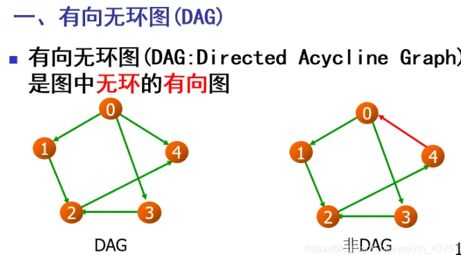

# HPX Documentation 2021 HPX-1.6

# 第2章（P.5）

## 2.1 Why HPX?

### 2.1.1 ParalleX\--a new execution model for future architectures {#parallex--a-new-execution-model-for-future-architectures .标题3}

### 2.1.2 What is HPX? {#what-is-hpx .标题3}

### 2.1.3 What makes our systems slow? {#what-makes-our-systems-slow .标题3}

FLOPS---floating point operations per second

[two forms of scalability]{.mark}: strong scaling (see Amdahl's Law) and
weak scaling (see Gustafson's Law)

[Strong scaling]{.mark} is defined as how the solution time varies with
the number of processors for a fixed total problem size. It gives an
estimate of [how much faster]{.mark} we can solve a particular problem
by throwing more resources at it.

[Weak scaling]{.mark} is defined as how the solution time varies with
the number of processors for a fixed problem size per processor. In
other words, it defines [how much more data]{.mark} can we process by
using more hardware resources.

### 2.1.4 Technology demands new response {#technology-demands-new-response .标题3}

### 2.1.5 Governing principles applied while developing HPX {#governing-principles-applied-while-developing-hpx .标题3}

### 2.1.6 Focus on latency hiding instead of latency avoidance {#focus-on-latency-hiding-instead-of-latency-avoidance .标题3}

## 2.2 Quick start ([P.11]{.mark})

使用cmake（推荐）或make的构建系统，也支持pkg-config

### 2.2.1 获取HPX源码 {#获取hpx源码 .标题3}

git clone <https://github.com/STEllAR-GROUP/hpx.git>

git checkout 1.6.0

### 2.2.2 HPX依赖库 {#hpx依赖库 .标题3}

最低依赖库：Boost, Portable Hardware Locality (HWLOC)

建议使用google-perftools的tcmalloc (默认)或者jemalloc

https://www.boost.org/

https://www.open-mpi.org/projects/hwloc/

https://code.google.com/p/gperftools

http://jemalloc.net

### 2.2.3 Building HPX {#building-hpx .标题3}

cmake -DCMAKE_INSTALL_PREFIX=/install/path ..

make install

### 2.2.4 使用微软的vcpkg安装和构建HPX {#使用微软的vcpkg安装和构建hpx .标题3}

git clone https://github.com/Microsoft/vcpkg.git

cd vcpkg

./bootstrap-vcpkg.sh

./vcpkg integrate install

vcpkg install hpx

### 2.2.5 Hello, World! （P13） {#hello-world-p13 .标题3}

编写CMakeLists.txt

cmake_minimum_required(VERSION 3.17)

project(my_hpx_project CXX)

find_package(HPX REQUIRED)

add_executable(my_hpx_program main.cpp)

target_link_libraries(my_hpx_program HPX::hpx HPX::wrap_main
HPX::iostreams_component)

注：（1）可能不止1个main.cpp源码文件，可参考2.5.3 Creating HPX projects
with CMake-based projects的add_hpx_executable()用法。

（2）如果你需要隐式地使用main()作为运行时入口，需要HPX::wrap_main。参考Re-use
the main() function as the main HPX entry point

（3）HPX::iostreams_component是可选项（为了示例），也可使用std::cout

还需要[main.cpp()]{.mark}

// Including \'hpx/hpx_main.hpp\' instead of the usual
\'hpx/hpx_init.hpp\' enables

// to use the plain C-main below as the direct main HPX entry point.

#include \<hpx/hpx_main.hpp\>

[#include \<hpx/iostream.hpp\>]{.mark}

**int** main()

{

// Say hello to the world!

hpx::cout \<\< \"Hello World!**\\n**\" \<\< hpx::flush;

**return** 0;

}

然后，

mkdir build && cd build

cmake -DCMAKE_PREFIX_PATH=/path/to/hpx/installation ..

make all

./my_hpx_program

So while it looks almost the same you can now use futures, async,
parallel algorithms and more which make use of the HPX runtime with
lightweight threads. hpx::cout is a replacement for std::cout to make
sure printing never blocks a lightweight thread. You can read more about
hpx::cout in The HPX I/O-streams component.

还可以使用hpx::init的启动HPX运行时系统的方式。

#include \<hpx/hpx_init.hpp\>

还可以使用hpx::start和hpx::stop的非阻塞选项

具体可参考Starting the HPX runtime

[注意]{.mark}：当#include
\<hpx/hpx_main.hpp\>，用户定义的main重命名，真的main函数在HPX定义。这意味着用户定义的main函数必须有返回，如果没有返回，会出现编译时错误。

### 2.2.6 Writing task-based applications（P15） {#writing-task-based-applicationsp15 .标题3}

与C++标准库的async和futures类似。

[术语：]{.mark}

轻量级线程:
比OS线程，更小的栈和更快的上下文切换，将程序分解为更小的任务的开销更小，有助于运行时充分利用所有的处理单元。

async: 异步启动任务的基本方式，返回future\<T\>

future\<T\>:
表示T类型的值，在future中准备好。其值可以使用get获取（阻塞），用户也可以使用is_ready检查数值是否准备好（非阻塞）。

shared_future\<T\>:
与future\<T\>类似，但可复制（类似于std::unique_ptr和std::shared_ptr）

continuation：在之前任务运行完后再运行的函数（表示为future），then是future\<T\>的一种方法，接着运行的函数。continuation用来构建dataflow
DAG (directed acyclic
graphs)。shared_future帮助你分解DAG中的节点，像when_all()帮助你合并DAG中的节点。

{width="3.025515091863517in"
height="1.6763659230096237in"}

示例代码见P19

建议：

（1）为了方便，可以用dataflow取代hpx::when_all(\...).then(\...)

（2）可使用HPX中的并行算法，取代自己的实施方法，这样既节省时间，有提高计算效率。

### 2.2.7 接下来 {#接下来 .标题3}

可以看Terminology一节，了解HPX用到的术语

Examples包含小的HPX例子，Local to remote 1D
stencil例子，从单节点实施逐步到分布式（多节点）实施。

Manual包含编写、构建和运行HPX应用的细节信息。

## [2.3]{.mark} 术语

Locality：执行的同步域，类似于SMP机器上的一个NUMA域或者集群中的一个计算节点；

Active Global Address Space
(AGAS)：全局地址空间。同步域中的全局地址都是cache
coherent，考虑透明的高速缓存。

Process：是传统的顺序执行进程的拓展，

Parcel：HPX中通信数据的component，远程激活一个action和通过continuation迁移分布flow-control。Parcel统一了局部和全局执行语法与同步操作。message-driven

LCO (Local Control
Object)：HPX中的同步机制。任何实施某种概念的对象都视为一个LCO。

Action：可以远程激活的函数。参考Applying actions

Component:
是一个C++类（包含server/client），可以远程访问。一个component也包含可以远程激活的成员函数，称为component
actiopns。参考Writing components（如何在HPX中使用components）的细节。

## [2.4 Examples (P19)]{.mark}

### 2.4.1 Asynchronous execution with [hpx::async]{.mark}: Fibonacci {#asynchronous-execution-with-hpxasync-fibonacci .标题3}

hpx-1.6\\examples\\quickstart\\fibonacci_local.cpp

使用future并行化计算Fibonacci数列，使用HPX计算Fibonacci数列的第n个数。

如下[图2.1]{.mark}，一个future封装一个延迟计算。future作用是：初始未知结果的代理，因为计算结果尚未完成。future通过选择性地悬停任何需要计算结果的HPX线程，直到获取该数值，同步该值获取。

当创建future，future产生一个新的HPX线程（或者使用一个parcel远程创建，或者在当地将future放入一个线程队列），当运行时，将执行与future相关的函数。当创建future后，函数形参被绑定。

一旦函数执行完毕，对future执行[写操作]{.mark}。写操作标记future完成，选择性存储函数返回值。当需要延迟计算的结果时，对future执行[读操作]{.mark}。如果future的函数尚未完成，对future执行读操作时，负责读操作的HPX线程就会悬停，直到future准备好。future机制允许HPX在程序提前执行调度工作，当需要函数值时，future已经计算完成并可获取。

{width="3.5063637357830273in"
height="2.9350820209973754in"}

代码示例：fibonacci_local.cpp

[主程序main()函数]{.mark}：仅用来初始化运行时系统。应用相关的命令行选项在此定义。HPX使用Boost.Program
Options处理命令行参数。

完成设置HPX后，hpx::init调用hpx_main()

**int** main(**int** argc, **char**\* argv\[\])

{

// Configure application-specific options

hpx::program_options::[options_description]{.mark}

desc_commandline(\"Usage: \" HPX_APPLICATION_STRING \" \[options\]\");

desc_commandline.add_options() // 读取命令行参数

( \"n-value\",

hpx::program_options::value\<std::**uint64_t**\>()-\>default_value(10),
//默认值10

\"n value for the Fibonacci function\"); // 说明

// 初始化和运行HPX

hpx::init_params init_args;

init_args.desc_cmdline = desc_commandline;

**return** hpx::init(argc, argv, init_args); // 调用hpx_main()

}

main()中的hpx::init启动运行时系统，激活hpx_main()作为第1个HPX线程。读取命令行选项\--n-value，计时器(hpx
:: chrono ::
high_resolution_timer)用来记录计算耗时，同步激活函数fibonacci，打印结果。

**int** hpx_main(hpx::program_options::variables_map& vm)

{

// extract command line argument, i.e. fib(N)

std::**uint64_t** n = vm\[\"n-value\"\].as\<std::**uint64_t**\>();

{

// Keep track of the time required to execute.

hpx::chrono::high_resolution_timer t;

std::**uint64_t** r = fibonacci(n);

**char const**\* fmt = \"fibonacci({1}) == {2}**\\n**elapsed time: {3}
\[s\]**\\n**\";

hpx::util::[format_to]{.mark}(std::cout, fmt, n, r, t.elapsed()); //
format_to()

}

**return** hpx::finalize(); // Handles HPX shutdown

}

fibonacci函数本身是同步的，内部执行是异步的。下面看下函数内部情况：

std::**uint64_t** [fibonacci]{.mark}(std::**uint64_t** n)

{

**if** (n \< 2)

**return** n; // n=0 or 1

// Invoking the Fibonacci algorithm twice is inefficient.

// However, we intentionally demonstrate it this way to create some
heavy workload.

hpx::future\<std::**uint64_t**\> n1 = hpx::async([fibonacci]{.mark}, n -
1);

hpx::future\<std::**uint64_t**\> n2 = hpx::async(fibonacci, n - 2);

**return** n1.get() [+]{.mark} n2.get(); // wait for the Futures to
return their values

}

hpx::async()[返回]{.mark}std::uint64_t的future，即hpx::future\<std::uint64_t\>

各future代表一个异步，递归的调用。创建future后，等待他们完成计算，然后相加，返回结果。使用get方法从future获取数值。递归调用树将持续，直到n等于0或1

当达到结束条件时，future相加，生成fibonacci数列的第n个数值。

注意：调用get潜在地阻塞调用HPX线程，运行时让其他HPX线程运行。

但是，更有效的方法是quickstart/fibonacci_futures.cpp，包含很多当地计算fibonacci数的变化方法，其中各方法在何处实施异步和并行化有不同权衡。

熟悉HPX后，可以对上述方法实施优化。[例子2.4.5]{.mark} Dataflow: Interest
calculator举例[dataflow]{.mark}，是实施多个任务链的更有效的方法。

### 2.4.2 Asynchronous execution with [hpx::async]{.mark} 与 [actions]{.mark}: Fibonacci （局部执行） {#asynchronous-execution-with-hpxasync-与-actions-fibonacci-局部执行 .标题3}

代码：/quickstart/fibonacci.cpp

在上个例子的基础上，使用actions函数，可以远程运行。但本例仅局部运行action。执行action的机制与hpx::async一样。在2.4.3
Remote execution with actions: Hello
world，将示例在[远程localities]{.mark}上运行actions。

考察hpx_main()函数：

**int** hpx_main(hpx::program_options::variables_map& vm)

{

// extract command line argument, i.e. fib(N)

std::**uint64_t** n = vm\[\"n-value\"\].as\<std::**uint64_t**\>();

{

// Keep track of the time required to execute.

hpx::chrono::high_resolution_timer t;

// Wait for fib() to return the value

fibonacci_action fib;

std::**uint64_t** r = fib(hpx::find_here(), n); // 与上例不同！

**char const**\* fmt = \"fibonacci({1}) == {2}**\\n**elapsed time: {3}
\[s\]**\\n**\";

hpx::util::format_to(std::cout, fmt, n, r, t.elapsed());

}

**return** hpx::finalize(); // Handles HPX shutdown

}

可以看出：我们创建了std::uint64_t存储激活fibonacci_action
fib的结果。action将异步启动（action内部的工作也是异步的），然后返回fibonacci数列结果。

[什么是action? 什么是fibonacci_action？]{.mark}

[action]{.mark}是函数的wrapper，通过包装函数，HPX可以发工作的packets到不同的处理单元。这些工具允许用户在现在、将来或在某个计算节点上做计算。

action的第1个形参是：action运行的位置。本例子中，我们只想在当前机器上运行action，因此我们使用hpx::find_here

[fibonacci_action]{.mark}：

// forward declaration of the Fibonacci function

std::**uint64_t** fibonacci(std::**uint64_t** n); // 函数声明

// This is to generate the required boilerplate we need for the remote
invocation to work.

HPX_PLAIN_ACTION(fibonacci, fibonacci_action);

一个plain action是action的最基本形式，plain
action封装简单的全局函数，与任何特殊的对象无关。还有其他类型的actions，参考2.4.4

声明函数fibonacci()

声明后，在声明HPX_PLAIN_ACTION中，封装函数。

该函数有2个形参：待封装的函数名与创建的action的名称。

函数fibonacci()被封装在一个action
fibonacci_action,将同步运行，但异步创建工作，然后返回std::uint64_t表示函数fibonacci()的结果。

[下面考察函数]{.mark}fibonacci()[：]{.mark}

与之前的例子类似。

{width="5.469924540682415in"
height="2.732997594050744in"}

注意：

hpx::naming::id_type **const** locality_id = hpx::find_here();

hpx::future\<std::**uint64_t**\> n1 = hpx::async(fib, locality_id, n -
1);

### 2.4.3 Remote execution with actions: Hello world （远程执行action --Plain action封装） {#remote-execution-with-actions-hello-world-远程执行action-plain-action封装 .标题3}

代码：hello_world_distributed.cpp

在每个locality上的每个OS-thread输出hello world信息：

{width="3.0563801399825024in"
height="0.5692104111986002in"}

./bin/hello_world_distributed // 直接运行（单线程）

./bin/hello_world_distributed \--hpx:threads 2 // 使用2个线程

在[多个localities(集群)]{.mark}上运行程序，参考：2.5.8 [How to use HPX
applications with PBS]{.mark}

考察代码的main()函数：

// Here is the main entry point. By using the include
\'hpx/hpx_main.hpp\' HPX

// will invoke the plain old C-main() as its first HPX thread.

**int** main()

{

// Get a list of all available localities.

std::vector\<hpx::naming::id_type\> localities =
hpx::find_all_localities();

// 存储futures的向量空间，各locality对应一个future

std::vector\<hpx::lcos::future\<void\> \> futures;

futures.reserve(localities.size());

**for** (hpx::naming::id_type **const**& **node** : localities)

{

// Asynchronously start a new task. The task is encapsulated in a

// future, which we can query to determine if the task has completed.

**typedef** hello_world_foreman_action action_type;

futures.push_back(hpx::async\<action_type\>(node));

}

// The non-callback version of hpx::lcos::wait_all takes a single
parameter,

// a vector of futures to wait on. hpx::wait_all only returns when

// all of the futures have finished.

hpx::wait_all(futures);

**return** 0;

}

再次看到使用future，这次futures存储在一个vector中，因此可以方便访问。

hpx::wait_all是一系列函数，等待futures的std::vector\<\>都准备好。代码中，使用同步版本的hpx::wait_all，只有1个形参(futures的std::vector\<\>等待)。该函数直到向量中所有的futures都执行完成后才返回。

在[2.4.2]{.mark} Asynchronous execution with hpx::async and actions:
Fibonacci中，我们使用hpx::find_here来定义actions的目标。本例子中，我们使用hpx::find_all_localities()代替，返回一个std::vector\<\>，包含系统中所有机器的标识，包括当前使用的机器。

在[2.4.2]{.mark} Asynchronous execution with hpx::async and actions:
Fibonacci中，我们使用hpx::async\<\>设置futures。

声明hello_world_foreman_action如下：

// Define the boilerplate code necessary for the function
\'hello_world_foreman\'

// to be invoked as an HPX action.

HPX_PLAIN_ACTION(hello_world_foreman, hello_world_foreman_action);

关于上面的封装技术可以从另个角度思考：函数（执行计算的）被封装在actions内，actions可以在当地，也可远程执行（即参与计算的其他机器）。

下面考察函数[hello_world_foreman()]{.mark}，上面封装在action中：

{width="5.248038057742782in" height="2.2775in"}

{width="5.287700131233596in"
height="4.684192913385827in"}

在讨论函数hello_world_foreman()之前，首先讨论函数hpx::wait_each()，hpx::lcos::wait_each()激发用户提供的一个回调函数，回调函数带future结果。

在函数hello_world_foreman()内，std::set\<\>调用attendance，跟踪哪个OS线程打印hello_world信息。当OS线程打印信息，future标记为ready，以及hello_world_foreman()中的hpx::lcos::wait_each()。如果没有执行正确的OS线程，返回值-1，造成hello_world_foreman()离开attendance中的OS线程id。

std::**size_t** hello_world_worker(std::**size_t** desired)

{

// Returns the OS-thread number of the worker that is running this
HPX-thread.

std::**size_t** current = hpx::get_worker_thread_num();

**if** (current == desired)

{

// The HPX-thread has been run on the desired OS-thread.

**char const**\* msg = \"hello world from OS-thread {1} on locality
{2}**\\n**\";

hpx::util::format_to(hpx::cout, msg, desired, hpx::get_locality_id())

\<\< std::flush;

**return** desired;

}

// This HPX-thread has been run by the wrong OS-thread, make the foreman

// try again by rescheduling it.

**return** std::**size_t**(-1);

}

因为HPX使用work
stealing任务调度器，不能保证一个action在指定的OS线程上调度。我们必须使用guess-and-check的方法。

### 2.4.4 Components and actions: Accumulator （远程Server-Client模式） {#components-and-actions-accumulator-远程server-client模式 .标题3}

accumulator例子展示使用components。components是C++类，暴露如HPX
action类型的方法。这些actions称为[component actions]{.mark}。

Components是全局命名的，意思是：可以远程调用一个component action
（即从其他机器上调用）。HPX有2个accumulator例子。

在[2.4.2和2.4.3]{.mark}的例子，介绍了plain actions，封装全局函数。plain
actions的目标是一个标识，访问参与计算的指定机器。对于plain
actions，[目标]{.mark}就是action将要执行的机器。

但是，component action不指定机器。相反，他们指定component
instances。实例可能存在于激活component
action的机器上，也可能存在于其他机器上。

本例子的components暴露3种不同函数（对应非阻塞、异步和同步）：

-   reset() -- 重置accumulator值为0

-   add(arg) \-- 对accumulator值增加arg

-   query() -- 查询accumulator的值

本例子创建accumulator的实例，然后允许用户在终端输入命令，接着激发在accumulator实例上的actions。

示例代码：accumulator_client.cpp

编译运行：./bin/accumulator_client

输入命令，屏幕输出：

{width="3.583882327209099in"
height="2.1151793525809275in"}

现在考察示例代码accumulator_client.cpp

本示例代码由2部分组成：

一个HPX component库（暴露HPX component的库）

一个client应用（使用该库，代码：accumulator_client.cpp）

{width="5.8008267716535435in"
height="1.3980194663167105in"}

[Server class]{.mark}

参考代码：accumulator.hpp

HPX component server类必须公共继承HPX component base类：

hpx::components::component_base

[Client class]{.mark}

参考代码：accumulator.hpp

Client类是component instance的主接口。使用Client类创建components:

// Create a component on this locality.

examples::accumulator c =
hpx::new\_\<examples::accumulator\>(hpx::find_here());

以及激活component actions:

c.add(hpx::launch::apply, 4);

Client, 类似Server，需要继承一个base
class，此时是hpx::components::client_base:

**typedef** hpx::components::client_base\<

accumulator, server::accumulator

\> base_type;

下面示例展示如何通过Client类暴露actions:

[非阻塞]{.mark}：对于不返回任何类型的actions，或者当我们不关心action的结果时，可使用fire-and-forget语法激活action。这意味着：一旦要求HPX计算action，我们完全忘记它，继续计算。使用hpx::
apply以非阻塞方式激活action。

**void** reset(hpx::launch::apply_policy)

{

HPX_ASSERT(**this**-\>get_id());

**typedef** server::accumulator::reset_action action_type;

hpx::apply\<action_type\>(**this**-\>get_id());

}

[异步]{.mark}：与前几个例子一样，使用future异步激活Action。下面是accumulator
client class的例子：

hpx::future\<argument_type\> query(hpx::launch::async_policy)

{

HPX_ASSERT(**this**-\>get_id());

**typedef** server::accumulator::query_action action_type;

**return** hpx::async\<action_type\>(hpx::launch::async,
**this**-\>get_id());

}

[同步]{.mark}：完全以同步模式激活action，简单调用hpx::async().get()，即创建一个future，立即等待其准备好。下面是accumulator
client class的例子：

**void** add(argument_type arg)

{

HPX_ASSERT(**this**-\>get_id());

**typedef** server::accumulator::add_action action_type;

action_type()(**this**-\>get_id(), arg);

}

注意：

this-\>get_id()访问hpx::components::client_base基类的数据成员，识别server
accumulator实例。

hpx::naming::id_type是一种类型，代表HPX的全局识别。该类型定义action的目标。也是hpx::find_here()返回的类型，在这种情况下，它表示代码正运行的locality。

### 2.4.5 [Dataflow]{.mark}: Interest calculator(利率计算器) (P36) {#dataflow-interest-calculator利率计算器-p36 .标题3}

HPX为用户提供了[几种不同的表述并行概念]{.mark}的工具，其中一个就是local
control object
(LCO)，称为[dataflow]{.mark}。LCO是一种component，当激活时可以生成一个新线程。其他components也可以通过标准接口识别这些LCO，用户可以方便地使用。一个dataflow，成为一个LCO，当其依赖的数据变得可获取时，dataflow被激活。

例如，如果计算X，依赖于另外3个计算，你可以设置一个dataflow，当其他3个计算返回其数值时，立即开始计算X。dataflow可以设置为依赖于其他dataflow。

以复利计算为例，F=P(1+i)^n^

其中，F是future值，P是本金，i是利率，n是复利周期数。

代码例子(interest_calculator.cpp)，迭代手动计算future值：I=Pi; P=P+I

{width="5.357976815398075in"
height="2.218976377952756in"}

**int** hpx_main(variables_map & vm)

{

{

using hpx::shared_future;

using hpx::make_ready_future;

using hpx::dataflow;

using hpx::util::unwrapping;

hpx::naming::id_type here = hpx::find_here(); //代码当前运行的locality

... ...

// 设置好shared_futures

shared_future\<double\> principal = make_ready_future(init_principal);

shared_future\<double\> rate = make_ready_future(init_rate);

for (int i = 0; i \< t; ++i) // 复利计算周期循环

{

shared_future\<double\> interest = dataflow(unwrapping(calc),
principal,rate);

principal = dataflow(unwrapping(add), principal, interest);

}

// wait for the dataflow execution graph to be finished calculating our
overall interest

double result = principal.get(); // 调用在future
principle上的hpx::future::get

... ...

}

**return** hpx::finalize();

}

读入命令行参数，然后设置shared_futures。注意：我们首先通过传递变量init_principal和init_rate，使用hpx::make_ready_future，将principal和rate
ratio放入shared futures。

这样，当hpx::make_ready_future
\<double\>返回一个包含这些初始值的future后，hpx::shared_future\<double\>
principal和rate将被初始化到init_principal和init_rate。然后，这些shared
futures进入for循环，被传递给interest。接着，principal和interest被传递给"使用hpx::dataflow[重分配的]{.mark}principal"。一个dataflow首先将在启动任何回调之前，等待它的形参都准备好了，因此本例中的add在principal和interest没准备好之前，不执行。每个复利周期的循环必须持续计算。

考察calc_action 与 add_action（如何计算利率与本金）：

// Calculate interest for one period

**double** calc(**double** principal, **double** rate)

{

**return** principal \* rate;

}

// Add the amount made to the principal

**double** add(**double** principal, **double** interest)

{

**return** principal + interest;

}

在hpx_main中完成定义的shared future依赖，有如下语句：

**double** result = principal.get();

该语句调用hpx::future::get，获取shared_future上的principal，principal值通过循环计算。程序将等待，直到整个dataflow树完成计算，然后值分配给结果。最后，程序打印投资和利息信息。

### 2.4.6 Local to remote: 1D stencil (P39) {#local-to-remote-1d-stencil-p39 .标题3}

{width="3.9647987751531057in"
height="1.6844575678040246in"}

一共8个例子: example 1, example 2, ...

第1个：串行

第2个：futurization，将串行代码转换为能够创建异步线程的代码。将变量替换为带future的变量，增加.get()获取实际需要的变量值。见[P41]{.mark}示例代码。

例2中，将partition类型重新定义为shared_future，创建对象result。是一个分区对象的future

示例2代码的运行速度很慢！因为对每个数据点都创建future

示例3, we return to our serial code to figure out how to control the
grain size of our program.
串行，但做了[数据分区]{.mark}，可以定义创建多少分区，每个分区中有多少个数据点（就是区域分解）。

创建struct
partition，包含成员对象data\_，double向量，包含分配到具体实例partition中的数据点。

[示例4,]{.mark} we take advantage of the partition setup by redefining
space to be a vector of shared_futures with each future representing a
partition.

各future表示一个分区，这样一个future就代表多个数据点。这样用户可以控制模拟的粒度。其他的与代码2非常相似。

例4运行效率与OpenMP相当。到目前为止，代码仅运行在一个locality上，但充分发挥了HPX的功能。

\-\-\-\-\-\-\-\-\-\-\-\-\-\-\-\-\-\-\-\-\-\-\-\-\-\-\-\-\-\-\-\-\-\-\-\-\-\-\-\-\-\-\-\-\-\-\-\-\-\-\-\-\-\-\-\-\-\-\-\-\-\-\-\-\-\-\-\-\-\-\-\-\-\-\-\-\-\-\-\-\-\-\-\-\-\-\-\-\-\--

we need to be able to distribute the work to other machines in a
cluster. We begin to add this functionality in example 5.
（上面的实例都只能运行在单节点上，从例5开始，增加分布式计算功能）

例5代码，基于例4，增加了[分布式功能]{.mark}：分区的Locality和heat_part代码在哪个locality上执行。代码还是仅运行在一个locality上（使用hpx::find_here()作为目标locality）。

例6, we begin to distribute the partition data on different nodes.

例7是对例6的优化，例6中，heat_part大部分时间都花在2个任务上：恢复远程数据和对中间分区数据的操作。因为中间分区数据是Local，可以重叠中间分区与远程调用get_data()。

例8 completes the futurization process and utilizes the full potential
of HPX by distributing the program flow to [multiple localities,]{.mark}
usually defined as nodes in a cluster.

## [2.5 Manual (P41)]{.mark}

### 2.5.1 Getting HPX {#getting-hpx .标题3}

### 2.5.2 HPX build system {#hpx-build-system .标题3}

Prerequisites

Supported platforms：

Software and libraries

We currently support the following C++ compilers: [GCC, MSVC, ICPC and
clang]{.mark}.

{width="4.018636264216973in"
height="1.4209262904636921in"}

{width="5.449997812773403in"
height="1.3692213473315835in"}

{width="5.381578083989501in"
height="1.3208311461067366in"}

{width="5.43304571303587in"
height="0.8477810586176728in"}

Building HPX

Basic information

CMake variables used to configure HPX

Variables that influence how HPX is built

编译参数分为以下几类：

• Generic options

• Build Targets options

• Thread Manager options

• AGAS options

• Parcelport options

• Profiling options

• Debugging options

• Modules options

[Generic options (P74)]{.mark}

Build Targets options (P76)

Thread Manager options (P78)

AGAS options (P80)

{width="2.667590769903762in"
height="1.2131955380577428in"}

Debugging options (P81)

[Additional tools and libraries used by HPX]{.mark}

BOOST_ROOT:PATH

HWLOC_ROOT:PATH

PAPI_ROOT:PATH

HDF5_ROOT:PATH

### [2.5.3 Creating HPX projects]{.mark} (P87) {#creating-hpx-projects-p87 .标题3}

Using HPX with [pkg-config]{.mark}

How to build HPX applications with pkg-config

Using HPX with CMake-based projects（推荐）

Using HPX with Makefile (P90) （不推荐）

How to build HPX components with makefile (P92)

### [2.5.4启动HPX运行时系统 (P95)]{.mark} {#启动hpx运行时系统-p95 .标题3}

编写应用程序，使用HPX运行时系统的服务（API），用户需要在应用代码中插入某些调用来初始化HPX库。有[3种不同]{.mark}的运行方式：

{width="5.640751312335958in"
height="0.8216622922134733in"}

[第1种]{.mark}：重利用main()函数，作为HPX主入口。

这种对应用代码的侵入最低，但在初始化HPX的灵活度也最低。如下：

{width="2.484417104111986in"
height="1.0079188538932633in"}

APP代码需要include
\<hpx/hpx_main.hpp\>，此时函数main()将作为应用第一个HPX线程激活。在执行函数main()之前就在后台初始化运行时系统了，在main()返回之后也就自动停止。这种方式下，用户必须链接应用到CMake目标HPX::wrap_main。现在可以在main()函数中使用所有的HPX
API函数了。

[注意：]{.mark}（1）这种方式会有不可预知的行为。（2）#include
\<hpx/hpx_main.hpp\>只在主函数中，不能在其他函数中，否则重复定义。

[第2种]{.mark}：提供自己的HPX主入口，而阻塞主线程。

用户需要自己提供一个显式的主线程函数，名为hpx_main（全局函数）。该函数仅在locality上激活为HPX应用的主入口（该函数作为应用的第一个HPX线程来激活）。可以在hpx_main函数中调用所有的HPX
API。

执行函数hpx::init的线程将阻塞，直等到运行时系统退出。从hpx_main返回值也将在运行时系统停止后从hpx::init返回。

必须在某一个HPX
locality上调用函数hpx::finalize，来通知所有调度的线程，在执行完所有调度线程后，将停止运行时系统。

这种激活HPX的方法的[优势是：]{.mark}能够决定调用的hpx::init的版本。这就允许[在初始化HPX运行时系统时，传入其他的配置参数]{.mark}。

{width="4.2815430883639545in"
height="1.9136253280839894in"}

LJ注：这种方式貌似在hpx的example codes中使用的最多。

形参代入方式：\--matrixsize 100

注：hpx_main()函数不一定要形参，可以作如下设置：

{width="4.322915573053368in"
height="0.6887642169728784in"}

这种方式使用的头文件是：hpx/hpx_init.hpp

有很多hpx::init的overloads，例如可提供用户自己的入口点函数而不是hpx_main，具体参考hpx/hpx_init.hpp

[第3种]{.mark}：提供自己的HPX主入口，但避免阻塞主线程。

用户需要自己提供一个显式的主线程函数，名为hpx_main（全局函数）。同第2种方法。

执行函数hpx::start的线程，等待运行时系统退出时，不阻塞，而是立即返回。调用函数hpx::finalize同第2种方法。

这种激活HPX的方法对[使用主线程来做特殊操作]{.mark}的应用是有用的，[比如GUI。]{.mark}可以使用hpx::stop函数等待HPX运行时系统退出，在main()函数中应该最后一个调用。

{width="3.0952285651793527in"
height="2.5016754155730534in"}

注：hpx_main()函数不一定要形参，可以作如下设置：

{width="4.322915573053368in"
height="0.6887642169728784in"}

这种方式使用的头文件是：[hpx/hpx_start.hpp]{.mark}

有很多hpx::start的overloads，例如可提供用户自己的入口点函数而不是hpx_main，具体参考hpx/hpx_start.hpp

[第4种]{.mark}：悬停和重启HPX运行时

用于需要联合HPX与其他运行时的应用。为此，HPX提供2个函数： hpx ::
suspend和hpx :: resume

hpx::suspend是阻塞的，等待所有调度任务执行完毕才调用，然后将线程池的OS线程放入sleep。

hpx::resume简单地唤醒沉睡的线程，来接受新任务。

hpx::suspend和hpx::resume可以参考头文件hpx/hpx_suspend.hpp

{width="4.877155511811024in"
height="3.4840693350831144in"}

注：这种方式貌似很少使用。

hpx_main.hpp的工作方式：

为了从main()初始化HPX，使用如下的linker技巧。

LINUX: ld使用\--wrap链接参数

这种方式将任何对main()的调用都重定向到用户自己的主函数实施。这里，使用影子变量include_libhpx_wrap检查hpx_main.hpp的存在。这个变量值决定了运行时的函数堆栈。

实施可参考libhpx_wrap.a

### 2.5.5启动和配置 HPX应用 (上：P100) {#启动和配置-hpx应用-上p100 .标题3}

[2种方式：]{.mark}

（1）命令行参数（\--hpx:ini, \--hpx:config, \--hpx:app-config）；

（2）特殊的配置文件(ini)

Specifying options for single localities only

### 2.5.6 Writing single-node HPX applications（中：P28） {#writing-single-node-hpx-applications中p28 .标题3}

Using LCOs

Channels

### 2.5.8 Running on batch systems（中：） {#running-on-batch-systems中 .标题3}

How to use HPX applications with PBS

How to use HPX applications with SLURM

Interactive shells

Scheduling batch jobs

### 2.5.9 Debugging HPX applications {#debugging-hpx-applications .标题3}

### 2.5.10 Optimizing HPX applications {#optimizing-hpx-applications .标题3}

Performance counters

Performance counter names

Two counter name examples

Performance counter types

Performance counter instances

....... 很多计数器的技术....

[APEX integration (P128)]{.mark}

HPX_WITH_APEX:BOOL

HPX_WITH_APEX=ON

TAU_ROOT=\$PATH_TO_TAU

参考APEX HPX documentation：

https://khuck.github.io/xpress-apex/usage/#hpx-louisiana-state-university

https://khuck.github.io/xpress-apex/

https://www.cs.uoregon.edu/research/tau/home.php

### 2.5.11 HPX runtime and resources (中：P128) {#hpx-runtime-and-resources-中p128 .标题3}

HPX运行时有5种线程调度策略：local-priority, static-priority, local,
static and abp-priority。可以使用命令行选项\--hpx:queuing来定义。

如果要使用特别的调度策略，使用调度器flag编译HPX：cmake
-DHPX_THREAD_SCHEDULERS=local，参考CMake variables used to configure HPX

**HPX thread scheduling policies**

**Priority local scheduling policy (default policy)**

### 2.5.12 Miscellaneous {#miscellaneous .标题3}

Error handling

### 2.5.13 Troubleshooting {#troubleshooting .标题3}

## 2.6 Additional material

网络学习资源。

## 2.7 Overview

## 2.8 API reference (下：P26)

### 2.8.1 Public API (P26) {#public-api-p26 .标题3}

All names below are also available in the top-level hpx namespace unless
otherwise noted. The names in hpx should be preferred. The names in
sub-namespaces will eventually be removed.

需要时可以查询手册。

Header hpx/algorithm.hpp

hpx::for_each

hpx::ranges::for_each

Header hpx/execution.hpp

Corresponds to the C++ standard library header execution

{width="3.2189555993000876in"
height="3.516761811023622in"}

Header hpx/future.hpp

This header includes Header hpx/local/future.hpp and Header
hpx/distributed/future.hpp.

Header hpx/local/future.hpp

Corresponds to the C++ standard library header future

{width="2.270501968503937in"
height="1.2328630796150482in"}

{width="2.654944225721785in"
height="3.7192891513560804in"}

Header hpx/init.hpp (P37)

This header contains functionality for starting, stopping, suspending,
and resuming the HPX runtime. This is the main way to explicitly start
the HPX runtime. See Starting the HPX runtime for more details on
starting the HPX runtime.

{width="1.3869969378827647in"
height="1.5541054243219599in"}

### 2.8.2 Full API (P45) {#full-api-p45 .标题3}

The full API of HPX is presented below. The listings for the public API
above refer to the full documentation below.
