# CFD-PETSc研发及并行效率评价

PETSc库是高性能计算应用程序开发常用的软件包。CFD和地球科学计算程序已有很多使用PETSc库，开发代码或求解线性和非线性方程，包括：SCHISM、shyfem,
waiwera, modflow6, dfmod,
vfs-geophysics等。但是，很少关于并行效率评估的文献。因此，有必要总结。

CFD-PETSc的并行效率评价(weak scaling and strong
scaling)是一个十分复杂的问题,
不能给出简单的结论。CFD一般使用原生求解器(CFD应用开发者自研的求解器\--一般是预处理CG求解器)和第3方求解器(如PETSc,
Hypre, MUMPS)。

另外，传统的HPC集群上运行基于CPU的并行求解器，仍然未能推动高可信度的CFD模拟以及CFD驱动的设计优化过程(AmgX
GPU Solver Developments for OpenFOAM, Matt
Martineau)。GPU并行化的CFD从更细粒度层级上，或从第二层级并行上，超越了CPU并行加速。大多数CFD模拟，采用隐式稀疏迭代求解器，其中线性代数矩阵操作是在CPU上执行，然后offload到GPU上执行数值加速求解，这样加速了整体的计算效率。

下面首先，考察PETSc库的CPU并行效率评估；然后，考察PETSc-AmgX的GPU并行。

## 1 PETSc库及AmgX-NVIDIA的求解器

近年NVIDIA公司研发的高性能求解器库及相关的HPC应用有：

-   **cuBLAS:** library of basic linear algebra subroutines (BLAS) for
    dense matrices

-   **cuSPARSE:** library of kernels and solver components for sparse
    matrices

-   **Thrust:** open source C++ template library of high-performance
    parallel primitives

-   **cuSOLVER:** high-level solver package based on the cuBLAS and
    cuSPARSE libraries

-   **AmgX:** open-source iterative solver library with special focus on
    multigrid methods

这些库从核函数层级的单节点数学运行库，如向量运算的BLAS和矩阵操作，到多计算节点并行的线性求解器，如AmgX---着眼于多GPU多计算节点系统。

AmgX库提供了多种先进的求解器和预处理程序：

-   AMG: Ruge-Steuben, Un-smoothed aggregation; V-, W-, F- cycles

-   Krylov methods: PCG, GMRES, BiCGStab, and flexible variants

-   Smoothers: Block-Jacobi, Gauss-Seidel, incomplete LU, Polynomial,
    dense LU

-   Support for MPI and OpenMP; FP64 and FP32; Matrix formats CSR, COO,
    MM, etc.

## 2 PETSc-CPU并行库

### OpenFOAM-PETSc4FOAM (Simone, 2020)

OpenFOAM是功能强大的开源CFD模型，一直都是引领CFD算法和并行计算的研究潮流的应用程序。从2012年NVIDIA发布AmgX以来，至少已有4次独立实施了基于AmgX的offload求解器到OpenFOAM。但是，OpenFOAM社区不能从AmgX中受益。原因：所有的开发都是基于过时版本的OpenFOAM
(v2.4或之前版本)（除了Vratis），没有利用NVIDIA
GPU生态系统的最新创新成果。另外，所有之前的开发都没有实现ESI
OpenCFD或其他OpenFOAM开发者的协作。

2020年发布的PETSc4FOAM库显示了社区协作研发的努力。这样，基于开源库，如PETSc
,
PETSc4FOAM，AmgX-Wrapper，这样就确保了OpenFOAM用户能从最新的软件系统、编译器、处理器硬件架构和OpenFOAM最新版本中受益。

Simone等(2020)的PRACE会议论文，详细论证了PETSc4FOAM调用各种求解器的并行计算效率。见下文介绍：

PETSc4FOAM· GitLab 2020).
https://develop.openfoam.com/Community/external-solver

Simone Bna, Ivan Spisso, Mark Olesen, Giacomo Rossi. 2020. PETSc4FOAM: A
Library to plug-in PETSc into the OpenFOAM Framework. Partnership for
Advanced Computing in Europe (PRACE)

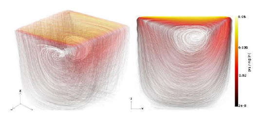
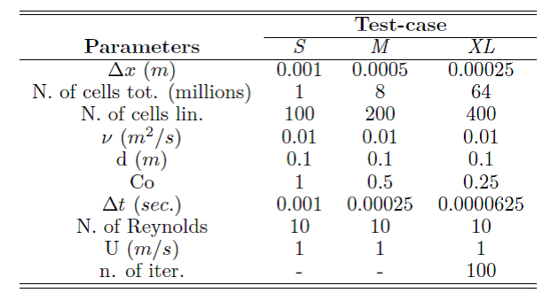

图1 3D方腔驱动流动测试算例

算法在icoFoam中实施，主要有2部分：求解动量方程和求解压力方程（或连续方程）。icoFoam的主要计算量在求解压力方程，即离散形式的Poisson方程。很多研究表明：使用合适的预处理的共轭梯度（CG）法是最有效率的。

现在考察PETSc库中其他求解器的求解效率，实施了4种求解算法：

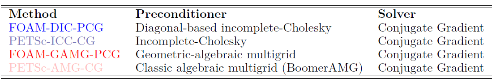

图2 OpenFOAM-PETSc使用的预处理/求解器对

迭代求解算法以2种方式运行：固定迭代次数和固定残差范数。

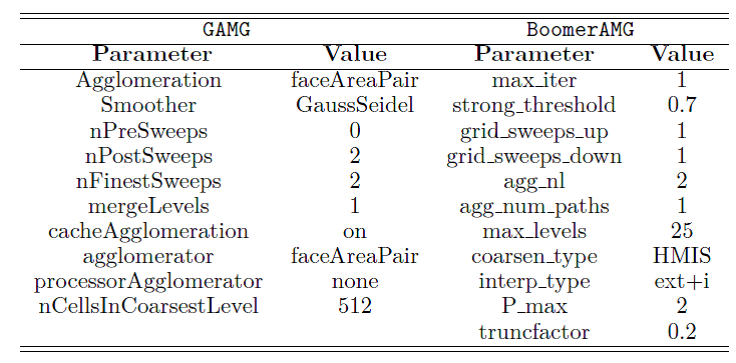

然后，在配置一定硬件的机器上，详细地评价了4种求解器的并行计算效率。

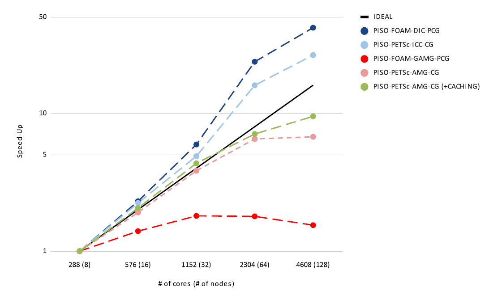

图3 线性求解器的并行计算效率评价

最终结论：PISO-PETSc-AMG-CG (+CACHING)是最佳策略。

但是：没有给出PETSc与原生求解器的计算效率的对比。

另外有2个论坛，关于评估PETSc4FOAM的效率：

1、PETSc真的能让OpenFOAM 如虎添翼吗？

https://zhuanlan.zhihu.com/p/270295177

simpleFoam/pitzDaily：PETSc只用了1 s，而原生的 pitzDaily 居然用了10 s

compressibleInterFoam/depthCharge3D：PETSc 用的时间更多，用了 7325
s，原生 OpenFOAM 用了 5294 s

2、[**Question about petsc4Foam
performance**](https://develop.openfoam.com/modules/external-solver/-/issues/18#top)

https://develop.openfoam.com/modules/external-solver/-/issues/18

simpleFoam/pitzDaily

未给出确定性的结论

### FVCOM (NH-PETSc, Lai)

Lai et
al.的2篇论文实现了FVCOM模式中，利用PETSc求解非静水压力的模块，但未给出并行效率评估：

Lai, et al. A nonhydrostatic version of FVCOM: 2. Mechanistic study of
tidally generated nonlinear internal waves in Massachusetts Bay.

### SCHISM

（1）SCHISM并行计算时，每个进程分配\<1K个节点，实现好的并行计算效率；（2）正压的并行计算尺度化低于斜压的并行计算；（3）拥有很多CPU物理核心的计算资源时，可使用PETSc求解器实现更好的尺度化；（4）OpenMP-MPI混合并行模式，最大化利用计算资源，实现最佳的并行计算效率，但SCHISM模式仅实现了水动力模块的混合并行；（5）混合并行计算效率超过没使用PETSc库的纯MPI并行（在很多CPU核心上）；（6）较少\~中等CPU核心计算时，使用PETSc库的纯MPI并行还是最佳方法。

### SUNTANS

A new Nonhydrostatic Parallel Coastal Ocean Model

为公布源码，也没有并行效率评价的文献。

### Firedrake

2个算例：方腔驱动流动、圆柱绕流。

使用3种Firedrake/PETSc中的求解器：MUMPS, MyPCD: FGMRES + PCD, FGMRES +
LSC预处理。

方腔驱动流动：

（1）较小计算规模

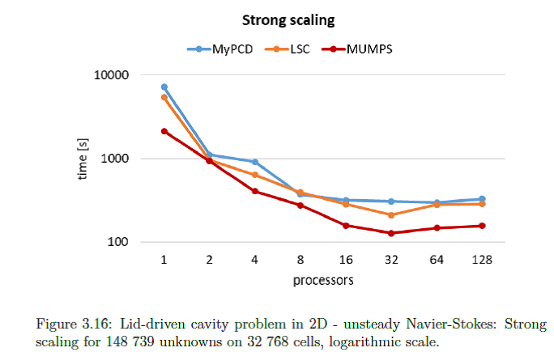

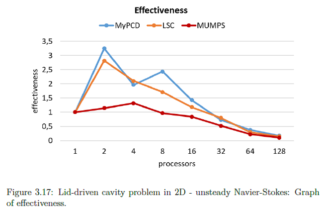

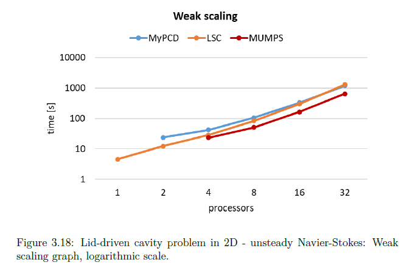

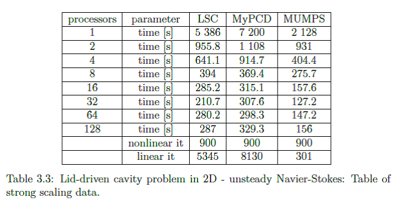

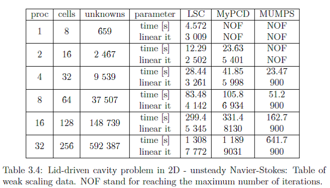

（2）较大计算规模

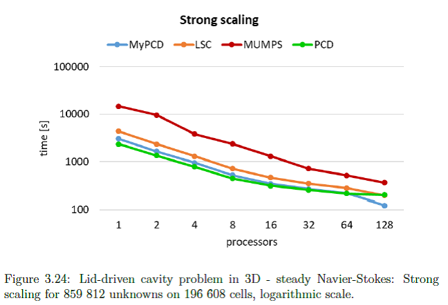

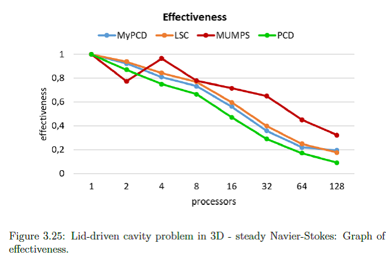

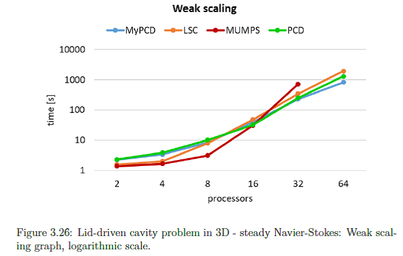

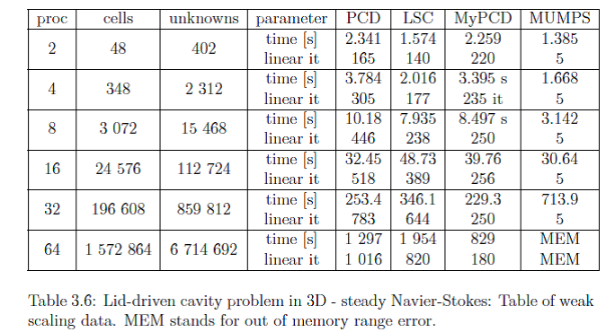

圆柱绕流

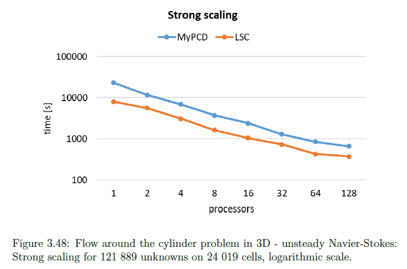

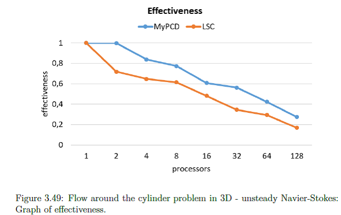

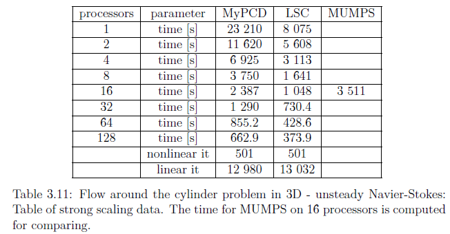

参考文献：

Erik Mitro. 2020. Efficient scalable solves for incompressible flow
problem. Mathematical Institute of Charles University.

## 3 AmgX-AmgCL-GPU并行

### PETibm (AmgX-Wrapper)

（1）求解Poisson方程

2D模拟, 25M个未知量, 4个 K20 GPU : 16核CPU =\> 加速比 5x

3D模拟, 25M个未知量, 8个 K20 GPU : 16核CPU =\> 加速比 13.2x
(需要8个GPU的设备内存)

2D模拟， 100M个未知量, 32个GPU集群：400核心 CPU =\> 加速比 17.6x

3D模拟， 50M个未知量, 32个GPU集群：400核心 CPU =\> 加速比 20.8x

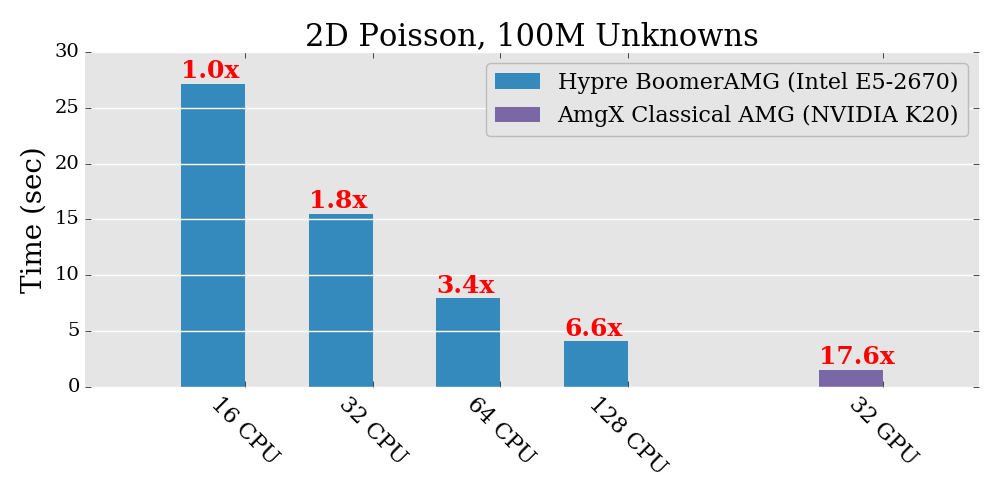

（2）实际模拟(flying snake)

3M 个网格点， 1个 K20 GPU : 12核心 CPU =\> 加速比 21x

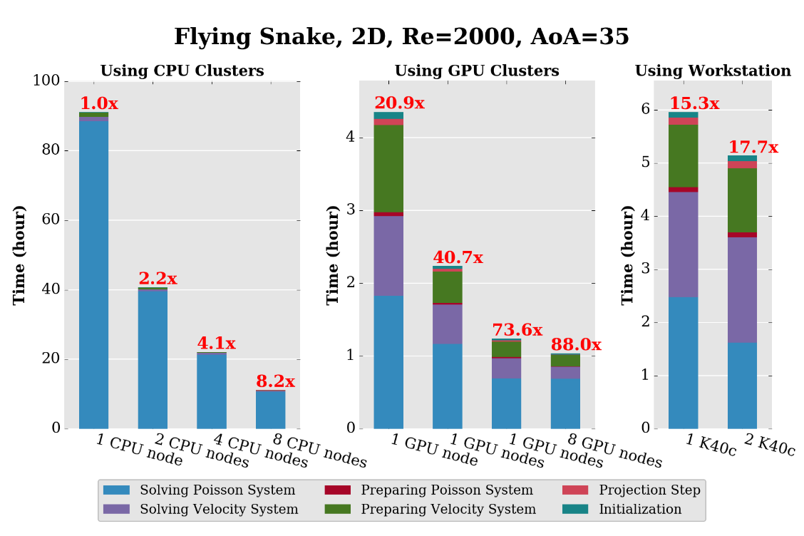

Chuang et al., 2018. PetIBM: toolbox and applications of the
immersed-boundary method on distributed-memory architectures. Journal of
Open Source Software, 3(25): 558. https://doi.org/10.21105/joss.00558

### OpenFOAM-PETSc-AmgX

以PETSc4FOAM的PRACE论文为基准，采用AmgX库后的GPU并行与之对比。

测试8M单元，迭代20步。收集分析总的计算耗时和在压力求解上的耗时。图3显示了相对FOAM-GAMG-PCG基准的压力求解的加速效果。

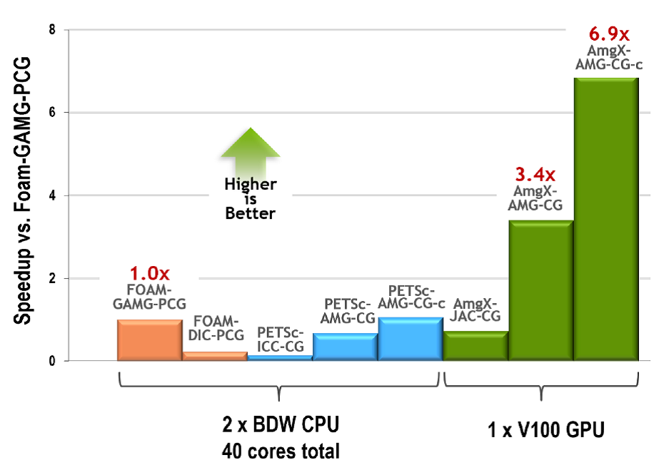

图3 Results of pressure solve comparisons for OpenFOAM, PETSc, and AmgX

求解器数值试验采用如下求解步骤和求解器设置：

-   CPU-only standard OpenFOAM procedures with FOAM-GAMG-PCG and
    FOAM-DIC-PCG

-   CPU-only solutions from PETSc through the PETSc4FOAM library with
    PETSc-ICC-CG,PETSc-AMG-CG, PETSc-AMG-CG-c (+caching, details
    described in \[13\])

-   GPU solutions from AmgX through the PETSc4FOAM library with
    AmgX-JAC-CG, AmgX-AMG-CG, AmgX-AMG-CG-c (+caching, details described
    in \[13\])

研究结果表明：CPU-only压力求解最佳策略是：PETSc-AMG-CG-caching，性能略超过FOAM-GAMG-PCG。PRACE论文结论是：PETSc-AMG-CG是最佳方法，特别是在多计算节点系统上。

最佳GPU加速策略是：使用AmgX-AMG-CG-caching求解器（使用AMG预处理的CG求解器，激活caching功能）。相对基准的FOAM-GAMG-PCG（在具有40个核心的CPU节点上），这种求解组合方式实现了\~7x的加速。这意味着求解压力方程，一张V100显卡，相比单socket的20核心的Broadwell
CPU架构，大约有14x的性能优势。

研究展望：（1）改进得到通用方法，拓展至分布式并行计算，实现OpenFOAM的工业级应用水准；（2）Strong-scaling算例，包括使用更大计算规模的测试。（3）使用基于Ampere架构的NVIDIA
A100 Tensor Core
GPU进一步测试AmgX求解性能，A100改进的内存带宽速率达到1555
GB/s，是V100卡的1.7倍。

### OPM-AmgCL

还有一个GPU多重网格求解器库AmgCL, 应用程序有OPM
(石油储层模拟器)。OPM的GPU并行模式，只有在单GPU下，使用cusparse (NVIDIA
CUDA)和rocsparse
(AMD)加速ILU分解的并行计算实现了较好的效果，但也只能相当8个MPI进程的冰箱效率。

表1并行效率评价表

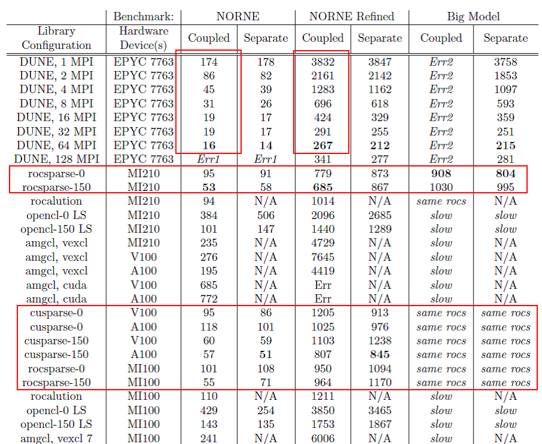

Qiu Tong Dong. 2023. An Evaluation and Comparison of GPU Hardware and
Solver Libraries for Accelerating the OPM Flow Reservoir Simulator.
https://arxiv.org/abs/2309.11488

## 4 总结

应用线性（非线性）方程系统的求解效率（使用自研的求解器或者使用PETSc库等），受到很多因素的影响，最终是否能实现最佳的并行加速，是一个复杂的问题。总结影响并行计算效率的因素包括：

（1）数据结构：结构网格和非结构网格，结构化数据的计算效率是超过非结构化数据的计算效率的；

（2）计算规模：不同的求解算法（+预处理），在不同计算规模下，并行效率不一样；

（3）不同的处理器架构：CPU与GPU不同，不同的CPU和GPU架构，也极大地影响并行加速效率；

（4）线性方程组求解算法与预处理方法的组合方式，还有求解器参数设置(最重要了)；

（5）系数矩阵：稠密还是稀疏，稀疏矩阵的存储格式(CSR,
COO等)、系数矩阵的集合（与求解过程的耗时占比一般是1:9）。
