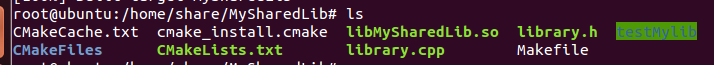
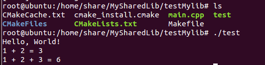

# Linux下cmake生成SO库的使用实例

1、创建我的共享库：MySharedLib

## CMakeLists.txt

cmake_minimum_required(VERSION 2.8)

project(MySharedLib)

\# C++11 编译

set(CMAKE_CXX_STANDARD 11)

#创建共享库

add_library(MySharedLib SHARED library.cpp library.h)

## library.h

#ifndef MYSHAREDLIB_LIBRARY_H

#define MYSHAREDLIB_LIBRARY_H

// 打印 Hello World!

void hello();

// 使用可变模版参数求和

template \<typename T\>

T sum(T t)

{

return t;

}

template \<typename T, typename \...Types\>

T sum(T first, Types \... rest)

{

return first + sum\<T\>(rest\...);

}

#endif

## library.cpp

#include \<iostream\>

#include \"library.h\"

void hello() {

std::cout \<\< \"Hello, World!\" \<\< std::endl;

}

在CMakeLists.txt所在的目录中：

cmake ./

make

{width="5.768055555555556in"
height="0.5265223097112861in"}

## so 共享库的使用

（被可执行项目调用）创建一个名为test的可执行项目

CMakeLists.txt

#cmake版本

cmake_minimum_required(VERSION 2.8)

#项目名：test

project(test)

\# C++11 编译

set(CMAKE_CXX_STANDARD 11)

#指定生成的版本

#set(CMAKE_BUILD_TYPE DEBUG)

#指定编译选项

#set(CMAKE_CXX_FLAGS_DEBUG \"-g -Wall\")

\# 指定头文件路径

set(INC_DIR /home/share/MySharedLib)

\# 库文件路径 指定静态和动态文件目录

set(LIB_DIR /home/share/MySharedLib)

#指定头文件目录

include_directories(\${INC_DIR})

#链接库路径

link_directories(\${LIB_DIR})

#链接库，MySharedLib为库名

link_libraries(MySharedLib)

#生成目标文件

add_executable(test main.cpp)

#指定源代码

#set(SOURCE_FILES main.cpp)

#add_executable(BoostCoroutineDemo \${SOURCE_FILES})

\# 链接 库文件 MySharedLib 库

target_link_libraries(test MySharedLib)

#target_link_libraries(BoostCoroutineDemo libboost_system.a
libboost_thread.a)

## main.cpp

#include \<iostream\>

#include \"library.h\"

using std::cout;

using std::endl;

int main() {

hello();

cout \<\< \"1 + 2 = \" \<\< sum(1,2) \<\< endl;

cout \<\< \"1 + 2 + 3 = \" \<\< sum(1,2,3) \<\< endl;

return 0;

}

cd testMylib/

cmake ./

make

./test

{width="5.272876202974628in"
height="1.3006955380577427in"}
