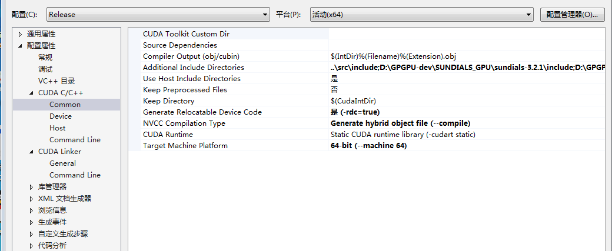
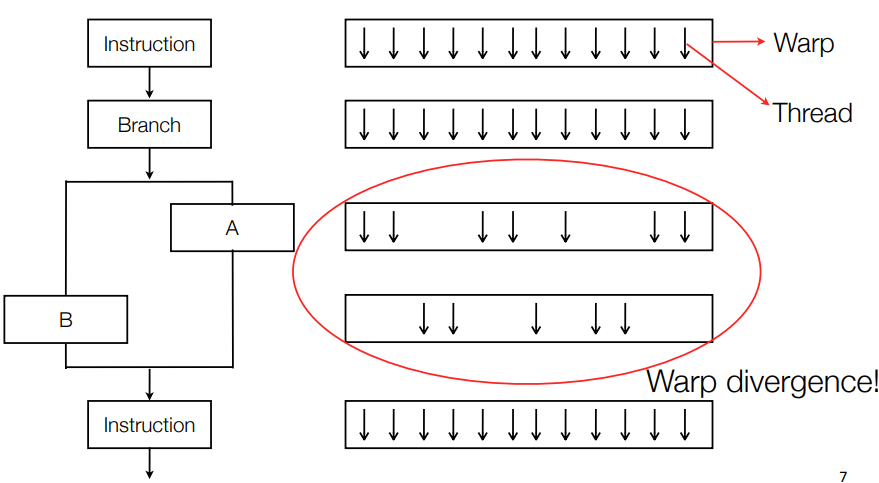
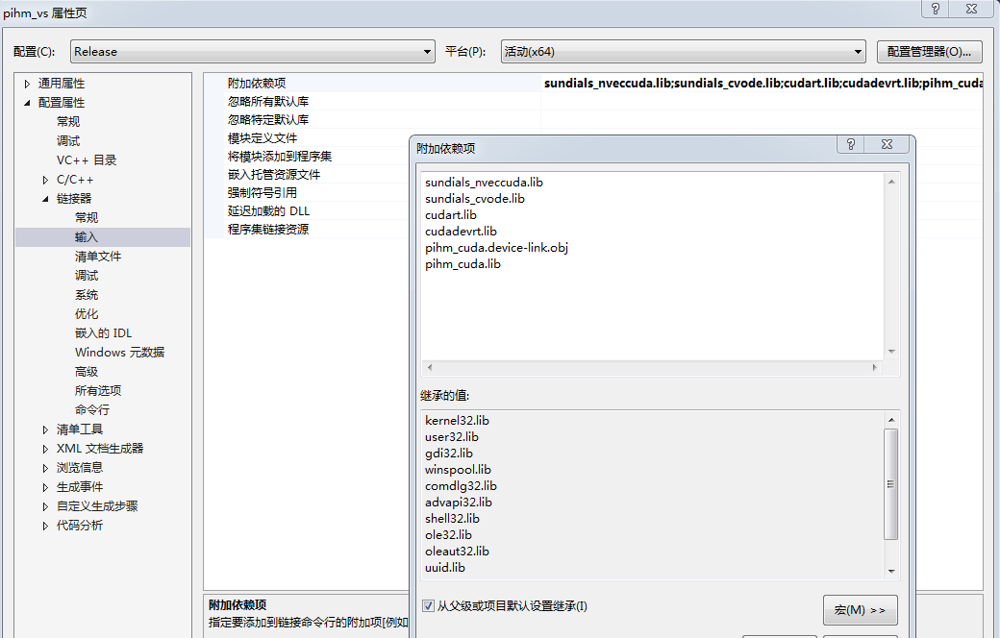

# Separate Compilation and Linking of CUDA C++ Device Code

Managing complexity in large programs requires breaking them down into
components that are responsible for small, well-defined portions of the
overall program. Separate compilation is an integral part of the C and
C++ programming languages which allows portions of a program to be
compiled into separate objects and then linked together to form an
executable or library. Developing large and complex GPU programs is no
different, and starting with CUDA 5.0, separate compilation and linking
are now important tools in the repertoire of CUDA C/C++ programmers.

In this post, we explore separate compilation and linking of device code
and highlight situations where it is helpful. In the process, we'll walk
through a simple example to show how device code linking can let you
move existing code to the GPU with minimal changes to your class
hierarchy and build infrastructure.

One of the key limitations that device code linking lifts is the need to
have all the code for a GPU kernel present when compiling the kernel,
including all the device functions that the kernel calls. As C++
programmers, we are used to calling externally defined functions simply
by declaring the functions' prototypes (or including a header that
declares them).

## Managing Complexity with Separate Compilation

The common approach to organizing and building C++ applications is to
define all member functions of a single class in one or more .cpp source
files, and compile each .cpp source file into a separate .o object file.
Other classes and functions may call these member functions from
anywhere in the program by including the class header file; the function
implementation is not needed to compile another function that calls it.
After compiling all code, the linker connects calls to functions
implemented in other files as part of the process of generating the
executable.

Let's imagine a very simple example application which has two classes:
a particle class and a three-dimensional vector class, v3, that it uses.
Our main task is moving the particle objects along randomized
trajectories. Particle filters and Monte Carlo simulations frequently
involve operations of this sort. We'll use a CUDA C++ kernel in which
each thread calls particle::advance() on a particle.

Using the conventional C/C++ code structure, each class in our example
has a .h header file with a class declaration, and a .cpp file that
contains class member function definitions. We compile each .cpp file
separately into its own .o file, which the linker combines into an
executable. Figure 1 shows the structure of our example application.

{width="5.106877734033246in"
height="3.479701443569554in"}

Figure 1: The conventional C++ build structure in our simple example
app.

This time-honored project structure is highly desirable for the purposes
of maintaining abstraction barriers, class reuse, and separate units in
development. It also enables partial rebuilding, which can greatly
reduce compilation time, especially in large applications where the
programmer modifies only a few classes at a time.

The following two listings show the header and implementation for our 3D
vector class, v3.

In our example, particle::advance() relies on two helper routines from
the vector class: v3::normalize() and v3::scramble(). The following two
listings show the particle class header and source. We'll see that
device object linking enables us to keep our code organized in a
familiar way while satisfying the inter-class dependency.

Before CUDA 5.0, if a programmer wanted to call particle::advance() from
a CUDA kernel launched in main.cpp, the compiler required
the main.cpp compilation unit to include the implementation
of particle::advance() as well any subroutines it calls
(v3::normalize() and v3::scramble() in this case). In complex C++
applications, the call chain may go deeper than the two-levels that our
example illustrates. Without device object linking, the developer may
need to deviate from the conventional application structure to
accommodate this compiler requirement. Such changes are difficult for
existing applications in which changing the structure is invasive and/or
undesirable.

Using object linking of device code, the compiler can generate device
code for all functions in a .cpp file, store it in a .o file, and then
link device code from multiple .o files together in the same way that we
are used to linking CPU code. As a result, the build structure does not
change much, if at all, and changes to utility classes like v3 are
minimal.

## Utility Code for Host and Device

The source changes necessary to call v3 and particle member functions
from a GPU kernel are minimal. The only required change
in v3.h, v3.cpp, particle.h, and particle.cpp is to
add \_\_host\_\_ and \_\_device\_\_ decorators to member functions that
device code calls. The implementations are otherwise completely
unchanged from their CPU-only version.

The \_\_host\_\_ \_\_device\_\_ decorations indicate to nvcc to compile
these routines into both CPU code and device-callable GPU code. You can
use \_\_host\_\_ or \_\_device\_\_ in isolation as well.
Using \_\_host\_\_ alone tells the compiler to generate only a CPU
version of this routine. This usage is unnecessary, as this is the
default behavior. Using \_\_device\_\_ alone tells the compiler to
generate only GPU code for a function. This is useful if you know this
routine will never be needed by the host, or if you want to implement
your function using operations specific to the GPU, such as fast math or
texture unit operations. If you call a \_\_host\_\_ function from the
device or a \_\_device\_\_ function from the host, the compiler will
report an error.

The example code in main.cpp, shown below, generates particles on the
host, copies them to the GPU and then executes the advance operations in
a CUDA kernel. The program then copies the particles back and computes
and prints a summary of the total distance traveled by all particles.
For each of 100 steps, the program generates a random total distance on
the CPU and passes it as an argument to the kernel.

You can get [the complete example on
Github](https://github.com/parallel-forall/code-samples/tree/master/posts/separate-compilation-linking).

## Building and running

Using make will work on this project so long as you have the CUDA 5.0 or
later compiler in your path and a CUDA capable device with SM version
2.0 or later in your system. The following listing shows the contents of
the Makefile.

objects = main.o particle.o v3.o

all: \$(objects)

nvcc -arch=sm_20 \$(objects) -o app

%.o: %.cpp

nvcc -x cu -arch=sm_20 -I. -dc \$\< -o \$@

clean:

rm -f \*.o app

When you run app you can optionally specify two command line arguments.
The first is the number of particles to create and run (default is 1
million particles).

./app \<numParticles\>

The second number is a random seed, to generate different sequences of
particles and distance steps.

./app \<numParticles\> \<randomSeed\>

In the absence of arguments, the program uses the default random seed.

## 使用设备代码连接

除了\_\_host\_\_、\_\_device\_\_修饰符和CUDA核函数外，CUDA代码与CPU版本的代码的唯一区别在于：使用nvcc作为编译器和-dc编译参数。-dc参数告诉nvcc生产用于之后连接的设备代码。需要注意的是：
--arch=sm_20在
-dc参数前面，因为不是所有的SM代码变体都支持设备连接，nvcc需要知道它是SM架构兼容的代码。

在连接命令中，删掉
-dc，告诉nvcc连接object。当nvcc传递到CPU与GPU目标代码时，这将自动连接。

Finally, you may not recognize the option --x cu. This option tells nvcc
to treat the input files as .cu files containing both CPU and GPU code.
By default, nvcc treats .cpp files as CPU-only code. This option is
required to have nvcc generate device code here, but it is also a handy
way to avoid renaming source files in larger projects. (A side note: if
you #include \<cuda_runtime.h\> in a .cpp file and compile it with a
compiler other than nvcc, \_\_device\_\_ and \_\_host\_\_ will be
defined to nothing to enable portability of this code to other
compilers!)

## 高级用法：使用不同的连接器

当使用nvcc连接时，不需要做特别的事情：将编译器换成nvcc，将处理接下来的必要步骤。

但是，选用其他编译器，如g++，做最终的连接。因为CPU编译器不知道如何连接CUDA设备代码，必须增加一步，使用nvcc连接CUDA设备代码：使用nvcc参数
-dlink。例子中，采用：

nvcc --arch=sm_20 --dlink v3.o particle.o main.o --o gpuCode.o

这一步将连接所有的[设备代码]{.mark}，置于gpuCode.o.
注意：[该步不连接CPU目标代码]{.mark}。实际上，在v3.o, particle.o,
main.o中的CPU目标代码被discard。为完成连接，生成可执行程序，可以使用g++:

g++ gpuCode.o main.o particle.o v3.o --lcudart --o app

我们再次给g++所有的目标文件，因为它需要CPU目标代码（没有包含在gpuCode.o中）。[设备代码存储在原始的目标文件(v3.o,
particle.o,
main.o)中]{.mark}，这些设备代码[不会]{.mark}与在gpuCode.o中的代码发生冲突。g++忽略了设备代码，因为g++不知道如何连接它，在gpuCode.o中的设备代码已经得到连接，准备运行了。这种有意的忽略在大型文件编译时非常有用，其中涉及的中间目标文件可能同时包含CPU和GPU代码。在该种情况下，我们让GPU和CPU连接器执行各自的任务，注意到：CPU连接器总是最后得到执行。当我们使用nvcc用于连接时，CUDA运行时API库是自动连接的，但当我们使用其他的连接器时，我们必须显式地连接它(-lcudart)。

## 警告

There are some limitations with device code linking. As mentioned
previously, not all SM versions support device object linking; it
requires sm_20 or higher, and CUDA 5.0 or newer.

Performance of linked device code may also be a bit lower than the
performance of device code built with full code path visibility at
compile time. When both the function and the call site code are known at
compile time, the compiler can optimize the function call, but when the
call site and the function are in different compilation units, the
compiler must fully adhere to an ABI (Application Binary Interface),
which prevents this type of optimization. Performance effects are
variable, but CUDA 5.5 and 6.0 both contain notable improvements in the
performance of applications using device code linking.

## Conclusion: Device Code Linking is a Powerful Tool

The primary advantage of device code linking is the availability of more
traditional code structures, especially in C++, for your application.
Device code linking dramatically eases the process of compiling
complicated C++ composition chains for the GPU and enabling their use in
GPU kernels. For example, we have used this feature to enable GPU
acceleration in a large C++ code with dozens of classes organized in the
typical fashion shown here. In that case, the call chain routinely went
through tens of classes and we compiled over 200 member functions for
the device, all used in a single kernel. Using device code linking, we
maintained the existing C++ structure while the computational load was
parallelized on the GPU. Thanks to device object linking, this project
took only a matter of days to port.

Using device code linking can allow you to have the best of both worlds:
maintain the existing structure of your application, have control over
each build and link step, and make use of the most powerful processors
on the planet in your application.

## 编译PIHM_cuda程序的经验总结

基于以上的知识学习，成功编译了C语言和CUDA语言的混合程序。总结如下：

1、开始时，编写了单个文件的cuda设备程序，包括：ode_cuda.cu,
hydrol_elem.cu,
hydrol_river.cu等。为编译方程，都合并到ode_cuda.cpp一个文件中。

2、使用nvcc编译器，编译ode_cuda.cpp。

设置：

{width="5.364377734033246in"
height="2.202772309711286in"}

{width="5.446555118110236in"
height="1.8519061679790025in"}

生成的设备代码是：ode_cuda.device-link.obj

生成的CPU代码在：ode_cuda.cpp.obj或phim_cuda.lib

3、再使用Visual Studio
2013的cl.exe连接其他的c程序和ode_cuda.cpp用nvcc编译的分别包含CPU和GPU代码的obj文件。

{width="5.524014654418198in"
height="3.5248436132983376in"}
