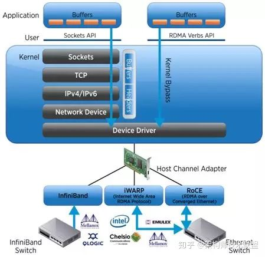
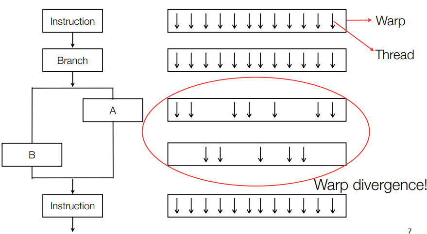
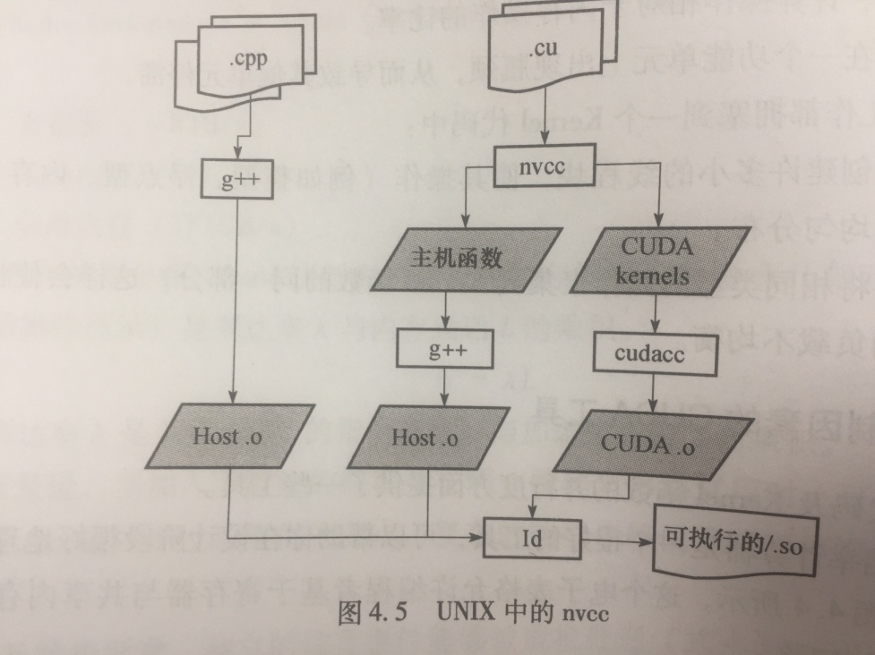
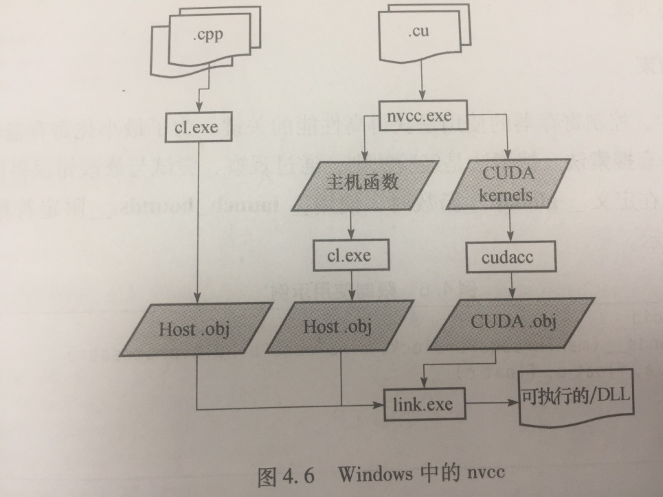

# CUDA C编程的基本语法

[GPGPU编程的3条法则：]{.mark}

1、将数据放入并始终存储于GPU；

2、交给GPU尽可能多的任务；

3、注重GPU上的数据重复利用，以避免带宽限制。

## CUDA的头文件

[cutil_inline.h,cutil_gl_inline.h,
cutil_math.h]{.mark}等头文件，但是5.0貌似没有这些头文件。Nvidia公司不支持这些技术范围。

Nvidia公司支持的情况，正式的头文件是：

// CUDA includes

#include \<cuda_runtime.h\> // 包含CUDA API

// includes, project, samples代码中提供的帮助API

#include \<helper_cuda.h\>

#include \<helper_functions.h\> //
C/C++的CUDA帮助函数，主要是计时、字符串读入和图像对比等。

[调用CUDA函数时，一般使用checkCudaErrors]{.mark}（在helper_cuda.h中）

void check_cuda_error(cudaError error)

{

if (error != cudaSuccess)

{

fprintf(stderr, \"Error: %s \\n\", cudaGetErrorString(error));

}

}

## 基本术语

核函数：\_\_global\_\_ void kernel(void){}

执行核函数：kernel\<\<\<1, 1\>\>\>(); // 1,
1线程块数目，线程块中的线程数目

传递参数：

int c;

int \*dev_c;

cudaMalloc((void \*\*)&dev_c, sizeof(int) ) ); // 在设备上分配空间

add\<\<\<1,1\>\>\>(2, 7, dev_c); // GPU上2个数相加，给dev_c

cudaMemCpy(&c, dev_c, sizeof(int), cudaMemCpyDeviceToHost) ); // GPUCPU

还有：cudaFree()

查询设备：cudaGetDeviceCount(& count) );

cudaGetDeviceProperties(&prop, i)); // 结构体prop包含各GPU的很多信息

## 驱动API和运行时API

两种API很相似，大多数情况下可交互使用。但是，存在一些差别需要注意。

### 复杂度与控制 {#复杂度与控制 .标题3}

The runtime API eases device code management by providing implicit
initialization, context management, and module management. This leads to
simpler code, but it also lacks the level of control that the driver API
has.

In comparison, the driver API offers more fine-grained control,
especially over contexts and module loading. Kernel launches are much
more complex to implement, as the execution configuration and kernel
parameters must be specified with explicit function calls. However,
unlike the runtime, where all the kernels are automatically loaded
during initialization and stay loaded for as long as the program runs,
with the driver API it is possible to only keep the modules that are
currently needed loaded, or even dynamically reload modules. The driver
API is also language-independent as it only deals with cubin objects.

### 上下文管理 {#上下文管理 .标题3}

Context management can be done through the driver API, but is not
exposed in the runtime API. Instead, the runtime API decides itself
which context to use for a thread: if a context has been made current to
the calling thread through the driver API, the runtime will use that,
but if there is no such context, it uses a \"primary context.\" Primary
contexts are created as needed, one per device per process, are
reference-counted, and are then destroyed when there are no more
references to them. Within one process, all users of the runtime API
will share the primary context, unless a context has been made current
to each thread. The context that the runtime uses, i.e, either the
current context or primary context, can be synchronized with
cudaDeviceSynchronize(), and destroyed with cudaDeviceReset().

## 2D网格的线程和线程块

\_\_global\_\_ void kernel(unsigned char \*ptr)) {

// 将threadUdx/BlockIdx映射到像素位置

int x=blockIdx.x;

int y= blockIdx.y;

...

}

int main(void){

...

dim3 grid(DIM, DIM);

kernel\<\<\<grid, 1\>\>\>(...); //

...

}

再比如：

dim3 blocks(DIM/16, DIM/16);

dim3 threads(16, 16);

kernel\<\<\<blocks, threads\>\>\>(...);

...

## CUDA存储器

{width="3.8383333333333334in"
height="3.6320002187226597in"}

## 共享内存

共享内存有[48 KB]{.mark}的空间。

共享内存变量：加上\_\_shared\_\_修饰语。

线程同步：\_\_syncthreads();

## 常量内存

常量内存：保存在核函数执行期间不会发生改变的数据，NVIDIA硬件提供了[64
KB]{.mark}的常量内存。在某些情况下，用常量内存代替全局内存，可有效减少内存带宽。

例如：Sphere \*s; 修改为常量内存变量，为：

\_\_constant\_\_ Sphere s\[SPHERES\]; // 静态地分配空间

然后，cudaMemCpyToSymbol(s, temp_s, sizeof(Sphere)\*SPHERES) );
//变量将自动复制到常量内存中。

### [CUDA事件及计时]{.mark} {#cuda事件及计时 .标题3}

cudaEvent_t start, stop;

cudaEventCreate(&start);

cudaEventCreate(&stop);

cudaEventRecord( start, 0);

// 在GPU上执行一些计算

cudaEventRecord( stop, 0);

cudaEventSynchronize( stop);

float elapsedTime;

cudaEventElaspedTime(&elapsedTime, start, stop);

printf("Elasped time : %3.1f ms \\n", elapsedTime);

cudaEventDestroy(start);

cudaEventDestroy(stop);

## 纹理内存

纹理内存能够减少对内存的请求并提供更高效的内存带宽，是专门对那些在内存访问模式中存在[大量空间局部性]{.mark}的[图形应用程序]{.mark}设计的。

对[笛卡尔网格]{.mark}模型的编程很有效。

// 声明为texture类型

texture\<float\> texConstSrc;

texture\<float\> texIn;

texture\<float\> texOut;

cudaMalloc( (void\*\*)& data.dev_constSrc, imagesize) );

cudaBindTexture(NULL, texConstSrc, data.dev_constSrc, imagesize) );

...

tex1Dfetch(texIn, top));

...

cudaUnbindTexture(texIn);

## 图形互操作

CUDA-OpenGL/Direct3D

## 原子操作

共享内存原子操作以及全局内存原子操作

应尽量避免，但某些情况下需要使用原子操作，例如有成千上万个线程同时修改同一个内存地址，此时大规模的并行机器反而会带来负担。

## 流

可分页主机内存(pagable memory)

固定内存（pinned memory）

cudaMalloc()和cudaHostAlloc()

### CUDA事件 {#cuda事件 .标题3}

cudaEventCreate(&start);

cudaEventRecord( start, 0); // 第2个参数可用于指定插入事件的流(stream)

### 使用单个CUDA流 {#使用单个cuda流 .标题3}

设备要支持设备重叠(overlap)

cudaStream_t stream; // 初始化流

cudaStreamCreate( &stream) );

// 在GPU上分配内存

cudaMalloc(...);

// 分配由流使用的页锁定内存

cudaHostAlloc(...);

cudaMemcpyAsync(...); // 异步方式复制数据；cudaMemCpy是同步方式

cudaStreamSynchronize(stream); // 将计算结果从页锁定内存复制到主机内存

cudaStreamDestroy(stream); //销毁流

### 使用多个CUDA流 {#使用多个cuda流 .标题3}

cudaStream_t stream0, stream1; // 初始化流

cudaStreamCreate( &stream0) );

cudaStreamCreate( &stream1) );

...

注意：这些操作到流中的顺序将对内存复制和核函数的执行的重叠情况产生影响，应该采用[宽度优先或轮询方式]{.mark}将工作分配到流。尽管这种方式有违直觉。

cudaDeviceSynchronize()会阻塞当前程序的执行，直到所有任务都处理完毕。

cudaThreadSynchronize()的功能和cudaDeviceSynchronize()基本上一样,但在新版本中已经被"废除"了。

cudaStreamSynchronize()和上面的两个函数类似，这个函数带有一个参数，cuda流ID，它只阻塞那些cuda流ID等于参数中指定ID的那些cuda例程，对于那些流ID不等的例程，还是异步执行的。

## 单节点上多GPU的CUDA C

### 零拷贝主机内存 {#零拷贝主机内存 .标题3}

cudaHostAlloc(..., cudaHostAllocMapped); //
[cudaHostAllocMapped]{.mark}参数实现零拷贝，除了复制主机与GPU之间的内存以外，还可以在CUDA
C核函数中直接访问这种主机内存，这种内存不需要复制到GPU，也称为[零拷贝内存]{.mark}。

1、cudaHostAlloc(..., cudaHostAllocWriteCombined \|
cudaHostAllocMapped);

在使用cudaHostAllocMapped来分配主机内存后，就可以从GPU中访问这块内存了。但是，GPU的虚拟内存空间与CPU是不同的，因此在GPU上访问它们与在CPU上访问它们有着不同的地址。

调用cudaHostAlloc(
)将返回这块内存在CPU上的指针，因此需要调用cudaHostGetDevicePointer(
)来获得这块内存在GPU上的有效指针。

2、cudaHostGetDevicePointer(&dev_a, a, 0);

3、cudaThreadSynchronize(); // 将GPU与CPU同步

4、cudaFreeHost(a);

### 零拷贝内存的性能 {#零拷贝内存的性能 .标题3}

副作用：每个固定内存都会占用系统的可用物理内存，这最终将降低系统的性能。

当输入内存和输出内存只能使用一次时，那么在独立GPU上使用零拷贝内存将带来性能提升。

### 使用线程绑定多个GPU {#使用线程绑定多个gpu .标题3}

本示例的多GPU计算，[均为涉及GPU间的数据交换。]{.mark}

一个线程绑定一个GPU。

可移动的固定内存

如果某线程分配的固定内存，那么这些内存只是对于分配它们的线程来说是固定的。如果多线程共享指向这块内存的指针，那么其他线程将把这块内存视为标准的、可分页的内存。

[cudaHostAlloc()]{.mark}使用一个新的标志[cudaHostAllocPortable]{.mark}，与其他标识组合使用，实现可移动的固定内存。

### Peer to Peer访问 {#peer-to-peer访问 .标题3}

首先，启用多设备的点对点访问：

for (i=0;i\<ngpus;i++){

cudaSetDevice(i);

for( j=0;j\<ngpus;j++){

int peer_access_available=0;

cudaDeviceCanAccessPeer(&peer_access_available, i, j);

if(peer_access_available) {

cudaDeviceEnablePeerAccess(j,0);

}else{

}

}

}

单向的点对点内存复制

双向的点对点内存复制

使用UVA的点对点内存访问：cudaHostAlloc()

## 集群上的多GPU

### 消息传递接口（MPI） {#消息传递接口mpi .标题3}

ret=MPI_Init(&argc, &argv);

// if(ret!=MPI_SUCCESS) {MPI_Abort(MPI_COMM_WORLD, ret);}

MPI \_Comm_size(MPI_COMM_WORLD, &process);

MPI_Comm_rank(MPI_COMM_WORLD, &rank);

MPI_Finalize();

主从模式：if(rank==0){ }else{ }

点对点通信：MPI_Send()和MPI_Recv()

### MPI通信机制 {#mpi通信机制 .标题3}

MPI根据网络通信硬件，利用优化的数据通信路径进行消息的发送和接收。

例如，运行于同一个计算节点的MPI程序，是通过更高速的共享内存而非物理网卡（NIC）进行通信的。

最小化数据移动量成了MPI硬件制造商和支持库开发者的首要目标。

加速MPI的GPUDirect技术，思想非常简单：[将指针指向的GPU数据传递给MPI_Send()；将接收到的数据移入MPI_Recv()参数中指针所指的GPU内存空间。]{.mark}这个过程中，不使用其他的数据移动方式，也不依赖于其他的处理器。如下图。尽管在技术概念上很简单，但是其实现却需要制造商、驱动程序、操作系统和硬件之间的协作。

{width="4.224060586176728in"
height="2.881897419072616in"}

Infiniband
(IB)是一种常用的高速低延迟的通信链路。Mellanox是生产Infiniband产品的知名生产商。

NVIDIA列出了[对Linux内核、NVIDIA Linux CUDA驱动和Mellanox
Infiniband驱动的改动。]{.mark}

-   内核修改：支持在不同的驱动间共享页锁定内存页面；Linux内核内存管理器（MM）允许在Nvidia和Mellanox驱动之间共享主机内存，可实现零拷贝。

-   Nvidia驱动的修改：CUDA支持申请的缓冲区由Nvidia驱动管理；MM允许Infiniband驱动访问，并将它们用于传输。

-   Mellanox
    > OFED驱动的修改：修改Infiniband驱动的内存查询功能，使其能够使用新的Linux内核MM
    > API，并与[Telsa驱动共享]{.mark}内存；注册特定的回调，并允许其他驱动共享内存。

这些修改构成了缓冲区发送和接收操作的直接数据传输路径，并为MPI带来了[30%的性能提升]{.mark}。

设置环境变量CUDA_INC_INTEROP=1，这样驱动程序使用另一条执行路径处理cudaMallocHost()，以兼容IB驱动程序。

在运行分布式计算时，网络带宽是一项挑战。

还有平衡率。

## Warp分歧（warp divergence）

GPGPU设备是SIMT设备。因为Warp内各条件字句之间是串行执行的，所以条件子句（if语句）会极大地降低流多处理内部的执行性能。若条件分支中代码路径过长，会导致执行速度下降2倍，N层嵌套分支会使执行速度降低2^N^倍。一些极端情况下，线程束发散将导致并行计算效率的显著降低（约32倍）：

（1）一个线程需要执行代价高昂的计算任务；

（2）每个线程执行独立的任务。

所有线程都计算这个逻辑谓语(true or
false)和2个指令，称为[Warp分歧]{.mark}。

线程束(warp)中的不同线程需要做不同的事情：

\_global\_ void function(void){

if(x\<0.0)

z=x-2.0;

else

z=sqrt(x);

}

{width="5.368851706036746in"
height="2.9518700787401575in"}

解决方法例如，求解带边界条件的PDE：

-   如果边界条件[cheap(边界节点少)]{.mark}，所有节点的循环，需要边界条件的分支(branch)；

-   如果边界条件[expensive(边界节点多)]{.mark}，第1个核函数做[内部节点]{.mark}循环，第2个核函数[计算边界点]{.mark}。

可以参考\<GPU Computing
Gems\>一书的应用示例来处理不规则数据结构及Warp分歧。

# 多GPU设备系统

## 设备枚举

一个主机系统可以拥有多个设备。下列代码演示了如何枚举这些设备，查询它们的属性以及确定激活的设备数量。

int deviceCount;

cudaGetDeviceCount(&deviceCount);

int device;

for (device = 0; device \< deviceCount; ++device) {

cudaDeviceProp deviceProp;

cudaGetDeviceProperties(&deviceProp, device);

printf(\"Device %d has compute capability %d.%d.\\n\",

device, deviceProp.major, deviceProp.minor);

}

## 设备选取

主机线程可以通过cudaSetDevice()在任何时刻设置它想利用的设备。设备内存的分配和核函数的启动都会在当前设置的设备上；流与事件的创建也是发生在当前所设置的设备上。如果没有显式的调用设置设备的函数，则默认的当前设备是0。

size_t size = 1024 \* sizeof(float);

cudaSetDevice(0); // Set device 0 as current

float\* p0;

cudaMalloc(&p0, size); // Allocate memory on device 0

MyKernel\<\<\<1000, 128\>\>\>(p0); // Launch kernel on device 0

cudaSetDevice(1); // Set device 1 as current

float\* p1;

cudaMalloc(&p1, size); // Allocate memory on device 1

MyKernel\<\<\<1000, 128\>\>\>(p1); // Launch kernel on device 1

## 流与事件的行为

如果一个流并不在相对应的设备上，在其中启动核函数则会会失败。但是内存的拷贝则总是会成功。

cudaSetDevice(0); // Set device 0 as current

cudaStream_t s0;

cudaStreamCreate(&s0); // Create stream s0 on device 0

MyKernel\<\<\<100, 64, 0, s0\>\>\>(); // Launch kernel on device 0 in s0

cudaSetDevice(1); // Set device 1 as current

cudaStream_t s1;

cudaStreamCreate(&s1); // Create stream s1 on device 1

MyKernel\<\<\<100, 64, 0, s1\>\>\>(); // Launch kernel on device 1 in s1

// This kernel launch will fail:

MyKernel\<\<\<100, 64, 0, s0\>\>\>(); // Launch kernel on device 1 in s0

cudaEventRecord()对于输入事件和输入流并不在相应的设备上则会调用失败。

cudaEventElapsedTime()对于输入的两个时间在不同的设备上会发生调用失败。

cudaEventSynchronize()和cudaEventQuery()对于及时输入事件并不关联当前设备也能成功。

cudaStreamWaitEvent()在输入流和输入事件关联不同的设备情况下也能成功调用。因此它常被用来同步不同设备。\
每个设备都有自己的默认流，所以设备上的默认流中的命令执行时无序的或者与其他设备上的默认流中的命令并发执行。

## 点对点内存访存

当应用程序以64位的进程运行，Tesla系列中计算力高于2.0的设备之间可以互相访问对方的内存。当cudaDeviceCanAccessPeer()返回True时则表示设备之间支持点对点的内存访存。内存的点对点访存这一特性必须通过cudaDeviceEnablePeerAccess()来激活。在激活non-NVSwitch的系统上，每个设备可以支持系统最大允许的8个点连接。所有的设备使用同一个统一地址空间。因此，同一个地址可以被不同设备使用以访问同一块内存。

cudaSetDevice(0); // Set device 0 as current

float\* p0;

size_t size = 1024 \* sizeof(float);

cudaMalloc(&p0, size); // Allocate memory on device 0

MyKernel\<\<\<1000, 128\>\>\>(p0); // Launch kernel on device 0

cudaSetDevice(1); // Set device 1 as current

cudaDeviceEnablePeerAccess(0, 0); // Enable peer-to-peer access

// with device 0

// Launch kernel on device 1

// This kernel launch can access memory on device 0 at address p0

MyKernel\<\<\<1000, 128\>\>\>(p0);

当所有设备使用[统一内存空间]{.mark}时，可以使用常规的内存拷贝函数来进行跨设备的内存拷贝。否则，需要使用cudaMemcpyPeer()、cudaMemcpyPeerAsync()、cudaMemcpy3DPeer()和cudaMemcpy3DPeerAsync()来进行设备之间内存的拷贝。

cudaSetDevice(0); // Set device 0 as current

float\* p0;

size_t size = 1024 \* sizeof(float);

cudaMalloc(&p0, size); // Allocate memory on device 0

cudaSetDevice(1); // Set device 1 as current

float\* p1;

cudaMalloc(&p1, size); // Allocate memory on device 1

cudaSetDevice(0); // Set device 0 as current

MyKernel\<\<\<1000, 128\>\>\>(p0); // Launch kernel on device 0

cudaSetDevice(1); // Set device 1 as current

cudaMemcpyPeer(p1, 1, p0, 0, size); // Copy p0 to p1

MyKernel\<\<\<1000, 128\>\>\>(p1); // Launch kernel on device 1

设备之间的内存拷贝在它之前的所有命令完成之前不会开始，并且在拷贝完成之前其后的命令也不会开始执行。与正常的流行为一致的是，设备之间的异步内存拷贝会与其他流之间的拷贝与核函数进行overlap。

需要指出的是，如果点对点的访存通过接口的调用激活之后，点对点的内存拷贝从此不再需要借助主机端内存来缓存，因此速度会更加快速。

## 统一内存

CUDA的最新版本(版本6和更高版本)已能轻松分配可用于CPU主机和任意数量GPU设备的内存.
CUDA 6.x引入[统一内存(Unified Memory)]{.mark}. 

#include \<stdio.h\>

\_\_global\_\_ void add(float \* x, float \*y, float \* z, int n){

// 同前, 略

}

int main()

{

int N = 1 \<\< 20;

int nBytes = N \* sizeof(float);

float \*x, \*y, \*z;

cudaMallocManaged((void\*\*)&x, nBytes);

cudaMallocManaged((void\*\*)&y, nBytes);

cudaMallocManaged((void\*\*)&z, nBytes);

for (int i = 0; i \< N; ++i)

{

x\[i\] = 10.0;

y\[i\] = 20.0;

}

dim3 blockSize(256);

// 4096

dim3 gridSize((N + blockSize.x - 1) / blockSize.x);

add \<\< \< gridSize, blockSize \>\> \>(x, y, z, N);

cudaDeviceSynchronize();

float maxError = 0.0;

for (int i = 0; i \< N; i++){

maxError = fmax(maxError, (float)(fabs(z\[i\] - 30.0)));

}

printf (\"max default: %.4f\\n\", maxError);

cudaFree(x);

cudaFree(y);

cudaFree(z);

return 0;

}

之前的确实没有这个简洁, 但是效率会更高, 以后再说.
注意到cudaMallocManaged((void\*\*)&x, nBytes);就是统一内存操作.

cudaDeviceSynchronize();之前也说过了, 主要是由于核函数是异步启动,
需要CPU等待GPU代码执行完成.

## 统一虚拟内存地址（UVA）

对于计算力高于2.0的设备，当应用程序是一个64位的进程时，主机和所有设备可以使用同一个地址空间。所有的通过CUDA
API调用进行的主机内存分配和设备内存分配都在同一个虚拟地址范围内。这就会：

-   主机端内存和设备端内存使用统一地址空间，能够通过接口cudaPointerGetAttributes()来获取其原始位置。

-   当进行设备端内存的拷贝时，cudaMemcpy\*()的参数cudaMemcpyKind可以被设置成cudaMemcpyDefault()来通过指针判断其位置。这个方法同样适用于并不是通过CUDA
    API分配的主机端内存，只要当前的设备使用了统一内存寻址。

-   通过cudaHostAlloc()的内存分配可以在开启统一地址空间的设备之间自动地移植，也能够直接被核函数直接使用。

应用程序可以通过设备属性中的unifiedAddressing来判断是否使用了统一地址空间。结果为1表示已经启用，否则未启用。

## 进程间通信

任何被主机端线程创建的设备内存指针或者事件句柄都可以被同进程中的其他线程使用。但并不能被其他进程使用，也不能被其他进程中的线程使用。为了在进程之间共享设备内存指针，一个应用必须使用进程间的通信API（IPC
API），具体可以查看参考手册。进程间的通信API在LINUX系统上只支持64位进程与设备计算力高于2.0的设备。需要记住的是，IPC
API
并不支持cudaMallocManaged分配的内存。使用这个API，一个应用程序使用cudaIpcGetMemHandle()可以得到一个含有给定设备内存指针的IPC句柄，使用标准IPC机制将其传递给其他进程，然后使用cudaIpcOpenMemHandle()来从IPC句柄中恢复一个有效的设备指针。事件句柄也可以通过类似的方法来进行共享。

一个使用IPC
API通信的场景就是：当一个主进程生成了一批输入数据，为了将这些数据在副进程中使用而不产生数据的拷贝或者重新生成，则可以使用ICP来实现这种需求。

使用CUDA
IPC的应用程序，必须使用同样的CUDA驱动和运行时来进行编译，连接以及运行。

## 错误校验（ECC）

所有的运行时函数都会返回错误代码。但对于异步函数，
返回的错误代码可能代表发生在设备上的任何异步错误，因为函数实在设备执行完任务前进行返回的。错误代码智能表示发生在主机代码执任务之前，
如参数检查。如果任何一个异步错误发生，它可能被之后无任何关系的运行函数所报告。

唯一检测异步错误的办法就是在相关异步函数调用的只有使用cudaDeviceSynchronize()来进行同步并同时检验这个函数返回的错误代码。

运行时为每个主机线程保存了一个初始化值为cudaSuccess错误变量，当每次有错误发生时这个变量都会被重写。cudaPeekAtLastError()可以取回这个错误代码。cudaGetLastError()也可以获取这个变量值并会将之重置为初始值。

核的启动并不会返回任何的错误代码，所以之前的两个函数需要在每个核函数启动之后立即进行调用，这样才能有效的检测每次启动是否会发生错误。为了保证每次返回的错误代码都是由当前核所造成的，应该在每次核启动前将错误代码变得置为初始值cudaSuccess。核的启动是异步的，因此为了检测异步错误，必须要在核与核之间进行同步，然后才调用上述接口来进行错误检验。

注意，cudaStreamQuery()和cudaEventQuery()返回的cudaErrorNotReady并不会被认为是一个错误。因此，两个获取错误代码信息的API也不会对此进行报告。

## 回调

对于计算力大于2.0的设备，调用堆栈的大小可以通过cudaDeviceGetLimit()和cudaDeviceSetLimit()来进行获取和设置。当调用堆栈溢出的时候，核的调用就会失败，同时会在使用CUDA调试器（cuda-gbd
/ Nsight）返回一个堆栈溢出错误或者一个未知的启动错误。

# 一些技巧

## nvcc编译参数

-g 表示主机代码编译为可调试版本；

-G 表示GPU代码编译为可调式版本

-arch = sm_20 为计算能力2.0的设备产生代码；

-maxregcount=N 指定了每个文件内kernel函数最多能使用的寄存器数量；

\_\_launch_bounds\_\_
限定符可以在kernel函数声明时使用，控制每个kernel函数使用的寄存器数量；

\--ptxas
--options=-v或-Xptxas=-v，列出每个kernel函数的寄存器、共享内存、常量内存的使用情况；

-use_fast_math强制每个functionName()调用变换为等价的本地硬件函数调用名\_\_functionName()。这会使代码运行更快，但代价是精度和准确度稍微下降。

nvcc编译器提供循环展开的预编译指令： #pragma
unroll，循环展开不是万能的，需要更多的寄存器并可能溢出到局域内存中，造成性能下降。

[启动约束]{.mark}: 最小化寄存器的使用，获得高性能。

[\_\_global void]{.mark}

[\_\_ launch_bounds\_\_(maxThreadsPerBlock,
minBlockPerMultiprocessor)]{.mark}

[kernel(float a, ...) {...}]{.mark}

调试程序: cuda-gdb

{width="3.5183333333333335in"
height="3.3279997812773403in"}

{width="3.5930839895013125in"
height="3.29246719160105in"}

## CUDA基础性能分析

（1）使用环境变量CUDA_PROFILE=1,
就可以采集GPU程序运行时的性能分析数据。采集这些数据不需要特殊的编译器命令行参数，也不会影响应用程序的性能。较高的资源占用率(occupancy)表示较高的线程并行度。

（2）gprof

编译CUDA程序时，增加编译参数：

nvcc --profile --arch=sm_20 --O3 --Xcompiler --fopenmp \*\*.cu

然后，可使用Linux的gprof来观察主机端的行为。但输出的信息仍需要大量的分析工作和猜想。

（3）NVIDIA可视化新能分析器：computeprof

不需要额外的编译参数，可视化性能分析器。反复执行程序15次，每次30秒，收集观察数据。

（4）Visual Studio中的Parallel Nsight

## printf in CUDA kernel 函数

格式化输出仅由计算能力2.x或更高的设备支持。

int printf(const char \*format\[, arg, \...\]);

[示例代码：]{.mark}

#include \<stdio.h\>

\_\_global\_\_ void helloCUDA(float f)

{

if (threadIdx.x == 0)

printf(\"Hello thread %d, f=%f\\n\", threadIdx.x, f) ;

}

int main()

{

helloCUDA\<\<\<1, 5\>\>\>(1.2345f);

cudaDeviceSynchronize();

return 0;

}

## 支持GPUDirect的显卡型号

-   Quadro RTX 8000, 6000, 5000, 4000 （RMB7010元）

-   Quadro GV100, GP100, P6000, P5000, [P4000]{.mark} （RMB 6599元）

-   Quadro M6000, M5000, M4000（US\$398.11）

-   [Quadro K4000, K4200, K5000, K5200 and K6000（较老）]{.mark}

-   Quadro 4000, 5000, and 6000

-   [Tesla T4](http://www.nvidia.com/object/tesla-servers.html)

-   Tesla V100, P100, K10, K20, K20X, K40

-   [Tesla C2075 and
    M2070Q](http://www.nvidia.com/object/tesla-servers.html)

Amazon上：Quadro RTX 4000 (\$900.00, \~5896.5 RMB )

Quadro P4000 (\$710 \~4646.6元)

1.  这款Quadro P4000 基于 NVIDIA Pascal 架构，比 NVIDIA maxwell 基于
    Quadro M4000 的性能高达7P0%，系统接口 - PCI Express 30 x16

2.  凭借更大的图形性能，您可以与大型模型、场景和组装一起使用，在设计、视觉和模拟过程中提高交互性能。

3.  P4000 是最强大的单槽 VR 专业视觉计算解决方案

4.  支持最新版本的OpenGL、DirectX、vulkan 和 NVIDIA CUDA
    调谐和测试的驱动程序，确保与最新版本的专业应用程序兼容

## 支持P2P的显卡

仅支持Telsa (Fermi)和[Quadro RTX 4000/5000 (Turing)]{.mark}等系列显卡。

[Quadro P4000 (Pascal)和GeForce 1080 Ti都不支持P2P技术。]{.mark}

GeForce 2070
Super和2080Ti，在没有NVLink下不支持P2P，在有NVLink桥连的情况下支持P2P。

# \_\_device\_\_ \_\_global\_\_ \_\_host\_\_ \_\_shared\_\_

对于函数部分前缀

1.  \_\_device\_\_

使用 \_device\_ 限定符声明的函数具有以下特征：

n         在设备上执行；

n         仅可通过设备调用。

2\. \_\_global\_\_

使用 \_global\_ 限定符可将函数声明为内核。此类函数：

n         在设备上执行；

n         仅可通过主机调用。

3\. \_\_host\_\_

使用 \_host\_ 限定符声明的函数具有以下特征：

n         在主机上执行；

n         仅可通过主机调用。

仅使用 \_host\_ 限定符声明函数等同于不使用 \_host\_、\_device\_ 或 \_global\_ 限定符声明函数，这两种情况下，函数都将仅为主机进行编译。

函数前缀的一些限制：

\_device\_ 和 \_global\_ 函数不支持递归。

\_device\_ 和 \_global\_ 函数的函数体内无法声明静态变量。

\_device\_ 和 \_global\_ 函数不得有数量可变的参数。

\_device\_ 函数的地址无法获取，但支持 \_global\_ 函数的函数指针。

\_global\_ 和 \_host\_ 限定符无法一起使用。

\_global\_ 函数的返回类型必须为空。

对 \_global\_ 函数的任何调用都必须按规定指定其执行配置。

\_global\_ 函数的调用是异步的，也就是说它会在设备执行完成之前返回。

\_global\_ 函数参数将同时通过共享存储器传递给设备，且限制为 256 字节。

对于变量前缀：

1.\_\_device\_\_

\_device\_ 限定符声明位于设备上的变量。

在接下来的三节中介绍的其他类型限定符中，最多只能有一种可与 \_device\_ 限定符一起使用，以更具体地指定变量属于哪个存储器空间。如果未出现其他任何限定符，则变量具有以下特征：

n         位于全局存储器空间中；

n         与应用程序具有相同的生命周期；

可通过网格内的所有线程访问，也可通过运行时库从主机访问。

2.\_\_constant\_\_

\_constant\_ 限定符可选择与 \_device\_ 限定符一起使用，所声明的变量具有以下特征：

n         位于固定存储器空间中；

n         与应用程序具有相同的生命周期；

可通过网格内的所有线程访问，也可通过运行时库从主机访问。

3.\_\_shared\_\_

\_shared\_ 限定符可选择与 \_device\_ 限定符一起使用，所声明的变量具有以下特征：

n         位于线程块的共享存储器空间中；

n         与块具有相同的生命周期；

n         尽可通过块内的所有线程访问。

只有在_syncthreads()（参见第 4.4.2 节）的执行写入之后，才能保证共享变量对其他线程可见。除非变量被声明为瞬时变量，否则只要之前的语句完成，编译器即可随意优化共享存储器的读写操作。

[限制：]{.mark}

不允许为在主机上执行的函数内的 struct 和 union 成员、形参和局部变量使用这些限定符。

\_shared\_ 和 \_constant\_ 变量具有隐含的静态存储。

\_device\_、\_shared\_ 和 \_constant\_ 变量无法使用 extern 关键字定义为外部变量。

\_device_和_constant_变量仅允许在文件作用域内使用。

不可为设备或从设备指派_constant_变量，仅可通过主机运行时函数从主机指派。

\_shared_变量的声明中不可包含初始化。

下面是具体的一个应用：

将共享存储器中的变量声明为外部数组时，例如：

extern \_\_shared\_\_ float shared\[\];

数组的大小将在启动时确定（参见第 4.2.3 节）。所有变量均以这种形式声明，在存储器中的同一地址开始，因此数组中的变量布局必须通过偏移显式管理。例如，如果一名用户希望在动态分配的共享存储器内获得与以下代码对应的内容：

short array0\[128\];

float array1\[64\];

int array2\[256\];

则应通过以下方法声明和初始化数组：

extern \_\_shared\_\_ char array\[\];

\_\_device\_\_ void func() // \_\_device\_\_ or \_\_global\_\_ function

{

    short\* array0 = (short\*)array;

     float\* array1 = (float\*)&array0\[128\];

     int\* array2 = (int\*)&array1\[64\];

}

在设备代码中声明、不带任何限定符的自动变量通常位于寄存器中。但在某些情况下，编译器可能选择将其置于本地存储器中。

只要编译器能够确定在设备上执行的代码中的指针指向的是共享存储器空间还是全局存储器空间，此类指针即受支持，否则将仅限于指向在全局存储器空间中分配或声明的存储器。

通过获取_device\_、\_shared\_ 或_constant_变量的地址而获得的地址仅可在设备代码中使用。通过 cudaGetSymbolAddress()获取的 \_device\_ 或 \_constant\_ 变量的地址仅可在主机代码中使用。

**对global函数进行配置**

对 \_global\_ 函数的任何调用都必须指定该调用的执行配置。

执行配置定义将用于在该设备上执行函数的网格和块的维度，以及相关的流。可通过在函数名称和括号参数列表之间插入 \<\<\<Dg,
Db, Ns, s\>\>\>形式的表达式来指定，其中：

Dg 的类型为 dim3，指定网格的维度和大小，Dg.x \*
Dg.y 等于所启动的块数量，Dg.z 无用；

Db 的类型为 dim3，指定各块的维度和大小，Db.x \* Db.y \*
Db.z 等于各块的线程数量；

Ns 的类型为 size_t，指定各块为此调用动态分配的共享存储器（除静态分配的存储器之外），这些动态分配的存储器可供声明为外部数组的其他任何变量使用，Ns 是一个可选参数，默认值为 0；

S 的类型为 cudaStream_t，指定相关流；S 是一个可选参数，默认值为 0。

举例来说，一个函数的声明如下：

\_\_global\_\_ void Func(float\* parameter);

必须通过如下方法来调用此函数：

Func\<\<\< Dg, Db, Ns \>\>\>(parameter);

执行配置的参数将在实际函数参数之前被评估，与函数参数相同，通过共享存储器同时传递给设备。

如果 Dg 或 Db 大于设备允许的最大大小，或 Ns 大于设备上可用的共享存储器最大值，或者小于静态分配、函数参数和执行配置所需的共享存储器数量，则函数将失败。

# CUDA编程------cudaHostAlloc

## 零复制

zero
copy（零复制）是一种特殊形式的内存映射，它允许你将host内存直接映射到设备内存空间上。其实就是设备可以通过直接内存访问（direct
memory access，DMA）方式来访问主机的锁页内存。

## 锁页主机内存

现代操作系统都支持虚拟内存，操作系统实现虚拟内存的主要方法就是通过分页机制。操作系统将内存中暂时不使用的内容换出到外存（硬盘等大容量存储）上，从而腾出空间存放将要调入内存的信息。这样，系统好像为用户提供了一个比实际内存大得多的存储器，称为虚拟存储器。

锁页就是将内存页面标记为不可被操作系统换出的内存。所以设备驱动程序给这些外设编程时，可以使用页面的物理地址直接访问内存（DMA），从而避免从外存到内存的复制操作。CPU
仍然可以访问上述锁页内存，但是此内存是不能移动或换页到磁盘上的。CUDA
中把锁页内存称为pinned host memory 或者page-locked host memory。

## 使用锁页主机内存

在GPU 上分配的内存默认都是锁页内存，这只是因为GPU
不支持将内存交换到磁盘上。在主机上分配的内存默认都是可分页，如果需要分配锁页内存，则需要使用[cudaMallocHost()
或者cudaHostAlloc()]{.mark}。释放时需要使用cudaFreeHost()
释放这一块内存。调用常规的C函数释放，可能会崩溃或者出现一些不常见的错误。[也可以通过函数cudaHostRegister()
把可分页内存标记为锁页内存。]{.mark}

\_\_host\_\_ cudaError_t cudaMallocHost ( void\*\* ptr, size_t size )

\_\_host\_\_ cudaError_t cudaHostAlloc ( void\*\* pHost, size_t size,
unsigned int flags )

\_\_host\_\_ cudaError_t cudaFreeHost ( void\* ptr )

cudaHostAlloc() 多了一个可选形参flags ，功能更强大。flags
的值可以取如下值。

#define cudaHostAllocDefault 0x00

Default page-locked allocation flag

#define cudaHostAllocMapped 0x02

Map allocation into device space

#define cudaHostAllocPortable 0x01

Pinned memory accessible by all CUDA contexts

#define cudaHostAllocWriteCombined 0x04

Write-combined memory

cudaHostRegister() 函数用于把已经的存在的可分页内存注册为分页锁定的。

\_\_host\_\_ cudaError_t cudaHostRegister ( void\* ptr, size_t size,
unsigned int flags )

flags 是一个可选形参，可以取如下值。

#define cudaHostRegisterDefault 0x00

Default host memory registration flag

#define cudaHostRegisterIoMemory 0x04

Memory-mapped I/O space

#define cudaHostRegisterMapped 0x02

Map registered memory into device space

#define cudaHostRegisterPortable 0x01

Pinned memory accessible by all CUDA contexts

下面分别介绍这些flags 的作用。

### Portable Memory {#portable-memory .标题3}

一块锁页内存可被系统中的所有设备使用（一个系统中有多个CUDA设备时）。启用这个特性需要在调用cudaHostAlloc()
时使用[cudaHostAllocPortable]{.mark}选项，或者在调用cudaHostRegister()
使用cudaHostRegisterPortable 选项。

### Write-Combining Memory {#write-combining-memory .标题3}

默认情况下，锁页主机存储是可缓存的。可以在调用cudaHostAlloc()
时传入cudaHostAllocWriteCombined
标签使其被分配为写结合的（Write-Combining Memory）。写结合存储不使用L1
和L2
cache，所以程序的其它部分就有更多的缓存可用。此外，写结合内存通过PCI-E
传输数据时不会被监视（snoop），这能够获得高达40%的传输加速。从主机读取写结合存储非常慢（因为没有使用L1、L2cache），所以写结合存储应当只用于那些主机只写的存储。

### Mapped Memory {#mapped-memory .标题3}

一块锁页内存可以在调用cudaHostAlloc() 分配时传入cudaHostAllocMapped
标签或者在使用cudaHostRegister() 注册时使用cudaHostRegisterMapped
标签，把锁页内存地址映射到设备地址空间。这样，这块存储会有两个地址：一个是从cudaHostAlloc()
或malloc()
返回的在主机内存地址空间上；另一个在设备存储器上，可以通过cudaHostGetDevicePointer()
取得。内核函数可以使用这个指针访问这块存储。 cudaHostAlloc()
返回的地址指针一个的例外情况是，主机和设备使用[统一地址空间（Unified
Virtual Address Space）。]{.mark}\
内核直接存取主机内存有很多优势：

-   无需在设备上分配内存，也无需在主机内存和设备内存之间拷贝数据。数据传输是在内核需要的时候隐式进行的。

-   无须使用流（cuda
    stream）就可以并发数据传输和内核执行；数据传输和内核执行自动并发执行。

因为映射的锁页主机内存是主机和设备之间共享的，所以在使用cuda stream
或者cuda event
时必须对内存读写同步；避免潜在的写后读，读后写或者写后写等多线程同步问题。

为了能够对任何映射的锁页主机内存解引用设备指针，必须在调用任何cuda
运行时函数前调用cudaSetDeviceFlags()，并传入cudaDeviceMapHost
标签。否则，cudaHostGetDevicePointer() 将会返回错误。

如果设备不支持被映射分页锁定存储，cudaHostGetDevicePointer()
将会返回错误。程序员可以检查canMapHostMemory
属性，如果设备支持映射锁页主机内存，将会返回1。

注意：使用映射锁页主机内存看，原子操作将不再保证原子性。cudaHostRegisterIoMemory
是cudaHostRegister() 特有的选项，可以把主机内存映射到IO 地址空间。

# [统一地址空间]{.mark}

当应用程序以64位进程运行时，单个地址空间用于主机以及计算能力2.0及更高版本的所有设备。
所有通过CUDA
API调用进行的主机内存分配以及受支持设备上的所有设备内存分配均在此虚拟地址范围内。
作为结果：

-   可以使用cudaPointerGetAttributes（）从指针的值中确定通过CUDA分配的主机上的任何内存或使用统一地址空间的任何设备上的内存位置。

-   在使用统一地址空间的任何设备的内存中进行复制或复制时，可以将cudaMemcpy
    \*（）的cudaMemcpyKind参数设置为cudaMemcpyDefault，以确定指针的位置。
    这也适用于未通过CUDA分配的主机指针，只要当前设备使用统一寻址。

-   通过cudaHostAlloc（）的分配在所有使用统一地址空间的设备上是自动可移植的，并且由cudaHostAlloc（）返回的指针可以直接从在这些设备上运行的内核中使用（即，不存在
    需要通过cudaHostGetDevicePointer（）获取设备指针，如Mapped
    Memory中所述

应用程序可以通过检查unifiedAddressing设备属性（请参阅设备枚举）是否等于1来查询统一地址空间是否用于特定设备。

# 进程间通信

由主机线程创建的任何设备内存指针或事件句柄都可以被同一进程内的任何其他线程直接引用。
然而，在这个过程之外它是无效的，因此不能被属于不同进程的线程直接引用。

要跨进程共享设备内存指针和事件，应用程序必须使用参考手册中详细描述的进程间通信API。[IPC
API仅支持Linux上的64位进程以及计算能力为2.0或更高的设备。]{.mark}

使用这个API，应用程序可以使用cudaIpcGetMemHandle（）来获得给定设备内存指针的IPC句柄，并使用标准IPC机制（例如进程间共享内存或文件）将其传递给另一个进程，并使用cudaIpcOpenMemHandle（）来检索设备
来自IPC句柄的指针，这是另一个进程中有效的指针。
事件句柄可以使用类似的入口点共享。\
使用IPC
API的一个例子是单个主进程生成一批输入数据，使数据可用于多个从进程而无需再生或复制。

# 错误检查

所有运行时函数都会返回一个错误代码，但对于异步函数（请参见异步并发执行），此错误代码不可能报告设备上可能发生的任何异步错误，因为该函数在设备完成任务之前返回;
错误代码仅报告执行任务之前在主机上发生的错误，通常与参数验证有关;
如果发生异步错误，则会由一些后续不相关的运行时函数调用报告。\
因此，在调用一个异步函数之后检查异步错误的唯一方法就是在调用之后通过调用cudaDeviceSynchronize（）（或者使用异步并发执行中描述的任何其他同步机制）同步并检查由cudaDeviceSynchronize返回的错误代码（）\
运行时为每个主机线程维护一个错误变量，该主机线程被初始化为cudaSuccess，并且每次发生错误时都会被错误代码覆盖（不管是参数验证错误还是异步错误）。
cudaPeekAtLastError（）返回这个变量。
cudaGetLastError（）返回这个变量并将其重置为cudaSuccess。\
内核启动不返回任何错误代码，所以cudaPeekAtLastError（）或\
必须在内核启动后调用cudaGetLastError（）才能检索任何启动前错误。
为了确保由cudaPeekAtLastError（）或cudaGetLastError（）返回的任何错误不是来自内核启动之前的调用，必须确保运行时错误变量在内核启动之前设置为cudaSuccess，例如通过调用
内核启动之前的cudaGetLastError（）。
内核启动是异步的，因此为了检查异步错误，应用程序必须在内核启动和对cudaPeekAtLastError（）或cudaGetLastError（）的调用之间进行同步。\
请注意，可能由cudaStreamQuery（）和cudaEventQuery（）返回的cudaErrorNotReady不被视为错误，因此不会被cudaPeekAtLastError（）或cudaGetLastError（）报告。

# 调用堆栈

在计算能力为2.x或更高的设备上，可以使用cudaDeviceGetLimit（）查询调用堆栈的大小，并使用cudaDeviceSetLimit（）\
当调用堆栈溢出时，如果应用程序通过CUDA调试器（cuda-gdb，Nsight）或未指定的启动错误运行，那么内核调用会失败并出现堆栈溢出错误。
