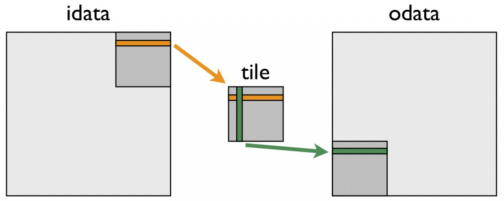

# How to Optimize Data Transfers in CUDA C/C++

In
the [[previous]{.underline}](https://developer.nvidia.com/blog/parallelforall/easy-introduction-cuda-c-and-c/) [[three]{.underline}](https://developer.nvidia.com/blog/parallelforall/how-implement-performance-metrics-cuda-cc/) [[posts]{.underline}](https://developer.nvidia.com/blog/parallelforall/how-query-device-properties-and-handle-errors-cuda-cc/) of
this CUDA C & C++ series we laid the groundwork for the major thrust of
the series: how to optimize CUDA C/C++ code. In this and the following
post we begin our discussion of code optimization with how to
efficiently transfer data between the host and device. The peak
bandwidth between the device memory and the GPU is much higher (144 GB/s
on the NVIDIA Tesla C2050, for example) than the peak bandwidth between
host memory and device memory (8 GB/s on PCIe x16 Gen2). This disparity
means that your implementation of data transfers between the host and
GPU devices can make or break your overall application performance.
Let's start with a few general guidelines for host-device data
transfers.

-   Minimize the amount of data transferred between host and device when
    > possible, even if that means running kernels on the GPU that get
    > little or no speed-up compared to running them on the host CPU.

-   Higher bandwidth is possible between the host and the device when
    > using page-locked (or "pinned") memory.

-   Batching many small transfers into one larger transfer performs much
    > better because it eliminates most of the per-transfer overhead.

-   Data transfers between the host and device can sometimes be
    > overlapped with kernel execution and other data transfers.

We investigate the first three guidelines above in this post, and we
dedicate the next post to overlapping data transfers. First I want to
talk about how to measure time spent in data transfers without modifying
the source code.

## Measuring Data Transfer Times with nvprof

To measure the time spent in each data transfer, we could record a CUDA
event before and after each transfer and use cudaEventElapsedTime(), as
we described [[in a previous
post]{.underline}](https://developer.nvidia.com/blog/parallelforall/how-implement-performance-metrics-cuda-cc/). 
However, we can get the elapsed transfer time without instrumenting the
source code with CUDA events by using nvprof, a command-line CUDA
profiler included with the CUDA Toolkit (starting with CUDA 5). Let's
try it out with the following code example, which you can find in
the [[Github repository for this
post]{.underline}](https://github.com/parallel-forall/code-samples/blob/master/series/cuda-cpp/optimize-data-transfers/profile.cu).

int main()

{

const unsigned int N = 1048576;

const unsigned int bytes = N \* sizeof(int);

int \*h_a = (int\*)malloc(bytes);

int \*d_a;

cudaMalloc((int\*\*)&d_a, bytes);

memset(h_a, 0, bytes);

cudaMemcpy(d_a, h_a, bytes, cudaMemcpyHostToDevice);

cudaMemcpy(h_a, d_a, bytes, cudaMemcpyDeviceToHost);

return 0;

}

To profile this code, we just compile it using nvcc, and then
run nvprof with the program filename as an argument.

\$ nvcc profile.cu -o profile_test

\$ nvprof ./profile_test

When I run on my desktop PC which has a GeForce GTX 680 (GK104 GPU,
similar to a Tesla K10), I get the following output.

\$ nvprof ./a.out

======== NVPROF is profiling a.out\...

======== Command: a.out

======== Profiling result:

Time(%) Time Calls Avg Min Max Name

50.08 718.11us 1 718.11us 718.11us 718.11us \[CUDA memcpy DtoH\]

49.92 715.94us 1 715.94us 715.94us 715.94us \[CUDA memcpy HtoD\]

As you can see, nvprof measures the time taken by each of the CUDA
memcpy calls. It reports the average, minimum, and maximum time for each
call  (since we only run each copy once, all times are the
same). nvprof is quite flexible, so make sure you [[check out the
documentation]{.underline}](http://docs.nvidia.com/cuda/profiler-users-guide/index.html#nvprof-overview).

nvprof is new in CUDA 5. If you are using an earlier version of CUDA,
you can use the older "command-line profiler", as Greg Ruetsch explained
in his post [[How to Optimize Data Transfers in CUDA
Fortran]{.underline}](https://developer.nvidia.com/blog/parallelforall/how-optimize-data-transfers-cuda-fortran/).

## Minimizing Data Transfers

We should not use only the GPU execution time of a kernel relative to
the execution time of its CPU implementation to decide whether to run
the GPU or CPU version. We also need to consider the cost of moving data
across the PCI-e bus, especially when we are initially porting code to
CUDA. Because CUDA's heterogeneous programming model uses both the CPU
and GPU, code can be ported to CUDA one kernel at a time. In the initial
stages of porting, data transfers may dominate the overall execution
time. It's worthwhile to keep tabs on time spent on data transfers
separately from time spent in kernel execution. It's easy to use the
command-line profiler for this, as we already demonstrated. As we port
more of our code, we'll remove intermediate transfers and decrease the
overall execution time correspondingly.

## Pinned Host Memory

Host (CPU) data allocations are pageable by default. The GPU cannot
access data directly from pageable host memory, so when a data transfer
from pageable host memory to device memory is invoked, the CUDA driver
must first allocate a temporary page-locked, or "pinned", host array,
copy the host data to the pinned array, and then transfer the data from
the pinned array to device memory, as illustrated
below.{width="5.2966360454943135in"
height="2.7973239282589675in"}

As you can see in the figure, pinned memory is used as a staging area
for transfers from the device to the host. We can avoid the cost of the
transfer between pageable and pinned host arrays by directly allocating
our host arrays in pinned memory. Allocate pinned host memory in CUDA
C/C++
using [[cudaMallocHost()]{.underline}](http://docs.nvidia.com/cuda/cuda-runtime-api/index.html#group__CUDART__MEMORY_1g9f93d9600f4504e0d637ceb43c91ebad) or [[cudaHostAlloc()]{.underline}](http://docs.nvidia.com/cuda/cuda-runtime-api/index.html#group__CUDART__MEMORY_1g15a3871f15f8c38f5b7190946845758c),
and deallocate it
with [[cudaFreeHost()]{.underline}](http://docs.nvidia.com/cuda/cuda-runtime-api/index.html#group__CUDART__MEMORY_1gedaeb2708ad3f74d5b417ee1874ec84a).
It is possible for pinned memory allocation to fail, so you should
always check for errors. The following code excerpt demonstrates
allocation of pinned memory with error checking.

cudaError_t status = cudaMallocHost((void\*\*)&h_aPinned, bytes);

if (status != cudaSuccess)

printf(\"Error allocating pinned host memory\\n\");

Data transfers using host pinned memory use the
same [[cudaMemcpy()]{.underline}](http://docs.nvidia.com/cuda/cuda-runtime-api/index.html#group__CUDART__MEMORY_1g48efa06b81cc031b2aa6fdc2e9930741) syntax
as transfers with pageable memory. We can use the following
"bandwidthtest" program ([[also available on
Github]{.underline}](https://github.com/parallel-forall/code-samples/blob/master/series/cuda-cpp/optimize-data-transfers/bandwidthtest.cu))
to compare pageable and pinned transfer rates.

#include \<stdio.h\>

#include \<assert.h\>

// Convenience function for checking CUDA runtime API results

// can be wrapped around any runtime API call. No-op in release builds.

inline

cudaError_t checkCuda(cudaError_t result)

{

#if defined(DEBUG) \|\| defined(\_DEBUG)

if (result != cudaSuccess) {

fprintf(stderr, \"CUDA Runtime Error: %s\\n\",

cudaGetErrorString(result));

assert(result == cudaSuccess);

}

#endif

return result;

}

void profileCopies(float \*h_a,

float \*h_b,

float \*d,

unsigned int n,

char \*desc)

{

printf(\"\\n%s transfers\\n\", desc);

unsigned int bytes = n \* sizeof(float);

// events for timing

cudaEvent_t startEvent, stopEvent;

checkCuda( cudaEventCreate(&startEvent) );

checkCuda( cudaEventCreate(&stopEvent) );

checkCuda( cudaEventRecord(startEvent, 0) );

checkCuda( cudaMemcpy(d, h_a, bytes, cudaMemcpyHostToDevice) );

checkCuda( cudaEventRecord(stopEvent, 0) );

checkCuda( cudaEventSynchronize(stopEvent) );

float time;

checkCuda( cudaEventElapsedTime(&time, startEvent, stopEvent) );

printf(\" Host to Device bandwidth (GB/s): %f\\n\", bytes \* 1e-6 /
time);

checkCuda( cudaEventRecord(startEvent, 0) );

checkCuda( cudaMemcpy(h_b, d, bytes, cudaMemcpyDeviceToHost) );

checkCuda( cudaEventRecord(stopEvent, 0) );

checkCuda( cudaEventSynchronize(stopEvent) );

checkCuda( cudaEventElapsedTime(&time, startEvent, stopEvent) );

printf(\" Device to Host bandwidth (GB/s): %f\\n\", bytes \* 1e-6 /
time);

for (int i = 0; i \< n; ++i) {

if (h_a\[i\] != h_b\[i\]) {

printf(\"\*\*\* %s transfers failed \*\*\*\\n\", desc);

break;

}

}

// clean up events

checkCuda( cudaEventDestroy(startEvent) );

checkCuda( cudaEventDestroy(stopEvent) );

}

int main()

{

unsigned int nElements = 4\*1024\*1024;

const unsigned int bytes = nElements \* sizeof(float);

// host arrays

float \*h_aPageable, \*h_bPageable;

float \*h_aPinned, \*h_bPinned;

// device array

float \*d_a;

// allocate and initialize

h_aPageable = (float\*)malloc(bytes); // host pageable

h_bPageable = (float\*)malloc(bytes); // host pageable

checkCuda( cudaMallocHost((void\*\*)&h_aPinned, bytes) ); // host pinned

checkCuda( cudaMallocHost((void\*\*)&h_bPinned, bytes) ); // host pinned

checkCuda( cudaMalloc((void\*\*)&d_a, bytes) ); // device

for (int i = 0; i \< nElements; ++i) h_aPageable\[i\] = i;

memcpy(h_aPinned, h_aPageable, bytes);

memset(h_bPageable, 0, bytes);

memset(h_bPinned, 0, bytes);

// output device info and transfer size

cudaDeviceProp prop;

checkCuda( cudaGetDeviceProperties(&prop, 0) );

printf(\"\\nDevice: %s\\n\", prop.name);

printf(\"Transfer size (MB): %d\\n\", bytes / (1024 \* 1024));

// perform copies and report bandwidth

profileCopies(h_aPageable, h_bPageable, d_a, nElements, \"Pageable\");

profileCopies(h_aPinned, h_bPinned, d_a, nElements, \"Pinned\");

printf(\"n\");

// cleanup

cudaFree(d_a);

cudaFreeHost(h_aPinned);

cudaFreeHost(h_bPinned);

free(h_aPageable);

free(h_bPageable);

return 0;

}

The data transfer rate can depend on the type of host system
(motherboard, CPU, and chipset) as well as the GPU. On my laptop which
has an Intel Core i7-2620M CPU (2.7GHz, 2 Sandy Bridge cores, 4MB L3
Cache) and an NVIDIA NVS 4200M GPU (1 Fermi SM, Compute Capability 2.1,
PCI-e Gen2 x16), running BandwidthTest produces the following results.
As you can see, pinned transfers are more than twice as fast as pageable
transfers.

Device: NVS 4200M

Transfer size (MB): 16

Pageable transfers

Host to Device bandwidth (GB/s): 2.308439

Device to Host bandwidth (GB/s): 2.316220

Pinned transfers

Host to Device bandwidth (GB/s): 5.774224

Device to Host bandwidth (GB/s): 5.958834

On my desktop PC with a much faster Intel Core i7-3930K CPU (3.2 GHz, 6
Sandy Bridge cores, 12MB L3 Cache) and an NVIDIA GeForce GTX 680 GPU (8
Kepler SMs, Compute Capability 3.0) we see much faster pageable
transfers, as the following output shows. This is presumably because the
faster CPU (and chipset) reduces the host-side memory copy cost.

Device: GeForce GTX 680

Transfer size (MB): 16

Pageable transfers

Host to Device bandwidth (GB/s): 5.368503

Device to Host bandwidth (GB/s): 5.627219

Pinned transfers

Host to Device bandwidth (GB/s): 6.186581

Device to Host bandwidth (GB/s): 6.670246

You should not over-allocate pinned memory. Doing so can reduce overall
system performance because it reduces the amount of physical memory
available to the operating system and other programs. How much is too
much is difficult to tell in advance, so as with all optimizations, test
your applications and the systems they run on for optimal performance
parameters.

## Batching Small Transfers

Due to the overhead associated with each transfer, it is preferable to
batch many small transfers together into a single transfer. This is easy
to do by using a temporary array, preferably pinned, and packing it with
the data to be transferred.

For two-dimensional array transfers, you can
use [cudaMemcpy2D()](http://docs.nvidia.com/cuda/cuda-runtime-api/index.html#group__CUDART__MEMORY_1g17f3a55e8c9aef5f90b67cdf22851375).

cudaMemcpy2D(dest, dest_pitch, src, src_pitch, w, h,
cudaMemcpyHostToDevice)

The arguments here are a pointer to the first destination element and
the pitch of the destination array, a pointer to the first source
element and pitch of the source array, the width and height of the
submatrix to transfer, and the memcpy kind. There is also
a [cudaMemcpy3D()](http://docs.nvidia.com/cuda/cuda-runtime-api/index.html#group__CUDART__MEMORY_1gc1372614eb614f4689fbb82b4692d30a) function
for transfers of rank three array sections.

## Summary

Transfers between the host and device are the slowest link of data
movement involved in GPU computing, so you should take care to minimize
transfers. Following the guidelines in this post can help you make sure
necessary transfers are efficient. When you are porting or writing new
CUDA C/C++ code, I recommend that you start with pageable transfers from
existing host pointers. As I mentioned earlier, as you write more device
code you will eliminate some of the intermediate transfers, so any
effort you spend optimizing transfers early in porting may be wasted.
Also, rather than instrument code with CUDA events or other timers to
measure time spent for each transfer, I recommend that you
use nvprof, the command-line CUDA profiler, or one of the visual
profiling tools such as the NVIDIA Visual Profiler (also included with
the CUDA Toolkit).

This post focused on making data transfers efficient. In the [[next
post]{.underline}](https://developer.nvidia.com/blog/parallelforall/how-overlap-data-transfers-cuda-cc/),
we discuss how you can overlap data transfers with computation and with
other data transfers.
