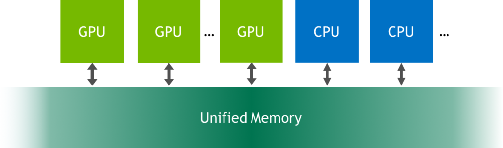
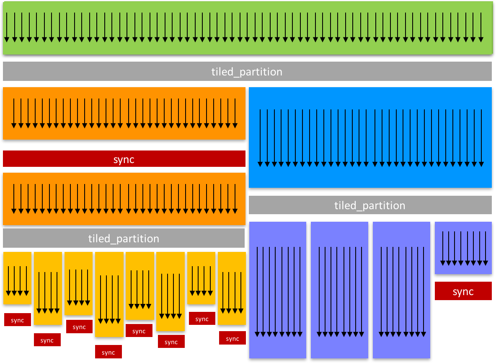
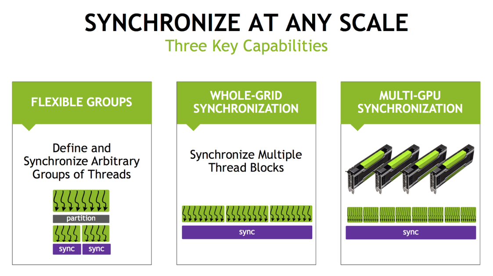
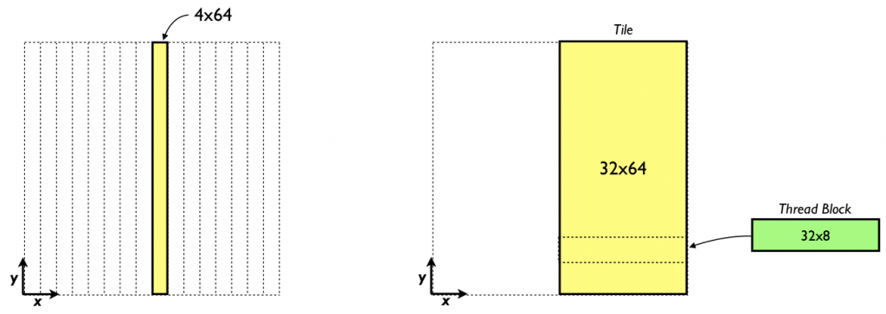

# Finite Difference Methods in CUDA C/C++, Part 1

In the [[previous CUDA C/C++
post]{.underline}](https://developer.nvidia.com/blog/parallelforall/efficient-matrix-transpose-cuda-cc/)
we investigated how we can use shared memory to optimize a matrix
transpose, achieving roughly an order of magnitude improvement in
effective bandwidth by using shared memory to coalesce global memory
access. The topic of today's post is to show how to use shared memory to
enhance data reuse in a finite difference code. In addition to shared
memory, we will also discuss constant memory, which is a cached
read-only memory optimized for uniform access across threads in a block
(or warp).

## Problem Statement: 3D Finite Difference

Our example uses a three-dimensional grid of size 64^3^. For simplicity
we assume periodic boundary conditions and only consider first-order
derivatives, although extending the code to calculate higher-order
derivatives with other types of boundary conditions is straightforward.

The finite difference method essentially uses a weighted summation of
function values at neighboring points to approximate the derivative at a
particular point. For a *(2N+1)*-point stencil with uniform
spacing *∆x* in the *x *direction, the following equation gives a
central finite difference scheme for the derivative in *x.* Equations
for the other directions are similar.* *

{width="3.2371817585301836in"
height="0.7386384514435695in"}

The coefficients *C~i~* are typically generated from Taylor series
expansions and can be chosen to obtain a scheme with desired
characteristics such as accuracy, and in the context of partial
differential equations, dispersion and dissipation. For explicit finite
difference schemes such as the type above, larger stencils typically
have a higher order of accuracy. For this post we use a nine-point
stencil which has eighth-order accuracy. We also choose a symmetric
stencil, shown in the following equation.

{width="5.751240157480315in"
height="0.40901356080489937in"}

Here we specify values of the function on the computational grid using
the grid indices *i*, *j*, *k,* rather than the physical
coordinates *x*, *y*, *z*. Here the coefficients are *a~x~* = 4/(5 *∆x*)
, *b~x~* = −1/(5 *∆x*) , *c~x~* = 4/(105 *∆x*), and *d~x~* = −
1/(280 *∆x*), which is a typical eighth-order scheme. For derivatives in
the *y* and *z *directions, the index offsets in the above equation are
simply applied to the *j* and *k* indices and the coefficients are the
same except that *∆y* and *∆z* are used in place of *∆x*.

Because we calculate an approximation to the derivative at each point on
the 64^3^ periodic grid, the value of *f* at each point is used eight
times: once for each right-hand-side term in the above expression. In
designing a derivative kernel, our goal is to exploit this data reuse by
storing blocks of data in shared memory to ensure we fetch the values
of *f* from global memory as few times as possible.

## Data Reuse and Shared Memory

We employ a *tiling* approach in which each thread block loads a tile of
data from the multidimensional grid into shared memory, so that each
thread in the block can access all elements of the shared memory tile as
needed. How do we choose the best tile shape and size? Some
experimentation is required, but characteristics of the finite
difference stencil and grid size provide direction.

When choosing a tile shape for stencil calculations, the tiles
typically overlap by half of the stencil size, as depicted on the left
in the figure below.

{width="5.275110454943132in"
height="2.379231189851269in"}

Here, in order to calculate the derivative in a 16 × 16 tile (in
yellow), the values of *f* not only from this tile but also from two
additional 4 × 16 sections (in orange) must be loaded by each thread
block. Overall, the *f* values in the orange sections get loaded twice,
once by the thread block that calculates the derivative at that
location, and once by each neighboring thread block. As a result, 8 × 16
values out of 16 × 16, or half of the values, get loaded from global
memory twice. In
addition, [[coalescing]{.underline}](https://developer.nvidia.com/blog/parallelforall/how-access-global-memory-efficiently-cuda-c-kernels/) on
devices with a compute capability of 2.0 and higher will be suboptimal
with 16 × 16 tiles because perfect coalescing on such devices requires
access to data within 32 contiguous elements in global memory per load.

A better choice of tile (and thread block) size for our problem and data
size is a 64 × 4 tile, as depicted on the right in the figure above.
This tile avoids overlap altogether when calculating the *x*-derivative
for our one-dimensional stencil on a grid of 64^3^ since the tile
contains all points in the direction of the derivative. A minimal tile
would have just one *pencil*, or one-dimensional array of all points in
a direction. This would correspond to thread blocks of only 64 threads,
however, so from an occupancy standpoint it is beneficial to use
multiple pencils per tile. In our finite difference code, [[available
for download on
Github]{.underline}](https://github.com/parallel-forall/code-samples/blob/master/series/cuda-cpp/finite-difference/finite-difference.cu),
we parameterize the number of pencils to allow experimentation. In
addition to loading each value of *f* only once, every warp of threads
loads contiguous data from global memory using this tile and therefore
achieves perfectly coalesced accesses to global memory.

## *X*-Derivative Implementation

The implementation for the x-derivative kernel follows.

\_\_global\_\_ void derivative_x(float \*f, float \*df)

{

\_\_shared\_\_ float s_f\[sPencils\]\[mx+8\]; // 4-wide halo

int i = threadIdx.x;

int j = blockIdx.x\*blockDim.y + threadIdx.y;

int k = blockIdx.y;

int si = i + 4; // local i for shared memory access + halo offset

int sj = threadIdx.y; // local j for shared memory access

int globalIdx = k \* mx \* my + j \* mx + i;

s_f\[sj\]\[si\] = f\[globalIdx\];

\_\_syncthreads();

// fill in periodic images in shared memory array

if (i \< 4) {

s_f\[sj\]\[si-4\] = s_f\[sj\]\[si+mx-5\];

s_f\[sj\]\[si+mx\] = s_f\[sj\]\[si+1\];

}

\_\_syncthreads();

df\[globalIdx\] =

( c_ax \* ( s_f\[sj\]\[si+1\] - s_f\[sj\]\[si-1\] )

\+ c_bx \* ( s_f\[sj\]\[si+2\] - s_f\[sj\]\[si-2\] )

\+ c_cx \* ( s_f\[sj\]\[si+3\] - s_f\[sj\]\[si-3\] )

\+ c_dx \* ( s_f\[sj\]\[si+4\] - s_f\[sj\]\[si-4\] ) );

}

Here mx, my, and mz are the array dimensions which are set to 64,
and sPencils is 4, which is the number of pencils used to make the
shared memory tile. The indices i, j, and k correspond to the
coordinates in the 64^3^ mesh. The indices si and sj are the local (row,
column) coordinates for the shared memory tile. This kernel is launched
with a block of 64 × sPencils threads which calculate the derivatives on
a x × y tile of 64 × sPencils elements, so each thread calculates the
derivative at one point.

The shared memory tile is declared with a padding of 4 elements at each
end of the *x* dimension to accommodate the periodic images needed to
calculate the derivative at the endpoints.

\_\_shared\_\_ float s_f\[sPencils\]\[mx+8\]; // 4-wide halo

We compute an index into the linear input array and then read from
global memory into the shared memory tile.

int globalIdx = k \* mx \* my + j \* mx + i;

s_f\[sj\]\[si\] = f\[globalIdx\];

These reads from global memory are perfectly coalesced. Data are copied
within shared memory to fill out the periodic images in the x-direction
by the following code.

// fill in periodic images in shared memory array

if (i \< 4) {

s_f\[sj\]\[si-4\] = s_f\[sj\]\[si+mx-5\];

s_f\[sj\]\[si+mx\] = s_f\[sj\]\[si+1\];

}

Note that in this operation we are reading from shared memory, not from
global memory. Each element is read from global memory only once by the
previous statement. Since a thread reads data from shared memory that
another thread wrote, we need a \_\_syncthreads() call before the
periodic images are written. Likewise, we need a \_\_syncthreads() call
after the periodic images are written since they are accessed by
different threads. After the second \_\_syncthreads() call, our finite
difference approximation is calculated using the following code.

df\[globalIdx\] =

( c_ax \* ( s_f\[sj\]\[si+1\] - s_f\[sj\]\[si-1\] )

\+ c_bx \* ( s_f\[sj\]\[si+2\] - s_f\[sj\]\[si-2\] )

\+ c_cx \* ( s_f\[sj\]\[si+3\] - s_f\[sj\]\[si-3\] )

\+ c_dx \* ( s_f\[sj\]\[si+4\] - s_f\[sj\]\[si-4\] ) );

The coefficients c_ax, c_bx, c_cx, and c_dx are declared external to
this kernel in *constant memory*.

## Constant memory

Constant memory is a special-purpose memory space that is read-only from
device code, but can be read and written by the host. Constant memory
resides in device DRAM, and is cached on chip. The constant memory cache
has only one read port, but can broadcast data from this port across a
warp. This means that constant memory access is effective when all
threads in a warp read the same address, but when threads in a warp read
different addresses the reads are serialized. Constant memory is perfect
for coefficients and other data that are used uniformly across threads,
as is the case with our coefficients c_ax, c_bx, etc.

In CUDA C/C++, constant data must be declared with global scope, and can
be read (only) from device code, and read or written by host code.
Constant memory is used in device code the same way any CUDA C variable
or array/pointer is used, but it must be initialized from host code
using [[cudaMemcpyToSymbol]{.underline}](http://docs.nvidia.com/cuda/cuda-runtime-api/group__CUDART__MEMORY.html#group__CUDART__MEMORY_1g2a229a704ade54887f7784e2e2dbd895) or
one of its variants. In our finite difference code we have the following
constant declarations, which use the \_\_constant\_\_ declaration
specifier.

// stencil coefficients

\_\_constant\_\_ float c_ax, c_bx, c_cx, c_dx;

\_\_constant\_\_ float c_ay, c_by, c_cy, c_dy;

\_\_constant\_\_ float c_az, c_bz, c_cz, c_dz;

We initialize the *x* coefficients using the following code, and the y
and z coefficients are initialized similarly.

// stencil weights (for unit length problem)

float dsinv = mx-1.f;

float ax = 4.f / 5.f \* dsinv;

float bx = -1.f / 5.f \* dsinv;

float cx = 4.f / 105.f \* dsinv;

float dx = -1.f / 280.f \* dsinv;

cudaMemcpyToSymbol(c_ax, &ax, sizeof(float), 0, cudaMemcpyHostToDevice);

cudaMemcpyToSymbol(c_bx, &bx, sizeof(float), 0, cudaMemcpyHostToDevice);

cudaMemcpyToSymbol(c_cx, &cx, sizeof(float), 0, cudaMemcpyHostToDevice);

cudaMemcpyToSymbol(c_dx, &dx, sizeof(float), 0, cudaMemcpyHostToDevice);

## X Derivative Performance

The derivative_x kernel achieves the following performance on a Tesla
K20c GPU.

Using shared memory tile of 64 x 4

RMS error: 7.277675e-06

MAX error: 2.861023e-05

Average time (ms): 0.025912

Average Bandwidth (GB/s): 80.933625

We will use this performance as a basis for comparison for derivatives
in the other directions, which we will cover in the [[next CUDA C/C++
post]{.underline}](https://developer.nvidia.com/blog/parallelforall/finite-difference-methods-cuda-c-part-2/).

# Finite Difference Methods in CUDA C++, Part 2

In the [[previous CUDA C++
post]{.underline}](https://developer.nvidia.com/blog/parallelforall/finite-difference-methods-cuda-cc-part-1/) we
dove in to 3D finite difference computations in CUDA C/C++,
demonstrating how to implement the *x *derivative part of the
computation. In this post, let's continue by exploring how we can write
efficient kernels for the *y* and *z *derivatives. As with the previous
post, code for the examples in this post is [[available for download on
Github]{.underline}](https://github.com/parallel-forall/code-samples/tree/master/series/cuda-cpp/finite-difference).

## Y and Z Derivatives

We can easily modify the *x *derivative code to operate in the other
directions. In the *x *derivative each thread block calculates the
derivatives in an *x*, *y* tile of 64 × sPencils elements. For
the *y *derivative we can have a thread block calculate the derivative
on a tile of sPencils × 64 elements in *x*, *y*, as depicted on the left
in the figure below.

{width="5.7073228346456695in"
height="2.0273873578302712in"}

Likewise, for the *z *derivative a thread block can calculate the
derivative in a *x*, *z* tile of sPencils × 64 elements. The kernel
below shows the *y *derivative kernel using this approach.

\_\_global\_\_ void derivative_y(float \*f, float \*df)

{

\_\_shared\_\_ float s_f\[my+8\]\[sPencils\];

int i = blockIdx.x\*blockDim.x + threadIdx.x;

int j = threadIdx.y;

int k = blockIdx.y;

int si = threadIdx.x;

int sj = j + 4;

int globalIdx = k \* mx \* my + j \* mx + i;

s_f\[sj\]\[si\] = f\[globalIdx\];

\_\_syncthreads();

if (j \< 4) {

s_f\[sj-4\]\[si\] = s_f\[sj+my-5\]\[si\];

s_f\[sj+my\]\[si\] = s_f\[sj+1\]\[si\];

}

\_\_syncthreads();

df\[globalIdx\] =

( c_ay \* ( s_f\[sj+1\]\[si\] - s_f\[sj-1\]\[si\] )

\+ c_by \* ( s_f\[sj+2\]\[si\] - s_f\[sj-2\]\[si\] )

\+ c_cy \* ( s_f\[sj+3\]\[si\] - s_f\[sj-3\]\[si\] )

\+ c_dy \* ( s_f\[sj+4\]\[si\] - s_f\[sj-4\]\[si\] ) );

}

By using the shared memory tile we can ensure that each element from
global memory is read in only once.

\_\_shared\_\_ float s_f\[my+8\]\[sPencils\];

The disadvantage of this approach is that with sPencils or 4 points
in *x* for these tiles we no longer have perfect coalescing. The
performance results bear this out; we achieve roughly half the
performance of the *x *derivative kernel.

Using shared memory tile of 4 x 64

RMS error: 7.277675e-06

MAX error: 2.861023e-05

Average time (ms): 0.044683

Average Bandwidth (GB/s): 46.933792

In terms of accuracy, we obtain the same maximum error of
the *x* derivative, but a different (not substantially worse) RMS error
for essentially the same function. This difference is due to the order
in which the accumulation is done on the host, simply swapping the order
of the loops in the host code error calculation would produce the same
results.

One way to recover perfect coalescing is to expand the number of pencils
in the shared memory tile. For the Tesla K20 (Kepler) this would require
32 pencils. Such a tile is shown on the right of the figure earlier in
this section. Using such an approach would require a shared memory tile
of 9216 bytes, which is not a problem. However, with a one-to-one
mapping of threads to elements where the derivative is calculated, a
thread block of 2048 threads would be required. The K20 has a limits of
1024 threads per thread block and 2048 threads per multiprocessor. We
can work around these limits by letting each thread calculate the
derivative for multiple points. If we use a thread block of 32×8×1 and
have each thread calculate the derivative at eight points, as opposed to
a thread block of 4×64×1, and have each thread calculate the derivative
at only one point, we launch a kernel with the same number of blocks and
threads per block, but regain perfect coalescing. The following code
accomplishes this.

\_\_global\_\_ void derivative_y_lPencils(float \*f, float \*df)

{

\_\_shared\_\_ float s_f\[my+8\]\[lPencils\];

int i = blockIdx.x\*blockDim.x + threadIdx.x;

int k = blockIdx.y;

int si = threadIdx.x;

for (int j = threadIdx.y; j \< my; j += blockDim.y) {

int globalIdx = k \* mx \* my + j \* mx + i;

int sj = j + 4;

s_f\[sj\]\[si\] = f\[globalIdx\];

}

\_\_syncthreads();

int sj = threadIdx.y + 4;

if (sj \< 8) {

s_f\[sj-4\]\[si\] = s_f\[sj+my-5\]\[si\];

s_f\[sj+my\]\[si\] = s_f\[sj+1\]\[si\];

}

\_\_syncthreads();

for (int j = threadIdx.y; j \< my; j += blockDim.y) {

int globalIdx = k \* mx \* my + j \* mx + i;

int sj = j + 4;

df\[globalIdx\] =

( c_ay \* ( s_f\[sj+1\]\[si\] - s_f\[sj-1\]\[si\] )

\+ c_by \* ( s_f\[sj+2\]\[si\] - s_f\[sj-2\]\[si\] )

\+ c_cy \* ( s_f\[sj+3\]\[si\] - s_f\[sj-3\]\[si\] )

\+ c_dy \* ( s_f\[sj+4\]\[si\] - s_f\[sj-4\]\[si\] ) );

}

}

Here we set lPencils equal to 32. This code is similar to the
above *y* derivative code except the variable j is a loop index rather
than being calculated once.  When we use a large amount of shared memory
per thread block, we should check to see the effect of whether and by
how much the shared memory use limits the number of threads that reside
on a multiprocessor.  Each thread block requires 9216 bytes of shared
memory, and with a limit of 48 KB of shared memory per multiprocessor,
this translates to a maximum of 5 thread blocks that can reside at one
time on a multiprocessor.  (Compiling with \--ptxas-options=-v indicates
each thread uses 10 registers which will not limit the number of thread
blocks per multiprocessor.)  With a thread block of 32×8 threads, the
number of threads that can reside on a multiprocessor for this kernel is
1280 versus a maximum of 2048 on the K20.  The *occupancy* is 1280/2048
or 0.63, which is not a problem in general, especially since we are
using eight-fold instruction-level parallelism via the loops over j.
Here are the results for this kernel.

Using shared memory tile of 32 x 64

RMS error: 7.277675e-06

MAX error: 2.861023e-05

Average time (ms): 0.026755

Average Bandwidth (GB/s): 78.382972

You might wonder if using such a larger number of pencils in the shared
memory tile will improve performance of the *x* derivative code
presented earlier (81 GB/s). This ends up not being the case.

Using shared memory tile of 64 x 32

RMS error: 7.277675e-06

MAX error: 2.861023e-05

Average time (ms): 0.030123

Average Bandwidth (GB/s): 69.619162

Recall that for the *x* derivative we already have perfect coalescing
for the case with four pencils. Since the occupancy of this kernel is
high there is no benefit from the added instruction-level parallelism.
As a result, the additional code to loop over portions of the
shared-memory tile simply add overhead and as a result performance
decreases. We handle the *z* derivative in the same way as
the *y* derivative, and achieve comparable performance.

In the past several posts we have explored the use of shared memory to
optimize kernel performance. The [[transpose
example]{.underline}](https://developer.nvidia.com/blog/parallelforall/efficient-matrix-transpose-cuda-cc/) showed
how shared memory can be used to help global memory coalescing, and
in [[the finite difference
code]{.underline}](https://developer.nvidia.com/blog/parallelforall/finite-difference-methods-cuda-cc-part-1/) we
showed how shared memory can assist with data reuse.
