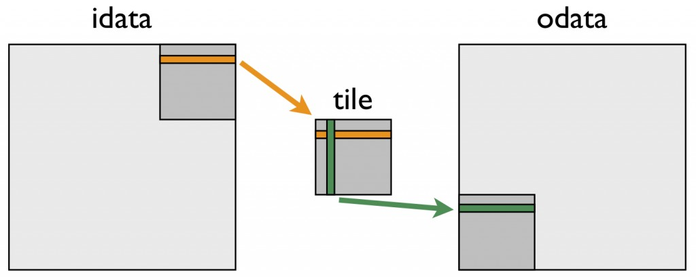

# An Efficient Matrix Transpose in CUDA C/C++

My last [[CUDA C++
post]{.underline}](https://developer.nvidia.com/blog/using-shared-memory-cuda-cc/) covered
the mechanics of using shared memory, including static and dynamic
allocation. In this post I will show some of the performance gains
achievable using shared memory. Specifically, I will optimize a matrix
transpose to show how to use shared memory to reorder strided global
memory accesses into coalesced accesses.

## Matrix Transpose

The code we wish to optimize is a transpose of a matrix of single
precision values that operates out-of-place, i.e. the input and output
are separate arrays in memory. For simplicity of presentation, we'll
consider only square matrices whose dimensions are integral multiples of
32 on a side. The entire code is [[available on
Github]{.underline}](https://github.com/parallel-forall/code-samples/blob/master/series/cuda-cpp/transpose/transpose.cu). It
consists of several kernels as well as host code to perform typical
tasks such as allocation and data transfers between host and device,
launches and timing of several kernels as well as validation of their
results, and deallocation of host and device memory. In this post I'll
only include the kernel code; you can view the rest or try it out on
Github.

In addition to performing several different matrix transposes, we run
simple matrix copy kernels because copy performance indicates the
performance that we would like the matrix transpose to achieve. For both
matrix copy and transpose, the relevant performance metric is effective
bandwidth, calculated in GB/s by dividing twice the size in GB of the
matrix (once for loading the matrix and once for storing) by time in
seconds of execution.

All kernels in this study launch blocks of 32×8 threads
(TILE_DIM=32, BLOCK_ROWS=8 in the code), and each thread block
transposes (or copies) a tile of size 32×32. Using a thread block with
fewer threads than elements in a tile is advantageous for the matrix
transpose because each thread transposes four matrix elements, so much
of the index calculation cost is amortized over these elements.

The kernels in this example map threads to matrix elements using a
Cartesian (x,y) mapping rather than a row/column mapping to simplify the
meaning of the components of the automatic variables in CUDA
C: threadIdx.x is horizontal and threadIdx.y is vertical. This mapping
is up to the programmer; the important thing to remember is that
to [[ensure memory
coalescing]{.underline}](https://developer.nvidia.com/blog/parallelforall/how-access-global-memory-efficiently-cuda-c-kernels/) we
want to map the quickest varying component to contiguous elements in
memory. In Fortran contiguous addresses correspond to the first index of
a multidimensional array, and threadIdx.x and blockIdx.x vary quickest
within blocks and grids, respectively.

## Simple Matrix Copy

Let's start by looking at the matrix copy kernel.

\_\_global\_\_ void copy(float \*odata, const float \*idata)

{

int x = blockIdx.x \* TILE_DIM + threadIdx.x;

int y = blockIdx.y \* TILE_DIM + threadIdx.y;

int width = gridDim.x \* TILE_DIM;

for (int j = 0; j \< TILE_DIM; j+= BLOCK_ROWS)

odata\[(y+j)\*width + x\] = idata\[(y+j)\*width + x\];

}

Each thread copies four elements of the matrix in a loop at the end of
this routine because the number of threads in a block is smaller by a
factor of four (TILE_DIM/BLOCK_ROWS) than the number of elements in a
tile. Note also that TILE_DIM must be used in the calculation of the
matrix index y rather than BLOCK_ROWS or blockDim.y. The loop iterates
over the second dimension and not the first so that contiguous threads
load and store contiguous data, and all reads from idata and writes
to odata are [[coalesced]{.underline}](https://developer.nvidia.com/blog/parallelforall/how-access-global-memory-efficiently-cuda-c-kernels/).

## Naive Matrix Transpose

Our first transpose kernel looks very similar to the copy kernel. The
only difference is that the indices for odata are swapped.

\_\_global\_\_ void transposeNaive(float \*odata, const float \*idata)

{

int x = blockIdx.x \* TILE_DIM + threadIdx.x;

int y = blockIdx.y \* TILE_DIM + threadIdx.y;

int width = gridDim.x \* TILE_DIM;

for (int j = 0; j \< TILE_DIM; j+= BLOCK_ROWS)

odata\[x\*width + (y+j)\] = idata\[(y+j)\*width + x\];

}

In transposeNaive the reads from idata are coalesced as in the copy
kernel, but for our 1024×1024 test matrix the writes to odata have a
stride of 1024 elements or 4096 bytes between contiguous threads. This
puts us well into the asymptote of the strided memory access plot from
our [[global memory coalescing
post]{.underline}](https://developer.nvidia.com/blog/parallelforall/how-access-global-memory-efficiently-cuda-c-kernels/),
and we expect the performance of this kernel to suffer accordingly. The
results of the copy and transposeNaive kernels bear this out.

  -----------------------------------------------------------------------
                      Effective Bandwidth (GB/s,  
                      ECC enabled)                
  ------------------- --------------------------- -----------------------
  Routine             Tesla M2050                 Tesla K20c

  copy                105.2                        136.0

  transposeNaive       18.8                        55.3
  -----------------------------------------------------------------------

The transposeNaive kernel achieves only a fraction of the effective
bandwidth of the copy kernel. Because this kernel does very little other
than copying, we would like to get closer to copy throughput. Let's look
at how we can do that.

## Coalesced Transpose Via Shared Memory

The remedy for the poor transpose performance is to use shared memory to
avoid the large strides through global memory. The following figure
depicts how shared memory is used in the transpose.

{width="5.523862642169729in"
height="2.2026038932633423in"}

The following kernel performs this "tiled" transpose.

\_\_global\_\_ void transposeCoalesced(float \*odata, const float
\*idata)

{

\_\_shared\_\_ float tile\[TILE_DIM\]\[TILE_DIM\];

int x = blockIdx.x \* TILE_DIM + threadIdx.x;

int y = blockIdx.y \* TILE_DIM + threadIdx.y;

int width = gridDim.x \* TILE_DIM;

for (int j = 0; j \< TILE_DIM; j += BLOCK_ROWS)

tile\[threadIdx.y+j\]\[threadIdx.x\] = idata\[(y+j)\*width + x\];

\_\_syncthreads();

x = blockIdx.y \* TILE_DIM + threadIdx.x; // transpose block offset

y = blockIdx.x \* TILE_DIM + threadIdx.y;

for (int j = 0; j \< TILE_DIM; j += BLOCK_ROWS)

odata\[(y+j)\*width + x\] = tile\[threadIdx.x\]\[threadIdx.y + j\];

}

In the first do loop, a warp of threads reads contiguous data
from idata into rows of the shared memory tile. After recalculating the
array indices, a column of the shared memory tile is written to
contiguous addresses in odata. Because threads write different data
to odata than they read from idata, we must use a block-wise barrier
synchronization \_\_syncthreads(). This approach gives us a nice speed
up, as shown in this updated effective bandwidth table.

  ------------------------------------------------------------------------
                          Effective Bandwidth       
                          (GB/s, ECC enabled)       
  ----------------------- ------------------------- ----------------------
  Routine                 Tesla M2050               Tesla K20c

  copy                    105.2                     136.0

  transposeNaive          18.8                      55.3

  transposeCoalesced      51.3                      97.6
  ------------------------------------------------------------------------

The transposeCoalesced results are an improvement over
the transposeNaive case, but they are still far from the performance of
the copy kernel. We might guess that the cause of the performance gap is
the overhead associated with using shared memory and the required
synchronization barrier \_\_syncthreads(). We can easily test this using
the following copy kernel that uses shared memory.

\_\_global\_\_ void copySharedMem(float \*odata, const float \*idata)

{

\_\_shared\_\_ float tile\[TILE_DIM \* TILE_DIM\];

int x = blockIdx.x \* TILE_DIM + threadIdx.x;

int y = blockIdx.y \* TILE_DIM + threadIdx.y;

int width = gridDim.x \* TILE_DIM;

for (int j = 0; j \< TILE_DIM; j += BLOCK_ROWS)

tile\[(threadIdx.y+j)\*TILE_DIM + threadIdx.x\] = idata\[(y+j)\*width +
x\];

\_\_syncthreads();

for (int j = 0; j \< TILE_DIM; j += BLOCK_ROWS)

odata\[(y+j)\*width + x\] = tile\[(threadIdx.y+j)\*TILE_DIM +
threadIdx.x\];

}

Note that the synchthreads() call is technically not needed in this
case, because the operations for an element are performed by the same
thread, but we include it here to mimic the transpose behavior. The
second line of the table below shows that the problem is not the use of
shared memory or the barrier synchronization.

  ------------------------------------------------------------------------
                          Effective Bandwidth       
                          (GB/s, ECC enabled)       
  ----------------------- ------------------------- ----------------------
  Routine                 Tesla M2050               Tesla K20c

  copy                    105.2                     136.0

  copySharedMem           104.6                     152.3

  transposeNaive          18.8                      55.3

  transposeCoalesced      51.3                      97.6
  ------------------------------------------------------------------------

## Shared Memory Bank Conflicts

For a shared memory tile of 32 × 32 elements, all elements in a column
of data map to the same shared memory bank, resulting in a worst-case
scenario for memory bank conflicts: reading a column of data results in
a 32-way bank conflict. Luckily, the solution for this is simply to pad
the width in the declaration of the shared memory tile, making the tile
33 elements wide rather than 32.

\_\_shared\_\_ float tile\[TILE_DIM\]\[TILE_DIM+1\];

Removing the bank conflicts in this way brings us to about 95% of our
fastest copy throughput.

  ------------------------------------------------------------------------
                              Effective Bandwidth     
                              (GB/s, ECC enabled)     
  --------------------------- ----------------------- --------------------
  Routine                     Tesla M2050             Tesla K20c

  copy                        105.2                   136.0

  copySharedMem               104.6                   152.3

  transposeNaive              18.8                    55.3

  transposeCoalesced          51.3                    97.6

  transposeNoBankConflicts    99.5                    144.3
  ------------------------------------------------------------------------

## Summary

In this post we presented three kernels that represent various
optimizations for a matrix transpose. The kernels show how to use shared
memory to coalesce global memory access and how to pad arrays to avoid
shared memory bank conflicts. Looking at the relative gains of our
kernels, coalescing global memory accesses is by far the most critical
aspect of achieving good performance, which is true of many
applications. Because global memory coalescing is so important, we
revisit it again in the next post when we look at a finite difference
computation on a 3D mesh.
