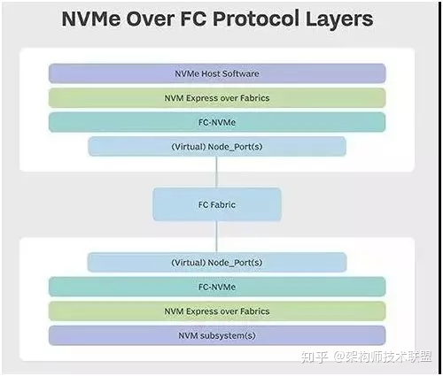

# 详谈NVMe和NVMe-oF架构和知识点

NVMe传输是一种抽象协议层，旨在提供可靠的NVMe命令和数据传输。为了支持数据中心的网络存储，通过NVMe
over
Fabric实现NVMe标准在PCIe总线上的扩展，以此来挑战SCSI在SAN中的统治地位。NVMe
over
Fabric支持把NVMe映射到多个Fabrics传输选项，**主要包括FC、InfiniBand、RoCE
v2、iWARP和TCP**。

然而，在这些Fabrics选项协议中，我们常常认为**InfiniBand、RoCE
v2(**可路由的RoCE)**、iWARP是理想的Fabric，其原因在于它们支持RDMA。**

-   **InfiniBand(IB)：**从一开始就支持RDMA的新一代网络协议。由于这是一种新的网络技术，因此需要支持该技术的网卡和交换机。

-   **RDMA融合以太网(RoCE)：**一种允许通过以太网进行RDMA的网络协议。其较低的网络头是以太网头，其上网络头(包括数据)是InfiniBand头。这允许在标准以太网基础架构(交换机)上使用RDMA。只有NIC应该是特殊的，并支持RoCE。

-   **互联网广域RDMA协议(iWARP)：**允许通过TCP执行RDMA的网络协议。在IB和RoCE中存在功能，iWARP不支持这些功能。这允许在标准以太网基础架构(交换机)上使用RDMA。只有NIC应该是特殊的，并支持iWARP(如果使用CPU卸载)，否则所有iWARP堆栈都可以在SW中实现，并且丢失了大部分的RDMA性能优势。

那么为什么支持RDMA在选择NVMe over
Fabric时就具有先天优势？这要从RDMA的功能和优势说起。\
RDMA是一种新的内存访问技术，RDMA让计算机可以直接存取其他计算机的内存，而不需要经过处理器耗时的处理。RDMA将数据从一个系统快速移动到远程系统存储器中，而不对操作系统造成任何影响。RDMA技术的原理及其与TCP/IP架构的对比如下图所示。

{width="3.8566819772528436in"
height="3.74451334208224in"}

因此，RDMA可以简单理解为利用相关的硬件和网络技术，服务器1的网卡可以直接读写服务器2的内存，最终达到高带宽、低延迟和低资源利用率的效果。如下图所示，应用程序不需要参与数据传输过程，只需要指定内存读写地址，开启传输并等待传输完成即可。RDMA的主要优势总结如下：\
1) **Zero-Copy：**数据不需要在网络协议栈的各个层之间来回拷贝，这缩短了数据流路径。\
2) **Kernel-Bypass：**应用直接操作设备接口，不再经过系统调用切换到内核态，没有内核切换开销。\
3) **None-CPU：**数据传输无须CPU参与，完全由网卡搞定，无需再做发包收包中断处理，不耗费CPU资源。\
\
这么多优势总结起来就是提高处理效率，减低时延。那如果其他网络Fabric可以通过类似RD6MA的技术满足NVMe
over Fabric的效率和时延等要求，是否也可以作为NVMe
overFabric的Fabric呢？下面再看看NVMe-oF和NVMe的区别。\
\
NVMe-oF和NVMe之间的主要区别是传输命令的机制。NVMe通过外围组件互连Express(PCIe)接口协议将请求和响应映射到主机中的共享内存。NVMe-oF使用基于消息的模型通过网络在主机和目标存储设备之间发送请求和响应。\
\
NVMe-oF替代PCIe来扩展NVMe主机和NVMe存储子系统进行通信的距离。与使用本地主机的PCIe
总线的NVMe存储设备的延迟相比，NVMe-oF的最初设计目标是在通过合适的网络结构连接的NVMe主机和NVMe存储目标之间添加不超过10
微秒的延迟。\
\
此外，在技术细节和工作机制上两者有很大不同，NVMe-oF是在NVMe(NVMe over
PCIe)的基础上扩展和完善起来的，具体差异点如下：

-   命名机制在兼容NVMe over PCIe的基础上做了扩展，例如：引入了SUBNQN等。

-   术语上的变化，使用Capsule、Response Capsule来表示传输的报文

-   扩展了Scatter Gather Lists (SGLs)支持In Capsule Data传输。此前NVMe
    over PCIe中的SGL不支持In Capsule Data传输。

-   增加了Discovery和Connect机制，用于发现和连接拓扑结构中的NVM
    Subsystem

-   在Connection机制中增加了创建Queue的机制，删除了NVMe over
    PCIe中的创建和删除Queue的命令。

-   在NVMe-oF中不存在PCIe架构下的中断机制。

-   NVMe-oF不支持CQ的流控，所以每个队列的OutStanding
    Capsule数量不能大于对应CQ的Entry的数量，从而避免CQ被OverRun

-   NVMe-oF仅支持SGL，NVMe over PCIe 支持SGL/PRP

先谈谈博科一直推崇的FC
Fabric，FC-NVMe将NVMe命令集简化为基本的FCP指令。由于光纤通道专为存储流量而设计，因此系统中内置了诸如发现，管理和设备端到端验证等功能。\
\
光纤通道是面向NVMe overFabrics(NVMe-oF)的Fabric传输选项，由NVMExpress
Inc.(一家拥有100多家成员技术公司的非营利组织)开发的规范。其他NVMe传输选项包括以太网和InfiniBand上的远程直接内存访问(RDMA)。NVM
Express Inc.于2016年6月5日发布了1.0版NVMe-oF。\
\
国际信息技术标准委员会(INCITS)的T11委员会定义了一种帧格式和映射协议，将NVMe-oF应用到光纤通道。T11委员会于2017年8月完成了FC-NVMe标准的第一版，并将其提交给INCITS出版。\
\
FC协议(FCP)允许上层传输协议，如NVMe，小型计算机系统接口(SCSI)和IBM专有光纤连接(FICON)的映射，以实现主机和外围目标存储设备或系统之间的数据和命令传输。\
\
在大规模基于块闪存的存储环境最有可能采用NVMeover
FC。FC-NVMe光纤通道提供NVMe-oF结构、可预测性和可靠性特性等与给SCSI提供的相同，另外，NVMe-oF流量和传统的基于SCSI的流量可以在同一FC结构上同时运行。

{width="4.157094269466317in"
height="3.531313429571304in"}

基于FC标准的NVMe定义了FC-NVMe协议层。NVMe over
Fabrics规范定义了NVMe-oF协议层。NVMe规范定义了NVMe主机软件和NVM子系统协议层。\
\
要求必须支持基于光纤通道的NVMe才能发挥潜在优势的基础架构组件，包括存储操作系统(OS)和网络适配器卡。FC存储系统供应商必须让其产品符合FC-NVMe的要求。目前支持FC-NVMe的主机总线适配器(HBA)的供应商包括Broadcom和Cavium。Broadcom和思科是主要的FC交换机供应商，目前博科的Gen
6代FC交换机已经支持NVMe-oF协议。\
\
NVMe over fabric白皮书明确列出了光纤通道作为一个NVMeover
Fabrics选择，也描述了理想的Fabrics需要具备可靠的、以Credit为基础的流量控制和交付机制。然而，基于Credit的流程控制机制是FC、PCIe传输原生能力。在NVMe的白皮书中并没有把RDMA列为"理想"NVMe
overFabric的重要属性，也就是说RDMA除了只是一种实现NVMeFabric的方法外，没有什么特别的。\
\
FC也提供零拷贝(Zero-Copy)技术支持DMA数据传输。RDMA通过从本地服务器传递Scatter-Gather
List到远程服务器有效地将本地内存与远程服务器共享，使远程服务器可以直接读取或写入本地服务器的内存。\
\
接下来，谈谈基于RDMA技术实现NVMe over
fabric的Fabric技术，RDMA技术最早出现在Infiniband网络，用于HPC高性能计算集群的互联。基于InfiniBand的NVMe倾向于吸引需要极高带宽和低延迟的高性能计算工作负载。InfiniBand网络通常用于后端存储系统内的通信，而不是主机到存储器的通信。与FC一样，InfiniBand是一个需要特殊硬件的无损网络，它具有诸如流量和拥塞控制以及服务质量(QoS)等优点。但与FC不同的是，InfiniBand缺少发现服务自动将节点添加到结构中。\
\
最后，谈谈NVMe/TCP协议选项(暂记为NVMe over TCP)，在几年前，NVMe
Express组织计划支持传输控制协议(TCP)的传输选项(不同于基于TCP的iWARP)。近日NVM
Express Inc.历时16个月发布了NVMe over
TCP第一个版本。该Fabric标准的出现已经回答了是否满足承载NVMe协议标准的Fabric即可作为NVMe
over fabric的Fabric的问题。\
\
但是TCP
协议会带来远高于本地PCIe访问的网络延迟，使得NVMe协议低延迟的目标遭到破坏。在没有采用RDMA技术的前提下，NVMe/TCP是采用什么技术达到类似RDMA技术的传输效果呢？下面引用杨子夜(Intel存储软件工程师)观点，谈谈促使了NVMe/TCP的诞生几个技术原因：\
\
**1. NVMe虚拟化的出现：**在NVMe虚拟化实现的前提下，NVMe-oF
target那端并不一定需要真实的NVMe
设备，可以是由分布式系统抽象虚拟出来的一个虚拟NVMe
设备，为此未必继承了物理NVMe设备的高性能的属性
。那么在这一前提下，使用低速的TCP协议也未尝不可。\
\
**2. 向后兼容性：**NVMe-oF协议，在某种程度上希望替换掉iSCSI
协议（iSCSI最初的协议是RFC3720，有很多扩展）。iSCSI协议只可以在以太网上运行，对于网卡没有太多需求，并不需要网卡一定支持RDMA。当然如果能支持RDMA，
则可以使用iSER协议，进行数据传输的CPU 资源卸载。
但是NVMe-oF协议一开始没有TCP的支持。于是当用户从iSCSI向NVMe-oF
转型的时候，很多已有的网络设备无法使用。这样会导致NVMe-oF协议的接受度下降。在用户不以性能为首要考量的前提下，显然已有NVMe-oF协议对硬件的要求，会给客户的转型造成障碍，使得用户数据中心的更新换代不能顺滑地进行。\
\
**3. TCP
OffLoading：**虽然TCP协议在很大程度上会降低性能，但是TCP也可以使用OffLoading，或者使用Smart
NIC或者FPGA。那么潜在的性能损失可得到一定的弥补。总的来说短期有性能损失，长期来讲协议对硬件的要求降低，性能可以改进。为此总的来讲，接受度会得到提升。\
\
**4. 相比Software RoCE：**在没有TCP
Transport的时候，用户在不具备RDMA网卡设备的时候。如果要进行NVMe-oF的测试，需要通过Software
RoCE，把网络设备模拟成一个具有RDMA功能的设备，然后进行相应的测试。其真实实现是通过内核的相应模块，实际UDP
包来封装模拟RDMA协议。有了TCP
transport协议，则没有这么复杂，用户可以采用更可靠的TCP协议来进行NVMe-oF的一些相关测试。
从测试部署来讲更加简单有效。\
\
NVMe/TCP(NVMe over
TCP)的协议，在一定程度上借鉴了iSCSI的协议，例如iSCSI数据读写的传输协议。这个不太意外，因为有些协议的指定参与者，也是iSCSI协议的指定参与者。另外iSCSI协议的某些部分确实写得很好。
但是NVMe/TCP相比iSCSI协议更加简单，可以说是取其精华。\
\
本文分享就到这里了，更多NVMe相关知识已整理成"***NVMe基础架构和概念详解***"电子书，请通过**原文链接**获取电子书详情(以下是电子书目录介绍)。
