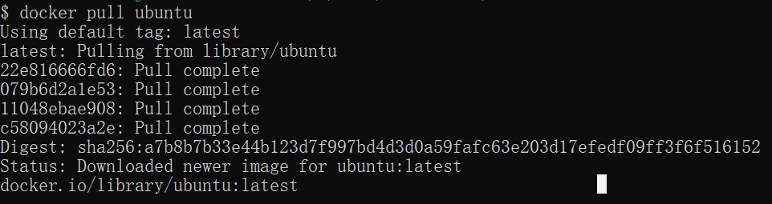

# Docker 教程

Docker 是一个开源的应用容器引擎，基于 [[Go
语言]{.underline}](https://www.runoob.com/go/go-tutorial.html) 并遵从
Apache2.0 协议开源。

Docker
可以让开发者打包他们的应用以及依赖包到一个轻量级、可移植的容器中，然后发布到任何流行的
Linux 机器上，也可以实现虚拟化。

容器是完全使用沙箱机制，相互之间不会有任何接口（类似 iPhone 的
app）,更重要的是容器性能开销极低。

Docker 从 17.03 版本之后分为 CE（Community Edition: 社区版） 和
EE（Enterprise Edition: 企业版），我们用[社区版]{.mark}就可以了。

## 谁适合阅读本教程？

本教程适合运维工程师及后端开发人员，通过本教程你可以一步一步了解 Docker
的使用。

## Docker的应用场景

-   Web 应用的自动化打包和发布。

-   自动化测试和持续集成、发布。

-   在服务型环境中部署和调整数据库或其他的后台应用。

-   从头编译或者扩展现有的 OpenShift 或 Cloud Foundry 平台来搭建自己的
    PaaS 环境。

## Docker 的优点

### 1、快速，一致地交付您的应用程序

### 2、响应式部署和扩展

### 3、在同一硬件上运行更多工作负载

## 相关链接

Docker
官网：[[https://www.docker.com]{.underline}](https://www.docker.com/)

Github Docker
源码：[[https://github.com/docker/docker-ce]{.underline}](https://github.com/docker/docker-ce)

# Docker 架构

Docker 包括三个基本概念:

-   **镜像（Image）**：Docker 镜像（Image），就相当于是一个 root
    文件系统。比如官方镜像 ubuntu:16.04 就包含了完整的一套 Ubuntu16.04
    最小系统的 root 文件系统。

-   **容器（Container）**：镜像（Image）和容器（Container）的关系，就像是面向对象程序设计中的类和实例一样，镜像是静态的定义，容器是镜像运行时的实体。容器可以被创建、启动、停止、删除、暂停等。

-   **仓库（Repository）**：仓库可看成一个代码控制中心，用来保存镜像。

Docker 使用客户端-服务器 (C/S)
架构模式，使用远程API来管理和创建Docker容器。

Docker 容器通过 Docker 镜像来创建。

容器与镜像的关系类似于面向对象编程中的对象与类。

  -----------------------------------------------------------------------
  Docker                            面向对象
  --------------------------------- -------------------------------------
  容器                              对象

  镜像                              类
  -----------------------------------------------------------------------

{width="5.385416666666667in"
height="4.083333333333333in"}

+---------------+------------------------------------------------------+
| 概念          | 说明                                                 |
+===============+======================================================+
| Docker        | Docker 镜像是用于创建 Docker 容器的模板，比如 Ubuntu |
| 镜像(Images)  | 系统。                                               |
+---------------+------------------------------------------------------+
| Docker        | 容器是独立运行的一个或一组应用，是镜像运行时的实体。 |
| 容            |                                                      |
| 器(Container) |                                                      |
+---------------+------------------------------------------------------+
| Docker        | Docker 客户端通过命令行或者其他工具使用 Docker SDK   |
| 客            | ([[https://docs.docker.com/develop/sdk/]             |
| 户端(Client)  | {.underline}](https://docs.docker.com/develop/sdk/)) |
|               | 与 Docker 的守护进程通信。                           |
+---------------+------------------------------------------------------+
| Docker        | 一个物理或者虚拟的机器用于执行 Docker                |
| 主机(Host)    | 守护进程和容器。                                     |
+---------------+------------------------------------------------------+
| Docker        | Docker                                               |
| Registry      | 仓库用来保存镜像，可以理解为代码控制中的代码仓库。   |
|               |                                                      |
|               | Docker                                               |
|               | Hub([[https://hu                                     |
|               | b.docker.com]{.underline}](https://hub.docker.com/)) |
|               | 提供了庞大的镜像集合供使用。                         |
|               |                                                      |
|               | 一个 Docker Registry                                 |
|               | 中可以包含多个仓库（Repository）；每个               |
|               | 仓库可以包含多个标签（Tag）；每个标签对应一个镜像。  |
|               |                                                      |
|               | 通常，一个仓库会包含同一个软件不同版本的镜           |
|               | 像，而标签就常用于对应该软件的各个版本。我们可以通过 |
|               | \<仓库名\>:\<标签\>的格式来指                        |
|               | 定具体是这个软件哪个版本的镜像。如果不给出标签，将以 |
|               | **latest**作为默认标签。                             |
+---------------+------------------------------------------------------+
| Docker        | Docker                                               |
| Machine       | Mac                                                  |
|               | hine是一个简化Docker安装的命令行工具，通过一个简单的 |
|               | 命令行即可在相应的平台上安装Docker，比如VirtualBox、 |
|               | Digital Ocean、Microsoft Azure。                     |
+---------------+------------------------------------------------------+

# Ubuntu Docker 安装

## 手动安装

### 卸载旧版本

Docker 的旧版本被称为 docker，docker.io 或 docker-engine
。如果已安装，请卸载它们：

\$ sudo apt-get remove docker docker-engine docker.io containerd runc

当前称为 Docker Engine-Community 软件包 docker-ce 。

安装 Docker Engine-Community，以下介绍两种方式。

### 使用 Docker 仓库进行安装

在新主机上首次安装 Docker Engine-Community 之前，需要设置 Docker
仓库。之后，您可以从仓库安装和更新 Docker 。

### 设置仓库

更新 apt 包索引。

\$ sudo apt-get update

安装 apt 依赖包，用于通过HTTPS来获取仓库:

\$ **sudoapt-get install** \\\
    apt-transport-https \\\
    ca-certificates \\\
    curl \\\
    gnupg-agent \\\
    software-properties-common

添加 Docker 的官方 GPG 密钥：

\$ curl -fsSL https://mirrors.ustc.edu.cn/docker-ce/linux/ubuntu/gpg \|
sudo apt-key add -

9DC8 5822 9FC7 DD38 854A E2D8 8D81 803C 0EBF CD88
通过搜索指纹的后8个字符，验证您现在是否拥有带有指纹的密钥。

\$ **sudoapt-key** fingerprint 0EBFCD88\
   \
pub   rsa4096 2017-02-22**\[**SCEA**\]**\
      9DC8 5822 9FC7 DD38 854A  E2D8 8D81 803C 0EBF CD88\
uid           **\[** unknown**\]** Docker Release **(**CE
deb**)\<**docker**@**docker.com**\>**\
sub   rsa4096 2017-02-22**\[**S**\]**

使用以下指令设置稳定版仓库

\$ **sudo** add-apt-repository \\\
   \"deb \[arch=amd64\]
https://mirrors.ustc.edu.cn/docker-ce/linux/ubuntu/ **\\\
**  \$(lsb_release -cs)**\\\
**  stable\"

### 安装 Docker Engine-Community

更新 apt 包索引。

\$ sudo apt-get update

安装最新版本的 Docker Engine-Community 和 containerd
，或者转到下一步安装特定版本：

\$ sudo apt-get install docker-ce docker-ce-cli containerd.io

要安装特定版本的 Docker
Engine-Community，请在仓库中列出可用版本，然后选择一种安装。列出您的仓库中可用的版本：

\$ **apt-cache** madison docker-ce\
\
  docker-ce **\|**5:18.09.1\~3-0\~ubuntu-xenial **\|**
https:**//**mirrors.ustc.edu.cn**/**docker-ce**/**linux**/**ubuntu
 xenial**/**stable amd64 Packages\
  docker-ce **\|**5:18.09.0\~3-0\~ubuntu-xenial **\|**
https:**//**mirrors.ustc.edu.cn**/**docker-ce**/**linux**/**ubuntu
 xenial**/**stable amd64 Packages\
  docker-ce **\|** 18.06.1\~ce\~3-0\~ubuntu       **\|**
https:**//**mirrors.ustc.edu.cn**/**docker-ce**/**linux**/**ubuntu
 xenial**/**stable amd64 Packages\
  docker-ce **\|** 18.06.0\~ce\~3-0\~ubuntu       **\|**
https:**//**mirrors.ustc.edu.cn**/**docker-ce**/**linux**/**ubuntu
 xenial**/**stable amd64 Packages\
  \...

使用第二列中的版本字符串安装特定版本，例如
5:18.09.1\~3-0\~ubuntu-xenial。

\$ sudo apt-get install docker-ce=\<VERSION_STRING\>
docker-ce-cli=\<VERSION_STRING\> containerd.io

测试 Docker 是否安装成功，输入以下指令，打印出以下信息则安装成功:

\$ **sudo** docker run hello-world\
\
Unable to **find** image \'hello-world:latest\' locally\
latest: Pulling from library**/**hello-world\
1b930d010525: Pull **complete**                                        
                                                                       
                 Digest:
sha256:c3b4ada4687bbaa170745b3e4dd8ac3f194ca95b2d0518b417fb47e5879d9b5f\
Status: Downloaded newer image **for** hello-world:latest\
\
\
Hello from Docker**!**\
This message shows that your installation appears to be working
correctly.\
\
\
To generate this message, Docker took the following steps:\
 1. The Docker client contacted the Docker daemon.\
 2. The Docker daemon pulled the \"hello-world\" image from the Docker
Hub.\
    **(**amd64**)**\
 3. The Docker daemon created a new container from that image **which**
runs the\
    executable that produces the output you are currently reading.\
 4. The Docker daemon streamed that output to the Docker client,
**which** sent it\
    to your terminal.\
\
\
To try something **more** ambitious, you can run an Ubuntu container
with:\
 \$ docker run -it ubuntu **bash**\
\
\
Share images, automate workflows, and **more** with a **free** Docker
ID:\
 https:**//**hub.docker.com**/**\
\
\
For **more** examples and ideas, visit:\
 https:**//**docs.docker.com**/**get-started**/**

## 使用 Shell 脚本进行安装

Docker 在 [[get.docker.com]{.underline}](https://get.docker.com/) 和
[[test.docker.com]{.underline}](https://test.docker.com/)上提供了方便脚本，用于将快速安装
Docker Engine-Community 的边缘版本和测试版本。脚本的源代码在
docker-install 仓库中。
不建议在生产环境中使用这些脚本，在使用它们之前，您应该了解潜在的风险：

-   脚本需要运行 root 或具有 sudo
    特权。因此，在运行脚本之前，应仔细检查和审核脚本。

-   这些脚本尝试检测 Linux
    发行版和版本，并为您配置软件包管理系统。此外，脚本不允许您自定义任何安装参数。从
    Docker
    的角度或您自己组织的准则和标准的角度来看，这可能导致不支持的配置。

-   这些脚本将安装软件包管理器的所有依赖项和建议，而无需进行确认。这可能会安装大量软件包，具体取决于主机的当前配置。

-   该脚本未提供用于指定要安装哪个版本的 Docker 的选项，而是安装了在
    edge 通道中发布的最新版本。

-   如果已使用其他机制将 Docker 安装在主机上，请不要使用便捷脚本。

本示例使用 [[get.docker.com]{.underline}](https://get.docker.com/)
上的脚本在 Linux 上安装最新版本的Docker
Engine-Community。要安装最新的测试版本，请改用
test.docker.com。在下面的每个命令，取代每次出现 get 用 test。

\$ curl -fsSL https://get.docker.com -o get-docker.sh

\$ sudo sh get-docker.sh

如果要使用 Docker 作为非 root 用户，则应考虑使用类似以下方式将用户添加到
docker 组：

\$ sudo usermod -aG docker your-user

### 卸载 docker

删除安装包：

sudo apt-get purge docker-ce

删除镜像、容器、配置文件等内容：

sudo rm -rf /var/lib/docker

# CentOS Docker 安装

Docker 支持以下的 64 位 CentOS 版本：

-   CentOS 7

-   CentOS 8

-   更高版本\...

## 使用官方安装脚本自动安装

安装命令如下：

curl -fsSL https://get.docker.com \| bash -s docker \--mirror Aliyun

也可以使用国内 daocloud 一键安装命令：

curl -sSL https://get.daocloud.io/docker \| sh

## 手动安装

### 卸载旧版本

较旧的 Docker 版本称为 docker 或 docker-engine
。如果已安装这些程序，请卸载它们以及相关的依赖项。

\$ **sudo yum remove** docker \\\
                  docker-client \\\
                  docker-client-latest \\\
                  docker-common \\\
                  docker-latest \\\
                  docker-latest-logrotate \\\
                  docker-logrotate \\\
                  docker-engine

### 安装 Docker Engine-Community

### 使用 Docker 仓库进行安装

在新主机上首次安装 Docker Engine-Community 之前，需要设置 Docker
仓库。之后，您可以从仓库安装和更新 Docker。

**设置仓库**

安装所需的软件包。yum-utils 提供了 yum-config-manager ，并且 device
mapper 存储驱动程序需要 device-mapper-persistent-data 和 lvm2。

\$ **sudoyum install**-y yum-utils \\\
  device-mapper-persistent-data \\\
  lvm2

使用以下命令来设置稳定的仓库。

## 使用官方源地址（比较慢）

\$ **sudo** yum-config-manager \\\
    \--add-repo \\\
   
https:**//**download.docker.com**/**linux**/**centos**/**docker-ce.repo

可以选择国内的一些源地址：

## 阿里云

\$ **sudo** yum-config-manager \\\
    \--add-repo \\\
   
http:**//**mirrors.aliyun.com**/**docker-ce**/**linux**/**centos**/**docker-ce.repo

## 清华大学源

\$ **sudo** yum-config-manager \\\
    \--add-repo \\\
   
https:**//**mirrors.tuna.tsinghua.edu.cn**/**docker-ce**/**linux**/**centos**/**docker-ce.repo

### 安装 Docker Engine-Community

安装最新版本的 Docker Engine-Community 和
containerd，或者转到下一步安装特定版本：

\$ sudo yum install docker-ce docker-ce-cli containerd.io

如果提示您接受 GPG 密钥，请选是。

> **有多个 Docker 仓库吗？**
>
> 如果启用了多个 Docker 仓库，则在未在 yum install 或 yum update
> 命令中指定版本的情况下，进行的安装或更新将始终安装最高版本，这可能不适合您的稳定性需求。

Docker 安装完默认未启动。并且已经创建好 docker
用户组，但该用户组下没有用户。

**要安装特定版本的 Docker
Engine-Community，请在存储库中列出可用版本，然后选择并安装：**

1、列出并排序您存储库中可用的版本。此示例按版本号（从高到低）对结果进行排序。

\$ **yum list** docker-ce \--showduplicates**\|sort**-r\
\
docker-ce.x86_64  3:18.09.1-3.el7                     docker-ce-stable\
docker-ce.x86_64  3:18.09.0-3.el7                     docker-ce-stable\
docker-ce.x86_64  18.06.1.ce-3.el7                    docker-ce-stable\
docker-ce.x86_64  18.06.0.ce-3.el7                    docker-ce-stable

2、通过其完整的软件包名称安装特定版本，该软件包名称是软件包名称（docker-ce）加上版本字符串（第二列），从第一个冒号（:）一直到第一个连字符，并用连字符（-）分隔。例如：docker-ce-18.09.1。

\$ sudo yum install docker-ce-\<VERSION_STRING\>
docker-ce-cli-\<VERSION_STRING\> containerd.io

启动 Docker。

\$ sudo systemctl start docker

通过运行 hello-world 映像来验证是否正确安装了 Docker Engine-Community 。

\$ sudo docker run hello-world

### 卸载 docker

删除安装包：

yum remove docker-ce

删除镜像、容器、配置文件等内容：

rm -rf /var/lib/docker

# Docker Hello World 

Docker 允许你在容器内运行应用程序， 使用 **docker
run** 命令来在容器内运行一个应用程序。

输出Hello world

runoob@runoob:\~\$ docker run ubuntu:15.10 /bin/echo \"Hello world\"

Hello world

{width="5.770833333333333in" height="0.34375in"}

各个参数解析：

-   **docker:** Docker 的二进制执行文件。

-   **run:**与前面的 docker 组合来运行一个容器。

-   **ubuntu:15.10**指定要运行的镜像，Docker
    首先从本地主机上查找镜像是否存在，如果不存在，Docker
    就会从镜像仓库 Docker Hub 下载公共镜像。

-   **/bin/echo \"Hello world\":** 在启动的容器里执行的命令

以上命令完整的意思可以解释为：Docker 以 ubuntu15.10
镜像创建一个新容器，然后在容器里执行 bin/echo \"Hello
world\"，然后输出结果。

## 运行交互式的容器

我们通过 docker 的两个参数 -i -t，让 docker
运行的容器实现**\"对话\"**的能力：

runoob@runoob:\~\$ docker run -i -t ubuntu:15.10 /bin/bash

root@0123ce188bd8:/#

各个参数解析：

-   **-t:**在新容器内指定一个伪终端或终端。

-   **-i:**允许你对容器内的标准输入 (STDIN) 进行交互。

注意第二行 root@0123ce188bd8:/#，此时我们已进入一个 ubuntu15.10
系统的容器

我们尝试在容器中运行命令**cat
/proc/version**和**ls**分别查看当前系统的版本信息和当前目录下的文件列表

root@0123ce188bd8:/# cat /proc/version

Linux version 4.4.0-151-generic (buildd@lgw01-amd64-043) (gcc version
5.4.0 20160609 (Ubuntu 5.4.0-6ubuntu1\~16.04.10) ) #178-Ubuntu SMP Tue
Jun 11 08:30:22 UTC 2019

root@0123ce188bd8:/# ls

bin boot dev etc home lib lib64 media mnt opt proc root run sbin srv sys
tmp usr var

root@0123ce188bd8:/#

我们可以通过运行 exit 命令或者使用 CTRL+D 来退出容器。

root@0123ce188bd8:/# exit

exit

root@runoob:\~#

注意第三行中 root@runoob:\~#
表明我们已经退出了当前的容器，返回到当前的主机中。

## 启动容器（后台模式）

使用以下命令创建一个以进程方式运行的容器

runoob@runoob:\~\$ docker run -d ubuntu:15.10 /bin/sh -c \"while true;
do echo hello world; sleep 1; done\"

2b1b7a428627c51ab8810d541d759f072b4fc75487eed05812646b8534a2fe63

在输出中，我们没有看到期望的 \"hello world\"，而是一串长字符

**2b1b7a428627c51ab8810d541d759f072b4fc75487eed05812646b8534a2fe63**

这个长字符串叫做容器 ID，对每个容器来说都是唯一的，我们可以通过容器 ID
来查看对应的容器发生了什么。

首先，我们需要确认容器有在运行，可以通过 **docker ps**来查看：

runoob@runoob:\~\$ docker ps

CONTAINER ID IMAGE COMMAND \...

5917eac21c36 ubuntu:15.10 \"/bin/sh -c \'while t...\" \...

输出详情介绍：

**CONTAINER ID:**容器 ID。

**IMAGE:**使用的镜像。

**COMMAND:**启动容器时运行的命令。

**CREATED:**容器的创建时间。

**STATUS:**容器状态。

状态有7种：

-   created（已创建）

-   restarting（重启中）

-   running 或 Up（运行中）

-   removing（迁移中）

-   paused（暂停）

-   exited（停止）

-   dead（死亡）

**PORTS:**容器的端口信息和使用的连接类型（tcp\\udp）。

**NAMES:**自动分配的容器名称。

在宿主主机内使用 docker logs 命令，查看容器内的标准输出：

runoob@runoob:\~\$ docker logs 2b1b7a428627

{width="3.7083333333333335in"
height="2.2291666666666665in"}

runoob@runoob:\~\$ docker logs amazing_cori

{width="3.59375in" height="2.5104166666666665in"}

## 停止容器

我们使用 **docker stop**命令来停止容器:

{width="3.6770833333333335in"
height="0.3333333333333333in"}

通过 docker ps 查看，容器已经停止工作:

runoob@runoob:\~\$ docker ps

可以看到容器已经不在了。

也可以用下面的命令来停止:

runoob@runoob:\~\$ docker stop amazing_cori

# Docker 容器使用

## Docker 客户端

docker 客户端非常简单 ,我们可以直接输入 docker 命令来查看到 Docker
客户端的所有命令选项。

runoob@runoob:\~# docker

{width="5.770833333333333in"
height="3.5833333333333335in"}

可以通过命令 **docker command \--help**更深入的了解指定的 Docker
命令使用方法。

例如我们要查看 **docker stats**指令的具体使用方法：

runoob@runoob:\~# docker stats \--help

{width="5.770833333333333in"
height="1.1770833333333333in"}

## 容器使用

### 获取镜像

如果我们本地没有 ubuntu 镜像，我们可以使用 docker pull 命令来载入 ubuntu
镜像：

\$ docker pull ubuntu

### 启动容器

以下命令使用 ubuntu 镜像启动一个容器，参数为以命令行模式进入该容器：

\$ docker run -it ubuntu /bin/bash

{width="6.174390857392826in"
height="0.3457655293088364in"}

参数说明：

-   **-i**: 交互式操作。

-   **-t**: 终端。

-   **ubuntu**: ubuntu 镜像。

-   **/bin/bash**：放在镜像名后的是命令，这里我们希望有个交互式
    Shell，因此用的是 /bin/bash。

要退出终端，直接输入 **exit**:

root@ed09e4490c57:/# exit

{width="6.791476377952756in"
height="0.5224212598425196in"}

### 启动已停止运行的容器

查看所有的容器命令如下：

\$ docker ps -a

点击图片查看大图：

{width="9.892787620297463in"
height="0.4166513560804899in"}

使用 docker start 启动一个已停止的容器：

\$ docker start b750bbbcfd88

{width="6.664632545931759in"
height="0.3928204286964129in"}

### 后台运行

在大部分的场景下，我们希望 docker 的服务是在后台运行的，我们可以过 -d
指定容器的运行模式。

\$ docker run -itd \--name ubuntu-test ubuntu /bin/bash

点击图片查看大图：

{width="10.311452318460193in"
height="0.402334864391951in"}

{width="10.34051290463692in"
height="0.46010279965004375in"}

**注：**加了 -d 参数默认不会进入容器，想要进入容器需要使用指令**docker
exec**（下面会介绍到）。

### 停止一个容器

停止容器的命令如下：

\$ docker stop \<容器 ID\>

{width="6.57117125984252in"
height="0.36105424321959756in"}

停止的容器可以通过 docker restart 重启：

\$ docker restart \<容器 ID\>

{width="6.3562117235345585in"
height="0.3682917760279965in"}

### 进入容器

在使用
**-d**参数时，容器启动后会进入后台。此时想要进入容器，可以通过以下指令进入：

-   **docker attach**

-   **docker exec**：推荐大家使用 docker exec
    命令，因为此退出容器终端，不会导致容器的停止。

**attach 命令**

下面演示了使用 docker attach 命令。

\$ docker attach 1e560fca3906

{width="5.680555555555555in"
height="1.226388888888889in"}

**注意：** 如果从这个容器退出，会导致容器的停止。

**exec 命令**

下面演示了使用 docker exec 命令。

docker exec -it 243c32535da7 /bin/bash

{width="5.916666666666667in"
height="1.2006944444444445in"}

**注意：** 如果从这个容器退出，容器不会停止，这就是为什么推荐大家使用
**docker exec**的原因。

更多参数说明请使用 docker exec \--help 命令查看。

### 导出和导入容器

**导出容器**

如果要导出本地某个容器，可以使用 **docker export**命令。

\$ docker export 1e560fca3906 \> ubuntu.tar

导出容器 1e560fca3906 快照到本地文件 ubuntu.tar。

{width="6.050694444444445in"
height="1.0840277777777778in"}

这样将导出容器快照到本地文件。

**导入容器快照**

可以使用 docker import 从容器快照文件中再导入为镜像，以下实例将快照文件
ubuntu.tar 导入到镜像 test/ubuntu:v1:

\$ cat docker/ubuntu.tar \| docker import - test/ubuntu:v1

{width="6.186111111111111in"
height="1.3409722222222222in"}

此外，也可以通过指定 URL 或者某个目录来导入，例如：

\$ docker import http://example.com/exampleimage.tgz example/imagerepo

### 删除容器

删除容器使用 **docker rm**命令：

\$ docker rm -f 1e560fca3906

{width="6.197279090113736in"
height="1.2599289151356081in"}

下面的命令可以清理掉所有处于终止状态的容器。

\$ docker container prune

## 运行一个 web 应用

前面我们运行的容器并没有一些什么特别的用处。

接下来让我们尝试使用 docker 构建一个 web 应用程序。

我们将在docker容器中运行一个 Python Flask 应用来运行一个web应用。

runoob@runoob:\~# docker pull training/webapp \# 载入镜像

runoob@runoob:\~# docker run -d -P training/webapp python app.py

{width="5.770833333333333in" height="0.5in"}

参数说明:

-   **-d:**让容器在后台运行。

-   **-P:**将容器内部使用的网络端口随机映射到我们使用的主机上。

## 查看 WEB 应用容器

使用 docker ps 来查看我们正在运行的容器：

runoob@runoob:\~# docker ps

CONTAINER ID IMAGE COMMAND \... PORTS

d3d5e39ed9d3 training/webapp \"python app.py\" \...
0.0.0.0:32769-\>5000/tcp

这里多了端口信息。

PORTS

0.0.0.0:32769-\>5000/tcp

Docker 开放了 5000 端口（默认 Python Flask 端口）映射到主机端口 32769
上。

这时我们可以通过浏览器访问WEB应用

{width="3.78125in" height="0.875in"}

我们也可以通过 -p 参数来设置不一样的端口：

runoob@runoob:\~\$ docker run -d -p 5000:5000 training/webapp python
app.py

**docker ps**查看正在运行的容器

runoob@runoob:\~# docker ps

CONTAINER ID IMAGE PORTS NAMES

bf08b7f2cd89 training/webapp \... 0.0.0.0:5000-\>5000/tcp
wizardly_chandrasekhar

d3d5e39ed9d3 training/webapp \... 0.0.0.0:32769-\>5000/tcp
xenodochial_hoov

容器内部的 5000 端口映射到我们本地主机的 5000 端口上。

## 网络端口的快捷方式

通过 **docker
ps** 命令可以查看到容器的端口映射，**docker**还提供了另一个快捷方式
**docker port**，使用 **docker port** 可以查看指定 （ID
或者名字）容器的某个确定端口映射到宿主机的端口号。

上面我们创建的 web 应用容器 ID 为 **bf08b7f2cd89**名字为
**wizardly_chandrasekhar**。

我可以使用 docker port bf08b7f2cd89 或 docker port
wizardly_chandrasekhar 来查看容器端口的映射情况。

runoob@runoob:\~\$ docker port bf08b7f2cd89

5000/tcp -\> 0.0.0.0:5000

runoob@runoob:\~\$ docker port wizardly_chandrasekhar

5000/tcp -\> 0.0.0.0:5000

## 查看 WEB 应用程序日志

docker logs \[ID或者名字\] 可以查看容器内部的标准输出。

runoob@runoob:\~\$ docker logs -f bf08b7f2cd89

\* Running on http://0.0.0.0:5000/ (Press CTRL+C to quit)

192.168.239.1 - - \[09/May/2016 16:30:37\] \"GET / HTTP/1.1\" 200 -

192.168.239.1 - - \[09/May/2016 16:30:37\] \"GET /favicon.ico HTTP/1.1\"
404 -

**-f:**让 **docker logs**像使用 **tail
-f** 一样来输出容器内部的标准输出。

从上面，我们可以看到应用程序使用的是 5000
端口并且能够查看到应用程序的访问日志。

## 查看WEB应用程序容器的进程

我们还可以使用 docker top 来查看容器内部运行的进程

runoob@runoob:\~\$ docker top wizardly_chandrasekhar

UID PID PPID \... TIME CMD

root 23245 23228 \... 00:00:00 python app.py

## 检查 WEB 应用程序

使用 **docker inspect** 来查看 Docker 的底层信息。它会返回一个 JSON
文件记录着 Docker 容器的配置和状态信息。

runoob@runoob:\~\$ docker inspect wizardly_chandrasekhar

\[

{

\"Id\":
\"bf08b7f2cd897b5964943134aa6d373e355c286db9b9885b1f60b6e8f82b2b85\",

\"Created\": \"2018-09-17T01:41:26.174228707Z\",

\"Path\": \"python\",

\"Args\": \[

\"app.py\"

\],

\"State\": {

\"Status\": \"running\",

\"Running\": true,

\"Paused\": false,

\"Restarting\": false,

\"OOMKilled\": false,

\"Dead\": false,

\"Pid\": 23245,

\"ExitCode\": 0,

\"Error\": \"\",

\"StartedAt\": \"2018-09-17T01:41:26.494185806Z\",

\"FinishedAt\": \"0001-01-01T00:00:00Z\"

},

\...\...

## 停止 WEB 应用容器

runoob@runoob:\~\$ docker stop wizardly_chandrasekhar

wizardly_chandrasekhar

## 重启WEB应用容器

已经停止的容器，我们可以使用命令 docker start 来启动。

runoob@runoob:\~\$ docker start wizardly_chandrasekhar

wizardly_chandrasekhar

docker ps -l 查询最后一次创建的容器：

\# docker ps -l

CONTAINER ID IMAGE PORTS NAMES

bf08b7f2cd89 training/webapp \... 0.0.0.0:5000-\>5000/tcp
wizardly_chandrasekhar

正在运行的容器，我们可以使用 docker restart 命令来重启。

## 移除WEB应用容器

我们可以使用 docker rm 命令来删除不需要的容器

runoob@runoob:\~\$ docker rm wizardly_chandrasekhar

wizardly_chandrasekhar

删除容器时，容器必须是停止状态，否则会报如下错误

runoob@runoob:\~\$ docker rm wizardly_chandrasekhar

Error response from daemon: You cannot remove a running container
bf08b7f2cd897b5964943134aa6d373e355c286db9b9885b1f60b6e8f82b2b85. Stop
the container before attempting removal or force remove

\-\-\-\-\-\-\-\-\-\-\-\-\-\-\-\-\-\-\-\-\-\-\-\-\-\-\-\-\-\-\-\-\-\-\-\-\-\-\-\-\-\-\-\-\-\-\-\-\-\-\-\-\-\-\-\-\-\-\-\-\-\-\-\-\-\-\-\-\-\-\-\-\-\-\-\-\-\-\-\-\-\-\-\-\-\-\-\-\-\-\-\-\-\-\-\-\--

安装完docker后，执行docker相关命令，出现：

"Got permission denied while trying to connect to the Docker daemon
socket at unix:///var/run/docker.sock: Get
http://%2Fvar%2Frun%2Fdocker.sock/v1.26/images/json: dial unix
/var/run/docker.sock: connect: permission denied"

**原因**

摘自docker mannual上的一段话：

Manage Docker as a non-root user

The docker daemon binds to a Unix socket instead of a TCP port. By
default that Unix socket is owned by the user root and other users can
only access it using sudo. The docker daemon always runs as the root
user.

If you don't want to use sudo when you use the docker command, create a
Unix group called docker and add users to it. When the docker daemon
starts, it makes the ownership of the Unix socket read/writable by the
docker group

大概的意思就是：docker进程使用Unix
Socket而不是TCP端口。而默认情况下，Unix
socket属于root用户，需要root权限才能访问。

**解决方法1**

使用sudo获取管理员权限，运行docker命令

**解决方法2**

docker守护进程启动的时候，会默认赋予名字为docker的用户组读写Unix
socket的权限，因此只要创建docker用户组，并将当前用户加入到docker用户组中，那么当前用户就有权限访问Unix
socket了，进而也就可以执行docker相关命令

sudo groupadd docker #添加docker用户组

sudo gpasswd -a \$USER docker #将登陆用户加入到docker用户组中

newgrp docker #更新用户组

docker ps #测试docker命令是否可以使用sudo正常使用

# Docker 镜像使用

当运行容器时，使用的镜像如果在本地中不存在，docker 就会自动从 docker
镜像仓库中下载，默认是从 Docker Hub 公共镜像源下载。

下面我们来学习：

-   1、管理和使用本地 Docker 主机镜像

-   2、创建镜像

## 列出镜像列表

我们可以使用 **docker images** 来列出本地主机上的镜像。

runoob@runoob:\~\$ docker images

REPOSITORY TAG IMAGE ID CREATED SIZE

ubuntu 14.04 90d5884b1ee0 5 days ago 188 MB

php 5.6 f40e9e0f10c8 9 days ago 444.8 MB

nginx latest 6f8d099c3adc 12 days ago 182.7 MB

mysql 5.6 f2e8d6c772c0 3 weeks ago 324.6 MB

httpd latest 02ef73cf1bc0 3 weeks ago 194.4 MB

ubuntu 15.10 4e3b13c8a266 4 weeks ago 136.3 MB

hello-world latest 690ed74de00f 6 months ago 960 B

training/webapp latest 6fae60ef3446 11 months ago 348.8 MB

各个选项说明:

-   **REPOSITORY：**表示镜像的仓库源

-   **TAG：**镜像的标签

-   **IMAGE ID：**镜像ID

-   **CREATED：**镜像创建时间

-   **SIZE：**镜像大小

同一仓库源可以有多个 TAG，代表这个仓库源的不同个版本，如 ubuntu
仓库源里，有 15.10、14.04 等多个不同的版本，我们使用 REPOSITORY:TAG
来定义不同的镜像。

所以，我们如果要使用版本为15.10的ubuntu系统镜像来运行容器时，命令如下：

runoob@runoob:\~\$ docker run -t -i ubuntu:15.10 /bin/bash

root@d77ccb2e5cca:/#

参数说明：

-   **-i**: 交互式操作。

-   **-t**: 终端。

-   **ubuntu:15.10**: 这是指用 ubuntu 15.10 版本镜像为基础来启动容器。

-   **/bin/bash**：放在镜像名后的是命令，这里我们希望有个交互式
    Shell，因此用的是 /bin/bash。

如果要使用版本为 14.04 的 ubuntu 系统镜像来运行容器时，命令如下：

runoob@runoob:\~\$ docker run -t -i ubuntu:14.04 /bin/bash

root@39e968165990:/#

如果你不指定一个镜像的版本标签，例如你只使用 ubuntu，docker
将默认使用 ubuntu:latest 镜像。

## 获取一个新的镜像

当我们在本地主机上使用一个不存在的镜像时 Docker
就会自动下载这个镜像。如果我们想预先下载这个镜像，我们可以使用 docker
pull 命令来下载它。

Crunoob@runoob:\~\$ docker pull ubuntu:13.10

13.10: Pulling from library/ubuntu

6599cadaf950: Pull complete

23eda618d451: Pull complete

f0be3084efe9: Pull complete

52de432f084b: Pull complete

a3ed95caeb02: Pull complete

Digest:
sha256:15b79a6654811c8d992ebacdfbd5152fcf3d165e374e264076aa435214a947a3

Status: Downloaded newer image for ubuntu:13.10

下载完成后，我们可以直接使用这个镜像来运行容器。

## 查找镜像

我们可以从 Docker Hub 网站来搜索镜像，Docker Hub 网址为：
[**https://hub.docker.com/**](https://hub.docker.com/)

我们也可以使用 docker search 命令来搜索镜像。比如我们需要一个 httpd
的镜像来作为我们的 web 服务。我们可以通过 docker
search 命令搜索 httpd 来寻找适合我们的镜像。

runoob@runoob:\~\$ docker search httpd

点击图片查看大图：

{width="6.665444006999125in"
height="1.2870264654418198in"}

**NAME:** 镜像仓库源的名称

**DESCRIPTION:** 镜像的描述

**OFFICIAL:** 是否 docker 官方发布

**stars:** 类似 Github 里面的 star，表示点赞、喜欢的意思。

**AUTOMATED:** 自动构建。

## 拖取镜像

我们决定使用上图中的 httpd 官方版本的镜像，使用命令 docker pull
来下载镜像。

runoob@runoob:\~\$ docker pull httpd

Using default tag: latest

latest: Pulling from library/httpd

8b87079b7a06: Pulling fs layer

a3ed95caeb02: Download complete

0d62ec9c6a76: Download complete

a329d50397b9: Download complete

ea7c1f032b5c: Waiting

be44112b72c7: Waiting

下载完成后，我们就可以使用这个镜像了。

runoob@runoob:\~\$ docker run httpd

## 删除镜像

镜像删除使用 **docker rmi**命令，比如我们删除 hello-world 镜像：

\$ docker rmi hello-world

{width="6.572220034995626in"
height="0.7793602362204725in"}

## 创建镜像

当我们从 docker
镜像仓库中下载的镜像不能满足我们的需求时，我们可以通过以下两种方式对镜像进行更改。

-   1、从已经创建的容器中更新镜像，并且提交这个镜像

-   2、使用 Dockerfile 指令来创建一个新的镜像

### 更新镜像

更新镜像之前，我们需要使用镜像来创建一个容器。

runoob@runoob:\~\$ docker run -t -i ubuntu:15.10 /bin/bash

root@e218edb10161:/#

在运行的容器内使用 **apt-get update**命令进行更新。

在完成操作之后，输入 exit 命令来退出这个容器。

此时 ID 为 e218edb10161
的容器，是按我们的需求更改的容器。我们可以通过命令 docker commit
来提交容器副本。

runoob@runoob:\~\$ docker commit -m=\"has update\" -a=\"runoob\"
e218edb10161 runoob/ubuntu:v2

sha256:70bf1840fd7c0d2d8ef0a42a817eb29f854c1af8f7c59fc03ac7bdee9545aff8

各个参数说明：

-   **-m:**提交的描述信息

-   **-a:**指定镜像作者

-   **e218edb10161：**容器 ID

-   **runoob/ubuntu:v2:**指定要创建的目标镜像名

我们可以使用 **docker images** 命令来查看我们的新镜像
**runoob/ubuntu:v2**：

runoob@runoob:\~\$ docker images

REPOSITORY TAG IMAGE ID CREATED SIZE

runoob/ubuntu v2 70bf1840fd7c 15 seconds ago 158.5 MB

ubuntu 14.04 90d5884b1ee0 5 days ago 188 MB

php 5.6 f40e9e0f10c8 9 days ago 444.8 MB

nginx latest 6f8d099c3adc 12 days ago 182.7 MB

mysql 5.6 f2e8d6c772c0 3 weeks ago 324.6 MB

httpd latest 02ef73cf1bc0 3 weeks ago 194.4 MB

ubuntu 15.10 4e3b13c8a266 4 weeks ago 136.3 MB

hello-world latest 690ed74de00f 6 months ago 960 B

training/webapp latest 6fae60ef3446 12 months ago 348.8 MB

使用我们的新镜像 **runoob/ubuntu**来启动一个容器

runoob@runoob:\~\$ docker run -t -i runoob/ubuntu:v2 /bin/bash

root@1a9fbdeb5da3:/#

### 构建镜像

我们使用命令 **docker build**，
从零开始来创建一个新的镜像。为此，我们需要创建一个 Dockerfile 文件，其中包含一组指令来告诉Docker
如何构建我们的镜像。

runoob@runoob:\~\$ cat Dockerfile

FROM centos:6.7

MAINTAINER Fisher \"fisher@sudops.com\"

RUN /bin/echo \'root:123456\' \|chpasswd

RUN useradd runoob

RUN /bin/echo \'runoob:123456\' \|chpasswd

RUN /bin/echo -e \"LANG=\\\"en_US.UTF-8\\\"\"\>/etc/default/local

EXPOSE 22

EXPOSE 80

CMD /usr/sbin/sshd -D

每一个指令都会在镜像上创建一个新的层，每一个指令的前缀都必须是大写的。

第一条FROM，指定使用哪个镜像源

RUN 指令告诉docker 在镜像内执行命令，安装了什么。。。

然后，我们使用 Dockerfile 文件，通过 docker build 命令来构建一个镜像。

runoob@runoob:\~\$ docker build -t runoob/centos:6.7 .

Sending build context to Docker daemon 17.92 kB

Step 1 : FROM centos:6.7

\-\--&gt; d95b5ca17cc3

Step 2 : MAINTAINER Fisher \"fisher@sudops.com\"

\-\--&gt; Using cache

\-\--&gt; 0c92299c6f03

Step 3 : RUN /bin/echo \'root:123456\' \|chpasswd

\-\--&gt; Using cache

\-\--&gt; 0397ce2fbd0a

Step 4 : RUN useradd runoob

\...\...

参数说明：

-   **-t**：指定要创建的目标镜像名

-   **.**：Dockerfile 文件所在目录，可以指定Dockerfile 的绝对路径

使用docker images 查看创建的镜像已经在列表中存在,镜像ID为860c279d2fec

runoob@runoob:\~\$ docker images

REPOSITORY TAG IMAGE ID CREATED SIZE

runoob/centos 6.7 860c279d2fec About a minute ago 190.6 MB

runoob/ubuntu v2 70bf1840fd7c 17 hours ago 158.5 MB

ubuntu 14.04 90d5884b1ee0 6 days ago 188 MB

php 5.6 f40e9e0f10c8 10 days ago 444.8 MB

nginx latest 6f8d099c3adc 12 days ago 182.7 MB

mysql 5.6 f2e8d6c772c0 3 weeks ago 324.6 MB

httpd latest 02ef73cf1bc0 3 weeks ago 194.4 MB

ubuntu 15.10 4e3b13c8a266 5 weeks ago 136.3 MB

hello-world latest 690ed74de00f 6 months ago 960 B

centos 6.7 d95b5ca17cc3 6 months ago 190.6 MB

training/webapp latest 6fae60ef3446 12 months ago 348.8 MB

我们可以使用新的镜像来创建容器

runoob@runoob:\~\$ docker run -t -i runoob/centos:6.7 /bin/bash

\[root@41c28d18b5fb /\]# id runoob

uid=500(runoob) gid=500(runoob) groups=500(runoob)

从上面看到新镜像已经包含我们创建的用户 runoob。

### 设置镜像标签

我们可以使用 docker tag 命令，为镜像添加一个新的标签。

runoob@runoob:\~\$ docker tag 860c279d2fec runoob/centos:dev

docker tag 镜像ID，这里是 860c279d2fec ,用户名称、镜像源名(repository
name)和新的标签名(tag)。

使用 docker images 命令可以看到，ID为860c279d2fec的镜像多一个标签。

runoob@runoob:\~\$ docker images

REPOSITORY TAG IMAGE ID CREATED SIZE

runoob/centos 6.7 860c279d2fec 5 hours ago 190.6 MB

runoob/centos dev 860c279d2fec 5 hours ago 190.6 MB

runoob/ubuntu v2 70bf1840fd7c 22 hours ago 158.5 MB

ubuntu 14.04 90d5884b1ee0 6 days ago 188 MB

php 5.6 f40e9e0f10c8 10 days ago 444.8 MB

nginx latest 6f8d099c3adc 13 days ago 182.7 MB

mysql 5.6 f2e8d6c772c0 3 weeks ago 324.6 MB

httpd latest 02ef73cf1bc0 3 weeks ago 194.4 MB

ubuntu 15.10 4e3b13c8a266 5 weeks ago 136.3 MB

hello-world latest 690ed74de00f 6 months ago 960 B

centos 6.7 d95b5ca17cc3 6 months ago 190.6 MB

training/webapp latest 6fae60ef3446 12 months ago 348.8 MB

# Docker 容器连接

前面我们实现了通过网络端口来访问运行在 docker 容器内的服务。

容器中可以运行一些网络应用，要让外部也可以访问这些应用，可以通过 -P 或
-p 参数来指定端口映射。

下面我们来实现通过端口连接到一个 docker 容器。

## 网络端口映射

我们创建了一个 python 应用的容器。

runoob@runoob:\~\$ docker run -d -P training/webapp python app.py

fce072cc88cee71b1cdceb57c2821d054a4a59f67da6b416fceb5593f059fc6d

另外，我们可以指定容器绑定的网络地址，比如绑定 127.0.0.1。

我们使用 **-P**绑定端口号，使用 **docker ps**可以看到容器端口 5000
绑定主机端口 32768。

runoob@runoob:\~\$ docker ps

CONTAINER ID IMAGE COMMAND \... PORTS NAMES

fce072cc88ce training/webapp \"python app.py\" \...
0.0.0.0:32768-\>5000/tcp grave_hopper

我们也可以使用 **-p**标识来指定容器端口绑定到主机端口。

两种方式的区别是:

-   **-P :**是容器内部端口**随机**映射到主机的端口。

-   **-p :** 是容器内部端口绑定到**指定**的主机端口。

runoob@runoob:\~\$ docker run -d -p 5000:5000 training/webapp python
app.py

33e4523d30aaf0258915c368e66e03b49535de0ef20317d3f639d40222ba6bc0

runoob@runoob:\~\$ docker ps

CONTAINER ID IMAGE COMMAND \... PORTS NAMES

33e4523d30aa training/webapp \"python app.py\" \...
0.0.0.0:5000-\>5000/tcp berserk_bartik

fce072cc88ce training/webapp \"python app.py\" \...
0.0.0.0:32768-\>5000/tcp grave_hopper

另外，我们可以指定容器绑定的网络地址，比如绑定 127.0.0.1。

runoob@runoob:\~\$ docker run -d -p 127.0.0.1:5001:5000 training/webapp
python app.py

95c6ceef88ca3e71eaf303c2833fd6701d8d1b2572b5613b5a932dfdfe8a857c

runoob@runoob:\~\$ docker ps

CONTAINER ID IMAGE COMMAND \... PORTS NAMES

95c6ceef88ca training/webapp \"python app.py\" \... 5000/tcp,
127.0.0.1:5001-\>5000/tcp adoring_stonebraker

33e4523d30aa training/webapp \"python app.py\" \...
0.0.0.0:5000-\>5000/tcp berserk_bartik

fce072cc88ce training/webapp \"python app.py\" \...
0.0.0.0:32768-\>5000/tcp grave_hopper

这样我们就可以通过访问 127.0.0.1:5001 来访问容器的 5000 端口。

上面的例子中，默认都是绑定 tcp 端口，如果要绑定 UDP
端口，可以在端口后面加上 **/udp**。

runoob@runoob:\~\$ docker run -d -p 127.0.0.1:5000:5000/udp
training/webapp python app.py

6779686f06f6204579c1d655dd8b2b31e8e809b245a97b2d3a8e35abe9dcd22a

runoob@runoob:\~\$ docker ps

CONTAINER ID IMAGE COMMAND \... PORTS NAMES

6779686f06f6 training/webapp \"python app.py\" \... 5000/tcp,
127.0.0.1:5000-\>5000/udp drunk_visvesvaraya

95c6ceef88ca training/webapp \"python app.py\" \... 5000/tcp,
127.0.0.1:5001-\>5000/tcp adoring_stonebraker

33e4523d30aa training/webapp \"python app.py\" \...
0.0.0.0:5000-\>5000/tcp berserk_bartik

fce072cc88ce training/webapp \"python app.py\" \...
0.0.0.0:32768-\>5000/tcp grave_hopper

**docker port**命令可以让我们快捷地查看端口的绑定情况。

runoob@runoob:\~\$ docker port adoring_stonebraker 5000

127.0.0.1:5001

## Docker 容器互联

端口映射并不是唯一把 docker 连接到另一个容器的方法。

docker 有一个连接系统允许将多个容器连接在一起，共享连接信息。

docker 连接会创建一个父子关系，其中父容器可以看到子容器的信息。

### 容器命名

当我们创建一个容器的时候，docker
会自动对它进行命名。另外，我们也可以使用
**\--name**标识来命名容器，例如：

runoob@runoob:\~\$ docker run -d -P \--name runoob training/webapp
python app.py

43780a6eabaaf14e590b6e849235c75f3012995403f97749775e38436db9a441

我们可以使用 **docker ps**命令来查看容器名称。

runoob@runoob:\~\$ docker ps -l

CONTAINER ID IMAGE COMMAND \... PORTS NAMES

43780a6eabaa training/webapp \"python app.py\" \...
0.0.0.0:32769-\>5000/tcp runoob

### 新建网络

下面先创建一个新的 Docker 网络。

\$ docker network create -d bridge test-net

{width="6.117439851268592in"
height="2.1949136045494315in"}

参数说明：

**-d**：参数指定 Docker 网络类型，有 bridge、overlay。

其中 overlay 网络类型用于 Swarm mode，在本小节中你可以忽略它。

### 连接容器

运行一个容器并连接到新建的 test-net 网络:

\$ docker run -itd \--name test1 \--network test-net ubuntu /bin/bash

打开新的终端，再运行一个容器并加入到 test-net 网络:

\$ docker run -itd \--name test2 \--network test-net ubuntu /bin/bash

点击图片查看大图：

{width="6.541325459317585in"
height="0.4982425634295713in"}

下面通过 ping 来证明 test1 容器和 test2 容器建立了互联关系。

如果 test1、test2 容器内中无 ping 命令，则在容器内执行以下命令安装
ping（即学即用：可以在一个容器里安装好，提交容器到镜像，在以新的镜像重新运行以上俩个容器）。

apt-get update

apt install iputils-ping

在 test1 容器输入以下命令：

点击图片查看大图：

{width="6.103767497812774in"
height="1.0455839895013124in"}

同理在 test2 容器也会成功连接到:

点击图片查看大图：

{width="6.035690069991251in"
height="1.180161854768154in"}

这样，test1 容器和 test2 容器建立了互联关系。

如果你有多个容器之间需要互相连接，推荐使用 Docker Compose，后面会介绍。

## 配置 DNS

我们可以在宿主机的 /etc/docker/daemon.json
文件中增加以下内容来设置全部容器的 DNS：

{

\"dns\" : \[

\"114.114.114.114\",

\"8.8.8.8\"

\]

}

设置后，启动容器的 DNS 会自动配置为 114.114.114.114 和 8.8.8.8。

配置完，需要重启 docker 才能生效。

查看容器的 DNS 是否生效可以使用以下命令，它会输出容器的 DNS 信息：

\$ docker run -it \--rm ubuntu cat etc/resolv.conf

点击图片查看大图：

{width="6.7526082677165356in"
height="0.8072583114610674in"}

**手动指定容器的配置**

如果只想在指定的容器设置 DNS，则可以使用以下命令：

\$ docker run -it \--rm -h host_ubuntu \--dns=114.114.114.114
\--dns-search=test.com ubuntu

参数说明：

**\--rm**：容器退出时自动清理容器内部的文件系统。

**-h HOSTNAME 或者 \--hostname=HOSTNAME**：
设定容器的主机名，它会被写到容器内的 /etc/hostname 和 /etc/hosts。

**\--dns=IP_ADDRESS**： 添加 DNS 服务器到容器的 /etc/resolv.conf
中，让容器用这个服务器来解析所有不在 /etc/hosts 中的主机名。

**\--dns-search=DOMAIN**： 设定容器的搜索域，当设定搜索域为 .example.com
时，在搜索一个名为 host 的主机时，DNS 不仅搜索 host，还会搜索
host.example.com。

点击图片查看大图：

{width="6.315404636920385in"
height="1.2780555555555555in"}

如果在容器启动时没有指定 **\--dns**和 **\--dns-search**，Docker
会默认用宿主主机上的 /etc/resolv.conf 来配置容器的 DNS。

## 1 篇笔记

> **解决windows系统无法对docker容器进行端口映射的问题**
>
> **1、问题：**
>
> 在Windows家庭版下安装了docker，并尝试在其中运行jupyter
> notebook等服务，但映射完毕之后，在主机的浏览器中，打开localhost:port无法访问对应的服务。
>
> **2、问题出现的原因：**
>
> The reason you're having this, is because on Linux, the docker daemon
> (and your containers) run on the Linux machine itself, so "localhost"
> is also the host that the container is running on, and the ports are
> mapped to.
>
> On Windows (and OS X), the docker daemon, and your containers cannot
> run natively, so only the docker client is running on your Windows
> machine, but the daemon (and your containers) run in a VirtualBox
> Virtual Machine, that runs Linux.
>
> 因为docker是运行在Linux上的，在Windows中运行docker，实际上还是在Windows下先安装了一个Linux环境，然后在这个系统中运行的docker。也就是说，服务中使用的localhost指的是这个Linux环境的地址，而不是我们的宿主环境Windows。
>
> **3、解决方法：**
>
> 通过命令:
>
> docker-machine ip default \# 其中，default
> 是docker-machine的name，可以通过docker-machine -ls 查看
>
> 找到这个Linux的ip地址，一般情况下这个地址是192.168.99.100，然后在Windows的浏览器中，输入这个地址，加上服务的端口即可启用了。
>
> 比如，首先运行一个docker 容器：
>
> docker run -it -p 8888:8888 conda:v1
>
> 其中，conda:v1是我的容器名称。然后在容器中开启jupyter notebook 服务：
>
> jupyter notebook \--no-browser \--port=8888 \--ip=172.17.0.2
> \--allow-root
>
> 其中的ip参数为我的容器的ip地址，可以通过如下命令获得：
>
> docker inspect container_id
>
> 最后在windows浏览器中测试结果：
>
> http://192.168.99.100:8888

# Docker 仓库管理 

仓库（Repository）是集中存放镜像的地方。以下介绍一下 [[Docker
Hub]{.underline}](https://hub.docker.com/)。当然不止 docker
hub，只是远程的服务商不一样，操作都是一样的。

## Docker Hub

目前 Docker 官方维护了一个公共仓库 [[Docker
Hub]{.underline}](https://hub.docker.com/)。

大部分需求都可以通过在 Docker Hub 中直接下载镜像来实现。

### 注册

在
[[https://hub.docker.com]{.underline}](https://hub.docker.com/)免费注册一个
Docker 账号。

### 登录和退出

登录需要输入用户名和密码，登录成功后，我们就可以从 docker hub
上拉取自己账号下的全部镜像。

\$ docker login

{width="6.188325678040245in"
height="0.7688046806649169in"}

**退出**

退出 docker hub 可以使用以下命令：

\$ docker logout

拉取镜像

你可以通过 docker search 命令来查找官方仓库中的镜像，并利用 docker pull
命令来将它下载到本地。

以 ubuntu 为关键词进行搜索：

\$ docker search ubuntu

{width="5.668954505686789in"
height="1.3312423447069117in"}

使用 docker pull 将官方 ubuntu 镜像下载到本地：

\$ docker pull ubuntu

{width="5.75in" height="1.5333333333333334in"}

### 推送镜像

用户登录后，可以通过 docker push 命令将自己的镜像推送到 Docker Hub。

以下命令中的 username 请替换为你的 Docker 账号用户名。

\$ docker tag ubuntu:18.04 username/ubuntu:18.04

\$ docker image ls

REPOSITORY TAG IMAGE ID CREATED \...

ubuntu 18.04 275d79972a86 6 days ago \...

username/ubuntu 18.04 275d79972a86 6 days ago \...

\$ docker push username/ubuntu:18.04

\$ docker search username/ubuntu

NAME DESCRIPTION STARS OFFICIAL AUTOMATED

username/ubuntu

# Docker Dockerfile 

### 什么是 Dockerfile？

Dockerfile
是一个用来构建镜像的文本文件，文本内容包含了一条条构建镜像所需的指令和说明。

### 使用 Dockerfile 定制镜像

这里仅讲解如何运行 Dockerfile 文件来定制一个镜像，具体 Dockerfile
文件内指令详解，将在下一节中介绍，这里你只要知道构建的流程即可。

**1、下面以定制一个 nginx 镜像（构建好的镜像内会有一个
/usr/share/nginx/html/index.html 文件）**

在一个空目录下，新建一个名为 Dockerfile 文件，并在文件内添加以下内容：

FROM nginx

RUN echo \'这是一个本地构建的nginx镜像\'\>
/usr/share/nginx/html/index.html

{width="5.1338145231846015in"
height="1.8548337707786526in"}

**2、FROM 和 RUN 指令的作用**

**FROM**：定制的镜像都是基于 FROM 的镜像，这里的 nginx
就是定制需要的基础镜像。后续的操作都是基于 nginx。

**RUN**：用于执行后面跟着的命令行命令。有以下俩种格式：

shell 格式：

RUN \<命令行命令\>

\# \<命令行命令\>等同于，在终端操作的 shell 命令。

exec 格式：

RUN \[\"可执行文件\", \"参数1\", \"参数2\"\]

\# 例如：

\# RUN \[\"./test.php\", \"dev\", \"offline\"\] 等价于 RUN ./test.php
dev offline

**注意**：Dockerfile 的指令每执行一次都会在 docker
上新建一层。所以过多无意义的层，会造成镜像膨胀过大。例如：

FROM centos\
RUN **yum**-y**installwget**\
RUN **wget**-O redis.tar.gz
\"http://download.redis.io/releases/redis-5.0.3.tar.gz\"\
RUN **tar**-xvf redis.tar.gz

以上执行会创建 3 层镜像。可简化为以下格式：

FROM centos\
RUN **yum**-y**installwget** \\\
    **&&wget**-O redis.tar.gz
\"http://download.redis.io/releases/redis-5.0.3.tar.gz\" \\\
    **&&tar**-xvf redis.tar.gz

如上，以 &&符号连接命令，这样执行后，只会创建 1 层镜像。

### 开始构建镜像

在 Dockerfile 文件的存放目录下，执行构建动作。

以下示例，通过目录下的 Dockerfile 构建一个
nginx:v3（镜像名称:镜像标签）。

**注**：最后的 . 代表本次执行的上下文路径，下一节会介绍。

\$ docker build -t nginx:v3 .

{width="4.8720199037620295in"
height="1.9623884514435697in"}

以上显示，说明已经构建成功。

### 上下文路径

上一节中，有提到指令最后一个 . 是上下文路径，那么什么是上下文路径呢？

\$ docker build -t nginx:v3 .

上下文路径，是指 docker
在构建镜像，有时候想要使用到本机的文件（比如复制），docker build
命令得知这个路径后，会将路径下的所有内容打包。

**解析**：由于 docker 的运行模式是 C/S。我们本机是 C，docker 引擎是
S。实际的构建过程是在 docker
引擎下完成的，所以这个时候无法用到我们本机的文件。这就需要把我们本机的指定目录下的文件一起打包提供给
docker 引擎使用。

如果未说明最后一个参数，那么默认上下文路径就是 Dockerfile 所在的位置。

**注意**：上下文路径下不要放无用的文件，因为会一起打包发送给 docker
引擎，如果文件过多会造成过程缓慢。

## 指令详解

### COPY

复制指令，从上下文目录中复制文件或者目录到容器里指定路径。

格式：

COPY \[\--chown=\<user\>:\<group\>\] \<源路径1\>\... \<目标路径\>

COPY \[\--chown=\<user\>:\<group\>\] \[\"\<源路径1\>\",\...
\"\<目标路径\>\"\]

**\[\--chown=\<user\>:\<group\>\]**：可选参数，用户改变复制到容器内文件的拥有者和属组。

**\<源路径\>**：源文件或者源目录，这里可以是通配符表达式，其通配符规则要满足
Go 的 filepath.Match 规则。例如：

COPY hom\* /mydir/

COPY hom?.txt /mydir/

**\<目标路径\>**：容器内的指定路径，该路径不用事先建好，路径不存在的话，会自动创建。

### ADD

ADD 指令和 COPY 的使用格类似（同样需求下，官方推荐使用
COPY）。功能也类似，不同之处如下：

-   ADD 的优点：在执行 \<源文件\>为 tar 压缩文件的话，压缩格式为 gzip,
    bzip2 以及 xz 的情况下，会自动复制并解压到 \<目标路径\>。

-   ADD 的缺点：在不解压的前提下，无法复制 tar
    压缩文件。会令镜像构建缓存失效，从而可能会令镜像构建变得比较缓慢。具体是否使用，可以根据是否需要自动解压来决定。

### CMD

类似于 RUN 指令，用于运行程序，但二者运行的时间点不同:

-   CMD 在docker run 时运行。

-   RUN 是在 docker build。

**作用**：为启动的容器指定默认要运行的程序，程序运行结束，容器也就结束。CMD
指令指定的程序可被 docker run 命令行参数中指定要运行的程序所覆盖。

**注意**：如果 Dockerfile 中如果存在多个 CMD 指令，仅最后一个生效。

格式：

CMD \<shell 命令\>

CMD \[\"\<可执行文件或命令\>\",\"\<param1\>\",\"\<param2\>\",\...\]

CMD \[\"\<param1\>\",\"\<param2\>\",\...\] \# 该写法是为 ENTRYPOINT
指令指定的程序提供默认参数

推荐使用第二种格式，执行过程比较明确。第一种格式实际上在运行的过程中也会自动转换成第二种格式运行，并且默认可执行文件是
sh。

### ENTRYPOINT

类似于 CMD 指令，但其不会被 docker run
的命令行参数指定的指令所覆盖，而且这些命令行参数会被当作参数送给
ENTRYPOINT 指令指定的程序。

但是, 如果运行 docker run 时使用了 \--entrypoint 选项，将覆盖 ENTRYPOINT
指令指定的程序。

**优点**：在执行 docker run 的时候可以指定 ENTRYPOINT 运行所需的参数。

**注意**：如果 Dockerfile 中如果存在多个 ENTRYPOINT
指令，仅最后一个生效。

格式：

ENTRYPOINT \[\"\<executeable\>\",\"\<param1\>\",\"\<param2\>\",\...\]

可以搭配 CMD 命令使用：一般是变参才会使用 CMD ，这里的 CMD 等于是在给
ENTRYPOINT 传参，以下示例会提到。

示例：

假设已通过 Dockerfile 构建了 nginx:test 镜像：

FROM nginx

ENTRYPOINT \[\"nginx\", \"-c\"\] \# 定参

CMD \[\"/etc/nginx/nginx.conf\"\] \# 变参

1、不传参运行

\$ docker run nginx:test

容器内会默认运行以下命令，启动主进程。

nginx -c /etc/nginx/nginx.conf

2、传参运行

\$ docker run nginx:test -c /etc/nginx/new.conf

容器内会默认运行以下命令，启动主进程(/etc/nginx/new.conf:假设容器内已有此文件)

nginx -c /etc/nginx/new.conf

### ENV

设置环境变量，定义了环境变量，那么在后续的指令中，就可以使用这个环境变量。

格式：

ENV \<key\>\<value\>

ENV \<key1\>=\<value1\>\<key2\>=\<value2\>\...

以下示例设置 NODE_VERSION = 7.2.0 ， 在后续的指令中可以通过
\$NODE_VERSION 引用：

ENV NODE_VERSION 7.2.0

RUN curl -SLO
\"https://nodejs.org/dist/v\$NODE_VERSION/node-v\$NODE_VERSION-linux-x64.tar.xz\"
\\

&& curl -SLO
\"https://nodejs.org/dist/v\$NODE_VERSION/SHASUMS256.txt.asc\"

### ARG 

构建参数，与 ENV 作用一致。不过作用域不一样。ARG 设置的环境变量仅对
Dockerfile 内有效，也就是说只有 docker build
的过程中有效，构建好的镜像内不存在此环境变量。

构建命令 docker build 中可以用 \--build-arg \<参数名\>=\<值\>来覆盖。

格式：

ARG \<参数名\>\[=\<默认值\>\]

### VOLUME

定义匿名数据卷。在启动容器时忘记挂载数据卷，会自动挂载到匿名卷。

作用：

-   避免重要的数据，因容器重启而丢失，这是非常致命的。

-   避免容器不断变大。

格式：

VOLUME \[\"\<路径1\>\", \"\<路径2\>\"\...\]

VOLUME \<路径\>

在启动容器 docker run 的时候，我们可以通过 -v 参数修改挂载点。

### EXPOSE 

仅仅只是声明端口。

作用：

-   帮助镜像使用者理解这个镜像服务的守护端口，以方便配置映射。

-   在运行时使用随机端口映射时，也就是 docker run -P 时，会自动随机映射
    EXPOSE 的端口。

格式：

EXPOSE \<端口1\> \[\<端口2\>\...\]

### WORKDIR

指定工作目录。用 WORKDIR
指定的工作目录，会在构建镜像的每一层中都存在。（WORKDIR
指定的工作目录，必须是提前创建好的）。

docker build 构建镜像过程中的，每一个 RUN 命令都是新建的一层。只有通过
WORKDIR 创建的目录才会一直存在。

格式：

WORKDIR \<工作目录路径\>

### USER 

用于指定执行后续命令的用户和用户组，这边只是切换后续命令执行的用户（用户和用户组必须提前已经存在）。

格式：

USER \<用户名\>\[:\<用户组\>\]

### HEALTHCHECK

用于指定某个程序或者指令来监控 docker 容器服务的运行状态。

格式：

HEALTHCHECK \[选项\] CMD \<命令\>：设置检查容器健康状况的命令

HEALTHCHECK
NONE：如果基础镜像有健康检查指令，使用这行可以屏蔽掉其健康检查指令

HEALTHCHECK \[选项\] CMD \<命令\> : 这边 CMD
后面跟随的命令使用，可以参考 CMD 的用法。

### ONBUILD 

用于延迟构建命令的执行。简单的说，就是 Dockerfile 里用 ONBUILD
指定的命令，在本次构建镜像的过程中不会执行（假设镜像为
test-build）。当有新的 Dockerfile 使用了之前构建的镜像 FROM test-build
，这时执行新镜像的 Dockerfile 构建时候，会执行 test-build 的 Dockerfile
里的 ONBUILD 指定的命令。

格式：

ONBUILD \<其它指令\>

### LABEL

LABEL
指令用来给镜像添加一些元数据（metadata），以键值对的形式，语法格式如下：

LABEL \<key\>=\<value\>\<key\>=\<value\>\<key\>=\<value\> \...

比如我们可以添加镜像的作者：

LABEL org.opencontainers.image.authors=\"runoob\"

-   Dockerfile指令说明简洁版：

```{=html}
<!-- -->
```
-   FROM

构建镜像基于哪个镜像

-   MAINTAINER

镜像维护者姓名或邮箱地址

-   RUN

构建镜像时运行的指令

-   CMD

运行容器时执行的shell环境

-   VOLUME

指定容器挂载点到宿主机自动生成的目录或其他容器

-   USER

为RUN、CMD、和 ENTRYPOINT 执行命令指定运行用户

-   WORKDIR

为 RUN、CMD、ENTRYPOINT、COPY 和 ADD 设置工作目录，就是切换目录

-   HEALTHCHECH

健康检查

-   ARG

构建时指定的一些参数

-   EXPOSE

声明容器的服务端口（仅仅是声明）

-   ENV

设置容器环境变量

-   ADD

拷贝文件或目录到容器中，如果是URL或压缩包便会自动下载或自动解压

-   COPY

拷贝文件或目录到容器中，跟ADD类似，但不具备自动下载或解压的功能

-   ENTRYPOINT

运行容器时执行的shell命令

dockerfile 的命令摘要

-   FROM- 镜像从那里来

```{=html}
<!-- -->
```
-   MAINTAINER- 镜像维护者信息

```{=html}
<!-- -->
```
-   RUN- 构建镜像执行的命令，每一次RUN都会构建一层

```{=html}
<!-- -->
```
-   CMD-
    容器启动的命令，如果有多个则以最后一个为准，也可以为ENTRYPOINT提供参数

```{=html}
<!-- -->
```
-   VOLUME- 定义数据卷，如果没有定义则使用默认

```{=html}
<!-- -->
```
-   USER- 指定后续执行的用户组和用户

```{=html}
<!-- -->
```
-   WORKDIR- 切换当前执行的工作目录

```{=html}
<!-- -->
```
-   HEALTHCHECH- 健康检测指令

```{=html}
<!-- -->
```
-   ARG- 变量属性值，但不在容器内部起作用

```{=html}
<!-- -->
```
-   EXPOSE- 暴露端口

```{=html}
<!-- -->
```
-   ENV- 变量属性值，容器内部也会起作用

```{=html}
<!-- -->
```
-   ADD- 添加文件，如果是压缩文件也解压

```{=html}
<!-- -->
```
-   COPY- 添加文件，以复制的形式

```{=html}
<!-- -->
```
-   ENTRYPOINT- 容器进入时执行的命令
