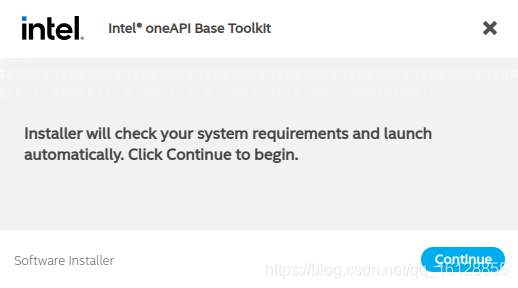

https://m.elecfans.com/article/1854087.html

# 试图打破CUDA统治的SYCL

## 描述

各式各样的加速器在当下的计算架构中越来越普遍，HPC、数据中心等高端应用开始追求更高的峰值性能，用到了专业GPU、AI加速器，而手机、嵌入式系统开始追求更高的能效，也在其SoC、MCU中加入一定的嵌入式加速硬件。但与此同时，这样复杂的多厂商、多架构和多硬件生态，为编程带来了巨大的难题。但CUDA作为只面向英伟达GPU的封闭软件生态，其热度却水涨船高。

{width="4.566487314085739in"
height="3.052014435695538in"} \
提及各大编程语言的论文数量 / 谷歌学术

 \
在软件开发中，一个开放的标准层就是开发者产品方案的接口规范，同样的，处理器开发商们可以使用基于开放标准层的底层软件驱动创造解决方案。如此一来软件开发者们无需捆绑在特定的硬件方案上，硬件开发者的硬件不仅可以兼顾自己维护的软件，还能支持到更多的软件开发人员。而且在普及之后，开发人员的技能更加具有普适性，他们可以方便地使用自己熟悉的开发工具。\
 \
对使用开放标准的软硬件公司来说，此举可以加快产品上市时间，减少长期维护工作，而且在软件方案厂商日益剧增的当下，业界已经普遍接受了开放标准，就像RISC-V一样，英特尔、AMD甚至是英伟达也都对开放标准的定义做出了贡献，对于一些初创企业来说就更是如此了。\
 \
**SYCL出世**\
 \
从市场反馈来看，开发者的需求很明显了，他们想要一个标准的编程模型，拥有标准运算库、对Pytorch、Tensorflow等AI框架的支持、性能分析工具，以及对多个厂商不同硬件架构的支持，而这些需求汇聚在一起，使得开放标准联盟Khronos
Group联合旗下成员打造出了SYCL这一编程语言。\
 \
SYCL作为跨越CPU、GPU、FPGA和AI加速器等多种架构的一致性编程语言，每个架构能单独或整合编程。SYCL编程语言与其API扩展能用于不同的开发用例，比如负载加速或异构计算应用，将现有的C、C++或其他加速器语言代码转换成SYCL代码。

{width="6.055838801399825in"
height="3.0043733595800526in"}\
SYCL的支持情况 / Khronos Group\
在不同厂商的支持下，SYCL的实施方式有多种，他们增加了对OpenCL以外不同加速API后端的支持，比如Codeplay的ComputeCpp、英特尔的DPC++、AMD的hipSYCL以及Xilinx的triSYCL等。\
 \
**英特尔的SYCL之路**\
 \
英特尔对于SYCL的重视可以说显而易见了，自从宣布转向XPU+oneAPI的路线之后，英特尔就已经与SYCL深度绑定了。不仅微软、谷歌等巨头宣布支持oneAPI，英特尔也和中科院计算所在内的大型研究所、国家实验室和大学合作成立了oneAPI卓越中心，借助他们的oneAPI开源代码，进一步扩展oneAPI产品与规范。\
 \
oneAPI的核心则是其编程语言DPC++，英特尔的DPC++可以说是SYCL的超集，不仅包含了SYCL标准，还包含一些功能扩展，比如统一共享内存等，不过目前其中不少扩展也已经并入了SYCL新版规范中。\
 \
不过SYCL远不仅是为了方便英特尔建设其跨架构的软件生态，而是为了打破CUDA的统治，打造一个更加开放的软硬件生态，这点从英特尔在oneAPI的开发动向就能看出。\
 \
此前英特尔对于CUDA并没有任何动作，反倒是其竞争对手AMD推出了HIP，帮助开发者将CUDA代码移植至AMD平台上，毕竟AMD还得发展GPU生态。但随着英特尔的硬件路线已经不单单是CPU，而是CPU、GPU、FPGA、IPU和AI加速器的多硬件异构生态，这时候打造一个CUDA之外的软件生态是提升其产品竞争力的必经之路了。\
 \
为了更好实现对CUDA代码的移植，英特尔推出了DPC++兼容性工具（DPCT），目前版本的DPCT已经可以将90%到95%的CUDA代码转换成SYCL。不过这只是一个理想范围，具体数值还是取决于代码对应的工作负载。对于简单的CUDA程序来说，完成DPC++的移植只需要对CUDA源文件运行这一转换工具即可，相对复杂的CUDA程序还是需要一定的手动编程优化。\
 \
今年6月，英特尔公布消息，决定收购Codeplay公司。要说对SYCL的研究，除了英特尔以外，最深入的当属Codeplay了，毕竟就连SYCL工作组的主席也是来自Codeplay的杰出工程师Michael Wong。Codeplay不仅提供了多种处理器上SYCL的支持，也支持将CUDA代码移植为SYCL，同时保证SYCL代码在英伟达GPU上的继续运行，还能调用一些CUDA库。\
 \
Codeplay的方案支持覆盖英特尔、AMD、英伟达的处理器，而且他们也开始了对汽车ADAS（瑞萨R-Car）、边缘计算设备（Imagination PowerVR）与RISC-V处理器（晶心科技NX27V）的支持开发工作。后三者恰好是SYCL当前未曾开拓的市场，但却是英特尔正在发力的三大市场，加上Codeplay本身在HPC、AI上的软件开发实力，如此看来，英特尔收购Codeplay完全符合其战略目标。\
 \
**结语**\
 \
尽管SYCL的构想是好的，其发展路线也是倾向于开发者，但这并不代表着就一定能取代CUDA的位置，毕竟SYCL其实也才诞生没多久，与CUDA、OpenCL或OpenMP相比生态发展还没有成熟。再者就是统一各种硬件的编程并没有那么简单，正如英伟达CEO黄仁勋曾经提出的质疑：时间会揭晓一个编程方法是否能兼容七种不同的处理器，至少历史上从未出现过。
