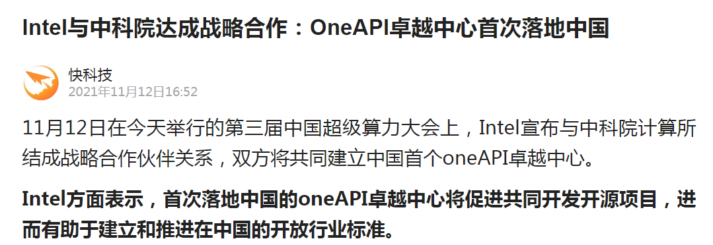

https://www.odu.edu/news/2021/11/intel_oneapi#.Y0docP1ByUl

{width="1.5833333333333333in"
height="1.386616360454943in"}

# ODU Establishes oneAPI Center of Excellence to Optimize NASA Research

November 08, 2021

The Department of Computer Science at Old Dominion University (ODU) is
establishing an Intel oneAPI Center of Excellence that focuses on
optimizing unstructured-grid computational fluid dynamics (CFD) kernels
on Intel central processing units (CPUs) and Xe graphics processing
units (GPUs) at NASA Langley. The research will be led by [Mohammad
Zubair,]{.mark} a professor in Computer Science, to use oneAPI to
develop efficient implementations that can run on diverse architectures
and help solve some of the most complex aerodynamic challenges.

oneAPI is an open, unified, cross-architecture programming model for
CPUs and accelerators. Being an open industry standard, oneAPI
simplifies software development on multi-architecture systems and helps
developers deliver productive, performant single source code that can be
maintained more efficiently.

ODU is on a growing list of universities to establish a oneAPI Center of
Excellence. \"Besides performing research and technology advances, ODU
will train master of science and doctoral students in cross-architecture
programming using oneAPI,\" said Zubair. \"We also plan to include
oneAPI modules in our ODU graduate-level courses for accelerating
high-performance computing.\"

A diverse array of new hardware architectures continues to emerge across
the high-performance computing (HPC) landscape. \"As a result, the
application developer is faced with the considerable challenge of
providing near-optimal performance across these systems,\" said Zubair.
\"This goal requires a detailed understanding of each target
architecture, and some means to accommodate specific data layouts and
algorithm implementations that map appropriately.\"

\"Professor Zubair has been an innovative leader in high performance
computing for many years,\" said [Gail Dodge]{.mark}, dean of ODU
College of Sciences. \"Establishing an Intel oneAPI Center of Excellence
in this area will enrich and expand ODU\'s collaboration with NASA
Langley.\"

\"Professor Zubair is an expert in HPC and has been working closely with
NASA Langley to port and optimize large-scale CFD applications on
emerging HPC architectures,\" said Ravi Mukkamala, chair of ODU Computer
Science. \"Since 1990, he has been a pioneer in establishing graduate
and undergraduate courses in HPC, and he has played a critical role in
developing and optimizing CFD algorithms for GPU architectures.\"

The proposed oneAPI center will address several of NASA\'s most
difficult computational challenges, especially fluid dynamics
applications and software routinely applied to the nation\'s most
complex operating system. This includes supersonic simulations, as well
as hypersonic and reentry configurations for launches together with
broader science and engineering efforts both inside and outside NASA.

\"ODU has a strong history of collaboration with NASA on projects of
mutual interest, such as the exploration of emerging HPC architectures
for NASA\'s widely used [FUN3D]{.mark} computational fluid dynamics
application,\" said Beth Lee-Rausch, branch head, computational
aeroSciences at NASA Langley Research Center. \"We look forward to
continuing these collaborations, and we are excited to work with ODU\'s
oneAPI Center of Excellence.\"

\"We\'re excited that ODU and NASA will use oneAPI programming avoiding
constraints of proprietary models and achieving full performance from
their accelerated computer hardware. ODU\'s oneAPI Center of Excellence
will also train students and help grow the oneAPI ecosystem,\" says Joe
Curley, vice president and general manager of Intel Software Products
and Ecosystem group.

{width="5.33696741032371in"
height="1.840980971128609in"}

[Intel全新Xe架构GPU]{.mark}大曝光：性能是NVIDIA安培A100的2.2倍。

2020年8月13日，芯片业巨头Intel在0202架构日活动里正式宣布了全新自研Xe架构GPU，并将其细分为四大级别：
Xe_LP、Xe_HP、Xe_HPG和Xe_HPC。这其中，HPG作为支持硬件级光线追踪的型号，将面对发烧级硬件玩家，此举也让双雄争霸的显卡市场终于迎回了"老面孔"。

那么，在CPU领域称王称霸的Intel做显卡到底是什么水准呢？

虽然Xe系列GPU还没有发售，但其具体规格已从各种渠道留出。具体来说，Xe_HP的封装规模有1Tile、2Tile和4Tile三种，其中1
Tile集成512组EU单元，每个EU为8核，所以总计4096核心，以此类推，4
Tile就是16384核，核心频率可以达到1.3GHz。

据Intel官方数据显示，4 Tile的FP32（单精度）浮点性能居然达到了42
TFLOPS，号称目前单芯片全球第一。相较于1 Tile的10588
GFLOPS，放大比是3.993：1，比传统意义上的双芯显卡、多卡互联比起来，效率简直夸张。

事实上，以上成绩就算在面对NVIDIA的安培A100核心时，也占尽了优势。作为NVIDIA最新主打的GPU芯片，安培A100主频1.41
GHz左右，内建6912个CUDA核心，单精度浮点约19.5 TFLOPS。
