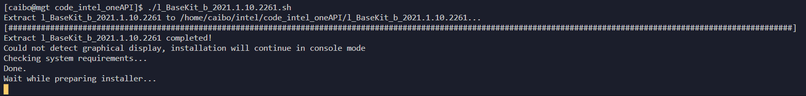
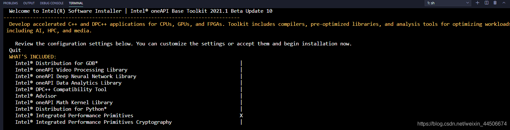
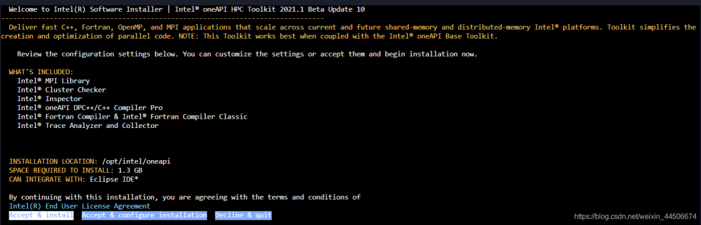
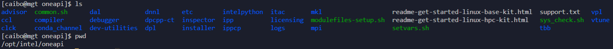

# Ubuntu20.04安装Intel® oneAPI Toolkit

Intel® oneAPI Toolkit的版本会不断更新，安装程序可登录Intel
公司的主页下载最新版本的安装程序。

## 一、安装前准备

### 1.1 更新系统安装必要软件 {#更新系统安装必要软件 .标题3}

安装Intel® oneAPI HPC Toolkit之前推荐把系统更新至最新。

zhy@pc:\~\$ sudo apt update

zhy@pc:\~\$ sudo apt upgrade

zhy@pc:\~\$ sudo apt -y install openssh-server vim

### 1.2 安装依赖 {#安装依赖 .标题3}

zhy@pc:\~\$ sudo apt -y install gcc cmake pkg-config build-essential

### 1.3 上传Intel® oneAPI Toolkit {#上传intel-oneapi-toolkit .标题3}

zhy@pc:\~\$ ls

Desktop examples.desktop Music Templates

Documents l_BaseKit_p_2021.2.0.2883_offline.sh Pictures Videos

Downloads l_HPCKit_p_2021.2.0.2997_offline.sh Public

## 二、安装

### 2.1 安装Intel® oneAPI Base Toolkit {#安装intel-oneapi-base-toolkit .标题3}

zhy@pc:\~\$ bash l_BaseKit_p_2021.2.0.2883_offline.sh

{width="2.6943022747156604in"
height="1.4979899387576554in"}

### 2.2 安装Intel® oneAPI HPC Toolkit {#安装intel-oneapi-hpc-toolkit .标题3}

zhy@pc:\~\$ bash l_HPCKit_p_2021.2.0.2997_offline.sh

### 2.3 加载环境变量 {#加载环境变量 .标题3}

zhy@pc:\~\$ . \~/intel/oneapi/setvars.sh

**或者添加到.bashrc文件：**

注意添加到.bashrc文件后，会导致SFTP和scp传输这台主机不可用。这是加载oneAPI环境时输出的echo语句导致的。

vi \~/.bashrc

### 2.4 简单测试 {#简单测试 .标题3}

输入[mpirun和ifort -v]{.mark}能输出相应的信息就安装配置成功了。

{width="4.566676509186352in"
height="2.2645395888013997in"}

{width="4.656851487314086in"
height="2.3063353018372705in"}

# CentOS下安装Intel® oneAPI Base Toolkit 和 Intel® oneAPI HPC Toolkit

## Intel® oneAPI Base Toolkit的安装

### 工具包下载 {#工具包下载 .标题3}

工具包下载地址

https://software.intel.com/content/www/us/en/develop/tools/oneapi/base-toolkit/get-the-toolkit.html

这里我选择了Linux版的在Online Installer（强烈建议直接下载Offline
Installer，速度更快！）来安装Intel® oneAPI Base
Toolkit，直接在Centos下用wget命令下载即可

为Linux-Online Installer赋予可执行权限。

chmod +x l_BaseKit_b_2021.1.10.2261.sh

## 开始安装

使用如下命令即可打开安装程序

./l_BaseKit_b_2021.1.10.2261.sh

如下图所示，已经在准备安装，需要耐心等待一段时间。

{width="5.768055555555556in"
height="0.6965135608048993in"}

拉到最下面，回车

{width="5.768055555555556in"
height="1.4774267279090114in"}

拉到最下面，回车

拉到最下面，选择Accept & Install然后回车

象征性出现Warnning，根据自己情况调整或者直接选择Begin Installation即可

Eclipse配置选项，根据自己需求选择然后Next回车即可

是否收集个人信息，根据个人接受程度选择即可开始安装

若无意外，已经开始安装了

经过漫长的等待，终于安装成功了

## Intel® oneAPI HPC Toolkit的安装

### 工具包下载 {#工具包下载-1 .标题3}

这次我选择了Local Installer,输入以下命令即可下载并且开始安装

wget
https://registrationcenter-download.intel.com/akdlm/irc_nas/17229/l_HPCKit_b_2021.1.10.2477_offline.sh

### 开始安装 {#开始安装-1 .标题3}

直接用bash命令打开安装程序

sudo bash l_HPCKit_b_2021.1.10.2477_offline.sh

接受、开始安装

{width="5.421621828521435in"
height="1.7479844706911636in"}

.......

很快就安装完了，看来还是用local Installer快啊

## 后续

所有的根据默认都安装在/opt/intel/oneapi目录下，如下图所示：

{width="5.635353237095363in"
height="0.4606692913385827in"}

可以看到，免费的oneAPI工具包提供了很多Parallel Studio
XE中的工具比如Vtune、MKL、MPI，即使不使用oneAPI也十分有用

oneAPI官网提供的文档资料非常多，对开发者非常友好；此外DPC++的开源新书Data
Parallel C++Mastering DPC++ for Programming of Heterogeneous Systems
using C++ and SYCL也可以免费下载。
