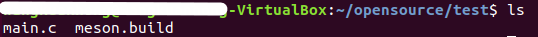
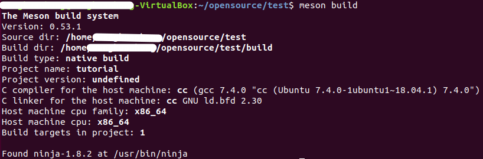
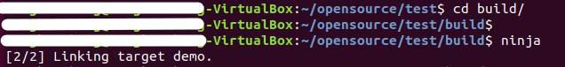
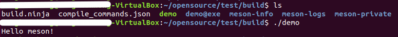
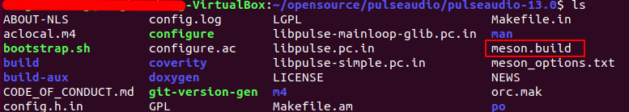
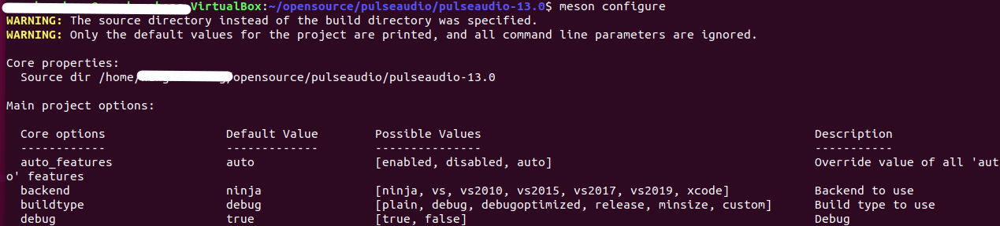

# Meson构建系统

关于Meson的中文参考资料比较少，比较全面的是Meson的官方网站（<https://mesonbuild.com/>）。

什么是Meson？

Meson有什么特点？

如何使用Meson？

## 一、什么是Meson

Meson（The Meson Build
System）是个项目构建系统，如Makefile，automake，CMake\...。Meson是一个Python实现的开源项目，其思想是，开发人员花费在构建调试上的每一秒都是浪费，同样等待构建过程直到真正开始编译都是不值得的。

因此，Meson的设计目的是在用户友好的同时不损害性能，Meson提供客户语言（custom
language）作为主要工具，用户可以使用它完成项目构建的描述。客户语言的设计目标是简单（simplicity）、清晰（clarity）、简洁（conciseness），其中很多灵感来源于Python语言。

Meson的另个一主要设计目的是为现代编程工具提供优秀的支持和最好的实现。这包括一些特性如：单元测试（unit
testing）、代码覆盖率报告（code coverage
reporting）、头文件预编译（precompiled
headers）。用户不需要寻找三方宏指令（third party
macros）或编写shell脚本来实现这些特性，Meson只要开箱即用（work out of
the box）。

## 二、Meson有什么特点

对Linux，macOS，Windows，GCC，Clang，Visual Studio等提供多平台支持

支持的语言包括C，C ++，D，Fortran，Java，Rust

在非常易读且用户友好的非图灵完整DSL中构建定义

适用于许多操作系统和裸机的交叉编译

针对极快的完整和增量构建进行了优化，而不会牺牲正确性

内置的多平台依赖提供程序，可与发行版软件包一起使用

以上这些特征均来自官网的介绍，我们在接下来的使用过程中只会涉及部分特性。

## 三、如何使用Meson

这一章将会包含比较多的使用细节，会在一系列的文章中去完善该部分内容。

### 3.1 Meson安装 {#meson安装 .标题3}

首先是安装Python3.x版本，而且版本尽可能的高，我用的是Python3.5。一般来说安装Python是默认带有pip，但是如果系统缺一些库的话pip会不能成功安装，我踩到zlib的坑（pip3的安装可以参考https://www.cnblogs.com/fyly/p/11112169.html）

具备pip3之后直接安装Meson Ninja

pip3 install meson ninja

这边多出一个Ninja工具，简单介绍一下。Ninja是一个轻量的构建系统，主要关注构建的速度。它与其他构建系统的区别主要在于两个方面：1.
Ninja被设计成需要一个输入文件的形式，这个输入文件则由高级别的构建系统生成；2.
Ninja被设计成尽可能快速执行构建的工具。

一般将Meson和Ninja配合使用，Meson负责构建项目依赖关系，Ninja进行编译。

### 3.2 简单的Meson构建样例 {#简单的meson构建样例 .标题3}

本节将会给出几个简单的Meson构建样例，粗略介绍Meson的使用方式。

构建项目首先需要对项目的构建需求进行描述，前面介绍过Meson提供custom
language用于描述项目构建需求。

custom
language包含诸多部分：变量，数值，字符串，数组，辞典，函数调用，方法调用，控制语句，功能函数，内置对象，返回对象\...。暂时不对这些细节进行展开，从简单的示例开始。

a.构建一个可执行项目

创建一个项目目录，包含一个main.c文件

main.c:

#include \<stdio.h\>

int main(void)

{

printf(\"hellow project01\\n\");

return 0;

}

创建Meson构建描述文件meson.build（指定文件名）

meson.build:

project(\'project01\', \'c\')

executable(\"project\", \'src/main.c\')

项目目录结构：

project01/

├── meson.build

└── src

└── main.c

项目构建关系描述完成，接下来就需要通过调用Meson来生成构建目录及构建系统。这就涉及到meson
command line的使用，当meson安装完成后可以通过meson -v查看Meson
版本，这就是命令行。

meson -h / \--help输出：

usage: meson \[-h\]
{setup,configure,dist,install,introspect,init,test,wrap,subprojects,help,rewrite,compile}
\...

optional arguments:

-h, \--help show this help message and exit

Commands:

If no command is specified it defaults to setup command.

{setup,configure,dist,install,introspect,init,test,wrap,subprojects,help,rewrite,compile}

setup Configure the project

configure Change project options

dist Generate release archive

install Install the project

introspect Introspect project

init Create a new project

test Run tests

wrap Wrap tools

subprojects Manage subprojects

help Print help of a subcommand

rewrite Modify the project definition

compile

接下来我们要使用setup 命令，它也是meson的默认命令，即meson xxx 与 meson
setup xxx 等价。

在meson.build目录执行

meson setup build

执行后有如下打印：

The Meson build system

Version: 0.55.3

Source dir: /home/yu.xinrong/meson_demo/project01

Build dir: /home/yu.xinrong/meson_demo/project01/build

Build type: native build

Project name: project01

Project version: undefined

C compiler for the host machine: cc (gcc 4.8.5 \"cc (GCC) 4.8.5 20150623
(Red Hat 4.8.5-39)\")

C linker for the host machine: cc ld.bfd 2.25.1-22

Host machine cpu family: x86_64

Host machine cpu: x86_64

Build targets in project: 1

Found ninja-1.10.0.git.kitware.jobserver-1 at /usr/bin/ninja

NOTICE: You are using Python 3.5 which is EOL. Start。ing with v0.57,
Meson will require Python 3.6 or newer

信息有Meson版本，源码目录和构建目录，一部分构建选项的参数，并且最后提示ninja的存在，可以直接使用ninja编译。

Ninja编译项目：

cd build ninja

编译完成发现build目录中出现project可执行文件。

\[root@localhost build\]# ls -al

total 28

drwxr-xr-x. 6 root root 180 Sep 20 14:34 .

drwxr-xr-x. 4 root root 49 Sep 20 14:32 ..

-rw-r\--r\--. 1 root root 2581 Sep 20 14:32 build.ninja

-rw-r\--r\--. 1 root root 341 Sep 20 14:32 compile_commands.json

drwxr-xr-x. 2 root root 264 Sep 20 14:32 meson-info

drwxr-xr-x. 2 root root 27 Sep 20 14:32 meson-logs

drwxr-xr-x. 2 root root 207 Sep 20 14:32 meson-private

-rw-r\--r\--. 1 root root 760 Sep 20 14:34 .ninja_deps

-rw-r\--r\--. 1 root root 131 Sep 20 14:34 .ninja_log

-rwxr-xr-x. 1 root root 9600 Sep 20 14:34 project

drwxr-xr-x. 2 root root 26 Sep 20 14:34 project.p

\[root@localhost build\]# ./project

hellow project01

b.构建静态库项目

创建库文件项目，目录结构如下

project02

├── meson.build

└── src

├── third_lib.c

└── third_lib.h

third_lib.c:

#include \<stdio.h\>

#include \"third_lib.h\"

void info_print()

{

printf(\"hellow third library\\n\");

}

third_lib.h:

#ifndef \_THIRD_LIB\_

#define \_THIRD_LIB\_

void info_print();

#endif

meson.build:

project(\'project02\', \'c\')

static_library(\'thirdinfo\', \'src/third_lib.c\')

构建及编译完成后生成静态库libthirdinfo.a：

\[root@localhost build\]# ls -al

total 20

drwxr-xr-x. 6 root root 194 Sep 20 14:45 .

drwxr-xr-x. 4 root root 49 Sep 20 14:45 ..

-rw-r\--r\--. 1 root root 2657 Sep 20 14:45 build.ninja

-rw-r\--r\--. 1 root root 412 Sep 20 14:45 compile_commands.json

-rw-r\--r\--. 1 root root 3556 Sep 20 14:45 libthirdinfo.a

drwxr-xr-x. 2 root root 31 Sep 20 14:45 libthirdinfo.a.p

drwxr-xr-x. 2 root root 264 Sep 20 14:45 meson-info

drwxr-xr-x. 2 root root 27 Sep 20 14:45 meson-logs

drwxr-xr-x. 2 root root 207 Sep 20 14:45 meson-private

-rw-r\--r\--. 1 root root 808 Sep 20 14:45 .ninja_deps

-rw-r\--r\--. 1 root root 150 Sep 20 14:45 .ninja_log

c.构建加载三方库的可执行项目

project03

├── meson.build

└── src

├── include

│ └── third_lib.h

├── main.c

└── third

└── libthirdinfo.a

此处用的静态库和头文件来自上一步的构建结果。

main.c:

#include \<stdio.h\>

#include \"third_lib.h\"

int main(void)

{

printf(\"hellow project03\\n\");

info_print();

return 0;

}

meson.build内容:

project(\'project03\', \'c\')

libs=meson.get_compiler(\'c\').find_library(\'thirdinfo\', dirs :
join_paths(meson.source_root(),\'src/third\'))

executable(\'project03\', \'src/main.c\', dependencies : libs,
include_directories : \'src/include\')

构建编译之后：

\[root@localhost build\]# ls -al

total 28

drwxr-xr-x. 6 root root 184 Sep 20 16:34 .

drwxr-xr-x. 4 root root 49 Sep 20 16:34 ..

-rw-r\--r\--. 1 root root 2774 Sep 20 16:34 build.ninja

-rw-r\--r\--. 1 root root 368 Sep 20 16:34 compile_commands.json

drwxr-xr-x. 2 root root 264 Sep 20 16:34 meson-info

drwxr-xr-x. 2 root root 27 Sep 20 16:34 meson-logs

drwxr-xr-x. 2 root root 207 Sep 20 16:34 meson-private

-rw-r\--r\--. 1 root root 800 Sep 20 16:34 .ninja_deps

-rw-r\--r\--. 1 root root 135 Sep 20 16:34 .ninja_log

-rwxr-xr-x. 1 root root 10144 Sep 20 16:34 project03

drwxr-xr-x. 2 root root 26 Sep 20 16:34 project03.p

\[root@localhost build\]# ./project03

hellow project03

hellow third library

# ubuntu上安装meson & 如何使用meson编译C代码

## **一· 搭建meson环境并简单编译：**

### **1. 什么是meson** {#什么是meson .标题3}

Meson旨在开发最具可用性和快速的构建系统。提供简单但强大的声明式语言用来描述构建。原生支持最新的工具和框架，如Qt5、代码覆盖率、单元测试和预编译头文件等。利用一组优化技术来快速编译代码，包括增量编译和完全编译。

### **2. 安装meson** {#安装meson .标题3}

注意：meson安装前必须确认是否已经安装python3.5及以上版本；因为meson依赖于python3和ninja

2.1 安装python3和ninja：

sudo apt-get install **python3 python3-pip** **ninja-build**

2.2 切换至python3：

[Ubuntu](https://so.csdn.net/so/search?q=Ubuntu&spm=1001.2101.3001.7020)系统上一般默认安装了python2.7，因此如果安装了python3系统还是默认使用python2.7，因此需要切换至python3。

sudo rm /usr/bin/python3\
sudo ln -s /usr/bin/python3.5 /usr/bin/python3

2.3 安装meson：

pip3 install \--user meson

### **3. 编译C代码** {#编译c代码 .标题3}

**3.1 下面写一个简单的程序(main.c)：**

#include\<stdio.h\>\
     int main(int argc, char \*\*argv) {\
     printf(\"Hello meson！.\\n\");\
     return 0;\
     }

**3.2 创建文件meson.build，内容如下**：\
project(\'tutorial\', \'c\')\
executable(\'demo\', \'main.c\')

{width="3.471814304461942in"
height="0.23965879265091863in"}

**3.3 执行**\
[\$ meson build]{.mark}

{width="5.699828302712161in"
height="1.9322419072615924in"}

**3.4 进入 build目录，执行ninja**\
\$cd ninja && ninja\
njnja 相当于 make, 所以上面会编译代码，生成可执行文件 demo.

{width="4.597869641294838in"
height="0.5500853018372703in"}

**3.5 编译完成**

\$ ./demo\
{width="4.603897637795275in"
height="0.43394028871391077in"}

## **二· 编译开源代码**

**1. 查看是否支持meson编译**

现在很多开源代码都转向meson进行构建和编译了，例如gsreamer，pulseaudio等这时候你可以在代码根目录下看到很meson.build文件，并且每个子目录页包含meson.build文件；

{width="5.351589020122485in"
height="0.9604943132108487in"}

**2. 查看支持哪些编译选项（哪些模块需要编译）**

#meson configure

{width="5.252141294838145in"
height="1.1883005249343832in"}
