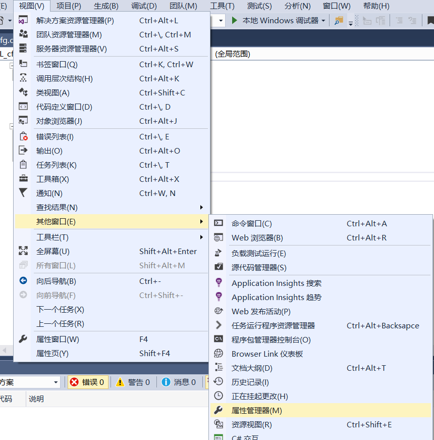
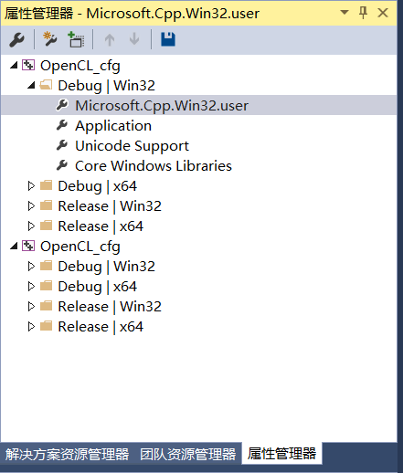
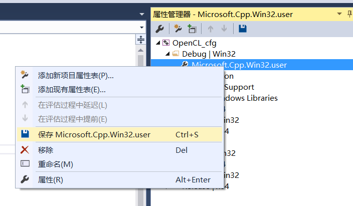

# VisualStudio之OpenCL库环境永久配置

关键词：Visual Studio 2017，OpenCL

每次新建一个项目都需要重新配置库环境，稍微有些麻烦，查看了一些资料，踩了一些坑才终于配置完成。

以下是配置过程：

1、新建------Win32控制台应用程序------命名OpenCL_cfg------确定

2、打开属性管理器窗口：

3、右键属性窗口中的Microsoft.Cpp.Win32.user文件的属性项

4、将博客https://blog.csdn.net/zhouxuanyuye/article/details/79829953
中的配置库文件重新配置一遍，如下：

4.1 项目→ test属性→C/C++→常规→附加包含路径

D:\\Program Files (x86)\\Intel\\OpenCL SDK\\6.3\\include

4.2 项目→test属性→链接器→常规→附加库目录

D:\\Program Files (x86)\\Intel\\OpenCL SDK\\6.3\\lib\\x86

4.3 项目→test属性→链接器→输入→附加依赖项

OpenCL.lib;

5、配置完成后，右键属性窗口中的Microsoft.Cpp.Win32.user的保存Microsoft.Cpp.Win32.user项。

6、配置完成，下次重新新建项目后，可以不用配置，程序自动加载已经保存的配置。

注意：配置的路径一定要正确，如路径缺少空格等低级错误一时很难发现。
