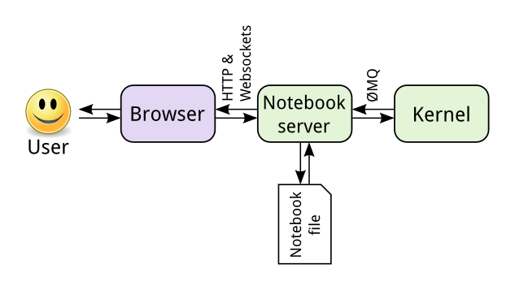
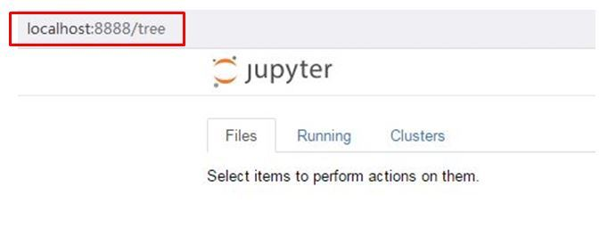
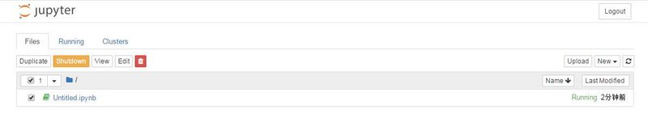
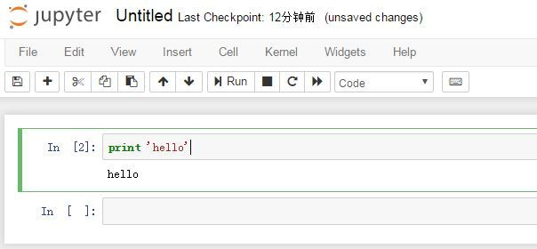
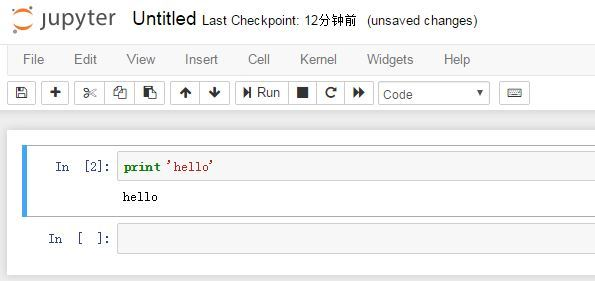
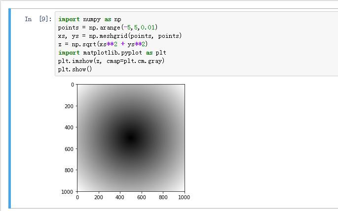
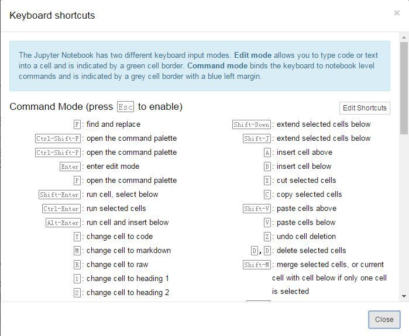
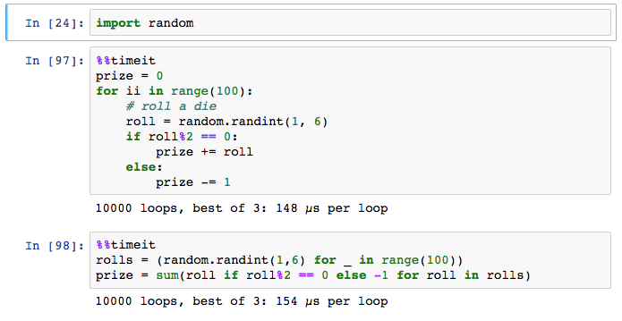
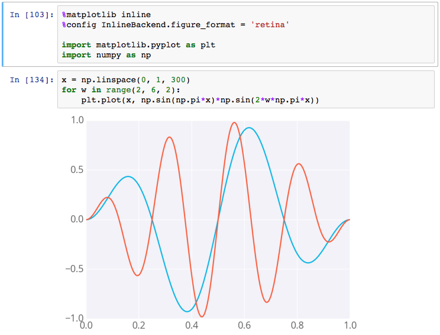

# Jupyter notebook快速入门教程

如果你想使用Python学习数据分析或数据挖掘，那么它应该是你第一个应该知道并会使用的工具，它很容易上手，用起来非常方便，是个对新手非常友好的工具。而事实也证明它的确很好用，在数据挖掘平台 Kaggle 上，使用
Python 的数据爱好者绝大多数使用 jupyter
notebook 来实现分析和建模的过程，因此，如果你想学习机器学习，数据挖掘，那么这款软件你真的应该了解一下。

本篇博主总结了关于Jupyter
notebook的一些关键点，帮助大家快速了解并使用它。

## 什么是Jupyter notebook？

Jupyter notebook 是一种 Web
应用，它能让用户将说明文本、数学方程、代码和可视化内容全部组合到一个易于共享的文档中，非常方便研究和教学。在原始的
Python shell 与 IPython
中，可视化在单独的窗口中进行，而文字资料以及各种函数和类脚本包含在独立的文档中。但是，notebook
能将这一切集中到一处，让用户一目了然。

Jupyter
notebook特别适合做数据处理，其用途可以包括数据清理和探索、可视化、机器学习和大数据分析。

## Jupyter notebook是如何工作的？

Jupyter notebook 源于 Fernando Perez 发起的 IPython 项目。IPython
是一种交互式 shell，与普通的 Python shell
相似，但具有一些更高级的功能，例如语法高亮显示和代码补全，还有一些 magic
操作，十分方便。Jupyter notebook 将 IPython 做成了一种 Web
应用，我们可以通过它的基本架构更清楚的了解：

可以看到，这里的核心是 notebook
的服务器。用户通过浏览器连接到该服务器，而 notebook 呈现为 Web
应用。用户在 Web
应用中编写的代码通过该服务器发送给内核，内核运行代码，并将结果发送回该服务器。然后，任何输出都会返回到浏览器中。保存
notebook 时，它将作为 JSON 文件（文件扩展名为 .ipynb）写入到该服务器中。

此架构的一个优点是，内核无需运行 Python。由于 notebook
和内核分开，因此可以在两者之间发送任何语言的代码。例如，早期的两个非
Python 内核分别是 R 语言和 Julia 语言。使用 R 内核时，用 R
编写的代码将发送给执行该代码的 R 内核，这与在 Python 内核上运行 Python
代码完全一样。IPython notebook 已被改名，因为 notebook
变得与编程语言无关。新的名称 Jupyter 由 Julia、Python 和 R 组合而成。

## 安装Jupyter notebook

最简单的方法就是使用 Anaconda，其发行版附带了 Jupyter notebook。

在 conda 环境下安装 Jupyter notebook 可以使用 conda install jupyter
notebook。当然，也可以通过 pip 来安装 pip install jupyter notebook。

## 启动 notebook 服务器

启动 notebook 很简单，只需要在终端环境下输入 jupyter notebook，
服务器就会在当前操作的目录下启动。当然你可以建立一些专门用来运行
notebook 的文件夹，尤其对于不同的 Python版本以及一些项目（后面会提到）。

启动后，默认的 notebook 服务器的运行地址是 http://localhost:8888。只要
notebook
服务器仍在运行，你随时都能通过在浏览器中输入 http://localhost:8888 返回到
web 页面中。

可以通过点击 "New" 创建新的 notebook、文本文件、文件夹或终端。

"Notebook"下的列表显示了已安装的内核。这个示例中可以看到版本是 Python
2.7，因此列出了 Python 2.7
内核。当然，如果你同时安装了其它内核比如 Python
3，那么它也会在列表中同时出现。这又是 notebook
的另一大好处，就是可以同时管理多个版本，当你同时需要 Python 2 和 Python
3，或者 Scala 2.10 和 2.11 的内核的时候，是十分方便的。

而对于关闭 notebook，可以这样操作：

## notebook 界面

notebook
界面由基本的单元格组成，每个单元格在可编辑状态下可以任意的输入代码和注释说明（markdown）。默认的是代码格式，也就是下图中所示的 code。

\

单元格绿色代表内容可编辑状态，蓝色代表单元格可操作状态（比如删除单元格，必须回到蓝色），而蓝色与绿色之间可以用 Esc 和 Enter 来切换。

Kernel 的小圆圈在空闲状态下是空的，而当运行代码时，会被填满，所以可以通过观察 Kernel 的状态观察程序是否运行完成。

## 代码单元格

notebook
中的大部分工作均在代码单元格中完成。编写和执行代码都在这里，就像我们平时在
IDE
软件里敲代码一样，给变量赋值、定义函数和类、导入包等。执行单元格代码可以通过 Shift +
Enter 来完成。下面是一个示例：

## Markdown 单元格

Markdown 是格式化语法，可以加入链接、将文本样式设为粗体或斜体和设置代码格式。像代码单元格一样，按 Shift +
Enter 或 Ctrl + Enter 可运行 Markdown 单元格，这会将 Markdown
呈现为格式化文本。

Markdown 在这里就不详细介绍了，如果不清楚可以查看官网：<http://www.markdown.cn/>。下面是一个 Markdown 的示例：

## 快捷键

notebook
自带一组快捷键，能让你快速使用键盘与单元格交互，而无需使用鼠标和工具栏。熟悉这些快捷键需要花费一点时间，但如果能熟练掌握，将大大加快你在
notebook
中的工作速度。所有的快捷键就不在这里展示了，因为这些快捷键可以通过单元格
蓝色 状态下按 \"h\" 来查看：

## Magic 关键字

Magic关键字是 IPython 的一些高级用法，可以运行特殊的命令，然后控制
notebook。例如，在 notebook 中可以使用 %matplotlib 将 matplotlib
设置为以交互方式工作。

Magic 命令的前面带有一个或两个百分号（% 或 %%），分别代表行 Magic
命令和单元格 Magic 命令。行 Magic 命令仅应用于编写 Magic
命令时所在的行，而单元格 Magic 命令应用于整个单元格。

如果要测算整个单元格的运行时间，请使用 %%timeit，如下所示：

如果要在 notebook 中嵌入可视化内容，可以说使用 %matplotlib
inline，如下所示:

默认情况下，图形呈现在各自的窗口中。但是，你可以通过命令传递参数，以选择特定的"后端"（呈现图像的软件）。要直接在
notebook 中呈现图形，应将通过命令 %matplotlib inline 内联后端一起使用。

提示：在分辨率较高的屏幕（例如 Retina 显示屏）上，notebook
中的默认图像可能会显得模糊。可以在 %matplotlib inline 之后使用 %config
InlineBackend.figure_format = \'retina\' 来呈现分辨率较高的图像。

当然，还有很多 Magic
关键字的使用，这里只列出了两个常用的介绍给大家。更多内容请参考：[http://ipython.readthedocs.io\...](http://ipython.readthedocs.io/en/stable/interactive/magics.html)

## 总结

通过本篇，相信你已经了解并知道如何使用 Jupyter
notebook 了，但是还需要一些实际的操作才能更熟练的使用它，包括一些快捷键的使用，公众号后台回复 \"notebook快捷键\" 可获取一份练习快捷键的辅助材料。
