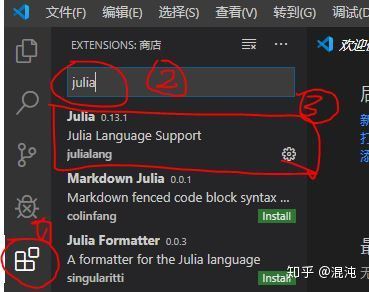
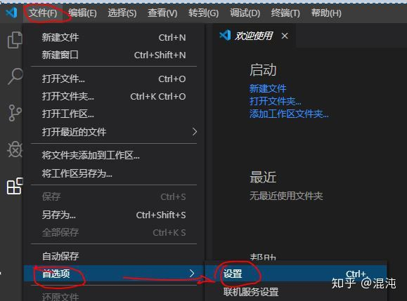
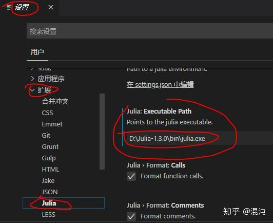
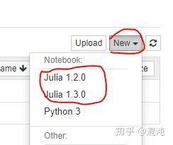
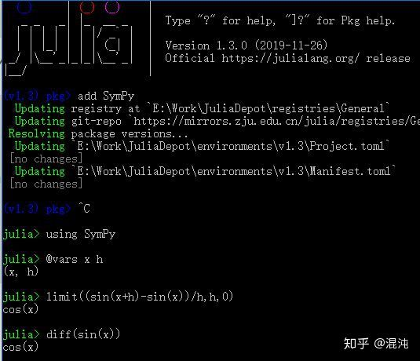

# **Julia-简单教程**

## 相关网站

[[https://julialang.org/]{.underline}](https://julialang.org/) julia
官网

[[https://github.com/JuliaLang/julia]{.underline}](https://github.com/JuliaLang/julia)
julia github

[[https://juliacomputing.com/]{.underline}](https://juliacomputing.com/)
julia pro, julia computing

[[https://juliaobserver.com/]{.underline}](https://juliaobserver.com/)
Pkg 平台

[[https://discourse.julialang.org]{.underline}](https://discourse.julialang.org)
全球社区

[[http://discourse.juliacn.com/]{.underline}](http://discourse.juliacn.com/)
中文社区

[[http://docs.juliacn.com/latest/]{.underline}](http://docs.juliacn.com/latest/)
中文文档

## 简单介绍

Julia
是一个面向科学计算的高性能动态类型实时编译型高级[[程序设计语言]](https://baike.baidu.com/item/%E7%A8%8B%E5%BA%8F%E8%AE%BE%E8%AE%A1%E8%AF%AD%E8%A8%80)。Julia
是个灵活的动态语言，适合科学和数值计算，性能可与传统静态类型语言媲美。

julia 是编译型语言. 集python, matlab,c,r 优点.
Julia使用的JIT(Just-in-Time)实时编译器, 是编译型语言(同C/C++),
python/matlab 是解释型语言.

Julia 程序可以通过PyCall.jl 调用python程序, 通过CCall.jl调用C/Fortran,
通过Cxx.jl调用C++, 通过RCall.jl调用R. 通过 JavaCall.jl调用 java.
通过MATLAB.jl 调用matlab.

Julia还提供了许多特定领域的生态系统，如生物学
([[BioJulia]{.underline}](https://github.com/BioJulia))，量子物理学
([[QuantumOptics]{.underline}](https://github.com/qojulia))，非线性动力学([[JuliaDynamics]{.underline}](https://github.com/JuliaDynamics))，定量经济学
([[QuantEcon]{.underline}](https://github.com/QuantEcon))，天文学([[JuliaAstro]{.underline}](https://github.com/JuliaAstro)),
生态学 ([[EcoJulia]{.underline}](https://github.com/EcoJulia)),
机器人学([[JuliaRobotics]{.underline}](https://github.com/JuliaRobotics))
.

数学相关([[JuliaMath]{.underline}](https://github.com/JuliaMath)) ,
运筹学/优化([[JuliaOpt]{.underline}](https://github.com/JuliaOpt)/JuMP),
[[非线性求解]{.underline}](https://github.com/JuliaNLSolvers)/优化(Optim.jl)
,
微分方程([[JuliaDiffEq]{.underline}](https://github.com/JuliaDiffEq)/DifferentialEquations.jl),

机器学习([[FluxML]{.underline}](https://github.com/FluxML)/Flux.jl,
Knet.jl)

Julia的设计从根本上讲非常擅长数值和科学计算。这可以从Julia编写的大量科学工具中看出，例如最先进的微分方程生态系统
(DifferentialEquations.jl), 优化工具(JuMP.jl和 Optim.jl),
迭代线性求解器（IterativeSolvers.jl)

**交互式编程环境**

打开Julia，此时显示的窗口叫做Julia REPL (Read Eval Print Loop)或者Julia
interpreter或 "交互式解释器"或"交互式编程环境"。

CTRL+D 退出；CTRL+L 清屏；CTRL+C 终止命令。 ; + clear 清屏

? 帮助模式, \] pgk模式, ; shell模式, CTRL+C 退出当前模式

julia\> versioninfo() \# 查版本和平台信息

## **包管理**

自julia-1.0开始，不再推荐Pkg.xxx()的方式管理包, 推荐新的管理方式 \] ,
PKG\>

[[https://juliaobserver.com/]{.underline}](https://juliaobserver.com/)
pkg 平台, 有统计,分类 信息. 需要翻墙

[[https://pkg.julialang.org/]](https://pkg.julialang.org/)

julia\>Pkg.add(\"IJulia\") \# 安装 IJulia 包

Pkg.clone(\"[[https://github.com/JuliaIO/ImageMagick.jl]{.underline}](https://github.com/JuliaIO/ImageMagick.jl)\")
\# 更新/安装 最新的master版本, 但是只在当前CI/命令行 有效.

pkg\>add
[[https://github.com/JuliaImages/Images.jl.git]{.underline}](https://github.com/JuliaImages/Images.jl.git)

julia\>Pkg.status() \# 列出安装了的包

按 \] 进入 pkg\>, backspace或 ctrl+c 退出到julia\>

(v1.0) pkg\>add GR Gadfly \# add 安装, up 更新, rm 卸载, test 测试,
status 包列表, build 构建, ctrl+c 退出.

(v1.0) pkg\>rm PyCall \# pkg 模式下是命令式的. rm后包的代码还是在的,
只是从索引里删除了, 通过 gc可以清除.

julia\>using Pkg \# 使用包. julia 是在add, up后 第一次using时会 预/重
编译包, so会很慢. 编译后的文件名是 5位hash字符.ji

改国内源：[[PkgMirrors]{.underline}](https://github.com/sunoru/PkgMirrors.jl)
速度很快. import PkgMirrors; PkgMirrors.setmirror(\"ZJU\")

(v1.0) pkg\>add GR@0.35.0 \# 指定版本号

## **基础**

julia\> ? Images \# 查看这个包的信息: 介绍, 函数,用法等

julia\> names(Images) \# 查看这个包的 函数

文件后缀 .jl , 源码原生支持 unicode, utf-8

单行注释: \# , 多行注释: 只需要以 \'#=\' 开始, \'=#\' 结束

每句代码后可不加 ; 多行合并时每句后加;
在REPL或jupyter里每行用分号结尾就不输出表达式的值

不像python那样严格要求缩进

查到 函数的源文件: methods(cp), \@which cp , less(cp)

Julia 数组索引从 1 开始. 代码块以 end 结尾

动态类型语言, 变量可无类型, 可自动推理.

矢量 \[如Vector{Float64}(undef, 3) \] 是列向量

# 整合Julia和Python的集成环境

## 目标

１）统一利用**Visual Studio Code**作为Julia和Python的ＩＤＥ

２）统一利用**Jupyter**作为Julia和Python的Notebook

３）以Julia作为我主要的使用语言，确保能调用Python的库包

第一步 安装Anaconda

国内建议到[清华开源镜像](https://link.zhihu.com/?target=https%3A//mirrors.tuna.tsinghua.edu.cn/anaconda/archive/)站根据各自的情况选择下载。\
我选择**Anaconda3-5.3.1-Windows-x86_64.exe**，同时提供了**Visual Studio
Code**和**Jupyter**, 当然同时也是Python3。

A：全程无脑安装，安装过程中选择安装*Visual Studio
Code*，不建议安装在系统盘。

B：配置国内镜像

1.打开anaconda prompt，依次输入命令：

conda config \--add channels
https://mirrors.tuna.tsinghua.edu.cn/anaconda/pkgs/free/

conda config \--add channels
https://mirrors.tuna.tsinghua.edu.cn/anaconda/pkgs/main/

conda config \--set show_channel_urls yes

2.输入命令检查channels

conda config \--show channels

C：检验

１自行安装一个Python库包，看看速度如何

2 自行打开**Visual Studio Code**，写个Hello
world的Python程序，看是否运行正常。

３自行打开**Jupyter**,选择Python3新建，随便写点Python代码，看执行是否正常。

第二步 安装Julia

国内建议到[浙大开源镜像](https://link.zhihu.com/?target=https%3A//mirrors.zju.edu.cn/julia/releases/)站根据各自的情况选择下载。
由于我计划使用**Visual Studio Code**, 所以我julia-1.3.0-win64.exe即可

A：设置**Julia**库包的安装目录(默认在系统盘，所以要单独设置)

JULIA_DEPOT_PATH=E:\\Work\\JuliaDepot

Ｂ：全程无脑安装，建议用管理员权限安装，不建议安装在系统盘，建议安装完设置默认管理员启动。

Ｃ：启动Julia命令行，[安装国内镜像](https://link.zhihu.com/?target=https%3A//github.com/sunoru/PkgMirrors.jl/blob/master/README-zh_cn.md)。

\]

pkg**\>** registry add
https**://**mirrors**.**zju**.**edu**.**cn**/**julia**/**registries**/**General**.**git

pkg**\>** add
[https**://**mirrors**.**zju**.**edu**.**cn**/**julia**/**PkgMirrors**.**jl**.**git](https://mirrors.zju.edu.cn/julia/PkgMirrors.jl.git)
*#v1.3.0*

Ｄ：继续在命令行中，选择浙大镜像

**import** PkgMirrors

PkgMirrors**.**availables() *\# 列出所有可用的镜像。*

PkgMirrors**.**setmirror(\"ZJU\") *\# 设定当前镜像。*

\]

pkg**\>** update

Ｅ：由于GR很难安装成功，所以这里特别讲一下

首先试图安装，如果安装正常，忽略后续

\]

pkg**\>** add GR

如果安装不正常，或时间太长，建议到[GR官网](https://link.zhihu.com/?target=https%3A//gr-framework.org/downloads/)下载合适的版本，我下载的是gr-0.44.0-Windows-x86_64.tar.gz。最后解压得到三个文件夹bin，
fonts，include，　复制到JULIA_DEPOT_PATH\\packages\\GR\\oiZD3\\deps\\gr中。

验证安装成功否，建议重启julia后执行\
using GR\
histogram(randn(10000))

F：由于FFMPEG可能也很难安装成功，这里也特别讲一下

首先试图安装，如果安装正常，忽略后续

\]

pkg**\>** add FFMPEG

如果安装不正常，或时间太长，建议到[FFMPEG官网](https://link.zhihu.com/?target=https%3A//ffmpeg.zeranoe.com/builds/)下载合适的Build版本。最后解压又得到一堆文件，复制到JULIA_DEPOT_PATHE\\packages\\FFMPEG\\guN1x\\deps\\ffmpeg中。同时将这个目录添加到系统PATH中。

第三步 为Julia配置VSCode

Ａ．第一步已经为Python安装配置好了VSCode, 这里只要启动VSCode,
搜索Julia插件并安装

Ｂ．打开 文件》首选项》设置，设置Julia命令路径

Ｃ．重启VSCode,写一个简单的Hello world程序，验证配置是否成功。

**第四步 为Julia配置Jupyter**

Ａ．第一步已经默认为Python安装了Jupyter，这里只要为Julia配置即可。首先在Julia中设置Jupyter的路径，当然要先启动Julia命令行，然后运行

ENV\[\"JUPYTER\"\]**=**\"D:\\\\Anaconda3\\\\Scripts\\\\jupyter.exe\"

Ｂ．然后安装IJulia

\]

pkg**\>** add IJulia

Ｃ．启动Jupyter Notebook，能看见julia内核就算成功。

第五步 Julia调用Python库包的基础配置

Ａ．进入Julia命令行，首先设置Python的路径

ENV\[\"PYTHON\"\] **=** \"D:\\\\Anaconda3\\\\python.exe\"

Ｂ．安装调用Python的基础库

\]

pkg**\>** add Pycall

Ｃ．以SymPy作为范例，先安装范例需要的Python库，然后执行相应的代码

\]

pkg**\>** add SymPy \# 安装Python库的对应接口库

**using** SymPy

\@vars x h *\# 定义符号变量*

limit((sin(x**+**h)**-**sin(x))**/**h,h,0) *\# 求极限*

diff(sin(x)) *\# 求导*

# 设置国内浙大，中科大镜像站

In the console, we firstly step into the pkg-manager by '\]' as it
reminds us.

第一次使用 pkg-manager, 先激活 -\> activate

(v1.3) pkg\> add PkgMirrors \# 添加Pkg镜像

julia\> import PkgMirrors \# 导入镜像

julia\> PkgMirrors.availables() \# 显示可获取的镜像站

显示：2-element Array{String,1}:

\"ZJU\"

\"USTC\"

julia\> PkgMirrors.setmirror(\"USTC\") #设置镜像站

julia\> import PkgMirrors \# 再次导入镜像

(v1.3) pkg\> update \# 更新

升级Powershell到3.0版本

运行powershell，命令get-host 查看版本
