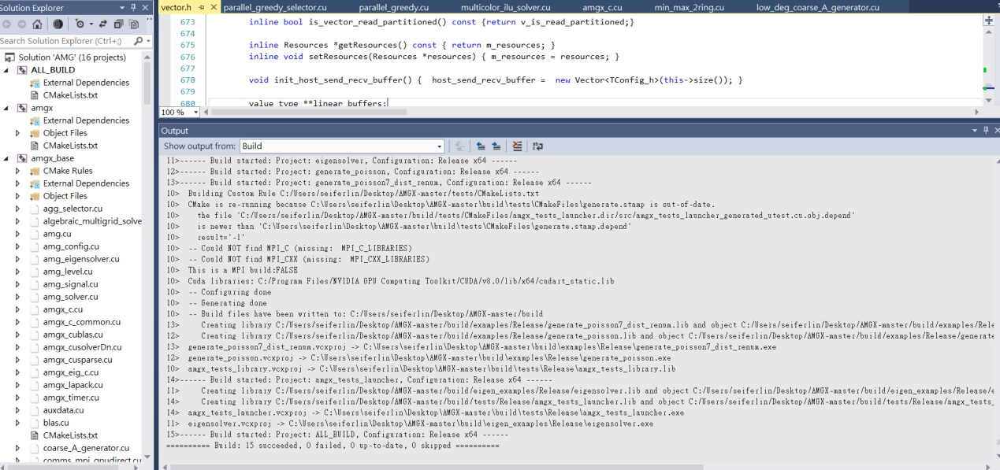

使用Visual Studio 2013 + Cmake_3.2 + CUDA toolkit 9.0

在Windows 7系统中，

编译AMGX

开始的时候出现编译错误，

解决方法：

MS gives everyone hard time with their features adoption, we already
delayed introduction of c++11 to the amgx enough so i would rather
abstain from adding workarounds for compilers with these types of
issues.\
If MSVS2013 is an absolute requirement for you, I could suggest forking
and searching/replacing [\'device_vector_alloc\']{.mark} to
[\'thrust::device_vector\<X, thrust_amgx_allocator\>\']{.mark} in the
code.

解决方法： After replacing all \'device_vector_alloc\' to
\'thrust::device_vector\<X, thrust_amgx_allocator\>\'.\
编译成功！

{width="5.768055555555556in"
height="3.2243602362204724in"}

Fail

{width="6.368483158355206in"
height="2.9966327646544184in"}

Success

[VS和CMAKE的版本组合对编译有影响。]{.mark}

【1】使用MS VS 2015 + CMake 3.4.2 + CUDA 9.0 组合，成功！

It\'s hard to support all of possible msvc + cmake combinations and
sometimes changes are required for the build if one of them changes. We
previously this kind of issues with MSVS 2012/2013 and CMake 2.x/3.x,
and current code doesn\'t compile when generated with CMake 3.10, but we
will try to keep code working with latest host and device compilers.
[不能使用CMake 3.10]{.mark}

It seems that by compiling amgx_base on a 1060 gtx, with VS 2015, CMake
3.4.2 and CUDA 9.0, the binary amgx_capi.exe works fine.

**【2】使用VS 2013 + CMake 3.4.2 + CUDA ToolKit
9.0.组合，修改部分代码！**

And I got the error when building AmgX，出现error C2614:\
C:/Users/seiferlin/Desktop/AMGX-master/core/../base/include\\vector.h(441):
错误：\'amgx::Vector\<amgx::TemplateConfig\<AMGX_device,AMGX_vecDouble,AMGX_matDouble,AMGX_indInt\>\>\'
: illegal member initialization: \'device_vector_alloc\' is not a base
or member

After replacing all \'device_vector_alloc\' to
\'thrust::device_vector\<X, thrust_amgx_allocator\>\'.\
The build is ok.

Intellisense 错误并不是编译错误，Intellisense
是VS为了速度之类的另外实现的功能。我建议你reset一下你的设置。VS菜单-》Tools-》import
and export setting-》reset all setting。

如果reset还是没有用，其实你可以禁用Intellisense
功能的，这并不会影响你的程序的生成，只是只有每次尝试编译后才能知道哪里报错。

VS菜单-》Tools-》Options-》Text editor -》C/C++-》Advance-》disable
Intellisense 设置为True就好了。

[使用VS2015 + CUDA9.0编译AMGX：]{.mark}

libcpmt.lib(xlock.obj) : error LNK2038: 检测到"\_MSC_VER"的不匹配项:
值"1800"不匹配值"1900"

编译平台改到Visual studio 2013 （\_MSC_VER=1800），而Visual studio
2015(\_MSC_VER=1900)

LIBCMT.lib(typinfo.obj) : error LNK2005: \"public: bool \_\_cdecl
type_info::operator==(class type_info const &)const \"
(??8type_info@@QEBA_NAEBV0@@Z) 已经在
amgx.lib(amgx_base_generated_amg_config.cu.obj) 中定义

分析原因：是lib用了动态连接mfc库，而小程序用的静态的，这2个库是不一样且有共同的函数的。因此导致连接错误。

解决方法：【1】忽略LIBCMT.lib

【2】修改小程序project-\>references\...-\>configuration
properties-\>c/c++-\>code generation 的runtime
library到/MDd,和project-\>references\...-\>configuration
properties-\>general的use of MFC到Use MFC in a Shared DLL。

19\>amgx.lib(amgx_base_generated_comms_visitors1.cu.obj) : error
LNK2001: 无法解析的外部符号 \_\_stdio_common_vsprintf_s

项目 -\> 配置属性-\>常规-\>MFC的使用 :在静态库中使用MFC 修改为 在共享
DLL 中使用 MFC

[使用Visual studio2015编译可执行程序！]{.mark}

error LNK2001: 无法解析的外部符号 \_Init_thread_header

error LNK2001: 无法解析的外部符号 \_\_std_exception_copy

error LNK2001: 无法解析的外部符号 \_Init_thread_epoch

error LNK2001: 无法解析的外部符号 \_\_std_type_info_name

error LNK2019: 无法解析的外部符号 \_Query_perf_counter，该符号在函数

error LNK2001: 无法解析的外部符号 \_Mtx_init_in_situ
