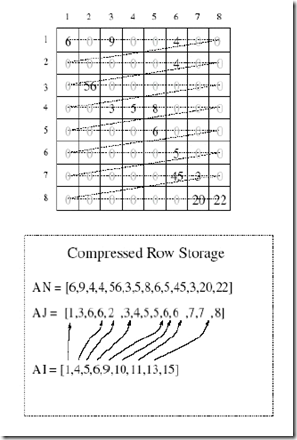
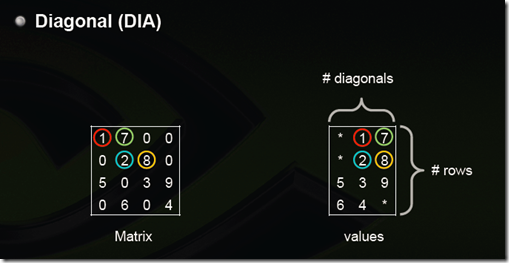

## CUDA并行的CG求解器

[Oyarzun et al.
(2014)文中]{.mark}采用GPU并行的PCG求解CFD中的压力泊松方程。MPI并行的数据首先收集到主节点，然后传输到GPU，进行PCG求解，求解完成后，再把解的向量发送到各计算节点。

MPI通信量少于求解耗时的1%，所占比例很低。

{width="4.0254604111986in"
height="2.1391688538932634in"}

图1 两层分区和数据传输

PCG求解器中的SpMV操作，使用多GPU并行，通信如下图。

{width="2.37077646544182in"
height="1.5135662729658792in"}

图2 PCG中SpMV的多GPU并行

### Paralution {#paralution .标题3}

PARALUTION is library for sparse iterative methods with special focus on
multi-core and accelerator technology such as GPUs, it comes with dual
license model - open-source GPLv3 and commercial. The software provides
fine-grained parallel solvers and preconditioners which can utilize the
modern multi-/many-core devices. Based on C++, it provides a generic and
flexible design allowing a seamless integration with other scientific
software packages.

[http://www.paralution.com](http://www.paralution.com/)

### AmgX {#amgx .标题3}

AmgX: Multi-Grid Accelerated Linear Solvers for Industrial Applications

Many industries use Computational Fluid Dynamics (CFD) to predict fluid
flow forces on products during the design phase, using only numerical
methods. A famous example is Boeing's  777 airliner, which was designed
and built without the construction (or destruction) of a single model in
a wind tunnel, an industry first. This approach dramatically reduces the
cost of designing new products for which aerodynamics is a large part of
the value add. Another good example is Formula 1 racing,
where a fraction of a percentage point reduction in drag forces on the
car body can make the difference between a winning or a losing season.

Users of CFD models crave higher accuracy and faster run times. The key
enabling algorithm for realistic models in CFD is Algebraic Multi-Grid
(AMG). This algorithm allows solution times to scale linearly with the
number of unknowns in the model; it can be applied to arbitrary
geometries with highly refined and unstructured numerical meshes; and it
can be run efficiently in parallel. Unfortunately, AMG is also very
complex and requires specialty programming and mathematical skills,
which are in short supply. Add in the need for GPU programming skills,
and GPU-accelerated AMG seems a high mountain to climb. Existing
GPU-accelerated AMG implementations (most notably the one
in [CUSP](https://developer.nvidia.com/cusp)) are more proofs of concept
than industrial strength solvers for real world CFD applications, and
highly tuned multi-threaded and/or distributed CPU implementations can
outperform them in many cases. Industrial CFD users had few options for
GPU acceleration, so NVIDIA decided to do something about it.

{width="3.930622265966754in"
height="1.9571227034120735in"}

NVIDIA partnered with [ANSYS](http://www.ansys.com/), provider of the
leading CFD
software [Fluent](http://www.ansys.com/Products/Fluids/ANSYS-Fluent) to
develop a high-performance, robust and scalable GPU-accelerated AMG
library. We call the
library [AmgX](https://developer.nvidia.com/amgx) (for AMG Accelerated).
Fluent 15.0 uses AmgX as its default linear solver, and it takes
advantage of a CUDA-enabled GPU when it detects one.  AmgX can even
use [MPI](https://devblogs.nvidia.com/parallelforall/introduction-cuda-aware-mpi/) to
connect clusters of servers to solve very large problems that require
dozens of GPUs.  The aerodynamics problem in Figure 1 required 48 NVIDIA
K40X GPUs, and involved 111million cells and over 440 million unknowns.

Here's the best part: because AMG only needs the matrix and right hand
side of the linear equations (A and b from [Ax = b]{.mark}), it has
applications far beyond aerodynamics models.  We have tested it for
reservoir simulations of oil and gas flows,  models of flooding from
tsunamis and hurricanes, heat transfer, circuit simulation, and
mechanical stress models, and we see dramatic speedup over the highly
tuned and
multi-threaded [HYPRE](http://acts.nersc.gov/hypre/)[ AMG]{.mark}
package.

**Batteries Included**

AmgX delivers a complete toolkit for building specially tuned linear
solvers, including:

-   two forms of AMG: both 'Classical' and 'Unsmoothed Aggregation';

-   Krylov iterative methods:  GMRES, CG, BICGStab, with preconditioned
    and 'flexible' variants;

-   simple iterative methods: Gauss-Seidel, Jacobi, Chebyshev, ILU0,
    ILU1;

-   multi-colored versions which expose fine-grained parallelism;

-   flexible configuration: all methods can appear as a solver,
    preconditioner or smoother, and can be nested and iterated to
    arbitrary levels;

-   support for use in non-linear solvers: API methods for frequently
    changing matrix values, parallel and efficient setup.

**Easy to Use**

The AmgX API is straight C code, which links against C,C++ or Fortran
programs, and requires no CUDA experience or knowledge to use. We
designed a minimal API, focused on solving linear systems repeatedly.
The matrix and vector inputs can be created on the host and copied to
the device, or created directly on the GPU and passed to AmgX in place.
AmgX works on Linux and Windows OSes, and supports applications using
OpenMP, MPI or any mix of both. Following is a minimal code example of
how AmgX would be used to solve a test system.

**Integrating with Existing Solutions**

We realized early on that users typically already have a working
simulation or modeling code and probably even a multi-threaded solver,
so we wanted to simplify the process of integrating AmgX with existing
code. It's common for a multi-threaded simulation
to [partition](https://developer.nvidia.com/discover/cluster-analysis) the
problem into pieces and assign one piece to each CPU thread. AmgX
provides a facility which we call *consolidation* that allows the user
to maintain the multi-threaded decomposition they worked hard to create,
and reassembles the pieces on the GPU for efficient solution.

{width="5.182843394575678in"
height="2.9136887576552932in"}

This allows the user to balance the work between several CPU cores and a
single GPU, and find whatever ratio is best for their application
without being locked into a fixed, arbitrary ratio by AmgX. If you
already have working code, we don't want to make you change anything
beyond what is needed to connect to AmgX.

{width="5.131576990376203in"
height="2.884867672790901in"}

**[Author]{.mark}**

**About Joe Eaton** \
Joe Eaton holds a Ph.D. in Computational and Applied Mathematics from
the University of Texas at Austin\'s TICAM program. His fascination with
CFD and fluid mechanics led to two Mechanical Engineering degrees (Rice
University and Stanford University) before he decided it was really all
about the math. Joe\'s Ph.D. work was on AMG applied to reservoir
simulation problems, mixed with high performance chemistry simulation
and parallel computing. He joined NVIDIA in 2013 to lead the AmgX
product team.

### LAMA {#lama .标题3}

[https://www.libama.org/en/overview.html]{.mark}

LAMA is a framework for developing hardware-independent, high
performance code for heterogeneous computing systems. It facilitates the
development of fast and scalable software that can be deployed on nearly
every type of system, from embedded devices to highly parallel
supercomputers, with a single code base.

 By using LAMA for their application, software developers benefit from
higher productivity in the implementation phase and stay up to date with
the latest hardware innovations, both leading to shorter time-to-market.

Linear Algebra Package

The Linear Algebra Package facilitates the development of (sparse)
numerical algorithms for various application domains. Code can be
written in text-book-syntax as:

[y = A \* x]{.mark}

(where x and y are vectors and A is a matrix). Due to the underlying
layers, the problem formulation is handled independently of the
implementation details regardless of the target architecture and
distribution strategy as memory management and communication is
processed internally. Furthermore, with load balancing between different
components and asynchronous execution, full system performance can be
obtained.

In addition, LAMA offers various iterative solvers like Jacobi or CG
methods, that can be used directly or preconditioned, with a combination
of several user-definable stopping criteria. Furthermore, the
integration of a custom-built solver is straightforward.

**Areas of Application**

Areas of Application

The target applications for LAMA are based mainly in High Performance
Computing or Embedded Computing but can be wherever hardware independant
applications are needed. The field of applications is huge, e.g.,
simulation as reservoir simulations, seismic imaging, performance
engineering, or [computational fluid dynamics]{.mark} but also image and
video processing and many more.

## 参考文献

G. Oyarzun, R. Borrell, A. Gorobets, A. Oliva. 2014. MPI-CUDA sparse
matrix-vector multiplication for the conjugate gradient method with an
approximate inverse preconditioner. Computers & Fluids 92: 244-252.
