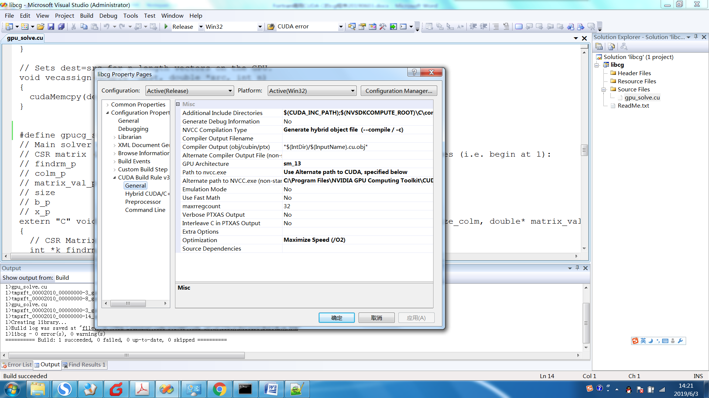
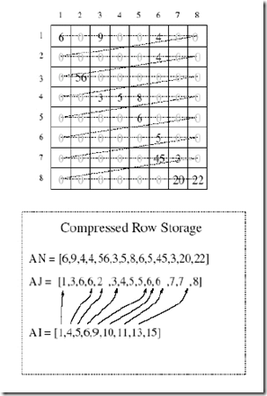
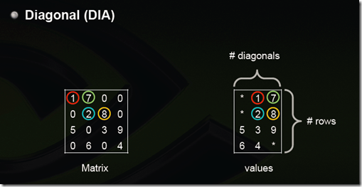
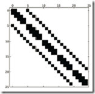
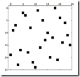
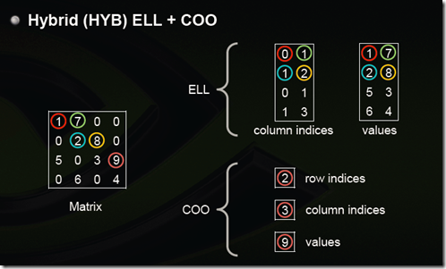
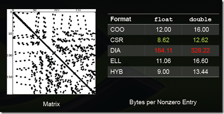

# 稀疏矩阵的存储形式

## 1、Coordinate（COO）

这是最简单的一种格式，每一个元素需要用一个三元组来表示，分别是（行号，列号，数值），对应上图右边的一列。这种方式简单，但是记录单信息多（行列），每个三元组自己可以定位，因此空间不是最优。

## 2、Compressed Sparse Row Format (CSR) 

CSR是比较标准的一种，也需要三类数据来表达：数值，列号，以及行偏移。CSR不是三元组，而是整体的编码方式。数值和列号与COO一致，表示一个元素以及其列号，行偏移表示某一行的第一个元素在values里面的起始偏移位置。如上图中，第一行元素1是0偏移，第二行元素2是2偏移，第三行元素5是4偏移，第4行元素6是7偏移。在行偏移的最后补上矩阵总的元素个数，本例中是9。

### 2.1基本定义

压缩稀疏行格式(CSR)通过四个数组确定： values, columns, pointer B,
pointer E.\
数组values：是一个实（复）数，包含矩阵A中的非0元，以行优先的形式保存；数组columns：第i个整型元素代表矩阵A中第i列；\
数组pointer
B：第j个整型元素给出矩阵A行j中第一个非0元的位置，等价于pointer B(j)
-pointer B(1)+1 ；\
数组pointer
E：第j个整型元素给出矩阵A第j行最后一个非0元的位置，等价于pointer
E(j)-pointer B(1)。

### 2.2 Intel MKL CSR

The Intel MKL compressed sparse row (CSR) format is specified by four
arrays: the [values, columns, pointer B, and pointer E]{.mark}. The
following table describes the arrays in terms of the values, row, and
column positions of the non-zero elements in a sparse matrix A.

[values]（稀疏系数矩阵的非零元素值）

A real or complex array that contains the non-zero elements of A. Values
of the non-zero elements of A are mapped into the values array using the
row-major storage mapping described above.

[columns]（非零元素对应各自列中的序号）

Element i of the integer array columns is the number of the column in A
that contains the i-th value in the values array.

[pointer B]{.mark}

Element j of this integer array gives the index of the element in the
values array that is first non-zero element in a row j of A. Note that
this index is equal to pointer B(j) - pointer B(1)+1 .

[pointer E]{.mark}

An integer array that contains row indices, such that pointer E(j)-
pointer B(1) is the index of the element in the values array that is
last non-zero element in a row j of A.

### 2.3 再看一个例子

## 3、CSC

CSC是和CSR相对应的一种方式，即按列压缩的意思。

以上图中矩阵为例：

Values：         \[1 5 7 2 6 8 3 9 4\]

Row Indices： \[0 2 0 1 3 1 2 2 3\]

Column Offsets：\[0 2 5 7 9\]

## 4、ELLPACK (ELL)

用两个和原始矩阵相同行数的矩阵来存：第一个矩阵存的是列号，第二个矩阵存的是数值，行号就不存了，用自身所在的行来表示；这两个矩阵每一行都是从头开始放，如果没有元素了就用个标志比如\*结束。上图中间矩阵有误，第三行应该是 
0 2 3。

注：这样如果某一行很多元素，那么后面两个矩阵就会很胖，其他行结尾\*很多，浪费。可以存成数组，比如上面两个矩阵就是：

0 1 \* 1 2 \* 0 2 3 \* 1 3 \*

1 7 \* 2 8 \* 5 3 9 \* 6 4 \*

但是这样要取一行就比较不方便了

## 5、Diagonal (DIA)

对角线存储法，按对角线方式存，列代表对角线，行代表行。省略全零的对角线。(从左下往右上开始：第一个对角线是零忽略，第二个对角线是5，6，第三个对角线是零忽略，第四个对角线是1，2，3，4，第五个对角线是7，8，9，第六第七个对角线忽略)。\[3\]

这里行对应行，所以5和6是分别在第三行第四行的，前面补上无效元素\*。如果对角线中间有0，存的时候也需要补0，所以如果原始矩阵就是一个对角性很好的矩阵那压缩率会非常高，比如下图，但是如果是随机的那效率会非常糟糕。

## 6、Hybrid (HYB) ELL + COO

为了解决（3）ELL中提到的，如果某一行特别多，造成其他行的浪费，那么把这些多出来的元素（比如第三行的9，其他每一行最大都是2个元素）用COO单独存储。

选择稀疏矩阵存储格式的一些经验：

1.  DIA和ELL格式在进行稀疏矩阵-矢量乘积(sparse matrix-vector
    products)时效率最高，所以它们是应用迭代法(如共轭梯度法)解稀疏线性系统最快的格式；

2.  COO和CSR格式比起DIA和ELL来，更加灵活，易于操作；

3.  ELL的优点是快速，而COO优点是灵活，二者结合后的HYB格式是一种不错的稀疏矩阵表示格式；

4.  根据[Nathan
    Bell的工作](http://www.bu.edu/pasi/files/2011/01/NathanBell1-10-1000.pdf)，CSR格式在存储稀疏矩阵时非零元素平均使用的字节数(Bytes
    per Nonzero
    Entry)最为稳定（float类型约为8.5，double类型约为12.5），而DIA格式存储数据的非零元素平均使用的字节数与矩阵类型有较大关系，适合于StructuredMesh结构的稀疏矩阵（float类型约为4.05，double类型约为8.10），对于Unstructured
    Mesh以及Random Matrix, DIA格式使用的字节数是CSR格式的十几倍；

5.  从我使用过的一些线性代数计算库来说，COO格式常用于从文件中进行稀疏矩阵的读写，如matrix
    market即采用COO格式，而CSR格式常用于读入数据后进行稀疏矩阵计算。

一些特殊类型矩阵的存储效率（数值越小说明压缩率越高，即存储效率越高）:

Structured Mesh

Unstructured Mesh

Random matrix

Power-Law Graph

## 格式适用性总结：

## 6. Skyline Storage Format

The skyline storage format is important for the direct sparse solvers,
and it is well suited for Cholesky or LU decomposition when no pivoting
is required.

The skyline storage format accepted in Intel MKL can store only
triangular matrix or triangular part of a matrix. This format is
specified by two arrays: *values* and*pointers*. The following table
describes these arrays:

*values*

> A scalar array. For a lower triangular matrix it contains the set of
> elements from each row of the matrix starting from the first non-zero
> element to and including the diagonal element. For an upper triangular
> matrix it contains the set of elements from each column of the matrix
> starting with the first non-zero element down to and including the
> diagonal element. Encountered zero elements are included in the sets.

*pointers*

> An integer array with dimension(*m*+1), where *m* is the number of
> rows for lower triangle (columns for the upper
> triangle).*pointers*(*i*) -*pointers*(1)+1gives the index of element
> in*values* that is first non-zero element in row (column)*i*. The
> value of*pointers*(*m*+1)is set to*nnz*+*pointers*(1), where*nnz* is
> the number of elements in the array*values*.

## 7. Block Compressed Sparse Row Format (BSR)

The Intel MKL block compressed sparse row (BSR) format for sparse
matrices is specified by four arrays: *values*, *columns*, *pointer B*,
and *pointer E*. The following table describes these arrays.

*values*

> A real array that contains the elements of the non-zero blocks of a
> sparse matrix. The elements are stored block-by-block in row-major
> order. A non-zero block is the block that contains at least one
> non-zero element. All elements of non-zero blocks are stored, even if
> some of them is equal to zero. Within each non-zero block elements are
> stored in column-major order in the case of one-based indexing, and in
> row-major order in the case of the zero-based indexing.

*columns*

> Element *i* of the integer array *columns* is the number of the column
> in the block matrix that contains the*i*-th non-zero block.

*pointerB*

> Element *j* of this integer array gives the index of the element in
> the*columns* array that is first non-zero block in a row*j* of the
> block matrix.

*pointerE*

Element *j* of this integer array gives the index of the element in
the*columns* array that contains the last non-zero block in a row*j* of
the block matrix plus 1.

## 参考文献

\[1\] Sparse Matrix Representations & Iterative Solvers, Lesson 1 by
Nathan Bell.
<http://www.bu.edu/pasi/files/2011/01/NathanBell1-10-1000.pdf>

\[2\] <http://blog.csdn.net/anshan1984/article/details/8580952>

\[3\] <http://zhangjunhd.github.io/2014/09/29/sparse-matrix.html>

\[4\] <http://www.360doc.com/content/09/0204/17/96202_2458312.shtml>

\[5\] Implementing Sparse Matrix-Vector Multiplication on
Throughput-Oriented Processors, Nathan Bell and Michael Garland,
Proceedings of Supercomputing \'09

\[6\] Efficient Sparse Matrix-Vector Multiplication on CUDA, Nathan Bell
and Michael Garland, NVIDIA Technical Report NVR-2008-004, December 2008
