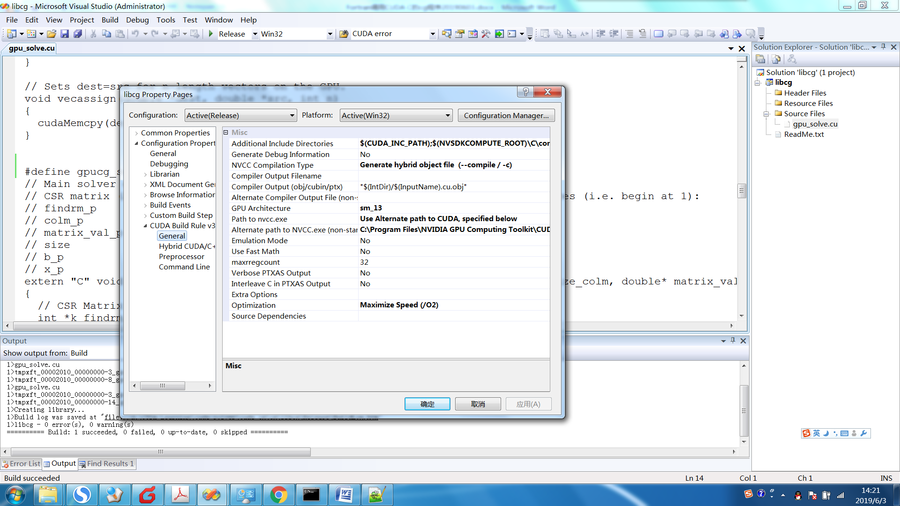

# 使用Fortran调用Graham Markall编写的CUDA_C_PCG程序

## 求解大型线性方程组

参考：Yousef Saad. Iterative methods for sparse linear system

算法较容易理解，但落实到计算机编程，特别是并行化，难度还是很大的。

近年来，CPU性能的挖掘越来越依赖于SIMD指令(SSE, AVX)

还有复杂的架构，CUDA、Xeon Phi

## 求解器总结

常见的，用于求解常微分方程的求解器：SUNDIALS_CVODE

用于求解偏微分方程的求解器：

（1）直接求解算法

MUMPS

（2）迭代求解算法

### a 单机，纯CPU，单线程（部分操作多线程）

Eigen

Blaze (blaze-lib/blaze-Bitbucket)

Armadillo (C++ linear algebra library)

Intel MKL

### b 单机，混合CPU/GPU, 多线程

MAGMA: CUDA+CPU, openCL, Xeon phi

ViennaCL (Linear algebra Library using CUDA, OpenCL and
OpenMP)，与MAGMA类似

Paralution (MPI的是商业程序，收费)

ArrayFire

AmgX (Nvidia) (MPI等都是免费，开源代码)

### c 集群，MPI

PETSc (C)

Trilinos (C++)

Hypre (C)

## CUDA_JCG (最简单的CUDA_JCG)

[Graham Markall (2009)]{.mark}编写的CUDA
C版本的PCG程序，是采用Jacobi预处理的CG法，原本是用于加速求解[FLUIDITY模型（CFD）]{.mark}中离散的大型对称正定稀疏矩阵的子程序。采用CSR格式存储稀疏系数矩阵，然后可以被C或CPP语言的CFD代码调用。

因此，一般的海洋动力学模型（FVCOM和SCHISM模型）都是FORTRAN语言编写，本研究成功在FORTRAN程序中调用CUDA_C_PCG，编译过程记录如下：

（1）安装赵开勇博士开发的CUDA_VS_WIZARD程序；

（2）安装CUDA_4.0的toolkit；

（3）编译PCG的lib文件：

GPU架构只能选择最高的sm_13]

指定nvcc的路径

runtime library一定要选择 

（4）调用lib程序：

配置好CUDA_4.0的[include和lib64]{.mark}路径；以及，刚才编译的lib文件路径

INPUT： cuda.lib cudart.lib libcg.lib

注意：External Procedures中设置：Name case interpretation: [Lower
Case]{.mark}

## CUDA_BiCGStab

Fortran语言编写

## ViennaCL

Examples 5: Iterative Solvers

ViennaCL provides different iterative solvers for various classes of
matrices and is not restricted to built-in types. Since the interface of
ViennaCL types is compatible
with [[uBLAS]{.underline}](http://www.boost.org/doc/libs/release/libs/numeric/) objects,
the iterative solvers can directly be called
with [[uBLAS]{.underline}](http://www.boost.org/doc/libs/release/libs/numeric/) objects.
ViennaCL 1.0.x provides the following iterative solvers:

Conjugate Gradient (*viennacl::linalg::cg_tag*)

Stabilized Bi-Conjugate Gradient (*viennacl::linalg::bicgstab_tag*)

Generalized Minimum Residual (*viennacl::linalg::gmres_tag*)

An optional incomplete LU factorization with threshold can be used as
preconditioner.

Iterative solvers in ViennaCL

**typedef** **float** ScalarType;

//typedef double ScalarType; //use this if your GPU supports double
precision

// Set up some ublas objects:

ublas::vector\<ScalarType\> ublas_rhs;

ublas::vector\<ScalarType\> ublas_result;

ublas::compressed_matrix\<ScalarType\> ublas_matrix;

// Set up some ViennaCL objects:

viennacl::vector\<ScalarType\> vcl_rhs;

viennacl::vector\<ScalarType\> vcl_result;

viennacl::compressed_matrix\<ScalarType\> vcl_matrix;

*/\* Initialize and fill all objects here \*/*

//

// Compute ILUT preconditioners for CPU and for GPU objects:

//

viennacl::linalg::ilut_tag ilut_conf(10, 1e-5); //10 entries, rel. tol.
1e-5

**typedef** viennacl::linalg::ilut_precond\<

ublas::compressed_matrix\<ScalarType\> \> ublas_ilut_t;

//preconditioner for ublas objects:

ublas_ilut_t ublas_ilut(ublas_matrix, ilut_conf);

viennacl::linalg::ilut_precond\<

viennacl::compressed_matrix\<ScalarType\> \> vcl_ilut_t;

//preconditioner for ViennaCL objects:

vcl_ilut_t vcl_ilut(vcl_matrix, ilut_conf);

//

// Conjugate gradient solver without preconditioner:

//

ublas_result = solve(ublas_matrix, //using ublas objects on CPU

ublas_rhs,

viennacl::linalg::cg_tag());

vcl_result = solve(vcl_matrix, //using viennacl objects on GPU

vcl_rhs,

viennacl::linalg::cg_tag());

//

// Conjugate gradient solver using ILUT preconditioner

//

ublas_result = solve(ublas_matrix, //using ublas objects on CPU

ublas_rhs,

viennacl::linalg::cg_tag(),

ublas_ilut);

vcl_result = solve(vcl_matrix, //using viennacl objects on GPU

vcl_rhs,

viennacl::linalg::cg_tag(),

vcl_ilut);

// for BiCGStab and GMRES, use the solver tags

// viennacl::linalg::bicgstab_tag and viennacl::linalg::gmres_tag

// instead of viennacl::linalg::cg_tag in the calls above.
