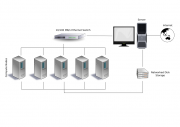
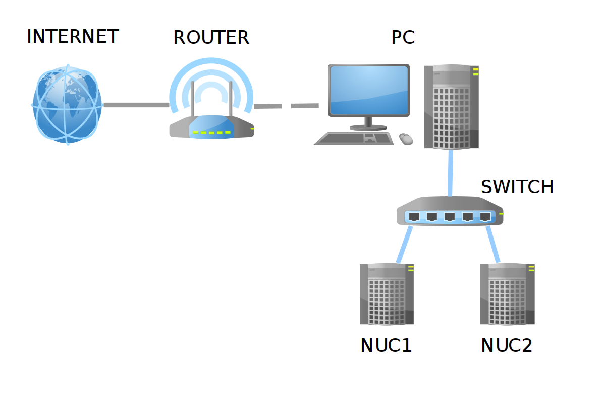

考虑构建自己的小型计算集群，体型够小，可以放在办公桌上，可以携带。利用现在的多核处理器，强调CPU性能，不要求高GPU性能（不做图形处理和游戏），尽可能降低价格，提高性价比。

主板与CPU的搭配

<http://power.zol.com.cn/666/6665093_all.html>

MicroWulf的链接

http://www.calvin.edu/\~adams/research/microwulf/

硬件配置可上中关村在线

http://detail.zol.com.cn/motherboard/asus/s2132_s1280_s1168/

表1硬件购置列表

  --------------------------------------------------------------------------------------------------------------------------------------------------
  组件           型号               参数                                                         报价      数量   说明
  -------------- ------------------ ------------------------------------------------------------ --------- ------ ----------------------------------
  主板           技嘉B450M DS3H     AMD B450;Micro                                               599元     1      需要独立显卡，按最低配置
                                    ATX板型，外形尺寸：24.4\*21.5cm；千兆网卡；内存类型4\*DDR4                    

  处理器(CPU)     AMD Ryzen 7 2700X 主频3.7GHz，最大睿频4.3GHz,8核心16线程，4MB二级缓存          2499元    1      至关重要的部件，主板需要与之匹配

  内存           金士顿HyperX       内存8GB，类型：DDR4，主频：3000MHz                           499元     1      单条8GB
                 Savage                                                                                           

  电源           航嘉WD500K         额定功率500W                                                 339元     1      稳定电流

  网卡            Intel 9301CT      总线：PCI-E 1x，千兆以太网；RJ-45接口类型                    288元     1      平衡集成网卡的数据荷载

  显卡           华硕R5             频率1200MHz, 显卡容量1GB；核心频率625MHz                     299元     1      入门级
                 230-SL-1GD3-L                                                                                    

  路由器         TP-Link TL-R473G   5口，千兆，有线路由器                                        269元     1      用于节点间数据交换

  千兆网线       胜为               六类千兆网线，纯铜                                           30元/根   4      连接节点

  硬盘            西部数据          500GB 7200转 16MB SATA3                                      427元     1      

  CPU散热器      九州风神玄冰S40    噪音17.8-21dB                                                139元     1      CPU已带散热器

  风扇（制冷）                                                                                   50元/个          尽量降低噪音

  KVM切换器                                                                                                       可选

  稳压器、UPS    克雷士S1000VA      后备时间\>30分钟                                             275元            可选

  支架                                                                                                            五金店购买

  螺丝                                                                                                            五金店购买
  --------------------------------------------------------------------------------------------------------------------------------------------------

经计算，1个计算节点的成本不超过4500元。

AMD 锐龙二代 Ryzen7 2700X-CPU详细技术参数

  ------------------------------------------------------------------------------
  AMD 锐龙二代 Ryzen7   
  2700X参数方面         
  --------------------- --------------------------------------------------------
  核心代号              Pinnacle Ridge

  接口类似              AM4

  核心线程              8核16线程

  CPU主频               基础频率3.7GHz，最大加速频率4.3GHz

  内存支持              双通道DDR4-2933MHz

  核心显卡              无（需要独立显卡）

  缓存                  16MB三级缓存、4MB二级缓存

  是否支持Optane/vPro   支持

  制作工艺              12nm

  设计功耗              105W

  不锁频                是

  散热器                全新的幽灵Prism(LED)散热器
  ------------------------------------------------------------------------------

处理器必须兼容主板方可正常使用，否则影响整个平台的搭建。AMD锐龙R7
2700X依旧采用的是AMD全新AM4接口，需要搭载全新AM4接口系列主板，不再兼容AMD上一代的FM2+/AM3接口主板。

R7
2700X可以搭配X370、B350、B320等300系芯片组主板。但是目前AMD也正式发布了全新400系芯片主板，其中有X470和B450

这款处理器最佳搭配首选主流级B450主板。

技嘉B450M DS3H**主板详细参数**

**看来是首选！**

  ------------------------------------------------------------------------
  主板芯片      
  ------------- ----------------------------------------------------------
  集成芯片      [声卡/网卡](http://detail.zol.com.cn/motherboard/s1169/)

  主芯片组      **AMD B450**

  芯片组描述    采用AMD B450芯片组

  显示芯片      APU内置显示芯片（需要APU支持）

  音频芯片      集成Realtek ALC887 8声道音效芯片

  网卡芯片      板载Realtek千兆网卡
  ------------------------------------------------------------------------

  -----------------------------------------------------------------------
  处理器规格    
  ------------- ---------------------------------------------------------
  CPU类型       第二代/第一代AMD Ryzen/Ryzen with Radeon Vega Graphics

  CPU插槽       [Socket AM4](http://detail.zol.com.cn/motherboard/s7259/)
  -----------------------------------------------------------------------

  ------------------------------------------------------------------------
  内存规格       
  -------------- ---------------------------------------------------------
  内存类型       [4×DDR4
                 DIMM](http://detail.zol.com.cn/motherboard/p2945/)

  最大内存容量   [64GB](http://detail.zol.com.cn/motherboard/p24211/)

  内存描述       支持双通道DDR4 2933/2667/2400/2133MHz内存
  ------------------------------------------------------------------------

  ---------------------------------------------------------------------------------
  存储扩展      
  ------------- -------------------------------------------------------------------
  PCI-E标准     [PCI-E 3.0](http://detail.zol.com.cn/motherboard/s6788/)

  PCI-E插槽     2×PCI-E X16显卡插槽，1×PCI-E X1插槽

  存储接口      [1×M.2接口](http://detail.zol.com.cn/motherboard/p26562/)，4×SATA
                III接口
  ---------------------------------------------------------------------------------

  ------------------------------------------------------------------------------------------------------------------------------------
  I/O接口       
  ------------- ----------------------------------------------------------------------------------------------------------------------
  USB接口       [8×USB3.1 Gen1 接口（4内置+4背板）](http://detail.zol.com.cn/motherboard/p17458/)，6×USB2.0接口（2内置+4背板）

  视频接口      [1×DVI接口](http://detail.zol.com.cn/motherboard/p6791/)，[1×HDMI接口](http://detail.zol.com.cn/motherboard/p31454/)

  电源插口      一个8针，一个24针电源接口

  其它接口      1×RJ45网络接口，3×音频接口，1×PS/2键鼠通用接口
  ------------------------------------------------------------------------------------------------------------------------------------

  -----------------------------------------------------------------------
  板型          
  ------------- ---------------------------------------------------------
  主板板型      [Micro
                ATX板型](http://detail.zol.com.cn/motherboard/s1280/)

  外形尺寸      24.4×21.5cm
  -----------------------------------------------------------------------

  -----------------------------------------------------------------------
  软件管理      
  ------------- ---------------------------------------------------------
  BIOS性能      1x128Mbit flash\
                Use of licensed AMI UEFI BIOS\
                Support for DualBIOS\
                PnP 1.0a，DMI 2.7，WfM 2.0，SM BIOS 2.7，ACPI 5.0

  -----------------------------------------------------------------------

  ------------------------------------------------------------------------
  其它参数      
  ------------- ----------------------------------------------------------
  多显卡技术    支持AMD Quad-GPU CrossFireX双卡四芯交火技术\
                支持AMD 2-Way CrossFireX技术

  供电模式      七相

  RAID功能      支持RAID 0，1，10

  硬件监控      电压检测\
                温度检测\
                风扇转速检测\
                过温警告\
                风扇故障警告\
                智能风扇控制

  其它特点      [支持HIFI](http://detail.zol.com.cn/motherboard/p29941/)

  上市日期      2018年04月
  ------------------------------------------------------------------------

  -----------------------------------------------------------------------
  主板附件      
  ------------- ---------------------------------------------------------
  包装清单      主板 x1\
                使用手册 x1\
                驱动光盘 x1\
                I/O背板 x1\
                SATA 6.0Gb/s线 x4\
                PRO GAMING线缆标签x1\
                M.2 螺丝 x1

  -----------------------------------------------------------------------

16核以上的AMD
CPU，一般用于工作站，得用TR4接口。主板没有Micro_ATX板型，都是用E-ATX板型。

华硕ROG STRIX X399-E GAMING详细参数

  -----------------------------------------------------------------------------
  主板芯片      
  ------------- ---------------------------------------------------------------
  集成芯片      [显卡/声卡/网卡](http://detail.zol.com.cn/motherboard/s1168/)

  主芯片组      [AMD X399](http://detail.zol.com.cn/motherboard/s7415/)

  芯片组描述    采用AMD X399芯片组

  显示芯片      APU内置显示芯片（需要APU支持）

  音频芯片      集成Realtek ALC1220 8声道音效芯片

  网卡芯片      板载Intel I211-AT千兆网卡
  -----------------------------------------------------------------------------

  -----------------------------------------------------------------------
  处理器规格    
  ------------- ---------------------------------------------------------
  **CPU类型**   AMD Ryzen Threadripper处理器

  **CPU插槽**   [**Socket
                TR4**](http://detail.zol.com.cn/motherboard/s7416/)
  -----------------------------------------------------------------------

  -------------------------------------------------------------------------------------------------
  内存规格       
  -------------- ----------------------------------------------------------------------------------
  内存类型       8×DDR4 DIMM

  最大内存容量   [128GB](http://detail.zol.com.cn/motherboard/p30655/)

  内存描述       支持四通道DDR4
                 3600(超频)/3466(超频)/3333(超频)/3200(超频)/3000(超频)/2800(超频)/2666/2400/2133
                 MHz内存
  -------------------------------------------------------------------------------------------------

  ---------------------------------------------------------------------------------------------
  存储扩展      
  ------------- -------------------------------------------------------------------------------
  PCI-E标准     [PCI-E 3.0](http://detail.zol.com.cn/motherboard/s6788/)

  PCI-E插槽     4×PCI-E X16显卡插槽，1×PCI-E X4插槽，1×PCI-E X1插槽

  存储接口      [1×U.2接口](http://detail.zol.com.cn/motherboard/p29750/)，2×M.2接口，[6×SATA
                III接口](http://detail.zol.com.cn/motherboard/p14954/)
  ---------------------------------------------------------------------------------------------

  ------------------------------------------------------------------------------------------------------------------------------------------
  I/O接口       
  ------------- ----------------------------------------------------------------------------------------------------------------------------
  USB接口       9×USB3.1 Type-A接口，[1×USB3.1 Type-C接口](http://detail.zol.com.cn/motherboard/p27646/)，[1×USB3.1 Gen2
                接口](http://detail.zol.com.cn/motherboard/p13034/)，4×USB3.1 Gen1 接口（4内置），4×USB2.0接口（4内置）

  电源插口      一个4针，一个8针，一个24针电源接口

  其它接口      1×RJ45网络接口，1×光纤接口，5×音频接口，2×RGB灯条接口，3×机箱风扇接口，1×M.2_风扇接口，1×CPU可选风扇接口，1×前面板音频接口
                (AAFP)，1×系统面板接口，1×温度传感器接口，1×AIO_水泵接口，1×W_PUMP+接口
  ------------------------------------------------------------------------------------------------------------------------------------------

  ------------------------------------------------------------------------
  板型          
  ------------- ----------------------------------------------------------
  主板板型      [E-ATX板型](http://detail.zol.com.cn/motherboard/s4161/)

  外形尺寸      30.5×26.9cm
  ------------------------------------------------------------------------

  -----------------------------------------------------------------------
  软件管理      
  ------------- ---------------------------------------------------------
  BIOS性能      128 Mb Flash ROM，UEFI AMI BIOS，PnP，WfM2.0，SM BIOS
                3.0，ACPI 6.1，多国语言 BIOS，ASUS EZ Flash 3，CrashFree
                BIOS 3，F11 EZ Tuning Wizard，F6 Qfan Control，F3
                收藏夹，历史记录，F12 截屏和华硕 DRAM SPD(Serial Presence
                Detect)内存信息

  -----------------------------------------------------------------------

  -----------------------------------------------------------------------------------------------
  其它参数      
  ------------- ---------------------------------------------------------------------------------
  多显卡技术    支持NVIDIA Quad-GPU SLI双卡四芯交火技术\
                支持NVIDIA 3-Way SLI三路交火技术\
                支持AMD Quad-GPU CrossFireX双卡四芯交火技术\
                支持NVIDIA 2-Way SLI技术\
                支持AMD 3-Way CrossFireX三路交火技术\
                支持AMD 2-Way CrossFireX技术

  RAID功能      支持RAID 0，1，10

  其它特点      无线：支持802.11
                a/b/g/n/acWiFi标准，[支持蓝牙4.2](http://detail.zol.com.cn/motherboard/p25616/)

  上市日期      2017年08月
  -----------------------------------------------------------------------------------------------

盈通显卡：接口类型：PCI-E 2.1

# Microwulf集群

## 硬件配置及价格

Microwulf集群的硬件配置及价格单

  ----------------------------------------------------------------------------------------------------------------------------------------------------------
  Component     Product                                                                                                   Unit Price Quantity   Total
  ------------- --------------------------------------------------------------------------------------------------------- ---------- ---------- ------------
  Motherboard   [MSI K9N6PGM-F MicroATX](http://www.msicomputer.com/product/p_spec.asp?model=K9N6PGM-F&class=mb)          \$80.00    4          \$320.00

  CPU           [AMD Athlon 64 X2 3800+ AM2                                                                               \$165.00   4          \$660.00
                CPU](http://www.amd.com/us-en/Processors/ProductInformation/0,,30_118_9485_13041,00.html)                                       

  Main Memory   [Kingston DDR2-667 1GByte RAM](http://www.shop.kingston.com/partsinfo.asp?ktcpartno=KVR667D2N5K2/1G)      \$124.00   8          \$992.00

  Power Supply  [Echo Star 325W MicroATX Power Supply](http://www.geeks.com/details.asp?invtid=ESTAR-325-N&cat=CAS)       \$19.00    4          \$76.00

  Network       [Intel PRO/1000 PT PCI-Express                                                                            \$41.00    4          \$164.00
  Adaptor       NIC](http://www.intel.com/network/connectivity/products/pro1000pt_desktop_adapter.htm) (node-to-switch)                         

  Network       [Intel PRO/100 S PCI                                                                                      \$15.00    1          \$15.00
  Adaptor       NIC](http://www.intel.com/network/connectivity/products/pro100s_adapter.htm) (master-to-world)                                  

  Switch        [Trendware TEG-S80TXE 8-port Gigabit Ethernet Switch](http://www.trendnet.com/products/TEG-S80TXE.htm)    \$75.00    1          \$75.00

  Hard drive    [Seagate 7200 250GB SATA hard                                                                             \$92.00    1          \$92.00
                drive](http://www.seagate.com/cda/products/discsales/marketing/detail/0,1596,701,00.html)                                       

  DVD/CD drive  [Liteon SHD-16S1S 16X](http://us.liteonit.com/us/index.php?option=com_content&task=view&id=199&Itemid=99) \$19.00    1          \$19.00

  Cooling       [Zalman ZM-F3 120mm Case Fans](http://www.zalman.co.kr/eng/product/view.asp?idx=197)                      \$8.00     4          \$32.00

  Fan           [Generic NET12 Fan Grill (120mm)](http://www.newegg.com/Product/Product.aspx?Item=N82E16811999204)        \$1.50\    4          \$10.00
  protective                                                                                                              + shipping            
  grills                                                                                                                                        

  Support       36\" x 0.25\" threaded rods                                                                               \$1.68     3          \$5.00
  Hardware                                                                                                                                      

  Fastener      Lots of 0.25\" nuts and washers                                                                                                 \$10.00
  Hardware                                                                                                                                      

  Case/shell    12\" x 11\" polycarbonate pieces\                                                                         \$0.00     4          \$0.00
                (scraps from our Physical Plant)                                                                                                

  Total                                                                                                                                         \$2,470.00
  ----------------------------------------------------------------------------------------------------------------------------------------------------------

Non-Essentials

  -------------------------------------------------------------------------------------------------------------------------------------------------
  Component      Product                                                                                             Unit      Quantity   Total
                                                                                                                     Price                
  -------------- --------------------------------------------------------------------------------------------------- --------- ---------- ---------
  KVM Switch     [[Linkskey                                                                                          \$50.00   1          \$50.00
                 LKV-S04ASK]{.underline}](http://www.linkskey.com/detail.php?Productid=186&ProductName=LKV-S04ASK)                        

  Total                                                                                                                                   \$50.00
  -------------------------------------------------------------------------------------------------------------------------------------------------

## 设计

Microwulf的设计标准是：低成本，高性能，可兼容，便于携带的个人Beowulf集群。

使用Micro ATX主板和有机玻璃框架，尽可能减小占有空间。

4个节点，每台双核，共8核，每台内存2GB，1GB/核。主板有千兆集成网卡，另安装PCI插槽的网卡，在2个网卡之间平衡数据通信荷载。使用8口的千兆以太数据交换机连接网卡。

底层主板为"主"计算节点，其他为"服务器"节点，主节点安装硬盘设备，用于安装系统（根系统），其他3个节点通过网络使用**PXE**启动。

Microwulf集群使用Ubuntu Linux操作系统。使用Open MPI通信。

{width="4.708333333333333in"
height="3.2381944444444444in"}

Microwulf小集群的构架图

{width="5.768055555555556in"
height="1.8428641732283464in"}

Microwulf集群的节点连接

## 照片

\"west\" side展示了电源，排气风扇，底部的千兆以太交换机。

{width="4.747222222222222in"
height="3.5597495625546807in"}

{width="4.648257874015748in"
height="3.485540244969379in"}

Southwest View

South
View展示了Microbulf的4块主板，每个主板配有2个千兆以太网卡（黑线连接主板集成网卡，绿线连接PCI插槽网卡）。底部主板是主节点，它有100MB的以太网卡（黄线）连接Internet，通过VGA端口和蓝线连接显示器。

{width="4.937431102362205in"
height="3.7023797025371827in"}

South View

\"southeast\"
view展示了进口风扇，底部前端是光驱（现在已经不需要了），后端是硬盘。

{width="4.961244531933509in"
height="3.720237314085739in"}

\"north\" view展示了电源和插座。

{width="4.969678477690289in"
height="3.7265605861767277in"}

## 性能

超级计算机的性能一般用flops来衡量，flops\--计算机每秒钟可执行的浮点运算指令数，早期的超级计算机以megaflops
(Mflops: 10^6^ flops)来衡量，还有gigaflops (10^9^ flops), teraflops
(10^12^ flops), petaflops (10^15^ flops)。

在讨论计算机性能时，需要区分：

1、峰值性能\--计算机可能达到的理论最高性能；

2、测试性能\--计算机运行测试程序时实际能达到的最大性能。

实际应用中，测试性能一般是峰值性能的50\~60%。

双精度浮点运算与单精度浮点运算的性能表现很不同，双精度浮点运算比单精度浮点运算更耗时。

top500.org上公布的超级计算机排名，都是使用标准的双精度HPL程序测试的结果。

Microwulf测试性能是：26.25Gflops

1996年 Cray T3D-256 的测试性能是25.3 Gflops 

## 计算效率

计算机的计算效率等于测试性能(R~Max~)除以理论峰值(R~Peak~)

homogeneous集群的峰值性能可如下计算：

R~Peak~=#nodes X#cores-per-nodeX floating-point-units-per core X
clock-speed

Microwulf: R~Peak~ = 4 x 2 x 2 x 2.0 = 32.0

线程 = cores-per-node X floating-point-units-per core，例如：8核16线程

So Microwulf\'s computational efficiency is:

compEff = 26.25 / 32.0 = 0.8203 \~= **82%**

Generally, anything over 60 % efficiency is considered good, so
Microwulf\'s 82% computational efficiency is excellent.

For comparison, the computational efficiency of a 1996 Cray T3D-256 was:

compEff = 25.3 / 33.4 = 0.6588 \~= **66%**

## 成本效率

cost efficiency = price/performance ratio

Microwulf: With
a [price](http://www.calvin.edu/~adams/research/microwulf/budget/) of
just \$2470
and [performance](http://www.calvin.edu/~adams/research/microwulf/performance/) of
26.25 Gflops, Microwulf\'s price/performance ratio (PPR) is
\$94.10/Gflop, or less than \$0.10/Mflop! 

尽管Microwulf不具有Tflops的性能，但可提供低成本的高性能计算。

## 电能效率

power/performance ratio

We have metered Microwulf\'s power consumption:

-   At idle, it consumes 250 watts,

-   Under load, it consumes 450 watts,

Since Microwulf is only doing anything useful when it is under load, its
power/performance ratio is 450 watts / 26.25 Gflops = **17.14
watts/Gflop** (under load).

While most clusters publicize their performance data, Very few clusters
publicize their power consumption data.

1 / 17.14 W/Gflop \* 1000 Mflops/Gflop= **58.34 Mflops/W**

对比集群：Green500.org
